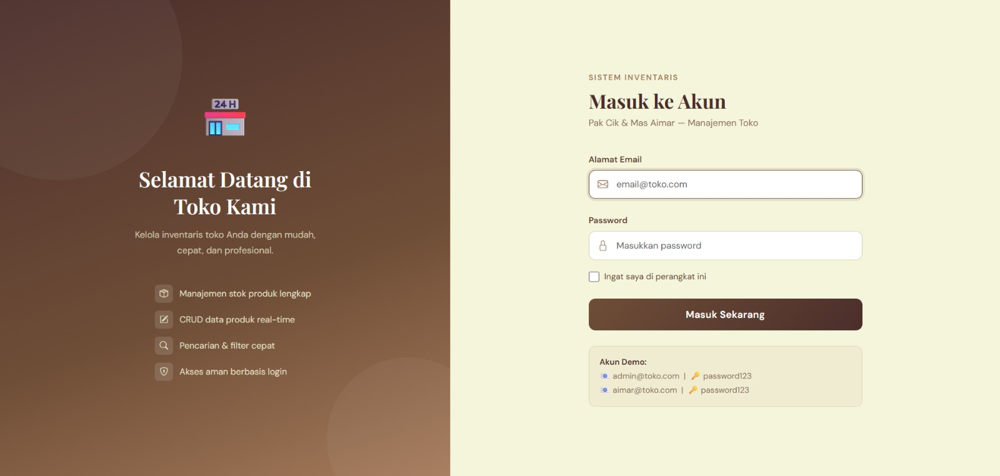
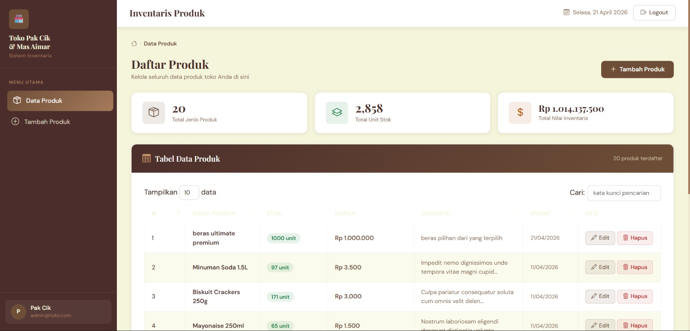
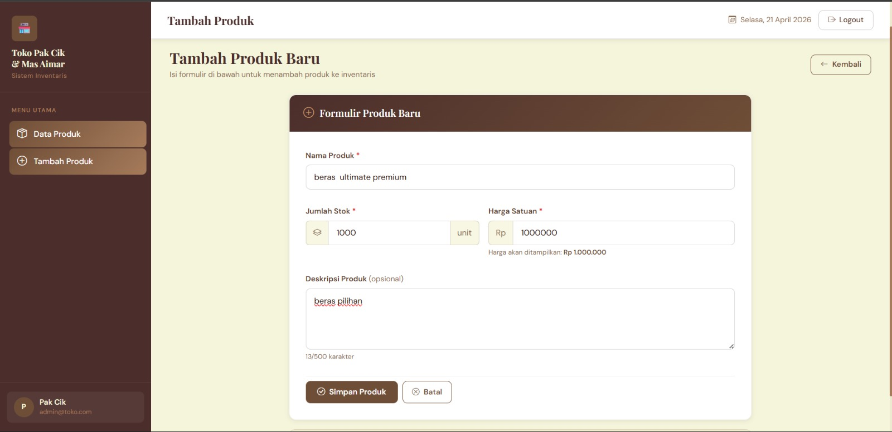
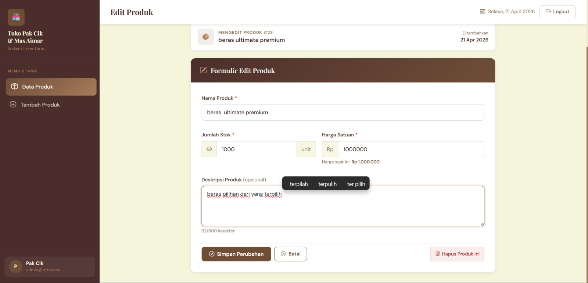
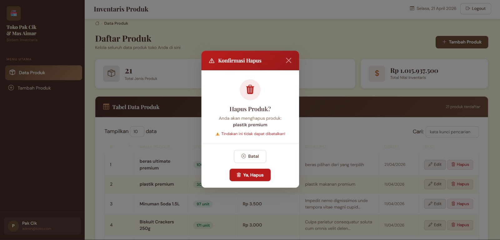

<div align="center">
  <br />
  <h1>LAPORAN PRAKTIKUM <br>APLIKASI BERBASIS PLATFORM</h1>
  <br />
  <h3>MODUL 11, 12 & 13 <br> Laravel: Migration, Seeder, CRUD & Authentication</h3>
  <br />
  <br />
  
  <br />
  <br />
  <br />
  <h3>Disusun Oleh :</h3>
  <p>
    <strong>Rafaldo Al Maqdis</strong><br>
    <strong>2311102099</strong><br>
    <strong>S1 IF-11-REG01</strong><br>
  </p>
  <br />
  <h3>Dosen Pengampu :</h3>
  <p>
    <strong>Dimas Fanny Hebrasianto Permadi, S.ST., M.Kom</strong>
  </p>
  <br />
  <h3>Asisten Praktikum :</h3>
  <p>
    <strong>Apri Pandu Wicaksono</strong><br>
    <strong>Rangga Pradarrell Fathi</strong><br>
  </p>
  <br />
  <h3>LABORATORIUM HIGH PERFORMANCE<br>FAKULTAS INFORMATIKA <br>TELKOM UNIVERSITY PURWOKERTO <br>2026</h3>
</div>

---
## Dasar Teori

### 1. Framework Laravel

Laravel adalah framework web berbasis PHP yang dirancang untuk membangun aplikasi web dengan sintaks yang rapi, ekspresif, dan terstruktur. Laravel menyediakan banyak fitur bawaan seperti routing, controller, middleware, session, validasi, ORM Eloquent, migration, seeder, dan Blade template. Karena itu, Laravel sangat cocok digunakan untuk membangun sistem inventaris toko sederhana yang membutuhkan pengelolaan data, autentikasi pengguna, dan tampilan yang terorganisir. ([Laravel][1])

Pada project inventaris ini, Laravel berperan sebagai fondasi utama aplikasi. Semua proses seperti login, pengelolaan produk, validasi input, koneksi database, dan pemisahan tampilan dengan logika program ditangani melalui struktur Laravel agar aplikasi lebih aman, mudah dikembangkan, dan mudah dipelihara. ([Laravel][1])

### 3. Eloquent ORM

Eloquent adalah ORM bawaan Laravel yang digunakan untuk mempermudah interaksi dengan database. Dengan Eloquent, setiap tabel pada database dapat direpresentasikan sebagai sebuah model PHP. Melalui model tersebut, proses mengambil, menambah, mengubah, dan menghapus data dapat dilakukan dengan sintaks yang lebih sederhana dibandingkan menulis query SQL secara manual. ([Laravel][2])

Pada project ini, Eloquent digunakan pada model `Product` untuk mengelola data produk yang memiliki field `id`, `name`, `stock`, `price`, `description`, dan `timestamps`. Penggunaan Eloquent membuat proses CRUD lebih efisien, mudah dibaca, dan sejalan dengan konsep object-oriented programming. ([Laravel][2])

### 4. Migration

Migration adalah fitur Laravel yang digunakan untuk mengelola struktur database secara terprogram. Laravel menjelaskan bahwa migration membantu tim menghindari perubahan skema database secara manual, karena struktur tabel dapat dibuat dan dimodifikasi melalui file migration yang terdokumentasi di source code. Migration juga mendukung berbagai sistem database melalui `Schema` facade. ([Laravel][3])

Dalam sistem inventaris ini, migration digunakan untuk membuat tabel `products` di MySQL dengan field yang telah ditentukan pada soal, yaitu `id`, `name`, `stock`, `price`, `description`, serta `created_at` dan `updated_at`. Dengan migration, struktur database menjadi konsisten antar perangkat pengembang dan lebih mudah dikontrol versinya. ([Laravel][3])

### 5. Seeder dan Factory

Seeder digunakan untuk mengisi database dengan data awal atau data dummy, sedangkan factory digunakan untuk menghasilkan data palsu secara otomatis berdasarkan pola tertentu. Dokumentasi Laravel menjelaskan bahwa model factories dan seeders memudahkan pembuatan record database untuk kebutuhan pengembangan dan pengujian aplikasi. ([Laravel][4])

Pada project ini, factory dipakai untuk membentuk data dummy produk menggunakan Faker, lalu seeder menjalankan factory tersebut untuk mengisi minimal 20 data produk ke database. Hal ini penting agar halaman tabel produk dapat langsung diuji tanpa harus memasukkan data satu per satu secara manual. ([Laravel][5])

### 7. Authentication dan Session

Authentication adalah mekanisme untuk memverifikasi identitas pengguna sebelum dapat mengakses sistem. Laravel menyediakan sistem autentikasi bawaan dan starter kit seperti Breeze, yang sudah menyiapkan alur login, route, controller, dan view autentikasi. Laravel juga menyediakan dukungan session untuk menyimpan status login pengguna antar request. ([Laravel][7])

Pada project inventaris ini, login berbasis session digunakan agar hanya pengguna yang berhasil masuk yang dapat mengakses fitur produk. Setelah login berhasil, data autentikasi disimpan dalam session, sehingga pengguna tidak perlu login ulang pada setiap perpindahan halaman selama sesi masih aktif. ([Laravel][8])

### 8. Middleware

Middleware adalah lapisan penyaring pada Laravel yang memeriksa request sebelum diteruskan ke aplikasi. Laravel menyebutkan bahwa middleware dapat digunakan untuk berbagai kebutuhan seperti autentikasi dan proteksi CSRF. Dengan middleware, akses ke route tertentu dapat dibatasi sesuai aturan yang ditentukan. ([Laravel][9])

Dalam project ini, seluruh route produk dilindungi dengan middleware `auth`. Artinya, halaman daftar produk, tambah produk, edit produk, dan hapus produk hanya dapat diakses oleh user yang sudah login. Ini penting untuk menjaga keamanan data inventaris toko. ([Laravel][9])

### 11. Blade Template

Blade adalah template engine bawaan Laravel yang digunakan untuk membangun tampilan antarmuka. Blade memungkinkan penulisan sintaks yang lebih ringkas dan elegan untuk menampilkan data, membuat layout, mewarisi template, menampilkan form, dan menampilkan error validasi. ([Laravel][12])

Pada project ini, Blade digunakan untuk membuat `app.blade.php` sebagai layout utama, lalu halaman `index`, `create`, dan `edit` dipisahkan agar struktur tampilan lebih modular. Pendekatan ini membuat UI lebih konsisten karena sidebar, navbar, dan area konten dapat dikelola dari satu layout utama. ([Laravel][12])

---
# 🏪 Inventaris Toko Pak Cik & Mas Aimar

Sistem manajemen inventaris toko sederhana berbasis **Laravel 11** dengan tampilan UI coklat estetik yang profesional.

---

## ✨ Fitur

## Login
Fitur untuk autentikasi pengguna sebelum masuk ke sistem inventaris. Hanya user yang memiliki akun dapat mengakses halaman utama aplikasi.

  


## Dashboard
Menampilkan seluruh data produk dalam bentuk tabel yang rapi dan interaktif. Pengguna dapat melihat informasi produk seperti nama, stok, harga, deskripsi, dan tanggal dibuat.

  

## tambah barang
Fitur untuk menambahkan data produk baru ke dalam sistem inventaris dengan mengisi form nama produk, jumlah stok, harga, dan deskripsi.
  

## edit barang
Fitur untuk mengubah atau memperbarui data produk yang sudah tersimpan, seperti nama, stok, harga, dan deskripsi.
  

## hapus barang
Fitur untuk menghapus data produk dari sistem. Proses penghapusan menggunakan modal konfirmasi agar pengguna tidak menghapus data secara tidak sengaja.
  


- 🔐 **Autentikasi** — Login/logout berbasis session, proteksi middleware `auth`
- 📦 **CRUD Produk** — Create, Read, Update, Delete lengkap
- 🗑️ **Modal Konfirmasi Delete** — Hapus aman dengan konfirmasi modal
- 📊 **DataTables** — Tabel interaktif dengan search, pagination, dan sorting
- 🎨 **UI Brown Aesthetic** — Desain modern dengan dominasi warna coklat
- 💰 **Format Rupiah** — Harga ditampilkan dalam format IDR
- 📈 **Statistik** — Ringkasan total produk, stok, dan nilai inventaris
- 🌱 **Seeder** — 20 data dummy produk via Faker

---


## 🔑 Akun Login Default

| Nama       | Email              | Password      |
|------------|--------------------|---------------|
| Pak Cik    | admin@toko.com     | password123   |
| Mas Aimar  | aimar@toko.com     | password123   |

---

## 📁 Struktur File Penting

```
inventaris-toko/
├── app/
│   ├── Http/
│   │   ├── Controllers/
│   │   │   ├── Auth/
│   │   │   │   └── LoginController.php     ← Login & Logout
│   │   │   └── ProductController.php       ← CRUD Produk
│   │   └── Middleware/
│   │       ├── Authenticate.php            ← Redirect ke login jika belum auth
│   │       └── RedirectIfAuthenticated.php ← Redirect jika sudah login
│   └── Models/
│       ├── Product.php                     ← Model Produk
│       └── User.php                        ← Model User
│
├── database/
│   ├── factories/
│   │   ├── ProductFactory.php              ← Factory data dummy produk
│   │   └── UserFactory.php                 ← Factory data dummy user
│   ├── migrations/
│   │   ├── ..._create_users_table.php
│   │   ├── ..._create_products_table.php
│   │   └── ..._create_sessions_table.php
│   └── seeders/
│       └── DatabaseSeeder.php              ← Seeder utama (20 produk + 2 user)
│
├── resources/views/
│   ├── layouts/
│   │   └── app.blade.php                   ← Master layout (sidebar + navbar)
│   ├── auth/
│   │   └── login.blade.php                 ← Halaman login
│   └── products/
│       ├── index.blade.php                 ← Daftar produk + DataTables
│       ├── create.blade.php                ← Form tambah produk
│       └── edit.blade.php                  ← Form edit produk
│
└── routes/
    └── web.php                             ← Routing aplikasi
```

---

## 🗃️ Struktur Database

### Tabel `products`

| Kolom         | Tipe             | Keterangan         |
|---------------|------------------|--------------------|
| `id`          | BIGINT (PK, AI)  | Primary key        |
| `name`        | VARCHAR(255)     | Nama produk        |
| `stock`       | INT              | Jumlah stok        |
| `price`       | DECIMAL(15,2)    | Harga satuan       |
| `description` | TEXT (nullable)  | Deskripsi produk   |
| `created_at`  | TIMESTAMP        | Waktu dibuat       |
| `updated_at`  | TIMESTAMP        | Waktu diperbarui   |

### Tabel `users`

| Kolom         | Tipe             | Keterangan         |
|---------------|------------------|--------------------|
| `id`          | BIGINT (PK, AI)  | Primary key        |
| `name`        | VARCHAR(255)     | Nama lengkap       |
| `email`       | VARCHAR(255)     | Email (unique)     |
| `password`    | VARCHAR(255)     | Password (hashed)  |
| `created_at`  | TIMESTAMP        | Waktu dibuat       |
| `updated_at`  | TIMESTAMP        | Waktu diperbarui   |

---

## 🌐 Routing

| Method | URL                   | Controller@Method          | Middleware | Keterangan         |
|--------|-----------------------|----------------------------|------------|--------------------|
| GET    | /                     | —                          | —          | Redirect ke login  |
| GET    | /login                | LoginController@showLoginForm | guest   | Form login         |
| POST   | /login                | LoginController@login      | guest      | Proses login       |
| POST   | /logout               | LoginController@logout     | auth       | Logout             |
| GET    | /products             | ProductController@index    | auth       | Daftar produk      |
| GET    | /products/create      | ProductController@create   | auth       | Form tambah        |
| POST   | /products             | ProductController@store    | auth       | Simpan produk baru |
| GET    | /products/{id}/edit   | ProductController@edit     | auth       | Form edit          |
| PUT    | /products/{id}        | ProductController@update   | auth       | Update produk      |
| DELETE | /products/{id}        | ProductController@destroy  | auth       | Hapus produk       |

---

## 🎨 Palet Warna UI

| Nama           | Kode Hex   | Digunakan Pada              |
|----------------|------------|-----------------------------|
| Dark Brown     | `#4B2E2B`  | Sidebar background          |
| Medium Brown   | `#6F4E37`  | Navbar, tombol utama        |
| Light Brown    | `#A67B5B`  | Aksen, hover, ikon          |
| Pale Brown     | `#C4956A`  | Highlight ringan            |
| Cream/Beige    | `#F5F5DC`  | Background halaman          |
| White          | `#FFFFFF`  | Card, konten, form          |

---

## ⚠️ Troubleshooting

**Error: Class "App\Http\Controllers\Auth\LoginController" not found**
```bash
composer dump-autoload
```

**Error: SQLSTATE[HY000] [1049] Unknown database**
```sql
CREATE DATABASE inventaris_toko;
```

**Error: SQLSTATE[HY000] [1045] Access denied**
→ Periksa `DB_USERNAME` dan `DB_PASSWORD` di file `.env`

**Halaman kosong / error 500**
```bash
php artisan config:clear
php artisan cache:clear
php artisan view:clear
```

---

## 📝 Teknologi yang Digunakan

- **Laravel 11** — PHP Framework
- **MySQL** — Database
- **Bootstrap 5.3** — CSS Framework
- **DataTables 1.13** — Plugin tabel interaktif
- **Bootstrap Icons** — Icon set
- **Google Fonts** — Playfair Display + DM Sans
- **Faker (Bahasa Indonesia)** — Data dummy

---
---

## reference

 Laravel Framework Documentation, Release 13.x. Retrieved from https://laravel.com/docs/13.x
2. Livewire Documentation v4. Retrieved from https://livewire.laravel.com/docs
3. Flux UI Component Library. Retrieved from https://fluxui.dev/docs
4. Tailwind CSS Documentation v4. Retrieved from https://tailwindcss.com/docs
5. Laravel Fortify Documentation. Retrieved from https://laravel.com/docs/13.x/fortify
6. Blade UI Kit — Heroicons. Retrieved from https://github.com/blade-ui-kit/blade-heroicons
7. Laravel Eloquent: Factories & Seeders. Retrieved from https://laravel.com/docs/13.x/eloquent-factories


