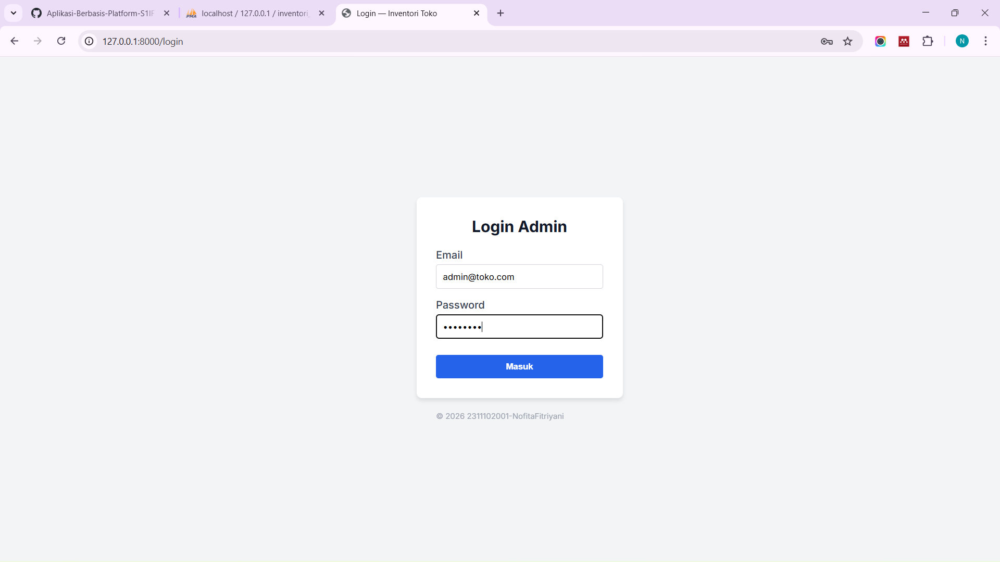
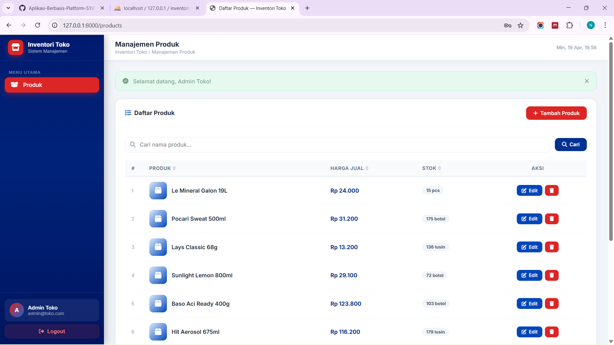
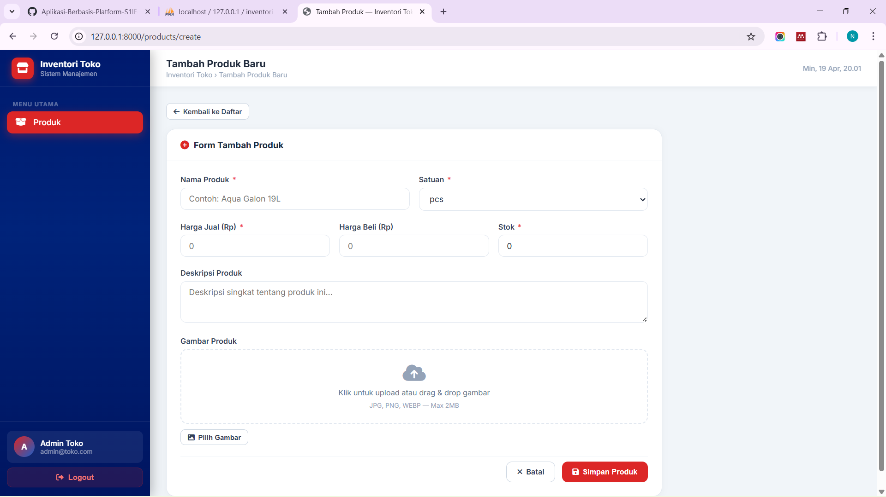
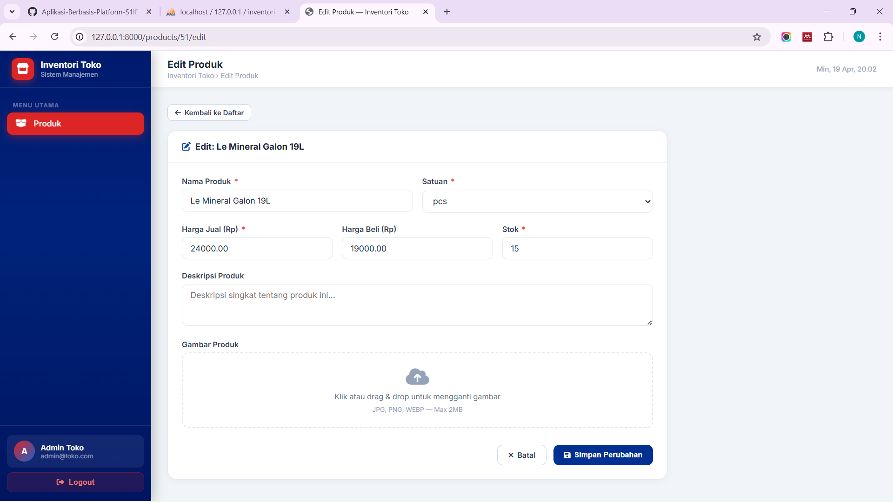
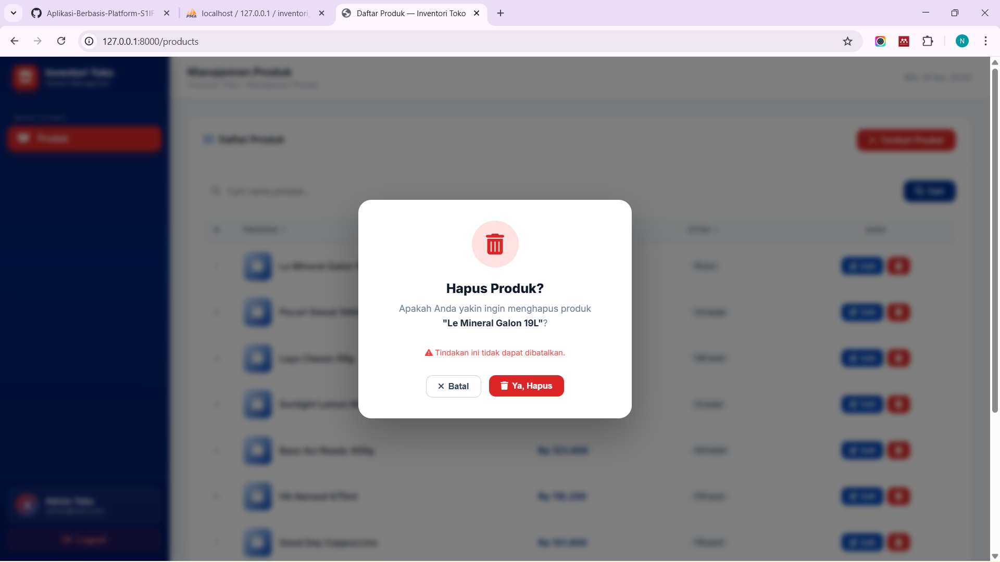

<h1 align="center">LAPORAN PRAKTIKUM</h1>
<h1 align="center">APLIKASI BERBASIS PLATFORM</h1>

<br>

<h2 align="center">MODUL 11,12,13</h2>
<h2 align="center">LARAVEL - INVENTORI TOKO</h2>

<br><br>

<p align="center">

</p>
<br><br><br>

<h2 align="center">Disusun Oleh :</h2>

<p align="center" style="font-size:28px;">
  <b>Nofita Fitriyani</b><br>
  <b>2311102001</b><br>
  <b>S1 IF-11-REG 01</b>
</p>
<br>
<h2 align="center">Dosen Pengampu :</h2>

<p align="center" style="font-size:28px;">
  <b>Dimas Fanny Hebrasianto Permadi, S.ST., M.Kom</b>
</p>
<br>
<h2 align="center">Asisten Praktikum :</h2>

<p align="center" style="font-size:28px;">
  <b>Apri Pandu Wicaksono</b><br>
  <b>Rangga Pradarrell Fathi</b>
</p>
<br>
<h1 align="center">LABORATORIUM HIGH PERFORMANCE</h1>
<h1 align="center">FAKULTAS INFORMATIKA</h1>
<h1 align="center">UNIVERSITAS TELKOM PURWOKERTO</h1>
<h1 align="center">TAHUN 2026</h1>

<hr>

## 1. DASAR TEORI
### Laravel Framework
Framework Laravel merupakan kerangka kerja PHP terbuka (*open-source*) berdesain MVC (*Model-View-Controller*) yang digunakan untuk mendukung pengembangan aplikasi web secara cepat (Rapid Application Development). Framework ini menawarkan berbagai fitur built-in serta pustaka yang mempermudah dalam mengembangkan fungsionalitas seperti Routing terdedikasi, ORM (Object-Relational Mapping) dengan sistem bernama Eloquent untuk manipulasi data SQL yang intuitif.

### MVC (Model-View-Controller)
MVC (Model-View-Controller) merupakan pola arsitektur perangkat lunak yang membagi aplikasi menjadi tiga komponen utama, yaitu:

- Model: bertugas mengelola data dan berinteraksi dengan database
- View: bertanggung jawab menampilkan data kepada pengguna
- Controller: menghubungkan Model dan View serta mengatur alur aplikasi

Dalam Laravel, konsep MVC diterapkan secara penuh. Model biasanya menggunakan Eloquent ORM untuk berinteraksi dengan database, View menggunakan Blade Template Engine, dan Controller mengatur logika aplikasi.

Pendekatan ini memungkinkan pemisahan antara logika bisnis dan tampilan, sehingga memudahkan dalam pengembangan, pengujian, dan pemeliharaan sistem.

### Database Factory dan Seeder
Database Factory dan Seeder merupakan fitur Laravel yang digunakan untuk menghasilkan data secara otomatis ke dalam database.

- Factory digunakan untuk membuat data dummy atau data uji secara otomatis
- Seeder digunakan untuk memasukkan data ke dalam database, baik untuk kebutuhan testing maupun inisialisasi data awal

Factory sangat berguna dalam tahap pengembangan ketika data asli belum tersedia, sedangkan Seeder membantu mengisi database secara cepat dan konsisten. Kombinasi keduanya sering digunakan untuk testing dan simulasi aplikasi.

### Sistem Autentikasi dengan Session
Autentikasi adalah proses verifikasi identitas pengguna dalam sebuah sistem. Laravel menyediakan sistem autentikasi yang aman dan mudah digunakan dengan memanfaatkan session dan cookie.

Laravel menggunakan konsep guard dan provider dalam autentikasi:

- Guard mengatur bagaimana pengguna diautentikasi (misalnya menggunakan session)
- Provider menentukan bagaimana data pengguna diambil dari database

Session digunakan untuk menyimpan status login pengguna sehingga pengguna tetap terautentikasi selama sesi berlangsung. Laravel juga menyediakan fitur tambahan seperti login, logout, dan proteksi route secara otomatis.

### Blade Template Engine
Blade merupakan template engine bawaan Laravel yang digunakan untuk membuat tampilan (view). Blade memungkinkan penggunaan sintaks yang lebih sederhana dibandingkan PHP biasa, namun tetap fleksibel karena dapat dikompilasi menjadi kode PHP murni.

Beberapa fitur utama Blade antara lain:

- Template inheritance (`@extends`, `@section`)
- Directive seperti `@if`, `@foreach`
- Komponen reusable

Blade membantu menghasilkan tampilan yang lebih bersih, modular, dan mudah dibaca tanpa mengurangi performa aplikasi.

## 2. SOURCE CODE
Source code untuk pengerjaan project **Laravel - Inventori Toko** secara lengkap dapat dilihat pada repositori dan folder proyek aplikasi ini, khususnya berada di dalam folder `/inventori-toko`.

### routes/web.php
```
<?php

use Illuminate\Support\Facades\Route;
use App\Http\Controllers\AuthController;
use App\Http\Controllers\ProductController;

// Auth Routes
Route::get('/login', [AuthController::class, 'showLogin'])->name('login');
Route::post('/login', [AuthController::class, 'login'])->name('login.post');
Route::post('/logout', [AuthController::class, 'logout'])->name('logout');

// Redirect root & dashboard
Route::get('/', function () {
    return redirect()->route('products.index');
});
Route::get('/dashboard', function () {
    return redirect()->route('products.index');
});

// Protected Routes
Route::middleware(\App\Http\Middleware\AuthMiddleware::class)->group(function () {
    Route::resource('products', ProductController::class);
});

```
### app/Http/Controllers/ProductController.php
```
<?php

//2311102001-NofitaFitriyani

namespace App\Http\Controllers;

use App\Models\Product;
use Illuminate\Http\Request;
use Illuminate\Support\Facades\Storage;
use Illuminate\Support\Str;

class ProductController extends Controller
{
    public function index(Request $request)
    {
        $query = Product::query();

        if ($request->filled('search')) {
            $search = $request->search;
            $query->where(function ($q) use ($search) {
                $q->where('name', 'like', "%{$search}%");
            });
        }

        $sortField = $request->get('sort', 'created_at');
        $sortDir   = $request->get('dir', 'desc');
        $allowedSorts = ['name', 'price', 'stock', 'created_at'];
        if (!in_array($sortField, $allowedSorts)) $sortField = 'created_at';
        if (!in_array($sortDir, ['asc', 'desc'])) $sortDir = 'desc';

        $products = $query->orderBy($sortField, $sortDir)->paginate(10)->withQueryString();

        return view('products.index', compact('products'));
    }

    public function create()
    {
        return view('products.create');
    }

    public function store(Request $request)
    {
        $validated = $request->validate([
            'name'         => 'required|string|max:255',
            'price'        => 'required|numeric|min:0',
            'buying_price' => 'nullable|numeric|min:0',
            'stock'        => 'required|integer|min:0',
            'unit'         => 'required|string|max:20',
            'description'  => 'nullable|string|max:1000',
            'image'        => 'nullable|image|mimes:jpg,jpeg,png,webp|max:2048',
        ], [
            'name.required'  => 'Nama produk wajib diisi.',
            'price.required' => 'Harga jual wajib diisi.',
            'price.numeric'  => 'Harga jual harus berupa angka.',
            'stock.required' => 'Stok wajib diisi.',
            'stock.integer'  => 'Stok harus berupa angka bulat.',
            'image.image'    => 'File harus berupa gambar.',
            'image.max'      => 'Ukuran gambar maksimal 2MB.',
        ]);

        if ($request->hasFile('image')) {
            $validated['image'] = $request->file('image')->store('products', 'public');
        }

        Product::create($validated);

        return redirect()->route('products.index')->with('success', 'Produk berhasil ditambahkan!');
    }

    public function edit(Product $product)
    {
        return view('products.edit', compact('product'));
    }

    public function update(Request $request, Product $product)
    {
        $validated = $request->validate([
            'name'         => 'required|string|max:255',
            'price'        => 'required|numeric|min:0',
            'buying_price' => 'nullable|numeric|min:0',
            'stock'        => 'required|integer|min:0',
            'unit'         => 'required|string|max:20',
            'description'  => 'nullable|string|max:1000',
            'image'        => 'nullable|image|mimes:jpg,jpeg,png,webp|max:2048',
        ], [
            'name.required'  => 'Nama produk wajib diisi.',
            'price.required' => 'Harga jual wajib diisi.',
            'price.numeric'  => 'Harga jual harus berupa angka.',
            'stock.required' => 'Stok wajib diisi.',
            'stock.integer'  => 'Stok harus berupa angka bulat.',
            'image.image'    => 'File harus berupa gambar.',
            'image.max'      => 'Ukuran gambar maksimal 2MB.',
        ]);

        if ($request->hasFile('image')) {
            if ($product->image) {
                Storage::disk('public')->delete($product->image);
            }
            $validated['image'] = $request->file('image')->store('products', 'public');
        }

        $product->update($validated);

        return redirect()->route('products.index')->with('success', 'Produk berhasil diperbarui!');
    }

    public function destroy(Product $product)
    {
        if ($product->image) {
            Storage::disk('public')->delete($product->image);
        }
        $product->delete();

        return redirect()->route('products.index')->with('success', 'Produk berhasil dihapus!');
    }
}
```

### app/Models/Product.php
```
<?php

namespace App\Models;

use Illuminate\Database\Eloquent\Factories\HasFactory;
use Illuminate\Database\Eloquent\Model;

class Product extends Model
{
    use HasFactory;

    protected $fillable = [
        'name',
        'category',
        'sku',
        'price',
        'buying_price',
        'stock',
        'unit',
        'description',
        'image',
        'status',
    ];

    protected $casts = [
        'price'        => 'decimal:2',
        'buying_price' => 'decimal:2',
        'stock'        => 'integer',
    ];

    public function getFormattedPriceAttribute(): string
    {
        return 'Rp ' . number_format($this->price, 0, ',', '.');
    }

    public function getStockStatusAttribute(): string
    {
        if ($this->stock <= 0) return 'Habis';
        if ($this->stock <= 10) return 'Menipis';
        return 'Tersedia';
    }

    public function getStockBadgeClassAttribute(): string
    {
        if ($this->stock <= 0) return 'badge-danger';
        if ($this->stock <= 10) return 'badge-warning';
        return 'badge-success';
    }
}
```

## 3. OUTPUT
### A. Tampilan Login
Akun Demo 
- Username : admin@toko.com
- Password : password
<p>

</p>

### B. Dashboard
Pada halaman dashboard terdapat tampilan fitur manajemen inventori toko meliputi ; Daftar produk, Harga jual, Stok, Edit & Delete, Search berdasarkan nama produk, button tambah/create produk.
<p>

</p>

### C. Create/Tambah Produk
<p>

</p>

### D. Update/Edit Informasi Produk
<p>

</p>

### E. Delete/Hapus Produk
<p>

</p>

## 4. PEMBAHASAN SOURCE CODE

Berdasarkan praktikum yang telah dilakukan, berikut adalah pembahasan mengenai implementasi bagian utama source code pada aplikasi Laravel Inventori Toko:

### A. Routing (`routes/web.php`)
Routing digunakan untuk mengatur alur arah navigasi dari dalam aplikasi web. Pada file `web.php` terdapat beberapa bagian utama:
- **Auth Routes**: Mengatur rute untuk sistem masuk (`/login`) dan keluar (`/logout`) yang diarahkan ke controller masing-masing, yaitu `AuthController`.
- **Redirect Routes**: Rute default ` / ` dan halaman `/dashboard` akan dihandle supaya secara otomatis langsung diarahkan (redirect) ke view `products.index`.
- **Protected Routes**: Merupakan grup rute yang menggunakan middleware kustom, yaitu `AuthMiddleware` yang bertugas membatasi akses pada resource produk. Ini memastikan hanya pengguna yang telah lolos verifikasi login yang diizinkan untuk melihat, menambah, mengubah, atau menghapus inventori via `Route::resource('products', ProductController::class)`.

### B. Controller (`app/Http/Controllers/ProductController.php`)
Controller membawahi berbagai fungsi yang menghubungkan antara Model (Logika Data) beserta View.
- **Read (`index()`)**: Fungsi ini mengambil kumpulan data dari tabel produk melalui model *Product*. Terdapat fitur modifikasi *query* untuk fungsionalitas **searching** (pencarian nama produk) dan **sorting** kolom (berdasarkan waktu record, harga, nama, serta stok).  Setelah data didapatkan, fungsi meneruskannya ke halaman beranda list produk beserta pagination set pada limit 10 item per page.
- **Create (`create()` & `store()`)**: Fungsi `create` memuat halaman form UI yang diperuntukkan tambah barang. `store()` bertugas mengeksekusi *request* baru berupa validasi *rules* (hanya angka, file foto, limit karakter, dll). Di fungsi ini program secara praktis akan mengunggah gambar form untuk diteruskan ke storage public *(public/products)* Laravel yang otomatis dijamin ketersediaan pathnya.
- **Update (`edit()` & `update()`)**: Fungsi `update()` serupa layaknya pembuatan produk baru, namun di sini diberikan pengecekan tambahan untuk menimpa foto lama jika pengguna mengganti foto. Sistem akan memakai perintah `Storage::disk('public')->delete()` terhadap foto lawas sebelum mengunggah foto baru, agar tak membuat tumpukan file sampah di server.
- **Delete (`destroy()`)**: Selain memutus atau membuang data (query *delete()*) barang di dalam records basis data, di baris method ini akan otomatis memanggil *Storage layer* juga untuk memastikan gambar yang menjadi referensi entitas ini terhapus dengan paripurna.

### C. Model (`app/Models/Product.php`)
Secara arsitektur, Model merepresentasikan satu entitas tabel pada sistem database.
- Terdapat konfigurasi array variabel protected bernama `fillable` yang berguna untuk menentukan dan membentengi *field-field* mana saja dari database yang secara eksklusif boleh dieksekusi secara instan dari perintah *Mass Assignment*.
- Adanya implementasi *Attribute Mutator/Accessor*. Fitur ini berfungsi mengubah langsung bentuk representasi data, contoh di kode ini seperti `getFormattedPriceAttribute()` yang mengaplikasikan format tipograpi mata uang lokal dalam angka, juga `getStockStatusAttribute()` yang membuat aturan display badge berdasarkan ketersediaan (Stok <=10 menjadi **Menipis** dan <=0 menjadi **Habis**).
- Penempatan CSS Badge Class terotomatisasi secara custom via function *Model* supaya UI menyesuaikan identifikasi sisa stok melalui atribut `getStockBadgeClassAttribute()`.

### D. Struktur Folder
```text
inventaris-toko/
├── app/
│   ├── Http/
│   │   └── Controllers/
│   │       ├── AuthController.php      (login & logout)
│   │       └── ProductController.php   (CRUD produk)
│   ├── Models/
│   │   ├── Product.php                 (model produk)
│   │   └── User.php                    (model user)
│   └── Providers/
│       └── AppServiceProvider.php      (konfigurasi pagination)
├── database/
│   ├── factories/
│   │   └── ProductFactory.php          (generator data dummy)
│   ├── migrations/
│   │   ├── create_users_table.php      (struktur tabel users)
│   │   └── create_products_table.php   (struktur tabel products)
│   └── seeders/
│       └── DatabaseSeeder.php          (pengisi data awal)
├── resources/
│   └── views/
│       ├── layouts/
│       │   └── app.blade.php           (layout utama)
│       ├── auth/
│       │   └── login.blade.php         (halaman login)
│       └── products/
│           ├── index.blade.php         (daftar produk / datatable)
│           ├── create.blade.php        (form tambah produk)
│           └── edit.blade.php          (form edit produk)
├── routes/
│   └── web.php                         (definisi semua route)
└── .env                                (konfigurasi database & session)
```

## 5. KESIMPULAN
Pada pengimplementasian modul kali ini, praktikan sukses beradaptasi dengan alur pola kerja *framework* Laravel dan berhasil merancang aplikasi berbasis web dengan arsitektur Model-View-Controller (MVC) terstruktur untuk Inventory Toko. Fitur CRUD beroperasi optimal mengimplementasikan abstraksi dari Eloquent, integrasi modul file handling lokal (`Storage`), perlindungan otentikasi pada `Middleware` untuk pembatasan user role, hingga *best-practice* pengelolaan file tampilan modular via Blade templating system. Kesimpulannya, pengembangan ini dapat dipahami jelas, rapi dan mempercepat developer melalui integrasi siap pakai yang disuguhkan oleh fitur Laravel MVC.

## 6. REFERENCE
1. Laravel Framework Documentation, Release 11.x. Retrieved from https://laravel.com/docs
2. Bootstrap (v5.3) Components & Framework. Retrieved from https://getbootstrap.com/docs/5.3/
3. Laravel Official Documentation – Seeding https://laravel.com/docs/9.x/seeding
4. Code Magazine – MVC in Laravel https://www.codemag.com/Article/2205071/Building-MVC-Applications-in-PHP-Laravel-Part-1
5. YouTube https://youtu.be/a8-y-yU5mz0?si=-97_zhRJOzFu56qQ