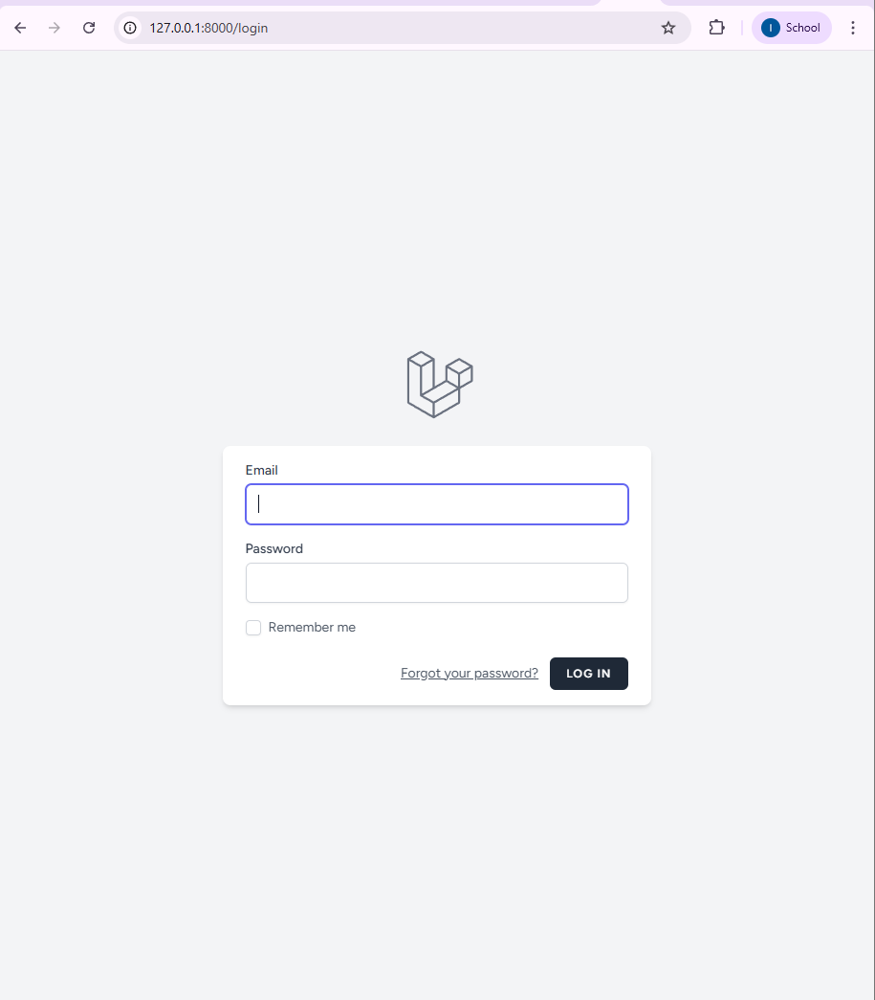
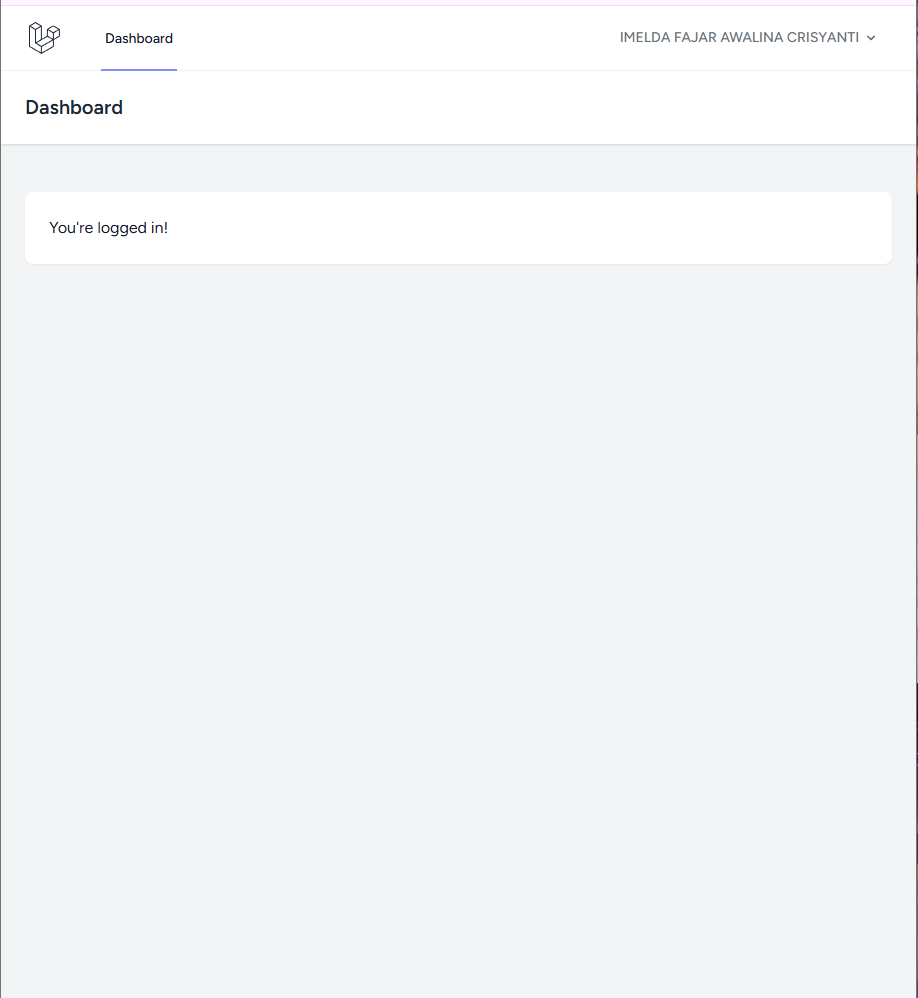
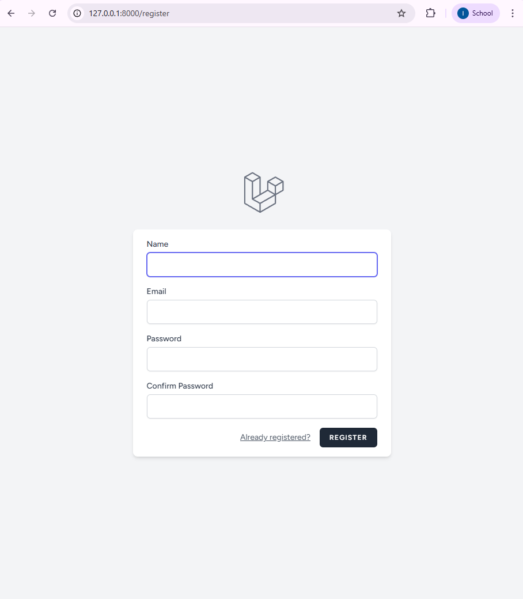
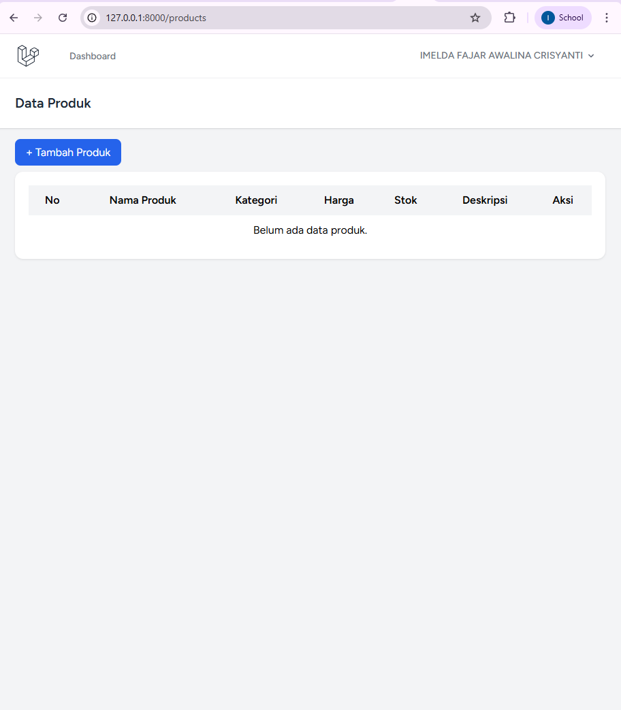
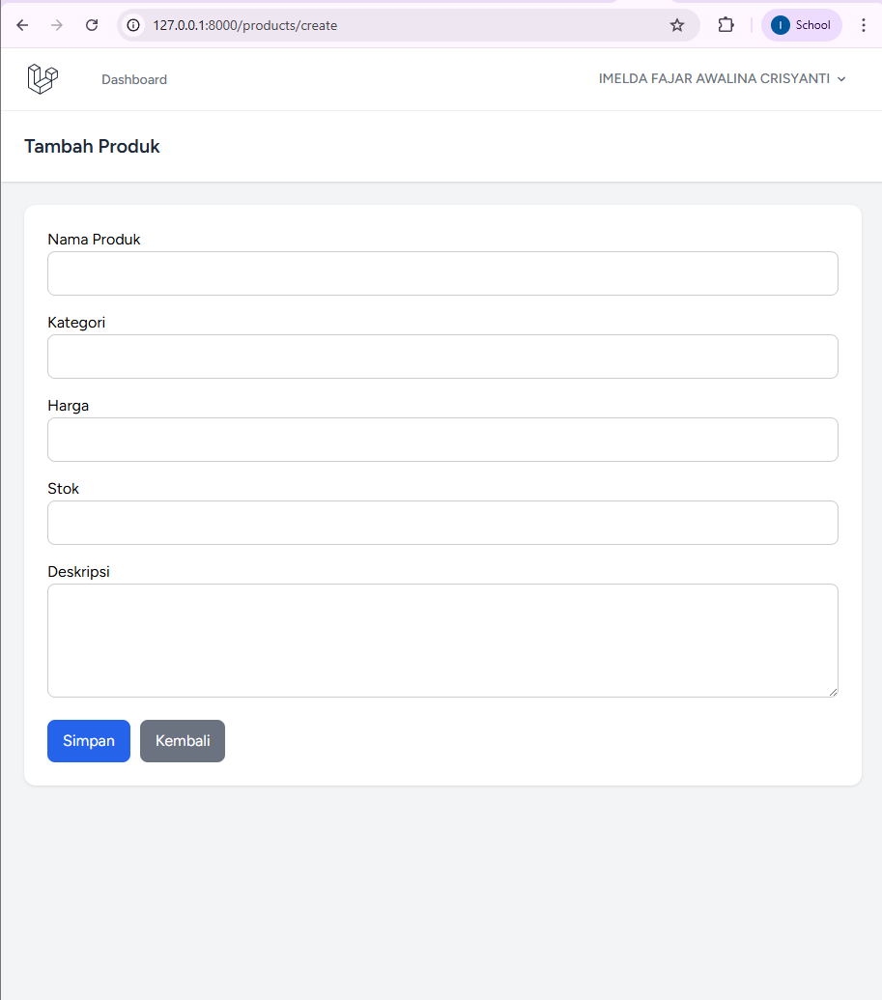
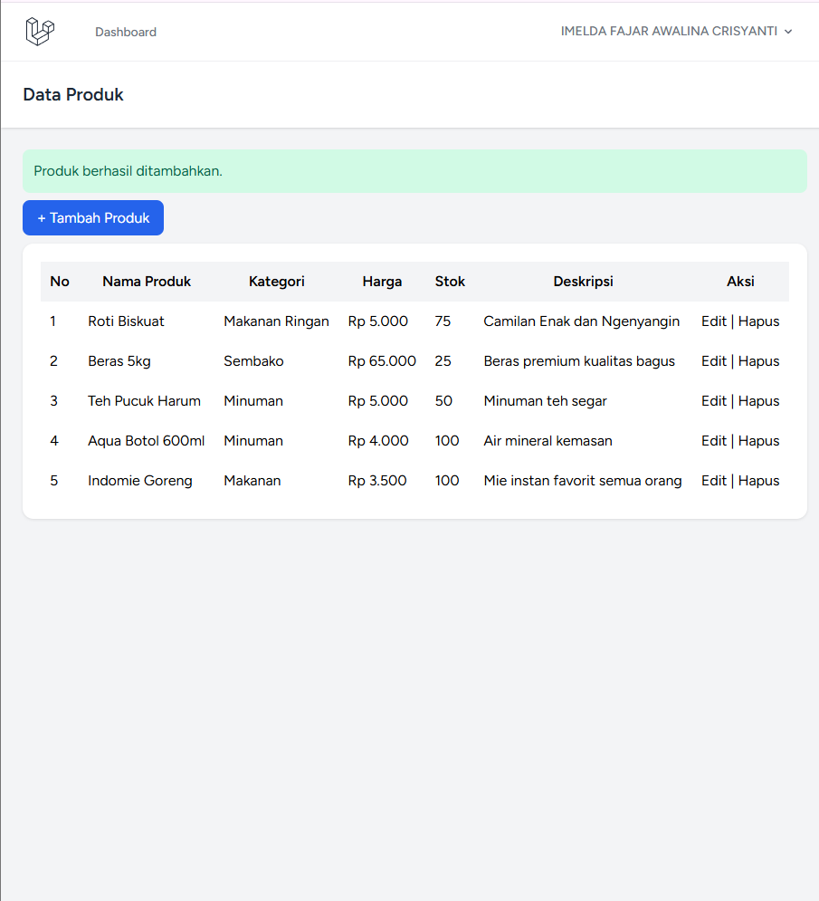
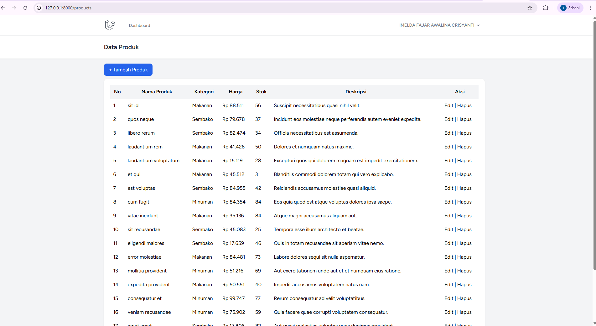
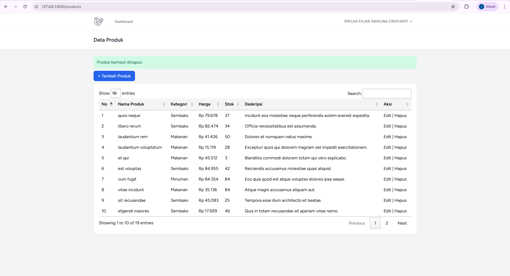

<h1 align="center">LAPORAN PRAKTIKUM</h1>
<h1 align="center">APLIKASI BERBASIS PLATFORM</h1>

<br>

<h2 align="center">MODUL 11, 12, 13</h2>
<h2 align="center">LARAVEL - INVENTORI TOKO</h2>

<br><br>

<p align="center">
  
</p>

<br><br>

<h2 align="center">Disusun Oleh :</h2>

<p align="center">
  <b>Imelda Fajar Awalina Crisyanti</b><br>
  <b>2311102004</b><br>
  <b>S1 IF-11</b>
</p>

<br>

<h2 align="center">Dosen Pengampu :</h2>

<p align="center">
  <b>Dimas Fanny Hebrasianto Permadi, S.ST., M.Kom</b>
</p>

<br>

<h2 align="center">Asisten Praktikum :</h2>

<p align="center">
  <b>Apri Pandu Wicaksono</b><br>
  <b>Rangga Pradarrell Fathi</b>
</p>

<br>

<h1 align="center">LABORATORIUM HIGH PERFORMANCE</h1>
<h1 align="center">FAKULTAS INFORMATIKA</h1>
<h1 align="center">UNIVERSITAS TELKOM PURWOKERTO</h1>
<h1 align="center">TAHUN 2026</h1>

---

## 1. DASAR TEORI

### Laravel dalam Pengembangan Aplikasi

Dalam pembuatan aplikasi inventori toko pada praktikum ini, digunakan Laravel sebagai kerangka kerja utama. Laravel dipilih karena memiliki struktur yang sudah terorganisir sehingga memudahkan dalam membangun aplikasi berbasis web.

Laravel menyediakan berbagai fitur yang langsung dapat digunakan, seperti pengaturan route, pengelolaan data dengan ORM, serta sistem autentikasi. Dengan adanya fitur tersebut, proses pengembangan aplikasi menjadi lebih cepat karena tidak perlu membangun semuanya dari awal.

### Penerapan Pola MVC pada Aplikasi

Pada aplikasi yang dibuat, konsep MVC diterapkan untuk membagi tugas dalam sistem.

Bagian Model digunakan untuk mengelola data produk yang tersimpan di database.
Bagian View digunakan untuk menampilkan halaman seperti login, dashboard, dan data produk.
Bagian Controller digunakan untuk mengatur proses seperti menambah, mengubah, dan menghapus data.

Dengan pembagian tersebut, setiap bagian memiliki peran masing-masing sehingga kode menjadi lebih rapi dan tidak tercampur antara tampilan dan logika program.

### Pengelolaan Data dengan Seeder

Dalam tahap pengembangan, diperlukan data awal untuk mencoba fitur yang dibuat. Oleh karena itu digunakan Seeder untuk memasukkan data ke dalam database.

Dengan adanya data ini, fitur seperti pencarian, pengeditan, dan penghapusan produk dapat langsung diuji tanpa harus memasukkan data secara manual satu per satu.

### Mekanisme Login pada Sistem

Aplikasi ini memiliki fitur login yang berfungsi untuk membatasi akses pengguna. Hanya pengguna yang berhasil login yang dapat mengakses halaman utama aplikasi.

Laravel memanfaatkan session untuk menyimpan informasi login, sehingga pengguna tidak perlu login ulang setiap kali berpindah halaman. Selain itu, digunakan middleware untuk memastikan halaman tertentu tidak dapat diakses tanpa proses autentikasi.

### Penggunaan Blade pada Tampilan

Dalam pembuatan tampilan, digunakan Blade Template yang mempermudah pengelolaan halaman. Dengan Blade, beberapa bagian tampilan seperti header dan layout dapat digunakan kembali di banyak halaman.

Hal ini membuat kode tampilan menjadi lebih ringkas dan mudah dipahami. Selain itu, Blade juga mempermudah dalam menampilkan data dari database ke halaman web.
---

## 2. SOURCE CODE

Source code untuk pengerjaan project **Laravel - Inventori Toko** secara lengkap terdapat pada folder project aplikasi ini, khususnya di dalam folder `/inventori-toko`.

### A. Routing (`routes/web.php`)
```php
<?php

use App\Http\Controllers\ProductController;
use App\Http\Controllers\ProfileController;
use Illuminate\Support\Facades\Route;

Route::get('/', function () {
    return redirect('/login');
});

Route::get('/dashboard', function () {
    return view('dashboard');
})->middleware(['auth', 'verified'])->name('dashboard');

Route::middleware('auth')->group(function () {
    Route::get('/profile', [ProfileController::class, 'edit'])->name('profile.edit');
    Route::patch('/profile', [ProfileController::class, 'update'])->name('profile.update');
    Route::delete('/profile', [ProfileController::class, 'destroy'])->name('profile.destroy');

    Route::resource('products', ProductController::class);
});

require __DIR__.'/auth.php';

```

### B. Controller (app/Http/Controllers/ProductController.php)
```

<?php

namespace App\Http\Controllers;

use App\Models\Product;
use Illuminate\Http\Request;

class ProductController extends Controller
{
    public function index()
    {
        $products = Product::latest()->get();
        return view('products.index', compact('products'));
    }

    public function create()
    {
        return view('products.create');
    }

    public function store(Request $request)
    {
        $request->validate([
            'name' => 'required|string|max:255',
            'category' => 'required|string|max:255',
            'price' => 'required|numeric|min:0',
            'stock' => 'required|integer|min:0',
            'description' => 'nullable|string',
        ]);

        Product::create($request->all());

        return redirect()->route('products.index')->with('success', 'Produk berhasil ditambahkan.');
    }

    public function show(Product $product)
    {
        //
    }

    public function edit(Product $product)
    {
        return view('products.edit', compact('product'));
    }

    public function update(Request $request, Product $product)
    {
        $request->validate([
            'name' => 'required|string|max:255',
            'category' => 'required|string|max:255',
            'price' => 'required|numeric|min:0',
            'stock' => 'required|integer|min:0',
            'description' => 'nullable|string',
        ]);

        $product->update($request->all());

        return redirect()->route('products.index')->with('success', 'Produk berhasil diperbarui.');
    }

    public function destroy(Product $product)
    {
        $product->delete();

        return redirect()->route('products.index')->with('success', 'Produk berhasil dihapus.');
    }
}

```

### C. Model (app/Models/Product.php)
```
<?php

namespace App\Models;

use Illuminate\Database\Eloquent\Factories\HasFactory;
use Illuminate\Database\Eloquent\Model;

class Product extends Model
{
    /** @use HasFactory<\Database\Factories\ProductFactory> */
    use HasFactory;

    protected $fillable = [
        'name',
        'category',
        'price',
        'stock',
        'description',
    ];
}

```
### D. Konfigurasi Vite (vite.config.js)
```
import { defineConfig } from 'vite';
import laravel from 'laravel-vite-plugin';

export default defineConfig({
    plugins: [
        laravel({
            input: ['resources/css/app.css', 'resources/js/app.js'],
            refresh: true,
        }),
    ],
});

```

### E. Konfigurasi Tailwind CSS (tailwind.config.js)
```

import defaultTheme from 'tailwindcss/defaultTheme';
import forms from '@tailwindcss/forms';

/** @type {import('tailwindcss').Config} */
export default {
    content: [
        './vendor/laravel/framework/src/Illuminate/Pagination/resources/views/*.blade.php',
        './storage/framework/views/*.php',
        './resources/views/**/*.blade.php',
    ],

    theme: {
        extend: {
            fontFamily: {
                sans: ['Figtree', ...defaultTheme.fontFamily.sans],
            },
        },
    },

    plugins: [forms],
};

```

### F. Konfigurasi PostCSS (postcss.config.js)
```

export default {
    plugins: {
        tailwindcss: {},
        autoprefixer: {},
    },
};

```

## 3. OUTPUT

### A. login 

<p>

</p>

### B. Dashboard

<p>

</p>

### C. Register 

<p>

</p>

### D. Data Produk

<p>

</p>

### E. Tambah Produk

<p>

</p>

### F. Produk Berhasil Ditambahkan 

<p>

</p>

### G. Tambah Data Otomatis

<p>

</p>

### H. Hapus produk

<p>

</p>

## 4. PEMBAHASAN SOURCE CODE
Berdasarkan praktikum yang telah dilakukan, berikut adalah pembahasan mengenai implementasi bagian utama source code pada aplikasi Laravel Inventori Toko.

### A. Routing (routes/web.php)

Routing digunakan untuk mengatur alur navigasi di dalam aplikasi.

- Auth Routes digunakan untuk proses login dan logout pengguna.
- Redirect Routes digunakan agar halaman utama dan dashboard langsung diarahkan ke halaman data produk.
- Protected Routes menggunakan AuthMiddleware untuk membatasi akses, sehingga hanya pengguna yang telah login yang dapat mengakses fitur manajemen produk.

### Controller (ProductController.php)

Controller bertugas menghubungkan Model dengan View serta mengatur logika aplikasi.

- index() digunakan untuk menampilkan daftar produk, lengkap dengan fitur pencarian, sorting, dan pagination.
- create() digunakan untuk menampilkan form tambah produk.
- store() digunakan untuk memproses penambahan produk baru, termasuk validasi input dan upload gambar.
- edit() digunakan untuk menampilkan form edit produk.
- update() digunakan untuk memperbarui data produk, termasuk mengganti gambar lama jika ada gambar baru yang diunggah.
- destroy() digunakan untuk menghapus data produk beserta file gambar yang tersimpan.

### C. Model (Product.php)

Model digunakan untuk merepresentasikan tabel produk dalam database.

- Properti fillable berfungsi menentukan field yang boleh diisi melalui mass assignment.
- Properti casts digunakan untuk mengatur tipe data, seperti harga menjadi decimal dan stok menjadi integer.
- Accessor seperti getFormattedPriceAttribute() digunakan untuk menampilkan harga dalam format rupiah.
- Accessor getStockStatusAttribute() digunakan untuk memberikan status stok seperti Habis, Menipis, atau Tersedia.
- Accessor getStockBadgeClassAttribute() digunakan untuk menyesuaikan tampilan badge stok pada antarmuka.

### D. Sistem Autentikasi

Aplikasi menggunakan autentikasi berbasis session. Pengguna harus login terlebih dahulu sebelum mengakses halaman produk. Middleware digunakan untuk memastikan bahwa hanya pengguna yang sudah terverifikasi yang dapat mengakses fitur CRUD.

### E. Blade Template

Blade digunakan untuk membangun tampilan aplikasi agar lebih modular dan mudah dikelola. Dengan Blade, halaman seperti login, dashboard, daftar produk, tambah produk, dan edit produk dapat dibuat dengan struktur yang lebih rapi menggunakan layout utama dan directive bawaan Laravel.

### Konfigurasi Frontend

Selain bagian backend, aplikasi ini juga menggunakan konfigurasi frontend modern.

- Vite digunakan sebagai build tool untuk mengelola file CSS dan JavaScript.
- Tailwind CSS digunakan untuk membangun tampilan yang lebih modern dan responsif.
- PostCSS digunakan untuk memproses CSS agar kompatibel dengan berbagai browser.

Kombinasi ketiga tools tersebut membuat proses pengembangan frontend menjadi lebih cepat, efisien, dan terstruktur.

### Struktur Folder

```text
inventori-toko/
├── app/
│   ├── Http/
│   │   └── Controllers/
│   │       ├── AuthController.php
│   │       └── ProductController.php
│   ├── Models/
│   │   ├── Product.php
│   │   └── User.php
│   └── Providers/
│       └── AppServiceProvider.php
├── bootstrap/
├── config/
├── database/
│   ├── factories/
│   ├── migrations/
│   └── seeders/
├── public/
├── resources/
│   ├── css/
│   ├── js/
│   └── views/
│       ├── auth/
│       ├── layouts/
│       └── products/
├── routes/
│   └── web.php
├── storage/
├── .env
├── .env.example
├── artisan
├── composer.json
├── package.json
├── postcss.config.js
├── tailwind.config.js
└── vite.config.js
```


## KESIMPULAN 
Pada praktikum ini, telah berhasil dibuat aplikasi berbasis Laravel dengan konsep MVC untuk manajemen inventori toko. Aplikasi memiliki fitur autentikasi, pengelolaan data produk, pencarian, sorting, pagination, upload gambar, serta fitur CRUD yang berjalan dengan baik.

Penggunaan Laravel mempermudah proses pengembangan aplikasi karena memiliki struktur yang rapi, fitur bawaan yang lengkap, serta mendukung integrasi dengan tools modern seperti Vite, Tailwind CSS, dan PostCSS. Dengan pemisahan antara Model, View, dan Controller, aplikasi menjadi lebih mudah dipahami, dikembangkan, dan dipelihara.
