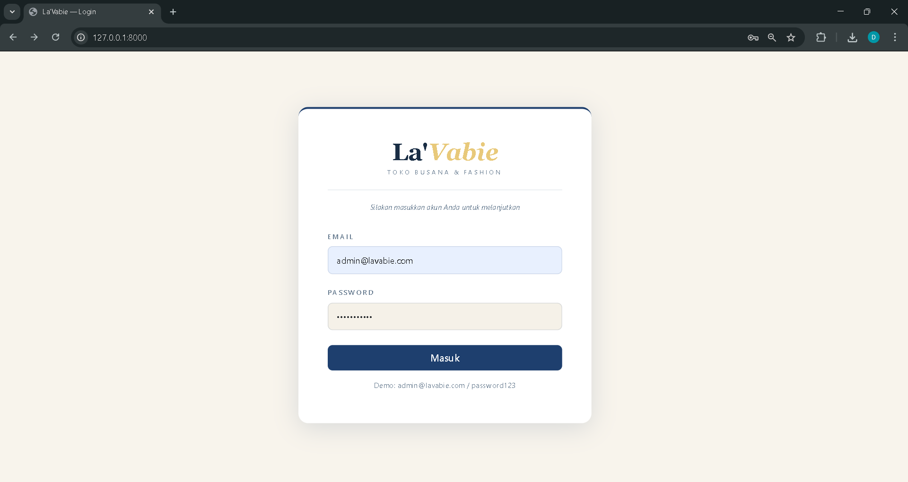
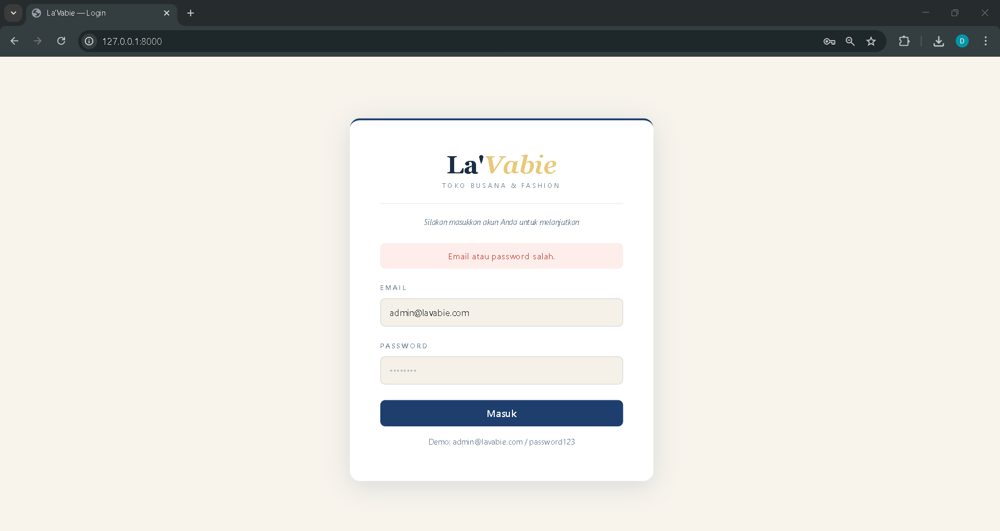
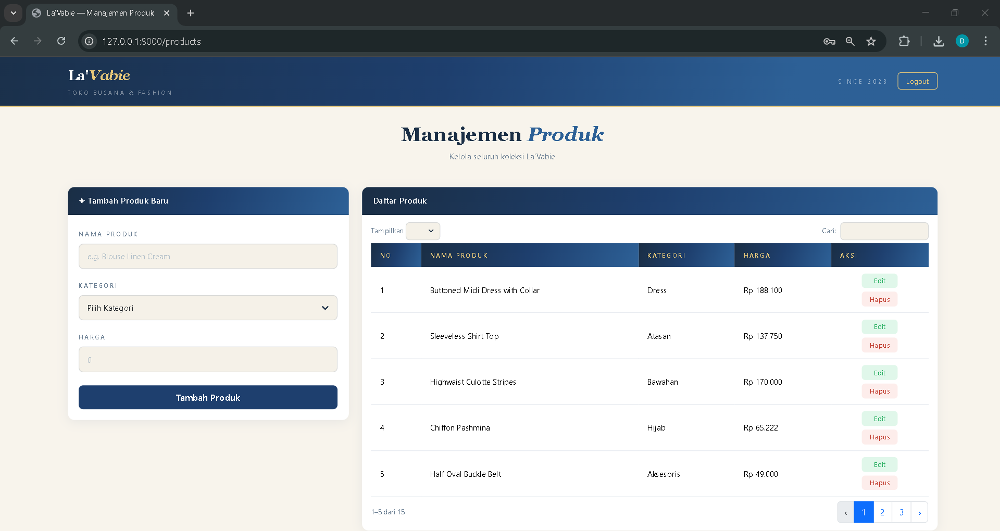
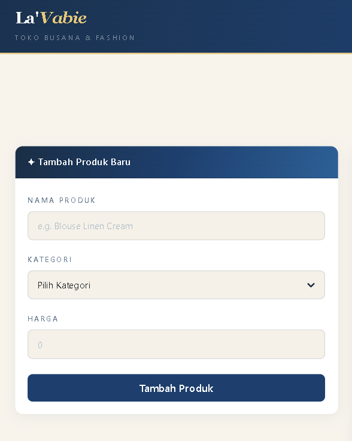
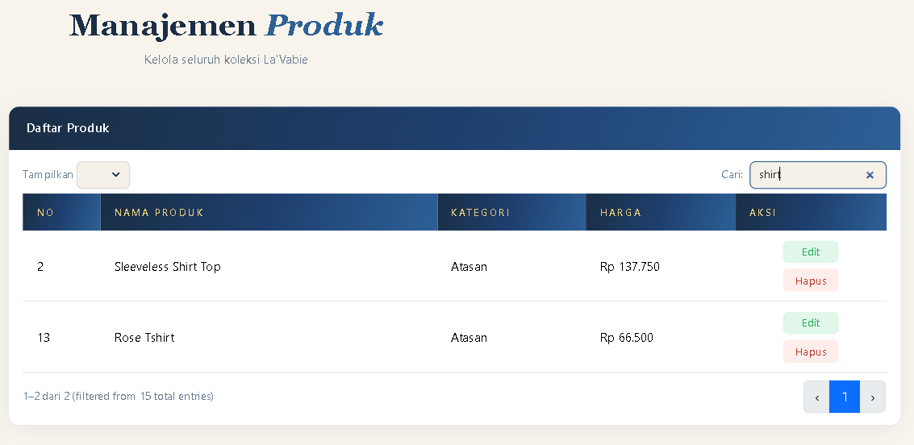
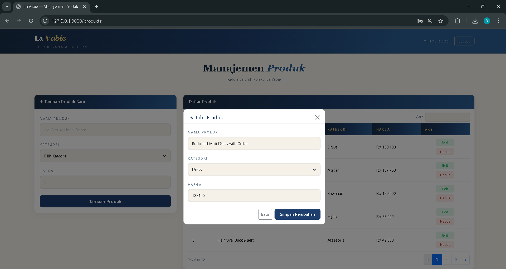
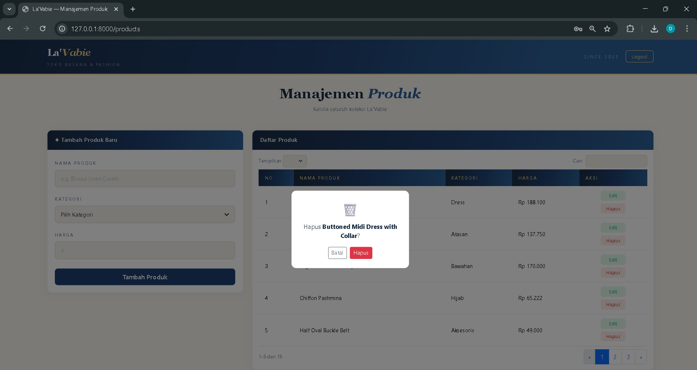

<div align="center">

## LAPORAN PRAKTIKUM <br> APLIKASI BERBASIS PLATFORM

<br>

### TUGAS MODUL 11-12-13
### LARAVEL INVENTARI TOKO LA'VABIE

<br>
<br>


<br>
<br>
<br>

**Disusun oleh:**

**Diva Octaviani**  
**2311102006**

<br>

**KELAS PS1IF-11-REG01**

**Dosen: Dimas Fanny Hebrasianto Permadi, S.ST., M.Kom**

<br><br>

## PROGRAM STUDI S1 TEKNIK INFORMATIKA <br> FAKULTAS INFORMATIKA <br> UNIVERSITAS TELKOM PURWOKERTO <br> 2026 <br><br>

</div>

---

## 1. Dasar Teori

**Laravel** adalah framework PHP berbasis MVC (*Model-View-Controller*) yang menyediakan struktur pengembangan aplikasi web yang rapi dan terorganisir. Laravel menyediakan berbagai fitur bawaan seperti routing, Eloquent ORM, Blade templating engine, migration, seeder, dan sistem autentikasi berbasis session yang memudahkan pembangunan aplikasi web secara cepat dan aman.

**MVC (Model-View-Controller)** adalah pola arsitektur yang memisahkan logika aplikasi menjadi tiga bagian: Model untuk mengelola data dan interaksi database, View untuk menampilkan antarmuka pengguna, dan Controller sebagai penghubung antara Model dan View yang menangani request dari pengguna.

**Eloquent ORM** adalah fitur Laravel yang memungkinkan interaksi dengan database menggunakan sintaks PHP berbasis objek tanpa perlu menulis query SQL secara langsung. Setiap tabel database direpresentasikan oleh sebuah Model.

**Migration** adalah fitur Laravel untuk mengelola skema database menggunakan kode PHP. Migration memungkinkan perubahan struktur database terdokumentasi dan dapat dijalankan ulang kapan saja menggunakan perintah `php artisan migrate`.

**Factory dan Seeder** adalah fitur Laravel untuk mengisi database dengan data dummy secara otomatis. Factory mendefinisikan struktur data palsu menggunakan library Faker, sedangkan Seeder menjalankan Factory tersebut untuk mengisi tabel dengan sejumlah data awal.

**Session** adalah mekanisme penyimpanan data pengguna sementara di sisi server selama pengguna berinteraksi dengan aplikasi. Laravel menggunakan session untuk mengelola status login pengguna sehingga halaman tertentu hanya bisa diakses setelah autentikasi berhasil.

**Bootstrap** adalah framework CSS yang menyediakan komponen antarmuka siap pakai seperti navbar, card, form, modal, dan tombol yang dapat dikustomisasi sesuai kebutuhan desain.

**DataTables** adalah plugin jQuery yang mengubah tabel HTML biasa menjadi tabel interaktif dengan fitur pencarian real-time, pagination, dan pengurutan data tanpa perlu reload halaman.

---

## 2. Hasil Praktikum

### **a. Struktur Project**

Project ini dikembangkan menggunakan Laravel dengan nama folder `2311102006_Diva Octaviani` dan database `lavabie_db`. Struktur file utama yang digunakan adalah sebagai berikut:

```
2311102006_Diva Octaviani/
├── app/
│   ├── Http/
│   │   └── Controllers/
│   │       ├── AuthController.php
│   │       └── ProductController.php
│   └── Models/
│       └── Product.php
├── database/
│   ├── factories/
│   │   └── ProductFactory.php
│   ├── migrations/
│   │   └── xxxx_create_products_table.php
│   └── seeders/
│       ├── DatabaseSeeder.php
│       ├── ProductSeeder.php
│       └── UserSeeder.php
├── public/
│   └── css/
│       └── style.css
├── resources/
│   └── views/
│       ├── auth/
│       │   └── login.blade.php
│       ├── layouts/
│       │   └── app.blade.php
│       └── products/
│           └── index.blade.php
├── routes/
│   └── web.php
└── README.md
```

### **b. Source Code**

#### `.env` — Konfigurasi Database

```env
DB_CONNECTION=mysql
DB_HOST=127.0.0.1
DB_PORT=3306
DB_DATABASE=lavabie_db
DB_USERNAME=root
DB_PASSWORD=
```

#### `routes/web.php`

```php
<?php
use App\Http\Controllers\AuthController;
use App\Http\Controllers\ProductController;
use Illuminate\Support\Facades\Route;

// Login
Route::get('/',       [AuthController::class, 'showLogin'])->name('login');
Route::post('/login', [AuthController::class, 'login'])->name('login.post');
Route::post('/logout',[AuthController::class, 'logout'])->name('logout');

// Products (protected)
Route::middleware('auth')->group(function () {
    Route::resource('products', ProductController::class);
});
```

#### `app/Models/Product.php`

```php
<?php
namespace App\Models;

use Illuminate\Database\Eloquent\Factories\HasFactory;
use Illuminate\Database\Eloquent\Model;

class Product extends Model
{
    use HasFactory;
    protected $fillable = ['name', 'category', 'price'];
}
```

#### `database/migrations/2026_0_19_133821_create_products_table.php`

```php
<?php

use Illuminate\Database\Migrations\Migration;
use Illuminate\Database\Schema\Blueprint;
use Illuminate\Support\Facades\Schema;

return new class extends Migration
{
    /**
     * Run the migrations.
     */
    public function up(): void
    {
        Schema::create('products', function (Blueprint $table) {
        $table->id();
        $table->string('name');
        $table->string('category');
        $table->unsignedBigInteger('price');
        $table->timestamps();
        });
    }

    /**
     * Reverse the migrations.
     */
    public function down(): void
    {
        Schema::dropIfExists('products');
    }
};
```

#### `database/factories/ProductFactory.php`

```php
<?php
namespace Database\Factories;

use Illuminate\Database\Eloquent\Factories\Factory;

class ProductFactory extends Factory
{
    public function definition(): array
    {
        $categories = ['Atasan', 'Bawahan', 'Dress', 'Hijab', 'Aksesoris'];
        $names = [
            'Blouse Linen Cream', 'Rok Plisket Navy', 'Dress Batik Modern',
            'Hijab Voal Motif', 'Kalung Mutiara', 'Kemeja Flanel', 'Celana Kulot',
            'Gamis Syari', 'Pashmina Satin', 'Anting Vintage'
        ];

        return [
            'name'     => $this->faker->randomElement($names) . ' ' . $this->faker->bothify('##??'),
            'category' => $this->faker->randomElement($categories),
            'price'    => $this->faker->numberBetween(50000, 500000),
        ];
    }
}
```

#### `database/seeders/ProductSeeder.php`

```php
<?php
namespace Database\Seeders;

use App\Models\Product;
use Illuminate\Database\Seeder;

class ProductSeeder extends Seeder
{
    public function run(): void
    {
        Product::factory(15)->create();
    }
}
```

#### `database/seeders/UserSeeder.php`

```php
<?php
namespace Database\Seeders;

use Illuminate\Database\Seeder;
use Illuminate\Support\Facades\Hash;
use App\Models\User;

class UserSeeder extends Seeder
{
    public function run(): void
    {
        User::create([
            'name'     => "La'Vabie Admin",
            'email'    => 'admin@lavabie.com',
            'password' => Hash::make('password123'),
        ]);
    }
}
```

#### `database/seeders/DatabaseSeeder.php`

```php
<?php
namespace Database\Seeders;

use Illuminate\Database\Seeder;

class DatabaseSeeder extends Seeder
{
    public function run(): void
    {
        $this->call([
            UserSeeder::class,
            ProductSeeder::class,
        ]);
    }
}
```

#### `app/Http/Controllers/AuthController.php`

```php
<?php
namespace App\Http\Controllers;

use Illuminate\Http\Request;
use Illuminate\Support\Facades\Auth;

class AuthController extends Controller
{
    public function showLogin()
    {
        return view('auth.login');
    }

    public function login(Request $request)
    {
        $credentials = $request->validate([
            'email'    => 'required|email',
            'password' => 'required',
        ]);

        if (Auth::attempt($credentials)) {
            $request->session()->regenerate();
            return redirect()->intended(route('products.index'));
        }

        return back()->withErrors(['email' => 'Email atau password salah.'])->onlyInput('email');
    }

    public function logout(Request $request)
    {
        Auth::logout();
        $request->session()->invalidate();
        $request->session()->regenerateToken();
        return redirect()->route('login');
    }
}
```

#### `app/Http/Controllers/ProductController.php`

```php
<?php
namespace App\Http\Controllers;

use App\Models\Product;
use Illuminate\Http\Request;

class ProductController extends Controller
{
    
    public function index()
    {
    $products = Product::latest()->get();
    $categories = ['Atasan', 'Bawahan', 'Dress', 'Hijab', 'Aksesoris'];
    return view('products.index', compact('products', 'categories'));
    }

    public function store(Request $request)
    {
        $request->validate([
            'name'     => 'required|string|max:255',
            'category' => 'required|string',
            'price'    => 'required|integer|min:1',
        ]);

        Product::create($request->only('name', 'category', 'price'));
        return redirect()->route('products.index')->with('success', '✓ Produk berhasil ditambahkan');
    }

    public function edit(Product $product)
    {
        return view('products.edit', compact('product'));
    }

    public function update(Request $request, Product $product)
    {
        $request->validate([
            'name'     => 'required|string|max:255',
            'category' => 'required|string',
            'price'    => 'required|integer|min:1',
        ]);

        $product->update($request->only('name', 'category', 'price'));
        return redirect()->route('products.index')->with('success', '✓ Produk berhasil diperbarui');
    }

    public function destroy(Product $product)
    {
        $product->delete();
        return redirect()->route('products.index')->with('success', '✓ Produk berhasil dihapus');
    }
}
```

#### `resources/views/layouts/app.blade.php`

```php
<!DOCTYPE html>
<html lang="id">
<head>
    <meta charset="UTF-8"/>
    <meta name="viewport" content="width=device-width,initial-scale=1.0"/>
    <title>La'Vabie — @yield('title')</title>
    <link href="https://cdn.jsdelivr.net/npm/bootstrap@5.3.2/dist/css/bootstrap.min.css" rel="stylesheet"/>
    <link href="https://cdn.datatables.net/1.13.6/css/dataTables.bootstrap5.min.css" rel="stylesheet"/>
    <link href="{{ asset('css/style.css') }}" rel="stylesheet"/>
</head>
<body>

<nav class="navbar">
    <div class="container-xl px-4 d-flex justify-content-between align-items-center">
        <div>
            <span class="brand-name">La'<em>Vabie</em></span>
            <div class="brand-sub">TOKO BUSANA & FASHION</div>
        </div>
        <div class="d-flex align-items-center gap-3">
            <span class="nav-right">SINCE 2023</span>
            <form method="POST" action="{{ route('logout') }}" class="mb-0">
                @csrf
                <button type="submit" class="btn-logout">Logout</button>
            </form>
        </div>
    </div>
</nav>

<div class="page-header">
    <div class="container-xl px-4">
        <h1 class="page-title">
            @yield('page-title-plain') <em>@yield('page-title-em')</em>
        </h1>
        <p class="page-sub">@yield('page-sub')</p>
    </div>
</div>

<div class="container-xl px-4 pb-5">
    @if(session('success'))
        <div class="alert-toast" id="alertToast">{{ session('success') }}</div>
        <script>
            setTimeout(() => {
                const el = document.getElementById('alertToast');
                if (el) el.style.opacity = '0';
            }, 2500);
        </script>
    @endif

    @yield('content')
</div>

<script src="https://code.jquery.com/jquery-3.7.1.min.js"></script>
<script src="https://cdn.jsdelivr.net/npm/bootstrap@5.3.2/dist/js/bootstrap.bundle.min.js"></script>
<script src="https://cdn.datatables.net/1.13.6/js/jquery.dataTables.min.js"></script>
<script src="https://cdn.datatables.net/1.13.6/js/dataTables.bootstrap5.min.js"></script>
@yield('scripts')
</body>
</html>
```

#### `resources/views/auth/login.blade.php`

```php
<!DOCTYPE html>
<html lang="id">
<head>
    <meta charset="UTF-8"/>
    <meta name="viewport" content="width=device-width,initial-scale=1.0"/>
    <title>La'Vabie — Login</title>
    <link href="https://cdn.jsdelivr.net/npm/bootstrap@5.3.2/dist/css/bootstrap.min.css" rel="stylesheet"/>
    <link href="{{ asset('css/style.css') }}" rel="stylesheet"/>
</head>
<body class="login-page">

<div class="login-wrap">
    <div class="login-card">

        {{-- Brand --}}
        <div class="login-brand">
            <div class="login-brand-name">La'<em>Vabie</em></div>
            <div class="login-brand-sub">TOKO BUSANA & FASHION</div>
        </div>

        <p class="login-subtitle">Silakan masukkan akun Anda untuk melanjutkan</p>

        @if($errors->any())
            <div class="login-error">{{ $errors->first() }}</div>
        @endif

        <form method="POST" action="{{ route('login.post') }}">
            @csrf
            <div class="mb-3">
                <label class="form-label">Email</label>
                <input type="email" name="email" class="form-control"
                       value="{{ old('email') }}"
                       placeholder="admin@lavabie.com" required/>
            </div>
            <div class="mb-4">
                <label class="form-label">Password</label>
                <input type="password" name="password" class="form-control"
                       placeholder="••••••••" required/>
            </div>
            <button type="submit" class="btn btn-primary w-100">Masuk</button>
        </form>

        <p class="login-hint">Demo: admin@lavabie.com / password123</p>
    </div>
</div>

</body>
</html>
```

#### `resources/views/products/index.blade.php`

```php
@extends('layouts.app')
@section('title', 'Manajemen Produk')
@section('page-title-plain', 'Manajemen')
@section('page-title-em', 'Produk')
@section('page-sub', 'Kelola seluruh koleksi La\'Vabie')

@section('content')
<div class="row g-4">

    {{-- KOLOM KIRI: Form Tambah --}}
    <div class="col-lg-4">
        <div class="card h-fit">
            <div class="card-header">✦ Tambah Produk Baru</div>
            <div class="card-body">
                <form method="POST" action="{{ route('products.store') }}">
                    @csrf
                    <div class="mb-3">
                        <label class="form-label">Nama Produk</label>
                        <input type="text" name="name" class="form-control"
                               value="{{ old('name') }}"
                               placeholder="e.g. Blouse Linen Cream" required/>
                        @error('name')
                            <div class="text-danger small mt-1">{{ $message }}</div>
                        @enderror
                    </div>
                    <div class="mb-3">
                        <label class="form-label">Kategori</label>
                        <select name="category" class="form-select" required>
                            <option value="">Pilih Kategori</option>
                            @foreach($categories as $cat)
                                <option {{ old('category') == $cat ? 'selected' : '' }}>{{ $cat }}</option>
                            @endforeach
                        </select>
                        @error('category')
                            <div class="text-danger small mt-1">{{ $message }}</div>
                        @enderror
                    </div>
                    <div class="mb-4">
                        <label class="form-label">Harga</label>
                        <input type="number" name="price" class="form-control"
                               value="{{ old('price') }}"
                               placeholder="0" min="1" required/>
                        @error('price')
                            <div class="text-danger small mt-1">{{ $message }}</div>
                        @enderror
                    </div>
                    <button type="submit" class="btn btn-primary w-100">Tambah Produk</button>
                </form>
            </div>
        </div>
    </div>

    {{-- KOLOM KANAN: Tabel --}}
    <div class="col-lg-8">
        <div class="card">
            <div class="card-header">Daftar Produk</div>
            <div class="card-body p-0">
                <table id="tabel" class="table mb-0" style="width:100%">
                    <thead>
                        <tr>
                            <th>No</th>
                            <th>Nama Produk</th>
                            <th>Kategori</th>
                            <th>Harga</th>
                            <th>Aksi</th>
                        </tr>
                    </thead>
                    <tbody>
                        @foreach($products as $i => $product)
                        <tr>
                            <td>{{ $i + 1 }}</td>
                            <td>{{ $product->name }}</td>
                            <td>{{ $product->category }}</td>
                            <td>Rp {{ number_format($product->price, 0, ',', '.') }}</td>
                            <td>
                                <div class="action-buttons">
                                    <button class="btn btn-edit"
                                        data-id="{{ $product->id }}"
                                        data-name="{{ $product->name }}"
                                        data-category="{{ $product->category }}"
                                        data-price="{{ $product->price }}">Edit</button>
                                    <button class="btn btn-del"
                                        data-id="{{ $product->id }}"
                                        data-name="{{ $product->name }}">Hapus</button>
                                </div>
                            </td>
                        </tr>
                        @endforeach
                    </tbody>
                </table>
            </div>
        </div>
    </div>

</div>

{{-- Modal Edit --}}
<div class="modal fade" id="modalEdit" tabindex="-1">
    <div class="modal-dialog modal-dialog-centered">
        <div class="modal-content">
            <div class="modal-header">
                <h5 class="modal-title">✎ Edit Produk</h5>
                <button type="button" class="btn-close" data-bs-dismiss="modal"></button>
            </div>
            <div class="modal-body">
                <form id="formEdit" method="POST">
                    @csrf @method('PUT')
                    <div class="mb-3">
                        <label class="form-label">Nama Produk</label>
                        <input type="text" id="editName" name="name" class="form-control" required/>
                    </div>
                    <div class="mb-3">
                        <label class="form-label">Kategori</label>
                        <select id="editCategory" name="category" class="form-select" required>
                            <option value="">Pilih Kategori</option>
                            @foreach($categories as $cat)
                                <option>{{ $cat }}</option>
                            @endforeach
                        </select>
                    </div>
                    <div class="mb-4">
                        <label class="form-label">Harga</label>
                        <input type="number" id="editPrice" name="price" class="form-control" min="1" required/>
                    </div>
                    <div class="d-flex gap-2 justify-content-end">
                        <button type="button" class="btn btn-outline-secondary btn-sm"
                                data-bs-dismiss="modal">Batal</button>
                        <button type="submit" class="btn btn-primary btn-sm">Simpan Perubahan</button>
                    </div>
                </form>
            </div>
        </div>
    </div>
</div>

{{-- Modal Hapus --}}
<div class="modal fade" id="modalHapus" tabindex="-1">
    <div class="modal-dialog modal-dialog-centered modal-sm">
        <div class="modal-content">
            <div class="modal-body text-center py-4">
                <div style="font-size:2rem;margin-bottom:8px">🗑️</div>
                <p>Hapus <strong id="namaHapus"></strong>?</p>
                <div class="d-flex gap-2 justify-content-center mt-3">
                    <button class="btn btn-outline-secondary btn-sm"
                            data-bs-dismiss="modal">Batal</button>
                    <form id="formHapus" method="POST" class="d-inline">
                        @csrf @method('DELETE')
                        <button type="submit" class="btn btn-danger btn-sm">Hapus</button>
                    </form>
                </div>
            </div>
        </div>
    </div>
</div>
@endsection

@section('scripts')
<script>
    $('#tabel').DataTable({
        ordering: false,
        language: {
            search: 'Cari:',
            lengthMenu: 'Tampilkan _MENU_',
            info: '_START_–_END_ dari _TOTAL_',
            paginate: { next: '›', previous: '‹' }
        },
        pageLength: 5
    });

    $(document).on('click', '.btn-edit', function () {
        const id       = $(this).data('id');
        const name     = $(this).data('name');
        const category = $(this).data('category');
        const price    = $(this).data('price');

        $('#editName').val(name);
        $('#editPrice').val(price);
        $('#editCategory').val(category);
        $('#formEdit').attr('action', '/products/' + id);

        new bootstrap.Modal($('#modalEdit')).show();
    });

    $(document).on('click', '.btn-del', function () {
        const id   = $(this).data('id');
        const name = $(this).data('name');

        $('#namaHapus').text(name);
        $('#formHapus').attr('action', '/products/' + id);

        new bootstrap.Modal($('#modalHapus')).show();
    });
</script>
@endsection
```

#### `public/css/style.css`

```php
:root {
    --denim-dark: #1a2e45;
    --denim: #1e3f6e;
    --denim-mid: #2d6096;
    --yellow: #e8c97a;
    --cream: #f8f4ec;
    --white: #fff;
    --text: #1a2e45;
    --muted: #6a7e92;
}

* {
    box-sizing: border-box;
    margin: 0;
    padding: 0;
}

body {
    font-family: system-ui, -apple-system, sans-serif;
    background: var(--cream);
    color: var(--text);
}

/* ── Navbar ── */
.navbar {
    background: linear-gradient(105deg, var(--denim-dark), var(--denim) 45%, var(--denim-mid) 75%);
    border-bottom: 3px solid var(--yellow);
    padding: 16px 0;
}

.brand-name {
    font-family: Georgia, serif;
    font-size: 1.55rem;
    color: #fff;
    font-weight: 600;
}

.brand-name em {
    color: var(--yellow);
    font-style: italic;
}

.brand-sub {
    font-size: 0.63rem;
    color: rgba(255, 255, 255, .45);
    letter-spacing: 3.5px;
    margin-top: 3px;
}

.nav-right {
    color: rgba(255, 255, 255, .5);
    font-size: 0.7rem;
    letter-spacing: 3px;
}

/* ── Logout Button ── */
.btn-logout {
    background: transparent;
    color: var(--yellow);
    border: 1px solid var(--yellow);
    border-radius: 6px;
    padding: 5px 14px;
    font-size: 0.78rem;
    cursor: pointer;
    transition: all 0.2s;
    font-weight: 600;
}

.btn-logout:hover {
    background: var(--yellow);
    color: var(--denim-dark);
}

/* ── Page Header ── */
.page-header {
    background: var(--cream);
    padding: 28px 0;
    text-align: center;
}

.page-title {
    font-family: Georgia, serif;
    font-size: 2.2rem;
    font-weight: 600;
    color: var(--text);
}

.page-title em {
    color: var(--denim-mid);
    font-style: italic;
}

.page-sub {
    color: var(--muted);
    font-size: 0.88rem;
    margin-top: 5px;
}

/* ── Container ── */
.container-xl {
    max-width: 1600px;
    width: 100%;
    margin-left: auto;
    margin-right: auto;
}

.page-header .container-xl {
    text-align: center;
}

/* ── Cards ── */
.card {
    border: none;
    border-radius: 12px;
    box-shadow: 0 4px 20px rgba(30, 63, 110, .08);
    margin-bottom: 24px;
}

.card-header {
    background: linear-gradient(105deg, var(--denim-dark), var(--denim) 50%, var(--denim-mid));
    color: #fff;
    border-radius: 12px 12px 0 0 !important;
    padding: 14px 20px;
    font-size: 0.88rem;
    font-weight: 600;
    letter-spacing: 0.4px;
}

.card-body {
    padding: 20px;
}

/* ── Form ── */
.form-label {
    font-size: 0.68rem;
    font-weight: 600;
    color: var(--muted);
    letter-spacing: 2.5px;
    margin-bottom: 8px;
    text-transform: uppercase;
}

.form-control,
.form-select {
    border: 1.5px solid rgba(30, 63, 110, .14);
    border-radius: 8px;
    padding: 11px 14px;
    font-size: 0.88rem;
    background: #f5f1e8;
    box-shadow: none;
}

.form-control:focus,
.form-select:focus {
    outline: none;
    border-color: var(--denim-mid);
    background: var(--white);
    box-shadow: none;
}

.form-control::placeholder {
    color: #b0bec8;
}

select.form-select {
    appearance: none;
    -webkit-appearance: none;
    background-image: url("data:image/svg+xml,%3Csvg xmlns='http://www.w3.org/2000/svg' width='24' height='24' viewBox='0 0 24 24' fill='none' stroke='%231a2e45' stroke-width='3' stroke-linecap='round' stroke-linejoin='round'%3E%3Cpolyline points='6 9 12 15 18 9'%3E%3C/polyline%3E%3C/svg%3E");
    background-repeat: no-repeat;
    background-position: right 12px center;
    background-size: 18px 18px;
    padding-right: 42px;
    cursor: pointer;
}

/* ── Buttons ── */
.btn-primary {
    background: var(--denim);
    border: none;
    border-radius: 8px;
    padding: 9px 20px;
    font-weight: 600;
    color: #fff;
}

.btn-primary:hover,
.btn-primary:focus {
    background: var(--denim-mid);
    color: #fff;
    box-shadow: none;
}

/* ── Table ── */
.table {
    margin: 0;
}

.table thead th {
    background: linear-gradient(105deg, var(--denim-dark), var(--denim) 50%, var(--denim-mid));
    color: var(--yellow);
    border: none;
    font-size: 0.7rem;
    letter-spacing: 1.8px;
    font-weight: 600;
    padding: 13px 16px;
    text-transform: uppercase;
}

.table tbody td {
    padding: 11px 16px;
    font-size: 0.87rem;
    border-color: rgba(30, 63, 110, .14);
    vertical-align: middle;
}

.table tbody tr:hover {
    background: rgba(232, 201, 122, .07);
}

/* ── Action Buttons ── */
.action-buttons {
    display: flex;
    flex-direction: column;
    gap: 6px;
    align-items: center;
    min-width: 70px;
}

.btn-edit {
    padding: 4px 0;
    width: 64px;
    border-radius: 6px;
    font-size: 0.77rem;
    font-weight: 600;
    background: rgba(46, 204, 113, .15);
    color: #27ae60;
    border: none;
    transition: all 0.2s ease;
    text-align: center;
    text-decoration: none;
    display: inline-block;
}

.btn-edit:hover {
    background: #2ecc71;
    color: #fff;
    transform: translateY(-1px);
}

.btn-del {
    padding: 4px 0;
    width: 64px;
    border-radius: 6px;
    font-size: 0.77rem;
    font-weight: 600;
    background: rgba(231, 76, 60, .1);
    color: #c0392b;
    border: none;
    transition: all 0.2s ease;
    cursor: pointer;
}

.btn-del:hover {
    background: #e74c3c;
    color: #fff;
    transform: translateY(-1px);
}

/* ── DataTables ── */
.dataTables_wrapper {
    padding: 12px 16px;
}

.dataTables_wrapper .dataTables_filter input,
.dataTables_wrapper .dataTables_length select {
    border: 1.5px solid rgba(30, 63, 110, .14);
    border-radius: 7px;
    padding: 5px 10px;
    font-size: 0.83rem;
    background: #f5f1e8;
}

.dataTables_wrapper .dataTables_filter input:focus {
    outline: none;
    border-color: var(--denim-mid);
}

.dataTables_info,
.dataTables_filter label,
.dataTables_length label {
    font-size: 0.81rem;
    color: var(--muted);
}

.dataTables_wrapper .dataTables_length select {
    appearance: none;
    -webkit-appearance: none;
    background-image: url("data:image/svg+xml,%3Csvg xmlns='http://www.w3.org/2000/svg' width='24' height='24' viewBox='0 0 24 24' fill='none' stroke='%231a2e45' stroke-width='3' stroke-linecap='round' stroke-linejoin='round'%3E%3Cpolyline points='6 9 12 15 18 9'%3E%3C/polyline%3E%3C/svg%3E");
    background-repeat: no-repeat;
    background-position: right 8px center;
    background-size: 14px 14px;
    padding-right: 30px;
    cursor: pointer;
}

.dataTables_paginate .paginate_button {
    border-radius: 6px !important;
    font-size: 0.81rem !important;
    color: var(--muted) !important;
    border: none !important;
}

.dataTables_paginate .paginate_button.current,
.dataTables_paginate .paginate_button.current:hover {
    background: var(--denim) !important;
    color: #fff !important;
}

.dataTables_paginate .paginate_button:hover {
    background: rgba(30, 58, 95, .1) !important;
    color: var(--denim) !important;
}

/* ── Modal ── */
.modal-content {
    border: none;
    border-radius: 12px;
}

.modal-header {
    border-bottom: 1px solid rgba(30, 63, 110, .1);
    padding: 16px 20px 8px;
}

.modal-title {
    font-family: Georgia, serif;
    font-size: 1.1rem;
    color: var(--denim);
}

/* ── Alert Toast ── */
.alert-toast {
    position: fixed;
    bottom: 24px;
    right: 24px;
    z-index: 9999;
    background: var(--denim);
    color: #fff;
    border-left: 4px solid var(--yellow);
    border-radius: 8px;
    padding: 12px 20px;
    font-size: 0.88rem;
    transition: opacity 0.5s ease;
}

/* ── Login Page ── */
.login-page {
    background: var(--cream);
    min-height: 100vh;
    display: flex;
    align-items: center;
    justify-content: center;
}

.login-wrap {
    width: 100%;
    max-width: 520px;
    padding: 20px;
}

.login-card {
    background: var(--white);
    border-radius: 16px;
    padding: 52px 48px;
    box-shadow: 0 8px 40px rgba(30, 63, 110, .15);
    border-top: 4px solid var(--denim);
}

.login-brand {
    text-align: center;
    margin-bottom: 20px;
    padding-bottom: 20px;
    border-bottom: 1px solid rgba(30, 63, 110, .12);
}

.login-brand-name {
    font-family: Georgia, serif;
    font-size: 2.4rem;
    font-weight: 600;
    color: var(--denim-dark);
    line-height: 1;
}

.login-brand-name em {
    color: var(--yellow);
    font-style: italic;
    font-weight: 600;
}

.login-brand-sub {
    font-size: 0.62rem;
    color: var(--muted);
    letter-spacing: 3.5px;
    margin-top: 6px;
}

.login-subtitle {
    font-size: 0.75rem;
    color: var(--muted);
    text-align: center;
    margin-bottom: 24px;
    font-style: italic;
}

.login-error {
    background: rgba(231, 76, 60, .1);
    color: #c0392b;
    border-radius: 8px;
    padding: 10px 14px;
    font-size: 0.84rem;
    margin-bottom: 16px;
    text-align: center;
}

.login-hint {
    text-align: center;
    font-size: 0.75rem;
    color: var(--muted);
    margin-top: 16px;
    margin-bottom: 0;
}
```

---

Kode di atas dapat dijelaskan per bagian sebagai berikut:

- **routes/web.php**: Mendefinisikan seluruh URL yang dapat diakses. Route login/logout tidak memerlukan autentikasi, sedangkan route produk dilindungi middleware `auth` sehingga hanya bisa diakses setelah login.

- **Product.php (Model)**: Merepresentasikan tabel `products` di database. Mendefinisikan kolom yang boleh diisi secara massal melalui properti `$fillable`.

- **Migration**: Mendefinisikan struktur tabel `products` dengan kolom `id`, `name`, `category`, `price`, dan `timestamps`. Dijalankan menggunakan perintah `php artisan migrate`.

- **ProductFactory.php**: Menggunakan library Faker untuk menghasilkan data produk palsu secara acak. Mendefinisikan nama produk, kategori, dan harga secara random dari daftar yang telah ditentukan.

- **ProductSeeder & UserSeeder**: ProductSeeder menjalankan factory sebanyak 15 kali untuk mengisi tabel produk dengan data dummy. UserSeeder membuat satu akun admin dengan email dan password yang telah ditentukan.

- **DatabaseSeeder**: Mengatur urutan pemanggilan seeder — UserSeeder dijalankan terlebih dahulu, kemudian ProductSeeder.

- **AuthController**: Menangani proses login dan logout. Method `login` memverifikasi kredensial menggunakan `Auth::attempt()` dan membuat session bila berhasil. Method `logout` menghapus session dan mengarahkan pengguna ke halaman login.

- **ProductController**: Menangani seluruh operasi CRUD produk. Method `index` menampilkan semua produk, `store` menyimpan produk baru, `update` memperbarui produk, dan `destroy` menghapus produk dari database.

- **app.blade.php (Layout)**: Template utama yang digunakan bersama oleh halaman produk. Berisi navbar dengan branding La'Vabie, tombol logout, page header dinamis, dan section untuk konten serta script.

- **login.blade.php**: Halaman login dengan form email dan password. Menampilkan pesan error jika kredensial salah menggunakan fitur `$errors` bawaan Laravel.

- **index.blade.php**: Halaman utama yang menggabungkan form tambah produk (kolom kiri) dan tabel daftar produk (kolom kanan) dalam satu halaman. Dilengkapi modal edit dan modal konfirmasi hapus yang dikendalikan oleh jQuery.

- **style.css**: Mengatur seluruh tampilan aplikasi dengan tema warna denim dan krem khas La'Vabie menggunakan CSS Variables. Menyesuaikan tampilan Bootstrap dan DataTables agar menyatu dengan desain keseluruhan.

### **c. Screenshot Output**

Berikut merupakan tampilan output yang dihasilkan dari aplikasi web inventari toko La'Vabie.

### 1. Halaman Login



Halaman login menampilkan form autentikasi dengan email dan password. Sistem menggunakan session Laravel sehingga pengguna yang belum login akan diarahkan ke halaman ini secara otomatis jika mencoba mengakses halaman produk.

### 2. Login Gagal (Validasi Error)



Jika email atau password yang dimasukkan salah, sistem menampilkan pesan error di atas form tanpa me-reload seluruh halaman. Email terakhir yang diketik tetap tersimpan di input field.

### 3. Halaman Utama Daftar Produk



Setelah login berhasil, pengguna diarahkan ke halaman utama yang menampilkan navbar La'Vabie dengan tombol logout, form tambah produk di kolom kiri, dan tabel daftar produk di kolom kanan. Tabel menggunakan DataTables dengan fitur pencarian dan pagination (5 data per halaman).

### 4. Menambahkan Data Produk



Form di kolom kiri diisi dengan nama produk, kategori (dropdown), dan harga. Setelah tombol "Tambah Produk" diklik, data langsung tersimpan ke database dan tabel diperbarui. Notifikasi toast muncul di pojok kanan bawah sebagai konfirmasi keberhasilan.

### 5. Mencari Data Produk



Fitur pencarian DataTables memfilter data produk secara real-time. Ketika kata kunci diketik di kolom pencarian, tabel otomatis menampilkan hanya baris yang sesuai tanpa reload halaman.

### 6. Mengubah Data Produk (Modal Edit)



Ketika tombol "Edit" pada baris tabel diklik, muncul modal popup yang sudah terisi dengan data produk yang dipilih. Pengguna dapat mengubah nama, kategori, atau harga, lalu klik "Simpan Perubahan" untuk menyimpan ke database.

### 7. Menghapus Data Produk



Ketika tombol "Hapus" diklik, muncul modal konfirmasi kecil yang menampilkan nama produk yang akan dihapus. Pengguna harus mengklik tombol "Hapus" pada modal untuk mengonfirmasi penghapusan, sehingga mencegah penghapusan data yang tidak disengaja.

---

## 3. Kesimpulan

Pada praktikum Modul 11, 12, dan 13 ini, telah berhasil dikembangkan aplikasi web inventari toko La'Vabie berbasis Laravel dengan fitur-fitur sebagai berikut:

1. **Sistem Login berbasis Session** — Autentikasi pengguna menggunakan `Auth::attempt()` dan middleware `auth` untuk melindungi halaman yang memerlukan login.

2. **CRUD Produk** — Operasi Create, Read, Update, dan Delete produk yang terhubung langsung ke database MySQL melalui Eloquent ORM, berbeda dengan tugas sebelumnya yang hanya menyimpan data di memori browser.

3. **Database Factory & Seeder** — Data dummy sebanyak 15 produk dan 1 akun admin dihasilkan secara otomatis menggunakan Factory dan Seeder sehingga database tidak kosong saat pertama kali dijalankan.

4. **Tampilan DataTable Interaktif** — Tabel produk dilengkapi fitur pencarian real-time dan pagination menggunakan plugin DataTables yang diintegrasikan dengan Bootstrap 5.

5. **Modal Konfirmasi** — Operasi edit menggunakan modal popup yang terisi data otomatis, dan operasi hapus dilindungi modal konfirmasi untuk mencegah penghapusan tidak disengaja.

Penggunaan Laravel sebagai framework memberikan struktur kode yang lebih terorganisir, keamanan yang lebih baik, dan kemudahan dalam pengelolaan database.
