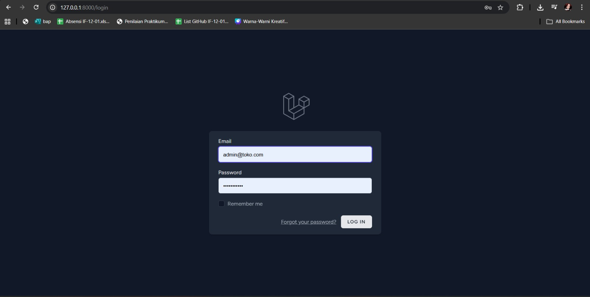
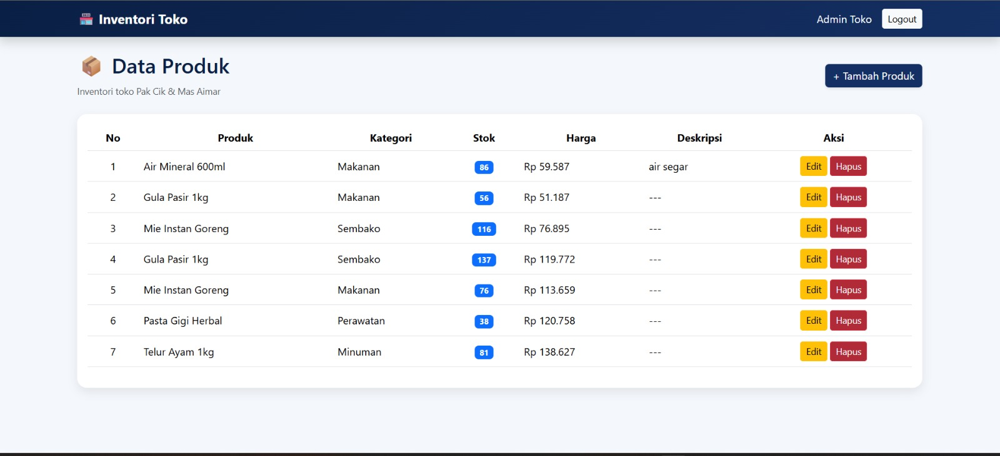
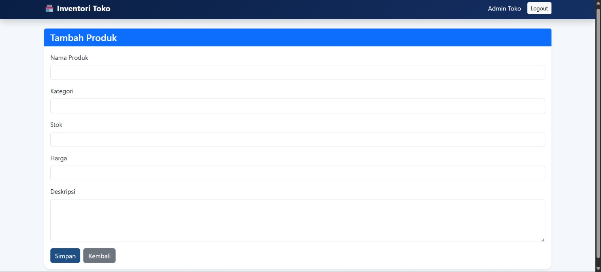
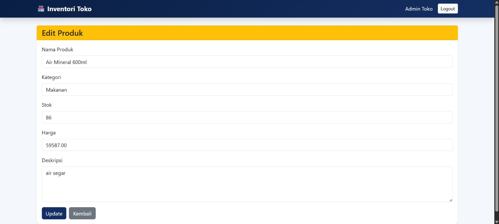

<div align="center">
  <br />
  <h1>LAPORAN PRAKTIKUM <br>APLIKASI BERBASIS PLATFORM</h1>
  <br />
  <h3>MODUL 11, 12 & 13 <br> Laravel Aplikasi Inventori Produk </h3>
  <br />
  <br />
  
  <br />
  <br />
  <br />
  <h3>Disusun Oleh :</h3>
  <p>
    <strong>Nadhif Atha Zaki</strong><br>
    <strong>2311102007</strong><br>
    <strong>S1 IF-11-01</strong>
  </p>
  <br />
  <h3>Dosen Pengampu :</h3>
  <p>
    <strong>Dimas Fanny Hebrasianto Permadi, S.ST., M.Kom</strong>
  </p>
  <br />
  <h4>Asisten Praktikum :</h4>
  <strong>Apri Pandu Wicaksono</strong> <br>
  <strong>Rangga Pradarrell Fathi</strong>
  <br />
  <h3>LABORATORIUM HIGH PERFORMANCE
 <br>FAKULTAS INFORMATIKA <br>UNIVERSITAS TELKOM PURWOKERTO <br>2026</h3>
</div>

---

## 1. Implementasi Sistem (Kebutuhan Fungsional)

Sistem **Inventori Produk** ini dibangun menggunakan framework Laravel dengan pola arsitektur **MVC (Model-View-Controller)** dan memanfaatkan **PostgreSQL** sebagai sistem manajemen basis data relasional. Sistem mencakup fitur-fitur utama sebagai berikut:

- **Autentikasi Pengguna**: Login dan logout berbasis sesi (*session-based*) menggunakan **Laravel Breeze**, sehingga seluruh halaman hanya dapat diakses oleh pengguna yang telah terautentikasi.
- **CRUD Produk**: Pengelolaan data produk secara penuh, meliputi operasi *Create*, *Read*, *Update*, dan *Delete*, yang dilindungi oleh middleware autentikasi.
- **PostgreSQL Database**: Penyimpanan data menggunakan PostgreSQL sebagai basis data relasional yang andal dan skalabel.
- **Pagination**: Daftar produk ditampilkan secara terpaginasi (10 data per halaman) untuk meningkatkan performa dan keterbacaan.
- **Modal Konfirmasi Delete**: Penghapusan data produk dilakukan melalui modal konfirmasi interaktif untuk mencegah penghapusan data yang tidak disengaja.
- **Tampilan UI Navy Estetik**: Antarmuka pengguna menggunakan tema warna navy gradient yang bersih dan modern berbasis **Bootstrap 5**, memberikan pengalaman visual yang konsisten dan profesional.

---

## 2. Penjelasan Kode Sumber

### 2.1 Migration Struktur Tabel Database

Migration mendefinisikan skema tabel `products` di database PostgreSQL. Setiap kolom beserta tipe datanya dideklarasikan secara eksplisit, kemudian dijalankan dengan perintah `php artisan migrate`. *File Referensi: `database/migrations/2026_04_07_134703_create_products_table.php`*

```php
<?php

use Illuminate\Database\Migrations\Migration;
use Illuminate\Database\Schema\Blueprint;
use Illuminate\Support\Facades\Schema;

return new class extends Migration
{
    public function up(): void
    {
        Schema::create('products', function (Blueprint $table) {
            $table->id();                              // ID auto-increment (Primary Key)
            $table->string('name');                   // Nama produk
            $table->string('category');               // Kategori produk
            $table->integer('stock')->default(0);     // Stok produk, default 0
            $table->decimal('price', 10, 2);          // Harga (10 digit, 2 desimal)
            $table->text('description')->nullable();  // Deskripsi produk (opsional)
            $table->timestamps();                     // created_at & updated_at
        });
    }

    public function down(): void
    {
        Schema::dropIfExists('products');
    }
};
```

---

### 2.2 Model `Product.php`

Model adalah representasi dari tabel database dalam bentuk objek PHP menggunakan **Eloquent ORM**. Properti `$fillable` mendaftarkan kolom mana saja yang boleh diisi secara massal (*mass assignment*) demi menjaga keamanan aplikasi dari serangan *mass assignment vulnerability*. *File Referensi: `app/Models/Product.php`*

```php
<?php

namespace App\Models;

use Illuminate\Database\Eloquent\Factories\HasFactory;
use Illuminate\Database\Eloquent\Model;

class Product extends Model
{
    use HasFactory;

    // Kolom yang diizinkan diisi secara massal (mass assignment)
    protected $fillable = [
        'name',
        'category',
        'stock',
        'price',
        'description',
    ];
}
```

---

### 2.3 Database Seeder Data Awal Produk

Seeder digunakan untuk mengisi database dengan data awal secara otomatis menggunakan perintah `php artisan db:seed`. Data ini mencakup akun pengguna administrator default serta 20 data produk yang dihasilkan melalui **factory**. *File Referensi: `database/seeders/DatabaseSeeder.php`*

```php
<?php

namespace Database\Seeders;

use App\Models\User;
use App\Models\Product;
use Illuminate\Database\Seeder;

class DatabaseSeeder extends Seeder
{
    public function run(): void
    {
        // Buat akun pengguna administrator default
        User::factory()->create([
            'name'     => 'Admin Toko',
            'email'    => 'admin@toko.com',
            'password' => bcrypt('password123'),
        ]);

        // Generate 20 data produk dummy menggunakan factory
        Product::factory(20)->create();
    }
}
```

Seeder ini memanggil `ProductSeeder` melalui mekanisme factory Laravel sehingga data produk dibuat secara acak dan realistis. Akun default dapat langsung digunakan untuk login ke sistem dengan kredensial:
- **Email**: `admin@toko.com`
- **Password**: `password123`

---

### 2.4 Routes `web.php`

Routes mendefinisikan URL yang dapat diakses oleh pengguna beserta controller yang menanganinya. Route `resource` secara otomatis membuat 7 route CRUD sekaligus. Semua route produk dibungkus dalam middleware `auth` agar hanya pengguna yang telah login yang dapat mengaksesnya. Pada aplikasi ini, halaman dashboard tidak digunakan — route root `/` langsung dialihkan ke halaman daftar produk. *File Referensi: `routes/web.php`*

```php
<?php

use App\Http\Controllers\ProfileController;
use App\Http\Controllers\ProductController;
use Illuminate\Support\Facades\Route;

// Redirect root "/" langsung ke halaman daftar produk
Route::get('/', function () {
    return redirect()->route('products.index');
});

// Grup route yang dilindungi middleware autentikasi
Route::middleware('auth')->group(function () {

    // Resource route: otomatis membuat index, create, store,
    // show, edit, update, destroy untuk produk
    Route::resource('products', ProductController::class);

    Route::get('/profile', [ProfileController::class, 'edit'])->name('profile.edit');
    Route::patch('/profile', [ProfileController::class, 'update'])->name('profile.update');
    Route::delete('/profile', [ProfileController::class, 'destroy'])->name('profile.destroy');
});

require __DIR__.'/auth.php';
```

---

### 2.5 Controller `ProductController.php`

Controller adalah inti logika aplikasi. Setiap method menangani satu jenis request HTTP dan menghubungkan Model dengan View. Method `index` menggunakan pagination, sedangkan `store` dan `update` dilengkapi validasi input untuk memastikan data yang masuk ke database selalu valid. *File Referensi: `app/Http/Controllers/ProductController.php`*

```php
<?php

namespace App\Http\Controllers;

use Illuminate\Http\Request;
use App\Models\Product;

class ProductController extends Controller
{
    // GET /products — Tampilkan daftar semua produk (pagination 10/halaman)
    public function index()
    {
        $products = Product::latest()->paginate(10);
        return view('products.index', compact('products'));
    }

    // GET /products/create — Tampilkan form tambah produk baru
    public function create()
    {
        return view('products.create');
    }

    // POST /products — Validasi dan simpan produk baru ke database
    public function store(Request $request)
    {
        $request->validate([
            'name'        => 'required|string|max:255',
            'category'    => 'required|string|max:255',
            'stock'       => 'required|integer|min:0',
            'price'       => 'required|numeric|min:0',
            'description' => 'nullable|string',
        ]);

        Product::create($request->all());

        return redirect()->route('products.index')
                         ->with('success', 'Produk berhasil ditambahkan.');
    }

    // GET /products/{id}/edit — Tampilkan form edit produk yang dipilih
    public function edit(Product $product)
    {
        return view('products.edit', compact('product'));
    }

    // PUT /products/{id} — Validasi dan perbarui data produk yang sudah ada
    public function update(Request $request, Product $product)
    {
        $request->validate([
            'name'        => 'required|string|max:255',
            'category'    => 'required|string|max:255',
            'stock'       => 'required|integer|min:0',
            'price'       => 'required|numeric|min:0',
            'description' => 'nullable|string',
        ]);

        $product->update($request->all());

        return redirect()->route('products.index')
                         ->with('success', 'Produk berhasil diperbarui.');
    }

    // DELETE /products/{id} — Hapus produk dari database
    public function destroy(Product $product)
    {
        $product->delete();

        return redirect()->route('products.index')
                         ->with('success', 'Produk berhasil dihapus.');
    }
}
```

---

### 2.6 View Layout Utama (`layouts/app.blade.php`)

Layout utama mendefinisikan kerangka halaman yang digunakan oleh semua halaman dalam aplikasi. Menggunakan komponen Blade `x-app-layout`. Navbar bagian atas menggunakan warna **navy gradient** yang memberikan tampilan bersih dan modern. Layout juga menampilkan nama pengguna yang sedang login serta tombol logout. *File Referensi: `resources/views/layouts/app.blade.php`*

```html
<!-- Navbar atas dengan gradien navy -->
<nav style="background: linear-gradient(135deg, #0f172a 0%, #1e3a5f 50%, #1a2f5e 100%);
            box-shadow: 0 4px 20px rgba(0,0,0,0.3);">

    <!-- Branding / Logo Aplikasi -->
    <div style="display:flex; align-items:center; gap:12px; padding: 16px 24px;">
        <div style="background: linear-gradient(135deg, #3b82f6, #6366f1);
                    border-radius: 12px; padding: 8px 12px;">
            <span style="color:white; font-weight:900; font-size:18px;">IP</span>
        </div>
        <div>
            <p style="color:white; font-weight:700; margin:0;">Inventori Produk</p>
            <p style="color:#94a3b8; font-size:12px; margin:0;">Sistem Manajemen Stok</p>
        </div>
    </div>

    <!-- Menu Navigasi -->
    <nav>
        <a href="{{ route('products.index') }}"
           style="{{ request()->routeIs('products.*')
                    ? 'background:rgba(59,130,246,0.2); color:#60a5fa;'
                    : 'color:#cbd5e1;' }}">
            <!-- SVG Icon Produk -->
            Data Produk
        </a>
    </nav>

    <!-- Info User & Tombol Logout -->
    <div style="display:flex; align-items:center; gap:12px; padding: 12px 24px;">
        <p style="color:#94a3b8;">{{ Auth::user()->name }}</p>
        <form method="POST" action="{{ route('logout') }}">
            @csrf
            <button type="submit"
                    style="background: rgba(239,68,68,0.15); color: #f87171;
                           border: 1px solid rgba(239,68,68,0.3); border-radius: 8px;
                           padding: 6px 14px; cursor:pointer;">
                Keluar
            </button>
        </form>
    </div>
</nav>

<!-- Area Konten Utama -->
<main style="flex:1; overflow-y:auto; background:#f1f5f9; padding:32px;">
    {{ $slot }}  <!-- Konten halaman disisipkan di sini -->
</main>
```

---

### 2.7 View Halaman Login (`auth/login.blade.php`)

Halaman login dibuat menggunakan **Laravel Breeze** dengan layout `x-guest-layout`. Autentikasi berbasis sesi (*session-based*) memastikan pengguna tetap terautentikasi selama sesi browser aktif. Form mengirim data email dan password ke route `login` menggunakan metode POST yang dilindungi token CSRF. *File Referensi: `resources/views/auth/login.blade.php`*

```html
<x-guest-layout>
    <!-- Status session (pesan error atau informasi login) -->
    <x-auth-session-status :status="session('status')" />

    <form method="POST" action="{{ route('login') }}">
        @csrf <!-- Token keamanan CSRF -->

        <!-- Input Email -->
        <label for="email">Email</label>
        <input id="email" type="email" name="email"
               value="{{ old('email') }}" required autofocus
               placeholder="admin@toko.com">
        @error('email')
            <p style="color:#ef4444;">{{ $message }}</p>
        @enderror

        <!-- Input Password -->
        <label for="password">Password</label>
        <input id="password" type="password" name="password"
               required placeholder="Masukkan password">
        @error('password')
            <p style="color:#ef4444;">{{ $message }}</p>
        @enderror

        <!-- Checkbox Ingat Saya -->
        <input id="remember_me" type="checkbox" name="remember">
        <label for="remember_me">Ingat saya</label>

        <!-- Tombol Submit -->
        <button type="submit"
                style="background: linear-gradient(135deg, #1e3a5f, #2563eb);
                       color:white; border:none; border-radius:10px;
                       padding:12px 24px; width:100%; font-weight:600; cursor:pointer;">
            Masuk ke Sistem
        </button>
    </form>
</x-guest-layout>
```

---

### 2.8 View Daftar Produk (`products/index.blade.php`)

Halaman index menampilkan seluruh data produk dalam tabel berpaginasi (10 data per halaman). Setiap baris memiliki tombol **Edit** (menuju halaman edit) dan **Hapus** (membuka modal konfirmasi). Badge status (*Tersedia* / *Habis*) ditampilkan secara dinamis berdasarkan nilai stok. Modal hapus dikendalikan oleh fungsi JavaScript murni (`openDeleteModal`) yang mengisi form action secara dinamis. *File Referensi: `resources/views/products/index.blade.php`*

```html
<!-- Tabel daftar produk -->
<table style="width:100%; border-collapse:collapse;">
    <thead style="background: linear-gradient(135deg, #0f172a, #1e3a5f);">
        <tr>
            <th style="color:white; padding:14px 16px;">No</th>
            <th style="color:white; padding:14px 16px;">Nama Produk</th>
            <th style="color:white; padding:14px 16px;">Kategori</th>
            <th style="color:white; padding:14px 16px;">Harga</th>
            <th style="color:white; padding:14px 16px;">Stok</th>
            <th style="color:white; padding:14px 16px;">Status</th>
            <th style="color:white; padding:14px 16px;">Tindakan</th>
        </tr>
    </thead>
    <tbody>
        @forelse($products as $product)
        <tr style="border-bottom: 1px solid #e2e8f0;">
            <td style="padding:14px 16px;">{{ $loop->iteration }}</td>
            <td style="padding:14px 16px;">
                <p style="font-weight:600; margin:0;">{{ $product->name }}</p>
                <p style="color:#64748b; font-size:13px; margin:0;">
                    {{ Str::limit($product->description, 50) ?? '—' }}
                </p>
            </td>
            <td style="padding:14px 16px;">{{ $product->category }}</td>
            <td style="padding:14px 16px;">
                Rp {{ number_format($product->price, 0, ',', '.') }}
            </td>
            <td style="padding:14px 16px;">{{ $product->stock }}</td>
            <td style="padding:14px 16px;">
                @if($product->stock > 0)
                    <span style="background:#dcfce7; color:#16a34a;
                                 padding:4px 10px; border-radius:20px; font-size:12px;">
                        Tersedia
                    </span>
                @else
                    <span style="background:#fee2e2; color:#dc2626;
                                 padding:4px 10px; border-radius:20px; font-size:12px;">
                        Habis
                    </span>
                @endif
            </td>
            <td style="padding:14px 16px;">
                <!-- Tombol Edit -->
                <a href="{{ route('products.edit', $product) }}"
                   style="background:#dbeafe; color:#1d4ed8; padding:6px 12px;
                          border-radius:8px; text-decoration:none; font-size:13px;">
                    Edit
                </a>

                <!-- Tombol Hapus — membuka modal konfirmasi -->
                <button onclick="openDeleteModal({{ $product->id }}, '{{ $product->name }}')"
                        style="background:#fee2e2; color:#dc2626; border:none;
                               padding:6px 12px; border-radius:8px; cursor:pointer; font-size:13px;">
                    Hapus
                </button>
            </td>
        </tr>
        @empty
            <tr>
                <td colspan="7" style="text-align:center; padding:40px; color:#94a3b8;">
                    Belum ada data produk.
                </td>
            </tr>
        @endforelse
    </tbody>
</table>

<!-- Pagination -->
<div style="margin-top:24px;">
    {{ $products->links() }}
</div>

<!-- Modal Konfirmasi Hapus -->
<div id="modal-panel"
     style="display:none; position:fixed; inset:0; z-index:50;
            background:rgba(0,0,0,0.5); align-items:center; justify-content:center;">
    <div id="modal-card"
         style="background:white; border-radius:24px; max-width:420px;
                width:90%; padding:32px; text-align:center;">
        <h2 style="color:#0f172a; font-size:20px; font-weight:700;">Hapus Data Produk?</h2>
        <p style="color:#64748b; margin:12px 0;">
            Produk <strong id="modal-product-name"></strong> akan dihapus secara permanen.
        </p>
        <form id="deleteForm" method="POST" action="">
            @csrf
            @method('DELETE')
        </form>
        <div style="display:flex; gap:12px; justify-content:center; margin-top:24px;">
            <button onclick="closeDeleteModal()"
                    style="background:#f1f5f9; color:#475569; border:none;
                           padding:10px 24px; border-radius:10px; cursor:pointer; font-weight:600;">
                Kembali
            </button>
            <button onclick="document.getElementById('deleteForm').submit()"
                    style="background:linear-gradient(135deg,#dc2626,#ef4444); color:white;
                           border:none; padding:10px 24px; border-radius:10px;
                           cursor:pointer; font-weight:600;">
                Ya, Hapus
            </button>
        </div>
    </div>
</div>

<!-- JavaScript controller untuk modal hapus -->
<script>
    function openDeleteModal(productId, productName) {
        document.getElementById('modal-product-name').textContent = productName;
        document.getElementById('deleteForm').action = '/products/' + productId;
        document.getElementById('modal-panel').style.display = 'flex';
    }
    function closeDeleteModal() {
        document.getElementById('modal-panel').style.display = 'none';
    }
    document.addEventListener('keydown', function(e) {
        if (e.key === 'Escape') closeDeleteModal();
    });
</script>
```

---

### 2.9 View Form Tambah Produk (`products/create.blade.php`)

Form tambah produk menggunakan metode POST ke route `products.store`. Terdapat lima field input yang wajib diisi, yaitu nama produk, kategori, stok, harga, dan deskripsi (opsional). Validasi error ditampilkan secara inline di bawah masing-masing field apabila input tidak valid. *File Referensi: `resources/views/products/create.blade.php`*

```html
<form method="POST" action="{{ route('products.store') }}">
    @csrf

    <!-- Input Nama Produk -->
    <label for="name">Nama Produk <span style="color:#ef4444;">*</span></label>
    <input id="name" type="text" name="name"
           value="{{ old('name') }}" required
           placeholder="Contoh: Laptop Gaming ASUS ROG">
    @error('name')
        <p style="color:#ef4444; font-size:13px;">{{ $message }}</p>
    @enderror

    <!-- Input Kategori -->
    <label for="category">Kategori <span style="color:#ef4444;">*</span></label>
    <input id="category" type="text" name="category"
           value="{{ old('category') }}" required
           placeholder="Contoh: Elektronik">
    @error('category')
        <p style="color:#ef4444; font-size:13px;">{{ $message }}</p>
    @enderror

    <!-- Grid 2 kolom: Harga & Stok -->
    <div style="display:grid; grid-template-columns:1fr 1fr; gap:20px;">

        <!-- Input Harga -->
        <div>
            <label for="price">Harga <span style="color:#ef4444;">*</span></label>
            <input id="price" type="number" name="price"
                   value="{{ old('price') }}" required min="0" step="0.01">
            @error('price')
                <p style="color:#ef4444; font-size:13px;">{{ $message }}</p>
            @enderror
        </div>

        <!-- Input Stok -->
        <div>
            <label for="stock">Stok <span style="color:#ef4444;">*</span></label>
            <input id="stock" type="number" name="stock"
                   value="{{ old('stock', 0) }}" required min="0">
            @error('stock')
                <p style="color:#ef4444; font-size:13px;">{{ $message }}</p>
            @enderror
        </div>
    </div>

    <!-- Input Deskripsi (Opsional) -->
    <label for="description">Deskripsi (Opsional)</label>
    <textarea id="description" name="description"
              rows="4" placeholder="Masukkan deskripsi produk...">
        {{ old('description') }}
    </textarea>

    <!-- Tombol Aksi -->
    <a href="{{ route('products.index') }}"
       style="background:#f1f5f9; color:#475569; padding:10px 24px;
              border-radius:10px; text-decoration:none; font-weight:600;">
        Batal
    </a>
    <button type="submit"
            style="background:linear-gradient(135deg,#1e3a5f,#2563eb); color:white;
                   border:none; padding:10px 24px; border-radius:10px;
                   cursor:pointer; font-weight:600;">
        Simpan Produk
    </button>
</form>
```

---

### 2.10 View Form Edit Produk (`products/edit.blade.php`)

Form edit menggunakan metode PUT (di-*spoof* melalui `@method('PUT')`) ke route `products.update`. Seluruh field diisi secara otomatis dengan data produk yang sedang diedit menggunakan helper `old()` dengan fallback ke nilai dari database (`$product->field`). Struktur field identik dengan form create, namun terdapat banner peringatan kuning sebagai pengingat bahwa perubahan akan disimpan secara permanen. *File Referensi: `resources/views/products/edit.blade.php`*

```html
<form method="POST" action="{{ route('products.update', $product) }}">
    @csrf
    @method('PUT')  <!-- HTTP method spoofing untuk PUT request -->

    <!-- Banner Peringatan -->
    <div style="background:#fef9c3; border:1px solid #fde047;
                border-radius:10px; padding:12px 16px; margin-bottom:20px; color:#854d0e;">
        ⚠️ Pastikan data yang diubah sudah benar sebelum menyimpan.
    </div>

    <!-- Nama Produk — diisi otomatis dari data yang ada -->
    <label for="name">Nama Produk <span style="color:#ef4444;">*</span></label>
    <input id="name" type="text" name="name"
           value="{{ old('name', $product->name) }}" required>
    @error('name')
        <p style="color:#ef4444; font-size:13px;">{{ $message }}</p>
    @enderror

    <!-- Kategori — diisi otomatis -->
    <label for="category">Kategori <span style="color:#ef4444;">*</span></label>
    <input id="category" type="text" name="category"
           value="{{ old('category', $product->category) }}" required>
    @error('category')
        <p style="color:#ef4444; font-size:13px;">{{ $message }}</p>
    @enderror

    <!-- Harga & Stok — 2 kolom -->
    <div style="display:grid; grid-template-columns:1fr 1fr; gap:20px;">
        <div>
            <label for="price">Harga <span style="color:#ef4444;">*</span></label>
            <input id="price" type="number" name="price"
                   value="{{ old('price', $product->price) }}" required min="0" step="0.01">
            @error('price')
                <p style="color:#ef4444; font-size:13px;">{{ $message }}</p>
            @enderror
        </div>
        <div>
            <label for="stock">Stok <span style="color:#ef4444;">*</span></label>
            <input id="stock" type="number" name="stock"
                   value="{{ old('stock', $product->stock) }}" required min="0">
            @error('stock')
                <p style="color:#ef4444; font-size:13px;">{{ $message }}</p>
            @enderror
        </div>
    </div>

    <!-- Deskripsi — diisi otomatis -->
    <label for="description">Deskripsi (Opsional)</label>
    <textarea id="description" name="description" rows="4">
        {{ old('description', $product->description) }}
    </textarea>

    <!-- Tombol Aksi -->
    <a href="{{ route('products.index') }}"
       style="background:#f1f5f9; color:#475569; padding:10px 24px;
              border-radius:10px; text-decoration:none; font-weight:600;">
        Batal
    </a>
    <button type="submit"
            style="background:linear-gradient(135deg,#1e3a5f,#2563eb); color:white;
                   border:none; padding:10px 24px; border-radius:10px;
                   cursor:pointer; font-weight:600;">
        Perbarui Produk
    </button>
</form>
```

---

## 3. Hasil Tampilan (Screenshots) Aplikasi

### 3.1 Halaman Login

Halaman autentikasi pengguna yang dibangun menggunakan **Laravel Breeze**. Sistem menggunakan autentikasi berbasis sesi (*session-based*), sehingga pengguna harus memasukkan email dan password yang valid untuk dapat mengakses sistem. Form login berada dalam sebuah *card* terpusat dengan latar belakang bergradien navy yang estetik. Seluruh halaman inventori produk hanya dapat diakses setelah pengguna berhasil login.



---

### 3.2 Halaman Produk

Halaman utama sistem yang menampilkan seluruh data produk dalam sebuah tabel interaktif dan berpaginasi. Setiap baris data menampilkan nama produk, kategori, harga, jumlah stok, dan badge status ketersediaan (*Tersedia* / *Habis*). Terdapat tombol **Edit** untuk mengubah data produk dan tombol **Hapus** yang akan membuka modal konfirmasi sebelum data benar-benar dihapus dari database. Navigasi halaman ditampilkan di bagian bawah tabel dengan komponen pagination Laravel.



---

### 3.3 Halaman Tambah Produk

Halaman formulir untuk menambahkan data produk baru ke dalam sistem. Form terdiri dari lima field input: nama produk, kategori, stok, harga (ditampilkan dalam layout dua kolom berdampingan), dan deskripsi. Setiap field dilengkapi validasi sisi server; pesan error akan muncul secara *inline* di bawah field yang bermasalah apabila pengguna memasukkan data yang tidak valid. Tombol **Batal** mengarahkan kembali ke halaman daftar produk tanpa menyimpan perubahan.



---

### 3.4 Halaman Edit Produk

Halaman formulir untuk memperbarui data produk yang sudah ada dalam database. Struktur form identik dengan halaman tambah produk, namun seluruh field telah terisi secara otomatis dengan data produk yang dipilih. Terdapat banner peringatan berwarna kuning di bagian atas form sebagai pengingat agar pengguna memastikan kebenaran data sebelum menyimpan perubahan. Perubahan dikirimkan menggunakan metode HTTP `PUT` melalui mekanisme *method spoofing* Laravel.



---

## 4. Referensi

- **Laravel Documentation**: [https://laravel.com/docs](https://laravel.com/docs)
- **Laravel Breeze (Autentikasi)**: [https://laravel.com/docs/starter-kits#laravel-breeze](https://laravel.com/docs/starter-kits#laravel-breeze)
- **Eloquent ORM**: [https://laravel.com/docs/eloquent](https://laravel.com/docs/eloquent)
- **Laravel Blade Templates**: [https://laravel.com/docs/blade](https://laravel.com/docs/blade)
- **Laravel Resource Controllers**: [https://laravel.com/docs/controllers#resource-controllers](https://laravel.com/docs/controllers#resource-controllers)
