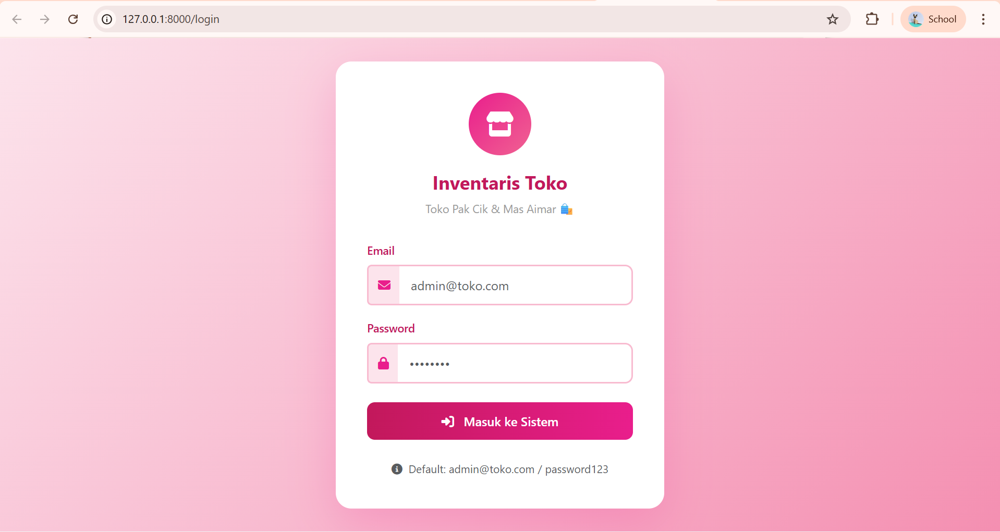
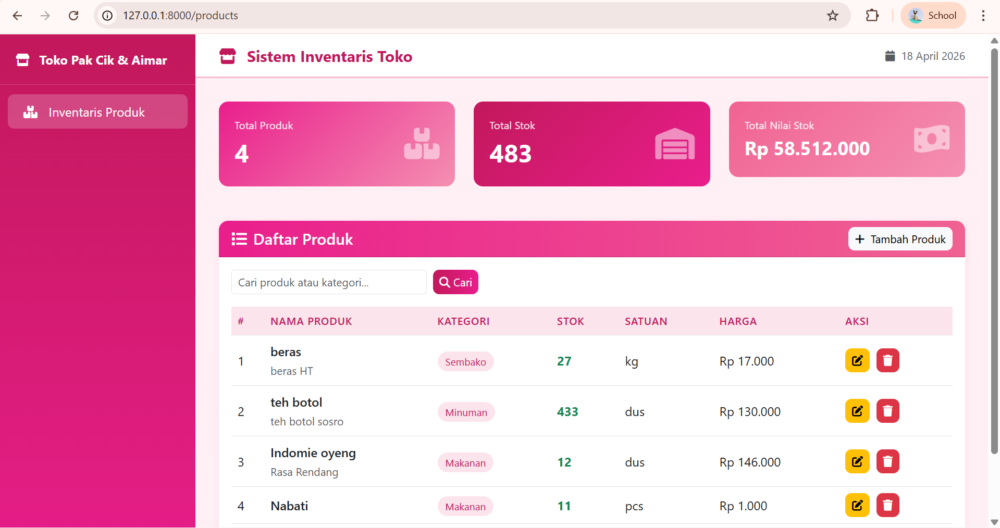
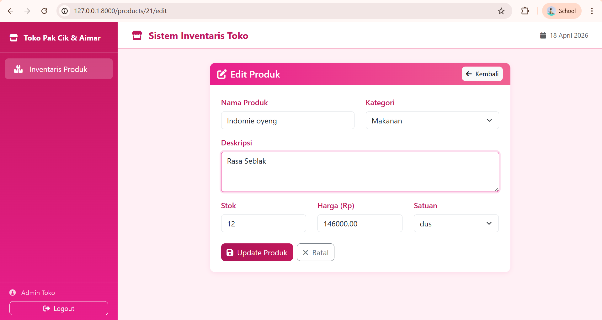
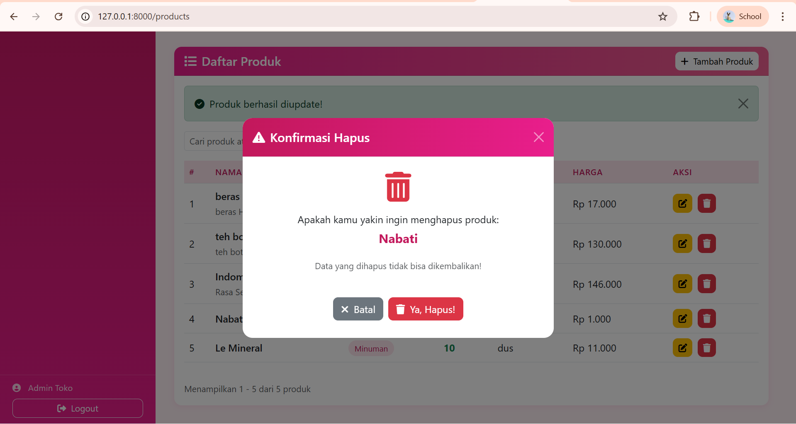
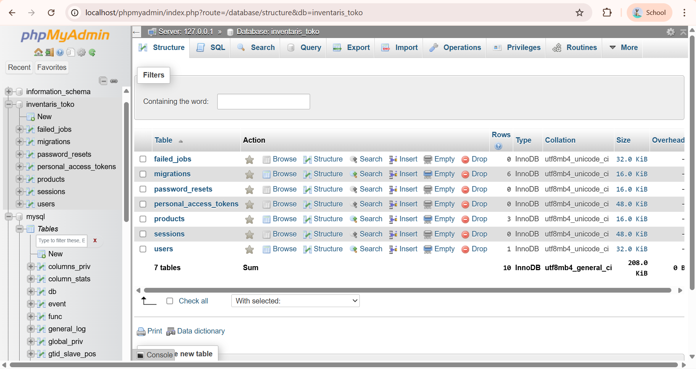

<div align="center">

# LAPORAN PRAKTIKUM
# APLIKASI BERBASIS PLATFORM

---

## MODUL 11, 12, 13
## LARAVEL

---


---

**Disusun Oleh :**

**ANNISA AL JAUHAR**

**2311102014**

**S1 IF-11-REG01**

---

**Dosen Pengampu :**

Dimas Fanny Hebrasianto Permadi, S.ST., M.Kom

---

**PROGRAM STUDI S1 INFORMATIKA**

**FAKULTAS INFORMATIKA**

**UNIVERSITAS TELKOM PURWOKERTO**

**2025/2026**

</div>

---

## 1. Dasar Teori

### Laravel Framework
Laravel adalah framework PHP berbasis MVC (Model-View-Controller) yang menyediakan struktur pengembangan web yang elegan dan terorganisir. Laravel menyederhanakan berbagai tugas umum seperti routing, autentikasi, migrasi database, dan manajemen session. Pada praktikum ini Laravel digunakan sebagai fondasi utama untuk membangun sistem inventaris toko dengan fitur CRUD produk dan autentikasi pengguna.

### MVC (Model-View-Controller)
MVC adalah pola arsitektur perangkat lunak yang memisahkan logika aplikasi menjadi tiga komponen utama. Model bertugas mengelola data dan interaksi dengan database, View bertanggung jawab atas tampilan antarmuka pengguna, dan Controller menjadi perantara antara Model dan View untuk memproses request dari pengguna. Pada praktikum ini, Model `Product` dan `User` mengelola data, Controller `ProductController` dan `AuthController` memproses logika, serta file Blade template menjadi View yang ditampilkan ke pengguna.

### Eloquent ORM
Eloquent adalah ORM (Object-Relational Mapping) bawaan Laravel yang memungkinkan interaksi dengan database menggunakan sintaks PHP yang ekspresif tanpa perlu menulis query SQL secara manual. Setiap tabel database direpresentasikan oleh sebuah Model. Pada praktikum ini Eloquent digunakan untuk operasi CRUD produk seperti `Product::create()`, `Product::paginate()`, `$product->update()`, dan `$product->delete()`.

### Migration dan Schema Builder
Migration adalah mekanisme Laravel untuk mendefinisikan dan mengelola struktur database menggunakan kode PHP. Migration memungkinkan pembuatan, modifikasi, dan penghapusan tabel secara terstruktur dan dapat di-rollback. Pada praktikum ini migration digunakan untuk membuat tabel `users` dan `products` dengan kolom-kolom yang telah didefinisikan menggunakan Schema Builder Laravel.

### Database Factory dan Seeder
Factory adalah kelas yang digunakan untuk menghasilkan data dummy secara otomatis menggunakan library Faker. Seeder adalah kelas yang memanggil Factory untuk mengisi database dengan data awal. Kombinasi keduanya memungkinkan pengisian database dengan data contoh yang realistis secara cepat. Pada praktikum ini `ProductFactory` menghasilkan 20 data produk dummy dengan nama, kategori, stok, harga, dan satuan yang diacak secara otomatis.

### Sistem Autentikasi dengan Session
Autentikasi berbasis session adalah mekanisme keamanan di mana informasi pengguna yang telah login disimpan di sisi server dalam bentuk session. Laravel menyediakan facade `Auth` yang memudahkan proses login, logout, dan pengecekan status autentikasi. Middleware `auth` digunakan untuk melindungi route tertentu sehingga hanya pengguna yang sudah login yang dapat mengaksesnya. Pada praktikum ini session disimpan di database pada tabel `sessions` menggunakan driver `database`.

### Blade Template Engine
Blade adalah template engine bawaan Laravel yang memungkinkan penulisan kode PHP di dalam file HTML dengan sintaks yang lebih bersih dan mudah dibaca. Blade mendukung inheritance layout dengan direktif `@extends` dan `@section`, perulangan dengan `@foreach`, kondisi dengan `@if`, serta komponen lainnya. Pada praktikum ini seluruh tampilan dibangun menggunakan Blade template dengan layout utama `layouts/app.blade.php`.

### Bootstrap 5
Bootstrap 5 adalah framework CSS open-source yang menyediakan komponen antarmuka yang responsif dan modern. Pada praktikum ini Bootstrap 5 digunakan untuk membangun tampilan web inventaris dengan tema warna pink, termasuk sidebar navigasi, tabel produk dengan pagination, form input, modal konfirmasi hapus, dan kartu statistik.

---

## 2. Struktur Project

```
inventaris-toko/
├── app/
│   ├── Http/
│   │   └── Controllers/
│   │       ├── AuthController.php       (login & logout)
│   │       └── ProductController.php    (CRUD produk)
│   ├── Models/
│   │   ├── Product.php                  (model produk)
│   │   └── User.php                     (model user)
│   └── Providers/
│       └── AppServiceProvider.php       (konfigurasi pagination)
├── database/
│   ├── factories/
│   │   └── ProductFactory.php           (generator data dummy)
│   ├── migrations/
│   │   ├── create_users_table.php       (struktur tabel users)
│   │   └── create_products_table.php    (struktur tabel products)
│   └── seeders/
│       └── DatabaseSeeder.php           (pengisi data awal)
├── resources/
│   └── views/
│       ├── layouts/
│       │   └── app.blade.php            (layout utama)
│       ├── auth/
│       │   └── login.blade.php          (halaman login)
│       └── products/
│           ├── index.blade.php          (daftar produk / datatable)
│           ├── create.blade.php         (form tambah produk)
│           └── edit.blade.php           (form edit produk)
├── routes/
│   └── web.php                          (definisi semua route)
└── .env                                 (konfigurasi database & session)
```

---

## 3. Struktur Database

### Tabel `users`
| Kolom | Tipe | Keterangan |
|-------|------|------------|
| id | BIGINT (PK) | Primary key auto increment |
| name | VARCHAR(255) | Nama pengguna |
| email | VARCHAR(255) | Email unik pengguna |
| password | VARCHAR(255) | Password terenkripsi |
| created_at | TIMESTAMP | Waktu dibuat |
| updated_at | TIMESTAMP | Waktu diperbarui |

### Tabel `products`
| Kolom | Tipe | Keterangan |
|-------|------|------------|
| id | BIGINT (PK) | Primary key auto increment |
| name | VARCHAR(255) | Nama produk |
| category | VARCHAR(255) | Kategori produk |
| description | TEXT (nullable) | Deskripsi produk |
| stock | INTEGER | Jumlah stok |
| price | DECIMAL(10,2) | Harga produk |
| unit | VARCHAR(50) | Satuan produk |
| created_at | TIMESTAMP | Waktu dibuat |
| updated_at | TIMESTAMP | Waktu diperbarui |

### Tabel `sessions`
| Kolom | Tipe | Keterangan |
|-------|------|------------|
| id | VARCHAR(255) | Session ID unik |
| user_id | BIGINT (nullable) | ID pengguna yang login |
| ip_address | VARCHAR(45) | Alamat IP pengguna |
| user_agent | TEXT | Informasi browser |
| payload | LONGTEXT | Data session terenkripsi |
| last_activity | INTEGER | Waktu aktivitas terakhir |

---

## 4. Source Code

### routes/web.php
```php
<?php

use Illuminate\Support\Facades\Route;
use App\Http\Controllers\AuthController;
use App\Http\Controllers\ProductController;

Route::get('/', function () {
    return redirect()->route('login');
});
Route::get('/login', [AuthController::class, 'showLogin'])->name('login');
Route::post('/login', [AuthController::class, 'login'])->name('login.post');
Route::post('/logout', [AuthController::class, 'logout'])->name('logout');

Route::middleware('auth')->group(function () {
    Route::resource('products', ProductController::class);
});
```

### app/Http/Controllers/AuthController.php
```php
<?php

namespace App\Http\Controllers;

use Illuminate\Http\Request;
use Illuminate\Support\Facades\Auth;

class AuthController extends Controller
{
    public function showLogin()
    {
        return view('auth.login');
    }

    public function login(Request $request)
    {
        $credentials = $request->validate([
            'email' => 'required|email',
            'password' => 'required',
        ]);

        if (Auth::attempt($credentials)) {
            $request->session()->regenerate();
            return redirect()->route('products.index');
        }

        return back()->withErrors([
            'email' => 'Email atau password salah!',
        ]);
    }

    public function logout(Request $request)
    {
        Auth::logout();
        $request->session()->invalidate();
        $request->session()->regenerateToken();
        return redirect()->route('login');
    }
}
```

### app/Http/Controllers/ProductController.php
```php
<?php

namespace App\Http\Controllers;

use App\Models\Product;
use Illuminate\Http\Request;

class ProductController extends Controller
{
    public function index(Request $request)
    {
        $search = $request->get('search');
        $products = Product::when($search, function ($query, $search) {
            return $query->where('name', 'like', "%{$search}%")
                         ->orWhere('category', 'like', "%{$search}%");
        })->paginate(10);

        return view('products.index', compact('products', 'search'));
    }

    public function create()
    {
        return view('products.create');
    }

    public function store(Request $request)
    {
        $request->validate([
            'name'        => 'required|string|max:255',
            'category'    => 'required|string|max:255',
            'description' => 'nullable|string',
            'stock'       => 'required|integer|min:0',
            'price'       => 'required|numeric|min:0',
            'unit'        => 'required|string|max:50',
        ]);

        Product::create($request->except('_token', '_method'));
        return redirect()->route('products.index')->with('success', 'Produk berhasil ditambahkan!');
    }

    public function edit(Product $product)
    {
        return view('products.edit', compact('product'));
    }

    public function update(Request $request, Product $product)
    {
        $request->validate([
            'name'        => 'required|string|max:255',
            'category'    => 'required|string|max:255',
            'description' => 'nullable|string',
            'stock'       => 'required|integer|min:0',
            'price'       => 'required|numeric|min:0',
            'unit'        => 'required|string|max:50',
        ]);

        $product->update($request->except('_token', '_method'));
        return redirect()->route('products.index')->with('success', 'Produk berhasil diupdate!');
    }

    public function destroy(Product $product)
    {
        $product->delete();
        return redirect()->route('products.index')->with('success', 'Produk berhasil dihapus!');
    }
}
```

### database/migrations/create_products_table.php
```php
<?php

use Illuminate\Database\Migrations\Migration;
use Illuminate\Database\Schema\Blueprint;
use Illuminate\Support\Facades\Schema;

return new class extends Migration
{
    public function up(): void
    {
        Schema::create('products', function (Blueprint $table) {
            $table->id();
            $table->string('name');
            $table->string('category');
            $table->text('description')->nullable();
            $table->integer('stock');
            $table->decimal('price', 10, 2);
            $table->string('unit')->default('pcs');
            $table->timestamps();
        });
    }

    public function down(): void
    {
        Schema::dropIfExists('products');
    }
};
```

### database/factories/ProductFactory.php
```php
<?php

namespace Database\Factories;

use Illuminate\Database\Eloquent\Factories\Factory;

class ProductFactory extends Factory
{
    public function definition(): array
    {
        $categories = ['Makanan', 'Minuman', 'Sembako', 'Kebersihan', 'Elektronik'];
        $units = ['pcs', 'kg', 'liter', 'lusin', 'pack'];

        return [
            'name'        => $this->faker->words(3, true),
            'category'    => $this->faker->randomElement($categories),
            'description' => $this->faker->sentence(),
            'stock'       => $this->faker->numberBetween(10, 500),
            'price'       => $this->faker->numberBetween(1000, 500000),
            'unit'        => $this->faker->randomElement($units),
        ];
    }
}
```

### database/seeders/DatabaseSeeder.php
```php
<?php

namespace Database\Seeders;

use App\Models\Product;
use App\Models\User;
use Illuminate\Database\Seeder;
use Illuminate\Support\Facades\Hash;

class DatabaseSeeder extends Seeder
{
    public function run(): void
    {
        User::create([
            'name'     => 'Admin Toko',
            'email'    => 'admin@toko.com',
            'password' => Hash::make('password123'),
        ]);

        Product::factory(20)->create();
    }
}
```

---

## 5. Langkah-Langkah Penggunaan

### 5.1 Tampilan Halaman Login
Saat aplikasi dibuka di browser melalui `http://127.0.0.1:8000`, pengguna akan langsung diarahkan ke halaman login. Halaman ini menampilkan form dengan dua field yaitu Email dan Password, serta tombol "Masuk ke Sistem". Halaman login menggunakan desain dengan latar belakang gradien pink dan card putih di tengah. Sistem autentikasi menggunakan session yang disimpan di database sehingga status login pengguna tetap terjaga selama sesi berlangsung.



### 5.2 Tampilan Halaman Daftar Produk
Setelah berhasil login menggunakan email `admin@toko.com` dan password `password123`, pengguna akan diarahkan ke halaman daftar produk. Halaman ini menampilkan tiga kartu statistik di bagian atas yang menunjukkan total produk, total stok, dan total nilai stok. Di bawahnya terdapat tabel produk bergaya datatable dengan fitur pencarian dan pagination yang menampilkan 10 produk per halaman. Setiap baris tabel memiliki tombol edit (kuning) dan hapus (merah).



### 5.3 Tampilan Form Tambah Produk
Ketika tombol "Tambah Produk" diklik, pengguna diarahkan ke halaman form tambah produk baru. Form ini memiliki field Nama Produk, Kategori (dropdown), Deskripsi, Stok, Harga, dan Satuan (dropdown). Setelah form diisi dan tombol "Simpan Produk" diklik, data akan tersimpan ke database dan pengguna diarahkan kembali ke halaman daftar produk dengan notifikasi sukses.


### 5.4 Tampilan Form Edit Produk
Ketika tombol edit diklik pada salah satu produk, pengguna diarahkan ke halaman form edit yang sudah terisi dengan data produk yang dipilih. Pengguna dapat mengubah nilai pada field yang diinginkan lalu menekan tombol "Update Produk" untuk menyimpan perubahan. Sistem akan melakukan validasi sebelum data diperbarui di database.



### 5.5 Tampilan Modal Konfirmasi Hapus
Ketika tombol hapus (ikon tempat sampah) diklik, akan muncul modal konfirmasi di tengah halaman yang menampilkan nama produk yang akan dihapus beserta peringatan bahwa data tidak dapat dikembalikan. Terdapat dua tombol yaitu "Batal" untuk membatalkan dan "Ya, Hapus!" untuk mengkonfirmasi penghapusan. Jika dikonfirmasi, produk akan dihapus dari database dan pengguna mendapat notifikasi sukses.



### 5.6 Tampilan Database di phpMyAdmin
Database `inventaris_toko` berhasil dibuat dengan beberapa tabel yang dihasilkan oleh migration Laravel. Tabel `products` menyimpan data produk yang diisi oleh Factory dan Seeder sebanyak 20 data dummy. Tabel `users` menyimpan data akun admin. Tabel `sessions` menyimpan data session pengguna yang sedang login sebagai implementasi dari sistem autentikasi berbasis session.



---

## 6. Cara Menjalankan Aplikasi

```bash
# 1. Pastikan XAMPP sudah terinstal dan Apache + MySQL sudah aktif

# 2. Clone atau copy project ke direktori htdocs XAMPP
#    Contoh: C:\xampp\htdocs\inventaris-toko

# 3. Masuk ke direktori project
cd C:\xampp\htdocs\inventaris-toko

# 4. Install dependencies Laravel
composer install

# 5. Copy file .env dan generate key
cp .env.example .env
php artisan key:generate

# 6. Sesuaikan konfigurasi database di file .env
DB_CONNECTION=mysql
DB_HOST=127.0.0.1
DB_PORT=3306
DB_DATABASE=inventaris_toko
DB_USERNAME=root
DB_PASSWORD=

# 7. Sesuaikan driver session di file .env
SESSION_DRIVER=database

# 8. Jalankan migration dan seeder
php artisan migrate --seed

# 9. Jalankan server Laravel
php artisan serve

# 10. Buka browser dan akses aplikasi
http://127.0.0.1:8000

# Akun default untuk login:
# Email    : admin@toko.com
# Password : password123
```

---

## 7. Fitur Aplikasi

| Fitur | Keterangan |
|-------|------------|
| Login & Logout | Autentikasi pengguna menggunakan session database |
| Proteksi Route | Halaman produk hanya bisa diakses setelah login |
| Daftar Produk | Menampilkan semua produk dengan tampilan datatable |
| Pencarian | Pencarian produk berdasarkan nama atau kategori |
| Pagination | Pembagian halaman 10 produk per halaman |
| Statistik | Kartu info total produk, stok, dan nilai stok |
| Tambah Produk | Form untuk menambahkan produk baru ke database |
| Edit Produk | Form untuk mengubah data produk yang sudah ada |
| Hapus Produk | Penghapusan produk dengan konfirmasi modal |
| Data Dummy | 20 produk otomatis dihasilkan oleh Factory & Seeder |