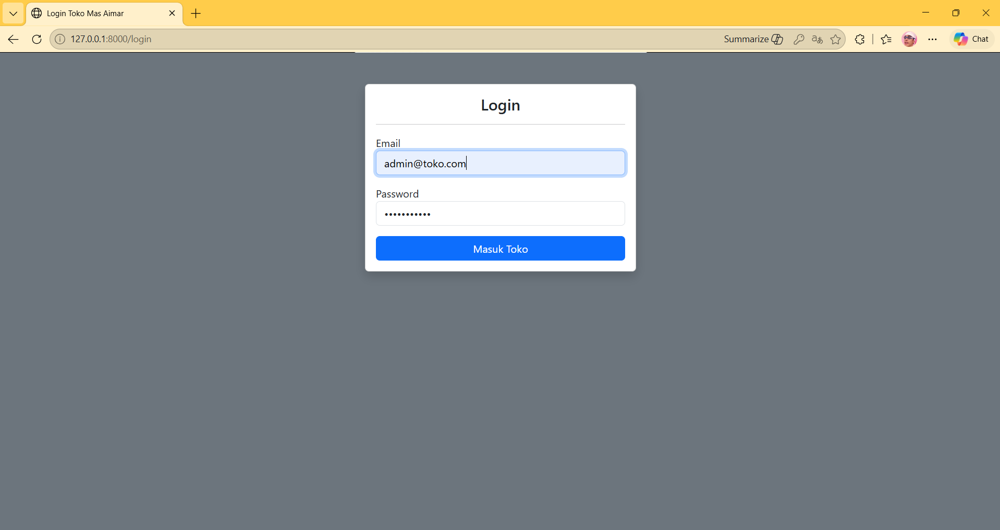
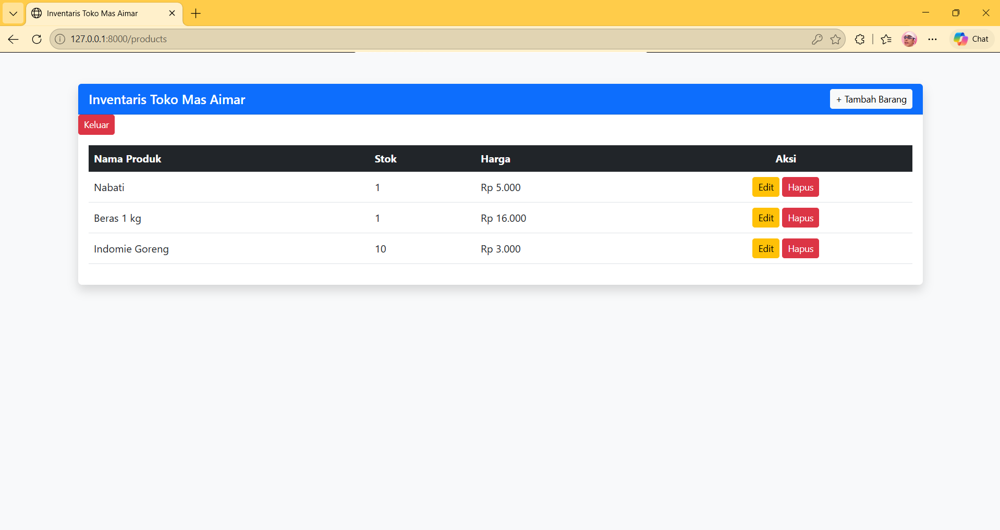
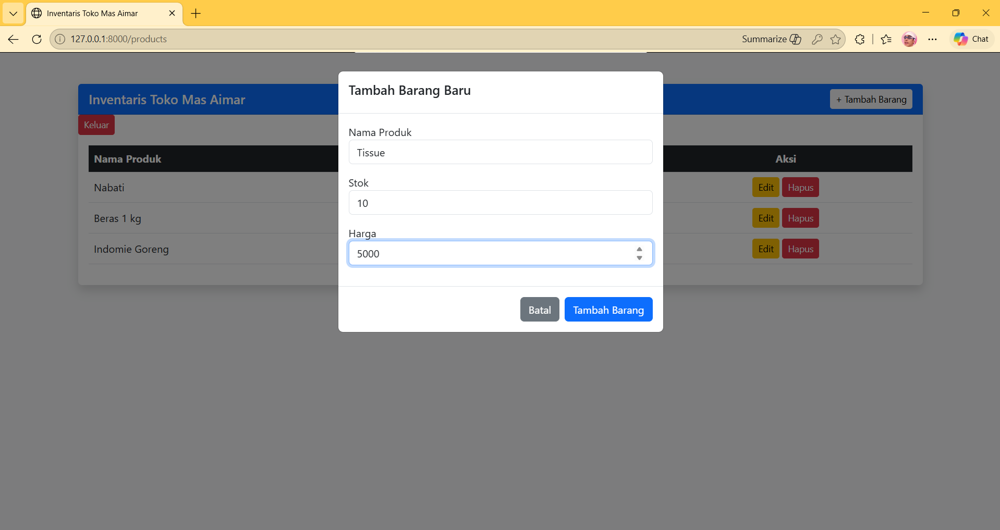
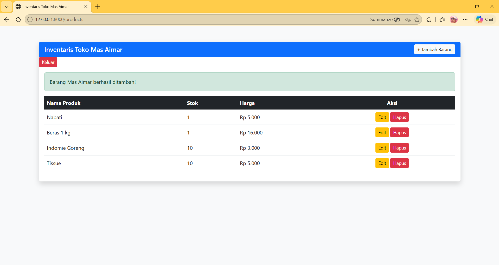
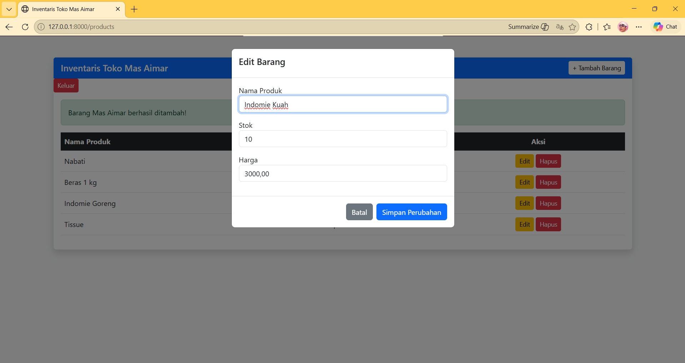
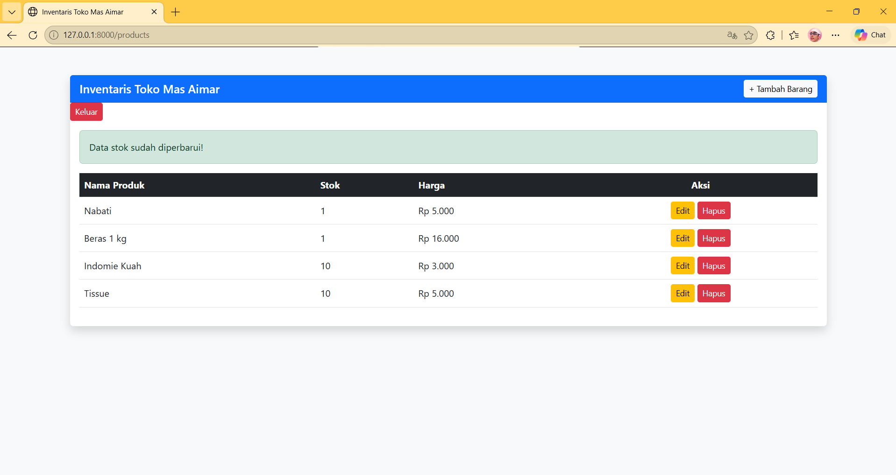
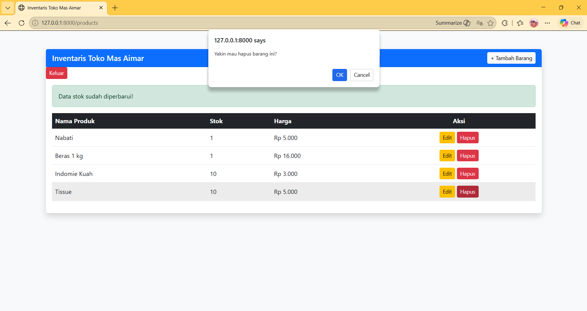
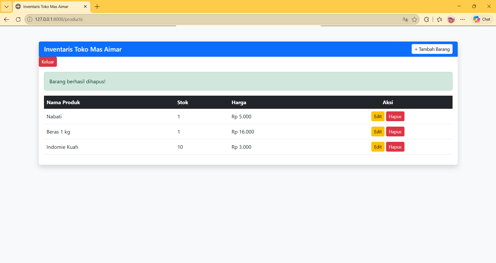

<div align="center">

# LAPORAN PRAKTIKUM
# APLIKASI BERBASIS PLATFORM


## MODUL 11, 12, 13
## Web Inventori Pak Cik Mas Aiman


**Disusun Oleh :**

**Sherine Naura Early Gunawan**

**2311102020**

**S1 IF-11-REG01**


**PROGRAM STUDI S1 INFORMATIKA**

**FAKULTAS INFORMATIKA**

**UNIVERSITAS TELKOM PURWOKERTO**

**2025/2026**

</div>

---

## 1. Dasar Teori

### Laravel Framework
Framework Laravel merupakan kerangka kerja PHP terbuka (open-source) yang dirancang untuk mendukung pengembangan aplikasi web secara cepat dan modern. Framework ini menawarkan berbagai fitur built-in serta pustaka yang mempermudah dalam mengembangkan fungsionalitas seperti routing terdedikasi, keamanan, dan Object-Relational Mapping (ORM) bernama Eloquent. Penggunaan Laravel memungkinkan pengembang untuk membangun sistem yang terstruktur, aman, dan mudah dalam pemeliharaan jangka panjang.

### MVC (Model View Controller)
MVC merupakan pola arsitektur perangkat lunak yang menjadi fondasi utama Laravel dalam membagi aplikasi menjadi tiga komponen utama:
- Model: Bertugas mengelola data dan berinteraksi langsung dengan database.
- View: Bertanggung jawab menampilkan data dan antarmuka kepada pengguna.
- Controller: Menghubungkan Model dan View serta mengatur alur logika aplikasi. Pemisahan ini memastikan bahwa logika bisnis tidak tercampur dengan tampilan, sehingga memudahkan dalam pengembangan sistem secara kolaboratif dan sistematis.

### Migration dan Seeders
Laravel menyediakan sistem manajemen database yang efisien melalui fitur Migration dan Seeders:
- Migration: Berfungsi sebagai version control untuk database, yang memungkinkan pengembang mendefinisikan dan mengubah skema tabel secara langsung melalui kode PHP tanpa perlu menulis SQL manual.
- Seeders: Digunakan untuk mengisi tabel database dengan data awal (initial data) atau data uji secara otomatis. Fitur ini sangat berguna untuk memastikan aplikasi tidak kosong saat pertama kali dijalankan, seperti pengisian akun admin awal atau daftar produk default.

### Blade Templating Engine
Blade adalah template engine bawaan Laravel yang digunakan untuk menyusun tampilan aplikasi. Blade memungkinkan penggunaan sintaks yang jauh lebih bersih dan sederhana dibandingkan PHP murni, namun tetap sangat kuat karena dikompilasi menjadi kode PHP biasa. Fitur utama seperti Template Inheritance (@extends, @section) dan Control Structures (@if, @foreach) membantu pengembang dalam menghasilkan antarmuka yang modular, rapi, dan mudah dikelola.

### CRUD 
CRUD merupakan empat fungsi dasar dalam manipulasi data pada sistem basis data persisten. Dalam pengembangan aplikasi inventaris toko ini, prinsip CRUD diimplementasikan untuk mengelola data produk secara dinamis:
- Create: Menambahkan data produk baru melalui form pada modal Bootstrap.
- Read: Menampilkan daftar seluruh stok barang dalam bentuk tabel yang responsif.
- Update: Memperbarui informasi produk seperti nama, stok, atau harga.
- Delete: Menghapus data produk dari sistem dengan tambahan verifikasi keamanan melalui modal konfirmasi.

### Bootstrap Framework
Bootstrap adalah kerangka kerja CSS terbuka yang digunakan untuk merancang antarmuka web yang responsif dan konsisten. Dalam project ini, Bootstrap digunakan untuk menyusun tata letak (layout) tabel inventaris, desain form login, hingga komponen interaktif seperti Modal dan Alert. Penggunaan Bootstrap memastikan bahwa aplikasi inventaris toko tidak hanya fungsional di sisi backend, tetapi juga memiliki tampilan yang profesional dan nyaman digunakan oleh admin di berbagai perangkat.

---

## 2. Source Code

### app/Controllers/AuthController.php
```php
<?php

namespace App\Http\Controllers;

use Illuminate\Http\Request;
use Illuminate\Support\Facades\Auth;

class AuthController extends Controller
{
    public function showLogin() {
        return view('auth.login');
    }

    public function login(Request $request) {
        $credentials = $request->validate([
            'email' => 'required|email',
            'password' => 'required',
        ]);

        if (Auth::attempt($credentials)) {
            $request->session()->regenerate();
            return redirect()->intended('/products');
        }

        return back()->with('error', 'Email atau Password salah, Mas Aimar!');
    }

    public function logout(Request $request) {
        Auth::logout();
        $request->session()->invalidate();
        $request->session()->regenerateToken();
        return redirect('/login');
    }
}
```

### app/Controllers/ProductController.php
```php
<?php

namespace App\Http\Controllers;

use Illuminate\Http\Request;
use App\Models\Product; 

class ProductController extends Controller
{
    public function index() {
        $products = Product::all();
        return view('products.index', compact('products'));
    }

    public function store(Request $request) {
        $data = $request->validate([
            'name' => 'required',
            'stock' => 'required|numeric',
            'price' => 'required|numeric',
        ]);
        
        Product::create($data);
        return back()->with('success', 'Barang Mas Aimar berhasil ditambah!');
    }

    public function update(Request $request, Product $product) {
        $data = $request->validate([
            'name' => 'required',
            'stock' => 'required|numeric',
            'price' => 'required|numeric',
        ]);
        
        $product->update($data);
        return back()->with('success', 'Data stok sudah diperbarui!');
    }

    public function destroy(Product $product) {
        $product->delete();
        return back()->with('success', 'Barang berhasil dihapus!');
    }
}
```

### database/migrations/create_product_table.php
```php
<?php

use Illuminate\Database\Migrations\Migration;
use Illuminate\Database\Schema\Blueprint;
use Illuminate\Support\Facades\Schema;

return new class extends Migration
{
    public function up(): void
    {
        Schema::create('products', function (Blueprint $table) {
        $table->id();
        $table->string('name'); 
        $table->integer('stock'); 
        $table->decimal('price', 15, 2); 
        $table->timestamps();
    });
    }

    public function down(): void
    {
        Schema::dropIfExists('products');
    }
};
```

### database/seeders/DatabaseSeeder.php
```php
<?php

namespace Database\Seeders;

use Illuminate\Database\Seeder;

class DatabaseSeeder extends Seeder
{
    public function run(): void
    {
    \App\Models\User::factory()->create([
    'name' => 'Mas Aimar',
    'email' => 'admin@toko.com', 
    'password' => bcrypt('password123'),
]);

    \App\Models\Product::create([
        'name' => 'Pringles Chips',
        'stock' => 5,
        'price' => 25000
    ]); 
    }
}
```

### database/seeders/ProductSeeders.php
```php
<?php

namespace Database\Seeders;

use Illuminate\Database\Console\Seeds\WithoutModelEvents;
use Illuminate\Database\Seeder;

class ProductSeeder extends Seeder
{
    public function run(): void
    {
        \App\Models\Product::create([
        'name' => 'Pringles Chips',
        'stock' => 5,
        'price' => 25000
    ]);
    }
}
```

### resources/views/auth/login.blade.php
```php
<!DOCTYPE html>
<html lang="id">
<head>
    <link href="https://cdn.jsdelivr.net/npm/bootstrap@5.3.0/dist/css/bootstrap.min.css" rel="stylesheet">
    <title>Login Toko Mas Aimar</title>
</head>
<body class="bg-secondary">
<div class="container mt-5">
    <div class="row justify-content-center">
        <div class="col-md-4">
            <div class="card shadow">
                <div class="card-body">
                    <h4 class="text-center">Login</h4>
                    <hr>
                    @if(session('error')) <div class="alert alert-danger">{{ session('error') }}</div> @endif
                    <form action="/login" method="POST">
                        @csrf
                        <div class="mb-3">
                            <label>Email</label>
                            <input type="email" name="email" class="form-control" placeholder="admin@toko.com" required>
                        </div>
                        <div class="mb-3">
                            <label>Password</label>
                            <input type="password" name="password" class="form-control" placeholder="password123" required>
                        </div>
                        <button type="submit" class="btn btn-primary w-100">Masuk Toko</button>
                    </form>
                </div>
            </div>
        </div>
    </div>
</div>
</body>
</html>
```

### resources/views/products/index.blade.php
```php
<!DOCTYPE html>
<html lang="id">
<head>
    <meta charset="UTF-8">
    <meta name="viewport" content="width=device-width, initial-scale=1.0">
    <title>Inventaris Toko Mas Aimar</title>
    <link href="https://cdn.jsdelivr.net/npm/bootstrap@5.3.0/dist/css/bootstrap.min.css" rel="stylesheet">
</head>
<body class="bg-light">

<div class="container mt-5">
    <div class="card shadow border-0">
        <div class="card-header bg-primary text-white d-flex justify-content-between align-items-center">
            <h5 class="mb-0">Inventaris Toko Mas Aimar</h5>
            <button class="btn btn-light btn-sm" data-bs-toggle="modal" data-bs-target="#modalTambah">+ Tambah Barang</button>
        </div>
        <form action="/logout" method="POST" class="d-inline">
            @csrf
            <button type="submit" class="btn btn-danger btn-sm">Keluar</button>
        </form>
        <div class="card-body">
            @if(session('success'))
                <div class="alert alert-success">{{ session('success') }}</div>
            @endif

            <table class="table table-hover align-middle">
                <thead class="table-dark">
                    <tr>
                        <th>Nama Produk</th>
                        <th>Stok</th>
                        <th>Harga</th>
                        <th class="text-center">Aksi</th>
                    </tr>
                </thead>
                <tbody>
                    @foreach($products as $p)
                    <tr>
                        <td>{{ $p->name }}</td>
                        <td>{{ $p->stock }}</td>
                        <td>Rp {{ number_format($p->price, 0, ',', '.') }}</td>
                        <td class="text-center">
                            <button class="btn btn-warning btn-sm" data-bs-toggle="modal" data-bs-target="#modalEdit{{ $p->id }}">Edit</button>
                            
                            <form action="{{ route('products.destroy', $p->id) }}" method="POST" class="d-inline">
                                @csrf @method('DELETE')
                                <button type="submit" class="btn btn-danger btn-sm" onclick="return confirm('Yakin mau hapus barang ini?')">Hapus</button>
                            </form>
                        </td>
                    </tr>

                    <div class="modal fade" id="modalEdit{{ $p->id }}" tabindex="-1">
                        <div class="modal-dialog">
                            <form action="{{ route('products.update', $p->id) }}" method="POST">
                                @csrf @method('PUT')
                                <div class="modal-content">
                                    <div class="modal-header"><h5>Edit Barang</h5></div>
                                    <div class="modal-body text-dark">
                                        <div class="mb-3"><label>Nama Produk</label><input type="text" name="name" value="{{ $p->name }}" class="form-control" required></div>
                                        <div class="mb-3"><label>Stok</label><input type="number" name="stock" value="{{ $p->stock }}" class="form-control" required></div>
                                        <div class="mb-3"><label>Harga</label><input type="number" name="price" value="{{ $p->price }}" class="form-control" required></div>
                                    </div>
                                    <div class="modal-footer">
                                        <button type="button" class="btn btn-secondary" data-bs-dismiss="modal">Batal</button>
                                        <button type="submit" class="btn btn-primary">Simpan Perubahan</button>
                                    </div>
                                </div>
                            </form>
                        </div>
                    </div>
                    @endforeach
                </tbody>
            </table>
        </div>
    </div>
</div>

<div class="modal fade" id="modalTambah" tabindex="-1">
    <div class="modal-dialog">
        <form action="{{ route('products.store') }}" method="POST">
            @csrf
            <div class="modal-content">
                <div class="modal-header"><h5>Tambah Barang Baru</h5></div>
                <div class="modal-body text-dark">
                    <div class="mb-3"><label>Nama Produk</label><input type="text" name="name" class="form-control" placeholder="Contoh: Suki Tomyam" required></div>
                    <div class="mb-3"><label>Stok</label><input type="number" name="stock" class="form-control" placeholder="Contoh: 10" required></div>
                    <div class="mb-3"><label>Harga</label><input type="number" name="price" class="form-control" placeholder="Contoh: 15000" required></div>
                </div>
                <div class="modal-footer">
                    <button type="button" class="btn btn-secondary" data-bs-dismiss="modal">Batal</button>
                    <button type="submit" class="btn btn-primary">Tambah Barang</button>
                </div>
            </div>
        </form>
    </div>
</div>

<script src="https://cdn.jsdelivr.net/npm/bootstrap@5.3.0/dist/js/bootstrap.bundle.min.js"></script>
</body>
</html>
```

---

## 3. Hasil
- Halaman Login
<div align="center">
    
</div>

- Halaman Utama 
<div align="center">
    
</div>

- Tambah Barang
<div align="center">
    
    
</div>

- Edit Barang
<div align="center">
    
    
</div>

-Hapus Barang
<div align="center">
    
    
</div>

---

## 4. Penjelasan Kode 

### A. AuthController.php (app/Controllers/AuthController.php)
Bagian ini berfungsi sebagai pengatur sistem autentikasi atau login dan logout pengguna. Di dalamnya terdapat tiga fungsi utama, yaitu:
- showLogin(): Digunakan untuk menampilkan halaman login.
- login(): Fungsi ini digunakan untuk menangani proses masuk ke sistem dengan cara memvalidasi input email dan password, lalu mencocokkannya dengan data di database menggunakan fitur autentikasi Laravel.
- logout(): Digunakan untuk mengeluarkan pengguna dari sistem dengan menghapus session yang aktif dan mengarahkan kembali ke halaman login.

### B. ProductController.php (app/Controllers/ProductController.php)
Controller ini mengelola operasional data produk secara menyeluruh. Melalui fungsi index(), sistem melakukan pengambilan data secara kolektif untuk ditampilkan kepada pengguna. Untuk penambahan entitas baru, fungsi store() menjalankan validasi parameter terlebih dahulu guna menjamin integritas data sebelum proses penyimpanan. Perubahan data pada entitas yang sudah ada dikelola oleh fungsi update(), sedangkan fungsi destroy() bertanggung jawab atas eliminasi record dari sistem. Seluruh aktivitas manipulasi data ini disertai dengan feedback visual berupa notifikasi untuk memastikan transparansi proses bagi pengguna.

### C. Migration (database/migrations/create_product_table.php)
Skema basis data untuk tabel products dikelola melalui file migration ini, yang berfungsi mendefinisikan struktur penyimpanan data secara sistematis. Struktur tabel mencakup kolom id sebagai identitas unik (primary key), name untuk menyimpan informasi nama produk, stock untuk jumlah ketersediaan barang, serta price dengan tipe data desimal untuk akurasi nilai harga. Selain itu, fitur timestamps diimplementasikan untuk melakukan audit waktu otomatis pada setiap aktivitas pembuatan dan modifikasi data. Migration ini merupakan fondasi krusial yang menjamin konsistensi skema database di seluruh lingkungan pengembangan aplikasi.

### D. Seeder (DatabaseSeeder & ProductSeeder)
Seeder digunakan untuk mengisi data awal ke dalam database agar aplikasi bisa langsung digunakan tanpa harus input manual dari awal. Pada DatabaseSeeder, dibuat satu akun pengguna dengan nama “Mas Aimar” yang bisa digunakan untuk login, lengkap dengan email dan password. Selain itu, juga ditambahkan satu contoh produk yaitu “Pringles Chips”. Sementara itu, ProductSeeder memiliki fungsi serupa, yaitu menambahkan data produk, meskipun sebenarnya agak redundant karena data produk juga sudah dimasukkan di DatabaseSeeder. Seeder ini sangat membantu saat pengujian aplikasi.

### E. View Login (login.blade.php)
Implementasi antarmuka pengguna (user interface) pada halaman login ini dirancang menggunakan kombinasi HTML dan framework Bootstrap guna menghasilkan tampilan yang bersih serta responsif. Komponen utama terdiri dari formulir autentikasi yang mewajibkan pengguna menginputkan kredensial berupa email dan kata sandi. Keamanan data pada formulir ini dijamin melalui penggunaan metode POST yang diarahkan ke rute /login serta integrasi direktif @csrf untuk mencegah serangan Cross-Site Request Forgery. Selain itu, sistem ini dilengkapi dengan mekanisme feedback visual yang secara dinamis akan menampilkan pesan peringatan apabila terjadi kegagalan pada proses autentikasi.

### F. View Produk (index.blade.php)
Halaman utama ini berfungsi sebagai antarmuka manajemen produk yang menampilkan data secara dinamis melalui iterasi variabel $products. Menggunakan framework Bootstrap, halaman ini menyajikan informasi nama, stok, dan harga dalam format tabel yang interaktif. Efisiensi operasional dicapai melalui integrasi komponen Modal untuk fitur tambah dan edit data, sehingga pengguna tidak perlu berpindah halaman (page reload). Selain itu, tersedia fungsi eliminasi data serta tombol logout untuk mengakhiri sesi autentikasi pengguna secara aman.