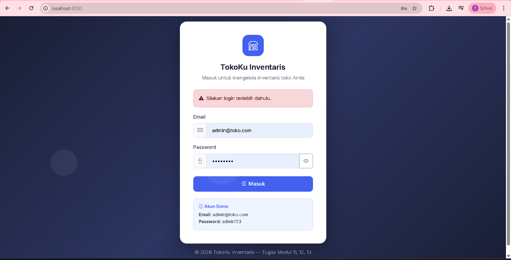
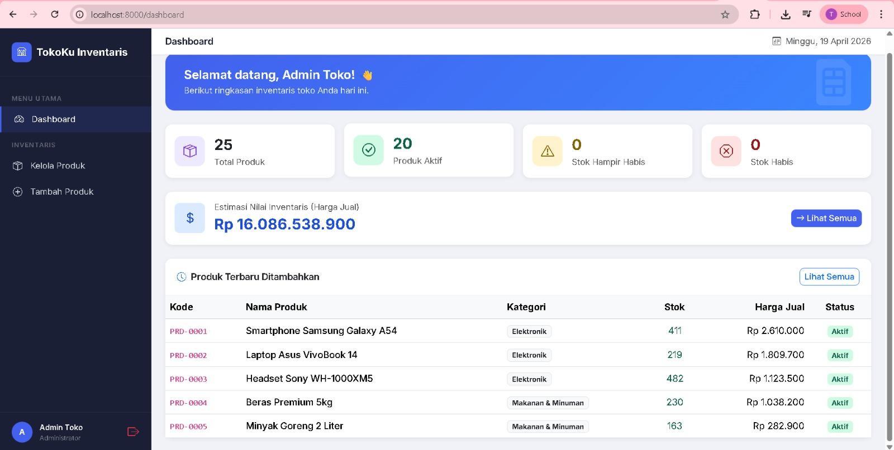
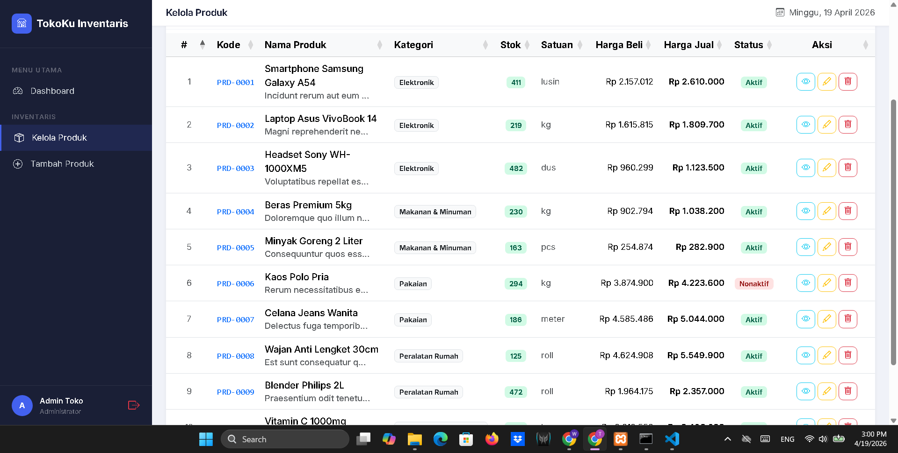
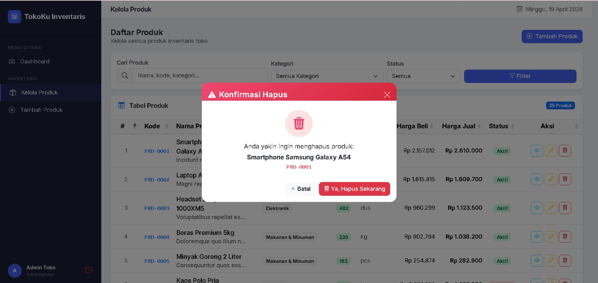
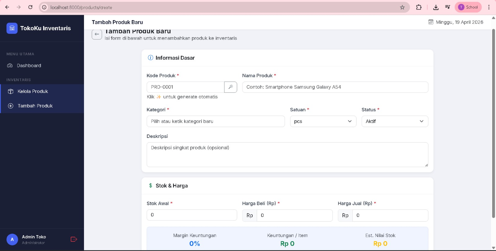
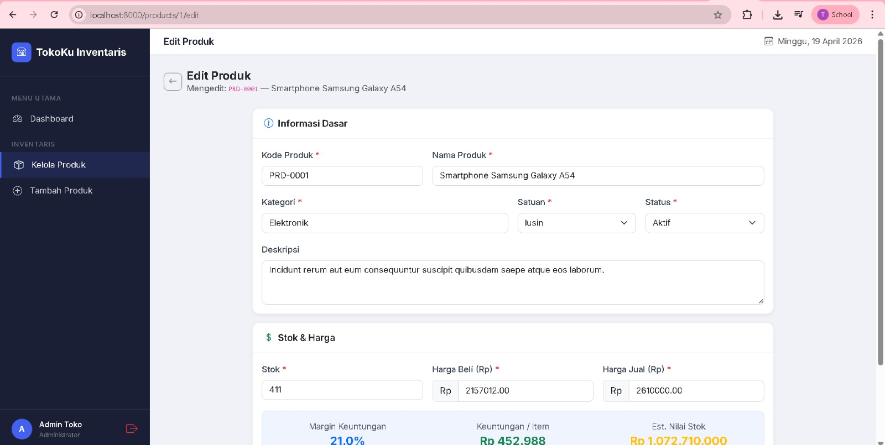
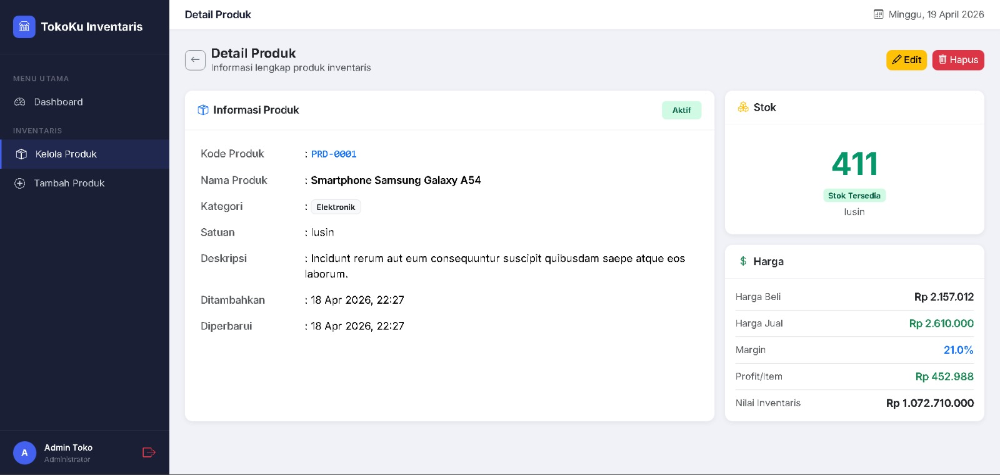

<div align="center">

# LAPORAN PRAKTIKUM
# APLIKASI BERBASIS PLATFORM

---

## MODUL 11, 12, 13
## DATABASE, CRUD, DAN AUTENTIKASI BERBASIS SESSION

---


---

**Disusun Oleh :**

**TEGAR BANGKIT WIJAYA**

**2311102027**

**S1 IF-11-REG01**

---

**Dosen Pengampu :**

Dimas Fanny Hebrasianto Permadi, S.ST., M.Kom

---

**PROGRAM STUDI S1 INFORMATIKA**

**FAKULTAS INFORMATIKA**

**UNIVERSITAS TELKOM PURWOKERTO**

**2025/2026**

</div>

---

## 1. Dasar Teori

### Modul 11 — Database, Migration, Factory & Seeder

#### Migration
Migration adalah fitur Laravel yang memungkinkan developer mendefinisikan struktur tabel database menggunakan kode PHP sehingga struktur database dapat di-*version control* bersama kode aplikasi. Migration dijalankan dengan perintah `php artisan migrate` yang mengeksekusi semua file migration secara berurutan. Pada praktikum ini migration digunakan untuk membuat tabel `users` yang menyimpan data pengguna dan tabel `products` yang menyimpan data produk inventaris toko.

#### Eloquent ORM
Eloquent adalah ORM (Object-Relational Mapping) bawaan Laravel yang memungkinkan interaksi dengan database menggunakan sintaks berbasis objek PHP tanpa harus menulis query SQL secara langsung. Setiap tabel database direpresentasikan oleh sebuah Model Eloquent. Pada praktikum ini Model `Product` dilengkapi dengan **accessor** untuk memformat harga ke format Rupiah dan **scope** untuk memfilter produk aktif serta melakukan pencarian berdasarkan keyword.

#### Factory & Seeder
Factory adalah class yang digunakan untuk menghasilkan data dummy secara otomatis menggunakan library Faker. Seeder adalah class yang bertugas memanggil factory dan mengisi database dengan data awal. Pada praktikum ini `ProductFactory` menghasilkan 25 data produk realistis dengan nama produk nyata (Samsung, Asus, Philips, dll.), harga beli acak dengan margin keuntungan 5%–30%, dan stok acak 0–500 unit. `DatabaseSeeder` memanggil factory tersebut sekaligus membuat akun admin default dengan kredensial tetap.

---

### Modul 12 — CRUD & Routing

#### Resource Controller & Routing
Resource Controller adalah controller Laravel yang menyediakan tujuh method standar untuk operasi CRUD secara lengkap: `index`, `create`, `store`, `show`, `edit`, `update`, dan `destroy`. Dengan menggunakan `Route::resource()`, Laravel secara otomatis mendaftarkan ketujuh route tersebut sekaligus dengan nama dan HTTP method yang sesuai. Pada praktikum ini `ProductController` mengimplementasikan seluruh method tersebut ditambah satu method `generateKode` untuk menghasilkan kode produk otomatis via AJAX.

#### Blade Template Engine
Blade adalah template engine bawaan Laravel yang memungkinkan penulisan logika PHP di dalam file HTML dengan sintaks yang lebih bersih menggunakan direktif seperti `@extends`, `@section`, `@yield`, `@foreach`, dan `@if`. Blade mendukung inheritance layout sehingga komponen tampilan seperti sidebar dan topbar cukup ditulis satu kali di `layouts/app.blade.php` dan diwarisi oleh semua halaman aplikasi.

#### Validasi Form
Laravel menyediakan fitur validasi request melalui method `$request->validate()` yang dapat mengecek berbagai aturan seperti `required`, `unique`, `numeric`, `email`, `in`, dan `gte` (greater than or equal). Jika validasi gagal, Laravel secara otomatis mengarahkan pengguna kembali ke form dengan pesan error. Pada praktikum ini validasi diterapkan pada form tambah dan edit produk untuk memastikan integritas data, termasuk validasi bahwa harga jual tidak boleh lebih kecil dari harga beli.

#### DataTables
DataTables adalah plugin jQuery yang mengubah tabel HTML biasa menjadi tabel interaktif dengan fitur sorting per kolom. Pada praktikum ini DataTables diintegrasikan dengan Bootstrap 5 dan dikombinasikan dengan sistem filter server-side dari Laravel (pencarian teks, filter kategori, filter status) serta pagination bawaan Laravel untuk pengalaman pengguna yang lebih baik.

---

### Modul 13 — Autentikasi Berbasis Session

#### Session
Session adalah mekanisme untuk menyimpan data pengguna di sisi server antara beberapa HTTP request. Karena HTTP bersifat stateless, session digunakan untuk mempertahankan status login pengguna. Laravel menyediakan helper `session()` untuk menyimpan, membaca, dan menghapus data session. Pada praktikum ini session digunakan untuk menyimpan `user_id`, `user_name`, dan `user_email` setelah login berhasil, dan data ini dapat diakses di seluruh halaman aplikasi.

#### Autentikasi Manual
Autentikasi manual adalah implementasi sistem login tanpa menggunakan package tambahan seperti Laravel Breeze atau Jetstream. Prosesnya meliputi: menerima input dari form, mencari user di database berdasarkan email, memverifikasi password menggunakan `Hash::check()`, lalu menyimpan data ke session jika cocok. Pendekatan ini memberikan pemahaman mendalam tentang cara kerja autentikasi di balik layar framework.

#### Middleware
Middleware adalah lapisan perantara yang dieksekusi sebelum request masuk ke controller. Pada praktikum ini `AuthMiddleware` mengecek keberadaan `session('user_id')` — jika tidak ada, pengguna diarahkan ke halaman login dengan pesan error. Middleware ini diterapkan pada semua route yang memerlukan autentikasi menggunakan `Route::middleware()` sehingga seluruh halaman CRUD dan dashboard terlindungi.

#### Hash Password
Laravel menggunakan library Bcrypt untuk hashing password secara aman. Password tidak pernah disimpan dalam bentuk plaintext di database, melainkan selalu dalam bentuk hash. Fungsi `Hash::make()` digunakan saat menyimpan password baru, dan `Hash::check()` digunakan saat memverifikasi password saat proses login.

---

## 2. Struktur Project

```
inventaris-toko/
│
├── app/
│   ├── Http/
│   │   ├── Controllers/
│   │   │   ├── AuthController.php        ← Login & Logout (Session)
│   │   │   └── ProductController.php     ← CRUD Produk + Dashboard
│   │   └── Middleware/
│   │       └── AuthMiddleware.php        ← Proteksi route (cek session)
│   └── Models/
│       ├── User.php                      ← Model User
│       └── Product.php                   ← Model Produk + Accessor + Scope
│
├── database/
│   ├── factories/
│   │   ├── ProductFactory.php            ← Generator 25 data produk dummy
│   │   └── UserFactory.php               ← Generator data user dummy
│   ├── migrations/
│   │   ├── ..._create_users_table.php    ← Struktur tabel users
│   │   └── ..._create_products_table.php ← Struktur tabel products
│   └── seeders/
│       └── DatabaseSeeder.php            ← Seed 1 admin + 25 produk
│
├── resources/views/
│   ├── auth/
│   │   └── login.blade.php               ← Halaman login
│   ├── layouts/
│   │   └── app.blade.php                 ← Layout utama (sidebar + topbar)
│   ├── products/
│   │   ├── index.blade.php               ← DataTable produk + modal hapus
│   │   ├── create.blade.php              ← Form tambah produk
│   │   ├── edit.blade.php                ← Form edit produk
│   │   └── show.blade.php                ← Detail produk
│   └── dashboard.blade.php               ← Halaman dashboard statistik
│
├── routes/
│   └── web.php                           ← Definisi semua route web
│
├── .env.example                          ← Template konfigurasi environment
└── composer.json                         ← Dependensi PHP
```

---

## 3. Penjelasan Fitur & Source Code

### 3.1 Migration — Struktur Tabel Products
```php
// database/migrations/..._create_products_table.php
Schema::create('products', function (Blueprint $table) {
    $table->id();
    $table->string('kode_produk')->unique();
    $table->string('nama_produk');
    $table->string('kategori');
    $table->text('deskripsi')->nullable();
    $table->integer('stok')->default(0);
    $table->decimal('harga_beli', 15, 2)->default(0);
    $table->decimal('harga_jual', 15, 2)->default(0);
    $table->string('satuan')->default('pcs');
    $table->enum('status', ['aktif', 'nonaktif'])->default('aktif');
    $table->timestamps();
});
```

### 3.2 Eloquent Model — Accessor & Scope
```php
// app/Models/Product.php
class Product extends Model
{
    use HasFactory;

    protected $fillable = [
        'kode_produk', 'nama_produk', 'kategori', 'deskripsi',
        'stok', 'harga_beli', 'harga_jual', 'satuan', 'status',
    ];

    // Accessor: format harga ke Rupiah
    public function getHargaBeliFormatAttribute(): string
    {
        return 'Rp ' . number_format($this->harga_beli, 0, ',', '.');
    }

    public function getHargaJualFormatAttribute(): string
    {
        return 'Rp ' . number_format($this->harga_jual, 0, ',', '.');
    }

    // Scope: filter produk aktif
    public function scopeAktif($query)
    {
        return $query->where('status', 'aktif');
    }

    // Scope: pencarian keyword
    public function scopeSearch($query, $keyword)
    {
        return $query->where(function ($q) use ($keyword) {
            $q->where('nama_produk', 'like', "%{$keyword}%")
              ->orWhere('kode_produk', 'like', "%{$keyword}%")
              ->orWhere('kategori',   'like', "%{$keyword}%");
        });
    }
}
```

### 3.3 Factory & Seeder — Data Dummy
```php
// database/seeders/DatabaseSeeder.php
public function run(): void
{
    // Admin default
    User::create([
        'name'     => 'Admin Toko',
        'email'    => 'admin@toko.com',
        'password' => Hash::make('admin123'),
    ]);

    // 4 user dummy tambahan
    User::factory(4)->create();

    // 25 produk dummy realistis
    Product::factory(25)->create();

    $this->command->info('✅  Seeder selesai!');
    $this->command->info('   Login: admin@toko.com / admin123');
}
```

### 3.4 Routing
```php
// routes/web.php

// Auth (public — bisa diakses tanpa login)
Route::get('/',      [AuthController::class, 'showLogin'])->name('login');
Route::get('/login', [AuthController::class, 'showLogin'])->name('login');
Route::post('/login', [AuthController::class, 'login'])->name('login.post');
Route::post('/logout', [AuthController::class, 'logout'])->name('logout');

// Protected routes (membutuhkan login via AuthMiddleware)
Route::middleware(\App\Http\Middleware\AuthMiddleware::class)->group(function () {
    Route::get('/dashboard', [ProductController::class, 'dashboard'])->name('dashboard');
    Route::get('/products/generate-kode', [ProductController::class, 'generateKode'])
         ->name('products.generate-kode');
    Route::resource('products', ProductController::class);
});
```

### 3.5 Middleware — Proteksi Route
```php
// app/Http/Middleware/AuthMiddleware.php
public function handle(Request $request, Closure $next): Response
{
    if (! session()->has('user_id')) {
        return redirect()->route('login')
            ->with('error', 'Silakan login terlebih dahulu.');
    }
    return $next($request);
}
```

### 3.6 Autentikasi — Login & Session
```php
// app/Http/Controllers/AuthController.php
public function login(Request $request)
{
    $request->validate([
        'email'    => 'required|email',
        'password' => 'required|min:6',
    ]);

    $user = User::where('email', $request->email)->first();

    if (! $user || ! Hash::check($request->password, $user->password)) {
        return back()->withInput($request->only('email'))
            ->with('error', 'Email atau password salah.');
    }

    // Simpan data ke session
    session([
        'user_id'    => $user->id,
        'user_name'  => $user->name,
        'user_email' => $user->email,
    ]);

    return redirect()->route('dashboard')
        ->with('success', 'Selamat datang, ' . $user->name . '!');
}

public function logout(Request $request)
{
    session()->flush();                     // Hapus semua data session
    $request->session()->invalidate();      // Invalidasi session
    $request->session()->regenerateToken(); // Regenerasi CSRF token
    return redirect()->route('login');
}
```

### 3.7 CRUD — ProductController
```php
// app/Http/Controllers/ProductController.php

// Dashboard: statistik inventaris
public function dashboard()
{
    $totalProduk     = Product::count();
    $produkAktif     = Product::aktif()->count();
    $stokHampirHabis = Product::where('stok', '<=', 10)->where('stok', '>', 0)->count();
    $stokHabis       = Product::where('stok', 0)->count();
    $nilaiInventaris = Product::aktif()
                         ->selectRaw('SUM(stok * harga_jual) as total')
                         ->value('total') ?? 0;
    $produkTerbaru   = Product::latest()->take(5)->get();

    return view('dashboard', compact(
        'totalProduk', 'produkAktif', 'stokHampirHabis',
        'stokHabis', 'nilaiInventaris', 'produkTerbaru'
    ));
}

// Index: daftar produk dengan filter & pagination
public function index(Request $request)
{
    $query = Product::query();
    if ($request->filled('search'))   $query->search($request->search);
    if ($request->filled('kategori')) $query->where('kategori', $request->kategori);
    if ($request->filled('status'))   $query->where('status', $request->status);

    $products  = $query->latest()->paginate(10)->withQueryString();
    $kategoris = Product::select('kategori')->distinct()->orderBy('kategori')->pluck('kategori');
    return view('products.index', compact('products', 'kategoris'));
}

// Store: simpan produk baru dengan validasi
public function store(Request $request)
{
    $validated = $request->validate([
        'kode_produk' => 'required|string|max:50|unique:products,kode_produk',
        'nama_produk' => 'required|string|max:255',
        'kategori'    => 'required|string|max:100',
        'stok'        => 'required|integer|min:0',
        'harga_beli'  => 'required|numeric|min:0',
        'harga_jual'  => 'required|numeric|min:0|gte:harga_beli',
        'satuan'      => 'required|string|max:20',
        'status'      => 'required|in:aktif,nonaktif',
    ]);
    Product::create($validated);
    return redirect()->route('products.index')
        ->with('success', 'Produk berhasil ditambahkan.');
}

// Destroy: hapus produk
public function destroy(Product $product)
{
    $nama = $product->nama_produk;
    $product->delete();
    return redirect()->route('products.index')
        ->with('success', 'Produk "' . $nama . '" berhasil dihapus.');
}
```

---

## 4. Langkah-Langkah Penggunaan

### 4.1 Halaman Login
Saat aplikasi dibuka melalui browser pada alamat `http://localhost:8000`, pengguna diarahkan ke halaman login oleh `AuthMiddleware`. Halaman ini menampilkan form input email dan password dengan desain modern bergradien biru-ungu gelap dan animasi partikel di latar belakang. Terdapat fitur show/hide password menggunakan tombol toggle. Jika email atau password salah, muncul pesan error merah di atas form. Tersedia juga informasi akun demo untuk memudahkan pengujian.



### 4.2 Halaman Dashboard
Setelah login berhasil, pengguna diarahkan ke halaman dashboard. Dashboard menampilkan 4 kartu statistik utama: Total Produk, Produk Aktif, Stok Hampir Habis (stok ≤ 10), dan Stok Habis (stok = 0). Di bawahnya terdapat kartu estimasi nilai total inventaris yang dihitung dari `SUM(stok × harga_jual)` seluruh produk aktif, serta tabel 5 produk terbaru yang baru ditambahkan ke sistem.



### 4.3 Halaman Daftar Produk (DataTable)
Halaman ini menampilkan seluruh data produk dalam bentuk tabel interaktif. Tersedia form filter di bagian atas dengan tiga opsi: pencarian teks bebas (nama/kode/kategori), dropdown filter kategori, dan dropdown filter status. Setiap baris data dilengkapi badge berwarna untuk stok (hijau = normal, kuning = hampir habis, merah = habis) dan badge status (aktif/nonaktif). Tersedia tiga tombol aksi per baris: Detail 👁️, Edit ✏️, dan Hapus 🗑️. Pagination Laravel ditampilkan di bagian bawah tabel.



### 4.4 Modal Konfirmasi Hapus
Ketika tombol Hapus 🗑️ diklik, muncul modal konfirmasi bergradien merah yang menampilkan nama dan kode produk yang akan dihapus. Modal ini memberikan peringatan bahwa tindakan tidak dapat dibatalkan dan meminta konfirmasi pengguna sebelum data benar-benar dihapus dari database. Terdapat dua tombol: **Batal** (menutup modal) dan **Ya, Hapus Sekarang** (mengirim request DELETE).



### 4.5 Form Tambah Produk
Halaman form tambah produk terbagi menjadi dua section: **Informasi Dasar** (kode, nama, kategori, satuan, status, deskripsi) dan **Stok & Harga** (stok, harga beli, harga jual). Terdapat fitur generate kode produk otomatis melalui AJAX tanpa reload halaman. Input kategori menggunakan `datalist` HTML5 untuk saran autocomplete. Kalkulasi margin keuntungan real-time menampilkan persentase margin, keuntungan per item, dan estimasi nilai stok saat angka harga diubah.



### 4.6 Form Edit Produk
Halaman form edit identik dengan form tambah, namun semua field sudah terisi dengan data produk yang dipilih (pre-filled dari database). Terdapat informasi waktu produk dibuat dan terakhir diperbarui di bagian bawah form. Kalkulasi margin real-time juga aktif untuk membantu pengguna menyesuaikan harga jual.



### 4.7 Halaman Detail Produk
Halaman detail menampilkan informasi lengkap satu produk dalam dua kolom. Kolom kiri berisi tabel informasi umum (kode, nama, kategori, satuan, deskripsi, timestamp dibuat dan diperbarui). Kolom kanan berisi dua kartu: kartu stok dengan indikator warna (hijau/kuning/merah) dan kartu harga yang menampilkan harga beli, harga jual, margin, profit per item, dan nilai inventaris.



---

## 5. Cara Menjalankan Aplikasi

```bash
# 1. Extract project ke folder lokal

# 2. Masuk ke direktori project
cd inventaris-toko

# 3. Install dependencies Laravel
composer install

# 4. Salin file environment
cp .env.example .env        # Linux/Mac
copy .env.example .env      # Windows

# 5. Generate application key
php artisan key:generate

# 6. Konfigurasi database di file .env
#    Ubah bagian ini:
#    DB_CONNECTION=mysql
#    DB_HOST=127.0.0.1
#    DB_PORT=3306
#    DB_DATABASE=inventaris_toko
#    DB_USERNAME=root
#    DB_PASSWORD=

# 7. Buat database di phpMyAdmin
#    Nama: inventaris_toko

# 8. Jalankan migration + seeder sekaligus
php artisan migrate:fresh --seed

# 9. Jalankan development server
php artisan serve

# 10. Buka browser
#     http://localhost:8000
```

**Akun Login Default:**

| Role          | Email           | Password |
|---------------|-----------------|----------|
| Administrator | admin@toko.com  | admin123 |

---

## 6. Alur Kerja Aplikasi

```
[Browser] → GET /
                ↓
          Redirect ke /login  ← AuthMiddleware (belum login)
                ↓
          [Halaman Login] → POST /login
                ↓
    ┌── Gagal: email/password salah ──┐
    │   Redirect ke /login + pesan error │
    └────────────────────────────────────┘
                ↓ Berhasil
          session(['user_id', 'user_name', 'user_email'])
                ↓
          Redirect ke /dashboard
                ↓
    ┌──────────────────────────────────────┐
    │            DASHBOARD                  │
    │  Statistik produk + nilai inventaris  │
    │  Tabel 5 produk terbaru               │
    └──────────────────────────────────────┘
                ↓
    ┌──────────────────────────────────────┐
    │           KELOLA PRODUK               │
    │  Index   → DataTable + Filter        │
    │  Create  → Form + AJAX kode          │
    │  Edit    → Form pre-filled           │
    │  Delete  → Modal konfirmasi          │
    └──────────────────────────────────────┘
                ↓
          POST /logout
                ↓
          session()->flush() + invalidate()
                ↓
          Redirect ke /login
```

---

## 7. Kesimpulan

Pada praktikum Modul 11, 12, dan 13 ini telah berhasil dibangun aplikasi web **TokoKu Inventaris** menggunakan framework Laravel dengan ringkasan implementasi sebagai berikut:

1. **Modul 11 (Database)** — Migration berhasil mendefinisikan struktur tabel `users` dan `products`. Factory menghasilkan 25 data produk dummy realistis menggunakan Faker. Seeder mengisi database secara otomatis dengan 1 admin dan 25 produk. Eloquent Model dilengkapi accessor untuk format harga Rupiah dan scope untuk filter data.

2. **Modul 12 (CRUD & Routing)** — Resource Controller mengimplementasikan 7 operasi CRUD lengkap. Tampilan menggunakan DataTable interaktif dengan filter server-side, modal konfirmasi hapus, form dengan validasi ketat, generate kode produk via AJAX, dan kalkulasi margin harga real-time.

3. **Modul 13 (Autentikasi Session)** — Sistem login manual berbasis session tanpa package eksternal berhasil diimplementasikan. Middleware melindungi seluruh route yang memerlukan autentikasi. Password disimpan dalam bentuk hash Bcrypt. Logout menginvalidasi session secara aman dengan regenerasi CSRF token.
