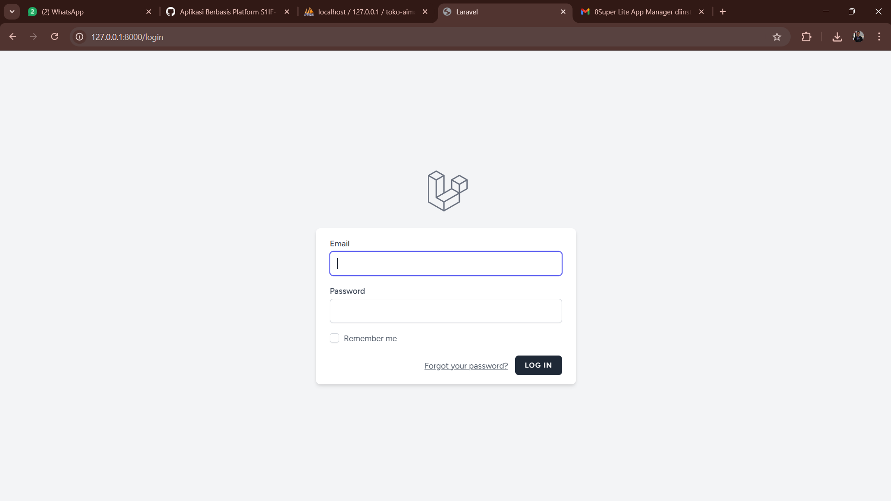
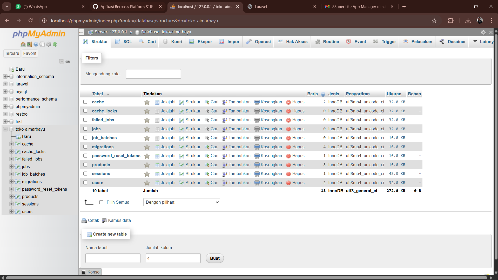
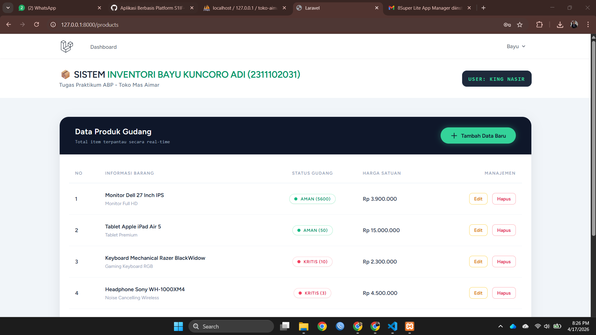
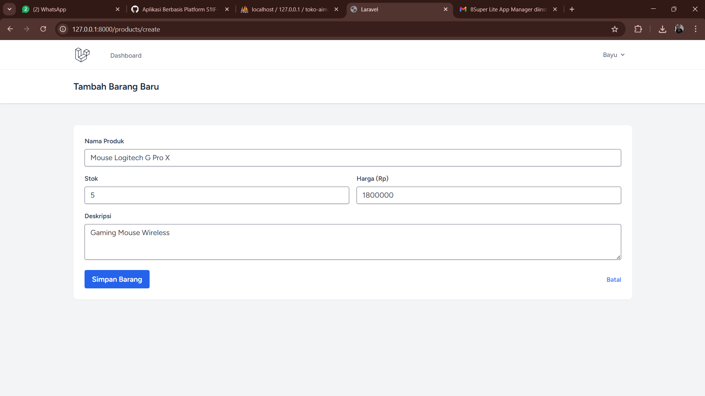
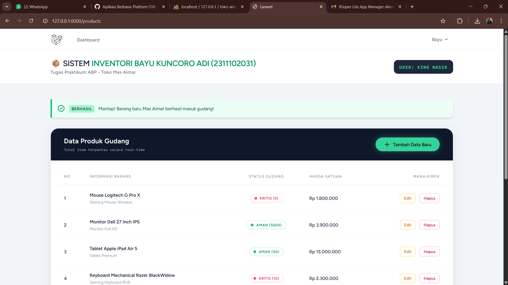
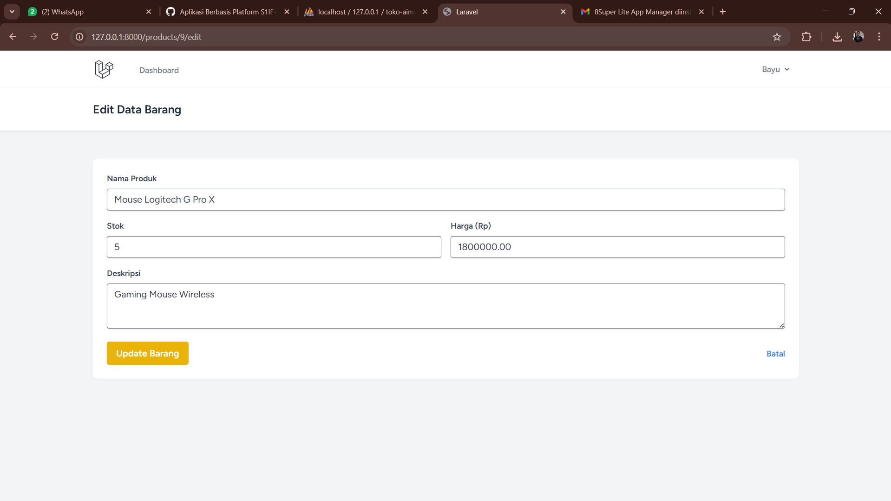
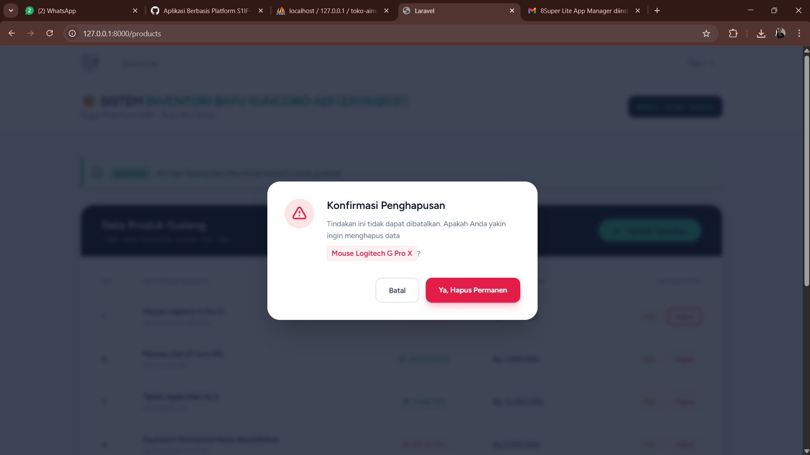
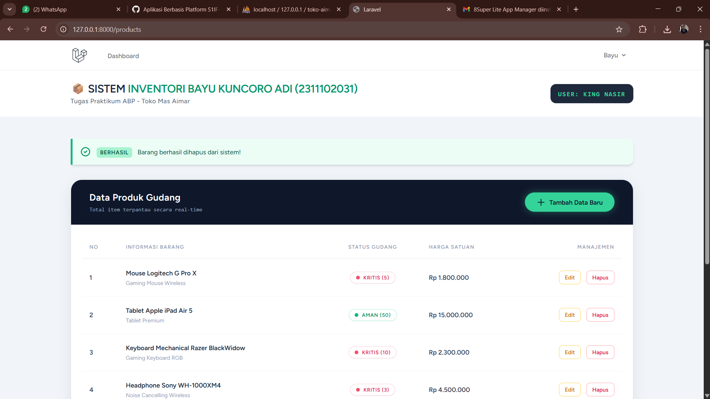
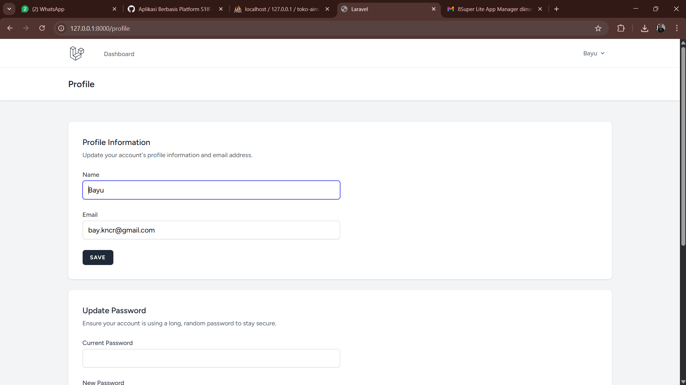

<div align="center">
  <br />
  <h1>LAPORAN PRAKTIKUM <br>APLIKASI BERBASIS PLATFORM</h1>
  <br />
  <h3> MODUL 11, 12, 13 <br> LARAVEL </h3>
  <br />
   
  <br />
  <br />
  <br />
  <h3>Disusun Oleh :</h3>
  <p>
    <strong>Bayu Kuncoro Adi</strong><br>
    <strong>2311102031</strong><br>
    <strong>S1 IF-11-01</strong>
  </p>
  <br />
  <h3>Dosen Pengampu :</h3>
  <p>
    <strong>Dimas Fanny Hebrasianto Permadi, S.ST., M.Kom</strong>
  </p>
  <br />
  <br />
    <h4>Asisten Praktikum :</h4>
    <strong> Apri Pandu Wicaksono </strong> <br>
    <strong>Rangga Pradarrell Fathi</strong>
  <br />
  <h3>LABORATORIUM HIGH PERFORMANCE
 <br>FAKULTAS INFORMATIKA <br>UNIVERSITAS TELKOM PURWOKERTO <br>2026</h3>
</div>

---

## Dasar Teori

### Pengertian Framework dan MVC

Framework merupakan kerangka kerja yang digunakan untuk mempermudah pengembangan aplikasi dengan menyediakan struktur dan aturan tertentu. Salah satu konsep yang umum digunakan adalah MVC (Model-View-Controller).

- Model: Mengelola data dan logika bisnis
- View: Menampilkan data ke pengguna
- Controller: Menghubungkan Model dan View

Konsep MVC membantu memisahkan logika aplikasi sehingga lebih terstruktur dan mudah dikembangkan.

---

### Pengenalan Laravel

Laravel merupakan framework PHP yang digunakan untuk membangun aplikasi web dengan sintaks yang sederhana, elegan, dan terstruktur.

Laravel menyediakan berbagai fitur seperti:
1. Routing
2. Middleware
3. ORM (Eloquent)
4. Template Engine (Blade)

Dengan Laravel, proses pengembangan menjadi lebih cepat dan efisien dibandingkan menggunakan PHP native.

---

### Cara Kerja Laravel

Laravel bekerja dengan konsep MVC dan memiliki beberapa komponen utama:

1. Routing
   Routing berfungsi untuk mengatur jalur URL menuju fungsi tertentu dalam aplikasi
   Contoh:
    ```php
    Route::get('/home', [HomeController::class, 'index']);
    ```
2. Controller
   Controller digunakan untuk mengatur logika aplikasi dan menghubungkan Model dengan View.
   Contoh:
    ```php
    public function index() {
    return view('home');
    }
    ```
2. Controller
   Controller digunakan untuk mengatur logika aplikasi dan menghubungkan Model dengan View.
   Contoh:
    ```php
    public function index() {
    return view('home');
    }
    ```
3. View
   View digunakan untuk menampilkan data ke pengguna, biasanya menggunakan Blade Template.
   Contoh:
    ```php
    <h1>Selamat Datang</h1>
    ```
4. CRUD dalam Laravel
   CRUD adalah operasi dasar dalam pengolahan data:
   - Create: Menambah data
   - Read: Menampilkan data
   - Update: Mengubah data
   - Delete: Menghapus data
   Laravel mempermudah CRUD dengan menggunakan:
   - Model (Eloquent ORM)
   - Controller
   - Migration
 
5. Model dalam Laravel
   Model digunakan untuk berinteraksi dengan database.
   Contoh:
    ```php
    class User extends Model {
    protected $table = 'users';
    }
    ```
    Model memungkinkan pengolahan data tanpa harus menulis query SQL secara manual.

6. Blade Templating
   Blade adalah template engine Laravel untuk membuat tampilan lebih dinamis.  
   Contoh:
    ```php
    @foreach($data as $item)
    <p>{{ $item->nama }}</p>
    @endforeach
    ```
7. Form Validation
   Laravel menyediakan fitur validasi untuk memastikan data input sesuai aturan.
   Contoh:
    ```php
    $request->validate([
    'nama' => 'required',
    'email' => 'required|email'
    ]);
    ```
8. Session dan Middleware
   - Session: Menyimpan data sementara (misalnya login user)
   - Middleware: Menyaring request sebelum masuk ke aplikasi
   Contoh:
    ```php
    Route::middleware(['auth'])->group(function () {
    Route::get('/dashboard', function () {
        return view('dashboard');
        });
        );
    ```
9. Relasi Model
   Laravel mendukung relasi antar tabel seperti:
   - One to One
   - One to Many
   - Many to Many
   Contoh:
    ```php
    public function posts() {
    return $this->hasMany(Post::class);
    }
    ```

10. CRUD dan Database pada Laravel
   CRUD (Create, Read, Update, Delete) merupakan operasi dasar dalam pengelolaan data pada aplikasi berbasis database.
   Dalam Laravel, implementasi CRUD dilakukan dengan beberapa komponen utama:
   - Model → representasi tabel database
   - Controller → logika pengolahan data
   - View → tampilan data ke user
   Laravel menggunakan Eloquent ORM sehingga pengembang tidak perlu menulis query SQL secara manual.

11. Konfigurasi dan Skema Database
   Sebelum menggunakan database, Laravel perlu dikonfigurasi pada file .env.
   Contoh:
    ```env
    DB_DATABASE=nama_database
    DB_USERNAME=root
    DB_PASSWORD=
    ```
    Selain itu, Laravel menyediakan fitur migration untuk membuat dan mengelola struktur tabel database secara terstruktur.

12. Model pada Laravel
   Model digunakan untuk berinteraksi dengan tabel database.
   Contoh:
    ```php
    class Produk extends Model {
    protected $table = 'produk';
    }
    ```
    Model memungkinkan proses seperti:
    - mengambil data
    - menyimpan data
    - menghapus data
    tanpa menggunakan query SQL secara langsung.

13. Controller dalam Pengolahan Data
   Controller berfungsi sebagai penghubung antara Model dan View dalam proses CRUD.
   Contoh:
    ```php
    public function index() {
    $data = Produk::all();
    return view('produk.index', compact('data'));
    }
    ```
    Controller akan:
    - mengambil data dari Model
    - mengirim ke View

14. View dan Tampilan Halaman
   View digunakan untuk menampilkan data ke pengguna.
   Biasanya menggunakan Blade Template:
    ```php
    @foreach($data as $item)
    <p>{{ $item->nama }}</p>
    @endforeach
    ```

15. Templating Halaman (Blade)
   Blade memungkinkan pembuatan layout yang reusable.
   Contoh:
    ```php
    @extends('layouts.app')

    @section('content')
        <h1>Halaman Produk</h1>
    @endsection
    ```

15. Form Validation
   Form validation digunakan untuk memastikan input dari user sesuai dengan aturan.
   Contoh:
    ```php
    $request->validate([
    'nama' => 'required',
    'harga' => 'required|numeric'
    ]);
    ```
    Jika data tidak valid, Laravel otomatis mengembalikan error ke user.

17. Session
   Session digunakan untuk menyimpan data sementara di sisi server.
   Contoh:
    ```php
    session(['nama' => 'Bayu']);
    ```
    Fungsi session:
    - menyimpan data login
    - menyimpan notifikasi
    - menyimpan state aplikasi

18. Middleware
   Middleware berfungsi sebagai penyaring request sebelum masuk ke aplikasi.
   Contoh:
    ```php
    Route::middleware(['auth'])->group(function () {
        Route::get('/dashboard', function () {
            return view('dashboard');
        });
    });
    ```
    Middleware sering digunakan untuk:
    - autentikasi (login)
    - otorisasi akses halaman

15. Relasi Model (Eloquent Relationship)
   Laravel mendukung relasi antar tabel database.
   Jenis relasi:
    - One to One
    - One to Many
    - Many to Many
   Contoh relasi One to Many:
    ```php
    public function produk() {
    return $this->hasMany(Produk::class);
    }
    ```
    Relasi ini memudahkan pengambilan data yang saling berhubungan tanpa query kompleks.


## Sourcecode 

### Salah satu Sourcecode yaitu index.blade.php
``` PHP
<?php
<x-app-layout>
    <x-slot name="header">
        <div class="flex flex-col md:flex-row justify-between items-center gap-4">
            <div>
                <h2 class="font-black text-2xl text-slate-800 tracking-tight uppercase">
                    📦 Sistem <span class="text-emerald-600">Inventori Bayu Kuncoro Adi (2311102031)</span>
                </h2>
                <p class="text-sm text-slate-500 font-medium tracking-wide">Tugas Praktikum ABP - Toko Mas Aimar</p>
            </div>
            <div class="bg-slate-800 px-4 py-2 rounded-xl shadow-inner border border-slate-700">
                <span class="text-emerald-400 font-mono text-sm font-bold tracking-widest">USER: KING NASIR</span>
            </div>
        </div>
    </x-slot>

    <div class="py-12 bg-slate-100 min-h-screen">
        <div class="max-w-7xl mx-auto sm:px-6 lg:px-8">
            
            @if(session('success'))
                <div class="mb-8 flex items-center p-4 text-sm text-emerald-900 border-l-4 border-emerald-500 bg-emerald-50 rounded-r-xl shadow-md" role="alert">
                    <svg class="flex-shrink-0 inline w-6 h-6 me-3 text-emerald-600" fill="none" stroke="currentColor" viewBox="0 0 24 24"><path stroke-linecap="round" stroke-linejoin="round" stroke-width="2" d="M9 12l2 2 4-4m6 2a9 9 0 11-18 0 9 9 0 0118 0z"></path></svg>
                    <div><span class="font-extrabold uppercase tracking-wider text-xs bg-emerald-200 px-2 py-1 rounded-md mr-2">BERHASIL</span> {{ session('success') }}</div>
                </div>
            @endif

            <div class="bg-white rounded-3xl shadow-[0_8px_30px_rgb(0,0,0,0.08)] border border-slate-200 overflow-hidden">
                
                <div class="bg-slate-900 p-6 sm:px-10 flex flex-col sm:flex-row justify-between items-center gap-4 border-b border-slate-800">
                    <div>
                        <h3 class="text-xl font-bold text-white tracking-wide">Data Produk Gudang</h3>
                        <p class="text-xs text-slate-400 mt-1 font-mono">Total item terpantau secara real-time</p>
                    </div>
                    <a href="{{ route('products.create') }}" class="group relative inline-flex items-center justify-center px-6 py-2.5 text-sm font-bold text-slate-900 transition-all duration-200 bg-emerald-400 border border-transparent rounded-full hover:bg-emerald-300 focus:outline-none focus:ring-2 focus:ring-offset-2 focus:ring-emerald-500 focus:ring-offset-slate-900 shadow-[0_0_15px_rgba(52,211,153,0.4)]">
                        <svg class="w-5 h-5 mr-2 transition-transform group-hover:rotate-90" fill="none" stroke="currentColor" viewBox="0 0 24 24"><path stroke-linecap="round" stroke-linejoin="round" stroke-width="2" d="M12 4v16m8-8H4"></path></svg>
                        Tambah Data Baru
                    </a>
                </div>

                <div class="overflow-x-auto p-4 sm:p-6">
                    <table class="w-full text-left border-collapse">
                        <thead>
                            <tr class="text-slate-400 text-[11px] uppercase tracking-widest border-b-2 border-slate-100">
                                <th class="px-4 py-4 font-bold">No</th>
                                <th class="px-4 py-4 font-bold">Informasi Barang</th>
                                <th class="px-4 py-4 font-bold text-center">Status Gudang</th>
                                <th class="px-4 py-4 font-bold">Harga Satuan</th>
                                <th class="px-4 py-4 font-bold text-right">Manajemen</th>
                            </tr>
                        </thead>
                        <tbody class="divide-y divide-slate-100">
                            @foreach($products as $index => $item)
                            <tr class="hover:bg-slate-50 transition-colors duration-300 group">
                                <td class="px-4 py-5 text-sm font-semibold text-slate-700">
                                    {{ $products->firstItem() + $index }}
                                </td>
                                <td class="px-4 py-5">
                                    <div class="text-sm font-extrabold text-slate-800 group-hover:text-emerald-600 transition-colors">{{ $item->nama_produk }}</div>
                                    <div class="text-xs text-slate-400 mt-1 truncate max-w-xs">{{ $item->deskripsi }}</div>
                                </td>
                                <td class="px-4 py-5 text-center">
                                    @if($item->stok < 20)
                                        <span class="inline-flex items-center px-3 py-1 rounded-full text-[11px] font-bold uppercase tracking-wider bg-white text-rose-600 border border-rose-200 shadow-sm">
                                            <span class="w-2 h-2 rounded-full bg-rose-500 mr-2 animate-pulse"></span>
                                            Kritis ({{ $item->stok }})
                                        </span>
                                    @else
                                        <span class="inline-flex items-center px-3 py-1 rounded-full text-[11px] font-bold uppercase tracking-wider bg-white text-emerald-600 border border-emerald-200 shadow-sm">
                                            <span class="w-2 h-2 rounded-full bg-emerald-500 mr-2"></span>
                                            Aman ({{ $item->stok }})
                                        </span>
                                    @endif
                                </td>
                                <td class="px-4 py-5 text-sm font-black text-slate-700">
                                    Rp {{ number_format($item->harga, 0, ',', '.') }}
                                </td>
                                <td class="px-4 py-5 text-right space-x-2">
                                    <a href="{{ route('products.edit', $item->id) }}" class="inline-flex items-center px-3 py-1.5 text-xs font-bold text-amber-600 bg-white border border-amber-300 rounded-lg hover:bg-amber-50 focus:ring-2 focus:ring-amber-500 transition-all">
                                        Edit
                                    </a>
                                    <button onclick="openModal({{ $item->id }}, '{{ $item->nama_produk }}')" class="inline-flex items-center px-3 py-1.5 text-xs font-bold text-rose-600 bg-white border border-rose-300 rounded-lg hover:bg-rose-50 focus:ring-2 focus:ring-rose-500 transition-all">
                                        Hapus
                                    </button>
                                    <form id="delete-form-{{ $item->id }}" action="{{ route('products.destroy', $item->id) }}" method="POST" class="hidden">
                                        @csrf @method('DELETE')
                                    </form>
                                </td>
                            </tr>
                            @endforeach
                        </tbody>
                    </table>
                </div>

                <div class="px-8 py-5 bg-slate-50 border-t border-slate-100 rounded-b-3xl">
                    {{ $products->links() }}
                </div>
            </div>
        </div>
    </div>

    <div id="deleteModal" class="fixed inset-0 z-50 hidden overflow-y-auto" aria-labelledby="modal-title" role="dialog" aria-modal="true">
        <div class="flex items-end justify-center min-h-screen px-4 pt-4 pb-20 text-center sm:block sm:p-0">
            <div class="fixed inset-0 transition-opacity bg-slate-900/80 backdrop-blur-sm" aria-hidden="true"></div>
            <span class="hidden sm:inline-block sm:align-middle sm:h-screen" aria-hidden="true">&#8203;</span>
            
            <div class="relative inline-block px-4 pt-5 pb-4 overflow-hidden text-left align-bottom transition-all transform bg-white rounded-3xl shadow-2xl border border-slate-100 sm:my-8 sm:align-middle sm:max-w-lg sm:w-full sm:p-8">
                <div class="sm:flex sm:items-start">
                    <div class="flex items-center justify-center flex-shrink-0 w-14 h-14 mx-auto bg-rose-100 rounded-full sm:mx-0">
                        <svg class="w-8 h-8 text-rose-600" fill="none" viewBox="0 0 24 24" stroke-width="2" stroke="currentColor">
                            <path stroke-linecap="round" stroke-linejoin="round" d="M12 9v2m0 4h.01m-6.938 4h13.856c1.54 0 2.502-1.667 1.732-3L13.732 4c-.77-1.333-2.694-1.333-3.464 0L3.34 16c-.77 1.333.192 3 1.732 3z" />
                        </svg>
                    </div>
                    <div class="mt-4 text-center sm:mt-0 sm:ml-6 sm:text-left">
                        <h3 class="text-xl font-black leading-6 text-slate-900" id="modal-title">Konfirmasi Penghapusan</h3>
                        <div class="mt-3">
                            <p class="text-sm text-slate-500 leading-relaxed">
                                Tindakan ini tidak dapat dibatalkan. Apakah Anda yakin ingin menghapus data <br>
                                <strong id="modalProductName" class="text-rose-600 bg-rose-50 px-2 py-0.5 rounded border border-rose-100 mt-2 inline-block"></strong>?
                            </p>
                        </div>
                    </div>
                </div>
                <div class="mt-8 sm:flex sm:flex-row-reverse gap-3">
                    <button type="button" id="confirmDeleteBtn" class="inline-flex justify-center w-full px-6 py-3 text-sm font-bold text-white transition-all bg-rose-600 border border-transparent rounded-xl shadow-lg shadow-rose-500/30 hover:bg-rose-700 sm:w-auto">
                        Ya, Hapus Permanen
                    </button>
                    <button type="button" onclick="closeModal()" class="inline-flex justify-center w-full px-6 py-3 mt-3 text-sm font-bold text-slate-700 transition-all bg-white border-2 border-slate-200 rounded-xl hover:bg-slate-50 hover:border-slate-300 sm:mt-0 sm:w-auto">
                        Batal
                    </button>
                </div>
            </div>
        </div>
    </div>

    <script>
        function openModal(id, name) {
            document.getElementById('deleteModal').classList.remove('hidden');
            document.getElementById('modalProductName').innerText = name;
            document.getElementById('confirmDeleteBtn').onclick = function() {
                document.getElementById('delete-form-' + id).submit();
            };
        }
        function closeModal() {
            document.getElementById('deleteModal').classList.add('hidden');
        }
    </script>
</x-app-layout>
```


## Tampilan Output

1. Tampilan Login


2. Tampilan Database


3. Tampilan Halaman Products


4. Tampilan Tambah Produk


5. Tampilan Tambah Produk Berhasil


6. Tampilan Edit Produk


7. Tampilan Hapus Produk


8. Tampilan Hapus Produk Berhasil


9. Tampilan Profile



## Kesimpulan

Laravel merupakan framework berbasis PHP yang menggunakan konsep MVC (Model-View-Controller) untuk mempermudah pengembangan aplikasi web secara terstruktur, efisien, dan terorganisir. Melalui penerapan routing, controller, dan view, Laravel mampu mengatur alur aplikasi dengan jelas antara logika program dan tampilan. Pada pengolahan data, Laravel menyediakan fitur CRUD yang terintegrasi dengan Eloquent ORM sehingga memudahkan interaksi dengan database tanpa perlu menulis query SQL secara manual. Selain itu, Laravel juga mendukung fitur penting seperti migration untuk pengelolaan skema database, validasi form untuk memastikan input pengguna sesuai aturan, serta Blade templating untuk membuat tampilan lebih dinamis dan reusable. Pada tahap lanjutan, Laravel menyediakan session untuk penyimpanan data sementara, middleware sebagai pengaman dan penyaring akses aplikasi, serta relasi antar model yang memungkinkan pengelolaan data yang saling terhubung dengan lebih sederhana. Dengan berbagai fitur tersebut, Laravel menjadi framework yang powerful dan efektif dalam membangun aplikasi web modern.


---

##  Referensi

[1] Modul 11, 12, 13 Praktikum ABP PDF
   https://drive.google.com/drive/folders/1ZdFmzgClXlRth7sXkQxOFqbW-itYm-Ju?usp=sharing

[2] Laravel Eloquent ORM Documentation
   https://laravel.com/docs/5.0/eloquent?c=atila&utm

[3] Laravel Eloquent CRUD Example
   https://www.slingacademy.com/article/laravel-eloquent-crud-example/?utm

[4] Laravel Eloquent Model Basics (GeeksforGeeks)
   geeksforgeeks.org/php/laravel-eloquent-model-basics/?utm

[5] Eloquent ORM (Nevaweb)
   https://nevaweb.id/blog/apa-itu-eloquent-orm/?utm


