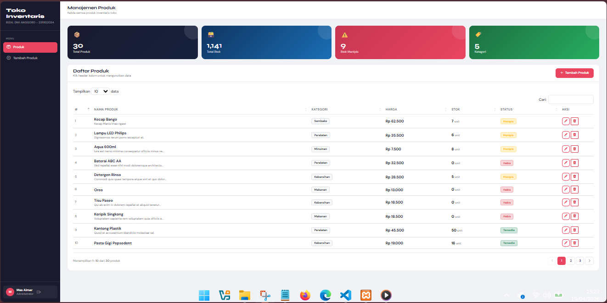
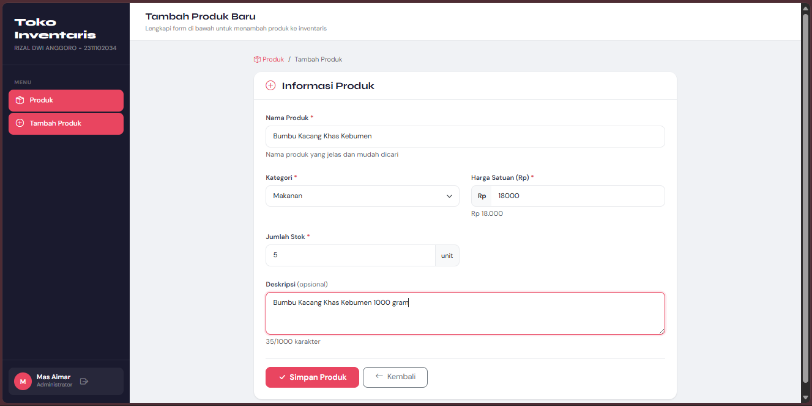
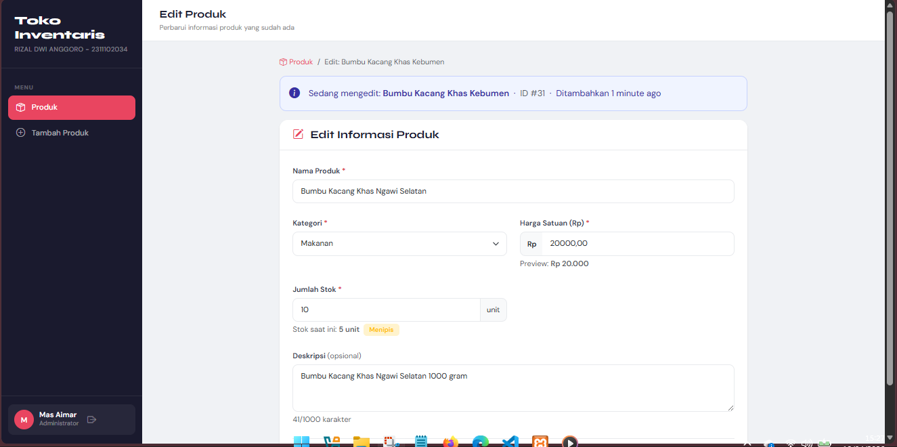
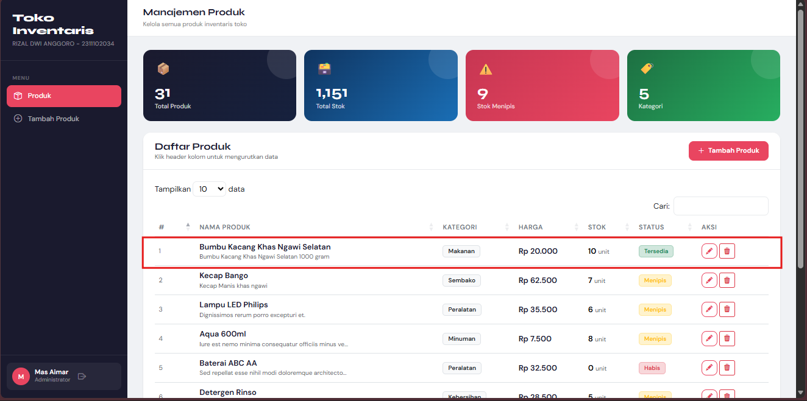
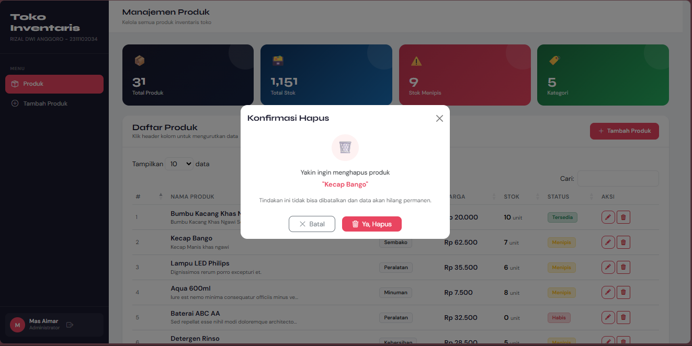
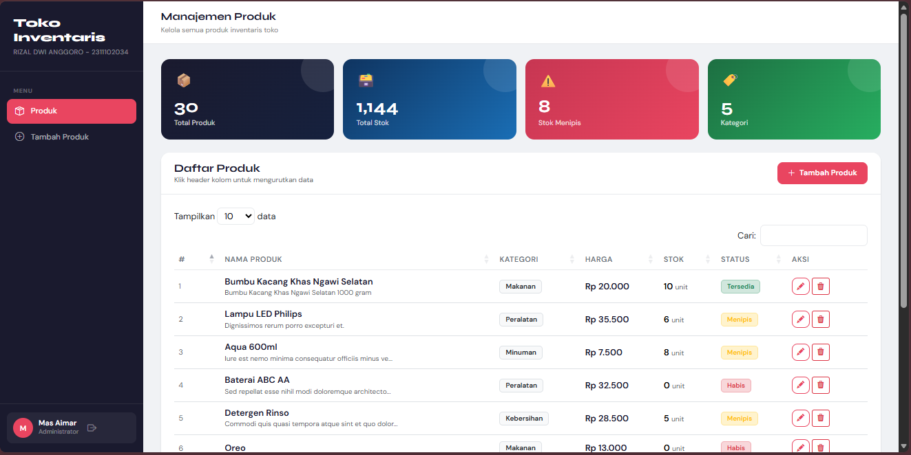

<div align="center">
  <br />
  <h1>LAPORAN PRAKTIKUM <br>APLIKASI BERBASIS PLATFORM</h1>
  <br />
  <h3>MODUL 11-12-13 <br> LARAVEL APLIKASI INVENTORI SEMBAKO  </h3>
  <br />
   
  <br />
  <br />
  <br />
  <h3>Disusun Oleh :</h3>
  <p>
    <strong>Rizal Dwi Anggoro</strong><br>
    <strong>2311102034</strong><br>
    <strong>IF-11-REG01</strong>
  </p>
  <br />
  <h3>Dosen Pengampu :</h3>
  <p>
    <strong>Dimas Fanny Hebrasianto Permadi, S.ST., M.Kom</strong>
  </p>
  <br />
  <br />
    <h4>Asisten Praktikum :</h4>
    <strong> Apri Pandu Wicaksono </strong> <br>
    <strong>Rangga Pradarrell Fathi</strong>
  <br />
  <h3>LABORATORIUM HIGH PERFORMANCE
 <br>FAKULTAS INFORMATIKA <br>UNIVERSITAS TELKOM PURWOKERTO <br>2026</h3>
</div>

---
## Sistem Inventari Toko Pak Cik & Mas Aimar

Aplikasi manajemen inventaris berbasis web untuk memudahkan pengelolaan produk toko.

---

##  Deskripsi Project

Project ini dibuat sebagai **Tugas Modul 11, 12, dan 13** yang mengimplementasikan sistem inventaris toko milik Pak Cik dan Mas Aimar. Aplikasi ini dibangun menggunakan **Laravel 12** dengan fitur lengkap CRUD produk, autentikasi berbasis session, dan tampilan modern menggunakan DataTables.

---

##  Fitur Utama

| Fitur | Keterangan |
|---|---|
|  **Autentikasi** | Login/Logout dengan sistem session Laravel |
|  **CRUD Produk** | Create, Read, Update, Delete produk |
|  **DataTable** | Tampilan tabel interaktif dengan search, sort, pagination |
|  **Delete Modal** | Konfirmasi hapus menggunakan modal Bootstrap |
|  **Seeder + Factory** | Data dummy otomatis agar database tidak kosong |
|  **Dokumentasi** | README lengkap + komentar kode |

---

##  Teknologi yang Digunakan

- **Backend:** Laravel 12 (PHP 8.2+)
- **Database:** MySQL / SQLite
- **Frontend:** Bootstrap 5, DataTables.js
- **Autentikasi:** Laravel Session (built-in)
- **Template Engine:** Blade

---

##  Cara Instalasi & Menjalankan Project

### 1. Clone / Download Project

```bash
git clone `https://github.com/Aplikasi-Berbasis-Platform-S1IF-11-01/modul-11-12-13/tree/main/2311102034-Rizal-Dwi-Anggoro.git`
```

### 2. Install Dependency PHP

```bash
composer install
```

### 3. Konfigurasi Environment

```bash
cp .env.example .env
php artisan key:generate
```

Edit file `.env` sesuaikan database:

```env
DB_CONNECTION=mysql
DB_HOST=127.0.0.1
DB_PORT=3306
DB_DATABASE=inventaris_toko
DB_USERNAME=root
DB_PASSWORD=
```

> **Tips:** Bisa juga pakai SQLite untuk kemudahan lokal:
> ```env
> DB_CONNECTION=sqlite
> ```
> Lalu buat file: `touch database/database.sqlite`

### 4. Migrate & Seed Database

```bash
php artisan migrate
php artisan db:seed
```

Perintah ini akan:
- Membuat tabel `users` dan `products`
- Membuat akun admin default
- Membuat 30 data produk dummy

### 5. Jalankan Server

```bash
php artisan serve
```

Buka browser: **http://localhost:8000**

---

##  3 Akun Admin Pusat

| Email | password |
|---|---|
| `admin@toko.com` | `password` |
| `aimar@toko.com` | `password` |
| `pakcik@toko.com` | `password`|

---

##  Struktur File Penting

```
inventaris-toko/
├── app/
│   ├── Http/
│   │   ├── Controllers/
│   │   │   ├── AuthController.php        ← Login/Logout
│   │   │   └── ProductController.php     ← CRUD Produk
│   │   └── Middleware/
│   │       └── AuthMiddleware.php        ← Guard session
│   └── Models/
│       ├── User.php
│       └── Product.php
├── database/
│   ├── factories/
│   │   └── ProductFactory.php            ← Factory data dummy
│   ├── migrations/
│   │   ├── xxxx_create_users_table.php
│   │   └── xxxx_create_products_table.php
│   └── seeders/
│       ├── DatabaseSeeder.php
│       ├── UserSeeder.php
│       └── ProductSeeder.php
├── resources/
│   └── views/
│       ├── layouts/
│       │   └── app.blade.php             ← Template utama
│       ├── auth/
│       │   └── login.blade.php           ← Halaman login
│       └── products/
│           ├── index.blade.php           ← DataTable produk
│           ├── create.blade.php          ← Form tambah produk
│           └── edit.blade.php            ← Form edit produk
└── routes/
    └── web.php                           ← Definisi semua route
```

---

##  Daftar Route

| Method | URL | Controller | Keterangan |
|---|---|---|---|
| GET | `/login` | AuthController@showLogin | Halaman login |
| POST | `/login` | AuthController@login | Proses login |
| POST | `/logout` | AuthController@logout | Proses logout |
| GET | `/` | redirect `/products` | Redirect ke produk |
| GET | `/products` | ProductController@index | Daftar semua produk |
| GET | `/products/create` | ProductController@create | Form tambah produk |
| POST | `/products` | ProductController@store | Simpan produk baru |
| GET | `/products/{id}/edit` | ProductController@edit | Form edit produk |
| PUT | `/products/{id}` | ProductController@update | Update produk |
| DELETE | `/products/{id}` | ProductController@destroy | Hapus produk |

---

##  Struktur Database

### Tabel `users`
| Kolom | Tipe | Keterangan |
|---|---|---|
| id | bigint (PK) | Primary key |
| name | varchar | Nama user |
| email | varchar (unique) | Email login |
| password | varchar | Password (hashed) |
| created_at | timestamp | - |
| updated_at | timestamp | - |

### Tabel `products`
| Kolom | Tipe | Keterangan |
|---|---|---|
| id | bigint (PK) | Primary key |
| name | varchar | Nama produk |
| category | varchar | Kategori produk |
| price | decimal(10,2) | Harga satuan |
| stock | integer | Jumlah stok |
| description | text (nullable) | Deskripsi produk |
| created_at | timestamp | - |
| updated_at | timestamp | - |

---

##  Catatan Teknis

### Mengapa Session bukan JWT?
Untuk aplikasi web tradisional berbasis Laravel, session lebih sederhana dan aman karena:
- Token disimpan di server (tidak terekspos ke client)
- Terintegrasi langsung dengan Laravel
- Mudah di-invalidate saat logout

### Mengapa Factory + Seeder?
- **Factory**: Mendefinisikan "blueprint" data dummy menggunakan Faker
- **Seeder**: Menjalankan factory untuk mengisi database
- Memudahkan development & testing tanpa perlu input data manual

---

##  Dibuat Untuk

Project ini dibuat untuk memenuhi **Tugas Modul 11, 12, 13** — Inventari Toko Pak Cik & Mas Aimar.

---
## Hasil
**1. Tampilan Awal**

**2. Tambah Product**

**3. Setelah Tambah Product**

**4. Edit Product**
\
**5. Setelah Edit Product**

**6. Hapus Product**

**7. SetelahHapus Product**

