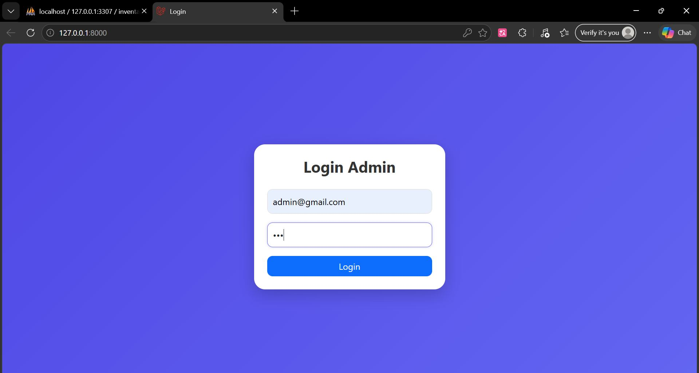
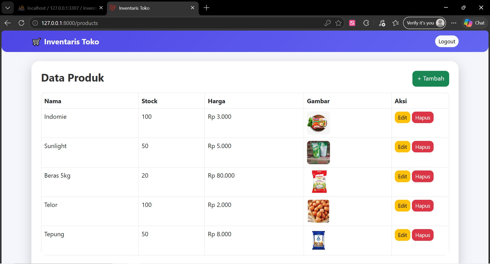
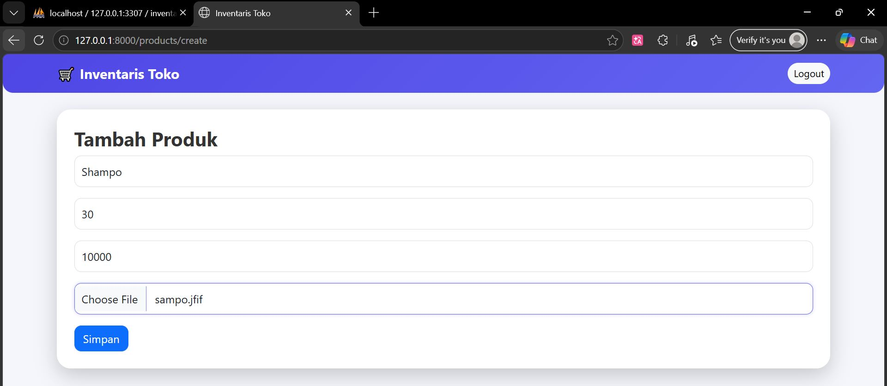
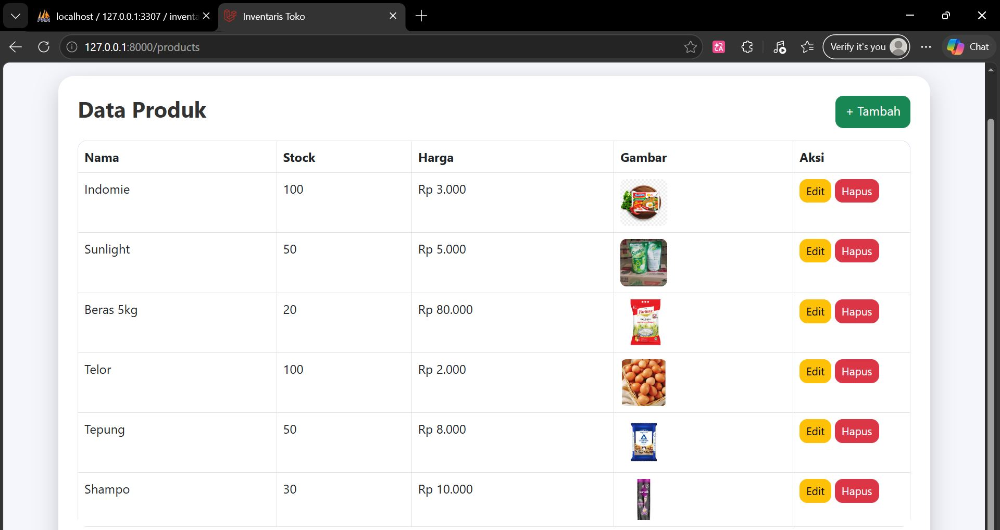
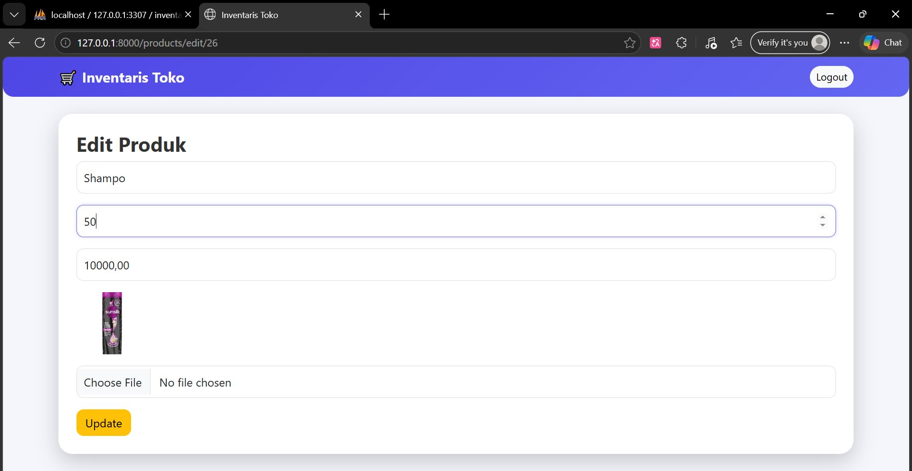
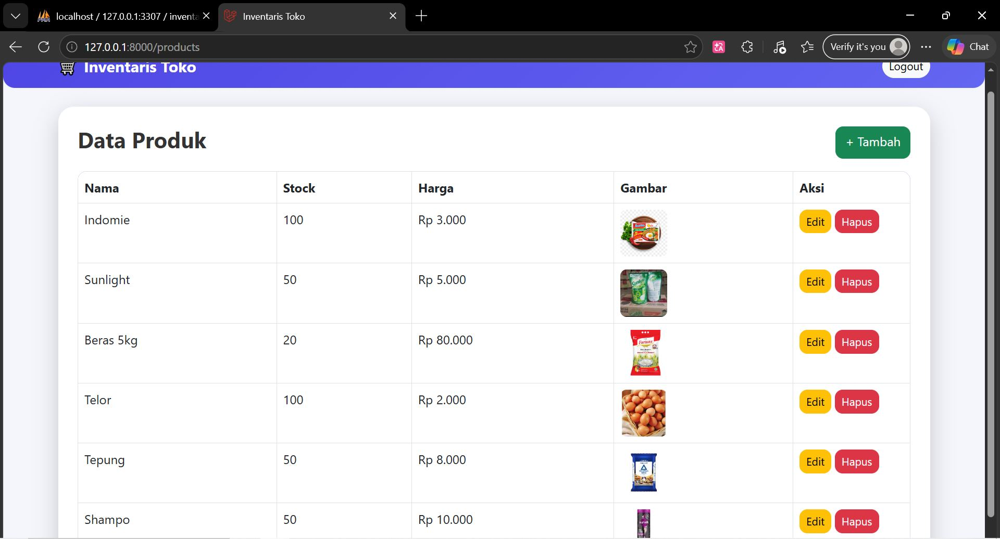
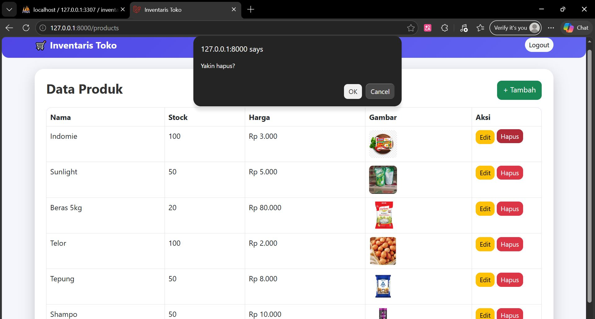
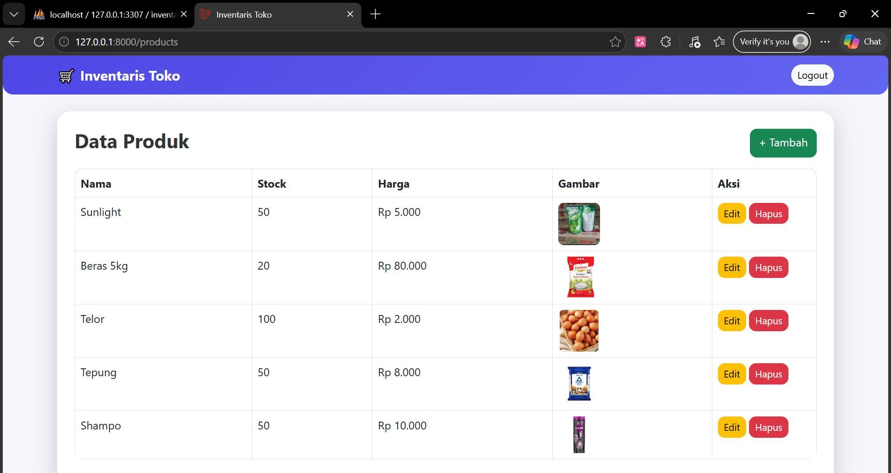
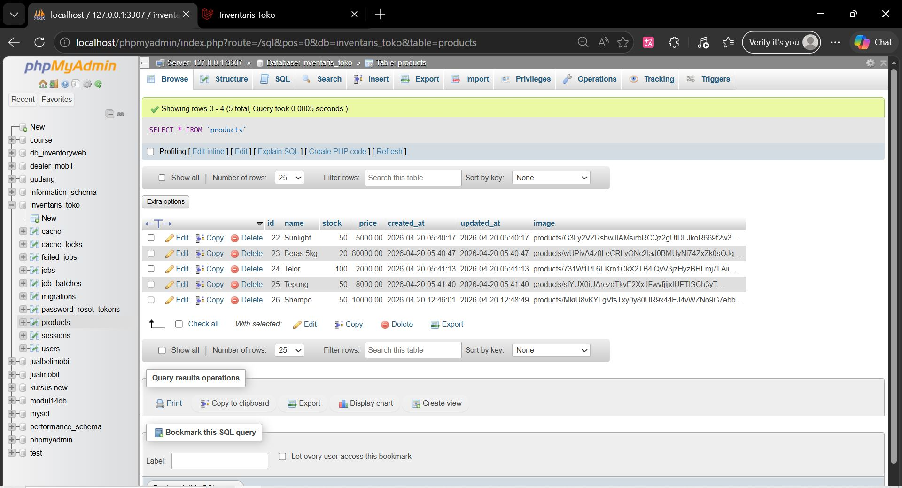

<div align="center">

# LAPORAN PRAKTIKUM  
# APLIKASI BERBASIS PLATFORM

## MODUL 11,12,13
## LARAVEL

 

### Disusun Oleh
**Raihan Ramadhan**  
2311102040  
S1 IF-11-REG01  

### Dosen Pengampu
**Dimas Fanny Hebrasianto Permadi, S.ST., M.Kom**

### Asisten Praktikum
Apri Pandu Wicaksono  
Rangga Pradarrell Fathi  

### LABORATORIUM HIGH PERFORMANCE  
FAKULTAS INFORMATIKA  
UNIVERSITAS TELKOM PURWOKERTO  
2026

</div>

---

# Sistem Inventaris Toko Pak Cik & Mas Aimar

Aplikasi manajemen inventaris berbasis web untuk memudahkan pengelolaan produk toko.

---

## Deskripsi Project

Project ini dibuat sebagai Tugas Modul 11, 12, dan 13 yang mengimplementasikan sistem inventaris toko milik Pak Cik dan Mas Aimar.  

Aplikasi ini dibangun menggunakan Laravel dengan fitur CRUD produk, autentikasi berbasis session sederhana, serta tampilan modern menggunakan Bootstrap dan DataTables.

---

## Fitur Utama

| Fitur | Keterangan |
|------|----------|
| Login Session | Login sederhana menggunakan session Laravel |
| CRUD Produk | Tambah, lihat, edit, dan hapus produk |
| Upload Gambar | Setiap produk memiliki gambar |
| DataTables | Tabel interaktif (search, pagination) |
| Delete Modal | Konfirmasi hapus data |
| Seeder & Factory | Data dummy otomatis |
| UI Modern | Tampilan menggunakan Bootstrap |

---

## Teknologi yang Digunakan

- Backend: Laravel 12 (PHP 8.2+)
- Database:MySQL
- Frontend: Bootstrap 5
- Library: DataTables.js
- Template Engine: Blade
- Auth: Session Laravel (manual)

---

## Cara Instalasi & Menjalankan Project

### 1. Clone / Download Project

```bash
git clone <repo-kamu>
cd project_laravel
```

#### 2. Install Dependency PHP
```bash
composer install
```
#### 3. Konfigurasi Environment
```bash
cp .env.example .env
php artisan key:generate
```
### 4. Konfigurasi Database
```bash
Edit file .env sesuai dengan database yang digunakan:
```
### Menggunakan MySQL
```bash
DB_CONNECTION=mysql
DB_HOST=127.0.0.1
DB_PORT=3307
DB_DATABASE=inventaris_toko
DB_USERNAME=root
DB_PASSWORD=
Pastikan database inventaris_toko sudah dibuat di phpMyAdmin
```
### 5. Migrasi & Seeder Database
```bash
php artisan migrate --seed

Perintah ini akan:

Membuat tabel products
Mengisi data dummy produk
```
### 6. Storage Link (WAJIB untuk gambar)
```bash
php artisan storage:link
Digunakan untuk menampilkan gambar produk
```
### 7. Jalankan Server
```bash
php artisan serve
Buka di browser:
http://127.0.0.1:8000
```
### 8. Login Admin
```bash
Gunakan akun berikut:
Email: admin@gmail.com
Password: 123
```

### 9. Struktur File Penting
```bash
project_laravel/
├── app/
│ ├── Http/
│ │ ├── Controllers/
│ │ │ ├── AuthController.php ← Login & Logout (session)
│ │ │ └── ProductController.php ← CRUD Produk + Upload Gambar
│ └── Models/
│ └── Product.php
│
├── database/
│ ├── factories/
│ │ └── ProductFactory.php ← Data dummy produk
│ ├── migrations/
│ │ └── xxxx_create_products_table.php
│ └── seeders/
│ └── DatabaseSeeder.php
│
├── resources/
│ └── views/
│ ├── layouts/
│ │ ├── app.blade.php ← Layout utama (navbar)
│ │ └── auth.blade.php ← Layout login
│ ├── auth/
│ │ └── login.blade.php ← Halaman login
│ └── products/
│ ├── index.blade.php ← Data produk (DataTables)
│ ├── create.blade.php ← Form tambah produk
│ └── edit.blade.php ← Form edit produk
│
├── public/
│ └── storage/ ← Folder akses gambar (storage link)
│
└── routes/
└── web.php ← Routing aplikasi
```

### 10. Daftar Route
```bash
| Method | URL | Keterangan |
|--------|-----|----------|
| GET | `/` | Halaman login |
| POST | `/login` | Proses login |
| GET | `/logout` | Logout |
| GET | `/products` | Tampilkan semua produk |
| GET | `/products/create` | Form tambah produk |
| POST | `/products/store` | Simpan produk |
| GET | `/products/edit/{id}` | Form edit produk |
| POST | `/products/update/{id}` | Update produk |
| DELETE | `/products/{id}` | Hapus produk |
```

### 11. Struktur Database
### Tabel `products`
```bash
| Kolom | Tipe | Keterangan |
|------|------|----------|
| id | bigint (PK) | Primary key |
| name | varchar | Nama produk |
| stock | integer | Jumlah stok |
| price | decimal(10,2) | Harga |
| image | varchar (nullable) | Path gambar |
| created_at | timestamp | - |
| updated_at | timestamp | - |
```

### 12. Catatan Teknis
### Mengapa menggunakan Session?
```bash
- Lebih sederhana untuk aplikasi skala kecil
- Tidak perlu implementasi token (JWT)
- Mudah digunakan di Laravel
- Session otomatis terhapus saat logout
```

### 12. Upload Gambar Produk
```bash
- Gambar disimpan di:
storage/app/public/products
- Diakses melalui:
public/storage
- Menggunakan perintah:
```bash
php artisan storage:link
```
##  Dibuat Untuk

Project ini dibuat untuk memenuhi **Tugas Modul 11, 12, 13** — Inventari Toko Pak Cik & Mas Aimar.

---
## Hasil
**1. Login** 

---
**2. Tampilan Awal** 


---
**3. Setelah Tambah Product** 


---
**4. Edit Product**


---
**6. Hapus Product**

---
**7. SetelahHapus Product**

