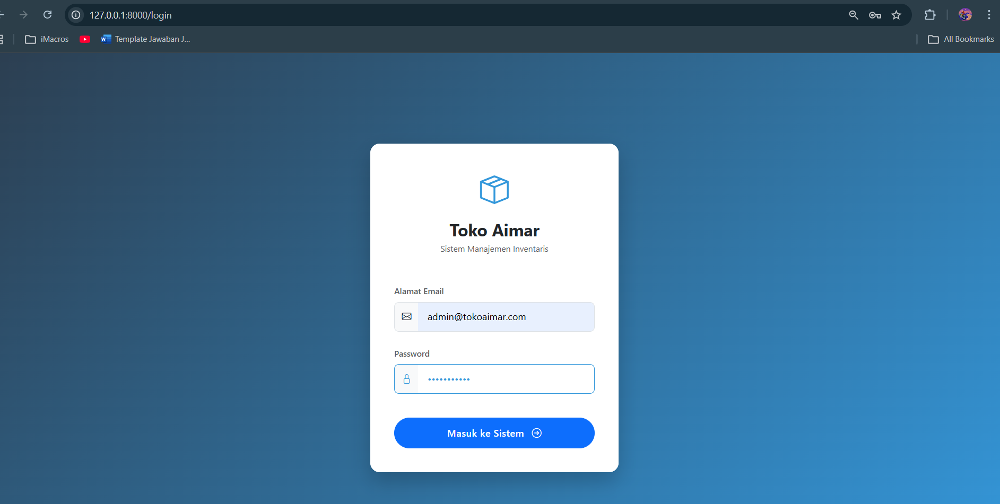
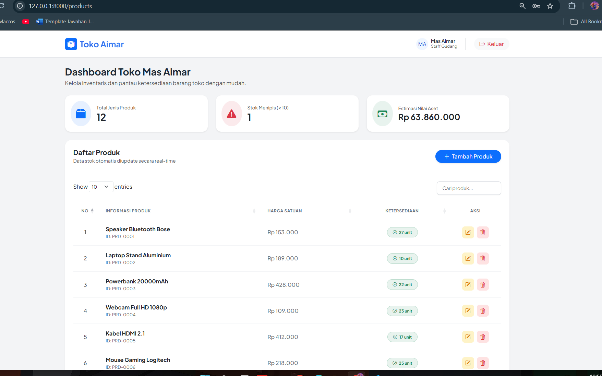
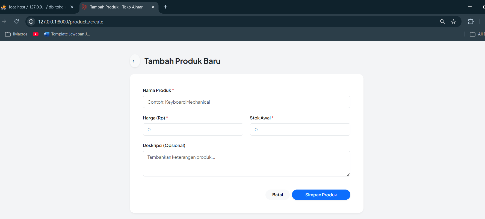
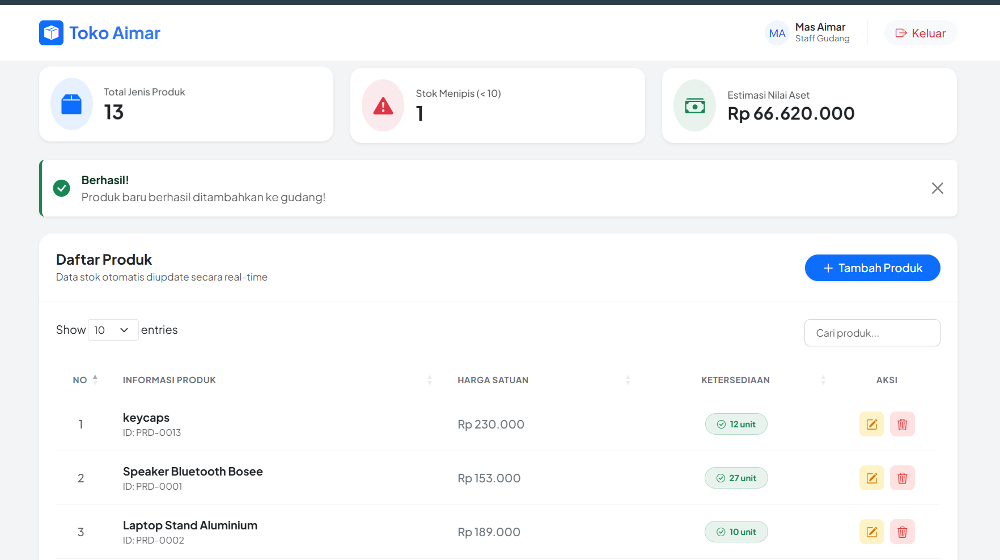
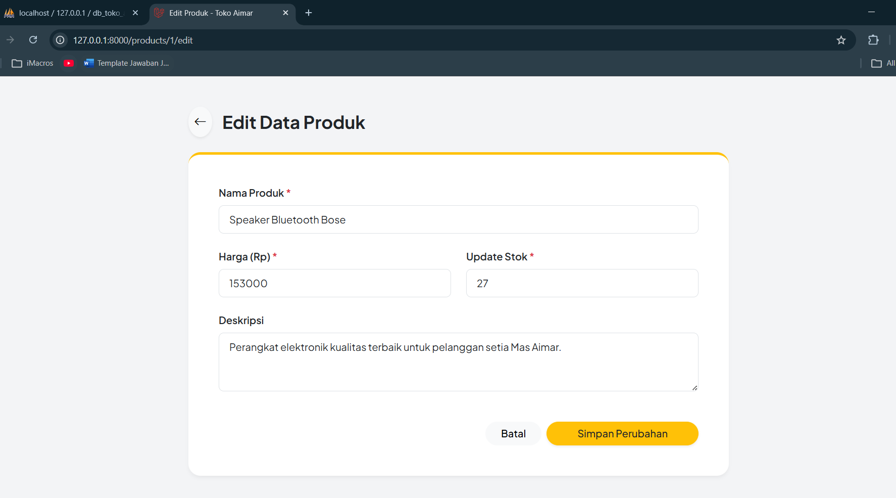
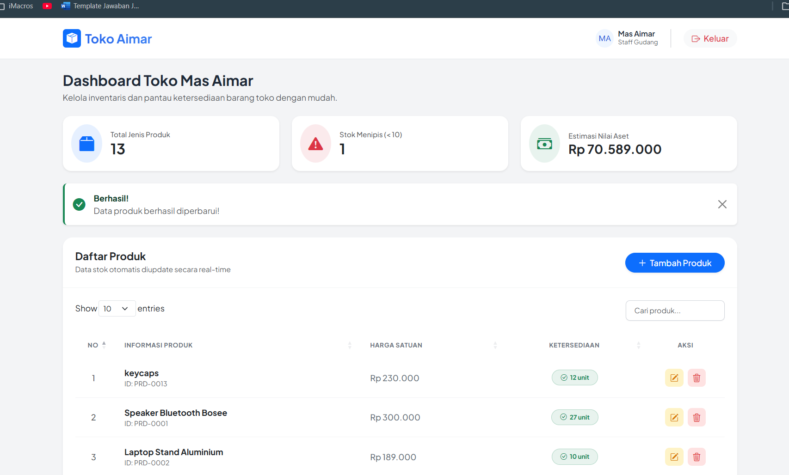
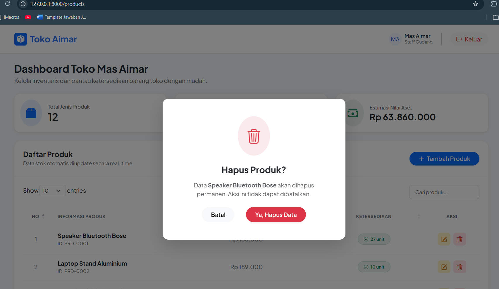
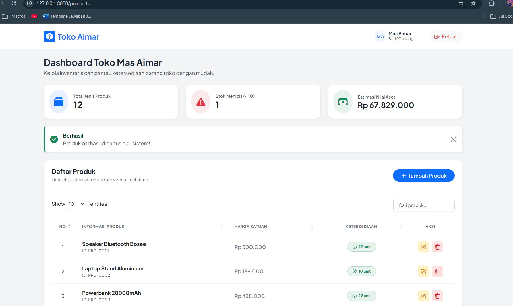

<div align="center">
  <br />

  <h1>LAPORAN PRAKTIKUM <br>
  APLIKASI BERBASIS PLATFORM
  </h1>

  <br />

  <h3>MODUL 11 12 13<br>
  LARAVEl
  </h3>

  <br />

  <p align="center">

</p>

  <br />
  <br />
  <br />

  <h3>Disusun Oleh :</h3>

  <p>
    <strong>Abda Firas Rahman</strong><br>
    <strong>2311102049</strong><br>
    <strong>S1 IF-11-REG01</strong>
  </p>

  <br />

  <h3>Dosen Pengampu :</h3>

  <p>
    <strong>Dimas Fanny Hebrasianto Permadi, S.ST., M.Kom</strong>
  </p>
  
  <br />
  <br />
    <h4>Asisten Praktikum :</h4>
    <strong>Apri Pandu Wicaksono </strong> <br>
    <strong>Rangga Pradarrell Fathi</strong>
  <br />

  <h3>LABORATORIUM HIGH PERFORMANCE
 <br>FAKULTAS INFORMATIKA <br>UNIVERSITAS TELKOM PURWOKERTO <br>2026</h3>
</div>

<hr>

### Dasar Teori
1. Framework Laravel
Laravel adalah framework PHP modern yang menggunakan sintaks elegan dan ekspresif. Dalam project ini, Laravel berperan sebagai fondasi utama untuk menangani routing, keamanan session, dan manajemen database secara efisien melalui fitur-fitur bawaannya.

2. Arsitektur MVC (Model-View-Controller)
Pola desain ini digunakan untuk memisahkan logika aplikasi agar lebih terstruktur dan mudah dikelola:

Model: Mengelola data produk dan berinteraksi langsung dengan database db_toko_aimar.

View: Menampilkan antarmuka pengguna (UI) menggunakan mesin templating Blade dengan desain modern dan responsif.

Controller: Menjadi perantara yang mengatur logika dari permintaan user, lalu mengambil data dari Model untuk ditampilkan ke View.

3. Database Factory & Seeder
Fitur ini digunakan untuk otomatisasi data:

Seeder: Digunakan untuk memasukkan data awal ke database, seperti akun login admin Mas Aimar dan daftar produk awal.

Factory: Digunakan untuk mendefinisikan skema data dummy (seperti barang-barang elektronik) agar pengujian sistem inventaris bisa dilakukan tanpa harus menginput data manual satu per satu.

4. Operasi CRUD (Create, Read, Update, Delete)
Merupakan fungsi inti dari sistem inventaris untuk mengelola siklus hidup data produk:

Create: Menambahkan stok barang elektronik baru ke gudang.

Read: Menampilkan daftar inventaris menggunakan DataTables agar mudah dicari dan diurutkan.

Update: Memperbarui detail informasi, harga, atau sisa stok produk.

Delete: Menghapus produk dari database dengan tambahan Confirmation Modal sebagai pengaman agar tidak terjadi salah klik.

5. Autentikasi & Middleware Auth
Keamanan sistem dijaga melalui proses login berbasis Session:

Session: Menyimpan identitas user yang masuk agar status login terjaga selama browser dibuka.

Middleware: Bertindak sebagai filter keamanan yang membatasi akses halaman dashboard, sehingga hanya Mas Aimar (admin) yang sudah login yang bisa mengelola stok barang.

6. UI/UX dengan Bootstrap & Jakarta Sans
Aplikasi ini menggunakan framework CSS Bootstrap 5 untuk menciptakan tampilan yang responsif di berbagai perangkat. Desain difokuskan pada konsep SaaS Modern dengan tipografi Plus Jakarta Sans untuk memberikan kesan profesional, bersih, dan mudah digunakan bagi pengelola toko.


### Tampilan Hasil Kode Program:
## login


## Halaman Awal


## menu tambah barang



## menu edit barang



## menu hapus




## Kode program 
Berikut adalah kode program nya:

### ProductController.php
```php
<?php

namespace App\Http\Controllers;

use App\Models\Product;
use Illuminate\Http\Request;

class ProductController extends Controller
{
    // 1. Menampilkan Dashboard
    public function index() {
        $products = Product::latest()->get();
        return view('products.index', compact('products'));
    }

    // 2. Menampilkan Form Tambah Produk
    public function create() {
        return view('products.create');
    }

    // 3. Menyimpan Data Baru 
    public function store(Request $request) {
        $validatedData = $request->validate([
            'nama_produk' => 'required',
            'deskripsi'   => 'nullable',
            'harga'       => 'required|numeric|min:0',
            'stok'        => 'required|numeric|min:0',
        ]);

        // Simpan data yang sudah divalidasi 
        Product::create($validatedData);
        
        return redirect()->route('products.index')->with('success', 'Produk baru berhasil ditambahkan ke gudang!');
    }

    // 4. Menampilkan Form Edit
    public function edit(Product $product) {
        return view('products.edit', compact('product'));
    }

    // 5. Menyimpan Update 
    public function update(Request $request, Product $product) {
        $validatedData = $request->validate([
            'nama_produk' => 'required',
            'deskripsi'   => 'nullable',
            'harga'       => 'required|numeric|min:0',
            'stok'        => 'required|numeric|min:0',
        ]);

        // Update dengan data yang sudah divalidasi 
        $product->update($validatedData);
        
        return redirect()->route('products.index')->with('success', 'Data produk berhasil diperbarui!');
    }

    // 6. Menghapus Data
    public function destroy(Product $product) {
        $product->delete();
        return redirect()->route('products.index')->with('success', 'Produk berhasil dihapus dari sistem!');
    }
}
```
## Penjelasan Program
Ini adalah pusat kendali untuk semua data barang di Toko Aimar. Controller ini mengatur aliran data mulai dari mengambil daftar produk dari database untuk ditampilkan di tabel, memproses penambahan barang baru, hingga menangani pembaruan data dan penghapusan produk. Setiap aksi yang dilakukan user pada dashboard akan diproses oleh fungsi-fungsi di dalam file ini sebelum hasilnya dikembalikan ke tampilan browser.

### web.php
```php
<?php

use App\Http\Controllers\AuthController;
use App\Http\Controllers\ProductController;
use Illuminate\Support\Facades\Route;

Route::get('/', function () { 
    return redirect('/login'); 
});


Route::get('/login', [AuthController::class, 'index'])->name('login');
Route::post('/login', [AuthController::class, 'authenticate']);
Route::middleware('auth')->group(function () {
    
    // Semua yang ada di dalam sini wajib login
    Route::resource('products', ProductController::class);
    Route::post('/logout', [AuthController::class, 'logout'])->name('logout');
    
});
```
## Penjelasan Program
File ini bertindak sebagai "peta jalan" atau navigasi utama aplikasi. Semua URL yang diketikkan di browser (seperti /login atau /products) didaftarkan di sini. Selain menentukan URL mana yang mengarah ke controller mana, file ini juga dipasangi Middleware Auth yang bertugas sebagai satpam; memastikan hanya pengguna yang sudah login yang bisa mengakses rute-rute penting di dalam sistem inventaris.

### AuthController.php
```php
<?php

namespace App\Http\Controllers;

use Illuminate\Http\Request;
use Illuminate\Support\Facades\Auth;

class AuthController extends Controller
{
    public function index() {
        return view('auth.login');
    }

    public function authenticate(Request $request) {
        $credentials = $request->validate([
            'email' => ['required', 'email'],
            'password' => ['required'],
        ]);

        if (Auth::attempt($credentials)) {
            $request->session()->regenerate();
            return redirect()->intended('products');
        }

        return back()->withErrors(['email' => 'Email atau password salah!']);
    }

    public function logout(Request $request) {
        Auth::logout();
        $request->session()->invalidate();
        $request->session()->regenerateToken();
        return redirect('/login');
    }
}
```
## Penjelasan Program
File ini berfungsi sebagai otak di balik sistem keamanan dan akses pengguna. Di dalamnya terdapat logika untuk menangani proses login, validasi email dan password serta sesi logout. Ketika Mas Aimar memasukkan kredensialnya, AuthController akan mengecek kecocokannya dengan data di database, lalu membuatkan session aktif agar sistem mengenali bahwa admin telah masuk secara sah.


### login.blade.php
```html
<!DOCTYPE html>
<html lang="id">
<head>
    <meta charset="UTF-8">
    <meta name="viewport" content="width=device-width, initial-scale=1.0">
    <title>Login - Toko Aimar</title>
    <link href="https://cdn.jsdelivr.net/npm/bootstrap@5.3.0/dist/css/bootstrap.min.css" rel="stylesheet">
    <link rel="stylesheet" href="https://cdn.jsdelivr.net/npm/bootstrap-icons@1.11.3/font/bootstrap-icons.min.css">
    
    <style>
        body {
            /* Background gradient modern biru ke ungu */
            background: linear-gradient(135deg, #2c3e50 0%, #3498db 100%);
            height: 100vh;
            display: flex;
            align-items: center;
            justify-content: center;
        }
        .login-card {
            border: none;
            border-radius: 1rem;
            box-shadow: 0 15px 35px rgba(0, 0, 0, 0.2);
            overflow: hidden;
        }
        .login-header {
            background-color: #ffffff;
            padding: 2.5rem 2rem 1rem;
            border-bottom: none;
        }
        .login-body {
            padding: 1rem 2.5rem 2.5rem;
            background-color: #ffffff;
        }
        .btn-login {
            border-radius: 50px;
            font-weight: 600;
            padding: 0.8rem;
            letter-spacing: 0.5px;
            transition: all 0.3s ease;
        }
        .btn-login:hover {
            transform: translateY(-2px);
            box-shadow: 0 5px 15px rgba(52, 152, 219, 0.4);
        }
        .input-group-text {
            background-color: #f8f9fa;
            border-right: none;
            border-radius: 0.5rem 0 0 0.5rem;
        }
        .form-control {
            border-left: none;
            border-radius: 0 0.5rem 0.5rem 0;
            padding: 0.75rem 1rem;
        }
        .form-control:focus {
            box-shadow: none;
            border-color: #dee2e6;
        }
        .input-group:focus-within .input-group-text,
        .input-group:focus-within .form-control {
            border-color: #3498db;
            color: #3498db;
        }
    </style>
</head>
<body>

    <div class="container">
        <div class="row justify-content-center">
            <div class="col-md-6 col-lg-4">
                <div class="card login-card">
                    <div class="card-header login-header text-center">
                        <div class="mb-3">
                            <i class="bi bi-box-seam" style="font-size: 3rem; color: #3498db;"></i>
                        </div>
                        <h3 class="fw-bold mb-0 text-dark">Toko Aimar</h3>
                        <p class="text-muted mt-1 small">Sistem Manajemen Inventaris</p>
                    </div>
                    
                    <div class="card-body login-body">
                        @if($errors->any())
                            <div class="alert alert-danger rounded-3 py-2 small">
                                <i class="bi bi-exclamation-triangle-fill me-1"></i> Email atau password salah!
                            </div>
                        @endif

                        <form action="{{ url('login') }}" method="POST">
                            @csrf
                            <div class="mb-4">
                                <label class="form-label text-muted fw-semibold small">Alamat Email</label>
                                <div class="input-group">
                                    <span class="input-group-text"><i class="bi bi-envelope"></i></span>
                                    <input type="email" name="email" class="form-control" placeholder="admin@tokoaimar.com" required value="{{ old('email') }}">
                                </div>
                            </div>

                            <div class="mb-4">
                                <label class="form-label text-muted fw-semibold small">Password</label>
                                <div class="input-group">
                                    <span class="input-group-text"><i class="bi bi-lock"></i></span>
                                    <input type="password" name="password" class="form-control" placeholder="••••••••" required>
                                </div>
                            </div>

                            <button type="submit" class="btn btn-primary w-100 btn-login mt-3">
                                Masuk ke Sistem <i class="bi bi-arrow-right-circle ms-2"></i>
                            </button>
                        </form>
                    </div>
                </div>
                
                <div class="text-center mt-4 text-white opacity-75 small">
                </div>
            </div>
        </div>
    </div>

</body>
</html>
```
## Penjelasan Program
Ini adalah file antarmuka (View) yang pertama kali dilihat oleh pengguna. Menggunakan mesin templating Blade dan Bootstrap, file ini menyediakan formulir input yang bersih dan modern untuk memasukkan email dan password. Selain sebagai tampilan, file ini juga bertugas mengirimkan data inputan tersebut secara aman ke server serta menampilkan pesan error apabila kredensial yang dimasukkan oleh Mas Aimar tidak sesuai.


## Kesimpulan
Penerapan arsitektur Model-View-Controller (MVC) terbukti sangat efektif dalam memisahkan logika bisnis, pengelolaan struktur database, dan perancangan antarmuka, sehingga barisan kode program menjadi jauh lebih terstruktur, rapi, dan mudah untuk proses maintenance ke depannya.

Selain itu, integrasi fungsionalitas dasar CRUD (Create, Read, Update, Delete) yang dipadukan dengan pengamanan lewat sistem Session-based Authentication berhasil menciptakan sebuah aplikasi manajemen gudang yang aman dan fungsional. Pengalaman pengguna (User Experience) juga berhasil ditingkatkan secara signifikan melalui implementasi framework Bootstrap 5 yang memberikan sentuhan desain Soft-UI modern dan responsif, serta pemanfaatan library DataTables yang memungkinkan penyortiran dan pencarian data stok barang secara instan tanpa perlu memuat ulang halaman browser.
## Revernsi
[1] Modul Praktikum Aplikasi Berbasis Platform (ABP) Modul 11
[2] Modul Praktikum Aplikasi Berbasis Platform (ABP) Modul 12
[3] Modul Praktikum Aplikasi Berbasis Platform (ABP) Modul 13
Laravel 11 `https://laravel.com/docs`
Bootstrap 5 `https://getbootstrap.com/docs`