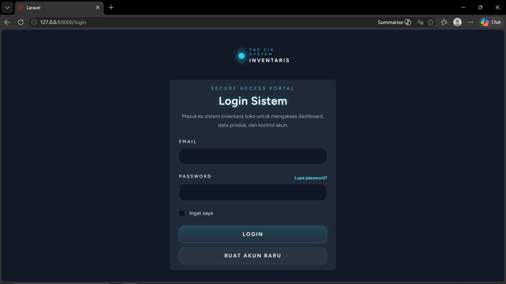
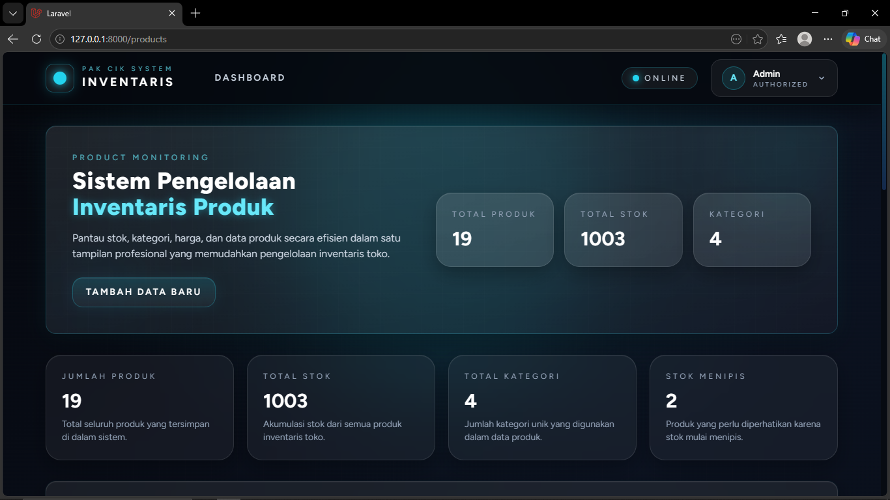
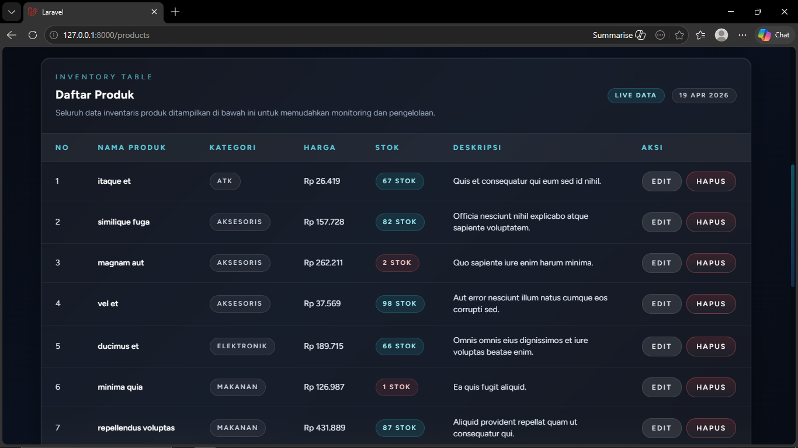
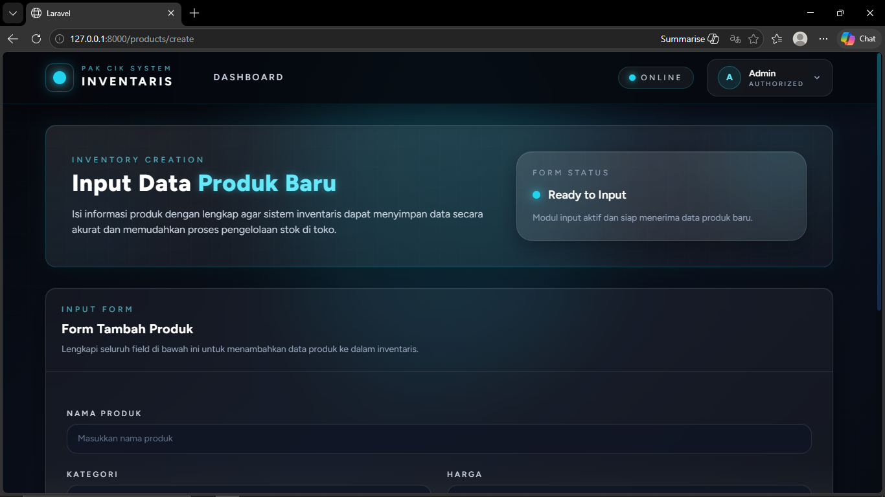
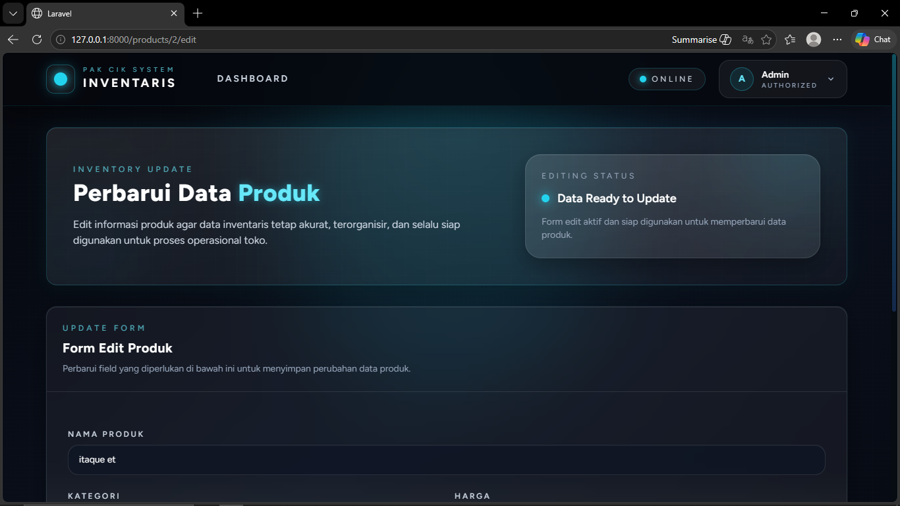

<div align="center">
  <br />
  <h1>LAPORAN PRAKTIKUM <br>APLIKASI BERBASIS PLATFORM</h1>
  <br />
  <h3>MODUL 11, 12 & 13 <br> Laravel Aplikasi Inventaris Pak Cik </h3>
  <br />
  <br />
  
  <br />
  <br />
  <br />
  <h3>Disusun Oleh :</h3>
  <p>
    <strong>Muhammad Hamzah Haifan Ma'ruf</strong><br>
    <strong>2311102091</strong><br>
    <strong>S1 IF-11-REG01</strong>
  </p>
  <br />
  <h3>Dosen Pengampu :</h3>
  <p>
    <strong>Dimas Fanny Hebrasianto Permadi, S.ST., M.Kom</strong>
  </p>
  <br />
  <h4>Asisten Praktikum :</h4>
  <strong>Apri Pandu Wicaksono</strong> <br>
  <strong>Rangga Pradarrell Fathi</strong>
  <br />
  <h3>LABORATORIUM HIGH PERFORMANCE
 <br>FAKULTAS INFORMATIKA <br>UNIVERSITAS TELKOM PURWOKERTO <br>2026</h3>
</div>

---

# DASAR TEORI

## 1. Laravel
Laravel merupakan framework PHP berbasis MVC (Model View Controller) yang menyediakan fitur routing, migration, middleware, autentikasi, ORM Eloquent, dan Blade Template Engine. Laravel membantu pengembangan aplikasi web menjadi lebih cepat, terstruktur, dan aman.

## 2. MVC (Model View Controller)
MVC membagi aplikasi menjadi tiga komponen:
- **Model**: mengelola data dan database.
- **View**: menangani tampilan antarmuka.
- **Controller**: mengatur logika aplikasi dan penghubung Model dengan View.

## 3. CRUD
CRUD adalah operasi dasar dalam pengelolaan data: Create, Read, Update, dan Delete.

## 4. Sistem Inventaris
Sistem inventaris digunakan untuk mengelola data barang, stok, kategori, dan harga agar proses pencatatan lebih efektif dan akurat.

## 5. Tailwind CSS
Tailwind CSS adalah framework utility-first CSS yang memudahkan pembuatan antarmuka modern dan responsif.

---

# PENJELASAN KODE

## 1. Migration Database

```php
Schema::create('products', function (Blueprint $table) {
    $table->id();
    $table->string('nama_produk');
    $table->string('kategori');
    $table->decimal('harga', 15, 0);
    $table->integer('stok');
    $table->text('deskripsi')->nullable();
    $table->timestamps();
});
```

Kode di atas digunakan untuk membuat tabel `products` pada database. Kolom `id()` berfungsi sebagai primary key otomatis. Kolom `nama_produk` menyimpan nama barang, `kategori` menyimpan jenis barang, `harga` menyimpan harga produk, `stok` menyimpan jumlah stok tersedia, dan `deskripsi` menyimpan keterangan tambahan. Fungsi `timestamps()` menambahkan kolom `created_at` dan `updated_at`.

## 2. Model Product

```php
class Product extends Model
{
    protected $fillable = [
        'nama_produk',
        'kategori',
        'harga',
        'stok',
        'deskripsi'
    ];
}
```

Model `Product` digunakan sebagai representasi tabel `products` pada Laravel Eloquent ORM. Properti `$fillable` berfungsi menentukan field yang boleh diisi secara mass assignment saat proses tambah atau update data.

## 3. Routing

```php
Route::middleware('auth')->group(function () {
    Route::resource('products', ProductController::class);
});
```

Kode routing di atas mengelompokkan route yang hanya dapat diakses setelah login menggunakan middleware `auth`. Perintah `Route::resource()` secara otomatis membuat route CRUD seperti index, create, store, edit, update, dan destroy.

## 4. Controller

```php
public function index()
{
    $products = Product::latest()->get();
    return view('product.index', compact('products'));
}
```

Method `index()` digunakan untuk mengambil seluruh data produk dari database kemudian mengirimkannya ke halaman `product.index`. Fungsi `latest()` mengurutkan data berdasarkan waktu terbaru.

```php
public function store(Request $request)
{
    Product::create($request->all());
}
```

Method `store()` digunakan untuk menyimpan data produk baru yang dikirim dari form input ke dalam database.

```php
public function update(Request $request, Product $product)
{
    $product->update($request->all());
}
```

Method `update()` digunakan untuk memperbarui data produk yang sudah ada berdasarkan ID produk yang dipilih.

```php
public function destroy(Product $product)
{
    $product->delete();
}
```

Method `destroy()` digunakan untuk menghapus data produk dari database.

## 5. Dashboard

```php
$totalProduk = Product::count();
$totalStok = Product::sum('stok');
$totalKategori = Product::pluck('kategori')->unique()->count();
```

Kode dashboard di atas digunakan untuk menampilkan statistik sistem. `count()` menghitung jumlah produk, `sum('stok')` menghitung total stok barang, dan `pluck()->unique()->count()` menghitung jumlah kategori unik.

## 6. Blade Template

```php
<x-app-layout>
    <x-slot name="header">
        Dashboard
    </x-slot>
</x-app-layout>
```

Blade Template digunakan untuk membuat tampilan yang rapi dan dapat digunakan ulang. Komponen `x-app-layout` berfungsi sebagai layout utama aplikasi, sedangkan `header` digunakan untuk judul halaman.

## 7. Tailwind CSS

```html
class="rounded-2xl bg-black text-white shadow-xl"
```

Class Tailwind CSS di atas digunakan untuk mempercantik tampilan. `rounded-2xl` membuat sudut membulat, `bg-black` memberi warna latar hitam, `text-white` memberi warna teks putih, dan `shadow-xl` menambahkan bayangan.

---

# HASIL PRAKTIKUM

## 1. Halaman Login


## 2. Dashboard


## 3. Halaman Produk


## 4. Tambah Produk


## 5. Edit Produk


---

# KESIMPULAN

Pada praktikum Modul 11, 12, dan 13 telah berhasil dibuat aplikasi Inventaris Toko berbasis Laravel yang memiliki fitur autentikasi pengguna serta pengelolaan data produk secara lengkap melalui konsep CRUD. Sistem mampu melakukan proses penambahan, penampilan, perubahan, dan penghapusan data produk dengan baik serta menampilkan informasi statistik pada dashboard. Selain fungsi utama berjalan dengan baik, tampilan antarmuka juga berhasil dikembangkan menjadi desain modern futuristik menggunakan Tailwind CSS. Melalui praktikum ini diperoleh pemahaman mengenai penggunaan framework Laravel, konsep MVC, migration database, routing, controller, Blade Template, autentikasi, serta pengembangan antarmuka web modern.

---

# REFERENSI

1. Rahman, M.A., Islam, S. Web Application Development Using Laravel PHP Framework. Journal of Software Engineering Applications, 2021. DOI: https://doi.org/10.4236/jsea.2021.141001  
2. Prasetyo, N. et al. Inventory Information System for Retail Store Management. Procedia Computer Science, 2023. DOI: https://doi.org/10.1016/j.procs.2023.04.102  
3. Kumar, A. et al. Design of CRUD Based Inventory Management System. IJACSA, 2022. DOI: https://doi.org/10.14569/IJACSA.2022.0130576  
4. Tailwind CSS Documentation. https://tailwindcss.com/docs  
5. Laravel Documentation. https://laravel.com/docs
