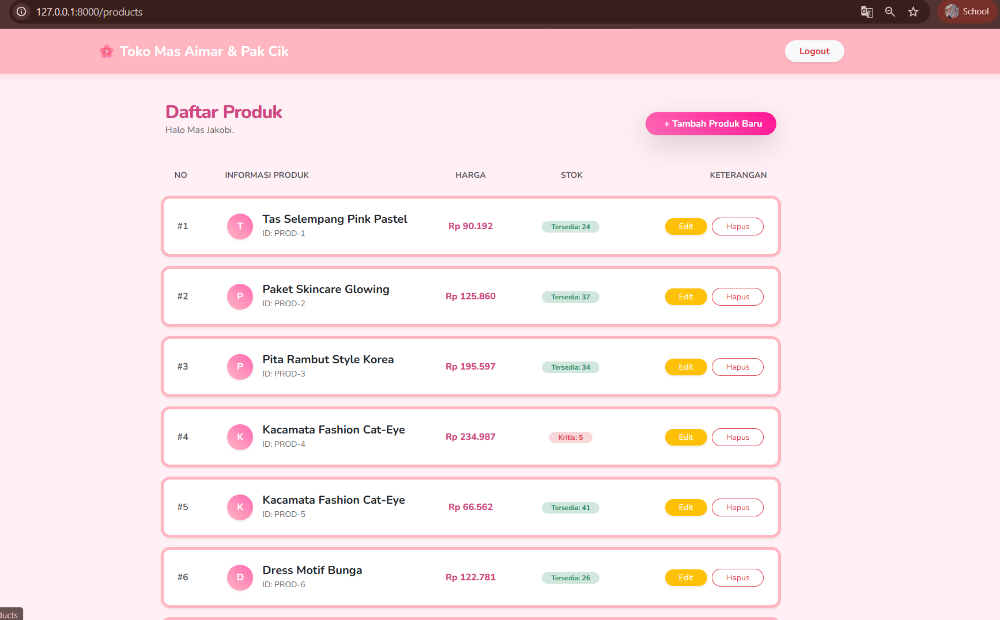
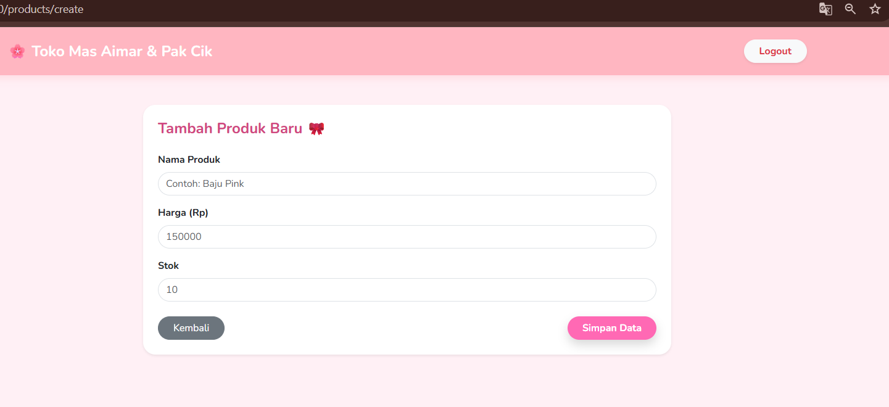
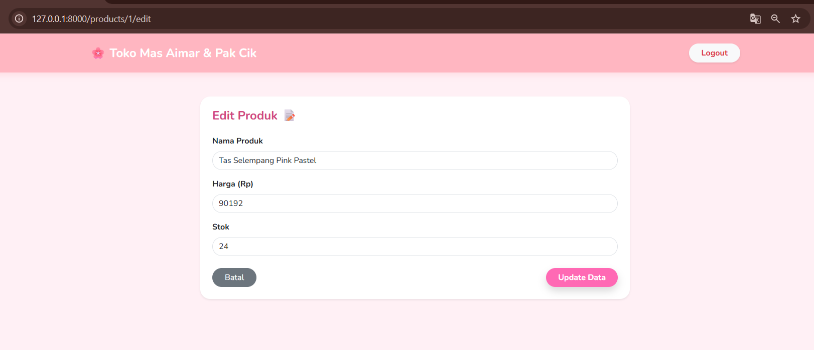
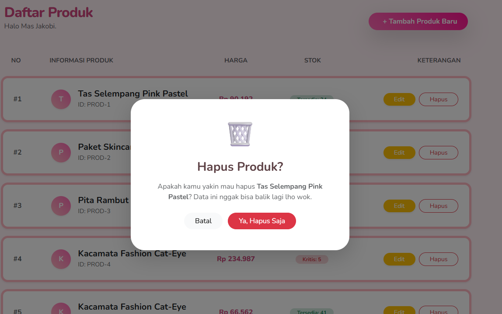
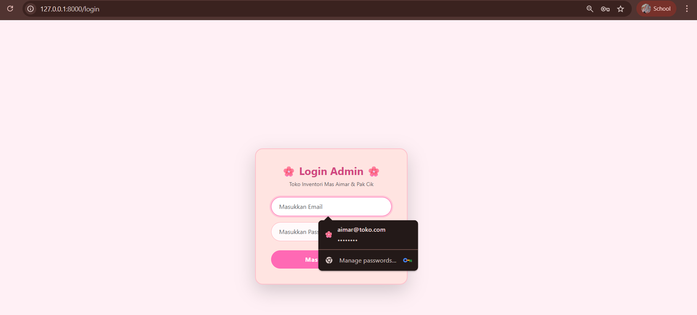

<div align="center">
  <br />

  <h1>LAPORAN PRAKTIKUM <br>
  APLIKASI BERBASIS PLATFORM
  </h1>

  <br />

  <h3>MODUL 11 12 13<br>
  LARAVEL
  </h3>

  <br />

  <p align="center">

</p>

  <br />
  <br />
  <br />

  <h3>Disusun Oleh :</h3>

  <p>
    <strong>Aisyah Anis Mazaya</strong><br>
    <strong>2311102095</strong><br>
    <strong>S1 IF-11-REG01</strong>
  </p>

  <br />

  <h3>Dosen Pengampu :</h3>

  <p>
    <strong>Dimas Fanny Hebrasianto Permadi, S.ST., M.Kom</strong>
  </p>
  
  <br />
  <br />
    <h4>Asisten Praktikum :</h4>
    <strong>Apri Pandu Wicaksono </strong> <br>
    <strong>Rangga Pradarrell Fathi</strong>
  <br />

  <h3>LABORATORIUM HIGH PERFORMANCE
 <br>FAKULTAS INFORMATIKA <br>UNIVERSITAS TELKOM PURWOKERTO <br>2026</h3>
</div>

<hr>

### Dasar Teori
1. Framework Laravel
Laravel merupakan framework pengembangan aplikasi web berbasis PHP yang menggunakan ekspresi sintaksis yang elegan dan ekspresif. Laravel mengikuti pola arsitektur MVC (Model-View-Controller) yang memisahkan antara logika bisnis, data, dan tampilan. Keunggulan Laravel dalam project ini adalah adanya fitur Eloquent ORM untuk pengelolaan database yang lebih mudah.

2. Arsitektur MVC (Model-View-Controller)
Pola desain ini digunakan untuk mengorganisasi kode program agar lebih terstruktur:

Model: Menangani logika data dan interaksi dengan database db_toko_inventaris.

View: Menangani tampilan antarmuka pengguna (UI) dengan tema Pink Pastel menggunakan mesin templating Blade.

Controller: Bertindak sebagai jembatan yang mengatur aliran data antara Model dan View.

3. Database Factory & Seeder
Database Seeder: Fitur Laravel yang memungkinkan pengisian data awal (dummy data) ke dalam database secara otomatis.

Database Factory: Digunakan untuk mendefinisikan pola data yang akan dibuat oleh Seeder. Dalam project ini, Factory digunakan untuk menghasilkan daftar produk (seperti barang-barang fashion wanita) secara otomatis untuk keperluan pengujian.

4. CRUD (Create, Read, Update, Delete)
CRUD adalah empat fungsi dasar dalam penyimpanan data persisten.

Create: Menambahkan produk baru ke stok.

Read: Menampilkan daftar produk dalam bentuk list/tabel yang rapi.

Update: Mengubah informasi produk (harga/stok).

Delete: Menghapus produk dari sistem dengan tambahan Confirmation Modal untuk keamanan data.

5. Sistem Autentikasi & Session
Sistem login pada aplikasi ini menggunakan Session-based Authentication.

Session: Cara untuk menyimpan informasi user (seperti status login) di seluruh permintaan halaman.

Middleware Auth: Bertindak sebagai "satpam" yang memastikan hanya user yang memiliki session aktif (sudah login) yang dapat mengakses halaman inventori Mas Aimar dan Pak Cik.

6. Bootstrap & UI/UX (Pastel Theme)
Bootstrap adalah framework CSS open-source yang digunakan untuk menciptakan desain web yang responsif. Penggunaan tema Pink Pastel bertujuan untuk memberikan pengalaman pengguna (User Experience) yang lembut, modern, dan tidak kaku dibandingkan tabel sistem informasi konvensional.


## Kode program 
Berikut adalah kode program nya:

### web.php
```php
        <?php

        use Illuminate\Support\Facades\Route;
        use App\Http\Controllers\ProductController;
        use App\Http\Controllers\AuthController;


        Route::get('/', function () {
            return auth()->check() ? redirect('/products') : redirect('/login');
        });

        // Jalur Auth
        Route::get('/login', [AuthController::class, 'showLogin'])->name('login');
        Route::post('/login', [AuthController::class, 'login']);
        Route::post('/logout', [AuthController::class, 'logout'])->name('logout');

        // Jalur Produk (Hanya untuk yang sudah login)
        Route::middleware('auth')->group(function () {
            Route::resource('products', ProductController::class);
        });
```
## Penjelasan Program
Berperan sebagai pintu gerbang utama aplikasi yang bertugas memetakan setiap permintaan URL dari browser ke fungsi-fungsi spesifik di dalam controller. Di dalam file ini, jalur akses didefinisikan secara sistematis, termasuk penerapan middleware auth yang bertindak sebagai sistem proteksi untuk membatasi akses halaman inventori hanya bagi admin yang sudah terautentikasi. Selain itu, file ini juga mengatur logika pengalihan (redirect) otomatis yang secara cerdas mengarahkan pengguna ke halaman login atau produk berdasarkan status sesi mereka.

### ProductController.php
```php
<?php

namespace App\Http\Controllers;

use App\Models\Product;
use Illuminate\Http\Request;

class ProductController extends Controller
{
    public function index() {
        $products = Product::latest()->get();
        return view('products.index', compact('products'));
    }

    public function create() {
        return view('products.create');
    }

    public function store(Request $request) {
        $request->validate([
            'nama_produk' => 'required',
            'harga' => 'required|numeric',
            'stok' => 'required|numeric'
        ]);

        Product::create($request->all());
        return redirect()->route('products.index')->with('success', 'Produk berhasil ditambah! 🌸');
    }

    public function edit(Product $product) {
        return view('products.edit', compact('product'));
    }

    public function update(Request $request, Product $product) {
        $request->validate([
            'nama_produk' => 'required',
            'harga' => 'required|numeric',
            'stok' => 'required|numeric'
        ]);

        $product->update($request->all());
        return redirect()->route('products.index')->with('success', 'Produk berhasil diupdate! ✨');
    }

    public function destroy(Product $product) {
        $product->delete();
        return redirect()->route('products.index')->with('success', 'Produk berhasil dihapus! 🗑️');
    }
}
```
## Penjelasan Program
berfungsi sebagai pusat pengelolaan data produk atau manajer gudang digital yang menangani seluruh siklus hidup data melalui logika CRUD. Controller ini bertanggung jawab untuk mengambil data dari database menggunakan Eloquent ORM memproses validasi inputan dari form tambah dan edit, serta mengeksekusi perintah penghapusan data yang terhubung dengan konfirmasi modal di bagian tampilan. Singkatnya, file ini menjadi jembatan utama yang memastikan apa yang diinput oleh pengguna dapat tersimpan dan tampil dengan benar di database toko.

### AuthController.php
```php
<?php

namespace App\Http\Controllers;

use Illuminate\Http\Request;
use Illuminate\Support\Facades\Auth;

class AuthController extends Controller
{
    public function showLogin() {
        // Tampilkan halaman pink pastel tadi
        return view('auth.login');
    }

    public function login(Request $request) {
        $credentials = $request->validate([
            'email' => ['required', 'email'],
            'password' => ['required'],
        ]);

        if (Auth::attempt($credentials)) {
            $request->session()->regenerate();
            // Kalau berhasil login, masuk ke produk
            return redirect()->intended('/products');
        }

        // Kalau gagal, balik ke login bawa pesan error
        return back()->withErrors(['email' => 'Email atau password salah nih wok.'])->onlyInput('email');
    }

    public function logout(Request $request) {
        Auth::logout();
        $request->session()->invalidate();
        $request->session()->regenerateToken();
        return redirect('/login');
    }
}
```
## Penjelasan Program
berperan sebagai sistem kendali keamanan atau "satpam" digital yang mengelola identitas pengguna dan manajemen session aplikasi. Fungsi utamanya adalah melakukan verifikasi kredensial seperti email dan password untuk memberikan hak akses kepada admin, serta mengelola pembuatan kartu akses digital (session) di sisi browser. Selain menangani proses login, controller ini juga memastikan keamanan sistem melalui proses logout yang bertugas menghancurkan seluruh data sesi dan membersihkan token keamanan agar akun tidak bisa disalahgunakan oleh pihak lain.

## Cara Menjalankan Program
1. Buka Terminal: Pastikan kamu sudah berada di dalam folder project toko-aimar melalui terminal VS Code atau CMD.

2. Instalasi Dependencies: Jalankan perintah composer install untuk mengunduh semua "onderdil" atau library pendukung agar Laravel bisa berjalan normal.

3. Setup Environment: Pastikan file .env sudah ada (kalau belum, copy dari .env.example) dan pastikan nama database di bagian DB_DATABASE sudah sesuai dengan yang kamu buat di phpMyAdmin.

4. Generate App Key: Jalankan perintah php artisan key:generate. Ini penting untuk membuat kunci keamanan unik agar aplikasi kamu bisa diakses.

5. Migrasi & Seed Data: Jalankan perintah sakti php artisan migrate:fresh --seed. Perintah ini akan menghapus data lama, membuat tabel baru, dan otomatis mengisi daftar barang cewek yang gemes tadi ke database.

6. Jalankan Server: Ketik php artisan serve untuk menyalakan mesin server lokal kamu.

7. Akses Browser: Buka browser dan ketik alamat ``http://localhost:8000.`` Kalau kamu langsung dilempar ke halaman login, tinggal masukkan email aimar@toko.com dengan password password.

### Tampilan Hasil Kode Program:

Halaman tersebut adalah Antarmuka Login Admin yang berfungsi sebagai pintu keamanan utama aplikasi Toko Mas Aimar & Pak Cik. Menggunakan sistem Session-based Authentication dari Laravel, halaman ini bertugas memverifikasi identitas pengguna melalui email (aimar@toko.com) dan password sebelum memberikan izin untuk masuk ke sistem manajemen stok. Secara desain, halaman ini sudah menggunakan Bootstrap 5 dengan kustomisasi CSS pastel agar memberikan kesan yang modern, bersih, dan ramah pengguna (User Friendly).


Dashboard Inventori Utama yang mengadopsi desain modern card-list dengan sentuhan tema Pink Pastel. Berbeda dengan tabel konvensional, setiap produk ditampilkan dalam baris melayang (floating rows) yang memiliki efek bayangan lembut (soft shadow) dan inisial produk yang berwarna gradien untuk memperkuat aspek visual. Halaman ini berfungsi sebagai pusat kendali bagi Mas Jakobi untuk memantau stok secara real-time.


Halaman ini adalah Formulir Tambah Produk yang dirancang khusus untuk mempermudah admin dalam memperbarui stok barang di Toko Mas Aimar secara cepat dan akurat. Menggunakan komponen form control dari Bootstrap yang telah dikustomisasi dengan desain melengkung (rounded) dan warna pastel, formulir ini memastikan pengalaman pengisian data yang nyaman dan intuitif. Setiap inputan, mulai dari nama produk, harga, hingga jumlah stok, akan diproses oleh ProductController menggunakan metode POST untuk kemudian disimpan secara permanen ke dalam database.


Formulir Edit Produk yang berfungsi untuk memperbarui informasi barang yang sudah ada di database. Secara teknis, formulir ini menggunakan metode PUT/PATCH untuk mengirimkan perubahan data (Nama, Harga, atau Stok) kembali ke server.!


Konfirmasi Hapus, sebuah fitur keamanan untuk mencegah terhapusnya data secara tidak sengaja. Secara teknis, fitur ini menggunakan komponen Bootstrap Modal yang akan muncul saat tombol hapus diklik, meminta verifikasi akhir dari admin sebelum sistem menjalankan perintah DELETE ke database.

