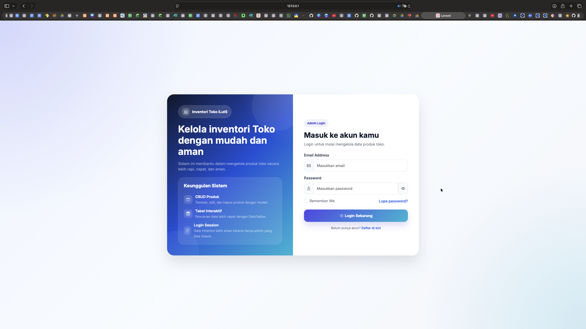
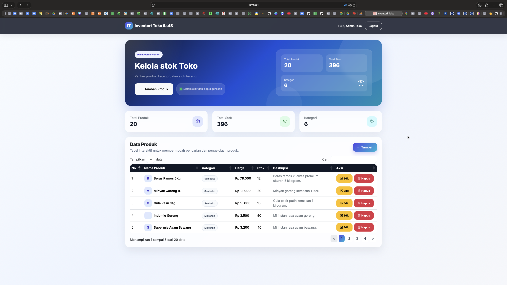
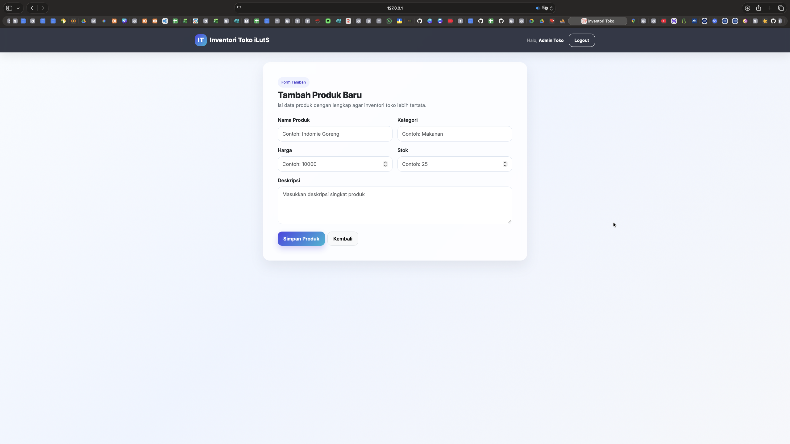
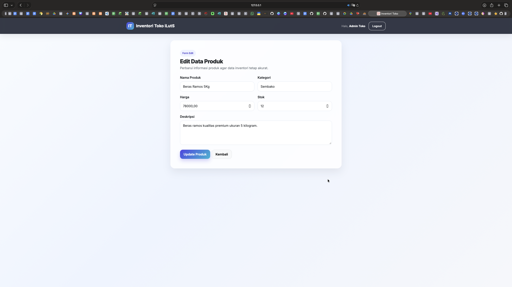
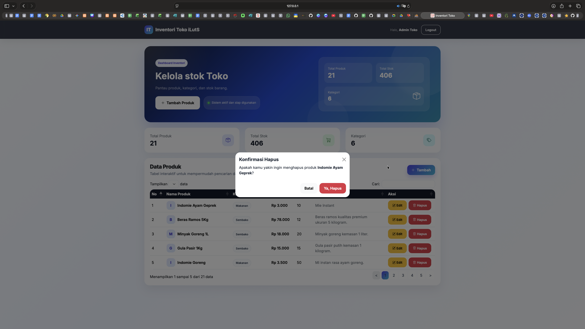

<div align="center">
  <br />
  <h1>LAPORAN PRAKTIKUM <br>APLIKASI BERBASIS PLATFORM</h1>
  <br />
  <h3>MODUL 11, 12 & 13 <br> Laravel Aplikasi Inventori Toko</h3>
  <br />
  <br />
   
  <br />
  <br />
  <br />
  <br />
  <h3>Disusun Oleh :</h3>
  <p>
    <strong>NAUFAL LUTHFI ASSARY</strong><br>
    <strong>2311102125</strong><br>
    <strong>S1 IF-11-REG01</strong>
  </p>
  <br />
  <h3>Dosen Pengampu :</h3>
  <p>
    <strong>Dimas Fanny Hebrasianto Permadi, S.ST., M.Kom</strong>
  </p>
  <br />
  <br />
    <h4>Asisten Praktikum :</h4>
    <strong> Apri Pandu Wicaksono </strong> <br>
    <strong>Rangga Pradarrell Fathi</strong>
  <br />
  <h3>LABORATORIUM HIGH PERFORMANCE
 <br>FAKULTAS INFORMATIKA <br>UNIVERSITAS TELKOM PURWOKERTO <br>2026</h3>
</div>

---

## 1. Implementasi Sistem 

Pada praktikum ini dilakukan dengan membangun aplikasi web inventori toko berbasis Laravel yang terhubung dengan database MySQL untuk mengelola data produk secara terstruktur. Sistem diawali dengan pembuatan migration untuk mendefinisikan tabel products, kemudian dilanjutkan dengan model Product yang merepresentasikan data produk serta relasinya dengan User. Logika utama aplikasi diatur pada ProductController yang menangani proses CRUD, yaitu menampilkan, menambah, mengubah, dan menghapus data produk, disertai validasi input agar data yang disimpan tetap sesuai aturan. Pada sisi keamanan, sistem menerapkan autentikasi berbasis session sehingga hanya pengguna yang berhasil login yang dapat mengakses halaman inventori, serta pembatasan data berdasarkan `user_id` agar setiap pengguna hanya dapat mengelola produk miliknya sendiri. Antarmuka sistem dibangun menggunakan Blade template, Bootstrap, dan DataTables untuk menghasilkan tampilan modern, responsif, serta mendukung pencarian dan pengelolaan data yang lebih mudah. Selain itu, aplikasi juga dilengkapi seeder yang berisi data produk toko klontong agar database tidak kosong saat pertama kali dijalankan, sehingga sistem dapat langsung diuji dan digunakan.

---

## 2. Penjelasan Kode 

### 2.1 Migration Struktur Database

Migration ini mendefinisikan struktur tabel products pada database yang berisi kolom id, nama_produk, kategori, harga, stok, deskripsi, serta timestamps untuk menyimpan data produk. _File Referensi_: `database/migrations/2026_04_17_174447_create_products_table.php`

```php
<?php

use Illuminate\Database\Migrations\Migration;
use Illuminate\Database\Schema\Blueprint;
use Illuminate\Support\Facades\Schema;

return new class extends Migration
{
    /**
     * Run the migrations.
     */
    public function up(): void
    {
        Schema::create('products', function (Blueprint $table) {
            $table->id();
            $table->string('nama_produk');
            $table->string('kategori');
            $table->decimal('harga', 12, 2);
            $table->integer('stok');
            $table->text('deskripsi')->nullable();
            $table->timestamps();
        });
    }

    /**
     * Reverse the migrations.
     */
    public function down(): void
    {
        Schema::dropIfExists('products');
    }
};
```
---

### 2.2 Model `Product.php`

Model Product mendefinisikan entitas produk yang dapat menyimpan data user_id, nama_produk, kategori, harga, stok, dan deskripsi, serta memiliki relasi belongsTo ke model User. _File Referensi_: `app/Models/Product.php`

```php
<?php

namespace App\Models;

use Illuminate\Database\Eloquent\Factories\HasFactory;
use Illuminate\Database\Eloquent\Model;

class Product extends Model
{
    use HasFactory;

    protected $fillable = [
        'user_id',
        'nama_produk',
        'kategori',
        'harga',
        'stok',
        'deskripsi',
    ];

    public function user()
    {
        return $this->belongsTo(User::class);
    }       
}
```
---

### 2.3 Database Seeder

Seeder digunakan untuk membuat satu akun admin dan mengisi tabel products dengan data produk toko klontong secara otomatis agar database tidak kosong. _File Referensi_: `database/seeders/DatabaseSeeder.php`

```php
<?php

namespace Database\Seeders;

use App\Models\Product;
use App\Models\User;
use Illuminate\Database\Seeder;
use Illuminate\Support\Facades\Hash;

class DatabaseSeeder extends Seeder
{
    public function run(): void
    {
        $user = User::firstOrCreate(
            ['email' => 'admin@toko.com'],
            [
                'name' => 'Admin Toko',
                'password' => Hash::make('password123'),
            ]
        );

        $products = [
            [
                'user_id' => $user->id,
                'nama_produk' => 'Beras Ramos 5Kg',
                'kategori' => 'Sembako',
                'harga' => 78000,
                'stok' => 12,
                'deskripsi' => 'Beras ramos kualitas premium ukuran 5 kilogram.',
            ],
            [
                'user_id' => $user->id,
                'nama_produk' => 'Minyak Goreng 1L',
                'kategori' => 'Sembako',
                'harga' => 18000,
                'stok' => 20,
                'deskripsi' => 'Minyak goreng kemasan 1 liter.',
            ],
            [
                'user_id' => $user->id,
                'nama_produk' => 'Gula Pasir 1Kg',
                'kategori' => 'Sembako',
                'harga' => 15000,
                'stok' => 15,
                'deskripsi' => 'Gula pasir putih kemasan 1 kilogram.',
            ],
            [
                'user_id' => $user->id,
                'nama_produk' => 'Indomie Goreng',
                'kategori' => 'Makanan',
                'harga' => 3500,
                'stok' => 50,
                'deskripsi' => 'Mi instan rasa ayam goreng.',
            ],
            [
                'user_id' => $user->id,
                'nama_produk' => 'Supermie Ayam Bawang',
                'kategori' => 'Makanan',
                'harga' => 3200,
                'stok' => 40,
                'deskripsi' => 'Mi instan rasa ayam bawang.',
            ],
            [
                'user_id' => $user->id,
                'nama_produk' => 'Teh Botol Sosro',
                'kategori' => 'Minuman',
                'harga' => 5000,
                'stok' => 25,
                'deskripsi' => 'Minuman teh siap minum botol.',
            ],
            [
                'user_id' => $user->id,
                'nama_produk' => 'Aqua 600ml',
                'kategori' => 'Minuman',
                'harga' => 3000,
                'stok' => 35,
                'deskripsi' => 'Air mineral kemasan botol 600ml.',
            ],
            [
                'user_id' => $user->id,
                'nama_produk' => 'Kopi Kapal Api',
                'kategori' => 'Minuman',
                'harga' => 2500,
                'stok' => 30,
                'deskripsi' => 'Kopi sachet siap seduh.',
            ],
            [
                'user_id' => $user->id,
                'nama_produk' => 'Sabun Lifebuoy',
                'kategori' => 'Kebutuhan Harian',
                'harga' => 4500,
                'stok' => 18,
                'deskripsi' => 'Sabun mandi batang Lifebuoy.',
            ],
            [
                'user_id' => $user->id,
                'nama_produk' => 'Pasta Gigi Pepsodent',
                'kategori' => 'Kebutuhan Harian',
                'harga' => 12000,
                'stok' => 10,
                'deskripsi' => 'Pasta gigi Pepsodent ukuran sedang.',
            ],
            [
                'user_id' => $user->id,
                'nama_produk' => 'Susu Dancow Sachet',
                'kategori' => 'Minuman',
                'harga' => 2500,
                'stok' => 22,
                'deskripsi' => 'Susu bubuk sachet rasa original.',
            ],
            [
                'user_id' => $user->id,
                'nama_produk' => 'Tepung Terigu 1Kg',
                'kategori' => 'Sembako',
                'harga' => 14000,
                'stok' => 14,
                'deskripsi' => 'Tepung terigu serbaguna kemasan 1 kilogram.',
            ],
            [
                'user_id' => $user->id,
                'nama_produk' => 'Telur Ayam 1Kg',
                'kategori' => 'Sembako',
                'harga' => 28000,
                'stok' => 9,
                'deskripsi' => 'Telur ayam negeri segar per kilogram.',
            ],
            [
                'user_id' => $user->id,
                'nama_produk' => 'Kecap Bango',
                'kategori' => 'Bumbu Dapur',
                'harga' => 22000,
                'stok' => 8,
                'deskripsi' => 'Kecap manis bango ukuran sedang.',
            ],
            [
                'user_id' => $user->id,
                'nama_produk' => 'Saus Sambal ABC',
                'kategori' => 'Bumbu Dapur',
                'harga' => 11000,
                'stok' => 11,
                'deskripsi' => 'Saus sambal botol ABC.',
            ],
            [
                'user_id' => $user->id,
                'nama_produk' => 'Garam Dapur',
                'kategori' => 'Bumbu Dapur',
                'harga' => 4000,
                'stok' => 17,
                'deskripsi' => 'Garam dapur halus kemasan.',
            ],
            [
                'user_id' => $user->id,
                'nama_produk' => 'Chitato Sapi Panggang',
                'kategori' => 'Snack',
                'harga' => 9000,
                'stok' => 19,
                'deskripsi' => 'Snack kentang rasa sapi panggang.',
            ],
            [
                'user_id' => $user->id,
                'nama_produk' => 'Wafer Tango',
                'kategori' => 'Snack',
                'harga' => 8500,
                'stok' => 16,
                'deskripsi' => 'Wafer renyah isi cokelat.',
            ],
            [
                'user_id' => $user->id,
                'nama_produk' => 'Biskuit Roma Kelapa',
                'kategori' => 'Snack',
                'harga' => 7000,
                'stok' => 13,
                'deskripsi' => 'Biskuit roma rasa kelapa.',
            ],
            [
                'user_id' => $user->id,
                'nama_produk' => 'Tisu Nice',
                'kategori' => 'Kebutuhan Harian',
                'harga' => 8000,
                'stok' => 12,
                'deskripsi' => 'Tisu wajah kemasan praktis.',
            ],
        ];

        foreach ($products as $product) {
            Product::create($product);
        }
    }
}
```
---

### 2.4 Routes web.php

Routes mendefinisikan alur akses aplikasi dengan mengarahkan halaman utama dan /home ke halaman produk serta mengatur resource route products yang hanya bisa diakses oleh user yang sudah login. _File Referensi_: `routes/web.php`

```php
<?php

use Illuminate\Support\Facades\Route;
use Illuminate\Support\Facades\Auth;
use App\Http\Controllers\ProductController;

Route::get('/', function () {
    return redirect()->route('products.index');
});

Auth::routes();

Route::get('/home', function () {
    return redirect()->route('products.index');
})->middleware('auth');

Route::middleware('auth')->group(function () {
    Route::resource('products', ProductController::class)->except(['show']);
});
```
---

### 2.5 Controller `ProductController.php`

Controller mendefinisikan logika CRUD produk yang hanya dapat diakses oleh user yang sudah login, termasuk menampilkan, menambah, mengubah, dan menghapus data produk milik user tersebut. _File Referensi_: `app/Http/Controllers/ProductController.php`

```php
<?php

namespace App\Http\Controllers;

use App\Models\Product;
use Illuminate\Http\Request;
use Illuminate\Support\Facades\Auth;

class ProductController extends Controller
{
    public function __construct()
    {
        $this->middleware('auth');
    }

    public function index()
    {
        $products = Product::where('user_id', Auth::id())
            ->latest()
            ->get();

        return view('products.index', compact('products'));
    }

    public function create()
    {
        return view('products.create');
    }

    public function store(Request $request)
    {
        $validated = $request->validate([
            'nama_produk' => 'required|string|max:255',
            'kategori' => 'required|string|max:255',
            'harga' => 'required|numeric|min:0',
            'stok' => 'required|integer|min:0',
            'deskripsi' => 'nullable|string',
        ]);

        $validated['user_id'] = Auth::id();

        Product::create($validated);

        return redirect()->route('products.index')->with('success', 'Produk berhasil ditambahkan.');
    }

    public function edit($id)
    {
        $product = Product::where('user_id', Auth::id())->findOrFail($id);

        return view('products.edit', compact('product'));
    }

    public function update(Request $request, $id)
    {
        $product = Product::where('user_id', Auth::id())->findOrFail($id);

        $validated = $request->validate([
            'nama_produk' => 'required|string|max:255',
            'kategori' => 'required|string|max:255',
            'harga' => 'required|numeric|min:0',
            'stok' => 'required|integer|min:0',
            'deskripsi' => 'nullable|string',
        ]);

        $product->update($validated);

        return redirect()->route('products.index')->with('success', 'Produk berhasil diupdate.');
    }

    public function destroy($id)
    {
        $product = Product::where('user_id', Auth::id())->findOrFail($id);

        $product->delete();

        return redirect()->route('products.index')->with('success', 'Produk berhasil dihapus.');
    }
}
```
---

### 2.6 View Layout Utama (`layouts/app.blade.php`)

Layout utama mendefinisikan struktur tampilan dasar aplikasi Inventori Toko iLutS dengan memuat Bootstrap, DataTables, Google Fonts, dan Bootstrap Icons, mengatur berbagai gaya antarmuka modern seperti navbar, card, tabel, form, dan tombol melalui CSS internal, serta menampilkan navbar dengan informasi user yang sedang login, pesan sukses, area konten dinamis menggunakan @yield('content'), dan file JavaScript pendukung melalui @stack('scripts'). _File Referensi_: `resources/views/layouts/app.blade.php`

```php
<!DOCTYPE html>
<html lang="id">
<head>
    <meta charset="UTF-8">
    <meta name="viewport" content="width=device-width, initial-scale=1.0">
    <title>Inventori Toko</title>

    <link href="https://cdn.jsdelivr.net/npm/bootstrap@5.3.3/dist/css/bootstrap.min.css" rel="stylesheet">
    <link rel="stylesheet" href="https://cdn.datatables.net/1.13.8/css/dataTables.bootstrap5.min.css">
    <link rel="preconnect" href="https://fonts.googleapis.com">
    <link rel="preconnect" href="https://fonts.gstatic.com" crossorigin>
    <link href="https://fonts.googleapis.com/css2?family=Inter:wght@400;500;600;700;800&display=swap" rel="stylesheet">
    <link rel="stylesheet" href="https://cdn.jsdelivr.net/npm/bootstrap-icons@1.11.3/font/bootstrap-icons.min.css">

    <style>
        body {
            font-family: 'Inter', sans-serif;
            background: linear-gradient(135deg, #f8fbff 0%, #eef4ff 45%, #f6f7fb 100%);
            min-height: 100vh;
            color: #1f2937;
        }

        .navbar-modern {
            background: rgba(17, 24, 39, 0.85);
            backdrop-filter: blur(14px);
            box-shadow: 0 10px 30px rgba(0,0,0,0.08);
        }

        .brand-badge {
            width: 38px;
            height: 38px;
            border-radius: 12px;
            display: inline-flex;
            align-items: center;
            justify-content: center;
            background: linear-gradient(135deg, #4f46e5, #06b6d4);
            color: white;
            font-weight: 800;
            margin-right: 10px;
        }

        .hero-card {
            border: 0;
            border-radius: 28px;
            background:
                radial-gradient(circle at top left, rgba(255,255,255,0.16), transparent 22%),
                linear-gradient(135deg, #0f172a 0%, #1d4ed8 48%, #0891b2 100%);
            color: white;
            box-shadow: 0 24px 60px rgba(29, 78, 216, 0.22);
            overflow: hidden;
            position: relative;
        }

        .hero-card::before {
            content: '';
            position: absolute;
            width: 280px;
            height: 280px;
            right: -60px;
            top: -60px;
            background: rgba(255,255,255,0.08);
            border-radius: 50%;
        }

        .hero-card::after {
            content: '';
            position: absolute;
            width: 180px;
            height: 180px;
            left: 55%;
            bottom: -80px;
            background: rgba(255,255,255,0.05);
            border-radius: 50%;
        }

        .glass-card {
            border: 1px solid rgba(255,255,255,0.55);
            border-radius: 22px;
            background: rgba(255,255,255,0.82);
            backdrop-filter: blur(12px);
            box-shadow: 0 18px 40px rgba(15, 23, 42, 0.08);
        }

        .section-title {
            font-weight: 800;
            letter-spacing: -0.03em;
        }

        .stat-card {
            border: 0;
            border-radius: 20px;
            color: #111827;
            box-shadow: 0 16px 35px rgba(15, 23, 42, 0.06);
        }

        .stat-icon {
            width: 52px;
            height: 52px;
            border-radius: 16px;
            display: inline-flex;
            align-items: center;
            justify-content: center;
            font-size: 20px;
            font-weight: 700;
        }

        .btn-modern {
            border-radius: 14px;
            padding: 10px 18px;
            font-weight: 600;
        }

        .soft-panel {
            border-radius: 22px;
            background: rgba(255,255,255,0.12);
            border: 1px solid rgba(255,255,255,0.12);
            backdrop-filter: blur(10px);
        }

        .mini-label {
            font-size: 13px;
            color: rgba(255,255,255,0.7);
        }

        .floating-dot {
            width: 10px;
            height: 10px;
            border-radius: 50%;
            background: #22c55e;
            display: inline-block;
            margin-right: 8px;
            box-shadow: 0 0 0 6px rgba(34,197,94,0.18);
        }

        .product-name {
            display: flex;
            align-items: center;
            gap: 10px;
        }

        .product-avatar {
            width: 38px;
            height: 38px;
            border-radius: 12px;
            background: linear-gradient(135deg, #e0e7ff, #dbeafe);
            display: inline-flex;
            align-items: center;
            justify-content: center;
            color: #4338ca;
            font-weight: 700;
        }

        .empty-box {
            border: 2px dashed #dbe4f0;
            border-radius: 22px;
            padding: 42px 20px;
            text-align: center;
            background: linear-gradient(180deg, rgba(255,255,255,0.7), rgba(248,250,252,0.9));
        }

        .datatable-wrap .dataTables_filter input,
        .datatable-wrap .dataTables_length select {
            border-radius: 12px !important;
            border: 1px solid #dbe4f0 !important;
            padding: 6px 10px !important;
        }

        .datatable-wrap .pagination .page-link {
            border-radius: 10px !important;
            margin: 0 3px;
            border: none;
            color: #334155;
        }

        .datatable-wrap .pagination .active > .page-link {
            background: linear-gradient(135deg, #4f46e5, #06b6d4);
        }

        .table-modern tbody td {
            vertical-align: middle;
        }

        .section-subtle {
            color: #64748b;
        }

        .badge-category {
            background: #f8fafc;
            color: #334155;
            border: 1px solid #e2e8f0;
            border-radius: 999px;
            padding: 8px 12px;
            font-size: 12px;
            font-weight: 600;
        }

        .text-truncate-2 {
            display: -webkit-box;
            -webkit-line-clamp: 2;
            -webkit-box-orient: vertical;
            overflow: hidden;
        }

        .btn-modern {
            border-radius: 14px;
            padding: 10px 18px;
            font-weight: 600;
        }

        .btn-gradient {
            border: 0;
            color: white;
            background: linear-gradient(135deg, #4f46e5, #06b6d4);
            box-shadow: 0 10px 20px rgba(79, 70, 229, 0.24);
        }

        .table-modern thead th {
            background: #111827;
            color: white;
            border: none;
        }

        .table-modern {
            overflow: hidden;
            border-radius: 18px;
        }

        .table-modern tbody tr:hover {
            background-color: #f8fafc;
        }

        .form-control, .form-select, textarea {
            border-radius: 14px !important;
            border: 1px solid #dbe4f0;
            padding: 12px 14px;
        }

        .form-control:focus, .form-select:focus, textarea:focus {
            border-color: #6366f1;
            box-shadow: 0 0 0 0.25rem rgba(99, 102, 241, 0.15);
        }

        .page-shell {
            padding-top: 32px;
            padding-bottom: 48px;
        }

        .badge-soft {
            background: #eef2ff;
            color: #4338ca;
            border-radius: 999px;
            padding: 8px 12px;
            font-weight: 600;
            font-size: 12px;
        }
    </style>
</head>
<body>
<nav class="navbar navbar-expand-lg navbar-dark navbar-modern sticky-top">
    <div class="container py-2">
        <a class="navbar-brand d-flex align-items-center fw-bold" href="{{ route('products.index') }}">
            <span class="brand-badge">IT</span>
            Inventori Toko iLutS
        </a>
        <div class="collapse navbar-collapse justify-content-end">
            @auth
                <div class="d-flex align-items-center gap-3">
                    <span class="text-white-50 small">Halo, <strong class="text-white">{{ Auth::user()->name }}</strong></span>
                    <form action="{{ route('logout') }}" method="POST">
                        @csrf
                        <button class="btn btn-outline-light btn-sm btn-modern">Logout</button>
                    </form>
                </div>
            @endauth
        </div>
    </div>
</nav>

<div class="container page-shell">
    @if(session('success'))
        <div class="alert alert-success border-0 shadow-sm" style="border-radius:16px;">
            {{ session('success') }}
        </div>
    @endif

    @yield('content')
</div>

<script src="https://code.jquery.com/jquery-3.7.1.min.js"></script>
<script src="https://cdn.jsdelivr.net/npm/bootstrap@5.3.3/dist/js/bootstrap.bundle.min.js"></script>
<script src="https://cdn.datatables.net/1.13.8/js/jquery.dataTables.min.js"></script>
<script src="https://cdn.datatables.net/1.13.8/js/dataTables.bootstrap5.min.js"></script>
@stack('scripts')
</body>
</html>
```
---

### 2.7 View Halaman Login (`auth/login.blade.php`)

Halaman Login mendefinisikan antarmuka autentikasi admin dengan tampilan modern yang terdiri dari panel informasi keunggulan sistem di sisi kiri dan form login di sisi kanan, mencakup input email, password, fitur show/hide password, opsi remember me, link lupa password, tombol login, serta tautan ke halaman registrasi jika tersedia. _File Referensi_: `resources/views/auth/login.blade.php`

```php
@extends('layouts.auth')

@section('content')
<div class="auth-card">
    <div class="row g-0">
        <div class="col-lg-6">
            <div class="auth-left d-flex flex-column justify-content-between h-100">
                <div>
                    <div class="brand-pill mb-4">
                        <span class="brand-icon"><i class="bi bi-shop"></i></span>
                        <span>Inventori Toko iLutS</span>
                    </div>

                    <h1 class="fw-bold mb-3" style="font-size: 2.6rem; line-height: 1.2;">
                        Kelola inventori Toko dengan mudah dan aman 
                    </h1>

                    <p class="text-white-50 mb-0" style="font-size: 1rem; max-width: 520px;">
                        Sistem ini membantu dalam mengelola produk toko secara lebih rapi, cepat, dan aman.
                    </p>
                </div>

                <div class="feature-box mt-4">
                    <h5 class="fw-bold mb-4">Keunggulan Sistem</h5>

                    <div class="feature-item">
                        <div class="feature-icon"><i class="bi bi-box-seam"></i></div>
                        <div>
                            <div class="fw-semibold">CRUD Produk</div>
                            <small class="text-white-50">Tambah, edit, dan hapus produk dengan mudah.</small>
                        </div>
                    </div>

                    <div class="feature-item">
                        <div class="feature-icon"><i class="bi bi-table"></i></div>
                        <div>
                            <div class="fw-semibold">Tabel Interaktif</div>
                            <small class="text-white-50">Pencarian data lebih cepat dengan DataTables.</small>
                        </div>
                    </div>

                    <div class="feature-item">
                        <div class="feature-icon"><i class="bi bi-shield-lock"></i></div>
                        <div>
                            <div class="fw-semibold">Login Session</div>
                            <small class="text-white-50">Data inventori lebih aman karena hanya admin yang bisa masuk.</small>
                        </div>
                    </div>
                </div>
            </div>
        </div>

        <div class="col-lg-6">
            <div class="auth-right d-flex flex-column justify-content-center h-100">
                <div class="mb-4">
                    <span class="login-badge mb-3">Admin Login</span>
                    <h2 class="fw-bold mb-2">Masuk ke akun kamu</h2>
                    <p class="text-secondary mb-0">
                        Login untuk mulai mengelola data produk toko.
                    </p>
                </div>

                <form method="POST" action="{{ route('login') }}">
                    @csrf

                    <div class="mb-3">
                        <label for="email" class="form-label">Email Address</label>
                        <div class="input-group">
                            <span class="input-group-text"><i class="bi bi-envelope"></i></span>
                            <input id="email" type="email"
                                   class="form-control @error('email') is-invalid @enderror"
                                   name="email"
                                   value="{{ old('email') }}"
                                   required
                                   autocomplete="email"
                                   autofocus
                                   placeholder="Masukkan email">
                        </div>
                        @error('email')
                            <small class="text-danger d-block mt-1">{{ $message }}</small>
                        @enderror
                    </div>

                    <div class="mb-3">
                        <label for="password" class="form-label">Password</label>
                        <div class="input-group">
                            <span class="input-group-text"><i class="bi bi-lock"></i></span>
                            <input id="password" type="password"
                                   class="form-control @error('password') is-invalid @enderror"
                                   name="password"
                                   required
                                   autocomplete="current-password"
                                   placeholder="Masukkan password">
                            <button class="btn password-toggle" type="button" onclick="togglePassword()">
                                <i class="bi bi-eye" id="toggleIcon"></i>
                            </button>
                        </div>
                        @error('password')
                            <small class="text-danger d-block mt-1">{{ $message }}</small>
                        @enderror
                    </div>

                    <div class="d-flex justify-content-between align-items-center mb-4 flex-wrap gap-2">
                        <div class="form-check">
                            <input class="form-check-input" type="checkbox" name="remember" id="remember"
                                {{ old('remember') ? 'checked' : '' }}>
                            <label class="form-check-label text-secondary" for="remember">
                                Remember Me
                            </label>
                        </div>

                        @if (Route::has('password.request'))
                            <a class="muted-link" href="{{ route('password.request') }}">
                                Lupa password?
                            </a>
                        @endif
                    </div>

                    <div class="d-grid mb-3">
                        <button type="submit" class="btn btn-login">
                            <i class="bi bi-box-arrow-in-right me-2"></i>Login Sekarang
                        </button>
                    </div>

                    @if (Route::has('register'))
                        <p class="text-center footer-note mb-0">
                            Belum punya akun?
                            <a href="{{ route('register') }}" class="muted-link">Daftar di sini</a>
                        </p>
                    @endif
                </form>
            </div>
        </div>
    </div>
</div>

<script>
    function togglePassword() {
        const passwordInput = document.getElementById('password');
        const toggleIcon = document.getElementById('toggleIcon');

        if (passwordInput.type === 'password') {
            passwordInput.type = 'text';
            toggleIcon.classList.remove('bi-eye');
            toggleIcon.classList.add('bi-eye-slash');
        } else {
            passwordInput.type = 'password';
            toggleIcon.classList.remove('bi-eye-slash');
            toggleIcon.classList.add('bi-eye');
        }
    }
</script>
@endsection
```
---

### 2.8 View Daftar Produk (`products/index.blade.php`)

Halaman Index mendefinisikan tampilan dashboard utama inventori yang menampilkan ringkasan jumlah produk, total stok, dan kategori, menyediakan tombol tambah produk, menampilkan data produk dalam tabel interaktif menggunakan DataTables, serta menyediakan aksi edit dan hapus dengan konfirmasi modal, atau menampilkan empty state jika belum ada data produk. _File Referensi_: `resources/views/products/index.blade.php`

```php
@extends('layouts.app')

@section('content')
<div class="card hero-card mb-4">
    <div class="card-body p-4 p-md-5">
        <div class="row align-items-center g-4">
            <div class="col-lg-7">
                <span class="badge-soft mb-3 d-inline-block">Dashboard Inventori</span>
                <h1 class="display-6 fw-bold mb-3">Kelola stok Toko</h1>
                <p class="mb-4 text-white-50">Pantau produk, kategori, dan stok barang.</p>
                <div class="d-flex flex-wrap gap-3">
                    <a href="{{ route('products.create') }}" class="btn btn-light btn-modern px-4 py-3 fw-semibold">
                        <i class="bi bi-plus-lg me-2"></i>Tambah Produk
                    </a>
                    <span class="soft-panel px-3 py-2 d-inline-flex align-items-center">
                        <span class="floating-dot"></span>
                        <span class="mini-label">Sistem aktif dan siap digunakan</span>
                    </span>
                </div>
            </div>
            <div class="col-lg-5">
                <div class="soft-panel p-4">
                    <div class="row g-3">
                        <div class="col-6">
                            <div class="p-3 rounded-4 bg-white bg-opacity-10">
                                <div class="mini-label mb-1">Total Produk</div>
                                <h3 class="fw-bold mb-0">{{ $products->count() }}</h3>
                            </div>
                        </div>
                        <div class="col-6">
                            <div class="p-3 rounded-4 bg-white bg-opacity-10">
                                <div class="mini-label mb-1">Total Stok</div>
                                <h3 class="fw-bold mb-0">{{ $products->sum('stok') }}</h3>
                            </div>
                        </div>
                        <div class="col-12">
                            <div class="p-3 rounded-4 bg-white bg-opacity-10 d-flex justify-content-between align-items-center">
                                <div>
                                    <div class="mini-label mb-1">Kategori</div>
                                    <h4 class="fw-bold mb-0">{{ $products->pluck('kategori')->unique()->count() }}</h4>
                                </div>
                                <i class="bi bi-box-seam fs-2"></i>
                            </div>
                        </div>
                    </div>
                </div>
            </div>
        </div>
    </div>
</div>

<div class="row g-4 mb-4">
    <div class="col-md-4">
        <div class="card stat-card h-100 glass-card">
            <div class="card-body d-flex align-items-center justify-content-between p-4">
                <div>
                    <p class="text-secondary mb-1">Total Produk</p>
                    <h3 class="fw-bold mb-0">{{ $products->count() }}</h3>
                </div>
                <div class="stat-icon" style="background:#e0e7ff; color:#4338ca;">
                    <i class="bi bi-box-seam"></i>
                </div>
            </div>
        </div>
    </div>

    <div class="col-md-4">
        <div class="card stat-card h-100 glass-card">
            <div class="card-body d-flex align-items-center justify-content-between p-4">
                <div>
                    <p class="text-secondary mb-1">Total Stok</p>
                    <h3 class="fw-bold mb-0">{{ $products->sum('stok') }}</h3>
                </div>
                <div class="stat-icon" style="background:#dcfce7; color:#15803d;">
                    <i class="bi bi-cart-check"></i>
                </div>
            </div>
        </div>
    </div>

    <div class="col-md-4">
        <div class="card stat-card h-100 glass-card">
            <div class="card-body d-flex align-items-center justify-content-between p-4">
                <div>
                    <p class="text-secondary mb-1">Kategori</p>
                    <h3 class="fw-bold mb-0">{{ $products->pluck('kategori')->unique()->count() }}</h3>
                </div>
                <div class="stat-icon" style="background:#cffafe; color:#0f766e;">
                    <i class="bi bi-tags"></i>
                </div>
            </div>
        </div>
    </div>
</div>

<div class="card glass-card border-0">
    <div class="card-body p-4">
        <div class="d-flex justify-content-between align-items-center mb-3 flex-wrap gap-3">
            <div>
                <h4 class="section-title mb-1">Data Produk</h4>
                <p class="section-subtle mb-0">Tabel interaktif untuk mempermudah pencarian dan pengelolaan produk.</p>
            </div>
            <div>
                <a href="{{ route('products.create') }}" class="btn btn-gradient btn-modern">
                    <i class="bi bi-plus-lg me-2"></i>Tambah
                </a>
            </div>
        </div>

        @if($products->count() > 0)
            <div class="table-responsive datatable-wrap">
                <table class="table table-modern align-middle" id="productsTable">
                    <thead>
                        <tr>
                            <th>No</th>
                            <th>Nama Produk</th>
                            <th>Kategori</th>
                            <th>Harga</th>
                            <th>Stok</th>
                            <th>Deskripsi</th>
                            <th width="180">Aksi</th>
                        </tr>
                    </thead>
                    <tbody>
                        @foreach($products as $product)
                            <tr>
                                <td>{{ $loop->iteration }}</td>
                                <td>
                                    <div class="product-name">
                                        <div class="product-avatar">{{ strtoupper(substr($product->nama_produk, 0, 1)) }}</div>
                                        <div>
                                            <div class="fw-semibold">{{ $product->nama_produk }}</div>
                                        </div>
                                    </div>
                                </td>
                                <td>
                                    <span class="badge-category">{{ $product->kategori }}</span>
                                </td>
                                <td class="fw-semibold">Rp {{ number_format($product->harga, 0, ',', '.') }}</td>
                                <td>{{ $product->stok }}</td>
                                <td>
                                    <div class="text-secondary text-truncate-2" style="max-width: 260px;">
                                        {{ $product->deskripsi }}
                                    </div>
                                </td>
                                <td>
                                    <div class="d-flex gap-2">
                                        <a href="{{ route('products.edit', $product->id) }}" class="btn btn-warning btn-sm btn-modern">
                                            <i class="bi bi-pencil-square me-1"></i>Edit
                                        </a>

                                        <button 
                                            type="button"
                                            class="btn btn-danger btn-sm btn-modern btn-delete"
                                            data-bs-toggle="modal"
                                            data-bs-target="#deleteModal"
                                            data-id="{{ $product->id }}"
                                            data-name="{{ $product->nama_produk }}">
                                            <i class="bi bi-trash me-1"></i>Hapus
                                        </button>
                                    </div>
                                </td>
                            </tr>
                        @endforeach
                    </tbody>
                </table>
            </div>
        @else
            <div class="empty-box">
                <div class="mb-3" style="font-size:42px;">📦</div>
                <h5 class="fw-bold">Belum ada data produk</h5>
                <p class="text-secondary mb-3">Tambahkan produk pertama agar inventori toko mulai terisi.</p>
                <a href="{{ route('products.create') }}" class="btn btn-gradient btn-modern">Tambah Produk</a>
            </div>
        @endif
    </div>
</div>

<div class="modal fade" id="deleteModal" tabindex="-1" aria-hidden="true">
    <div class="modal-dialog modal-dialog-centered">
        <div class="modal-content border-0" style="border-radius:20px; overflow:hidden;">
            <div class="modal-header border-0 pb-0">
                <h5 class="modal-title fw-bold">Konfirmasi Hapus</h5>
                <button type="button" class="btn-close" data-bs-dismiss="modal"></button>
            </div>
            <div class="modal-body pt-2">
                Apakah kamu yakin ingin menghapus produk <strong id="deleteProductName"></strong>?
            </div>
            <div class="modal-footer border-0">
                <button type="button" class="btn btn-light btn-modern" data-bs-dismiss="modal">Batal</button>

                <form id="deleteForm" method="POST">
                    @csrf
                    @method('DELETE')
                    <button type="submit" class="btn btn-danger btn-modern">Ya, Hapus</button>
                </form>
            </div>
        </div>
    </div>
</div>
@endsection

@if($products->count() > 0)
    @push('scripts')
    <script>
        $(document).ready(function() {
            $('#productsTable').DataTable({
                pageLength: 5,
                language: {
                    search: 'Cari:',
                    lengthMenu: 'Tampilkan _MENU_ data',
                    info: 'Menampilkan _START_ sampai _END_ dari _TOTAL_ data',
                    paginate: {
                        previous: '<',
                        next: '>'
                    }
                }
            });

            $('.btn-delete').on('click', function() {
                const id = $(this).data('id');
                const name = $(this).data('name');

                $('#deleteProductName').text(name);
                $('#deleteForm').attr('action', '/products/' + id);
            });
        });
    </script>
    @endpush
@endif
```
---

### 2.9 View Form Tambah Produk (`products/create.blade.php`)

Form tambah produk mendefinisikan halaman input data produk baru dengan tampilan modern yang berisi validasi error, field nama_produk, kategori, harga, stok, dan deskripsi, serta tombol untuk menyimpan data ke database atau kembali ke halaman daftar produk. _File Referensi_: `resources/views/products/create.blade.php`

```php
@extends('layouts.app')

@section('content')
<div class="row justify-content-center">
    <div class="col-lg-8">
        <div class="card glass-card border-0">
            <div class="card-body p-4 p-md-5">
                <div class="mb-4">
                    <span class="badge-soft d-inline-block mb-2">Form Tambah</span>
                    <h3 class="section-title mb-1">Tambah Produk Baru</h3>
                    <p class="text-secondary mb-0">Isi data produk dengan lengkap agar inventori toko lebih tertata.</p>
                </div>

                @if ($errors->any())
                    <div class="alert alert-danger" style="border-radius:16px;">
                        <ul class="mb-0">
                            @foreach ($errors->all() as $error)
                                <li>{{ $error }}</li>
                            @endforeach
                        </ul>
                    </div>
                @endif

                <form action="{{ route('products.store') }}" method="POST">
                    @csrf
                    <div class="row g-3">
                        <div class="col-md-6">
                            <label class="form-label fw-semibold">Nama Produk</label>
                            <input type="text" name="nama_produk" class="form-control" value="{{ old('nama_produk') }}" placeholder="Contoh: Indomie Goreng">
                        </div>
                        <div class="col-md-6">
                            <label class="form-label fw-semibold">Kategori</label>
                            <input type="text" name="kategori" class="form-control" value="{{ old('kategori') }}" placeholder="Contoh: Makanan">
                        </div>
                        <div class="col-md-6">
                            <label class="form-label fw-semibold">Harga</label>
                            <input type="number" name="harga" class="form-control" value="{{ old('harga') }}" placeholder="Contoh: 10000">
                        </div>
                        <div class="col-md-6">
                            <label class="form-label fw-semibold">Stok</label>
                            <input type="number" name="stok" class="form-control" value="{{ old('stok') }}" placeholder="Contoh: 25">
                        </div>
                        <div class="col-12">
                            <label class="form-label fw-semibold">Deskripsi</label>
                            <textarea name="deskripsi" rows="4" class="form-control" placeholder="Masukkan deskripsi singkat produk">{{ old('deskripsi') }}</textarea>
                        </div>
                    </div>

                    <div class="d-flex gap-2 mt-4">
                        <button type="submit" class="btn btn-gradient btn-modern">Simpan Produk</button>
                        <a href="{{ route('products.index') }}" class="btn btn-light border btn-modern">Kembali</a>
                    </div>
                </form>
            </div>
        </div>
    </div>
</div>
@endsection
```
---

### 2.10 View Form Edit Produk (`products/edit.blade.php`)

Form edit produk mendefinisikan halaman untuk memperbarui data produk yang sudah ada dengan menampilkan nilai lama pada setiap field, menyediakan validasi error, serta form berisi input nama_produk, kategori, harga, stok, dan deskripsi, lalu mengirim perubahan ke route update menggunakan method PUT. _File Referensi_: `resources/views/products/edit.blade.php`

```php
@extends('layouts.app')

@section('content')
<div class="row justify-content-center">
    <div class="col-lg-8">
        <div class="card glass-card border-0">
            <div class="card-body p-4 p-md-5">
                <div class="mb-4">
                    <span class="badge-soft d-inline-block mb-2">Form Edit</span>
                    <h3 class="section-title mb-1">Edit Data Produk</h3>
                    <p class="text-secondary mb-0">Perbarui informasi produk agar data inventori tetap akurat.</p>
                </div>

                @if ($errors->any())
                    <div class="alert alert-danger" style="border-radius:16px;">
                        <ul class="mb-0">
                            @foreach ($errors->all() as $error)
                                <li>{{ $error }}</li>
                            @endforeach
                        </ul>
                    </div>
                @endif

                <form action="{{ route('products.update', $product->id) }}" method="POST">
                    @csrf
                    @method('PUT')
                    <div class="row g-3">
                        <div class="col-md-6">
                            <label class="form-label fw-semibold">Nama Produk</label>
                            <input type="text" name="nama_produk" class="form-control" value="{{ old('nama_produk', $product->nama_produk) }}">
                        </div>
                        <div class="col-md-6">
                            <label class="form-label fw-semibold">Kategori</label>
                            <input type="text" name="kategori" class="form-control" value="{{ old('kategori', $product->kategori) }}">
                        </div>
                        <div class="col-md-6">
                            <label class="form-label fw-semibold">Harga</label>
                            <input type="number" name="harga" class="form-control" value="{{ old('harga', $product->harga) }}">
                        </div>
                        <div class="col-md-6">
                            <label class="form-label fw-semibold">Stok</label>
                            <input type="number" name="stok" class="form-control" value="{{ old('stok', $product->stok) }}">
                        </div>
                        <div class="col-12">
                            <label class="form-label fw-semibold">Deskripsi</label>
                            <textarea name="deskripsi" rows="4" class="form-control">{{ old('deskripsi', $product->deskripsi) }}</textarea>
                        </div>
                    </div>

                    <div class="d-flex gap-2 mt-4">
                        <button type="submit" class="btn btn-gradient btn-modern">Update Produk</button>
                        <a href="{{ route('products.index') }}" class="btn btn-light border btn-modern">Kembali</a>
                    </div>
                </form>
            </div>
        </div>
    </div>
</div>
@endsection
```
---

## 3. Hasil Tampilan (Screenshot)

### 3.1 Halaman Login


---

### 3.2 Halaman Utama


---

### 3.3 Halaman Tambah Produk


---

### 3.4 Halaman Edit Produk


---

### 3.5 Halaman Hapus Produk


---

## Refrensi
- **Laravel Documentation**: [https://laravel.com/docs](https://laravel.com/docs)
- **Laravel Breeze (Autentikasi)**: [https://laravel.com/docs/starter-kits#laravel-breeze](https://laravel.com/docs/starter-kits#laravel-breeze)
- **Eloquent ORM**: [https://laravel.com/docs/eloquent](https://laravel.com/docs/eloquent)
- **Laravel Blade Templates**: [https://laravel.com/docs/blade](https://laravel.com/docs/blade)
- **Laravel Resource Controllers**: [https://laravel.com/docs/controllers#resource-controllers](https://laravel.com/docs/controllers#resource-controllers)