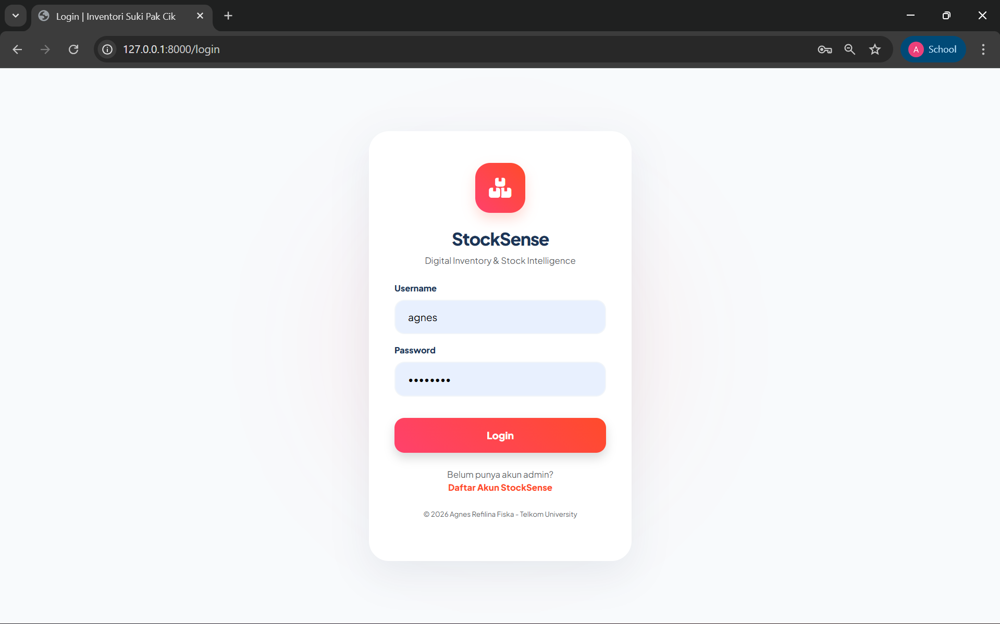
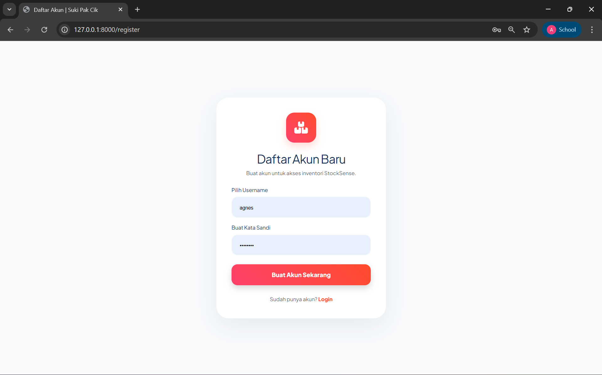
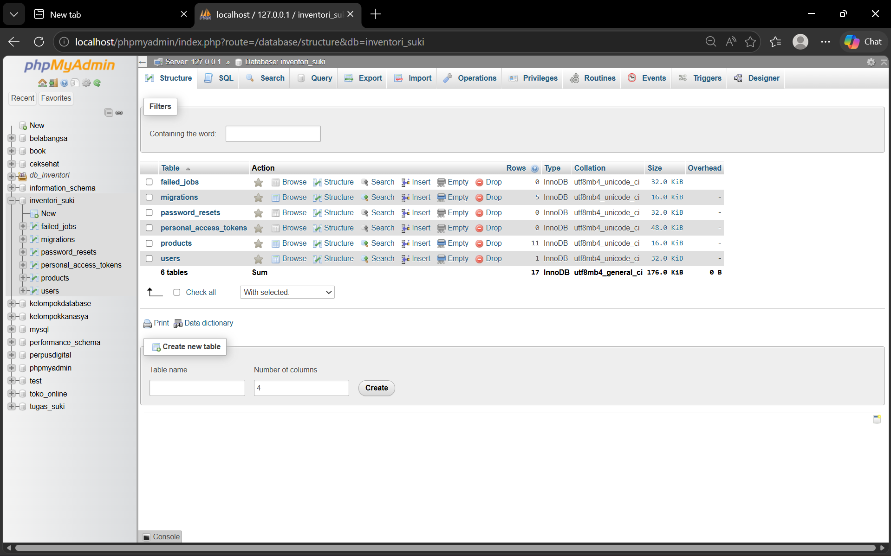
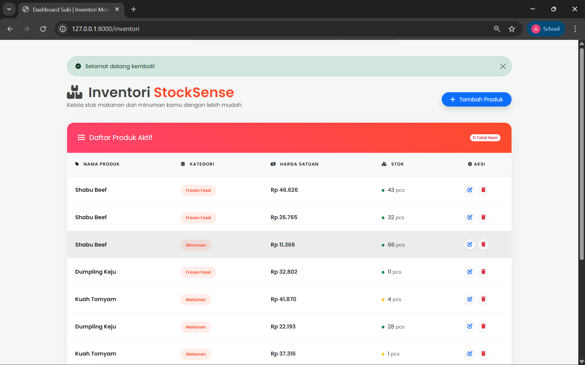
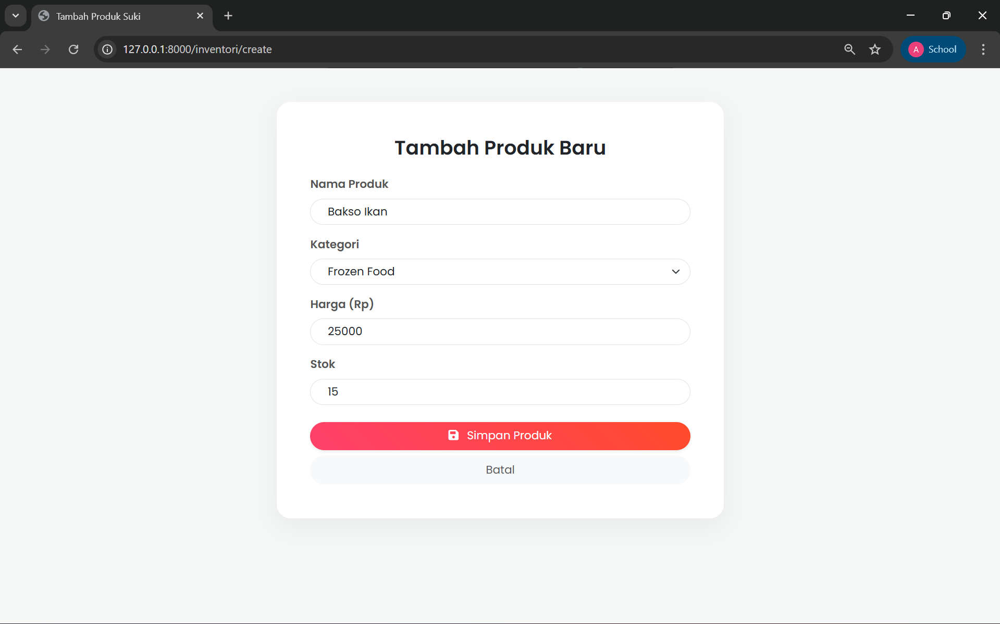
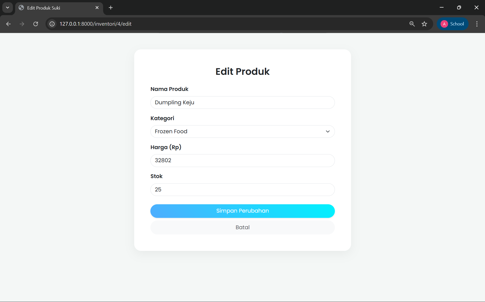
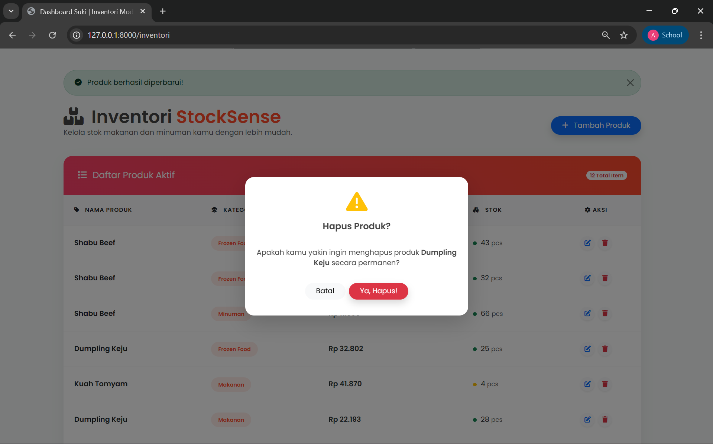
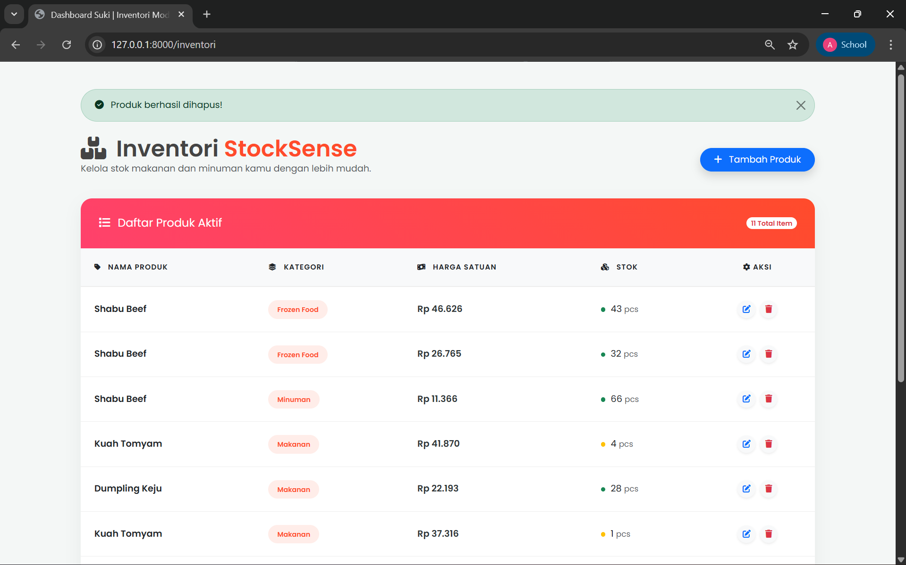

<div align="center">
  <br />
  <h1>LAPORAN PRAKTIKUM <br> APLIKASI BERBASIS PLATFORM</h1>
  <br />
  <h3>MODUL 11,12,13 <br> Laravel : CRUD Inventaris, Seeder, Factory, dan Authentication</h3>
  <br />
  
  <br />
  <br />
  <br />
  <h3>Disusun Oleh :</h3>
  <p>
    <strong>Agnes Refilina Fiska</strong><br>
    <strong>2311102126</strong><br>
    <strong>S1 IF-11-01</strong>
  </p>
  <br />
  <h3>Dosen Pengampu :</h3>
  <p>
    <strong>Dimas Fanny Hebrasianto Permadi, S.ST., M.Kom</strong>
  </p>
  <br />
  <br />
  <h4>Asisten Praktikum :</h4>
  <strong>Apri Pandu Wicaksono</strong> <br>
  <strong>Rangga Pradarrell Fathi</strong>
  <br />
  <br />
  <br />
  <br />
  <h3>LABORATORIUM HIGH PERFORMANCE <br> FAKULTAS INFORMATIKA <br> UNIVERSITAS TELKOM PURWOKERTO <br> 2026</h3>
</div>

---

## A. Dasar Teori

### 1. Laravel
Laravel merupakan framework PHP modern yang dirancang untuk mempercepat pengembangan web melalui sintaks yang ekspresif dan elegan. Laravel mempermudah developer dalam menangani tugas-tugas umum seperti autentikasi, routing, dan pengelolaan database. Dalam proyek ini, Laravel menjadi pondasi utama untuk membangun sistem inventaris yang stabil dan terstruktur.

### 2. Konsep MVC (*Model-View-Controller*)
MVC adalah pola desain perangkat lunak yang memisahkan aplikasi menjadi tiga komponen utama untuk meningkatkan organisasi kode:
- Model: Mengelola logika data dan berkomunikasi langsung dengan database.
- View: Mengatur representasi visual atau antarmuka yang dilihat oleh pengguna.
- Controller: Bertindak sebagai otak yang memproses permintaan pengguna, mengambil data melalui Model, dan mengirimkannya ke View.

### 3. CRUD (*Create, Read, Update, Delete*)
CRUD merupakan standar manipulasi data dalam aplikasi berbasis database. Dalam konteks sistem inventaris ini, CRUD memungkinkan pengguna untuk membuat data barang baru (Create), menampilkan daftar stok (Read), memperbarui informasi produk (Update), serta menghapus data yang sudah tidak relevan (Delete).

### 4. Database dan MySQL
Database adalah media penyimpanan data digital yang terorganisir. Proyek ini menggunakan MySQL, sebuah Relational Database Management System (RDBMS) berbasis SQL yang sangat populer. MySQL digunakan karena keandalannya dalam mengelola relasi antar tabel, seperti menghubungkan data produk dengan data kategori atau pengguna.

### 5. Migration
Migration dapat dianggap sebagai version control untuk database. Fitur ini memungkinkan pengembang untuk mendefinisikan struktur tabel menggunakan kode PHP (bukan SQL manual), sehingga perubahan skema database dapat dilacak, dibagikan ke tim lain, dan dijalankan ulang dengan konsisten.

### 6. Seeder dan Factory
Kedua fitur ini berfungsi untuk menyediakan data awal dalam aplikasi:
- Seeder: Digunakan untuk mengisi tabel database dengan data statis atau data awal yang diperlukan sistem (seperti akun admin).
- Factory: Digunakan untuk menghasilkan data dummy (palsu) dalam skala besar secara otomatis guna keperluan pengujian aplikasi agar terlihat realistis.

### 7. Eloquent ORM
Eloquent adalah fitur unggulan Laravel yang memungkinkan pengembang berinteraksi dengan database menggunakan sintaks berorientasi objek. Dengan Eloquent, setiap tabel di database direpresentasikan oleh sebuah Model, sehingga kita bisa mengambil atau menyimpan data tanpa perlu menulis query SQL yang kompleks secara manual.

### 8. Authentication dan Session
- Authentication: Sistem keamanan untuk memastikan bahwa hanya pengguna sah yang dapat mengakses fitur manajemen stok.
- Session: Mekanisme untuk menyimpan status pengguna (seperti status login) secara sementara di server. Hal ini memungkinkan pengguna tetap dalam keadaan logged-in saat berpindah-pindah halaman tanpa harus memasukkan password berulang kali.

### 9. DataTables
DataTables adalah library JavaScript yang mengubah tabel HTML standar menjadi tabel yang cerdas dan interaktif. Fitur ini memberikan kemampuan instan seperti pencarian cepat (live search), pengurutan data otomatis (sorting), dan pembagian halaman (pagination) untuk memudahkan navigasi data produk yang berjumlah banyak.

### 10. Bootstrap
Bootstrap adalah framework CSS paling populer yang menyediakan komponen desain siap pakai. Penggunaan Bootstrap memastikan tampilan aplikasi StockSense bersifat responsif (tetap rapi saat dibuka di HP maupun Laptop) serta memiliki estetika yang modern pada elemen tombol, form, dan tata letak.

### 11. Inventaris Barang
Sistem inventaris adalah solusi digital untuk memantau siklus hidup barang di sebuah unit usaha. Sistem ini meminimalkan risiko kesalahan manusia (human error) dalam pencatatan stok, mempercepat proses audit barang, dan memberikan informasi yang akurat mengenai ketersediaan produk secara real-time.

---

## B. Penjelasan Kode

### 1. Sourcecode routes/web.php
```php
<?php

use Illuminate\Support\Facades\Route;
use App\Http\Controllers\ProductController;

/*
|--------------------------------------------------------------------------
| Web Routes
|--------------------------------------------------------------------------
*/

// 1. Halaman Utama: Langsung ke login
Route::get('/', function () {
    return redirect('/login');
});

// 2. Rute Registrasi (Di luar middleware agar bisa daftar)
Route::get('/register', function () { 
    return view('register'); 
});
Route::post('/register', [ProductController::class, 'register']);

// 3. Rute Login & Logout
Route::get('/login', function () { 
    return view('login'); 
})->name('login');

Route::post('/login', [ProductController::class, 'login']);
Route::post('/logout', [ProductController::class, 'logout']);

// 4. Rute Inventori (Hanya bisa diakses jika sudah Login)
Route::middleware(['auth.custom'])->group(function () {
    
    // Menampilkan Tabel
    Route::get('/inventori', [ProductController::class, 'index']);
    
    // Tambah Data
    Route::get('/inventori/create', [ProductController::class, 'create']);
    Route::post('/inventori/store', [ProductController::class, 'store']);
    
    // Edit Data
    Route::get('/inventori/{id}/edit', [ProductController::class, 'edit']);
    Route::put('/inventori/{id}', [ProductController::class, 'update']);
    
    // Hapus Data
    Route::delete('/inventori/{id}', [ProductController::class, 'destroy']);

    // --- Rute Profil SUDAH DIHAPUS dari sini ---
});
```

### Penjelasan

File web.php ini berfungsi sebagai pusat kendali navigasi aplikasi yang mengintegrasikan sistem autentikasi dengan fitur manajemen inventaris secara terstruktur. Kode ini dimulai dengan mengarahkan halaman utama langsung ke rute login, sementara rute registrasi dan login dibiarkan terbuka di luar sistem keamanan agar pengguna baru dapat mendaftarkan akun serta masuk ke dalam sistem. Inti dari keamanan aplikasi ini terletak pada penggunaan middleware auth.custom yang membungkus seluruh rute inventori, sehingga operasional CRUD (Create, Read, Update, Delete) seperti menampilkan daftar produk, menambah barang, memperbarui data, hingga menghapus stok hanya dapat diakses oleh pengguna yang sudah terverifikasi. Melalui pengelompokan rute ini, aplikasi menjamin bahwa data sensitif dalam inventaris tetap terlindungi dari akses ilegal, sekaligus memastikan alur kerja aplikasi berjalan sesuai dengan logika bisnis yang telah ditentukan.

### 2. Sourcecode ProductController.php
```php
<?php

namespace App\Http\Controllers;

use App\Models\Product;
use App\Models\User;
use Illuminate\Http\Request;
use Illuminate\Support\Facades\Hash;
use Illuminate\Support\Facades\Session;

class ProductController extends Controller
{
    // 1. Menampilkan daftar tabel inventori
    public function index() {
        $products = Product::all();
        return view('products.index', compact('products'));
    }

    public function create() { return view('products.create'); }

    public function store(Request $request) {
        $request->validate([
            'nama_produk' => 'required',
            'kategori' => 'required',
            'harga' => 'required|numeric',
            'stok' => 'required|numeric',
        ]);
        Product::create($request->all());
        return redirect('/inventori')->with('success', 'Produk berhasil ditambahkan!');
    }

    public function edit($id) {
        $product = Product::findOrFail($id);
        return view('products.edit', compact('product'));
    }

    public function update(Request $request, $id) {
        $product = Product::findOrFail($id);
        $product->update($request->all());
        return redirect('/inventori')->with('success', 'Produk berhasil diperbarui!');
    }

    public function destroy($id) {
        Product::findOrFail($id)->delete();
        return redirect('/inventori')->with('success', 'Produk berhasil dihapus!');
    }

    // --- BAGIAN REGISTRASI (Fokus Username & Password) ---
    public function register(Request $request) {
        $request->validate([
            'username' => 'required|unique:users',
            'password' => 'required|min:5',
        ]);

        User::create([
            'username' => $request->username,
            'password' => Hash::make($request->password),
        ]);

        return redirect('/login')->with('success', 'Registrasi berhasil! Silakan login.');
    }

    // --- BAGIAN LOGIN (Penyelaras dengan Middleware auth.custom) ---
    public function login(Request $request) {
        $user = User::where('username', $request->username)->first();

        if ($user && Hash::check($request->password, $user->password)) {
            // SANGAT PENTING:
            // Pastikan 'user' disimpan ke session karena middleware auth.custom 
            // biasanya mengecek Session::has('user')
            Session::put('user', $user->username);
            Session::put('user_id', $user->id);
            
            return redirect('/inventori')->with('success', 'Selamat datang!');
        }

        return back()->with('error', 'Username atau password salah!');
    }

    // --- BAGIAN LOGOUT ---
    public function logout() {
        Session::flush(); // Menghapus semua session agar benar-benar keluar
        return redirect('/login');
    }
}
```

### Penjelasan

`ProductController` ini bertindak sebagai pusat logika aplikasi yang mengelola dua aspek utama, yaitu operasional inventaris barang dan sistem autentikasi pengguna. Pada bagian inventaris, kontroler ini menangani siklus hidup data produk secara lengkap melalui fungsi CRUD, mulai dari menampilkan seluruh daftar barang dari database ke halaman indeks, memvalidasi input data baru, hingga memproses pembaruan dan penghapusan data berdasarkan ID spesifik menggunakan Eloquent ORM. Setiap tindakan manipulasi data disertai dengan sistem keamanan validasi untuk memastikan bahwa informasi yang masuk, seperti harga dan stok, memiliki format yang benar, serta memberikan umpan balik kepada pengguna berupa pesan sukses melalui fitur session flash.

Sementara itu, pada bagian autentikasi, kontroler ini mengatur proses pendaftaran pengguna baru dengan enkripsi kata sandi menggunakan `Hash::make` demi menjaga keamanan data di database. Fungsi login pada kode ini memiliki peran krusial dalam menyelaraskan data pengguna dengan middleware keamanan, di mana sistem akan memverifikasi kredensial pengguna dan menyimpan informasi identitas seperti `username` dan `user_id` ke dalam session jika verifikasi berhasil. Terakhir, terdapat fungsi logout yang menggunakan perintah `Session::flush()` untuk menghapus seluruh data sesi secara permanen, sehingga memastikan pengguna benar-benar keluar dari sistem dan melindungi akses masuk kembali tanpa otorisasi yang sah. 

### 3. Sourcecode Product.php
```php
<?php

namespace App\Models;

use Illuminate\Database\Eloquent\Factories\HasFactory;
use Illuminate\Database\Eloquent\Model;

class Product extends Model
{
    use HasFactory;

    // Ini sangat penting agar data dari form atau seeder bisa masuk
    protected $fillable = ['nama_produk', 'kategori', 'harga', 'stok'];
}
```

### Penjelasan

File Product.php ini merupakan sebuah Model Eloquent yang merepresentasikan tabel produk di dalam database serta berfungsi sebagai jembatan komunikasi antara aplikasi Laravel dengan data inventaris. Dengan mewarisi class `Model` dari Eloquent, file ini memungkinkan pengembang untuk melakukan manipulasi data database menggunakan sintaks berorientasi objek tanpa perlu menulis query SQL manual. Bagian yang paling krusial dalam kode ini adalah properti `$fillable`, yang berfungsi sebagai pengaman mass assignment dengan menentukan secara eksplisit kolom mana saja—yaitu `nama_produk`, `kategori`, `harga`, dan `stok`—yang diizinkan untuk diisi secara massal melalui form input maupun seeder. Selain itu, penggunaan trait `HasFactory` menunjukkan bahwa model ini terintegrasi dengan fitur Factory Laravel, memudahkan pembuatan data dummy atau data tiruan dalam jumlah banyak guna keperluan pengujian aplikasi secara otomatis dan efisien.

### 4. Sourcecode Migration (create_products_table.php)
```php
<?php

use Illuminate\Database\Migrations\Migration;
use Illuminate\Database\Schema\Blueprint;
use Illuminate\Support\Facades\Schema;

return new class extends Migration
{
    public function up()
    {
        Schema::create('users', function (Blueprint $table) {
            $table->id();
            $table->string('username')->unique(); // Ini untuk login nanti
            $table->string('password');
            $table->timestamps();
        });
    }

    public function down()
    {
        Schema::dropIfExists('users');
    }
};
```
### Penjelasan 

File `Migration` untuk tabel users ini berfungsi sebagai skema cetak biru (blueprint) yang mendefinisikan struktur penyimpanan data pengguna di dalam database MySQL melalui kode PHP. Di dalam metode `up()`, sistem diperintahkan untuk membuat tabel bernama `users` dengan beberapa kolom spesifik, yaitu kolom `id` sebagai kunci utama (primary key), kolom username yang bersifat unik untuk mencegah pendaftaran nama pengguna yang sama, serta kolom `password` untuk menyimpan kredensial akun. Selain itu, terdapat fungsi `timestamps()` yang secara otomatis menyediakan kolom `created_at` dan `updated_at` guna mencatat waktu setiap kali data dibuat atau diubah. Di sisi lain, metode `down()` berperan sebagai fungsi pembatalan (rollback) yang akan menghapus tabel tersebut jika perintah migrasi dibatalkan, sehingga memudahkan pengembang dalam mengelola perubahan struktur database secara konsisten dan terukur tanpa perlu menulis perintah SQL manual.

### 5. Sourcecode AuthCustom.php
```php
<?php

namespace App\Http\Middleware;

use Closure;
use Illuminate\Http\Request;

class CustomAuth
{
    /**
     * Handle an incoming request.
     *
     * @param  \Illuminate\Http\Request  $request
     * @param  \Closure(\Illuminate\Http\Request): (\Illuminate\Http\Response|\Illuminate\Http\RedirectResponse)  $next
     * @return \Illuminate\Http\Response|\Illuminate\Http\RedirectResponse
     */
    public function handle($request, $next) {
    if (!$request->session()->has('user')) {
        return redirect('/login')->with('error', 'Silakan login dulu ya!');
    }
    return $next($request);
}
}
```

### Penjelasan 

File `CustomAuth.php` ini merupakan sebuah middleware kustom yang berfungsi sebagai lapisan keamanan atau "satpam" digital untuk memproteksi rute-rute sensitif di dalam aplikasi. Cara kerjanya adalah dengan mencegat setiap permintaan (request) yang masuk sebelum mencapai kontroler, lalu memeriksa keberadaan data identitas pengguna di dalam session. Jika sistem mendeteksi bahwa pengguna belum melakukan login (data `user` tidak ditemukan dalam session), maka middleware ini akan secara otomatis menolak akses dan mengarahkan pengguna kembali ke halaman login disertai dengan pesan peringatan. Sebaliknya, jika data sesi terdeteksi valid, permintaan tersebut akan diteruskan ke tahap berikutnya menggunakan fungsi `$next($request)`, sehingga memastikan bahwa fitur-fitur seperti manajemen inventaris hanya dapat dioperasikan oleh pengguna yang telah terautentikasi secara sah.

### 6. Sourcecode index.blade.php
```php
<!DOCTYPE html>
<html lang="id">
<head>
    <meta charset="UTF-8">
    <meta name="viewport" content="width=device-width, initial-scale=1.0">
    <title>Dashboard | StockSense</title>
    <link href="https://fonts.googleapis.com/css2?family=Poppins:wght@300;400;600&display=swap" rel="stylesheet">
    <link href="https://cdn.jsdelivr.net/npm/bootstrap@5.3.0/dist/css/bootstrap.min.css" rel="stylesheet">
    <link rel="stylesheet" href="https://cdnjs.cloudflare.com/ajax/libs/font-awesome/6.4.0/css/all.min.css">
    
    <style>
        body {
            font-family: 'Poppins', sans-serif;
            background: #f4f7f6;
            color: #444;
        }
        .main-card {
            border: none;
            border-radius: 20px;
            box-shadow: 0 10px 30px rgba(0,0,0,0.05);
            overflow: hidden;
        }
        .card-header-custom {
            background: linear-gradient(45deg, #ff416c, #ff4b2b);
            color: white;
            padding: 2rem;
            border: none;
        }
        .table { margin-bottom: 0; }
        .table thead th {
            background-color: #f8f9fa;
            border-bottom: 2px solid #eee;
            text-transform: uppercase;
            font-size: 0.8rem;
            letter-spacing: 1px;
            padding: 1.5rem;
        }
        .table tbody td {
            padding: 1.5rem;
            vertical-align: middle;
            border-bottom: 1px solid #eee;
        }
        .badge-kategori {
            background: rgba(255, 75, 43, 0.1);
            color: #ff4b2b;
            padding: 0.5rem 1rem;
            border-radius: 50px;
            font-weight: 600;
            font-size: 0.75rem;
        }
        .price-tag { font-weight: 600; color: #2d3436; }
        .stock-indicator {
            width: 8px; height: 8px;
            border-radius: 50%;
            display: inline-block;
            margin-right: 5px;
        }
        /* Style Profil Dropdown */
        .profile-btn {
            background: white;
            border: none;
            padding: 5px 15px 5px 5px;
            border-radius: 50px;
            transition: 0.3s;
        }
        .profile-btn:hover {
            background: #fdfdfd;
            box-shadow: 0 4px 12px rgba(0,0,0,0.1);
        }
        .modal-content { border-radius: 20px; border: none; }
        .modal-header { border-bottom: none; padding-top: 2rem; }
        .modal-footer { border-top: none; padding-bottom: 2rem; }
    </style>
</head>
<body>

<div class="container py-5">
    
    @if(session('success'))
    <div class="alert alert-success alert-dismissible fade show rounded-pill px-4 mb-4" role="alert">
        <i class="fas fa-check-circle me-2"></i> {{ session('success') }}
        <button type="button" class="btn-close" data-bs-dismiss="alert" aria-label="Close"></button>
    </div>
    @endif

    <div class="row mb-4 align-items-center">
        <div class="col">
            <h1 class="fw-bold mb-0">
                <i class="fas fa-boxes-stacked me-2"></i> Inventori <span style="color: #ff4b2b;">StockSense</span>
            </h1>
            <p class="text-muted mb-0">Kelola stok makanan dan minuman kamu dengan lebih mudah.</p>
        </div>

        <div class="col-auto d-flex align-items-center">
            <div class="dropdown me-3">
                <button class="profile-btn shadow-sm d-flex align-items-center" type="button" data-bs-toggle="dropdown">
                    
                    <div class="text-start d-none d-md-block">
                        <small class="text-muted d-block" style="font-size: 0.65rem; line-height: 1;">Administrator</small>
                        <span class="fw-bold small">Agnes Refilina</span>
                    </div>
                </button>
                <ul class="dropdown-menu dropdown-menu-end border-0 shadow-lg mt-2" style="border-radius: 15px;">
                    <li class="px-3 py-2">
                        <h6 class="mb-0 fw-bold small">Agnes Refilina Fiska</h6>
                        <small class="text-muted">Informatika - Telkom Univ</small>
                    </li>
                    <li><hr class="dropdown-divider"></li>
                    <li>
                        <a class="dropdown-item rounded-3 fw-bold small" href="/profile">
                            <i class="fas fa-user-circle me-2 text-primary"></i> Lihat Profil Saya
                        </a>
                    </li>
                    <li>
                        <form action="/logout" method="POST">
                            @csrf
                            <button type="submit" class="dropdown-item rounded-3 fw-bold small text-danger">
                                <i class="fas fa-sign-out-alt me-2"></i> Keluar
                            </button>
                        </form>
                    </li>
                </ul>
            </div>

            <a href="/inventori/create" class="btn btn-primary rounded-pill px-4 shadow py-2">
                <i class="fas fa-plus me-2"></i> Tambah Produk
            </a>
        </div>
    </div>

    <div class="card main-card">
        <div class="card-header-custom d-flex justify-content-between align-items-center">
            <h5 class="mb-0"><i class="fas fa-list me-2"></i> Daftar Produk Aktif</h5>
            <span class="badge bg-white text-danger rounded-pill">{{ count($products) }} Total Item</span>
        </div>
        <div class="table-responsive">
            <table class="table table-hover">
                <thead>
                    <tr>
                        <th><i class="fas fa-tag me-2"></i> Nama Produk</th>
                        <th><i class="fas fa-layer-group me-2"></i> Kategori</th>
                        <th><i class="fas fa-money-bill-wave me-2"></i> Harga Satuan</th>
                        <th><i class="fas fa-cubes me-2"></i> Stok</th>
                        <th class="text-center"><i class="fas fa-cog"></i> Aksi</th>
                    </tr>
                </thead>
                <tbody>
                    @foreach($products as $p)
                    <tr>
                        <td class="fw-bold">{{ $p->nama_produk }}</td>
                        <td><span class="badge-kategori">{{ $p->kategori }}</span></td>
                        <td><span class="price-tag">Rp {{ number_format($p->harga, 0, ',', '.') }}</span></td>
                        <td>
                            <span class="stock-indicator {{ $p->stok > 10 ? 'bg-success' : 'bg-warning' }}"></span>
                            {{ $p->stok }} <small class="text-muted">pcs</small>
                        </td>
                        <td class="text-center">
                            <a href="/inventori/{{ $p->id }}/edit" class="btn btn-light btn-sm rounded-circle shadow-sm me-1">
                                <i class="fas fa-edit text-primary"></i>
                            </a>

                            <button type="button" class="btn btn-light btn-sm rounded-circle shadow-sm" onclick="confirmDelete({{ $p->id }}, '{{ $p->nama_produk }}')">
                                <i class="fas fa-trash text-danger"></i>
                            </button>
                        </td>
                    </tr>
                    @endforeach
                </tbody>
            </table>
        </div>
    </div>
    
    <p class="text-center mt-4 text-muted small">© 2026 StockSense Portfolio - Agnes Refilina Fiska</p>
</div>

<div class="modal fade" id="deleteModal" tabindex="-1" aria-hidden="true">
    <div class="modal-dialog modal-dialog-centered">
        <div class="modal-content shadow-lg">
            <div class="modal-header justify-content-center">
                <div class="text-center">
                    <i class="fas fa-exclamation-triangle text-warning fa-3x mb-3"></i>
                    <h5 class="modal-title fw-bold" id="exampleModalLabel">Hapus Produk?</h5>
                </div>
            </div>
            <div class="modal-body text-center">
                Apakah kamu yakin ingin menghapus produk <span id="productName" class="fw-bold"></span> secara permanen?
            </div>
            <div class="modal-footer justify-content-center">
                <button type="button" class="btn btn-light rounded-pill px-4" data-bs-dismiss="modal">Batal</button>
                <form id="deleteForm" method="POST" class="d-inline">
                    @csrf
                    @method('DELETE')
                    <button type="submit" class="btn btn-danger rounded-pill px-4 shadow">Ya, Hapus!</button>
                </form>
            </div>
        </div>
    </div>
</div>

<script src="https://cdn.jsdelivr.net/npm/bootstrap@5.3.0/dist/js/bootstrap.bundle.min.js"></script>

<script>
    function confirmDelete(id, name) {
        document.getElementById('productName').innerText = name;
        document.getElementById('deleteForm').action = '/inventori/' + id;
        var myModal = new bootstrap.Modal(document.getElementById('deleteModal'));
        myModal.show();
    }
</script>

</body>
</html>
```

### Penjelasan

File `index.blade.php` ini merupakan komponen antarmuka utama (View) yang berfungsi sebagai dasbor manajemen inventaris dengan desain modern dan responsif. Menggunakan integrasi Framework Bootstrap dan Google Fonts, halaman ini menyajikan data produk dalam bentuk tabel interaktif yang dilengkapi dengan berbagai indikator visual, seperti status stok berbasis warna dan format mata uang yang rapi. Secara fungsional, file ini memanfaatkan logika Blade Templating untuk melakukan iterasi data produk dari database serta menyediakan fitur interaksi pengguna seperti tombol tambah data, edit, dan hapus. Keamanan operasional juga diperhatikan melalui penggunaan modal konfirmasi berbasis JavaScript untuk mencegah penghapusan data secara tidak sengaja, serta sistem flash message untuk memberikan umpan balik instan setiap kali pengguna berhasil melakukan perubahan data pada sistem StockSense.

---

## C. Penjelasan Implementasi Sistem

Pada praktikum ini, implementasi sistem dilakukan dengan mengintegrasikan kerangka kerja Laravel sebagai fondasi utama untuk membangun aplikasi inventaris berbasis web yang terstruktur. Proses implementasi dimulai dengan menerapkan arsitektur MVC (Model-View-Controller), di mana logika program dipisahkan secara sistematis antara pengolahan data, pengaturan alur aplikasi, dan tampilan antarmuka pengguna. Hal ini bertujuan agar kode program lebih mudah dikelola dan dikembangkan secara modular.

Pada praktikum ini, pengelolaan basis data diimplementasikan menggunakan database MySQL yang dihubungkan melalui fitur Migration dan Eloquent ORM pada Laravel. Dengan metode ini, struktur tabel database dapat dikelola langsung melalui kode PHP, sehingga integritas data tetap terjaga selama proses operasi CRUD (Create, Read, Update, Delete) berlangsung. Implementasi ini memungkinkan admin untuk mengelola data produk, kategori, dan stok secara real-time dengan tingkat akurasi yang tinggi.

Pada praktikum ini, sistem keamanan dan autentikasi menjadi bagian krusial yang diimplementasikan untuk melindungi data inventaris. Pengamanan dilakukan dengan memanfaatkan Middleware kustom yang bertugas memvalidasi Session pengguna; akses ke halaman manajemen stok hanya diberikan jika pengguna telah berhasil melakukan proses login. Selain itu, enkripsi kata sandi menggunakan algoritma hashing juga diterapkan untuk menjamin bahwa kredensial pengguna tersimpan dengan aman di dalam database.

Pada praktikum ini, antarmuka pengguna diimplementasikan menggunakan Bootstrap guna menciptakan tampilan yang responsif dan user-friendly. Penggunaan elemen visual seperti tabel interaktif, modal konfirmasi, dan pesan notifikasi (flash messages) dirancang sedemikian rupa untuk memudahkan interaksi pengguna dalam memantau sirkulasi barang. Keseluruhan implementasi ini bertujuan untuk menghasilkan sistem inventaris yang tidak hanya fungsional secara teknis, tetapi juga efisien dalam membantu operasional pengelolaan stok barang secara digital.

---

## D. Hasil Tampilan 

### Halaman Login


Halaman ini merupakan pintu masuk utama ke sistem StockSense. Antarmuka dirancang menggunakan konsep card terpusat dengan bidang input yang jelas untuk username dan password. Terdapat juga tautan navigasi ke halaman registrasi bagi pengguna baru serta identitas pengembang di bagian kaki halaman.

---

### Halaman Registrasi


Halaman ini berfungsi untuk mendaftarkan akun administrator baru ke dalam database. Sistem meminta input username dan kata sandi yang nantinya akan diolah oleh kontroler menggunakan enkripsi hash sebelum disimpan ke tabel `users`.

---

### Halaman Database - phpMyAdmin


Gambar ini menunjukkan implementasi fisik database `inventori_suki` pada MySQL. Terlihat tabel-tabel utama hasil dari proses migration Laravel, seperti tabel `users` untuk data autentikasi dan tabel `products` untuk menyimpan data inventaris barang.
---

### Halaman Dashboard Utama Daftar Produk


Setelah berhasil login, pengguna diarahkan ke dasbor utama. Halaman ini menyajikan tabel dinamis yang menampilkan seluruh stok barang. Terdapat indikator stok (warna hijau/kuning), kategori yang dibedakan dengan badge berwarna, serta format mata uang Rupiah yang rapi. Di pojok kanan atas terdapat tombol "Tambah Produk".

---

### Halaman Tambah Produk Baru


Halaman ini berisi formulir untuk memasukkan data barang baru ke dalam sistem. Terdapat validasi input untuk memastikan Nama Produk, Kategori (via dropdown), Harga, dan Jumlah Stok terisi dengan benar sebelum diproses oleh fungsi `store` di kontroler.

---

### Halaman Notifikasi Berhasil Tambah Data


Gambar ini menunjukkan sistem flash message yang muncul di bagian atas dasbor setelah data baru (misal: Bakso Ikan) berhasil disimpan. Notifikasi ini memberikan konfirmasi visual kepada pengguna bahwa operasi tambah data telah sukses.

---

### Halaman Edit Produ


Halaman ini digunakan untuk memperbarui informasi barang yang sudah ada. Form secara otomatis akan terisi (autofill) dengan data lama berdasarkan ID produk yang dipilih, sehingga pengguna hanya perlu mengubah bagian yang diperlukan.

---

### Modal Konfirmasi Hapus


Demi keamanan data, sistem menerapkan fitur konfirmasi sebelum menghapus barang. Muncul jendela pop-up (Modal) yang menanyakan kepastian pengguna. Hal ini mencegah terjadinya kehilangan data akibat klik yang tidak sengaja.

---

### Notifikasi Berhasil Hapus Data


Setelah pengguna menekan tombol "Ya, Hapus!", sistem akan menjalankan fungsi `destroy` dan menampilkan kembali dasbor dengan pesan sukses berwarna hijau yang menyatakan bahwa produk telah berhasil dihapus dari database.

---

## E. Kesimpulan

Pada praktikum ini, dapat disimpulkan bahwa pengembangan aplikasi inventaris StockSense telah berhasil memenuhi tujuan utama dalam mendigitalisasi pengelolaan stok barang. Penggunaan Framework Laravel terbukti sangat efektif dalam mempercepat proses pengembangan melalui fitur-fitur unggulannya seperti Routing, Eloquent ORM, dan Middleware.

Beberapa poin penting yang dihasilkan dari praktikum ini antara lain:

- Penerapan Arsitektur MVC: Pemisahan logika program menggunakan pola Model-View-Controller membuat kode aplikasi menjadi lebih terstruktur, rapi, dan memudahkan dalam proses pencarian kesalahan (debugging) maupun pengembangan fitur di masa mendatang.

- Efisiensi Pengelolaan Data: Operasi CRUD yang diintegrasikan dengan database MySQL melalui model Eloquent memungkinkan manajemen data produk dilakukan secara cepat dan akurat, sehingga meminimalisir risiko kesalahan pencatatan manual.

- Keamanan Sistem Terjamin: Implementasi sistem autentikasi berbasis Session dan perlindungan Middleware kustom berhasil membatasi hak akses pengguna, memastikan bahwa data inventaris yang bersifat sensitif hanya dapat dikelola oleh admin yang sah.

- Pengalaman Pengguna yang Optimal: Penggunaan Bootstrap dan elemen antarmuka yang modern memberikan kenyamanan visual serta kemudahan navigasi bagi pengguna dalam mengoperasikan sistem pada berbagai perangkat (responsif).

Secara keseluruhan, sistem ini telah siap digunakan sebagai alat bantu digital yang andal untuk mengelola sirkulasi barang secara sistematis, aman, dan efisien.

---

## Referensi

[1] Modul Praktikum Aplikasi Berbasis Platform (ABP) Modul 11  
[2] Modul Praktikum Aplikasi Berbasis Platform (ABP) Modul 12  
[3] Modul Praktikum Aplikasi Berbasis Platform (ABP) Modul 13  
[4] Laravel Documentation. https://laravel.com/docs  
[5] W3Schools. https://www.w3schools.com  