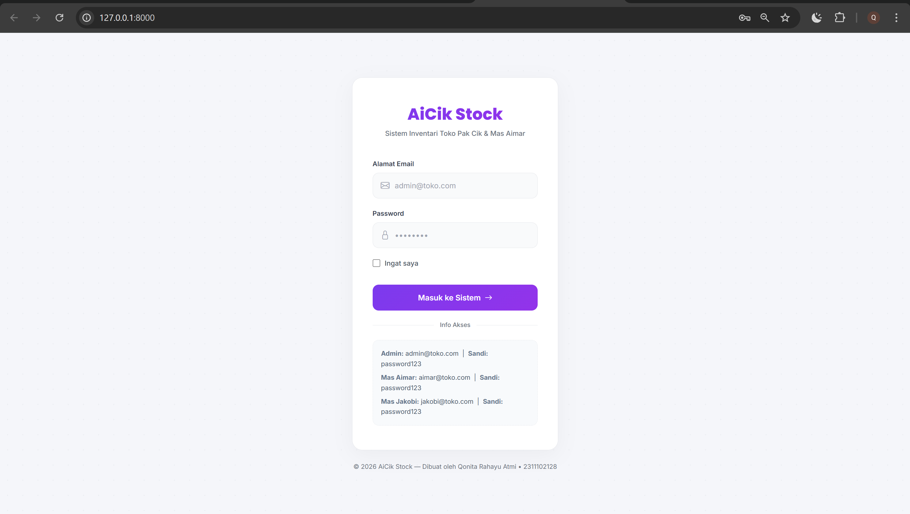
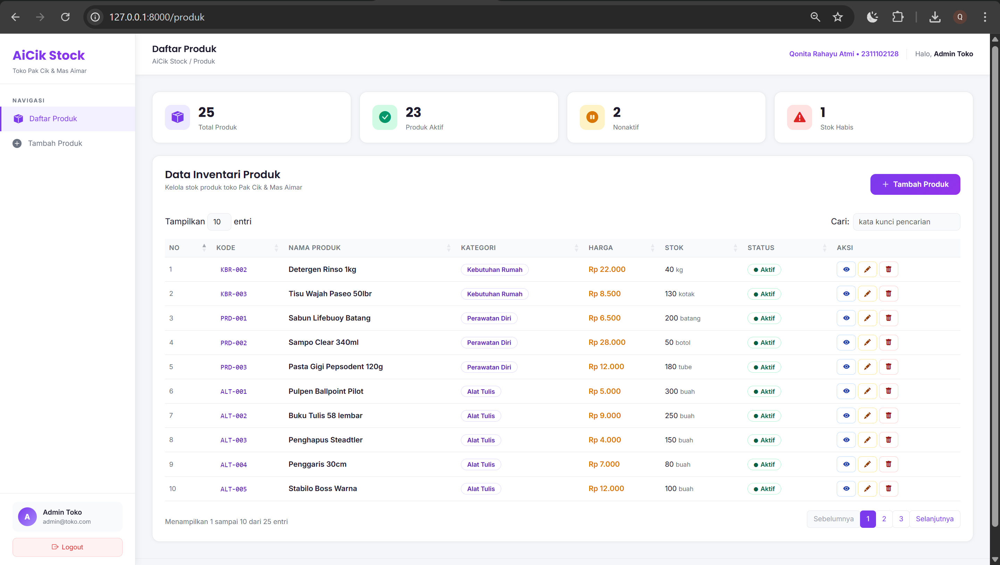
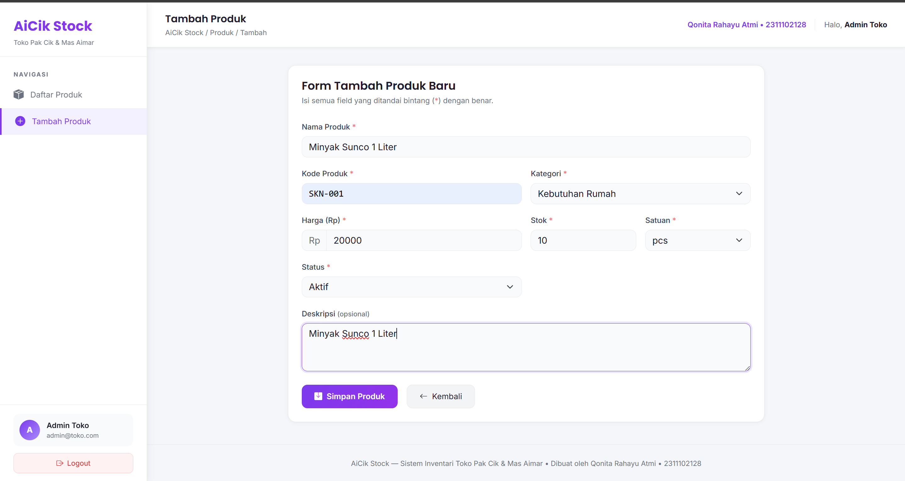
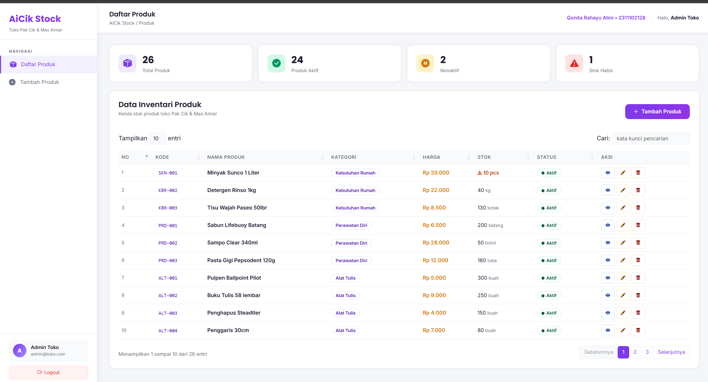
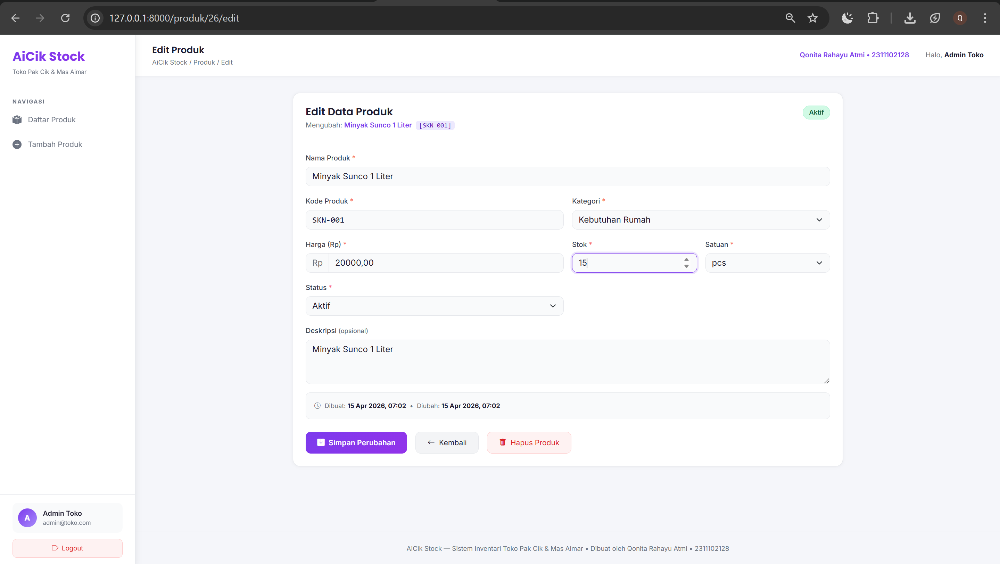
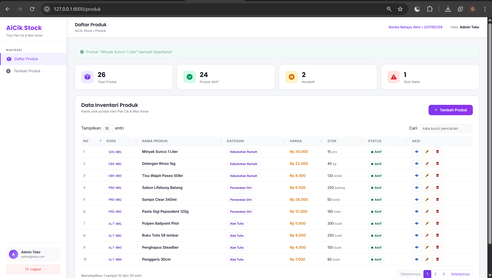
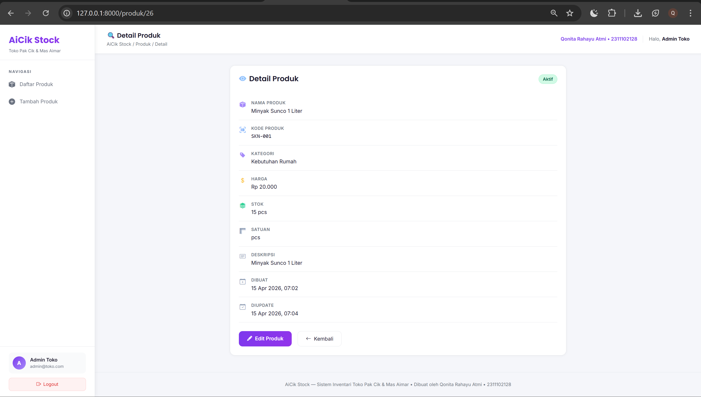
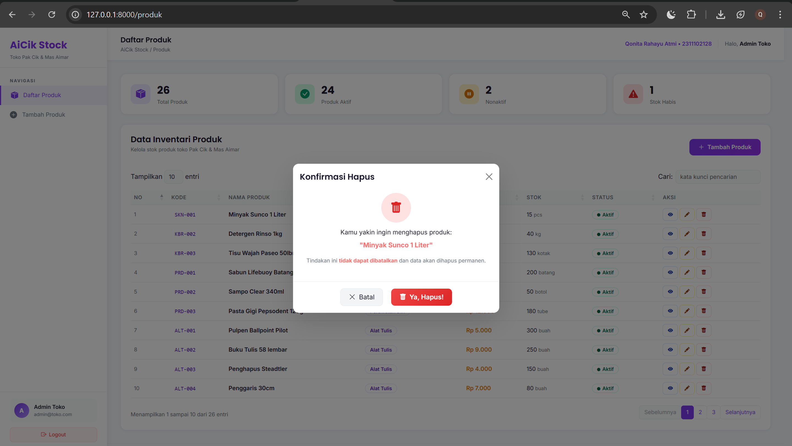
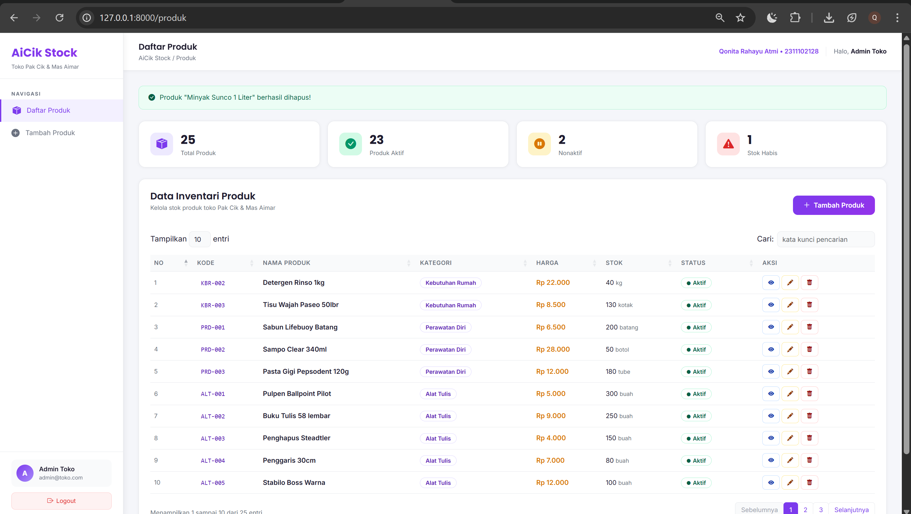
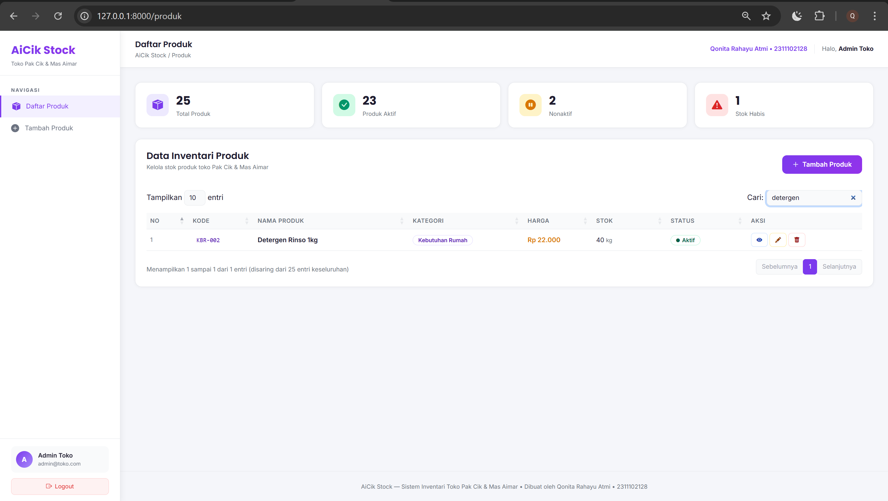

<div align="center">
  <br />
  <h1>LAPORAN PRAKTIKUM <br>APLIKASI BERBASIS PLATFORM</h1>
  <br />
  <h3>MODUL 11, 12 & 13 <br> Laravel: Migration, Seeder, CRUD & Authentication</h3>
  <br />
  <br />
  
  <br />
  <br />
  <br />
  <h3>Disusun Oleh :</h3>
  <p>
    <strong>Qonita Rahayu Atmi</strong><br>
    <strong>2311102128</strong><br>
    <strong>S1 IF-11-REG01</strong><br>
  </p>
  <br />
  <h3>Dosen Pengampu :</h3>
  <p>
    <strong>Dimas Fanny Hebrasianto Permadi, S.ST., M.Kom</strong>
  </p>
  <br />
  <h3>Asisten Praktikum :</h3>
  <p>
    <strong>Apri Pandu Wicaksono</strong><br>
    <strong>Rangga Pradarrell Fathi</strong><br>
  </p>
  <br />
  <h3>LABORATORIUM HIGH PERFORMANCE<br>FAKULTAS INFORMATIKA <br>TELKOM UNIVERSITY PURWOKERTO <br>2026</h3>
</div>

---

# A. Soal

Buat *project* web menggunakan Laravel untuk membuat web inventari toko milik Pak Cik dan Mas Aimar. Spesifikasi tugas adalah sebagai berikut:
1. Terdapat fitur CRUD (Create, Read, Update, Delete) untuk mengelola produk.
2. Tampilan data produk harus menggunakan format *DataTable*.
3. Tersedia *form create* untuk menambah produk dan *form edit* untuk mengubah data produk.
4. Terdapat konfirmasi berupa *modal* ketika melakukan *delete* (hapus) produk.
5. Data harus disimpan ke dalam *database*.
6. Menggunakan *database factory* dan *seeder* agar tabel di dalam *database* tidak kosong secara *default*.
7. Menggunakan sistem otentikasi *login* berbasis sesi (*session*).

---

# B. Hasil dan Pembahasan Soal
Bagian ini akan merincikan bagaimana masing-masing spesifikasi sistem dari instruksi soal telah sukses diimplementasikan dalam struktur proyek situs inventari **AiCik Stock** milik Pak Cik dan Mas Aimar.

### 1. Fitur CRUD Produk & Tampilan Form 
Aplikasi memiliki fungsional CRUD (*Create, Read, Update, Delete*) pada Data Produk. Input antarmuka form ditambah dan diubah divalidasi menggunakan instrumen fungsi seperti `store` (Tambah Produk) dan `update` (Ubah Produk) pada berkas logis kontroler `ProdukController.php`.

```php
// app/Http/Controllers/ProdukController.php
public function store(Request $request) {
    // Validasi field wajib sebelum masuk basis data
    $validated = $request->validate([
        'nama'        => 'required|string|max:255',
        'kode'        => 'required|string|max:50|unique:produks,kode',
        'harga'       => 'required|numeric|min:0',
        'kategori_id' => 'required|exists:kategoris,id',
        'stok'        => 'required|integer|min:0',
        'satuan'      => 'required|string|max:50',
        'status'      => 'required|in:aktif,nonaktif',
    ]);
    
    // Pembuatan produk ke database jika seluruh validasi terpenuhi lolos
    Produk::create($validated);
    
    return redirect()->route('produk.index')
           ->with('success', 'Produk sukses ditambahkan!');
}
```
**Penjelasan Rinci:** Fasilitas instrumen form *Create* dan *Edit* tidak hanya ditampilkan melalui *Blade Template*, tetapi juga dilengkapi dengan validasi ketat di sisi *backend*.Setiap data yang dimasukkan akan diperiksa sebelum disimpan. Jika staf mencoba memasukkan kode barang yang sudah ada (duplikat) atau mengisi kolom harga dengan karakter selain angka, maka proses penyimpanan akan langsung dihentikan dan sistem menampilkan pesan kesalahan (Error Validation) di browser. Apabila seluruh data lolos validasi, barulah sistem menjalankan perintah `Produk::create()` untuk menyimpan data ke dalam database secara aman.

### 2. Implementasi Tampilan DataTables Produk

```javascript
// resources/views/produk/index.blade.php
$(document).ready(function () {
    $('#produk-table').DataTable({
        language: { 
            url: 'https://cdn.datatables.net/plug-ins/1.13.8/i18n/id.json' 
        },
        pageLength: 10,
        order: [[0, 'asc']],
        columnDefs: [
            { orderable: false, targets: 7 }
        ],
    });
});
```
**Penjelasan Rinci:** Penggunaan DataTables memberikan kemudahan bagi asisten toko dalam mengelola data. Tersedia fitur untuk mengatur jumlah data yang ditampilkan per halaman. Selain itu, fitur sorting dan pencarian dapat dilakukan secara langsung tanpa perlu memuat ulang halaman, sehingga lebih efisien. Tampilan teks pada bagian atas dan bawah tabel juga telah disesuaikan, menggunakan file translasi resmi (id.json melalui CDN), sehingga lebih mudah dipahami oleh pengguna.

### 3. Konfirmasi Hapus via Modal
Untuk mengurangi risiko kesalahan klik oleh pengguna (*mis-click*), proses penghapusan data (*delete*) pada MySQL dilengkapi dengan konfirmasi terlebih dahulu. Sistem menampilkan *popup* konfirmasi menggunakan *Bootstrap Modal JavaScript*, sehingga data tidak akan terhapus sebelum pengguna memastikan tindakannya.

```html
<!-- Tombol pemantik aksi peluncur Script JavaScript Modals di index.blade.php -->
<button class="btn-del" onclick="confirmDelete({{ $produk->id }}, '{{ addslashes($produk->nama) }}')">
    <i class="bi bi-trash-fill"></i> Hapus
</button>

<script>
function confirmDelete(id, nama) {
    document.getElementById('modal-produk-nama').textContent = '"' + nama + '"';
    document.getElementById('form-hapus').action = '/produk/' + id;
    const modal = new bootstrap.Modal(document.getElementById('modalHapus'));
    modal.show();
}
</script>
```
**Penjelasan Rinci:** Setiap ikon tombol hapus tidak langsung menjalankan proses penghapusan, melainkan memanggil fungsi `confirmDelete()`. Fungsi ini akan mengambil ID data yang dipilih, kemudian memasukkannya ke dalam atribut `<form action>` pada *popup* konfirmasi. Saat *popup* ditampilkan, pengguna diminta meninjau kembali tindakan penghapusan untuk menghindari kehilangan data yang tidak diinginkan. Jika pengguna tetap melanjutkan, maka mekanisme *Method Spoofing* pada Laravel (`@method('DELETE')`) digunakan untuk mengirimkan permintaan hapus secara aman ke *route* yang sesuai.


### 4. Konfigurasi Arsitektur Database Melalui Seeder & Factory
Struktur basis data relasional dibangun berdasarkan perancangan yang terdefinisi melalui *Migration Blueprint*. Untuk menghindari kondisi tabel kosong saat aplikasi pertama kali dijalankan, digunakan *Seeder* yang secara otomatis mengisi data awal sebagai contoh. Dengan demikian, pengguna dapat langsung melihat dan memahami fitur tanpa perlu memasukkan data uji secara manual.

```php
// database/seeders/DatabaseSeeder.php
public function run(): void
{
    User::firstOrCreate(['email' => 'admin@toko.com'], ['name' => 'Admin Toko', 'password' => Hash::make('password123')]);

    // Data Pustaka Nyata Komoditas AiCik Stock
    $fixedProduk = [
        ['nama' => 'Beras Premium 5kg', 'kode' => 'MKN-001', 'harga' => 72000, 'stok' => 45, 'satuan' => 'sak', 'kategori' => 'MKN', 'status' => 'aktif'],
        ['nama' => 'Minyak Goreng Bimoli 2L', 'kode' => 'MKN-002', 'harga' => 38000, 'stok' => 30, 'satuan' => 'pouch', 'kategori' => 'MKN', 'status' => 'aktif'],
    ];

    foreach ($fixedProduk as $p) {
        $kategori = Kategori::where('kode', $p['kategori'])->first();
        unset($p['kategori']); 
        $p['kategori_id'] = $kategori->id; 
        Produk::firstOrCreate(['kode' => $p['kode']], $p);
    }
}
```
**Penjelasan Rinci:** Parameter Kelas DatabaseSeeder digunakan untuk mengisi data awal pada tabel User, Kategori, dan Produk. Proses ini dilakukan dengan menyusun data dalam bentuk array, lalu dijalankan menggunakan perulangan untuk dimasukkan ke database. Relasi antar tabel diatur melalui penggunaan foreign key. Untuk mencegah duplikasi data saat proses dijalankan berulang, digunakan metode firstOrCreate, sehingga data yang sama tidak akan ditambahkan kembali. Dengan adanya seeder, database langsung berisi data contoh yang menyerupai kondisi nyata, sehingga aplikasi dapat diuji tanpa harus memasukkan data secara manual dari awal.

### 5. Sistem Kemanan Autentikasi Menggunakan Parameter ID Session

```php
// app/Http/Controllers/AuthController.php
public function login(Request $request) {
    $request->validate(['email' => 'required|email', 'password' => 'required|min:6']);
    
    // Verifikasi enkripsi Auth 
    if (Auth::attempt($request->only('email', 'password'), $request->boolean('remember'))) {
        $request->session()->regenerate(); 
        return redirect()->intended(route('produk.index'));
    }
    return back()->withErrors(['email' => 'Email atau password salah.']);
}
```
**Penjelasan Rinci:** Perlindungan otentikasi tidak lagi ditangani langsung oleh AuthController, tetapi menggunakan fitur bawaan dari kelas Auth. Saat proses login berhasil dan data yang dimasukkan sesuai dengan hash Bcrypt di database, sistem akan menjalankan $request->session()->regenerate(); untuk memperbarui ID sesi pada browser pengguna.
Langkah ini dilakukan untuk mencegah serangan session fixation. Setelah pengguna berhasil diautentikasi, sistem akan mengarahkan pengguna ke halaman dasbor inventaris yang bersifat terbatas dan hanya dapat diakses oleh pengguna yang telah login.

---

# C. Kode

### 1. Alur (routes/web.php)
Sistem terlebih dahulu membaca file *routing* untuk menentukan halaman yang akan ditampilkan. Pada aplikasi ini, rute awal diarahkan ke sistem autentikasi (`/login`) sebagai pintu masuk validasi. Sementara itu, rute CRUD seperti `/produk` dibatasi aksesnya dengan `middleware('auth')` agar pengguna yang telah terverifikasi dapat mengakses.

```php
<?php

use App\Http\Controllers\AuthController;
use App\Http\Controllers\ProdukController;
use Illuminate\Support\Facades\Route;

// Auth Routes 
Route::get('/',      [AuthController::class, 'showLogin'])->name('login');
Route::get('/login', [AuthController::class, 'showLogin'])->name('login');
Route::post('/login', [AuthController::class, 'login'])->name('login.post');
Route::post('/logout', [AuthController::class, 'logout'])->name('logout');

// Produk Routes (protected by auth middleware) 
Route::middleware('auth')->group(function () {
    Route::resource('produk', ProdukController::class);
});
```

### 2. Autentikasi (AuthController.php)
Saat rute sistem mengarahkan pengguna ke halaman login, `AuthController` akan menangani proses tersebut. Sistem kemudian melakukan validasi terhadap input email dan kata sandi yang dimasukkan oleh admin, lalu mencocokkannya dengan data pada tabel *database*. Jika data dinyatakan valid (menggunakan metode `Auth::attempt()`), sistem akan meregenerasi sesi login agar lebih aman. Setelah itu, pengguna diarahkan ke halaman dashboard produk melalui mekanisme `Redirect`.

```php
<?php

namespace App\Http\Controllers;

use Illuminate\Http\Request;
use Illuminate\Support\Facades\Auth;

class AuthController extends Controller
{
    public function showLogin()
    {
        if (Auth::check()) {
            return redirect()->route('produk.index');
        }
        return view('auth.login');
    }

    public function login(Request $request)
    {
        $request->validate([
            'email'    => 'required|email',
            'password' => 'required|min:6',
        ]);

        if (Auth::attempt($request->only('email', 'password'), $request->boolean('remember'))) {
            $request->session()->regenerate();
            return redirect()->intended(route('produk.index'));
        }

        return back()->withErrors(['email' => 'Email atau password salah.']);
    }

    public function logout(Request $request)
    {
        Auth::logout();
        $request->session()->invalidate();
        $request->session()->regenerateToken();

        return redirect()->route('login');
    }
}
```

### 3. Data CRUD (ProdukController.php)
Setelah admin berhasil login, `ProdukController` menangani seluruh proses. Setiap interaksi pengguna akan memanggil fungsi tertentu untuk mengambil, menambah, memperbarui, dan menghapus data produk berdasarkan ID.

```php
<?php

namespace App\Http\Controllers;

use App\Models\Produk;
use App\Models\Kategori;
use Illuminate\Http\Request;

class ProdukController extends Controller
{
    public function index()
    {
        $produks   = Produk::with('kategori')->latest()->get();
        $kategoris = Kategori::all();
        $stats = [
            'total'    => $produks->count(),
            'aktif'    => $produks->where('status', 'aktif')->count(),
            'habis'    => $produks->where('stok', 0)->count(),
        ];
        return view('produk.index', compact('produks', 'kategoris', 'stats'));
    }

    public function create()
    {
        $kategoris = Kategori::orderBy('nama')->get();
        return view('produk.create', compact('kategoris'));
    }

    public function store(Request $request)
    {
        $validated = $request->validate([
            'nama'        => 'required|string|max:255',
            'kode'        => 'required|string|max:50|unique:produks,kode',
            'harga'       => 'required|numeric|min:0',
            'stok'        => 'required|integer|min:0',
            'satuan'      => 'required|string|max:50',
            'kategori_id' => 'required|exists:kategoris,id',
            'status'      => 'required|in:aktif,nonaktif',
        ]);

        Produk::create($validated);
        return redirect()->route('produk.index')->with('success', 'Produk berhasil ditambahkan!');
    }

    public function edit(Produk $produk)
    {
        $kategoris = Kategori::orderBy('nama')->get();
        return view('produk.edit', compact('produk', 'kategoris'));
    }

    public function update(Request $request, Produk $produk)
    {
        $validated = $request->validate([
            'nama'        => 'required|string|max:255',
            'kode'        => 'required|string|max:50|unique:produks,kode,' . $produk->id,
            'harga'       => 'required|numeric|min:0',
            'stok'        => 'required|integer|min:0',
            'satuan'      => 'required|string|max:50',
            'kategori_id' => 'required|exists:kategoris,id',
            'status'      => 'required|in:aktif,nonaktif',
        ]);

        $produk->update($validated);
        return redirect()->route('produk.index')->with('success', 'Produk berhasil diperbarui!');
    }

    public function destroy(Produk $produk)
    {
        $produk->delete();
        return redirect()->route('produk.index')->with('success', 'Produk berhasil dihapus!');
    }
}
```

### 4. Injeksi Basis Data secara Otomatis (DatabaseSeeder.php)
Untuk menghindari basis data kosong, `DatabaseSeeder` digunakan untuk mengisi data awal secara otomatis melalui *artisan*, sehingga aplikasi siap diuji tanpa input manual berulang.

```php
<?php

namespace Database\Seeders;

use Illuminate\Database\Seeder;
use Illuminate\Support\Facades\Hash;
use App\Models\User;
use App\Models\Kategori;
use App\Models\Produk;

class DatabaseSeeder extends Seeder
{
    public function run(): void
    {
        // Data akun Admin
        User::firstOrCreate(
            ['email' => 'admin@toko.com'],
            ['name' => 'Admin Toko', 'password' => Hash::make('password123')]
        );

        // Data Kategori
        $kategoris = [
            ['nama' => 'Makanan', 'kode' => 'MKN'],
            ['nama' => 'Minuman', 'kode' => 'MNM'],
        ];

        foreach ($kategoris as $k) {
            Kategori::firstOrCreate(['kode' => $k['kode']], $k);
        }

        // Data Produk Awal
        $fixedProduk = [
            ['nama' => 'Beras Premium 5kg', 'kode' => 'MKN-001', 'harga' => 72000, 'stok' => 150, 'satuan' => 'karung', 'kategori' => 'MKN', 'status' => 'aktif'],
            ['nama' => 'Air Mineral Aqua 600ml', 'kode' => 'MNM-001', 'harga' => 4000, 'stok' => 300, 'satuan' => 'botol', 'kategori' => 'MNM', 'status' => 'aktif'],
        ];

        foreach ($fixedProduk as $p) {
            $kategori = Kategori::where('kode', $p['kategori'])->first();
            if ($kategori) {
                Produk::firstOrCreate(['kode' => $p['kode']], [
                    'nama' => $p['nama'],
                    'harga' => $p['harga'],
                    'stok' => $p['stok'],
                    'satuan' => $p['satuan'],
                    'kategori_id' => $kategori->id,
                    'status' => $p['status'],
                ]);
            }
        }
    }
}
```

### 5. Migration (2026_04_08_121315_create_produks_table.php)
File migration digunakan untuk membangun rancangan struktur dasar tabel pada *database* (MySQL) secara otomatis. File ini menggantikan pembuatan tabel SQL manual menjadi pendefinisian kolom, tipe data, atribut default, dan relasi langsung dengan bahasa PHP, yang selanjutnya akan dieksekusi melalui perintah *artisan* di terminal.

```php
<?php

use Illuminate\Database\Migrations\Migration;
use Illuminate\Database\Schema\Blueprint;
use Illuminate\Support\Facades\Schema;

return new class extends Migration
{
    public function up(): void
    {
        Schema::create('produks', function (Blueprint $table) {
            $table->id();
            $table->string('nama');
            $table->string('kode')->unique();
            $table->text('deskripsi')->nullable();
            $table->decimal('harga', 12, 2);
            $table->integer('stok')->default(0);
            $table->string('satuan')->default('pcs');
            $table->foreignId('kategori_id')->constrained('kategoris')->onDelete('cascade');
            $table->enum('status', ['aktif', 'nonaktif'])->default('aktif');
            $table->timestamps();
        });
    }

    public function down(): void
    {
        Schema::dropIfExists('produks');
    }
};
```

### 6. Model (Produk.php)
Sebagai jembatan penghubung antara sistem aplikasi dengan *database*, *Model* memetakan struktur tabel agar mudah dikelola melalui skrip PHP (ORM). Di dalam file ini diatur spesifikasi penting seperti daftar kolom yang diizinkan untuk formulir tambah data (*fillable*), fitur identifikasi tipe data otomatis (*casting*), hingga relasinya ke tabel `Kategori`.

```php
<?php

namespace App\Models;

use Illuminate\Database\Eloquent\Model;
use Illuminate\Database\Eloquent\Factories\HasFactory;

class Produk extends Model
{
    use HasFactory;

    protected $table = 'produks';
    protected $fillable = ['nama', 'kode', 'deskripsi', 'harga', 'stok', 'satuan', 'kategori_id', 'status'];
    protected $casts = ['harga' => 'decimal:2', 'stok'  => 'integer'];

    // Jembatan penyambung relasi tabel
    public function kategori()
    {
        return $this->belongsTo(Kategori::class, 'kategori_id');
    }
}
```

### 7. View dan Antarmuka (index.blade.php)
Data mentah yang telah dikirim melalui *Controller* akan ditampilkan pada file antarmuka (*View*). File  ini merangkai struktur HTML dan mencetak baris data produk menggunakan perintah perulangan `@forelse`. Di akhir halaman ini juga disertakan *script jQuery DataTables* untuk  fitur penyortiran dan pencarian , serta JavaScript untuk peringatan interaktif konfirmasi hapus barang.

```javascript
{{-- Integrasi Jquery & DataTable di Dalam file antarmuka (potongan script bawah) --}}
@push('scripts')
<script>
$(document).ready(function () {
    $('#produk-table').DataTable({
        language: {
            url: 'https://cdn.datatables.net/plug-ins/1.13.8/i18n/id.json',
        },
        pageLength: 10,
        order: [[0, 'asc']], // Menjamin barisan tertata rapi sejak dimuat
        columnDefs: [
            { orderable: false, targets: 7 } // Menonaktifkan ikon sortir pada panel tombol aksi
        ]
    });
});

// Fungsi pemantik modul peringatan hapus
function confirmDelete(id, nama) {
    document.getElementById('modal-produk-nama').textContent = '"' + nama + '"';
    document.getElementById('form-hapus').action = '/produk/' + id;
    const modal = new bootstrap.Modal(document.getElementById('modalHapus'));
    modal.show();
}
</script>
@endpush
```

---

# D. Hasil 

**1. Halaman Login**



Form login terdiri dari kolom email dan password yang dilengkapi validasi. Sistem akan secara langsung menampilkan pesan kesalahan berwarna merah jika format email tidak valid atau ada data yang belum diisi (required validation), sehingga dapat mencegah kesalahan input sejak awal. Selain itu, proses autentikasi berjalan lancar dan efisien, sehingga perpindahan halaman setelah login dapat dilakukan dengan cepat tanpa membebani kinerja antarmuka pengguna.

---

**2. Halaman Produk**



Data produk pada halaman ini disajikan menggunakan jQuery DataTables sehingga tampilan tabel menjadi lebih interaktif dan mudah digunakan.Pengguna dapat melakukan pencarian data secara cepat berdasarkan nama barang, harga, maupun kategori. Selain itu, tersedia juga fitur untuk mengurutkan dan menampilkan data sesuai kebutuhan. Pada setiap baris data, terdapat tombol aksi seperti Hapus, Edit, dan Detail Produk yang ditempatkan di sisi kanan tabel. Penempatan ini dibuat agar mudah diakses tanpa mengganggu tampilan dan informasi utama pada tabel.

---

**3. Halaman Form Tambah Produk**



Form input untuk menyimpan data ke database MySQL. Setiap field disusun secara jelas, seperti nama produk, kode unik, pilihan satuan (misalnya pcs atau kilogram), serta harga dalam format angka (integer). Semua field penting wajib diisi, ditandai dengan tanda bintang merah (*) pada label input sebagai indikator mandatory field. Jika ada data yang tidak diisi atau tidak sesuai format, maka validasi pada ProdukController akan menolak proses penyimpanan setelah tombol kirim (submit) ditekan.Jadi, hanya data yang lengkap dan sesuai aturan yang dapat diproses dan disimpan ke dalam database.

---

**4. Halaman Read Produk**



Halaman read produk menampilkan data yang telah ditambahkan ke dalam tabel produk. Setelah pengguna menambahkan produk, data akan otomatis tersimpan di database dan ditampilkan dalam bentuk tabel. Informasi yang ditampilkan meliputi kode produk, nama produk, kategori, harga, stok, dan status.

---

**5. Halaman Form Edit Produk**




Form Edit memiliki tampilan yang sama dengan form Create, tetapi dilengkapi dengan data yang sudah terisi otomatis (pre-filled). Data tersebut diambil dari database melalui Eloquent dan ditampilkan kembali ke dalam form agar pengguna dapat melihat serta mengubah nilai sebelumnya. Jadi, saat melakukan edit data perubahan akan berubah di tabel produknya.

---

**6. Halaman Detail Produk**



Halaman ini menampilkan seluruh data produk secara lengkap, sehingga memudahkan admin dalam melihat detail data seperti stok dan informasi terkait lainnya. 

---

**7. Halaman Hapus**




Pada halaman hapus, ketika pengguna menekan tombol hapus, sistem akan menampilkan *modal konfirmasi* terlebih dahulu, untuk memastikan bahwa pengguna benar-benar ingin menghapus data.Jika pengguna menekan tombol *Hapus* pada modal tersebut, maka sistem akan melanjutkan proses penghapusan dan data akan dihapus dari database. Setelah berhasil, biasanya ditampilkan notifikasi bahwa data telah berhasil dihapus.

---

**8. Halaman Cari**



Pada halaman cari, ketika pengguna memasukkan kata kunci di kolom search, sistem akan langsung menampilkan produk yang sesuai di dalam tabel.

---

# E. Kesimpulan Lengkap

Praktikum pada modul 11, 12, dan 13, sistem **AiCik Stock** berhasil dikembangkan sebagai aplikasi web inventaris berbasis Laravel yang mampu mengelola data produk secara lengkap. Fitur utama seperti CRUD (Create, Read, Update, Delete) telah berjalan dengan baik, didukung dengan tampilan tabel interaktif menggunakan DataTables yang memudahkan pencarian, pengurutan, dan navigasi data.

Selain itu, form *create* dan *edit* dilengkapi dengan validasi sehingga data yang disimpan tetap terjaga keakuratannya. Proses penghapusan data juga dibuat lebih aman melalui konfirmasi modal untuk mencegah kesalahan pengguna. Dari sisi database, penggunaan migration, factory, dan seeder membantu dalam membangun struktur data yang rapi serta menyediakan data awal sehingga aplikasi dapat langsung digunakan untuk pengujian.

Sistem juga telah dilengkapi dengan fitur autentikasi berbasis session untuk membatasi akses hanya kepada pengguna. Secara keseluruhan, aplikasi ini sudah memenuhi kebutuhan pengelolaan inventaris toko secara efektif, aman, dan mudah digunakan, serta didukung dengan dokumentasi yang membantu dalam proses pemahaman dan pengembangan lebih lanjut.
