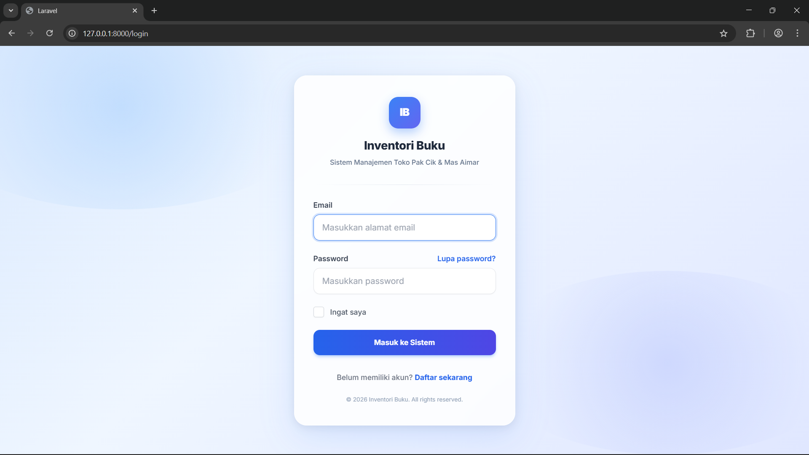
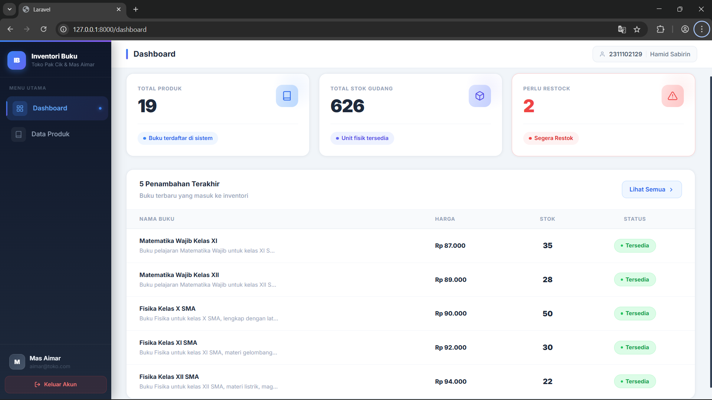
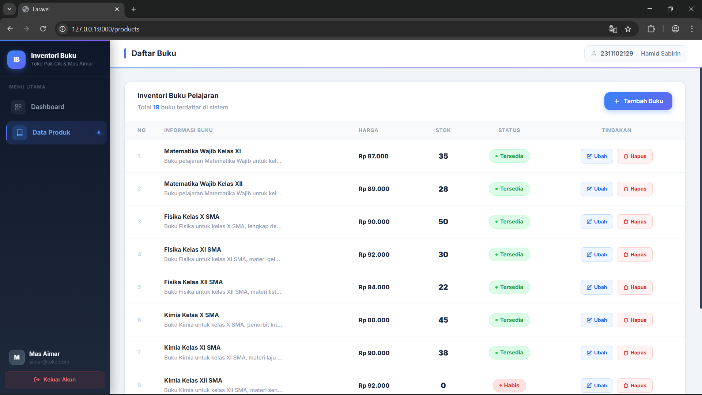
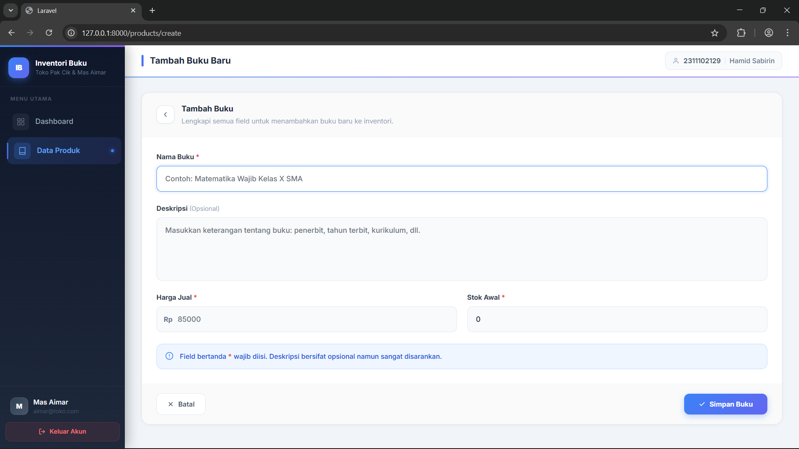
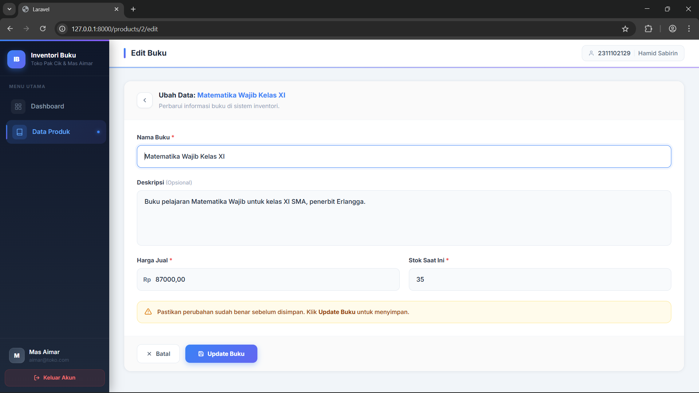

<div align="center">
  <br />
  <h1>LAPORAN PRAKTIKUM <br>APLIKASI BERBASIS PLATFORM</h1>
  <br />
  <h3>MODUL 11, 12 & 13 <br> Laravel Aplikasi Inventori Buku </h3>
  <br />
  <br />
  
  <br />
  <br />
  <br />
  <h3>Disusun Oleh :</h3>
  <p>
    <strong>HAMID SABIRIN</strong><br>
    <strong>2311102129</strong><br>
    <strong>S1 IF-11-REG01</strong>
  </p>
  <br />
  <h3>Dosen Pengampu :</h3>
  <p>
    <strong>Dimas Fanny Hebrasianto Permadi, S.ST., M.Kom</strong>
  </p>
  <br />
  <h4>Asisten Praktikum :</h4>
  <strong>Apri Pandu Wicaksono</strong> <br>
  <strong>Rangga Pradarrell Fathi</strong>
  <br />
  <h3>LABORATORIUM HIGH PERFORMANCE
 <br>FAKULTAS INFORMATIKA <br>UNIVERSITAS TELKOM PURWOKERTO <br>2026</h3>
</div>

---

## 1. Implementasi Sistem (Kebutuhan Fungsional)

Sistem **Inventori Buku** ini dibangun menggunakan framework Laravel dengan pola arsitektur **MVC (Model-View-Controller)**. Sistem mencakup fitur autentikasi pengguna (login/logout) menggunakan Laravel Breeze, serta operasi manajemen data buku secara penuh (**CRUD**: Create, Read, Update, Delete) yang dilindungi oleh middleware autentikasi.

---

## 2. Penjelasan Kode Sumber

### 2.1 Migration Struktur Tabel Database

Migration mendefinisikan skema tabel `products` di database. Setiap kolom beserta tipe datanya dideklarasikan, lalu dijalankan dengan perintah `php artisan migrate`. *File Referensi: `database/migrations/2026_04_07_134703_create_products_table.php`*

```php
<?php

use Illuminate\Database\Migrations\Migration;
use Illuminate\Database\Schema\Blueprint;
use Illuminate\Support\Facades\Schema;

return new class extends Migration
{
    public function up(): void
    {
        Schema::create('products', function (Blueprint $table) {
            $table->id();                              // ID auto-increment
            $table->string('name');                   // Nama buku
            $table->text('description')->nullable();  // Deskripsi (opsional)
            $table->decimal('price', 10, 2);          // Harga (10 digit, 2 desimal)
            $table->integer('stock')->default(0);     // Stok awal default 0
            $table->timestamps();                     // created_at & updated_at
        });
    }

    public function down(): void
    {
        Schema::dropIfExists('products');
    }
};
```

---

### 2.2 Model `Product.php`

Model adalah representasi dari tabel database dalam bentuk objek PHP (Eloquent ORM). Properti `$fillable` mendaftarkan kolom mana saja yang boleh diisi secara massal (*mass assignment*) untuk keamanan. *File Referensi: `app/Models/Product.php`*

```php
<?php

namespace App\Models;

use Illuminate\Database\Eloquent\Factories\HasFactory;
use Illuminate\Database\Eloquent\Model;

class Product extends Model
{
    use HasFactory;

    // Kolom yang diizinkan diisi secara massal
    protected $fillable = ['name', 'description', 'price', 'stock'];
}
```

---

### 2.3 Database Seeder Data Awal Buku

Seeder digunakan untuk mengisi database dengan data awal secara otomatis menggunakan perintah `php artisan db:seed`. Data ini mencakup akun pengguna dan 20 data buku pelajaran SMA. *File Referensi: `database/seeders/DatabaseSeeder.php`*

```php
<?php

namespace Database\Seeders;

use App\Models\User;
use App\Models\Product;
use Illuminate\Database\Seeder;

class DatabaseSeeder extends Seeder
{
    public function run(): void
    {
        // Buat akun pengguna default
        User::factory()->create([
            'name'     => 'Mas Aimar',
            'email'    => 'aimar@toko.com',
            'password' => bcrypt('password'),
        ]);

        // Data buku pelajaran SMA
        $books = [
            ['name' => 'Matematika Wajib Kelas X',  'description' => '...', 'price' => 85000, 'stock' => 42],
            ['name' => 'Fisika Kelas X SMA',         'description' => '...', 'price' => 90000, 'stock' => 50],
            ['name' => 'Kimia Kelas XII SMA',        'description' => '...', 'price' => 92000, 'stock' => 0],
            // ... (20 data buku total)
        ];

        foreach ($books as $book) {
            Product::create($book);
        }
    }
}
```

---

### 2.4 Routes `web.php`

Routes mendefinisikan URL yang dapat diakses oleh pengguna beserta controller yang menanganinya. Route `resource` secara otomatis membuat 7 route CRUD sekaligus. Semua route dibungkus middleware `auth` agar hanya pengguna yang sudah login yang bisa mengaksesnya. *File Referensi: `routes/web.php`*

```php
<?php

use App\Http\Controllers\ProfileController;
use Illuminate\Support\Facades\Route;

// Redirect root ke halaman login
Route::get('/', function () {
    return redirect()->route('login');
});

// Dashboard — hanya bisa diakses jika sudah login
Route::get('/dashboard', function () {
    return view('dashboard');
})->middleware(['auth'])->name('dashboard');

// Grup route yang dilindungi autentikasi
Route::middleware('auth')->group(function () {
    // Resource route: otomatis membuat index, create, store,
    // show, edit, update, destroy untuk produk
    Route::resource('products', \App\Http\Controllers\ProductController::class);

    Route::get('/profile', [ProfileController::class, 'edit'])->name('profile.edit');
    Route::patch('/profile', [ProfileController::class, 'update'])->name('profile.update');
    Route::delete('/profile', [ProfileController::class, 'destroy'])->name('profile.destroy');
});

require __DIR__.'/auth.php';
```

---

### 2.5 Controller `ProductController.php`

Controller adalah inti logika aplikasi. Setiap method menangani satu jenis request HTTP dan menghubungkan Model dengan View. *File Referensi: `app/Http/Controllers/ProductController.php`*

```php
<?php

namespace App\Http\Controllers;

use Illuminate\Http\Request;
use App\Models\Product;

class ProductController extends Controller
{
    // GET /products — Tampilkan daftar semua produk (paginasi 10/halaman)
    public function index()
    {
        $products = Product::latest()->paginate(10);
        return view('products.index', compact('products'));
    }

    // GET /products/create — Tampilkan form tambah produk
    public function create()
    {
        return view('products.create');
    }

    // POST /products — Simpan produk baru ke database
    public function store(Request $request)
    {
        $request->validate([
            'name'        => 'required|string|max:255',
            'description' => 'nullable|string',
            'price'       => 'required|numeric|min:0',
            'stock'       => 'required|integer|min:0',
        ]);

        Product::create($request->all());

        return redirect()->route('products.index')
                         ->with('success', 'Produk berhasil ditambahkan.');
    }

    // GET /products/{id}/edit — Tampilkan form edit produk
    public function edit(Product $product)
    {
        return view('products.edit', compact('product'));
    }

    // PUT /products/{id} — Perbarui data produk yang sudah ada
    public function update(Request $request, Product $product)
    {
        $request->validate([
            'name'        => 'required|string|max:255',
            'description' => 'nullable|string',
            'price'       => 'required|numeric|min:0',
            'stock'       => 'required|integer|min:0',
        ]);

        $product->update($request->all());

        return redirect()->route('products.index')
                         ->with('success', 'Produk berhasil diupdate.');
    }

    // DELETE /products/{id} — Hapus produk dari database
    public function destroy(Product $product)
    {
        $product->delete();

        return redirect()->route('products.index')
                         ->with('success', 'Produk berhasil dihapus.');
    }
}
```

---

### 2.6 View Layout Utama (`layouts/app.blade.php`)

Layout utama mendefinisikan kerangka halaman yang digunakan oleh semua halaman dalam aplikasi (Dashboard, Produk, dll). Menggunakan komponen Blade `x-app-layout`. Berisi sidebar navigasi, top header, dan area konten utama. *File Referensi: `resources/views/layouts/app.blade.php`*

```html
<!-- Sidebar navigasi kiri -->
<aside style="width:240px; background:linear-gradient(180deg,#0f172a 0%,#1e293b 100%);">

    <!-- Branding / Logo -->
    <div style="padding:20px 16px;">
        <div style="display:flex; align-items:center; gap:12px;">
            <div style="background:linear-gradient(135deg,#3b82f6,#6366f1); border-radius:12px;">
                <span>IB</span>
            </div>
            <div>
                <p>Inventori Buku</p>
                <p>Toko Pak Cik & Mas Aimar</p>
            </div>
        </div>
    </div>

    <!-- Menu Navigasi -->
    <nav>
        <a href="{{ route('dashboard') }}" class="nav-item {{ request()->routeIs('dashboard') ? 'active' : '' }}">
            <!-- SVG Icon Dashboard -->
            Dashboard
        </a>
        <a href="{{ route('products.index') }}" class="nav-item {{ request()->routeIs('products.*') ? 'active' : '' }}">
            <!-- SVG Icon Buku -->
            Data Produk
        </a>
    </nav>

    <!-- Info User & Tombol Logout -->
    <div>
        <p>{{ Auth::user()->name }}</p>
        <form method="POST" action="{{ route('logout') }}">
            @csrf
            <button type="submit">Keluar Akun</button>
        </form>
    </div>
</aside>

<!-- Area Konten Utama -->
<div style="flex:1; overflow:hidden;">
    <header>
        <h2>@isset($header){{ $header }}@endisset</h2>
        <!-- Badge NIM & Nama -->
        <span>2311102129 | Hamid Sabirin</span>
    </header>
    <main>
        {{ $slot }}  <!-- Konten halaman disisipkan di sini -->
    </main>
</div>
```

---

### 2.7 View Halaman Login (`auth/login.blade.php`)

Halaman login menggunakan layout `x-guest-layout`. Form mengirim data email dan password ke route `login` menggunakan metode POST, dilengkapi CSRF token untuk keamanan. *File Referensi: `resources/views/auth/login.blade.php`*

```html
<x-guest-layout>
    <!-- Status session (pesan error login) -->
    <x-auth-session-status :status="session('status')" />

    <form method="POST" action="{{ route('login') }}">
        @csrf <!-- Token keamanan CSRF -->

        <!-- Input Email -->
        <label for="email">Email</label>
        <input id="email" type="email" name="email"
               value="{{ old('email') }}" required autofocus
               placeholder="Masukkan alamat email">
        @error('email') <p>{{ $message }}</p> @enderror

        <!-- Input Password -->
        <label for="password">Password</label>
        <input id="password" type="password" name="password"
               required placeholder="Masukkan password">
        @error('password') <p>{{ $message }}</p> @enderror

        <!-- Checkbox Ingat Saya -->
        <input id="remember_me" type="checkbox" name="remember">
        <label for="remember_me">Ingat saya</label>

        <!-- Tombol Submit -->
        <button type="submit">Masuk ke Sistem</button>
    </form>
</x-guest-layout>
```

---

### 2.8 View Dashboard (`dashboard.blade.php`)

Halaman dashboard menampilkan ringkasan statistik inventori: total produk, total stok, dan jumlah produk yang perlu restok, serta tabel 5 buku yang terakhir ditambahkan. *File Referensi: `resources/views/dashboard.blade.php`*

```php
@php
    $totalProduk = \App\Models\Product::count();
    $totalStok   = \App\Models\Product::sum('stock');
    $outOfStock  = \App\Models\Product::where('stock', 0)->count();
@endphp

<!-- Stat Cards -->
<div style="display:grid; grid-template-columns:repeat(3,1fr); gap:20px;">

    <!-- Card Total Produk -->
    <div style="background:white; border-radius:16px; padding:24px;">
        <p>TOTAL PRODUK</p>
        <p style="font-size:38px; font-weight:900;">{{ $totalProduk }}</p>
    </div>

    <!-- Card Total Stok -->
    <div style="background:white; border-radius:16px; padding:24px;">
        <p>TOTAL STOK GUDANG</p>
        <p style="font-size:38px; font-weight:900;">{{ number_format($totalStok) }}</p>
    </div>

    <!-- Card Perlu Restock -->
    <div style="background:white; border-radius:16px; padding:24px;">
        <p>PERLU RESTOCK</p>
        <p style="font-size:38px; font-weight:900; color:{{ $outOfStock > 0 ? '#ef4444' : '#1e293b' }};">
            {{ $outOfStock }}
        </p>
    </div>
</div>

<!-- Tabel 5 Buku Terbaru -->
<table>
    <thead>
        <tr>
            <th>Nama Buku</th>
            <th>Harga</th>
            <th>Stok</th>
            <th>Status</th>
        </tr>
    </thead>
    <tbody>
        @foreach(\App\Models\Product::latest()->take(5)->get() as $product)
        <tr>
            <td>{{ $product->name }}</td>
            <td>Rp {{ number_format($product->price, 0, ',', '.') }}</td>
            <td>{{ $product->stock }}</td>
            <td>{{ $product->stock > 0 ? 'Tersedia' : 'Habis' }}</td>
        </tr>
        @endforeach
    </tbody>
</table>
```

---

### 2.9 View Daftar Produk (`products/index.blade.php`)

Halaman index menampilkan semua produk dalam tabel berpaginasi. Terdapat tombol **Ubah** (menuju halaman edit) dan **Hapus** (membuka modal konfirmasi). Modal hapus dikendalikan oleh fungsi JavaScript murni (`openDeleteModal`) yang mengisi form action secara dinamis. *File Referensi: `resources/views/products/index.blade.php`*

```html
<!-- Tabel daftar buku -->
<table>
    <thead>
        <tr>
            <th>No</th><th>Informasi Buku</th>
            <th>Harga</th><th>Stok</th><th>Status</th><th>Tindakan</th>
        </tr>
    </thead>
    <tbody>
        @forelse($products as $product)
        <tr>
            <td>{{ $loop->iteration }}</td>
            <td>
                <p>{{ $product->name }}</p>
                <p>{{ $product->description ?? '—' }}</p>
            </td>
            <td>Rp {{ number_format($product->price, 0, ',', '.') }}</td>
            <td>{{ $product->stock }}</td>
            <td>
                @if($product->stock > 0)
                    <span>Tersedia</span>
                @else
                    <span>Habis</span>
                @endif
            </td>
            <td>
                <!-- Tombol Edit -->
                <a href="{{ route('products.edit', $product) }}">Ubah</a>

                <!-- Tombol Hapus — membuka modal konfirmasi -->
                <button onclick="openDeleteModal({{ $product->id }}, '{{ $product->name }}')">
                    Hapus
                </button>
            </td>
        </tr>
        @empty
            <tr><td colspan="6">Belum ada data.</td></tr>
        @endforelse
    </tbody>
</table>

<!-- Modal Konfirmasi Hapus -->
<div id="modal-panel" style="display:none; position:fixed; inset:0; z-index:50;">
    <div id="modal-card" style="background:white; border-radius:24px; max-width:420px;">
        <h2>Hapus Data Buku?</h2>
        <p id="modal-product-name"></p>
        <form id="deleteForm" method="POST" action="">
            @csrf
            @method('DELETE')
        </form>
        <button onclick="closeDeleteModal()">Kembali</button>
        <button onclick="document.getElementById('deleteForm').submit()">Ya, Hapus</button>
    </div>
</div>

<!-- JavaScript controller untuk modal hapus -->
<script>
    function openDeleteModal(productId, productName) {
        document.getElementById('modal-product-name').textContent = productName;
        document.getElementById('deleteForm').action = '/products/' + productId;
        document.getElementById('modal-panel').style.display = 'flex';
    }
    function closeDeleteModal() {
        document.getElementById('modal-panel').style.display = 'none';
    }
    document.addEventListener('keydown', function(e) {
        if (e.key === 'Escape') closeDeleteModal();
    });
</script>
```

---

### 2.10 View Form Tambah Produk (`products/create.blade.php`)

Form tambah produk menggunakan metode POST ke route `products.store`. Terdapat validasi error yang ditampilkan di bawah setiap input apabila input tidak valid. *File Referensi: `resources/views/products/create.blade.php`*

```html
<form method="POST" action="{{ route('products.store') }}">
    @csrf

    <!-- Input Nama Buku -->
    <label for="name">Nama Buku <span>*</span></label>
    <input id="name" type="text" name="name"
           value="{{ old('name') }}" required
           placeholder="Contoh: Matematika Wajib Kelas X SMA">
    @error('name')
        <p>{{ $message }}</p>
    @enderror

    <!-- Input Deskripsi (Opsional) -->
    <label for="description">Deskripsi (Opsional)</label>
    <textarea id="description" name="description">{{ old('description') }}</textarea>

    <!-- Grid 2 kolom: Harga & Stok -->
    <div style="display:grid; grid-template-columns:1fr 1fr; gap:20px;">

        <!-- Input Harga -->
        <div>
            <label for="price">Harga Jual <span>*</span></label>
            <input id="price" type="number" name="price"
                   value="{{ old('price') }}" required min="0">
            @error('price') <p>{{ $message }}</p> @enderror
        </div>

        <!-- Input Stok -->
        <div>
            <label for="stock">Stok Awal <span>*</span></label>
            <input id="stock" type="number" name="stock"
                   value="{{ old('stock', 0) }}" required min="0">
            @error('stock') <p>{{ $message }}</p> @enderror
        </div>
    </div>

    <!-- Tombol Aksi -->
    <a href="{{ route('products.index') }}">Batal</a>
    <button type="submit">Simpan Buku</button>
</form>
```

---

### 2.11 View Form Edit Produk (`products/edit.blade.php`)

Form edit menggunakan metode PUT (di-*spoof* melalui `@method('PUT')`) ke route `products.update`. Field-field diisi otomatis dengan data produk yang sedang diedit menggunakan helper `old()` dengan fallback ke nilai dari database `$product->field`. *File Referensi: `resources/views/products/edit.blade.php`*

```html
<form method="POST" action="{{ route('products.update', $product) }}">
    @csrf
    @method('PUT')  <!-- HTTP method spoofing untuk PUT request -->

    <!-- Nama Buku — diisi otomatis dari data yang ada -->
    <label for="name">Nama Buku <span>*</span></label>
    <input id="name" type="text" name="name"
           value="{{ old('name', $product->name) }}" required>
    @error('name') <p>{{ $message }}</p> @enderror

    <!-- Deskripsi -->
    <label for="description">Deskripsi (Opsional)</label>
    <textarea id="description" name="description">
        {{ old('description', $product->description) }}
    </textarea>

    <!-- Harga & Stok — 2 kolom -->
    <div style="display:grid; grid-template-columns:1fr 1fr; gap:20px;">
        <div>
            <label for="price">Harga Jual <span>*</span></label>
            <input id="price" type="number" name="price"
                   value="{{ old('price', $product->price) }}" required>
            @error('price') <p>{{ $message }}</p> @enderror
        </div>
        <div>
            <label for="stock">Stok Saat Ini <span>*</span></label>
            <input id="stock" type="number" name="stock"
                   value="{{ old('stock', $product->stock) }}" required>
            @error('stock') <p>{{ $message }}</p> @enderror
        </div>
    </div>

    <!-- Tombol Aksi -->
    <a href="{{ route('products.index') }}">Batal</a>
    <button type="submit">Update Buku</button>
</form>
```

---

## 3. Hasil Tampilan (Screenshots) Aplikasi

### 3.1 Halaman Login

Halaman autentikasi pengguna. Logo dan form login berada dalam satu card terpusat dengan latar gradien biru. Pengguna memasukkan email dan password untuk masuk ke sistem.



---

### 3.2 Halaman Dashboard

Halaman utama setelah login. Menampilkan 3 stat card (Total Produk, Total Stok Gudang, Perlu Restock) dan tabel 5 buku yang paling terakhir ditambahkan.



---

### 3.3 Halaman Daftar Produk

Menampilkan seluruh data buku dalam tabel berpaginasi 10 buku per halaman. Setiap baris memiliki tombol **Ubah** dan **Hapus**. Badge status (*Tersedia* / *Habis*) ditampilkan sesuai jumlah stok.



---

### 3.4 Halaman Tambah Buku

Form untuk menambahkan data buku baru. Field Harga dan Stok ditampilkan berdampingan dalam layout 2 kolom. Validasi ditampilkan secara inline di bawah masing-masing field jika ada kesalahan input.



---

### 3.5 Halaman Edit Buku

Form untuk memperbarui data buku yang sudah ada. Identik dengan halaman tambah, namun semua field sudah terisi otomatis dengan data dari database. Terdapat warning banner kuning sebagai pengingat sebelum menyimpan perubahan.



---

## 4. Referensi

- **Laravel Documentation**: [https://laravel.com/docs](https://laravel.com/docs)
- **Laravel Breeze (Autentikasi)**: [https://laravel.com/docs/starter-kits#laravel-breeze](https://laravel.com/docs/starter-kits#laravel-breeze)
- **Eloquent ORM**: [https://laravel.com/docs/eloquent](https://laravel.com/docs/eloquent)
- **Laravel Blade Templates**: [https://laravel.com/docs/blade](https://laravel.com/docs/blade)
- **Laravel Resource Controllers**: [https://laravel.com/docs/controllers#resource-controllers](https://laravel.com/docs/controllers#resource-controllers)
