<div align="center">
   <h2>LAPORAN PRAKTIKUM<br>APLIKASI BERBASIS PLATFORM</h2>
   <h>
   <br>
   <h4>MODUL 11, 12, 13 <br>LARAVEL</h4>
   <br>
   
   <br><br>
 
**Disusun Oleh :**<br>
RICO ADE PRATAMA<br>
2311102138<br>
PS1IF-11-REG01
<br><br>
 
**Dosen Pengampu :**<br>
Dimas Fanny Hebrasianto Permadi, S.ST., M.Kom
<br><br>
 
**Assisten Praktikum :**<br>
Apri Pandu Wicaksono
<br>Rangga Pradarrell Fathi
<br><br>
 
PROGRAM STUDI S1 TEKNIK INFORMATIKA<br>
FAKULTAS INFORMATIKA<br>
UNIVERSITAS TELKOM PURWOKERTO<br>
2026

</div>

---

## 1. Dasar Teori

### **Modul 11. Laravel: Introduction**<br>

**Laravel** adalah web application framework PHP yang bersifat open-source dan menggunakan model MVC. Keunggulan Laravel meliputi URL yang bersih (segment-based), gratis, extensible, memiliki banyak library, serta didukung dengan dokumentasi yang lengkap.

**Framework & MVC** adalah kerangka kerja yang berisi kumpulan fungsi dan class siap pakai untuk mempermudah serta mempercepat pekerjaan programmer. Model-View-Controller (MVC) memisahkan komponen utama aplikasi menjadi tiga bagian:

- Model: Berhubungan langsung dengan database untuk memanipulasi data.
- View: Menangani antarmuka (UI) untuk menerima dan merepresentasikan data kepada user.
- Controller: Bagian yang mengatur alur kerja dan hubungan antara Model dan View.

**Cara Kerja Laravel:**

- Routing: Menangani permintaan (HTTP request) dan mengatur pemetaan URL dengan aksi yang ingin dilakukan.
- View: Halaman web yang secara default menggunakan template engine bernama Blade.
- Controller: Inti yang mengeksekusi penanganan logika dari aplikasi web tersebut.

### **Modul 12. Laravel: Database 1**<br>

**CRUD** Merupakan singkatan dari Create, Read, Update, Delete yang mengelola data dari database menggunakan perantara Model, View, dan Controller.

**Templating Halaman** Pada Laravel, templating menggunakan directive dari Blade agar struktur halaman yang sama (seperti header atau footer) tidak perlu ditulis berulang kali. Directive yang umum digunakan meliputi @yield, @extends, dan @section.

**Form Validation** Laravel menyediakan validasi dari sisi server sebelum data disimpan atau diubah. Contohnya adalah memastikan data yang dimasukkan ke form (input) tidak kosong, memenuhi jumlah karakter minimal, atau memeriksa format tertentu seperti nilai integer.

### **Modul 13. Laravel: Database 2**<br>

**Session** Fitur untuk menyimpan suatu variabel di server sehingga dapat diakses di Routing, Controller, maupun halaman mana pun. Terdapat dua jenis Session di Laravel:

- Session Biasa: Tetap tersimpan selama tidak dihapus, time-out, atau browser ditutup.
- Session Flash: Hanya berlaku untuk satu kali pemanggilan (request) saja, lalu otomatis dihapus oleh Laravel.

**Middleware** Suatu mekanisme yang menyaring request masuk ke suatu URL. Fitur ini sering digunakan bersama library Auth untuk memverifikasi autentikasi hak akses user sebelum meneruskan permintaan ke Routing.

**Model Relasi** Fasilitas Eloquent Laravel yang mengatur agar dua Model dalam tabel database yang berelasi dapat saling memanggil satu sama lain. Relasi One to Many adalah salah satu contoh penerapannya dengan menggunakan fungsi hasMany() dan belongsTo() pada Model.

## 2. Kode Program Unguided

**Tugas Modul 11, 12, 13**

Buat project bisa menggunakan Laravel dimana kalian diminta membuat web inventari toko punya pak cik sama mas aimar (yang ga paham suki) dimana terdapat sebuah crud untuk mengelola produk, dengan tampilan seperti datatable, form create, form edit, dan konfirmasi modal untuk delete. Dan untuk data disimpan dalam database, gunakan database factory dan seeder (biar datanya ga kosong banget). dan buat nilai plus tambahkan dokumentasi project nya (bawaan ai juga udah ada pasti), please wok bantuin biar mas jakobi bisa belanja di toko nya mas aimar, jangan lupa terapin sistem login yaa (pake sistem session), #KingNasirPembantaiNgawiTimur

### Struktur Program

```php
TOKO-MAS-AIMARICO (Folder Utama)
│
├── 📁 app
│   ├── 📁 Http
│   │   ├── 📁 Controllers       ➔ (Logika aplikasi)
│   │   │   ├── AuthController.php      (Login & Logout)
│   │   │   ├── DashboardController.php (Statistik Admin)
│   │   │   ├── ProductController.php   (CRUD Produk)
│   │   │   └── ShopController.php      (Katalog & Transaksi)
│   │   │
│   │   └── 📁 Middleware        ➔ (Pembatas Hak Akses)
│   │       └── RoleMiddleware.php      (Pemisah Admin & Customer)
│   │
│   └── 📁 Models                ➔ (Penghubung Database)
│       ├── Product.php                 (Data stok produk)
│       └── User.php                    (Data akun)
│
├── 📁 bootstrap
│   └── app.php                  ➔ (Pusat Registrasi)
│
├── 📁 database                  ➔ (Penyimpanan Data)
│   ├── 📁 factories             ➔ (Generator Data Dummy)
│   │   ├── ProductFactory.php          (Data produk)
│   │   └── UserFactory.php             (Data user)
│   │
│   ├── 📁 migrations            ➔ (Pembuat Struktur Tabel)
│   │   ├── 0000_create_users_table.php 
│   │   └── 2026_create_products_table.php (Desain tabel produk)
│   │
│   └── 📁 seeders               ➔ (Pengisi Data Awal)
│       └── DatabaseSeeder.php          (Akun default)
│
├── 📁 resources
│   └── 📁 views                 ➔ (Tampilan UI/Blade)
│       ├── 📁 auth
│       │   └── login.blade.php         (Halaman Login)
│       ├── 📁 layouts
│       │   └── app.blade.php           (Template dasar)
│       ├── 📁 products          ➔ (CRUD Admin)
│       │   ├── create.blade.php        (Form tambah)
│       │   ├── edit.blade.php          (Form edit)
│       │   └── index.blade.php         (Daftar produk)
│       └── 📁 shop              ➔ (Katalog Customer)
│           └── index.blade.php         (Tampilan katalog buat Mas Jakobi)
│
├── 📁 routes
│   └── web.php                  ➔ (Pengatur Routing/URL)
│
└── 📄 .env                      ➔ (Konfigurasi & Koneksi DB)
```

### Kode AuthController.php (Folder app/Http)

```php
<?php

namespace App\Http\Controllers;

use Illuminate\Http\Request;
use Illuminate\Support\Facades\Auth;

class AuthController extends Controller
{
    public function showLogin()
    {
        return view('auth.login');
    }

    public function authenticate(Request $request)
    {
        $credentials = $request->validate([
            'email' => ['required', 'email'],
            'password' => ['required'],
        ]);

        if (Auth::attempt($credentials)) {
            $request->session()->regenerate();

            if (Auth::user()->role === 'admin') {
                return redirect()->route('products.index');
            }
            return redirect()->route('shop.index');
        }

        return back()->withErrors([
            'email' => 'Email atau password salah!',
        ])->onlyInput('email');
    }

    public function logout(Request $request)
    {
        Auth::logout();
        $request->session()->invalidate();
        $request->session()->regenerateToken();
        return redirect('/login');
    }
}
```

### Kode Controller.php (Folder app/Http)

```php
<?php

namespace App\Http\Controllers;

abstract class Controller
{
}
```

### Kode DashboardController.php (Folder app/Http)

```php
<?php

namespace App\Http\Controllers;

use Illuminate\Http\Request;

class DashboardController extends Controller
{
    public function index()
    {
        return redirect()->route('products.index');
    }
}
```

### Kode ProductController.php (Folder app/Http)

```php
<?php

namespace App\Http\Controllers;

use App\Models\Product;
use Illuminate\Http\Request;

class ProductController extends Controller
{
    public function index(Request $request)
    {
        $totalProduk = Product::count();
        $totalStok = Product::sum('stock');
        $stokMenipis = Product::where('stock', '<=', 10)->where('stock', '>', 0)->count();
        $kategori = Product::distinct('category')->count('category');

        $perPage = $request->get('per_page', 10);
        $search = $request->get('search');

        $query = Product::query();
        if ($search) {
            $query->where('name', 'like', "%{$search}%");
        }

        $products = $query->latest()->paginate($perPage);

        return view('products.index', compact('products', 'totalProduk', 'totalStok', 'stokMenipis', 'kategori'));
    }

    public function create()
    {
        return view('products.create');
    }

    public function store(Request $request)
    {
        $request->validate([
            'name' => 'required|string|max:255',
            'category' => 'required|string|max:255',
            'price' => 'required|integer|min:0',
            'stock' => 'required|integer|min:0',
            'description' => 'nullable|string'
        ]);

        Product::create($request->all());
        return redirect()->route('products.index')->with('success', 'Produk berhasil ditambahkan.');
    }

    public function edit(Product $product)
    {
        return view('products.edit', compact('product'));
    }

    public function update(Request $request, Product $product)
    {
        $request->validate([
            'name' => 'required|string|max:255',
            'category' => 'required|string|max:255',
            'price' => 'required|integer|min:0',
            'stock' => 'required|integer|min:0',
            'description' => 'nullable|string'
        ]);

        $product->update($request->all());
        return redirect()->route('products.index')->with('success', 'Produk berhasil diupdate.');
    }

    public function destroy(Product $product)
    {
        $product->delete();
        return redirect()->route('products.index')->with('success', 'Produk berhasil dihapus.');
    }
}
```

### Kode ShopController.php (Folder app/Http)

```php
<?php

namespace App\Http\Controllers;

use App\Models\Product;
use Illuminate\Http\Request;

class ShopController extends Controller
{
    public function index(Request $request)
    {
        // Hanya tampilkan produk yang stoknya di atas 0
        $query = Product::where('stock', '>', 0);

        // Fitur Search
        if ($request->has('search')) {
            $query->where(function($q) use ($request) {
                $q->where('name', 'like', '%' . $request->search . '%')
                  ->orWhere('category', 'like', '%' . $request->search . '%');
            });
        }

        $products = $query->latest()->paginate(12);
        return view('shop.index', compact('products'));
    }

    public function buy(Product $product)
    {
        if ($product->stock > 0) {
            // Kurangi stok 1 di database
            $product->decrement('stock');

            return back()->with('success', "Berhasil membeli {$product->name}! Stok otomatis berkurang.");
        }

        return back()->with('error', 'Maaf, stok barang sudah habis!');
    }
}
```

### Kode RoleMiddleware.php (Folder app/Middleware)

```php
<?php

namespace App\Middleware;

use Closure;
use Illuminate\Http\Request;
use Symfony\Component\HttpFoundation\Response;
use Illuminate\Support\Facades\Auth;

class RoleMiddleware
{
    public function handle(Request $request, Closure $next, $role): Response
    {
        if (!Auth::check() || Auth::user()->role !== $role) {
            abort(403, 'Akses tidak diizinkan');
        }

        return $next($request);
    }
}
```

### Kode Product.php (Folder app/Models)

```php
<?php

namespace App\Models;

use Illuminate\Database\Eloquent\Factories\HasFactory;
use Illuminate\Database\Eloquent\Model;

class Product extends Model
{
    use HasFactory;

    protected $fillable = [
        'name',
        'category',
        'price',
        'stock',
        'description'
    ];
}
```

### Kode User.php (Folder app/Models)

```php
<?php

namespace App\Models;

use Illuminate\Database\Eloquent\Factories\HasFactory;
use Illuminate\Foundation\Auth\User as Authenticatable;
use Illuminate\Notifications\Notifiable;

class User extends Authenticatable
{
    use HasFactory, Notifiable;

    protected $fillable = [
        'name',
        'email',
        'password',
        'role',
    ];

    protected $hidden = [
        'password',
        'remember_token',
    ];

    protected function casts(): array
    {
        return [
            'email_verified_at' => 'datetime',
            'password' => 'hashed',
        ];
    }
}
```

### Kode app.php (Folder bootstrap)

```php
<?php

use Illuminate\Foundation\Application;
use Illuminate\Foundation\Configuration\Exceptions;
use Illuminate\Foundation\Configuration\Middleware;

return Application::configure(basePath: dirname(__DIR__))
    ->withRouting(
        web: __DIR__.'/../routes/web.php',
        commands: __DIR__.'/../routes/console.php',
        health: '/up',
    )
    ->withMiddleware(function (Middleware $middleware) {
        $middleware->alias([
            'role' => \App\Middleware\RoleMiddleware::class,
        ]);
    })
    ->withExceptions(function (Exceptions $exceptions) {
    })->create();
```

### Kode ProductFactory.php (Folder database/factories)

```php
<?php

namespace Database\Factories;

use Illuminate\Database\Eloquent\Factories\Factory;

class ProductFactory extends Factory
{
    public function definition(): array
    {
        $catalog = [
            'Jersey & Apparel' => [
                ['Jersey Liverpool Home 24/25', 'Jersey merah kebanggaan Anfield edisi terbaru'],
                ['Jersey Liverpool Away 24/25', 'Jersey tandang putih-hijau original'],
                ['Jersey Retro LFC 2005', 'Jersey ikonik malam keajaiban Istanbul'],
                ['Jaket Anthem Liverpool', 'Jaket pra-pertandingan warna merah gelap'],
                ['Celana Training Bola', 'Celana panjang training bahan dry-fit'],
                ['Rompi Latihan (Bibs)', 'Rompi latihan tim warna neon terang'],
                ['Kaos Kaki Bola Panjang', 'Kaos kaki anti-slip untuk bertanding'],
            ],

            'Sepatu Bola & Futsal' => [
                ['Sepatu Bola Nike Mercurial', 'Sepatu bola ringan untuk winger cepat'],
                ['Sepatu Bola Adidas Predator', 'Sepatu bola kontrol presisi tinggi'],
                ['Sepatu Bola Specs Lightspeed', 'Sepatu bola lokal kualitas profesional'],
                ['Sepatu Futsal Ortuseight Jogosala', 'Sepatu futsal empuk untuk lapangan vinyl'],
                ['Sepatu Futsal Puma Future', 'Sepatu futsal dengan teknologi adaptive fit'],
                ['Sandal Slide LFC', 'Sandal santai untuk habis bertanding'],
            ],

            'Peralatan Latihan' => [
                ['Bola Sepak Nike Flight', 'Bola resmi standar FIFA Quality Pro'],
                ['Bola Futsal Specs', 'Bola futsal pantulan rendah (Low Bounce)'],
                ['Sarung Tangan Kiper Alisson', 'Gloves kiper dengan latex grip premium'],
                ['Cone Latihan 50 Pcs', 'Marking cone untuk latihan kelincahan (agility)'],
                ['Pompa Bola Manual', 'Pompa angin portabel plus pentil besi'],
                ['Papan Taktik Pelatih', 'Papan magnetik taktik formasi sepak bola'],
                ['Shin Guard (Dekker)', 'Pelindung tulang kering ringan dan kuat'],
            ],

            'Aksesoris Suporter' => [
                ['Syal YNWA Original', 'Scarf rajut tulisan Youll Never Walk Alone'],
                ['Topi Baseball LFC', 'Topi kasual dengan logo Liverbird'],
                ['Tas Sepatu Bola Serut', 'Gymsack anti air untuk bawa sepatu'],
                ['Botol Minum Olahraga 1L', 'Tumbler sport BPA-free ukuran besar'],
                ['Dekker Engkel (Ankle Support)', 'Pelindung engkel untuk mencegah cedera'],
            ],
        ];
        $category = $this->faker->randomElement(array_keys($catalog));
        [$name, $description] = $this->faker->randomElement($catalog[$category]);
        $suffix = $this->faker->optional(0.3)->randomElement(['(Player Issue)', '(Grade Ori)', 'Original', '- Diskon 20%', 'Limited Edition']);
        $nama_produk = $suffix ? "$name $suffix" : $name;
        $priceRange = match ($category) {
            'Jersey & Apparel'     => [150000, 1500000],
            'Sepatu Bola & Futsal' => [350000, 3500000],
            'Peralatan Latihan'    => [50000, 1500000],
            'Aksesoris Suporter'   => [35000, 350000],
            default                => [50000, 500000],
        };
        $harga = round($this->faker->numberBetween($priceRange[0], $priceRange[1]) / 5000) * 5000;
        return [
            'name'        => $nama_produk,
            'category'    => $category,
            'price'       => $harga,
            'stock'       => $this->faker->numberBetween(0, 50),
            'description' => $description,
        ];
    }
}
```

### Kode UserFactory.php (Folder database/factories)

```php
<?php

namespace Database\Factories;

use Illuminate\Database\Eloquent\Factories\Factory;
use Illuminate\Support\Facades\Hash;
use Illuminate\Support\Str;

class UserFactory extends Factory
{
    protected static ?string $password;

    public function definition(): array
    {
        return [
            'name' => fake()->name(),
            'email' => fake()->unique()->safeEmail(),
            'password' => static::$password ??= Hash::make('password'),
            'role' => 'customer',
            'remember_token' => Str::random(10),
        ];
    }
}
```

### Kode login.blade.php (Folder resources/auth)

```php
@extends('layouts.app')

@section('content')
<div class="min-h-screen flex items-center justify-center p-4" style="background-color: #f0f2f5;">
    <div class="bg-white rounded-2xl shadow-xl w-full max-w-md overflow-hidden">

        <div class="bg-[#1f2128] py-8 text-center text-white border-b-4 border-emerald-600">
            <div class="inline-flex items-center justify-center w-14 h-14 bg-emerald-600 rounded-full mb-3">
                <i class="fas fa-futbol text-2xl"></i>
            </div>
            <h1 class="text-2xl font-bold tracking-wide">Toko Mas Aimarico</h1>
            <p class="text-sm text-gray-400 mt-1">Sport Inventory Management</p>
        </div>

        <div class="p-8">
            <h2 class="text-center text-lg font-semibold text-gray-800 mb-6">Masuk ke Akun Anda</h2>

            @if($errors->any())
                <div class="bg-red-100 border border-red-300 text-red-700 px-4 py-3 rounded-lg relative mb-6 text-sm flex items-center gap-2">
                    <i class="fas fa-exclamation-circle"></i>
                    <span>{{ $errors->first() }}</span>
                </div>
            @endif

            <form method="POST" action="{{ route('login.post') }}">
                @csrf
                <div class="mb-5">
                    <label class="block text-gray-700 text-sm font-semibold mb-2">Email</label>
                    <div class="relative">
                        <div class="absolute inset-y-0 left-0 pl-3 flex items-center pointer-events-none">
                            <i class="fas fa-envelope text-gray-400"></i>
                        </div>
                        <input type="email" name="email" value="{{ old('email') }}" required
                            class="w-full pl-10 pr-4 py-3 rounded-lg bg-blue-50 border border-blue-100 focus:outline-none focus:border-emerald-500 focus:ring-1 focus:ring-emerald-500 transition-colors text-sm"
                            placeholder="nama@email.com">
                    </div>
                </div>

                <div class="mb-6">
                    <label class="block text-gray-700 text-sm font-semibold mb-2">Password</label>
                    <div class="relative">
                        <div class="absolute inset-y-0 left-0 pl-3 flex items-center pointer-events-none">
                            <i class="fas fa-lock text-gray-400"></i>
                        </div>
                        <input type="password" name="password" required
                            class="w-full pl-10 pr-4 py-3 rounded-lg bg-blue-50 border border-blue-100 focus:outline-none focus:border-emerald-500 focus:ring-1 focus:ring-emerald-500 transition-colors text-sm"
                            placeholder="••••••••">
                    </div>
                </div>

                <button type="submit" class="w-full bg-[#1e8f54] hover:bg-emerald-700 text-white font-bold py-3 px-4 rounded-lg transition-colors flex items-center justify-center gap-2 shadow-md">
                    <i class="fas fa-sign-in-alt"></i> Masuk Sistem
                </button>
            </form>

            <div class="mt-8 bg-[#fff9db] border border-yellow-200 rounded-lg p-4 text-sm text-gray-700 shadow-sm">
                <div class="flex items-center gap-2 font-bold mb-3 text-yellow-800">
                    <i class="fas fa-info-circle"></i> Akun Demo Asisten:
                </div>
                <div class="space-y-2">
                    <div class="flex items-center gap-2">
                        <span class="bg-[#1f2128] text-white text-[10px] px-2 py-0.5 rounded font-bold tracking-wider">Admin</span>
                        <span class="text-gray-600">aimarico@toko.com / aimarico123</span>
                    </div>
                    <div class="flex items-center gap-2">
                        <span class="bg-[#1f2128] text-white text-[10px] px-2 py-0.5 rounded font-bold tracking-wider">Admin</span>
                        <span class="text-gray-600">pakcik@toko.com / pakcik123</span>
                    </div>
                    <div class="flex items-center gap-2">
                        <span class="bg-emerald-600 text-white text-[10px] px-2 py-0.5 rounded font-bold tracking-wider">Customer</span>
                        <span class="text-gray-600">jakobi@gmail.com / jakobi123</span>
                    </div>
                </div>
            </div>

        </div>
    </div>
</div>
@endsection
```

### Kode app.blade.php (Folder resources/layouts)

```php
<!DOCTYPE html>
<html lang="id">
<head>
    <meta charset="UTF-8">
    <meta name="viewport" content="width=device-width, initial-scale=1.0">
    <title>Toko Mas Aimarico - Inventory Management</title>
    <script src="https://cdn.tailwindcss.com"></script>
    <link rel="stylesheet" href="https://cdnjs.cloudflare.com/ajax/libs/font-awesome/6.4.0/css/all.min.css">
    <link href="https://fonts.googleapis.com/css2?family=Inter:wght@300;400;500;600;700&display=swap" rel="stylesheet">
    <style>
        body { font-family: 'Inter', sans-serif; background-color: #f3f4f6; }
        .sidebar-bg { background-color: #1f2128; }
    </style>
</head>
<body class="antialiased">
    @yield('content')
</body>
</html>
```

### Kode create.blade.php (Folder resources/products)

```php
@extends('layouts.app')

@section('content')
<div class="flex h-screen bg-gray-50 overflow-hidden">

    <aside class="w-64 sidebar-bg text-white flex flex-col shadow-xl z-20">
        <div class="p-6 border-b border-gray-700">
            <h2 class="text-xl font-bold tracking-wide flex items-start gap-2">
                <i class="fas fa-futbol text-emerald-500 mt-1"></i>
                <span>Toko<br>Inventaris</span>
            </h2>
            <p class="text-[10px] text-gray-400 mt-2 uppercase tracking-wider font-semibold">Rico Ade Pratama - 2311102138</p>
        </div>

        <div class="flex-1 py-4">
            <div class="px-4 text-xs font-semibold text-gray-500 mb-2">MENU</div>
            <a href="{{ route('products.index') }}" class="flex items-center px-6 py-3 text-gray-400 hover:text-white hover:bg-gray-800 font-medium transition-all">
                <i class="fas fa-box w-5"></i> Produk
            </a>
            <a href="{{ route('products.create') }}" class="flex items-center px-6 py-3 bg-[#e43f5a] text-white font-medium border-l-4 border-white transition-all">
                <i class="fas fa-plus-circle w-5"></i> Tambah Produk
            </a>
        </div>

        <div class="p-4 bg-gray-900 border-t border-gray-800 flex justify-between items-center">
            <div class="flex items-center gap-3">
                <div class="w-8 h-8 rounded-full bg-red-500 flex items-center justify-center font-bold text-sm">
                    {{ substr(Auth::user()->name, 0, 1) }}
                </div>
                <div>
                    <p class="text-sm font-bold truncate w-24">{{ Auth::user()->name }}</p>
                    <p class="text-[10px] text-gray-400">Administrator</p>
                </div>
            </div>
            <form action="{{ route('logout') }}" method="POST">
                @csrf
                <button type="submit" class="text-gray-400 hover:text-white transition-colors" title="Logout"><i class="fas fa-sign-out-alt"></i></button>
            </form>
        </div>
    </aside>

    <main class="flex-1 flex flex-col h-screen overflow-y-auto">
        <div class="p-8">
            <div class="mb-8 border-b pb-4 flex justify-between items-end">
                <div>
                    <h1 class="text-2xl font-bold text-gray-800">Tambah Produk Baru</h1>
                    <p class="text-sm text-gray-500 mt-1">Manajemen Produk <i class="fas fa-chevron-right text-[10px] mx-1"></i> Tambah Data</p>
                </div>
                <a href="{{ route('products.index') }}" class="text-sm font-medium text-gray-500 hover:text-[#e43f5a] transition-colors flex items-center gap-2">
                    <i class="fas fa-arrow-left"></i> Kembali ke Daftar
                </a>
            </div>

            <div class="bg-white rounded-xl shadow-sm border border-gray-100 p-8 max-w-4xl">
                <div class="flex items-center gap-3 mb-6 pb-4 border-b border-gray-50">
                    <div class="w-10 h-10 bg-[#e43f5a] rounded-lg flex items-center justify-center text-white shadow-sm">
                        <i class="fas fa-plus-circle"></i>
                    </div>
                    <div>
                        <h2 class="text-lg font-bold text-gray-800">Formulir Tambah Produk</h2>
                        <p class="text-xs text-gray-500">Masukkan detail data inventaris peralatan sepak bola dengan benar.</p>
                    </div>
                </div>

                <form action="{{ route('products.store') }}" method="POST">
                    @csrf
                    <div class="grid grid-cols-2 gap-6 mb-5">
                        <div class="col-span-2 md:col-span-1">
                            <label class="block text-sm font-semibold text-gray-700 mb-2">Nama Produk <span class="text-red-500">*</span></label>
                            <input type="text" name="name" class="w-full border border-gray-300 rounded-lg px-4 py-2.5 focus:outline-none focus:border-[#e43f5a] focus:ring-1 focus:ring-[#e43f5a] transition-colors" placeholder="Contoh: Sepatu Bola Specs Lightspeed" required>
                        </div>
                        <div class="col-span-2 md:col-span-1">
                            <label class="block text-sm font-semibold text-gray-700 mb-2">Kategori <span class="text-red-500">*</span></label>
                            <input type="text" name="category" class="w-full border border-gray-300 rounded-lg px-4 py-2.5 focus:outline-none focus:border-[#e43f5a] focus:ring-1 focus:ring-[#e43f5a] transition-colors" placeholder="Contoh: Sepatu, Jersey, Bola" required>
                        </div>
                    </div>

                    <div class="grid grid-cols-2 gap-6 mb-5">
                        <div class="col-span-2 md:col-span-1 relative">
                            <label class="block text-sm font-semibold text-gray-700 mb-2">Harga <span class="text-red-500">*</span></label>
                            <div class="absolute inset-y-0 left-0 top-7 pl-3 flex items-center pointer-events-none">
                                <span class="text-gray-500 font-medium text-sm">Rp</span>
                            </div>
                            <input type="number" name="price" class="w-full border border-gray-300 rounded-lg pl-10 pr-4 py-2.5 focus:outline-none focus:border-[#e43f5a] focus:ring-1 focus:ring-[#e43f5a] transition-colors" placeholder="0" required>
                        </div>
                        <div class="col-span-2 md:col-span-1 relative">
                            <label class="block text-sm font-semibold text-gray-700 mb-2">Stok Awal <span class="text-red-500">*</span></label>
                            <div class="absolute inset-y-0 right-0 top-7 pr-4 flex items-center pointer-events-none">
                                <span class="text-gray-500 font-medium text-sm">Unit</span>
                            </div>
                            <input type="number" name="stock" class="w-full border border-gray-300 rounded-lg px-4 py-2.5 focus:outline-none focus:border-[#e43f5a] focus:ring-1 focus:ring-[#e43f5a] transition-colors" placeholder="0" required>
                        </div>
                    </div>

                    <div class="mb-8">
                        <label class="block text-sm font-semibold text-gray-700 mb-2">Deskripsi Produk (Opsional)</label>
                        <textarea name="description" rows="4" class="w-full border border-gray-300 rounded-lg px-4 py-3 focus:outline-none focus:border-[#e43f5a] focus:ring-1 focus:ring-[#e43f5a] transition-colors resize-none" placeholder="Tuliskan spesifikasi produk di sini..."></textarea>
                    </div>

                    <div class="flex justify-end gap-3 pt-5 border-t border-gray-100">
                        <a href="{{ route('products.index') }}" class="bg-gray-100 hover:bg-gray-200 text-gray-700 font-semibold px-5 py-2.5 rounded-lg transition-colors">Batal</a>
                        <button type="submit" class="bg-[#e43f5a] hover:bg-rose-600 text-white font-semibold px-6 py-2.5 rounded-lg transition-colors shadow-md flex items-center gap-2">
                            <i class="fas fa-save"></i> Simpan Data
                        </button>
                    </div>
                </form>
            </div>

            <div class="mt-8 text-xs text-gray-400">
                &copy; {{ date('Y') }} Toko Mas Aimarico. All rights reserved.
            </div>
        </div>
    </main>
</div>
@endsection
```

### Kode edit.blade.php (Folder resources/products)

```php
@extends('layouts.app')

@section('content')
<div class="flex h-screen bg-gray-50 overflow-hidden">

    <aside class="w-64 sidebar-bg text-white flex flex-col shadow-xl z-20">
        <div class="p-6 border-b border-gray-700">
            <h2 class="text-xl font-bold tracking-wide flex items-start gap-2">
                <i class="fas fa-futbol text-emerald-500 mt-1"></i>
                <span>Toko<br>Inventaris</span>
            </h2>
            <p class="text-[10px] text-gray-400 mt-2 uppercase tracking-wider font-semibold">Rico Ade Pratama - 2311102138</p>
        </div>

        <div class="flex-1 py-4">
            <div class="px-4 text-xs font-semibold text-gray-500 mb-2">MENU</div>
            <a href="{{ route('products.index') }}" class="flex items-center px-6 py-3 text-gray-400 hover:text-white hover:bg-gray-800 font-medium transition-all">
                <i class="fas fa-box w-5"></i> Produk
            </a>
            <a href="{{ route('products.create') }}" class="flex items-center px-6 py-3 text-gray-400 hover:text-white hover:bg-gray-800 font-medium transition-all">
                <i class="fas fa-plus-circle w-5"></i> Tambah Produk
            </a>
        </div>

        <div class="p-4 bg-gray-900 border-t border-gray-800 flex justify-between items-center">
            <div class="flex items-center gap-3">
                <div class="w-8 h-8 rounded-full bg-red-500 flex items-center justify-center font-bold text-sm">
                    {{ substr(Auth::user()->name, 0, 1) }}
                </div>
                <div>
                    <p class="text-sm font-bold truncate w-24">{{ Auth::user()->name }}</p>
                    <p class="text-[10px] text-gray-400">Administrator</p>
                </div>
            </div>
            <form action="{{ route('logout') }}" method="POST">
                @csrf
                <button type="submit" class="text-gray-400 hover:text-white transition-colors" title="Logout"><i class="fas fa-sign-out-alt"></i></button>
            </form>
        </div>
    </aside>

    <main class="flex-1 flex flex-col h-screen overflow-y-auto">
        <div class="p-8">
            <div class="mb-8 border-b pb-4 flex justify-between items-end">
                <div>
                    <h1 class="text-2xl font-bold text-gray-800">Edit Produk</h1>
                    <p class="text-sm text-gray-500 mt-1">Manajemen Produk <i class="fas fa-chevron-right text-[10px] mx-1"></i> Edit Data</p>
                </div>
                <a href="{{ route('products.index') }}" class="text-sm font-medium text-gray-500 hover:text-yellow-600 transition-colors flex items-center gap-2">
                    <i class="fas fa-arrow-left"></i> Kembali ke Daftar
                </a>
            </div>

            <div class="bg-white rounded-xl shadow-sm border border-gray-100 p-8 max-w-4xl">
                <div class="flex items-center gap-3 mb-6 pb-4 border-b border-gray-50">
                    <div class="w-10 h-10 bg-yellow-500 rounded-lg flex items-center justify-center text-white shadow-sm">
                        <i class="fas fa-edit"></i>
                    </div>
                    <div>
                        <h2 class="text-lg font-bold text-gray-800">Formulir Edit Produk</h2>
                        <p class="text-xs text-gray-500">Perbarui informasi data inventaris peralatan sepak bola.</p>
                    </div>
                </div>

                <form action="{{ route('products.update', $product->id) }}" method="POST">
                    @csrf @method('PUT')
                    <div class="grid grid-cols-2 gap-6 mb-5">
                        <div class="col-span-2 md:col-span-1">
                            <label class="block text-sm font-semibold text-gray-700 mb-2">Nama Produk <span class="text-red-500">*</span></label>
                            <input type="text" name="name" value="{{ $product->name }}" class="w-full border border-gray-300 rounded-lg px-4 py-2.5 focus:outline-none focus:border-yellow-500 focus:ring-1 focus:ring-yellow-500 transition-colors" required>
                        </div>
                        <div class="col-span-2 md:col-span-1">
                            <label class="block text-sm font-semibold text-gray-700 mb-2">Kategori <span class="text-red-500">*</span></label>
                            <input type="text" name="category" value="{{ $product->category }}" class="w-full border border-gray-300 rounded-lg px-4 py-2.5 focus:outline-none focus:border-yellow-500 focus:ring-1 focus:ring-yellow-500 transition-colors" required>
                        </div>
                    </div>

                    <div class="grid grid-cols-2 gap-6 mb-5">
                        <div class="col-span-2 md:col-span-1 relative">
                            <label class="block text-sm font-semibold text-gray-700 mb-2">Harga <span class="text-red-500">*</span></label>
                            <div class="absolute inset-y-0 left-0 top-7 pl-3 flex items-center pointer-events-none">
                                <span class="text-gray-500 font-medium text-sm">Rp</span>
                            </div>
                            <input type="number" name="price" value="{{ $product->price }}" class="w-full border border-gray-300 rounded-lg pl-10 pr-4 py-2.5 focus:outline-none focus:border-yellow-500 focus:ring-1 focus:ring-yellow-500 transition-colors" required>
                        </div>
                        <div class="col-span-2 md:col-span-1 relative">
                            <label class="block text-sm font-semibold text-gray-700 mb-2">Stok Barang <span class="text-red-500">*</span></label>
                            <div class="absolute inset-y-0 right-0 top-7 pr-4 flex items-center pointer-events-none">
                                <span class="text-gray-500 font-medium text-sm">Unit</span>
                            </div>
                            <input type="number" name="stock" value="{{ $product->stock }}" class="w-full border border-gray-300 rounded-lg px-4 py-2.5 focus:outline-none focus:border-yellow-500 focus:ring-1 focus:ring-yellow-500 transition-colors" required>
                        </div>
                    </div>

                    <div class="mb-8">
                        <label class="block text-sm font-semibold text-gray-700 mb-2">Deskripsi Produk (Opsional)</label>
                        <textarea name="description" rows="4" class="w-full border border-gray-300 rounded-lg px-4 py-3 focus:outline-none focus:border-yellow-500 focus:ring-1 focus:ring-yellow-500 transition-colors resize-none">{{ $product->description }}</textarea>
                    </div>

                    <div class="flex justify-end gap-3 pt-5 border-t border-gray-100">
                        <a href="{{ route('products.index') }}" class="bg-gray-100 hover:bg-gray-200 text-gray-700 font-semibold px-5 py-2.5 rounded-lg transition-colors">Batal</a>
                        <button type="submit" class="bg-yellow-500 hover:bg-yellow-600 text-white font-semibold px-6 py-2.5 rounded-lg transition-colors shadow-md flex items-center gap-2">
                            <i class="fas fa-check"></i> Simpan Perubahan
                        </button>
                    </div>
                </form>
            </div>

            <div class="mt-8 text-xs text-gray-400">
                &copy; {{ date('Y') }} Toko Mas Aimarico. All rights reserved.
            </div>
        </div>
    </main>
</div>
@endsection
```

### Kode index.blade.php (Folder resources/products)

```php
@extends('layouts.app')

@section('content')
<div class="flex h-screen bg-gray-50 overflow-hidden">

    <aside class="w-64 sidebar-bg text-white flex flex-col shadow-xl z-20">
        <div class="p-6 border-b border-gray-700">
            <h2 class="text-xl font-bold tracking-wide flex items-start gap-2">
                <i class="fas fa-futbol text-emerald-500 mt-1"></i>
                <span>Toko<br>Inventaris</span>
            </h2>
            <p class="text-[10px] text-gray-400 mt-2 uppercase tracking-wider font-semibold">Rico Ade Pratama - 2311102138</p>
        </div>

        <div class="flex-1 py-4">
            <div class="px-4 text-xs font-semibold text-gray-500 mb-2">MENU</div>
            <a href="{{ route('products.index') }}" class="flex items-center px-6 py-3 bg-[#e43f5a] text-white font-medium border-l-4 border-white transition-all">
                <i class="fas fa-box w-5"></i> Produk
            </a>
            <a href="{{ route('products.create') }}" class="flex items-center px-6 py-3 text-gray-400 hover:text-white hover:bg-gray-800 font-medium transition-all">
                <i class="fas fa-plus-circle w-5"></i> Tambah Produk
            </a>
        </div>

        <div class="p-4 bg-gray-900 border-t border-gray-800 flex justify-between items-center">
            <div class="flex items-center gap-3">
                <div class="w-8 h-8 rounded-full bg-red-500 flex items-center justify-center font-bold text-sm">
                    {{ substr(Auth::user()->name, 0, 1) }}
                </div>
                <div>
                    <p class="text-sm font-bold truncate w-24">{{ Auth::user()->name }}</p>
                    <p class="text-[10px] text-gray-400">Administrator</p>
                </div>
            </div>
            <form action="{{ route('logout') }}" method="POST">
                @csrf
                <button type="submit" class="text-gray-400 hover:text-white transition-colors" title="Logout"><i class="fas fa-sign-out-alt"></i></button>
            </form>
        </div>
    </aside>

    <main class="flex-1 flex flex-col h-screen overflow-y-auto">
        <div class="p-8">
            <div class="mb-8 border-b pb-4">
                <h1 class="text-2xl font-bold text-gray-800">Manajemen Produk</h1>
                <p class="text-sm text-gray-500">Tugas Modul 11_12_13 Rico Ade Pratama (2311102138)</p>
            </div>

            <div class="grid grid-cols-4 gap-4 mb-8">
                <div class="bg-slate-800 text-white rounded-xl p-5 shadow-sm relative overflow-hidden">
                    <div class="absolute -right-4 -top-4 opacity-10"><i class="fas fa-box text-6xl"></i></div>
                    <i class="fas fa-box text-orange-300 text-xl mb-2"></i>
                    <h3 class="text-3xl font-bold">{{ $totalProduk }}</h3>
                    <p class="text-xs text-slate-300">Total Produk</p>
                </div>
                <div class="bg-[#1e619d] text-white rounded-xl p-5 shadow-sm relative overflow-hidden">
                    <div class="absolute -right-4 -top-4 opacity-10"><i class="fas fa-layer-group text-6xl"></i></div>
                    <i class="fas fa-layer-group text-blue-200 text-xl mb-2"></i>
                    <h3 class="text-3xl font-bold">{{ number_format($totalStok, 0, ',', '.') }}</h3>
                    <p class="text-xs text-blue-100">Total Stok</p>
                </div>
                <div class="bg-[#e43f5a] text-white rounded-xl p-5 shadow-sm relative overflow-hidden">
                    <div class="absolute -right-4 -top-4 opacity-10"><i class="fas fa-exclamation-triangle text-6xl"></i></div>
                    <i class="fas fa-exclamation-triangle text-red-200 text-xl mb-2"></i>
                    <h3 class="text-3xl font-bold">{{ $stokMenipis }}</h3>
                    <p class="text-xs text-red-100">Stok Menipis</p>
                </div>
                <div class="bg-[#1e8f54] text-white rounded-xl p-5 shadow-sm relative overflow-hidden">
                    <div class="absolute -right-4 -top-4 opacity-10"><i class="fas fa-tags text-6xl"></i></div>
                    <i class="fas fa-tags text-green-200 text-xl mb-2"></i>
                    <h3 class="text-3xl font-bold">{{ $kategori }}</h3>
                    <p class="text-xs text-green-100">Kategori</p>
                </div>
            </div>

            <div class="bg-white rounded-xl shadow-sm border border-gray-100 p-6">
                <div class="flex justify-between items-center mb-6">
                    <div>
                        <h2 class="text-lg font-bold text-gray-800">Daftar Produk</h2>
                        <p class="text-xs text-gray-500 mt-1">Klik header kolom untuk mengurutkan data</p>
                    </div>
                    <a href="{{ route('products.create') }}" class="bg-[#e43f5a] hover:bg-rose-600 text-white text-sm font-semibold py-2 px-4 rounded-lg transition-colors shadow-sm">
                        <i class="fas fa-plus mr-1"></i> Tambah Produk
                    </a>
                </div>

                <form action="{{ route('products.index') }}" method="GET" class="flex justify-between items-center mb-4 text-sm w-full bg-gray-50 p-3 rounded-lg border border-gray-100">
                    <div class="flex items-center gap-2">
                        <span class="text-gray-600 font-medium">Tampilkan</span>
                        <select name="per_page" class="border border-gray-300 rounded p-1.5 bg-white focus:outline-none focus:border-emerald-500" onchange="this.form.submit()">
                            <option value="10" {{ request('per_page') == 10 ? 'selected' : '' }}>10</option>
                            <option value="25" {{ request('per_page') == 25 ? 'selected' : '' }}>25</option>
                            <option value="50" {{ request('per_page') == 50 ? 'selected' : '' }}>50</option>
                        </select>
                        <span class="text-gray-600 font-medium">data</span>
                    </div>

                    <div class="flex items-center gap-2">
                        <span class="text-gray-600 font-medium">Cari:</span>
                        <div class="relative flex items-center">
                            <input type="text" name="search" value="{{ request('search') }}" placeholder="Cari..." class="border border-gray-300 rounded-l px-3 py-1.5 w-64 focus:outline-none focus:border-emerald-500">
                            <button type="submit" class="bg-emerald-600 hover:bg-emerald-700 text-white px-3 py-1.5 rounded-r transition-colors border border-emerald-600">
                                <i class="fas fa-search"></i>
                            </button>
                        </div>
                    </div>
                </form>

                <div class="overflow-x-auto">
                    <table class="w-full text-left border-collapse">
                        <thead>
                            <tr class="border-b-2 border-gray-100 text-xs text-gray-500 uppercase tracking-wider bg-gray-50">
                                <th class="py-3 px-4 font-semibold w-10">#</th>
                                <th class="py-3 px-4 font-semibold">NAMA PRODUK</th>
                                <th class="py-3 px-4 font-semibold text-center">KATEGORI</th>
                                <th class="py-3 px-4 font-semibold">HARGA</th>
                                <th class="py-3 px-4 font-semibold text-center">STOK</th>
                                <th class="py-3 px-4 font-semibold text-center">STATUS</th>
                                <th class="py-3 px-4 font-semibold text-center w-28">AKSI</th>
                            </tr>
                        </thead>
                        <tbody class="text-sm text-gray-700 divide-y divide-gray-50">
                            @forelse($products as $index => $p)
                            <tr class="hover:bg-gray-50 transition-colors">
                                <td class="py-3 px-4 text-gray-500">{{ $products->firstItem() + $index }}</td>
                                <td class="py-3 px-4">
                                    <div class="font-semibold text-gray-800">{{ $p->name }}</div>
                                    <div class="text-[10px] text-gray-400 truncate w-48">{{ $p->description }}</div>
                                </td>
                                <td class="py-3 px-4 text-center">
                                    <span class="bg-gray-100 text-gray-600 border border-gray-200 px-2 py-1 rounded text-xs">{{ $p->category }}</span>
                                </td>
                                <td class="py-3 px-4 font-medium text-emerald-700">Rp {{ number_format($p->price, 0, ',', '.') }}</td>
                                <td class="py-3 px-4 text-center font-bold">{{ $p->stock }} <span class="text-xs font-normal text-gray-400">unit</span></td>
                                <td class="py-3 px-4 text-center">
                                    @if($p->stock == 0)
                                        <span class="px-3 py-1 text-[11px] font-bold text-rose-600 bg-rose-50 border border-rose-200 rounded-full">Habis</span>
                                    @elseif($p->stock <= 10)
                                        <span class="px-3 py-1 text-[11px] font-bold text-amber-600 bg-amber-50 border border-amber-200 rounded-full">Menipis</span>
                                    @else
                                        <span class="px-3 py-1 text-[11px] font-bold text-emerald-600 bg-emerald-50 border border-emerald-200 rounded-full">Tersedia</span>
                                    @endif
                                </td>
                                <td class="py-3 px-4 text-center">
                                    <div class="flex items-center justify-center gap-2">
                                        <a href="{{ route('products.edit', $p->id) }}" class="text-yellow-500 border border-yellow-300 hover:bg-yellow-50 p-1.5 rounded transition-colors" title="Edit">
                                            <i class="fas fa-edit w-4"></i>
                                        </a>
                                        <form action="{{ route('products.destroy', $p->id) }}" method="POST" onsubmit="return confirm('Hapus produk?');" class="inline">
                                            @csrf @method('DELETE')
                                            <button type="submit" class="text-rose-500 border border-rose-200 hover:bg-rose-50 p-1.5 rounded transition-colors" title="Hapus">
                                                <i class="fas fa-trash-alt w-4"></i>
                                            </button>
                                        </form>
                                    </div>
                                </td>
                            </tr>
                            @empty
                            <tr><td colspan="7" class="py-8 text-center text-gray-500">Produk tidak ditemukan.</td></tr>
                            @endforelse
                        </tbody>
                    </table>
                </div>

                <div class="mt-4 flex justify-between items-center text-xs text-gray-500">
                    <div>Menampilkan {{ $products->firstItem() ?? 0 }}-{{ $products->lastItem() ?? 0 }} dari {{ $products->total() }} produk</div>
                    <div>{{ $products->appends(request()->query())->links('pagination::tailwind') }}</div>
                </div>
            </div>
        </div>
    </main>
</div>
@endsection
```

### Kode index.blade.php (Folder resources/shop)

```php
@extends('layouts.app')

@section('content')
<div class="min-h-screen bg-gray-100 pb-12">
    <nav class="bg-white shadow-md sticky top-0 z-50">
        <div class="max-w-7xl mx-auto px-4 sm:px-6 lg:px-8">
            <div class="flex justify-between items-center h-20">
                <div class="flex items-center gap-2">
                    <div class="w-10 h-10 bg-emerald-600 rounded-lg flex items-center justify-center text-white shadow-sm">
                        <i class="fas fa-futbol text-xl"></i>
                    </div>
                    <h1 class="text-2xl font-bold text-gray-800 tracking-tight">Toko Mas <span class="text-emerald-600">Aimarico</span></h1>
                </div>

                <div class="flex items-center gap-6">
                    <div class="hidden md:block text-right">
                        <p class="text-xs text-gray-500 uppercase font-bold tracking-widest">Selamat Datang</p>
                        <p class="text-sm font-bold text-gray-800">Halo, Mas Jakobi!</p>
                    </div>
                    <form action="{{ route('logout') }}" method="POST">
                        @csrf
                        <button type="submit" class="bg-rose-500 hover:bg-rose-600 text-white px-5 py-2.5 rounded-xl text-sm font-bold transition-all shadow-md flex items-center gap-2">
                            <i class="fas fa-sign-out-alt"></i> Keluar
                        </button>
                    </form>
                </div>
            </div>
        </div>
    </nav>

    <div class="bg-emerald-700 py-12 mb-10 shadow-inner">
    <div class="max-w-7xl mx-auto px-4 text-center">
        <h2 class="text-3xl md:text-4xl font-extrabold text-white mb-2">Cari Perlengkapan Sepak Bola Terbaik</h2>

        <p class="text-emerald-100 text-lg font-medium mb-8 italic opacity-90">
            Tugas Modul 11_12_13 Rico Ade Pratama (2311102138)
        </p>

        <form action="{{ route('shop.index') }}" method="GET" class="max-w-2xl mx-auto flex flex-col md:flex-row gap-3">
            <div class="relative flex-1">
                <i class="fas fa-search absolute left-4 top-1/2 -translate-y-1/2 text-gray-400"></i>
                <input type="text" name="search" value="{{ request('search') }}" placeholder="Cari Jersey, Sepatu, atau Bola..."
                    class="w-full pl-12 pr-4 py-4 rounded-2xl border-none focus:ring-4 focus:ring-emerald-500/50 shadow-lg text-gray-700">
            </div>
            <button type="submit" class="bg-gray-900 hover:bg-black text-white px-8 py-4 rounded-2xl font-bold transition-all shadow-lg">
                Cari Sekarang
            </button>
        </form>
    </div>
</div>

    <div class="max-w-7xl mx-auto px-4">
        @if(session('success'))
            <div class="mb-8 p-4 bg-emerald-100 border-l-8 border-emerald-500 text-emerald-800 rounded-xl shadow-md flex items-center gap-4 animate-bounce">
                <i class="fas fa-check-circle text-2xl"></i>
                <p class="font-bold">{{ session('success') }}</p>
            </div>
        @endif

        <div class="flex justify-between items-end mb-8 border-b border-gray-200 pb-4">
            <h3 class="text-2xl font-bold text-gray-800">Katalog Produk Terbaru</h3>
            <p class="text-sm font-medium text-emerald-600 bg-emerald-50 px-3 py-1 rounded-lg">Total: {{ $products->total() }} Produk</p>
        </div>

        @if($products->isEmpty())
            <div class="text-center py-20 bg-white rounded-3xl shadow-sm border border-dashed border-gray-300">
                <p class="text-gray-500">Produk tidak ditemukan.</p>
            </div>
        @else
            <div class="grid grid-cols-1 sm:grid-cols-2 lg:grid-cols-4 gap-8">
                @foreach($products as $p)
                <div class="group bg-white rounded-3xl shadow-sm hover:shadow-2xl transition-all duration-300 overflow-hidden border border-gray-100 flex flex-col h-full">
                    <div class="h-52 bg-gradient-to-br from-gray-50 to-gray-100 relative flex items-center justify-center">
                        @php
                            $icon = match($p->category) {
                                'Jersey & Apparel' => 'fa-tshirt',
                                'Sepatu Bola & Futsal' => 'fa-running',
                                'Peralatan Latihan' => 'fa-dumbbell',
                                'Aksesoris Suporter' => 'fa-flag',
                                default => 'fa-box'
                            };
                        @endphp
                        <i class="fas {{ $icon }} text-8xl text-gray-200 group-hover:text-emerald-100 transition-colors"></i>
                        <span class="absolute top-4 left-4 bg-white/90 backdrop-blur px-3 py-1 rounded-lg text-[10px] font-bold text-emerald-600 border border-emerald-100">{{ $p->category }}</span>
                    </div>

                    <div class="p-6 flex flex-col flex-1">
                        <h4 class="font-bold text-gray-800 text-lg mb-1 line-clamp-1">{{ $p->name }}</h4>
                        <p class="text-gray-500 text-xs mb-4 line-clamp-2 h-8 leading-relaxed">{{ $p->description }}</p>

                        <div class="mt-auto">
                            <div class="flex justify-between items-center mb-4">
                                <span class="text-2xl font-black text-rose-500">Rp{{ number_format($p->price, 0, ',', '.') }}</span>
                                <span class="text-[10px] font-bold bg-gray-100 text-gray-500 px-2 py-1 rounded">Sisa: {{ $p->stock }}</span>
                            </div>

                            <form action="{{ route('shop.buy', $p->id) }}" method="POST">
                                @csrf
                                <button type="submit" class="w-full bg-emerald-600 hover:bg-emerald-700 text-white font-bold py-3.5 rounded-2xl flex items-center justify-center gap-2 transition-all shadow-lg">
                                    <i class="fas fa-shopping-cart"></i> Beli Instan
                                </button>
                            </form>
                        </div>
                    </div>
                </div>
                @endforeach
            </div>
        @endif
        <div class="mt-12">{{ $products->appends(request()->query())->links() }}</div>
    </div>
</div>
@endsection
```

### Kode web.php (Folder routes)

```php
<?php

use Illuminate\Support\Facades\Route;
use App\Http\Controllers\AuthController;
use App\Http\Controllers\DashboardController;
use App\Http\Controllers\ProductController;
use App\Http\Controllers\ShopController;

Route::get('/', function () {
    return redirect()->route('login');
});

// Auth Routes
Route::get('/login', [AuthController::class, 'showLogin'])->name('login')->middleware('guest');
Route::post('/login', [AuthController::class, 'authenticate'])->name('login.post');
Route::post('/logout', [AuthController::class, 'logout'])->name('logout');

// Protected Routes
Route::middleware(['auth'])->group(function () {

    // Admin Routes
    Route::middleware(['role:admin'])->group(function () {
        Route::get('/dashboard', [DashboardController::class, 'index'])->name('dashboard');
        Route::resource('products', ProductController::class);
    });

    // Customer Routes
    Route::middleware(['role:customer'])->group(function () {
        Route::get('/shop', [ShopController::class, 'index'])->name('shop.index');
        Route::post('/shop/buy/{product}', [ShopController::class, 'buy'])->name('shop.buy'); // Route Baru
    });
});
```

### .env

```php
DB_CONNECTION=mysql
DB_HOST=127.0.0.1
DB_PORT=3306
DB_DATABASE=toko_masaimarico
DB_USERNAME=root
DB_PASSWORD=
```

### Hasil Output + Langkah Penjelasan

1. Tampilan phpMyAdmin.
   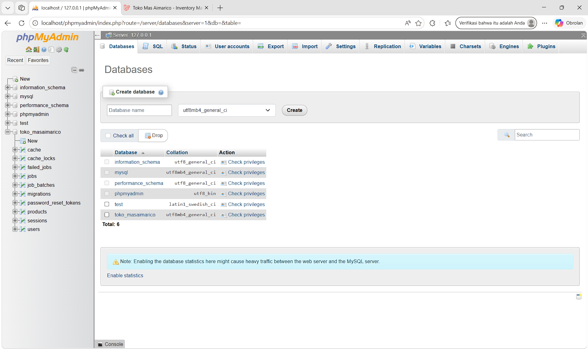

2. Tampilan Halaman Login, Masuk menggunakan akun Admin Aimarico.
   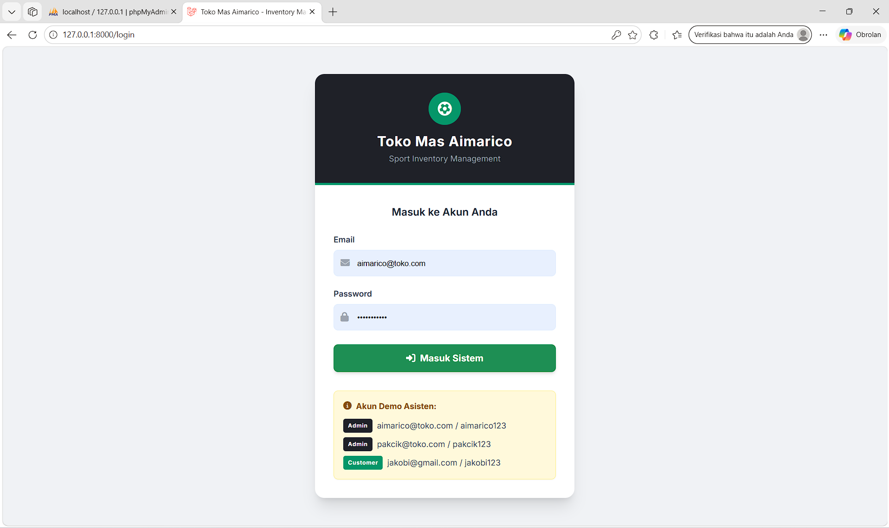

3. Tampilan Halaman Dashboard.
   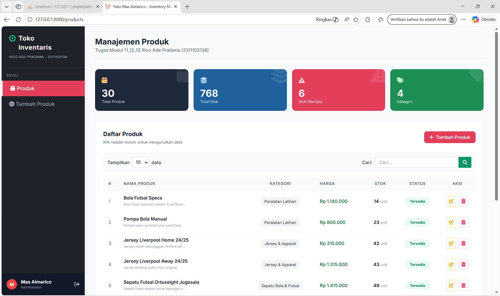

4. Tampilan Halaman Tambah Produk.
   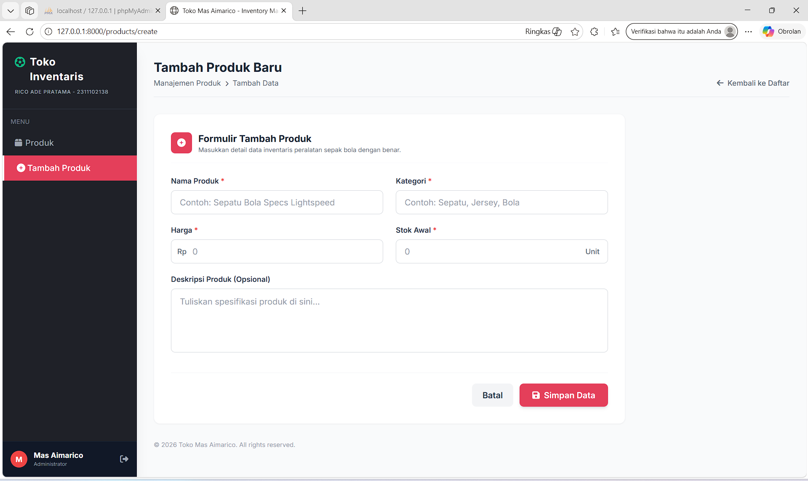

5. Misal Menambahkan Produk:

- Nama Barang: Topi Petr Cech
- Ketegori: Lainnya
- Harga: 50000
- Stok: 15
- Simpan Barang
  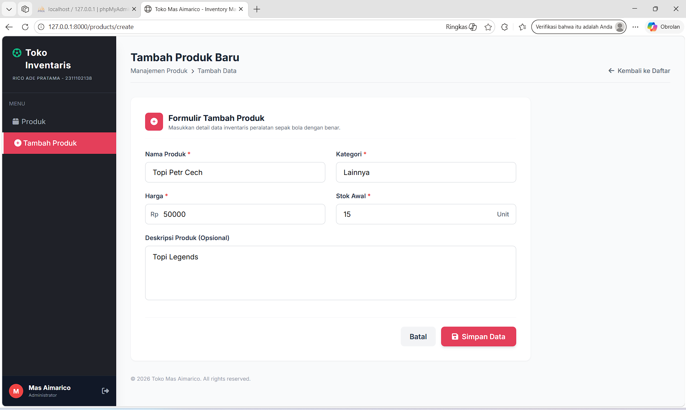

6.  Berhasil menambahkan Produk, Daftar Produk berubah. Serta "Total Produk", "Total Stok", "Kategori" juga ikut Berubah.
    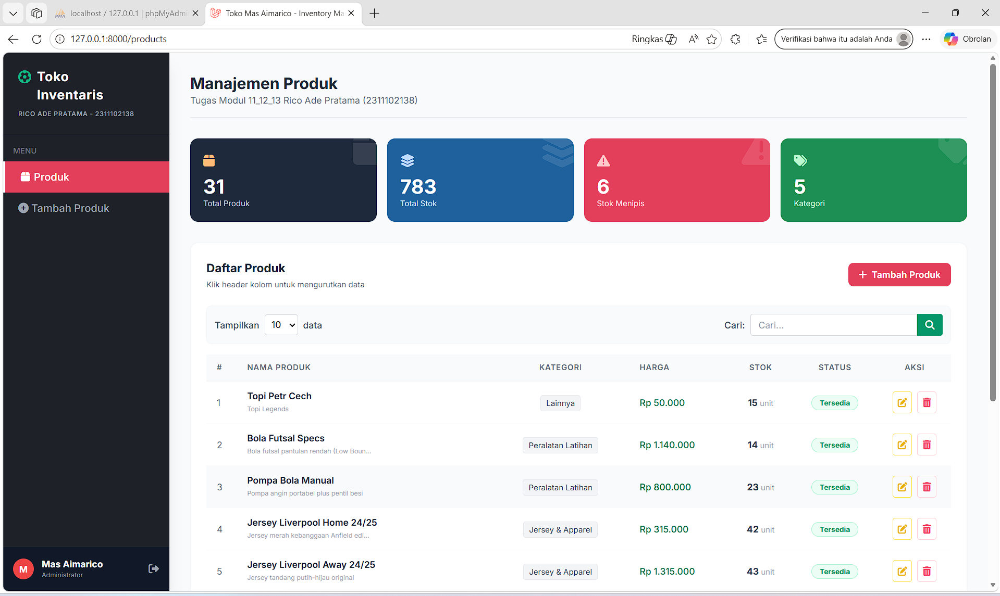

7.  Tampilan Fitur Edit Produk, dengan mengklik icon kuas kuning diaksi.
    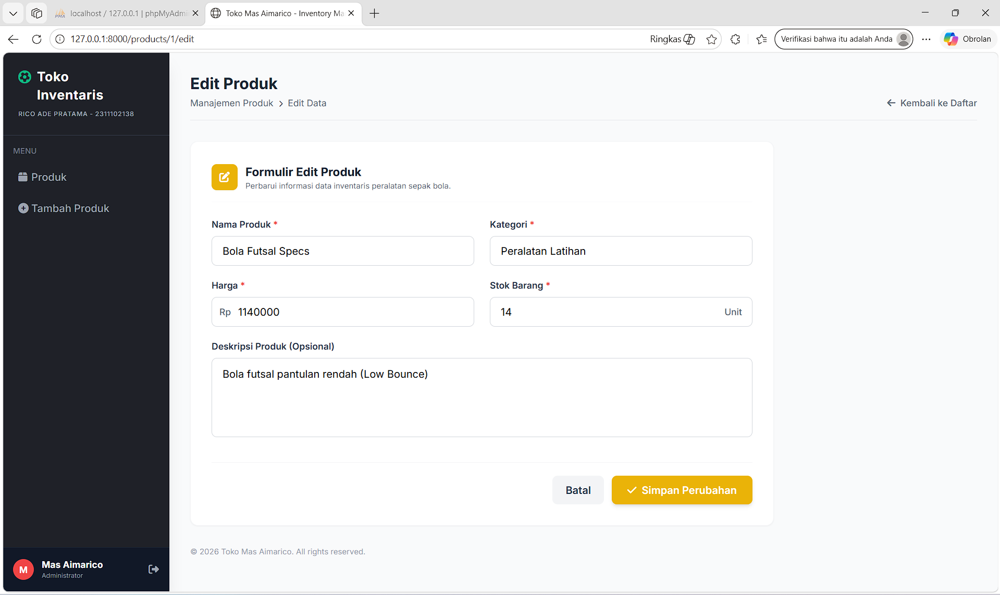

8.  Awal Data Produk Misal Seperti gambar diatas:

- Nama Barang: Bola Futsal Specs
- Kategori: Peralatan Latihan
- Harga: 1140000
- Stok: 14<br>

  <br>Edit Data Produk Misal:

- Nama Barang: Bola Futsal Specs
- Kategori: Bola
- Harga: 1150000
- Stok: 15<br>
  <br>Simpan Perubahan
  

9. Perubahan Berhasil Disimpan, Daftar Produk berubah bagian "Bola Futsal Specs".
   

10. Fitur Search / Pencarian Produk, dengan mengklik teks "Cari" dan mengetik Barang yang dicari, misal "Topi Petr Cech" dan barang berhasil ditemukan.
    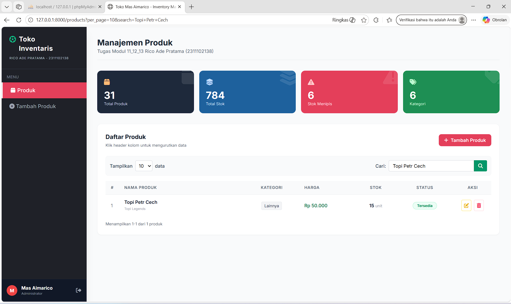

11. Fitur Delete / Hapus Barang, dengan mengklik icon sampah merah diaksi. Misal menghapus barang "Topi Petr Cech". Lalu akan muncul pop up "Hapus barang ini dari inventaris?" lalu ketik "ok" agar Barang benar-benar kehapus. Dan setelah berhasil menghapus Produk maka "Total Produk", "Total Stok", "Kategori" ikut Berubah.
    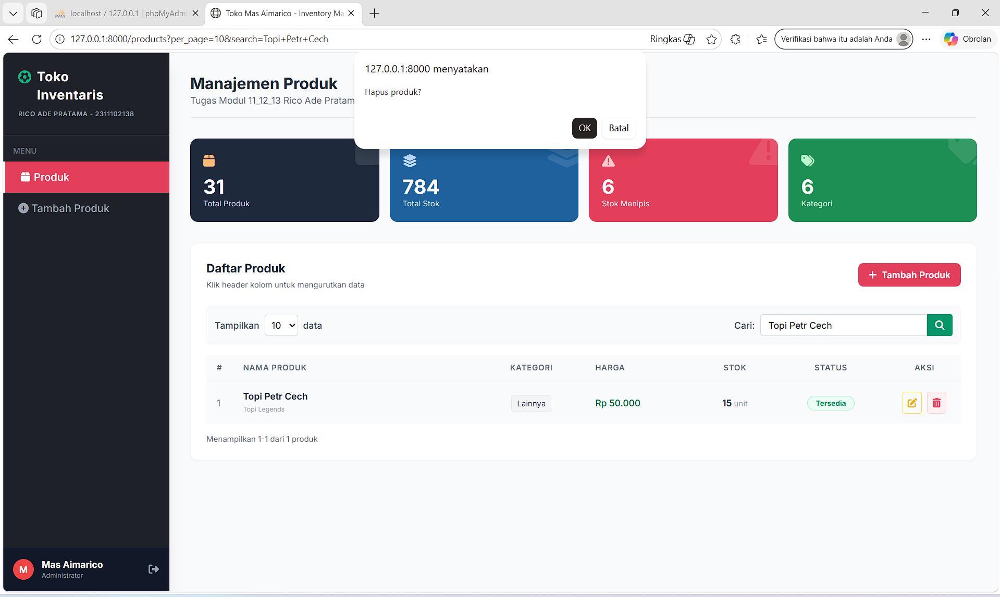

12. Tampilan log-out dan masuk ganti akun customer Mas Jakobi.
    

13. Tampilan masuk akun customer Mas Jakobi.
    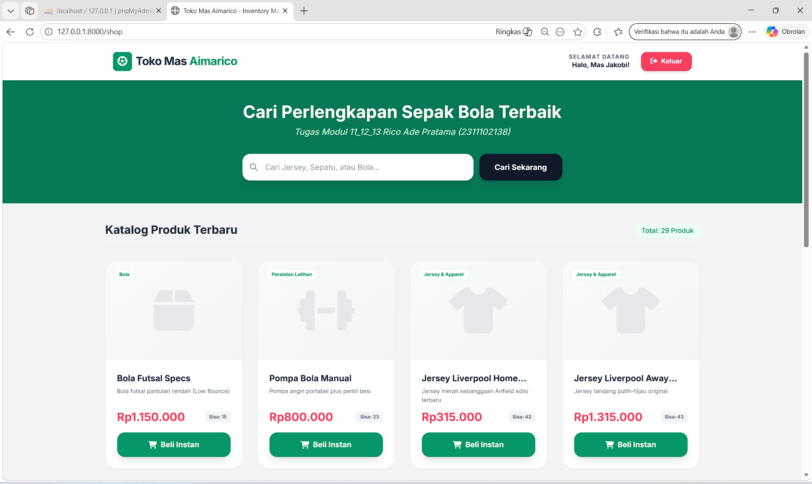

14. Fitur Search / Pencarian Produk, dengan mengklik teks "Cari" dan mengetik Barang yang dicari, misal "Jersey Liverpool" dan barang berhasil ditemukan.
    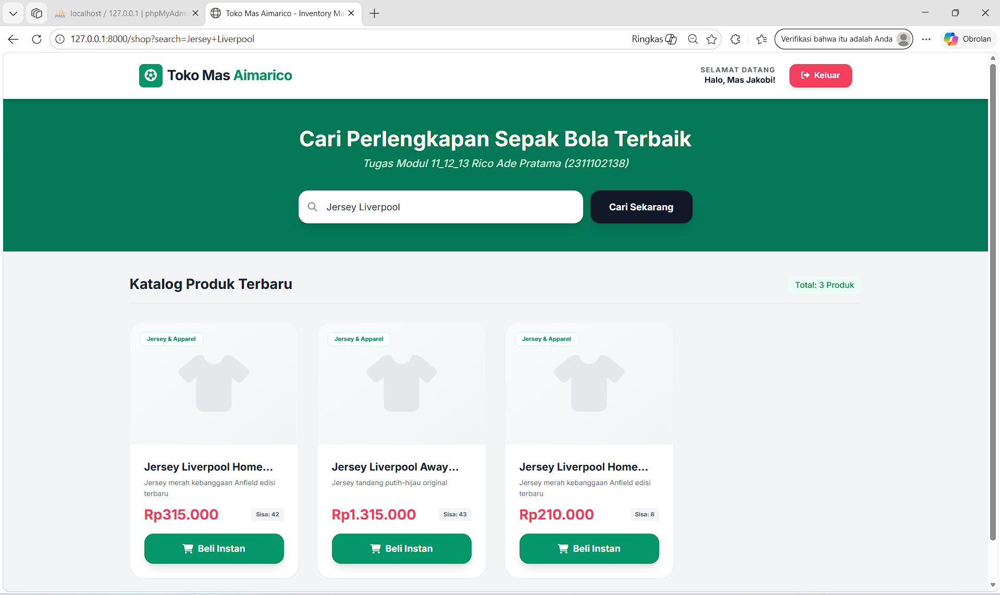

15. Mas Jakobi akhirnya bisa belanja di toko nya Mas Aimarico.
    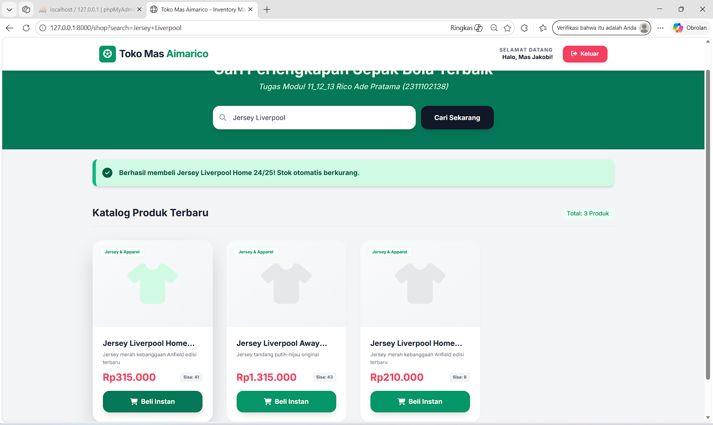

### Penjelasan Kode Per-Modul

Penjelasan Modul 11 Terletak di: `routes/web.php`, `app/Http/Controllers/ (ProductController, ShopController)`, dan `resources/views/`.
Menjelaskan tentang Dasar Framework. Menggunakan `* Route` Untuk mengatur alamat URL web (contoh: /shop untuk katalog). `Controller` Sebagai otak pemroses logika (contoh: mengambil data produk untuk ditampilkan). `Blade Engine` Sistem template UI (HTML + Tailwind) untuk menampilkan antarmuka aplikasi.

Penjelasan Modul 12 Terletak di: `database/migrations/`, `database/factories/`, `database/seeders/`, dan `app/Models/`. Menjelaskan Interaksi Database. Menggunakan `Migration` Untuk membuat kerangka tabel (kolom name, price, stock) di MySQL lewat kode PHP. `Factory & Seeder` Untuk menginjeksi 30 data dummy perlengkapan sepak bola dan akun awal secara otomatis. `Model (Eloquent ORM)` Untuk memanipulasi data database tanpa bahasa SQL manual (contoh: $product->decrement('stock') pada fitur Beli Instan).

Penjelasan Modul 13 Terletak di: `app/Http/Controllers/AuthController.php` dan `app/Http/Middleware/RoleMiddleware.php`. Menjelaskan Keamanan Authentication & Middleware, Menggunakan `Authentication` Sistem validasi email dan password terenkripsi untuk fitur Login dan Logout. `Middleware` Sebagai "satpam" pembatas hak akses (Role-Based). Mencegah Customer masuk ke halaman Dashboard Admin, dan mencegah Admin masuk ke halaman Katalog Belanja. Agar Mas Jakobi bisa nyaman dalam berbelanja.

## 3. Kesimpulan dan Penutup

Tugas Praktikum Modul 11, 12, dan 13 ini mengimplementasikan aplikasi web berbasis arsitektur MVC (Model-View-Controller) untuk sistem manajemen inventaris. Dengan fokus pada integrasi framework Laravel dan Tailwind CSS, proyek ini berhasil mengeksekusi operasi CRUD, pengelolaan database dinamis terstruktur (Migration, Factory, & Seeder), serta penerapan sistem keamanan otorisasi berbasis peran (Role-Based Middleware untuk Admin dan Customer). Cocok digunakan sebagai pembelajaran praktikum bagi mahasiswa program studi Informatika untuk membangun situs web modern.

## 4. Referensi

- [1] [Materi Modul 11, 12, 13](https://drive.google.com/drive/folders/1ug7dmm-aVF-NG9-YT5kT519HdGmkXaD-?usp=sharing)
- [2] [Laravel Documentation](https://laravel.com/)
- [3] [Eloquent ORM](https://laravel.com/docs/eloquent)
- [4] [Laravel Blade Templates](https://laravel.com/docs/blade)
- [5] [Laravel Resource Controllers](https://laravel.com/docs/controllers#resource-controllers)
