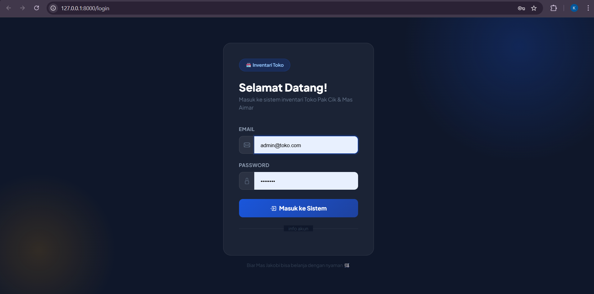
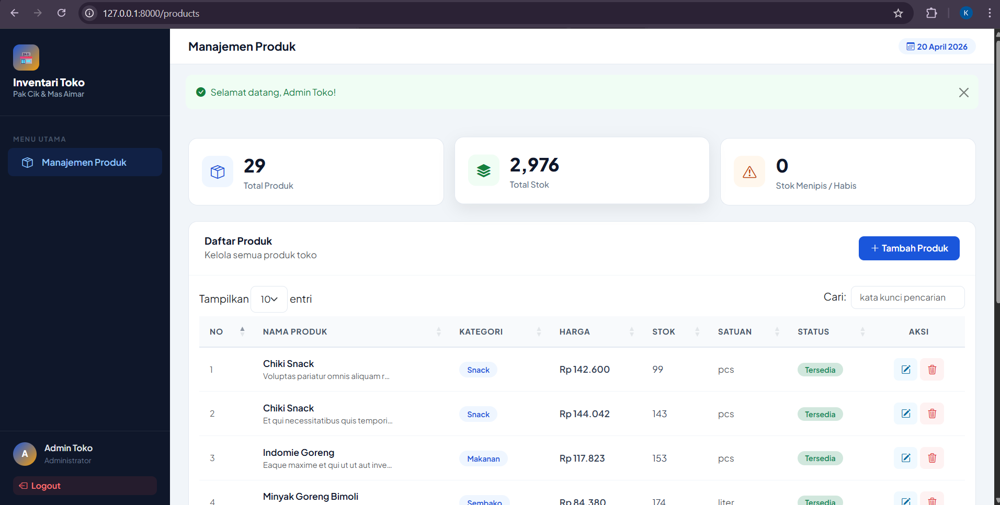
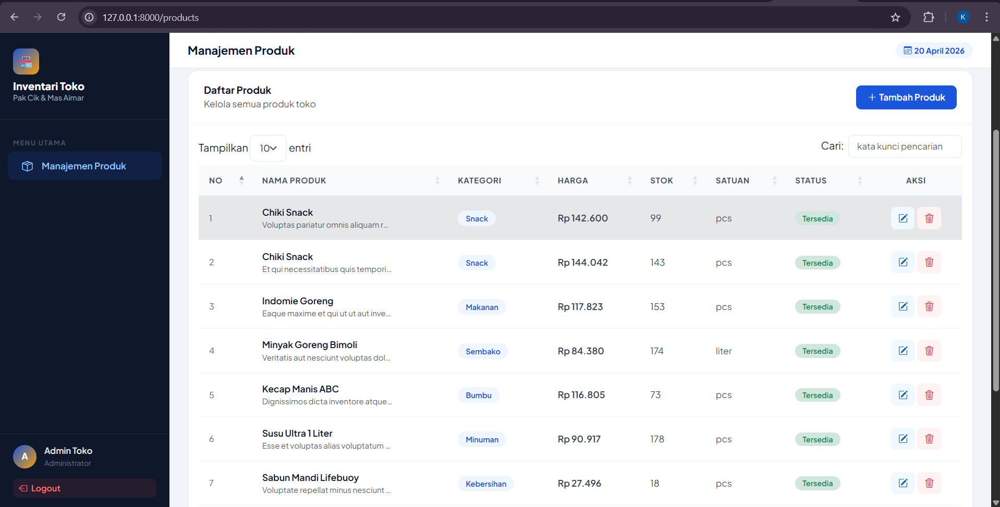
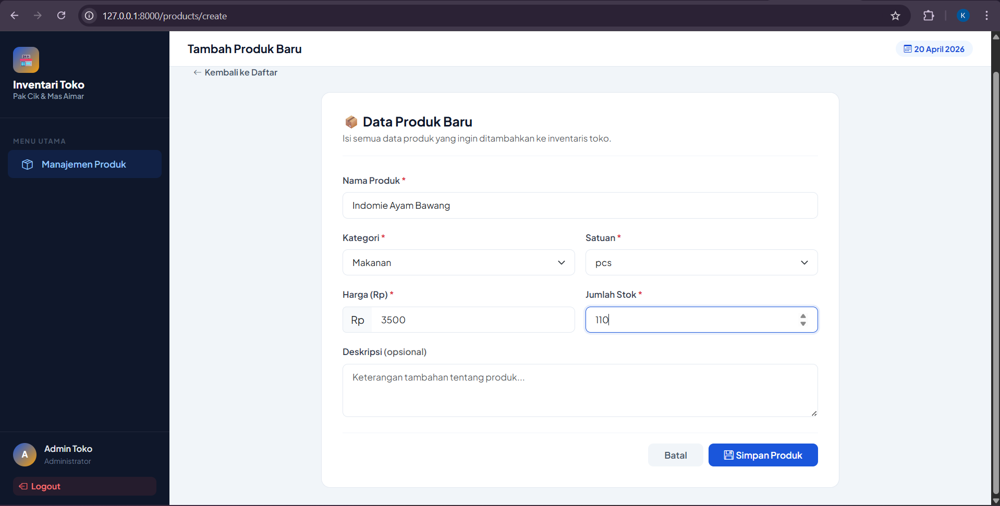
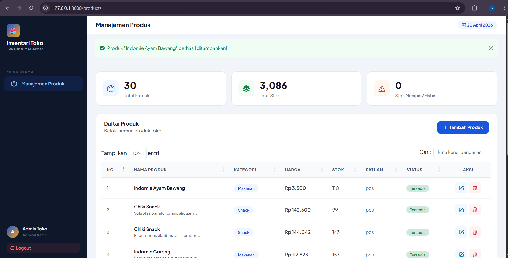
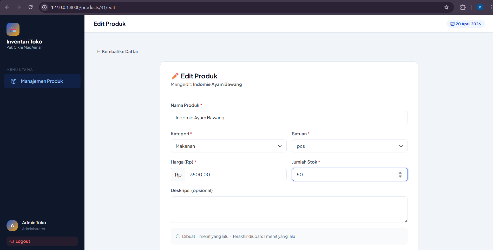
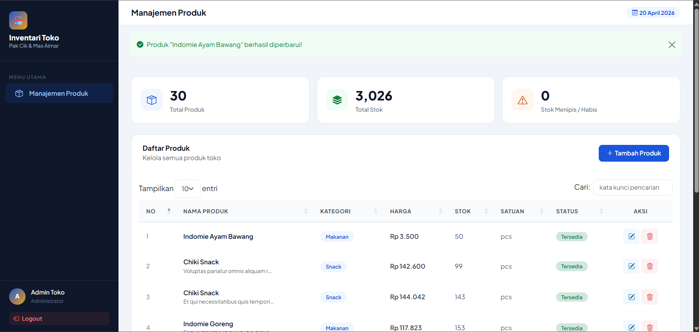
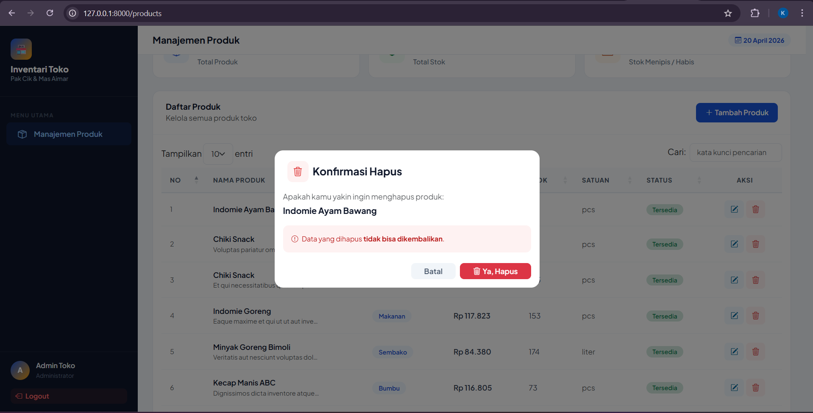
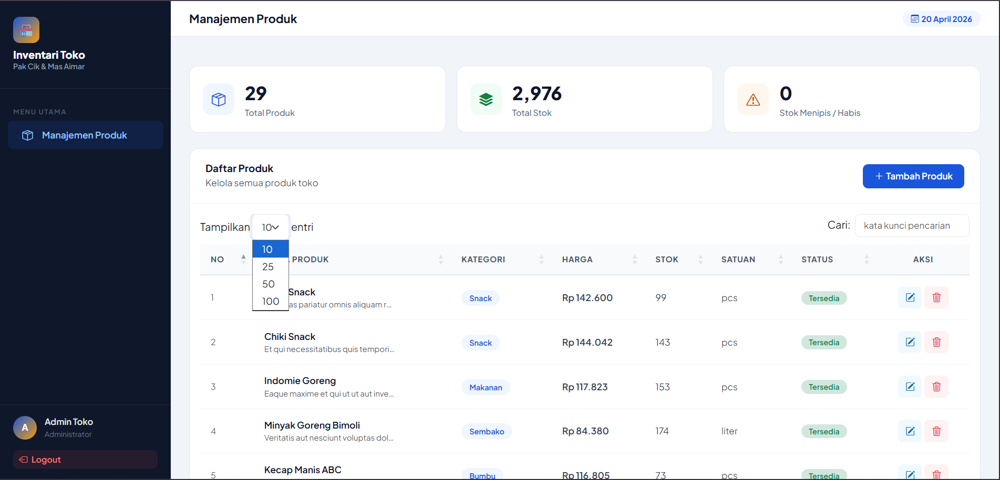

<div align="center">
  <br />
  <h1>LAPORAN PRAKTIKUM <br> APLIKASI BERBASIS PLATFORM</h1>
  <br />
  <h3>MODUL 11,12,13 <br> Laravel : CRUD Inventaris, Seeder, Factory, dan Authentication</h3>
  <br />
  
  <br />
  <br />
  <br />
  <h3>Disusun Oleh :</h3>
  <p>
    <strong>Kanasya Abdi Aziz</strong><br>
    <strong>2311102140</strong><br>
    <strong>S1 IF-11-01</strong>
  </p>
  <br />
  <h3>Dosen Pengampu :</h3>
  <p>
    <strong>Dimas Fanny Hebrasianto Permadi, S.ST., M.Kom</strong>
  </p>
  <br />
  <br />
  <h4>Asisten Praktikum :</h4>
  <strong>Apri Pandu Wicaksono</strong> <br>
  <strong>Rangga Pradarrell Fathi</strong>
  <br />
  <br />
  <br />
  <br />
  <h3>LABORATORIUM HIGH PERFORMANCE <br> FAKULTAS INFORMATIKA <br> UNIVERSITAS TELKOM PURWOKERTO <br> 2026</h3>
</div>

---

## A. Dasar Teori

### 1. Laravel
Laravel adalah salah satu *framework* PHP yang digunakan untuk membangun aplikasi web secara terstruktur, efisien, dan mudah dikembangkan. Laravel employs the **MVC (Model-View-Controller)** architecture, which makes the application development process more efficient since program, tampilan, and data processing are done in accordance with its functions. In this practice, Laravel is used to create an inventory application with features like product data analysis, user authentication, and database integration.

### 2. Konsep MVC (*Model-View-Controller*)
MVC adalah pola perancangan aplikasi yang membagi sistem menjadi tiga bagian utama: "Model", yang mengelola data dan berhubungan dengan database, dan "View", yang menampilkan antarmuka pengguna.

Controller mengatur logika aplikasi dan berfungsi sebagai penghubung antara Model dan View.
Konsep MVC membuat pengembangan kode program untuk fitur baru lebih mudah dan lebih teratur.

### 3. CRUD (*Create, Read, Update, Delete*)
CRUD adalah empat operasi dasar dalam pengelolaan data pada aplikasi:
- **Create**, digunakan untuk menambahkan data baru.
- **Read**, digunakan untuk menampilkan atau membaca data.
- **Update**, digunakan untuk mengubah data yang sudah ada.
- **Delete**, digunakan untuk menghapus data.

Aplikasi inventaris toko menggunakan CRUD untuk mengelola data produk, yang memungkinkan pengguna menambah, melihat, mengubah, dan menghapus informasi barang.

### 4. Database dan MySQL
Database adalah kumpulan data yang disimpan secara sistematis sehingga mudah dikelola dan diakses. Database berfungsi sebagai tempat penyimpanan data penting dalam pengembangan aplikasi web, termasuk data pengguna, produk, kategori, stok, dan transaksi.  
Database yang digunakan dalam praktikum ini adalah MySQL, sistem manajemen basis data relasional yang umum digunakan bersama Laravel. MySQL mendukung penyimpanan data dalam bentuk tabel yang saling berelasi, yang membuatnya ideal untuk aplikasi inventaris.

### 5. Migration
Fitur migrasi Laravel adalah fitur yang memungkinkan pengembang untuk memastikan struktur database konsisten, terutama ketika proyek dikerjakan secara bertahap atau kolaboratif. Ini memungkinkan pembuatan, perubahan, dan penghapusan tabel secara terstruktur tanpa harus menulis perintah SQL secara manual.

### 6. Seeder dan Factory
Seder secara otomatis mengisi database dengan data awal atau data dummy, sedangkan pabrik menghasilkan banyak data tiruan dengan format yang telah ditentukan.  
Seder dan pabrik sangat membantu dalam aplikasi inventaris agar tabel tidak kosong saat aplikasi dimulai. Oleh karena itu, aplikasi dapat diuji langsung dengan data contoh tanpa harus memasukkan semua data secara manual.

### 7. Eloquent ORM
Eloquent ORM adalah fitur Laravel yang memungkinkan interaksi dengan database dengan menggunakan representasi objek atau model. Dengan Eloquent, pengembang tidak selalu perlu menulis query SQL secara langsung karena model PHP memungkinkan pengambilan, penyimpanan, pembaruan, dan penghapusan data. Pada praktikum ini, Eloquent dikelola data produk, kategori, dan pengguna pada aplikasi inventaris.

### 8. Authentication dan Session
Proses verifikasi identitas pengguna sebelum mereka dapat mengakses sistem dikenal sebagai autentikasi. Autentikasi dapat diterapkan dalam Laravel dengan menggunakan sistem login berbasis "session". Session adalah mekanisme yang menyimpan data pengguna sementara di sisi server setelah login berhasil. Hanya pengguna tertentu yang dapat mengakses halaman yang dilindungi, seperti halaman manajemen produk, setelah sesi diidentifikasi oleh sistem.

### 9. DataTables
Plugin berbasis JavaScript bernama DataTables digunakan untuk membuat tampilan tabel lebih interaktif. Pencarian, pengurutan kolom, pagination, dan pengaturan jumlah data yang ditampilkan adalah fitur yang tersedia.  
DataTables digunakan pada halaman daftar produk dalam aplikasi inventaris toko untuk membuat pencarian dan pengelolaan data barang lebih mudah.

### 10. Bootstrap
Bootstrap adalah framework CSS yang digunakan untuk mempercepat pembuatan tampilan web yang responsif dan rapi. Dengan bantuan Bootstrap, komponen antarmuka seperti tombol, form, tabel, alert, dan modal dapat dibuat dengan lebih mudah. Dalam kasus ini, Bootstrap digunakan untuk mendukung tampilan form tambah/edit produk, tabel data, serta modal konfirmasi hapus untuk membuat antarmuka aplikasi lebih menarik dan mudah digunakan.

### 11. Inventaris Barang
Data barang yang dimiliki oleh suatu toko atau organisasi dapat dicatat, dikelola, dan dipantau melalui sistem inventaris barang. Aplikasi inventaris berbasis web mencatat data seperti nama, kode, kategori, harga, stok, dan status barang. Pencatatan menggunakan aplikasi ini lebih cepat, lebih akurat, dan lebih mudah digunakan dibandingkan dengan pencatatan manual.

---

## B. Penjelasan Kode

### 1. Sourcecode routes/web.php
```php
<?php

use App\Http\Controllers\AuthController;
use App\Http\Controllers\ProductController;
use Illuminate\Support\Facades\Route;

// Redirect root ke login
Route::get('/', function () {
    return redirect()->route('login');
});

// =====================
// AUTH ROUTES
// =====================
Route::get('/login', [AuthController::class, 'showLogin'])->name('login');
Route::post('/login', [AuthController::class, 'login'])->name('login.post');
Route::post('/logout', [AuthController::class, 'logout'])->name('logout');

// =====================
// PRODUCT ROUTES (protected - harus login)
// =====================
Route::middleware('auth')->group(function () {
    Route::resource('products', ProductController::class)->except(['show']);
});
```

### Penjelasan

Kode tersebut merupakan konfigurasi rute pada framework Laravel yang berfungsi untuk mengatur lalu lintas aplikasi dan memberikan batasan hak akses kepada pengguna. Pada bagian awal, kode ini menetapkan bahwa setiap pengguna yang mencoba mengakses alamat utama (root) akan secara otomatis dialihkan ke halaman login. Selanjutnya, terdapat rute Auth yang dikelola oleh AuthController, mencakup fungsi untuk menampilkan formulir login, memproses data autentikasi, serta fitur logout untuk mengakhiri sesi.

Untuk menjaga keamanan data, kode ini menggunakan Middleware 'auth' yang berfungsi sebagai filter keamanan; hanya pengguna yang sudah terverifikasi (sudah login) yang diizinkan untuk mengelola data produk. Di dalam grup keamanan tersebut, fungsi Route::resource digunakan untuk membangun rute CRUD (Create, Read, Update, Delete) secara otomatis yang terhubung ke ProductController. Namun, terdapat pengecualian melalui instruksi except(['show']), yang berarti aplikasi menyediakan semua fungsi pengelolaan produk seperti menambah, mengubah, dan menghapus, kecuali fitur untuk melihat detail produk secara individu di halaman khusus.

### 2. Sourcecode ProductController.php
```php
<?php

namespace App\Http\Controllers;

use App\Models\Product;
use Illuminate\Http\Request;

class ProductController extends Controller
{
    // Tampilkan semua produk
    public function index()
    {
        $products      = Product::latest()->get();
        $totalProducts = $products->count();
        $totalStock    = $products->sum('stock');
        $lowStock      = $products->where('stock', '<=', 10)->count();

        return view('products.index', compact('products', 'totalProducts', 'totalStock', 'lowStock'));
    }

    // Form tambah produk
    public function create()
    {
        return view('products.create');
    }

    // Simpan produk baru
    public function store(Request $request)
    {
        $request->validate([
            'name'        => 'required|string|max:255',
            'category'    => 'required|string|max:100',
            'description' => 'nullable|string',
            'price'       => 'required|numeric|min:0',
            'stock'       => 'required|integer|min:0',
            'unit'        => 'required|string|max:50',
        ], [
            'name.required'     => 'Nama produk wajib diisi.',
            'category.required' => 'Kategori wajib dipilih.',
            'price.required'    => 'Harga wajib diisi.',
            'price.numeric'     => 'Harga harus berupa angka.',
            'stock.required'    => 'Stok wajib diisi.',
            'stock.integer'     => 'Stok harus berupa angka bulat.',
            'unit.required'     => 'Satuan wajib dipilih.',
        ]);

        Product::create($request->all());

        return redirect()->route('products.index')
            ->with('success', 'Produk "' . $request->name . '" berhasil ditambahkan!');
    }

    // Form edit produk
    public function edit(Product $product)
    {
        return view('products.edit', compact('product'));
    }

    // Update produk
    public function update(Request $request, Product $product)
    {
        $request->validate([
            'name'        => 'required|string|max:255',
            'category'    => 'required|string|max:100',
            'description' => 'nullable|string',
            'price'       => 'required|numeric|min:0',
            'stock'       => 'required|integer|min:0',
            'unit'        => 'required|string|max:50',
        ], [
            'name.required'     => 'Nama produk wajib diisi.',
            'category.required' => 'Kategori wajib dipilih.',
            'price.required'    => 'Harga wajib diisi.',
            'price.numeric'     => 'Harga harus berupa angka.',
            'stock.required'    => 'Stok wajib diisi.',
            'stock.integer'     => 'Stok harus berupa angka bulat.',
            'unit.required'     => 'Satuan wajib dipilih.',
        ]);

        $product->update($request->all());

        return redirect()->route('products.index')
            ->with('success', 'Produk "' . $product->name . '" berhasil diperbarui!');
    }

    // Hapus produk
    public function destroy(Product $product)
    {
        $name = $product->name;
        $product->delete();

        return redirect()->route('products.index')
            ->with('success', 'Produk "' . $name . '" berhasil dihapus!');
    }
}
```

### Penjelasan

Kode ini adalah ProductController dalam framework Laravel yang bertugas sebagai otak operasional untuk mengelola data inventaris produk di dalam database. Secara keseluruhan, controller ini menangani siklus hidup data produk mulai dari menampilkan daftar, menambah, memperbarui, hingga menghapus data (CRUD).

Pada fungsi index, controller mengambil seluruh data produk terbaru dari database dan melakukan kalkulasi statistik sederhana, seperti menghitung total item, jumlah stok keseluruhan, serta mengidentifikasi produk yang stoknya menipis (di bawah 10 unit) untuk ditampilkan di halaman utama produk. Ketika pengguna ingin menambah atau mengubah data melalui fungsi store dan update, controller menjalankan sistem validasi yang ketat untuk memastikan informasi seperti nama, kategori, harga, dan stok diisi dengan format yang benar sebelum disimpan ke database. Jika terjadi kesalahan input, sistem akan memberikan pesan peringatan yang relevan kepada pengguna.

Setelah proses penyimpanan atau pembaruan berhasil, controller akan mengarahkan kembali pengguna ke halaman daftar produk sambil mengirimkan pesan sukses sebagai konfirmasi bahwa tindakan tersebut telah selesai dilakukan. Terakhir, fungsi destroy memungkinkan penghapusan data secara permanen dari sistem dengan tetap memberikan informasi nama produk mana yang telah berhasil dihapus. Secara arsitektural, controller ini menghubungkan Model (data produk) dengan View (tampilan antarmuka) agar pengelolaan inventaris berjalan dengan terstruktur dan aman.

### 3. Sourcecode Product.php
```php
<?php

namespace App\Models;

use Illuminate\Database\Eloquent\Factories\HasFactory;
use Illuminate\Database\Eloquent\Model;

class Product extends Model
{
    use HasFactory;

    protected $fillable = [
        'name',
        'category',
        'description',
        'price',
        'stock',
        'unit',
    ];

    // Format harga ke Rupiah
    public function getFormattedPriceAttribute(): string
    {
        return 'Rp ' . number_format($this->price, 0, ',', '.');
    }

    // Status stok
    public function getStockStatusAttribute(): string
    {
        if ($this->stock <= 0) return 'Habis';
        if ($this->stock <= 10) return 'Menipis';
        return 'Tersedia';
    }

    public function getStockBadgeAttribute(): string
    {
        if ($this->stock <= 0) return 'danger';
        if ($this->stock <= 10) return 'warning';
        return 'success';
    }
}
```

### Penjelasan

Kode ini adalah file Model Product yang berfungsi sebagai representasi dari tabel produk di database sekaligus menjadi jembatan antara logika kode dan data fisik menggunakan fitur Eloquent ORM di Laravel. Properti $fillable di dalamnya berperan sebagai pengaman data (mass assignment protection), yang menentukan kolom mana saja—seperti nama, kategori, deskripsi, harga, stok, dan satuan—yang diperbolehkan untuk diisi secara massal demi mencegah celah keamanan.

Selain sebagai wadah data, model ini juga dilengkapi dengan fitur Accessor, yaitu fungsi-fungsi otomatis yang mempermudah penyajian data ke antarmuka pengguna tanpa harus mengubah data asli di database. Misalnya, fungsi getFormattedPriceAttribute secara otomatis mengubah angka harga yang mentah menjadi format mata uang Rupiah yang rapi, sementara fungsi getStockStatusAttribute dan getStockBadgeAttribute bekerja untuk memberikan label status stok (seperti "Habis", "Menipis", atau "Tersedia") beserta kategori warnanya. Dengan adanya logika ini di dalam model, tampilan aplikasi menjadi lebih bersih karena logika presentasi data sudah dikelola secara terpusat dan otomatis.

### 4. Sourcecode Migration (2024_01_01_000002_create_products_table.php)
```php
<?php

use Illuminate\Database\Migrations\Migration;
use Illuminate\Database\Schema\Blueprint;
use Illuminate\Support\Facades\Schema;

return new class extends Migration
{
    public function up(): void
    {
        Schema::create('products', function (Blueprint $table) {
            $table->id();
            $table->string('name');
            $table->string('category');
            $table->text('description')->nullable();
            $table->decimal('price', 15, 2);
            $table->integer('stock');
            $table->string('unit')->default('pcs');
            $table->timestamps();
        });
    }

    public function down(): void
    {
        Schema::dropIfExists('products');
    }
};
```
### Penjelasan

Kode ini merupakan file Migration dalam Laravel yang berfungsi sebagai cetak biru (blueprint) atau pengendali versi untuk struktur tabel di database. Melalui metode up(), kode ini menginstruksikan sistem untuk membuat sebuah tabel baru bernama products dengan spesifikasi kolom yang detail, seperti id sebagai kunci utama, nama dan kategori produk, deskripsi yang bersifat opsional (nullable), harga dengan format angka desimal yang presisi, jumlah stok, serta satuan barang yang secara otomatis terisi "pcs" jika tidak ditentukan.

Selain mendefinisikan kolom data, file ini juga menyertakan timestamps() yang secara otomatis menciptakan kolom created_at dan updated_at untuk melacak waktu pembuatan serta perubahan data. Di sisi lain, terdapat metode down() yang berfungsi sebagai fitur pembatalan (rollback), yang akan menghapus tabel tersebut jika pengembang ingin mengulang atau membatalkan migrasi. Dengan menggunakan file migrasi ini, tim pengembang dapat memastikan bahwa struktur database yang digunakan akan selalu konsisten dan sama di setiap komputer atau lingkungan server yang berbeda.

### 5. Sourcecode DatabaseSeeder.php
```php
<?php

namespace Database\Seeders;

use Illuminate\Database\Seeder;

class DatabaseSeeder extends Seeder
{
    public function run(): void
    {
        $this->call([
            UserSeeder::class,
            ProductSeeder::class,
        ]);
    }
}
```

### Penjelasan

Kode ini merupakan file DatabaseSeeder utama dalam framework Laravel yang berfungsi sebagai konduktor atau pengatur jalannya pengisian data awal ke dalam database. Di dalam metode run(), terdapat perintah $this->call yang menginstruksikan Laravel untuk menjalankan kelas seeder lainnya secara berurutan, yaitu UserSeeder untuk mengisi data pengguna dan ProductSeeder untuk mengisi data produk.

Tujuan utama dari file ini adalah untuk mempermudah proses pengembangan dan pengujian aplikasi dengan menyediakan data contoh (dummy data) hanya dengan satu perintah baris kode. Dengan adanya seeder terpusat ini, pengembang tidak perlu mengisi data secara manual satu per satu ke dalam tabel setelah melakukan migrasi database, sehingga lingkungan kerja antar tim pengembang tetap sinkron dan siap digunakan dalam sekejap.

### 6. Sourcecode ProductFactory.php
```php
<?php

namespace Database\Factories;

use Illuminate\Database\Eloquent\Factories\Factory;

class ProductFactory extends Factory
{
    public function definition(): array
    {
        $products = [
            ['name' => 'Indomie Goreng',          'category' => 'Makanan',    'unit' => 'pcs'],
            ['name' => 'Beras Premium 5kg',        'category' => 'Sembako',    'unit' => 'kg'],
            ['name' => 'Minyak Goreng Bimoli',     'category' => 'Sembako',    'unit' => 'liter'],
            ['name' => 'Teh Botol Sosro',          'category' => 'Minuman',    'unit' => 'pcs'],
            ['name' => 'Kopi Kapal Api',           'category' => 'Minuman',    'unit' => 'pack'],
            ['name' => 'Gula Pasir',               'category' => 'Sembako',    'unit' => 'kg'],
            ['name' => 'Sabun Mandi Lifebuoy',     'category' => 'Kebersihan', 'unit' => 'pcs'],
            ['name' => 'Deterjen Rinso',           'category' => 'Kebersihan', 'unit' => 'pcs'],
            ['name' => 'Chiki Snack',              'category' => 'Snack',      'unit' => 'pcs'],
            ['name' => 'Biscuit Roma',             'category' => 'Snack',      'unit' => 'pcs'],
            ['name' => 'Kecap Manis ABC',          'category' => 'Bumbu',      'unit' => 'pcs'],
            ['name' => 'Sambal Indofood',          'category' => 'Bumbu',      'unit' => 'pcs'],
            ['name' => 'Aqua Galon',               'category' => 'Minuman',    'unit' => 'pcs'],
            ['name' => 'Susu Ultra 1 Liter',       'category' => 'Minuman',    'unit' => 'pcs'],
            ['name' => 'Tepung Terigu Segitiga',   'category' => 'Sembako',    'unit' => 'kg'],
        ];

        $product = $this->faker->randomElement($products);

        return [
            'name'        => $product['name'],
            'category'    => $product['category'],
            'description' => $this->faker->sentence(10),
            'price'       => $this->faker->numberBetween(1000, 150000),
            'stock'       => $this->faker->numberBetween(0, 200),
            'unit'        => $product['unit'],
        ];
    }
}
```

### Penjelasan

Kode ini merupakan ProductFactory dalam Laravel yang berfungsi sebagai "mesin otomatis" untuk menghasilkan data palsu (dummy data) yang bervariasi dan realistis untuk tabel produk. Di dalam metode definition(), terdapat daftar produk lokal yang umum ditemui, seperti Indomie, Beras, hingga Sabun Mandi, yang kemudian dipilih secara acak menggunakan fungsi randomElement. Selain mengambil data dari daftar tersebut, factory ini juga memanfaatkan pustaka Faker untuk menghasilkan deskripsi kalimat secara otomatis, menentukan harga acak dalam rentang Rp1.000 hingga Rp150.000, serta mengatur jumlah stok secara random antara 0 sampai 200 unit.

Penggunaan factory ini sangat krusial dalam tahap pengembangan dan pengujian aplikasi karena memungkinkan pengembang untuk mengisi database dengan ratusan hingga ribuan data produk hanya dalam hitungan detik. Dengan data yang terlihat nyata dan memiliki variasi kategori serta satuan (seperti kg, liter, atau pcs), pengembang dapat menguji apakah antarmuka pengguna, fitur pencarian, dan logika stok sudah berjalan dengan baik sebelum aplikasi benar-benar digunakan dengan data asli.

---

## C. Penjelasan Implementasi Sistem

Implementasi sistem ini dibangun menggunakan arsitektur Model-View-Controller (MVC) pada framework Laravel untuk mengelola inventaris produk secara terstruktur dan aman. Sistem dimulai dari lapisan Database, di mana struktur tabel didefinisikan melalui Migration untuk menjamin konsistensi skema, sementara pengisian data awal dilakukan secara otomatis menggunakan Factory dan Seeder guna menghasilkan data produk yang realistis untuk keperluan pengujian. Di sisi keamanan, sistem menerapkan Middleware Autentikasi yang memastikan bahwa fitur pengelolaan produk hanya dapat diakses oleh pengguna yang telah masuk melalui sistem login yang terintegrasi.

Pada inti logika aplikasi, ProductController bertindak sebagai pengelola alur data yang menghubungkan antarmuka pengguna dengan database. Controller ini menangani seluruh siklus CRUD, mulai dari melakukan kalkulasi statistik stok pada halaman utama, menjalankan validasi input yang ketat untuk menjaga integritas data, hingga memberikan umpan balik berupa pesan sukses setelah operasi berhasil dilakukan. Di sisi data, Model Product diperkaya dengan fitur Accessor yang secara cerdas memformat data mentah dari database, seperti mengubah angka menjadi format mata uang Rupiah dan memberikan label warna otomatis (badge) berdasarkan status stok, sehingga informasi yang disajikan kepada pengguna menjadi lebih intuitif dan mudah dipahami.

---

## D. Hasil Tampilan 

### Halaman Login


Untuk mengakses dashboard dan fitur manajemen produk, pengguna harus memasukkan alamat email dan password mereka di halaman login sistem.

---

### Halaman Dashboard


Dashboard menampilkan daftar produk terbaru yang masuk ke dalam sistem. Ini juga menampilkan ringkasan data inventaris seperti total produk, total stok, stok rendah, dan stok habis.

---

### Halaman Daftar Produk


Halaman daftar produk menampilkan tabel dengan semua data produk, termasuk nama, deskripsi, stok, harga, dan tombol untuk mengubah atau menghapus data.

---

### Halaman Tambah Produk


Untuk memasukkan data produk baru ke dalam database, pengguna harus mengisi nama, deskripsi, stok, dan harga produk pada halaman tambah produk sebelum data disimpan.

---

### Hasil Berhasil Menambah Produk


Setelah data disimpan dengan sukses, sistem memberikan notifikasi kepada pengguna bahwa produk telah ditambahkan. Data yang baru ditambahkan juga ditampilkan secara langsung pada daftar produk.

---

### Halaman Edit Produk


Untuk memperbarui data produk yang sudah ada, halaman edit produk digunakan. Form ini menampilkan data lama agar dapat diubah sesuai kebutuhan.

---

### Hasil Berhasil Update Produk


Setelah proses edit selesai, notifikasi diberikan oleh sistem bahwa data produk telah diperbarui dengan sukses.

---

### Modal Konfirmasi Hapus


Untuk mencegah penghapusan data secara tidak sengaja, sistem akan menampilkan modal konfirmasi sebelum data dihapus.

---

### Hasil Berhasil Hapus Produk


Setelah pengguna menekan tombol "hapus" pada modal konfirmasi, data akan dihapus dari database. Setelah selesai, sistem menampilkan notifikasi bahwa produk dihapus dengan sukses.

---

### Dropdown Profil pada Dashboard


Pada bagian atas tabel daftar produk, terdapat dropdown "Tampilkan" yang berfungsi untuk mengatur jumlah entitas barang yang ingin ditampilkan dalam satu halaman, mulai dari 10 hingga 100 data, guna memudahkan pengguna dalam meninjau stok barang secara fleksibel.

---

## E. Kesimpulan

Pada praktikum modul ini, telah berhasil dikembangkan aplikasi web "Inventari Toko Pak Cik & Mas Aimar" menggunakan framework Laravel yang mengedepankan efisiensi pengelolaan stok barang.

Aplikasi ini mengintegrasikan fitur CRUD fungsional untuk manajemen produk yang dilengkapi dengan logika bisnis cerdas, seperti pemformatan mata uang otomatis dan sistem deteksi stok kritis. Keamanan sistem dijamin melalui Sistem Autentikasi dan Middleware, sementara antarmuka pengguna didesain secara interaktif dengan penambahan fitur navigasi seperti filter jumlah tampilan data (entries) dan pencarian untuk meningkatkan pengalaman pengguna (User Experience).

Secara teknis, penerapan arsitektur MVC serta fitur pendukung Laravel seperti Migration, Factories, dan Seeders terbukti mempermudah standarisasi basis data dan mempercepat proses pengembangan. Proyek ini berhasil menciptakan solusi digital yang terorganisir, aman, dan siap digunakan untuk memantau inventaris secara real-time.
---

## Referensi

[1] Modul Praktikum Aplikasi Berbasis Platform (ABP) Modul 11  
[2] Modul Praktikum Aplikasi Berbasis Platform (ABP) Modul 12  
[3] Modul Praktikum Aplikasi Berbasis Platform (ABP) Modul 13  
[4] W3Schools. https://www.w3schools.com  