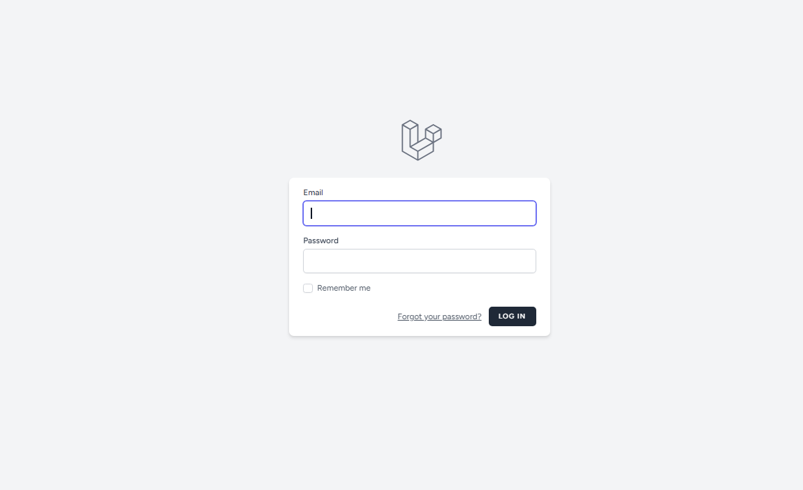
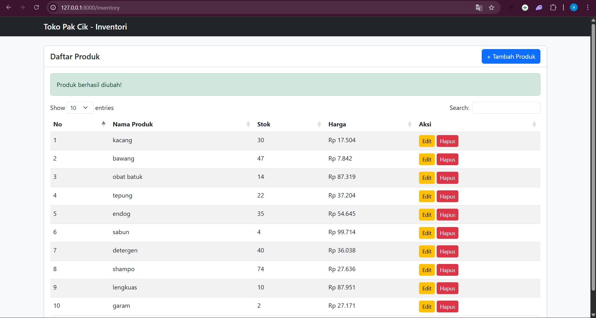
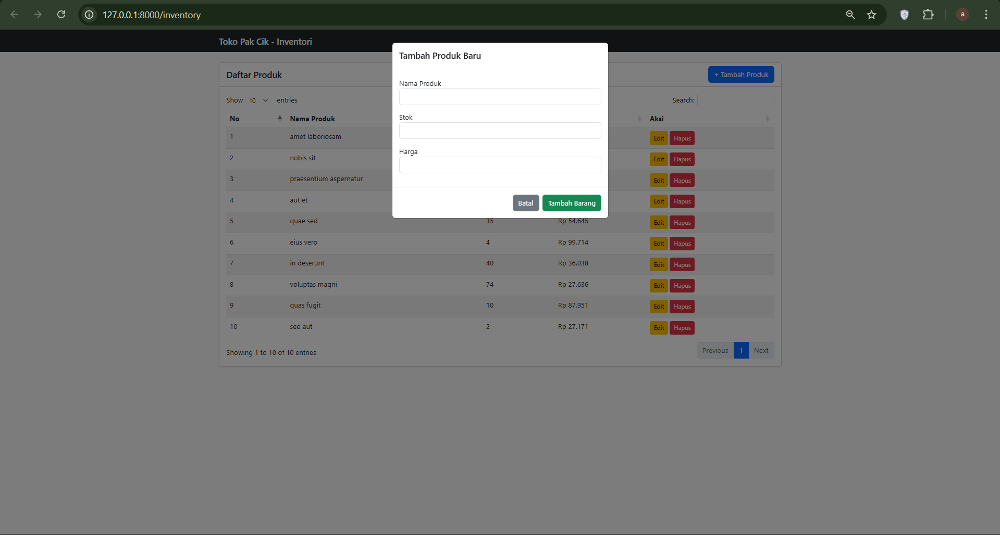
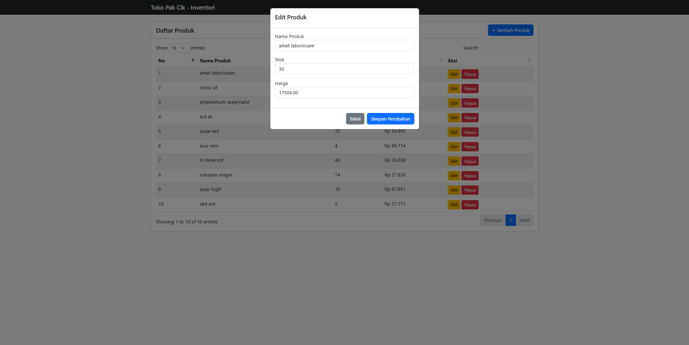
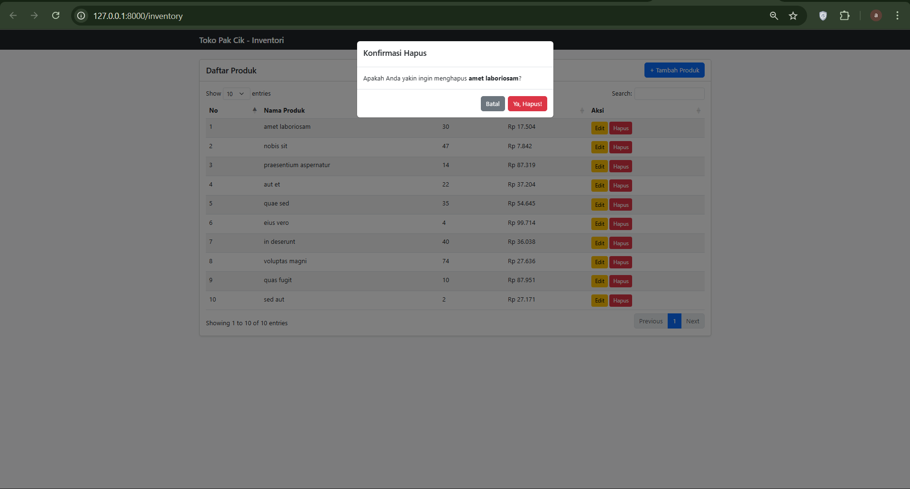

<div align="center">
  <br />
  <h1>LAPORAN PRAKTIKUM <br>APLIKASI BERBASIS PLATFORM</h1>
  <br />
  <h3>MODUL 11, 12 & 13 <br> Laravel Aplikasi Inventori Produk </h3>
  <br />
  <br />
  
  <br />
  <br />
  <br />
  <h3>Disusun Oleh :</h3>
  <p>
    <strong>Syamsul Adam</strong><br>
    <strong>2311102144</strong><br>
    <strong>S1 IF-11-01</strong>
  </p>
  <br />
  <h3>Dosen Pengampu :</h3>
  <p>
    <strong>Dimas Fanny Hebrasianto Permadi, S.ST., M.Kom</strong>
  </p>
  <br />
  <h4>Asisten Praktikum :</h4>
  <strong>Apri Pandu Wicaksono</strong> <br>
  <strong>Rangga Pradarrell Fathi</strong>
  <br />
  <h3>LABORATORIUM HIGH PERFORMANCE
 <br>FAKULTAS INFORMATIKA <br>UNIVERSITAS TELKOM PURWOKERTO <br>2026</h3>
</div>

---

## 1. Implementasi Sistem (Kebutuhan Fungsional)

Sistem **Inventori Produk** ini dibangun menggunakan framework Laravel dengan pola arsitektur **MVC (Model-View-Controller)** dan memanfaatkan **PostgreSQL** sebagai sistem manajemen basis data relasional. Sistem mencakup fitur-fitur utama sebagai berikut:

- **Autentikasi Pengguna**: Login dan logout berbasis sesi (*session-based*) menggunakan **Laravel Breeze**, sehingga seluruh halaman hanya dapat diakses oleh pengguna yang telah terautentikasi.
- **CRUD Produk**: Pengelolaan data produk secara penuh, meliputi operasi *Create*, *Read*, *Update*, dan *Delete*, yang dilindungi oleh middleware autentikasi.
- **PostgreSQL Database**: Penyimpanan data menggunakan PostgreSQL sebagai basis data relasional yang andal dan skalabel.
- **Pagination**: Daftar produk ditampilkan secara terpaginasi (10 data per halaman) untuk meningkatkan performa dan keterbacaan.
- **Modal Konfirmasi Delete**: Penghapusan data produk dilakukan melalui modal konfirmasi interaktif untuk mencegah penghapusan data yang tidak disengaja.
- **Tampilan UI Navy Estetik**: Antarmuka pengguna menggunakan tema warna navy gradient yang bersih dan modern berbasis **Bootstrap 5**, memberikan pengalaman visual yang konsisten dan profesional.

---

## 2. Penjelasan Kode Sumber

### 2.1 Migration Struktur Tabel Database

Kode program ini merupakan file Migration pada framework Laravel yang berfungsi untuk mendefinisikan struktur tabel database guna mendukung sistem autentikasi pengguna secara otomatis. Dalam migrasi ini, dibuat tiga tabel utama yaitu tabel users untuk menyimpan data kredensial pengguna seperti nama, email unik, dan password terenkripsi; tabel password_reset_tokens yang digunakan sebagai mekanisme keamanan saat pengguna melakukan reset kata sandi; serta tabel sessions yang bertugas menyimpan data aktivitas sesi pengguna, alamat IP, dan user agent untuk memastikan manajemen login yang aman dan terintegrasi dalam aplikasi "Toko Pak Cik".

```php
<?php

use Illuminate\Database\Migrations\Migration;
use Illuminate\Database\Schema\Blueprint;
use Illuminate\Support\Facades\Schema;

return new class extends Migration
{
    public function up(): void
    {
        Schema::create('users', function (Blueprint $table) {
            $table->id();
            $table->string('name');
            $table->string('email')->unique();
            $table->timestamp('email_verified_at')->nullable();
            $table->string('password');
            $table->rememberToken();
            $table->timestamps();
        });

        Schema::create('password_reset_tokens', function (Blueprint $table) {
            $table->string('email')->primary();
            $table->string('token');
            $table->timestamp('created_at')->nullable();
        });

        Schema::create('sessions', function (Blueprint $table) {
            $table->string('id')->primary();
            $table->foreignId('user_id')->nullable()->index();
            $table->string('ip_address', 45)->nullable();
            $table->text('user_agent')->nullable();
            $table->longText('payload');
            $table->integer('last_activity')->index();
        });
    }

    
    public function down(): void
    {
        Schema::dropIfExists('users');
        Schema::dropIfExists('password_reset_tokens');
        Schema::dropIfExists('sessions');
    }
};

```

---

### 2.2 Model `Product.php`

Kode program ini mendefinisikan sebuah Model bernama Product yang berfungsi sebagai representasi objek database dalam pola arsitektur MVC (Model-View-Controller) pada framework Laravel. Dengan memanfaatkan Eloquent ORM, model ini menghubungkan aplikasi secara langsung dengan tabel products di database, di mana properti $fillable digunakan untuk mengimplementasikan fitur Mass Assignment guna menentukan kolom mana saja—yaitu nama_produk, stok, dan harga—yang diizinkan untuk diisi atau dimanipulasi datanya secara aman demi mencegah celah keamanan pada aplikasi. *File Referensi: `app/Models/Product.php`*

```php
<?php

namespace App\Models;

use Illuminate\Database\Eloquent\Factories\HasFactory;
use Illuminate\Database\Eloquent\Model;

class Product extends Model
{
    use HasFactory;

    protected $fillable = ['nama_produk', 'stok', 'harga'];
}
```

---

### 2.3 Database Seeder Data Awal Produk

Kode program ini merupakan class DatabaseSeeder yang berfungsi untuk mengisi database secara otomatis dengan data awal atau data simulasi (dummy data) melalui fitur Database Seeding di Laravel. Dengan memanggil method Product::factory(10)->create(), sistem akan secara otomatis menginstruksikan Model Factory untuk menghasilkan 10 data produk secara acak ke dalam tabel database, sehingga memudahkan pengembang dalam melakukan pengujian fungsionalitas aplikasi dan tampilan antarmuka tanpa harus menginput data satu per satu secara manual. *File Referensi: `database/seeders/DatabaseSeeder.php`*

```php
<?php

namespace Database\Seeders;

use App\Models\User;
use Illuminate\Database\Console\Seeds\WithoutModelEvents;
use Illuminate\Database\Seeder;

class DatabaseSeeder extends Seeder
{
    use WithoutModelEvents;

    
    public function run(): void {
    \App\Models\Product::factory(10)->create();
}
}

```

Seeder ini memanggil `ProductSeeder` melalui mekanisme factory Laravel sehingga data produk dibuat secara acak dan realistis. Akun default dapat langsung digunakan untuk login ke sistem dengan kredensial:
- **Email**: `admin@gmail.com`
- **Password**: `12345678`

---

### 2.4 Routes `web.php`

Kode program ini merupakan konfigurasi Routing pada file web.php yang berfungsi sebagai pengatur alur lalu lintas (jalur URL) dalam aplikasi. Penggunaan Route::middleware('auth')->group() bertujuan untuk mengimplementasikan sistem keamanan terpusat, di mana seluruh rute di dalamnya, termasuk rute pengelolaan profil dan rute operasional inventori seperti CRUD produk (index, store, update, destroy), diproteksi secara ketat sehingga hanya dapat diakses oleh pengguna yang telah melakukan autentikasi (login). Dengan struktur ini, aplikasi memastikan bahwa data sensitif pada inventori "Toko Pak Cik" terlindungi dari akses publik yang tidak sah. *File Referensi: `routes/web.php`*

```php
<?php

use App\Http\Controllers\ProfileController;
use Illuminate\Support\Facades\Route;

Route::get('/', function () {
    return view('welcome');
});

Route::get('/dashboard', function () {
    return view('dashboard');
})->middleware(['auth', 'verified'])->name('dashboard');


use App\Http\Controllers\ProductController; 

Route::middleware('auth')->group(function () {

    Route::get('/profile', [ProfileController::class, 'edit'])->name('profile.edit');
    Route::patch('/profile', [ProfileController::class, 'update'])->name('profile.update');
    Route::delete('/profile', [ProfileController::class, 'destroy'])->name('profile.destroy');

    Route::get('/inventory', [ProductController::class, 'index'])->name('inventory.index');
    Route::post('/inventory', [ProductController::class, 'store'])->name('inventory.store');
    Route::put('/inventory/{id}', [ProductController::class, 'update'])->name('inventory.update');
    Route::delete('/inventory/{id}', [ProductController::class, 'destroy'])->name('inventory.destroy');
});
require __DIR__.'/auth.php';

```

---


### 2.5 View Layout Utama (`layouts/app.blade.php`)

Kode program ini merupakan file Master Layout utama aplikasi yang berfungsi sebagai kerangka dasar (template) untuk seluruh halaman web setelah pengguna berhasil melakukan autentikasi. File ini mengintegrasikan elemen-elemen krusial seperti meta tag keamanan CSRF, pemanggilan aset CSS dan JavaScript melalui Vite, serta penyertaan komponen navigasi secara konsisten menggunakan direktif @include('layouts.navigation'). Dengan memanfaatkan variabel khusus {{ $header }} untuk judul halaman dinamis dan {{ $slot }} sebagai wadah konten utama, layout ini memungkinkan pengembang untuk menerapkan konsep pewarisan tampilan (template inheritance) yang rapi, efisien, dan seragam di seluruh modul aplikasi seperti Dashboard dan Inventory. `resources/views/layouts/app.blade.php`*

```html
<!DOCTYPE html>
<html lang="{{ str_replace('_', '-', app()->getLocale()) }}">
    <head>
        <meta charset="utf-8">
        <meta name="viewport" content="width=device-width, initial-scale=1">
        <meta name="csrf-token" content="{{ csrf_token() }}">

        <title>{{ config('app.name', 'Laravel') }}</title>

        <!-- Fonts -->
        <link rel="preconnect" href="https://fonts.bunny.net">
        <link href="https://fonts.bunny.net/css?family=figtree:400,500,600&display=swap" rel="stylesheet" />

        <!-- Scripts -->
        @vite(['resources/css/app.css', 'resources/js/app.js'])
    </head>
    <body class="font-sans antialiased">
        <div class="min-h-screen bg-gray-100">
            @include('layouts.navigation')

            <!-- Page Heading -->
            @isset($header)
                <header class="bg-white shadow">
                    <div class="max-w-7xl mx-auto py-6 px-4 sm:px-6 lg:px-8">
                        {{ $header }}
                    </div>
                </header>
            @endisset

            <!-- Page Content -->
            <main>
                {{ $slot }}
            </main>
        </div>
    </body>
</html>

```

---

### 2.7 View Halaman Login (`auth/login.blade.php`)

Kode program ini merupakan halaman antarmuka pengguna (View) untuk fitur login yang dibangun menggunakan komponen Blade pada framework Laravel. Halaman ini menggunakan wrapper <x-guest-layout> untuk menerapkan desain khusus tamu dan menyertakan formulir dengan metode POST yang diarahkan ke rute autentikasi. Di dalamnya terdapat fitur keamanan CSRF protection (@csrf), validasi input secara real-time menggunakan komponen <x-input-error>, serta fungsionalitas pendukung seperti opsi "Remember Me" dan tautan pemulihan kata sandi, yang secara keseluruhan bertujuan untuk memberikan pengalaman autentikasi pengguna yang aman dan responsif. *File Referensi: `resources/views/auth/login.blade.php`*

```html
<x-guest-layout>
    <!-- Session Status -->
    <x-auth-session-status class="mb-4" :status="session('status')" />

    <form method="POST" action="{{ route('login') }}">
        @csrf

        <!-- Email Address -->
        <div>
            <x-input-label for="email" :value="__('Email')" />
            <x-text-input id="email" class="block mt-1 w-full" type="email" name="email" :value="old('email')" required autofocus autocomplete="username" />
            <x-input-error :messages="$errors->get('email')" class="mt-2" />
        </div>

        <!-- Password -->
        <div class="mt-4">
            <x-input-label for="password" :value="__('Password')" />

            <x-text-input id="password" class="block mt-1 w-full"
                            type="password"
                            name="password"
                            required autocomplete="current-password" />

            <x-input-error :messages="$errors->get('password')" class="mt-2" />
        </div>

        <!-- Remember Me -->
        <div class="block mt-4">
            <label for="remember_me" class="inline-flex items-center">
                <input id="remember_me" type="checkbox" class="rounded border-gray-300 text-indigo-600 shadow-sm focus:ring-indigo-500" name="remember">
                <span class="ms-2 text-sm text-gray-600">{{ __('Remember me') }}</span>
            </label>
        </div>

        <div class="flex items-center justify-end mt-4">
            @if (Route::has('password.request'))
                <a class="underline text-sm text-gray-600 hover:text-gray-900 rounded-md focus:outline-none focus:ring-2 focus:ring-offset-2 focus:ring-indigo-500" href="{{ route('password.request') }}">
                    {{ __('Forgot your password?') }}
                </a>
            @endif

            <x-primary-button class="ms-3">
                {{ __('Log in') }}
            </x-primary-button>
        </div>
    </form>
</x-guest-layout>

```

---

### 2.8 View Daftar Produk (`products/index.blade.php`)

Kode program ini merupakan halaman antarmuka utama untuk modul inventori "Toko Pak Cik" yang berfungsi menyajikan data produk dalam bentuk tabel interaktif. Halaman ini mengintegrasikan framework Bootstrap 5 untuk desain responsif dan library DataTables guna memberikan fitur pencarian, pengurutan, serta penomoran otomatis yang memudahkan pengguna dalam mengelola informasi barang. Selain menampilkan data melalui direktif @foreach, file ini juga memuat berbagai komponen Modal untuk menjalankan fungsi CRUD (Create, Read, Update, Delete) dalam satu halaman tanpa perlu melakukan refresh penuh, serta dilengkapi dengan sistem notifikasi berbasis session flash message untuk memberikan umpan balik langsung saat operasi data berhasil dilakukan. *File Referensi: `resources/views/products/index.blade.php`*

```html
<!DOCTYPE html>
<html lang="en">
<head>
    <meta charset="UTF-8">
    <meta name="viewport" content="width=device-width, initial-scale=1.0">
    <title>Inventori Toko Pak Cik</title>
    <link href="https://cdn.jsdelivr.net/npm/bootstrap@5.3.0/dist/css/bootstrap.min.css" rel="stylesheet">
    <link href="https://cdn.datatables.net/1.13.4/css/dataTables.bootstrap5.min.css" rel="stylesheet">
</head>
<body class="bg-light">

<nav class="navbar navbar-dark bg-dark mb-4">
    <div class="container">
        <span class="navbar-brand mb-0 h1">Toko Pak Cik - Inventori</span>
    </div>
</nav>

<div class="container">
    <div class="card shadow-sm">
        <div class="card-header bg-white d-flex justify-content-between align-items-center">
            <h5 class="mb-0">Daftar Produk</h5>
            <button class="btn btn-primary" data-bs-toggle="modal" data-bs-target="#modalTambah">
                + Tambah Produk
            </button>
        </div>
        <div class="card-body">
            @if(session('success'))
                <div class="alert alert-success">{{ session('success') }}</div>
            @endif

            <table id="myTable" class="table table-striped" style="width:100%">
                <thead>
                    <tr>
                        <th>No</th>
                        <th>Nama Produk</th>
                        <th>Stok</th>
                        <th>Harga</th>
                        <th>Aksi</th>
                    </tr>
                </thead>
                <tbody>
                    @foreach($products as $key => $p)
                    <tr>
                        <td>{{ $key + 1 }}</td>
                        <td>{{ $p->nama_produk }}</td>
                        <td>{{ $p->stok }}</td>
                        <td>Rp {{ number_format($p->harga, 0, ',', '.') }}</td>
                        <td>
                            <button class="btn btn-warning btn-sm" data-bs-toggle="modal" data-bs-target="#modalEdit{{ $p->id }}">Edit</button>
                            <button class="btn btn-danger btn-sm" data-bs-toggle="modal" data-bs-target="#modalHapus{{ $p->id }}">Hapus</button>
                        </td>
                    </tr>

                    <div class="modal fade" id="modalEdit{{ $p->id }}" tabindex="-1">
                        <div class="modal-dialog">
                            <form action="{{ route('inventory.update', $p->id) }}" method="POST">
                                @csrf @method('PUT')
                                <div class="modal-content">
                                    <div class="modal-header"><h5>Edit Produk</h5></div>
                                    <div class="modal-body">
                                        <div class="mb-3">
                                            <label>Nama Produk</label>
                                            <input type="text" name="nama_produk" class="form-control" value="{{ $p->nama_produk }}" required>
                                        </div>
                                        <div class="mb-3">
                                            <label>Stok</label>
                                            <input type="number" name="stok" class="form-control" value="{{ $p->stok }}" required>
                                        </div>
                                        <div class="mb-3">
                                            <label>Harga</label>
                                            <input type="number" name="harga" class="form-control" value="{{ $p->harga }}" required>
                                        </div>
                                    </div>
                                    <div class="modal-footer">
                                        <button type="button" class="btn btn-secondary" data-bs-dismiss="modal">Batal</button>
                                        <button type="submit" class="btn btn-primary">Simpan Perubahan</button>
                                    </div>
                                </div>
                            </form>
                        </div>
                    </div>

                    <div class="modal fade" id="modalHapus{{ $p->id }}" tabindex="-1">
                        <div class="modal-dialog">
                            <form action="{{ route('inventory.destroy', $p->id) }}" method="POST">
                                @csrf @method('DELETE')
                                <div class="modal-content">
                                    <div class="modal-header"><h5>Konfirmasi Hapus</h5></div>
                                    <div class="modal-body">
                                        Apakah Anda yakin ingin menghapus <strong>{{ $p->nama_produk }}</strong>?
                                    </div>
                                    <div class="modal-footer">
                                        <button type="button" class="btn btn-secondary" data-bs-dismiss="modal">Batal</button>
                                        <button type="submit" class="btn btn-danger">Ya, Hapus!</button>
                                    </div>
                                </div>
                            </form>
                        </div>
                    </div>
                    @endforeach
                </tbody>
            </table>
        </div>
    </div>
</div>

<div class="modal fade" id="modalTambah" tabindex="-1">
    <div class="modal-dialog">
        <form action="{{ route('inventory.store') }}" method="POST">
            @csrf
            <div class="modal-content">
                <div class="modal-header"><h5>Tambah Produk Baru</h5></div>
                <div class="modal-body">
                    <div class="mb-3">
                        <label>Nama Produk</label>
                        <input type="text" name="nama_produk" class="form-control" required>
                    </div>
                    <div class="mb-3">
                        <label>Stok</label>
                        <input type="number" name="stok" class="form-control" required>
                    </div>
                    <div class="mb-3">
                        <label>Harga</label>
                        <input type="number" name="harga" class="form-control" required>
                    </div>
                </div>
                <div class="modal-footer">
                    <button type="button" class="btn btn-secondary" data-bs-dismiss="modal">Batal</button>
                    <button type="submit" class="btn btn-success">Tambah Barang</button>
                </div>
            </div>
        </form>
    </div>
</div>

<script src="https://code.jquery.com/jquery-3.6.0.min.js"></script>
<script src="https://cdn.jsdelivr.net/npm/bootstrap@5.3.0/dist/js/bootstrap.bundle.min.js"></script>
<script src="https://cdn.datatables.net/1.13.4/js/jquery.dataTables.min.js"></script>
<script src="https://cdn.datatables.net/1.13.4/js/dataTables.bootstrap5.min.js"></script>

<script>
    $(document).ready(function() {
        $('#myTable').DataTable({
            language: {
                url: '//cdn.datatables.net/plug-ins/1.13.4/i18n/id.json' // Bahasa Indonesia
            }
        });
    });
</script>
</body>
</html>
```

---

### 2.9 View Form tambah,lihat, edit, hapus Produk (`products/create, read, update, delete.blade.php`)

Kode program tersebut merupakan halaman antarmuka utama untuk modul inventori "Toko Pak Cik" yang berfungsi menyajikan data produk dalam bentuk tabel interaktif menggunakan framework Bootstrap 5. Halaman ini mengintegrasikan library DataTables untuk memberikan fitur pencarian, pengurutan, serta lokalisasi bahasa Indonesia guna memudahkan navigasi data oleh pengguna. Secara fungsional, file ini mengimplementasikan seluruh operasi CRUD (Create, Read, Update, Delete) dalam satu tampilan melalui penggunaan komponen Bootstrap Modal, di mana form tambah, edit, dan konfirmasi hapus muncul secara dinamis tanpa melakukan refresh halaman secara penuh. Selain itu, sistem dilengkapi dengan direktif Blade @foreach untuk iterasi data dari database dan @if(session('success')) untuk menampilkan notifikasi umpan balik secara real-time setelah pengguna melakukan manipulasi data stok barang. *File Referensi: `resources/views/products/create.blade.php`*

```html
<!DOCTYPE html>
<html lang="en">
<head>
    <meta charset="UTF-8">
    <meta name="viewport" content="width=device-width, initial-scale=1.0">
    <title>Inventori Toko Pak Cik</title>
    <link href="https://cdn.jsdelivr.net/npm/bootstrap@5.3.0/dist/css/bootstrap.min.css" rel="stylesheet">
    <link href="https://cdn.datatables.net/1.13.4/css/dataTables.bootstrap5.min.css" rel="stylesheet">
</head>
<body class="bg-light">

<nav class="navbar navbar-dark bg-dark mb-4">
    <div class="container">
        <span class="navbar-brand mb-0 h1">Toko Pak Cik - Inventori</span>
    </div>
</nav>

<div class="container">
    <div class="card shadow-sm">
        <div class="card-header bg-white d-flex justify-content-between align-items-center">
            <h5 class="mb-0">Daftar Produk</h5>
            <button class="btn btn-primary" data-bs-toggle="modal" data-bs-target="#modalTambah">
                + Tambah Produk
            </button>
        </div>
        <div class="card-body">
            @if(session('success'))
                <div class="alert alert-success">{{ session('success') }}</div>
            @endif

            <table id="myTable" class="table table-striped" style="width:100%">
                <thead>
                    <tr>
                        <th>No</th>
                        <th>Nama Produk</th>
                        <th>Stok</th>
                        <th>Harga</th>
                        <th>Aksi</th>
                    </tr>
                </thead>
                <tbody>
                    @foreach($products as $key => $p)
                    <tr>
                        <td>{{ $key + 1 }}</td>
                        <td>{{ $p->nama_produk }}</td>
                        <td>{{ $p->stok }}</td>
                        <td>Rp {{ number_format($p->harga, 0, ',', '.') }}</td>
                        <td>
                            <button class="btn btn-warning btn-sm" data-bs-toggle="modal" data-bs-target="#modalEdit{{ $p->id }}">Edit</button>
                            <button class="btn btn-danger btn-sm" data-bs-toggle="modal" data-bs-target="#modalHapus{{ $p->id }}">Hapus</button>
                        </td>
                    </tr>

                    <div class="modal fade" id="modalEdit{{ $p->id }}" tabindex="-1">
                        <div class="modal-dialog">
                            <form action="{{ route('inventory.update', $p->id) }}" method="POST">
                                @csrf @method('PUT')
                                <div class="modal-content">
                                    <div class="modal-header"><h5>Edit Produk</h5></div>
                                    <div class="modal-body">
                                        <div class="mb-3">
                                            <label>Nama Produk</label>
                                            <input type="text" name="nama_produk" class="form-control" value="{{ $p->nama_produk }}" required>
                                        </div>
                                        <div class="mb-3">
                                            <label>Stok</label>
                                            <input type="number" name="stok" class="form-control" value="{{ $p->stok }}" required>
                                        </div>
                                        <div class="mb-3">
                                            <label>Harga</label>
                                            <input type="number" name="harga" class="form-control" value="{{ $p->harga }}" required>
                                        </div>
                                    </div>
                                    <div class="modal-footer">
                                        <button type="button" class="btn btn-secondary" data-bs-dismiss="modal">Batal</button>
                                        <button type="submit" class="btn btn-primary">Simpan Perubahan</button>
                                    </div>
                                </div>
                            </form>
                        </div>
                    </div>

                    <div class="modal fade" id="modalHapus{{ $p->id }}" tabindex="-1">
                        <div class="modal-dialog">
                            <form action="{{ route('inventory.destroy', $p->id) }}" method="POST">
                                @csrf @method('DELETE')
                                <div class="modal-content">
                                    <div class="modal-header"><h5>Konfirmasi Hapus</h5></div>
                                    <div class="modal-body">
                                        Apakah Anda yakin ingin menghapus <strong>{{ $p->nama_produk }}</strong>?
                                    </div>
                                    <div class="modal-footer">
                                        <button type="button" class="btn btn-secondary" data-bs-dismiss="modal">Batal</button>
                                        <button type="submit" class="btn btn-danger">Ya, Hapus!</button>
                                    </div>
                                </div>
                            </form>
                        </div>
                    </div>
                    @endforeach
                </tbody>
            </table>
        </div>
    </div>
</div>

<div class="modal fade" id="modalTambah" tabindex="-1">
    <div class="modal-dialog">
        <form action="{{ route('inventory.store') }}" method="POST">
            @csrf
            <div class="modal-content">
                <div class="modal-header"><h5>Tambah Produk Baru</h5></div>
                <div class="modal-body">
                    <div class="mb-3">
                        <label>Nama Produk</label>
                        <input type="text" name="nama_produk" class="form-control" required>
                    </div>
                    <div class="mb-3">
                        <label>Stok</label>
                        <input type="number" name="stok" class="form-control" required>
                    </div>
                    <div class="mb-3">
                        <label>Harga</label>
                        <input type="number" name="harga" class="form-control" required>
                    </div>
                </div>
                <div class="modal-footer">
                    <button type="button" class="btn btn-secondary" data-bs-dismiss="modal">Batal</button>
                    <button type="submit" class="btn btn-success">Tambah Barang</button>
                </div>
            </div>
        </form>
    </div>
</div>

<script src="https://code.jquery.com/jquery-3.6.0.min.js"></script>
<script src="https://cdn.jsdelivr.net/npm/bootstrap@5.3.0/dist/js/bootstrap.bundle.min.js"></script>
<script src="https://cdn.datatables.net/1.13.4/js/jquery.dataTables.min.js"></script>
<script src="https://cdn.datatables.net/1.13.4/js/dataTables.bootstrap5.min.js"></script>

<script>
    $(document).ready(function() {
        $('#myTable').DataTable({
            language: {
                url: '//cdn.datatables.net/plug-ins/1.13.4/i18n/id.json' // Bahasa Indonesia
            }
        });
    });
</script>
</body>
</html>
```

---


## 3. Hasil Tampilan (Screenshots) Aplikasi

### 3.1 Halaman Login


---

### 3.2 Halaman Produk


---

### 3.3 Halaman Tambah Produk


---

### 3.4 Halaman Edit Produk


---
### 3.5 Halaman Hapus Produk


## 4. Referensi

- **Laravel Documentation**: [https://laravel.com/docs](https://laravel.com/docs)
- **Laravel Breeze (Autentikasi)**: [https://laravel.com/docs/starter-kits#laravel-breeze](https://laravel.com/docs/starter-kits#laravel-breeze)
- **Eloquent ORM**: [https://laravel.com/docs/eloquent](https://laravel.com/docs/eloquent)
- **Laravel Blade Templates**: [https://laravel.com/docs/blade](https://laravel.com/docs/blade)
- **Laravel Resource Controllers**: [https://laravel.com/docs/controllers#resource-controllers](https://laravel.com/docs/controllers#resource-controllers)
