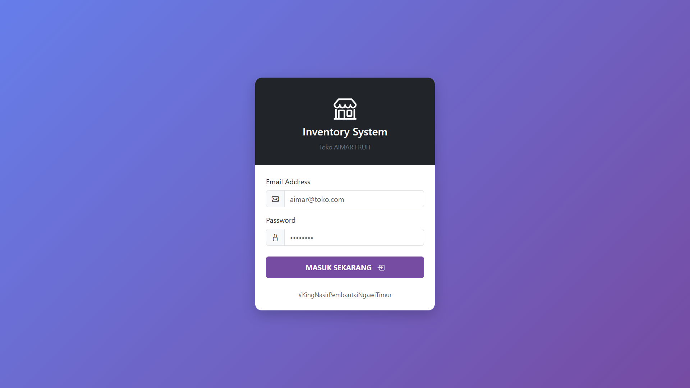
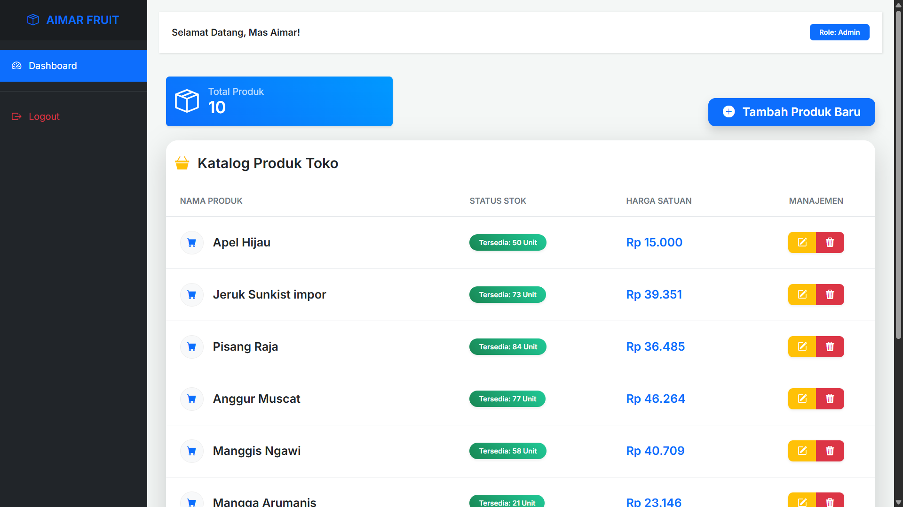
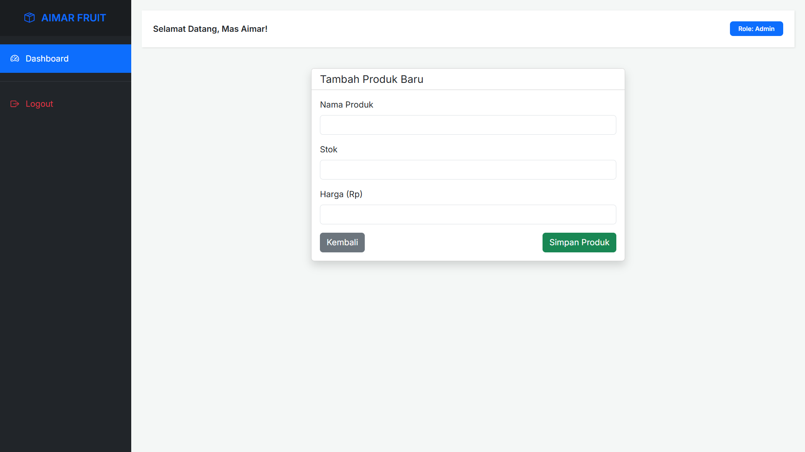
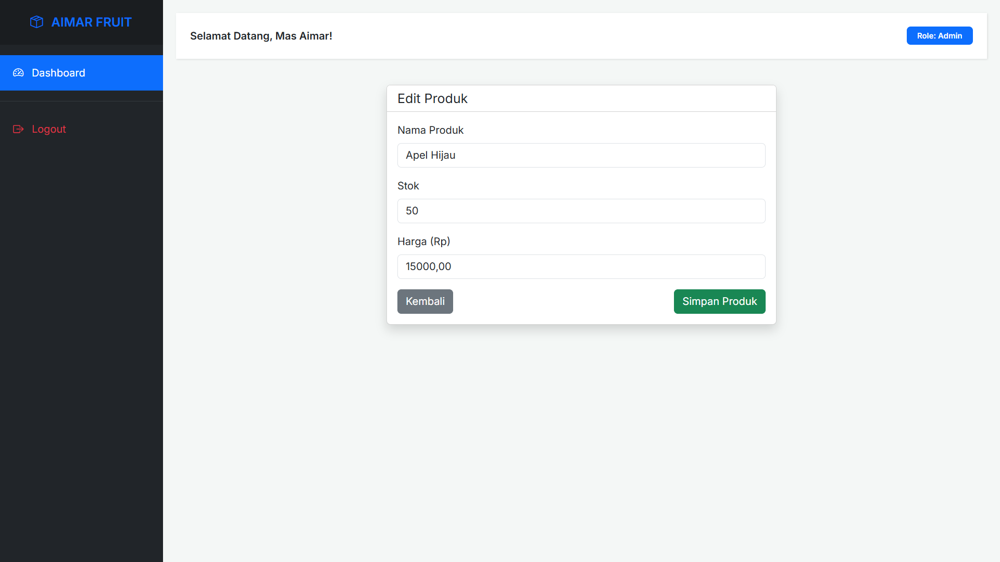

<div align="center">
  <br />
  <h1>LAPORAN PRAKTIKUM <br>APLIKASI BERBASIS PLATFORM</h1>
  <br />
  <h3>MODUL 11, 12 & 13 <br> Laravel Aplikasi Inventaris AIMAR FRUIT </h3>
  <br />
  <br />
  
  <br />
  <br />
  <br />
  <h3>Disusun Oleh :</h3>
  <p>
    <strong>Avrizal Setyo Aji Nugroho</strong><br>
    <strong>2311102145</strong><br>
    <strong>S1 IF-11-REG01</strong>
  </p>
  <br />
  <h3>Dosen Pengampu :</h3>
  <p>
    <strong>Dimas Fanny Hebrasianto Permadi, S.ST., M.Kom</strong>
  </p>
  <br />
  <h4>Asisten Praktikum :</h4>
  <strong>Apri Pandu Wicaksono</strong> <br>
  <strong>Rangga Pradarrell Fathi</strong>
  <br />
  <h3>LABORATORIUM HIGH PERFORMANCE
 <br>FAKULTAS INFORMATIKA <br>UNIVERSITAS TELKOM PURWOKERTO <br>2026</h3>
</div>

---

## 1. Implementasi Sistem (Kebutuhan Fungsional)

Sistem Inventaris AIMAR FRUIT ini dibangun menggunakan framework Laravel dengan pola arsitektur MVC (Model-View-Controller). Sistem mencakup fitur keamanan akses melalui sistem Autentikasi Session manual, serta operasi manajemen stok buah secara penuh (CRUD: Create, Read, Update, Delete) yang dilindungi oleh middleware untuk memastikan integritas data toko.

---

## 2. Penjelasan Kode Sumber

### 2.1 Migration Tabel Produk

File ini digunakan untuk merancang skema tabel products di database. Di dalamnya, setiap atribut produk didefinisikan secara spesifik dan diimplementasikan ke sistem melalui perintah php artisan migrate.

File: database/migrations/2026_04_19_084735_create_products_table.php

```php
<?php

use Illuminate\Database\Migrations\Migration;
use Illuminate\Database\Schema\Blueprint;
use Illuminate\Support\Facades\Schema;

return new class extends Migration
{
    /**
     * Run the migrations.
     */
    public function up(): void
    {
        Schema::create('products', function (Blueprint $table) {
            $table->id();
            $table->string('nama_produk');
            $table->integer('stok');
            $table->decimal('harga', 10, 2);
            $table->timestamps();
        });
    }

    public function down(): void
    {
        Schema::dropIfExists('products');
    }
};

```

---

### 2.2 Factories `ProductFactory.php`

File ini digunakan untuk mendefinisikan blueprint atau pola data otomatis untuk tabel produk. Dengan Factory, kita bisa membuat puluhan data simulasi (seperti nama produk acak, stok, dan harga) dalam sekejap untuk keperluan pengujian sistem. File Referensi: database/factories/ProductFactory.php

```php
<?php

namespace Database\Factories;

use App\Models\Product;
use Illuminate\Database\Eloquent\Factories\Factory;

/**
 * @extends Factory<Product>
 */
class ProductFactory extends Factory
{
    /**
     * Define the model's default state.
     *
     * @return array<string, mixed>
     */
    public function definition(): array
    {
        $daftarBuah = [
            'Jeruk Sunkist',
            'Mangga Arumanis',
            'Semangka Tanpa Biji',
            'Melon Madu',
            'Anggur Muscat',
            'Pisang Raja',
            'Durian Montong',
            'Salak Pondoh',
            'Manggis Ngawi',
            'Nanas Madu'
        ];

        return [
            'nama_produk' => fake()->randomElement($daftarBuah),
            'stok' => fake()->numberBetween(1, 100),
            'harga' => fake()->numberBetween(5000, 50000),
        ];
    }
}

```

---

### 2.3 Seeder 'DatabaseSeeder.php'

Seeder berfungsi untuk mengisi database dengan data awal secara otomatis melalui perintah php artisan db:seed. Pada proyek ini, Seeder digunakan untuk mendaftarkan akun admin Mas Aimar dan menginput 10 data produk inventaris toko ke dalam tabel. File Referensi: database/seeders/DatabaseSeeder.php

```php
<?php

namespace Database\Seeders;

use App\Models\User;
use Illuminate\Database\Console\Seeds\WithoutModelEvents;
use Illuminate\Database\Seeder;
use App\Models\Product;

class DatabaseSeeder extends Seeder
{
    public function run(): void
    {
        // 1. Buat User Admin (Tetap sama)
        User::factory()->create([
            'name' => 'Mas Aimar',
            'email' => 'aimar@toko.com',
            'password' => bcrypt('password'),
        ]);

        // 2. Wajib ada Apel Hijau buat Mas Jakobi
        Product::create([
            'nama_produk' => 'Apel Hijau',
            'stok' => 50,
            'harga' => 15000,
        ]);

        // 3. Tambahin 9 buah random lainnya dari Factory
        Product::factory(9)->create();
    }
}

```

---

### 2.4 Model `Product.php`

Model merupakan representasi tabel database dalam bentuk objek PHP (Eloquent ORM). Di sini, properti $fillable digunakan untuk mendaftarkan kolom mana saja yang boleh diisi secara massal (mass assignment) demi keamanan data toko. File Referensi: app/Models/Product.php

```php
<?php

namespace App\Models;

use Illuminate\Database\Eloquent\Factories\HasFactory;
use Illuminate\Database\Eloquent\Model;

class Product extends Model
{
    /** @use HasFactory<\Database\Factories\ProductFactory> */
    use HasFactory;
    protected $fillable = ['nama_produk', 'stok', 'harga'];
}

```

---

### 2.5 Controller `AuthController.php`

Controller ini menangani logika keamanan akses masuk dan keluar sistem. Di dalamnya terdapat fungsi untuk memvalidasi kredensial pengguna, mengelola Session login Mas Aimar, serta menghapus session saat proses logout. File Referensi: app/Http/Controllers/AuthController.php

```php
<?php

namespace App\Http\Controllers;

use Illuminate\Http\Request;
use Illuminate\Support\Facades\Auth;

class AuthController extends Controller
{
    public function showLogin()
    {
        return view('auth.login');
    }

    public function login(Request $request)
    {
        $credentials = $request->validate([
            'email' => 'required|email',
            'password' => 'required',
        ]);
        if (Auth::attempt($credentials)) {
            $request->session()->regenerate();
            return redirect()->route('products.index');
        }
        return back()->with('error', 'Login gagal, King!');
    }

    public function logout(Request $request)
    {
        Auth::logout();
        $request->session()->invalidate();
        $request->session()->regenerateToken();
        return redirect('/');
    }
}
```

---

### 2.6 Controller `ProductController.php`

Controller ini berfungsi sebagai pusat logika CRUD (Create, Read, Update, Delete) untuk inventaris toko. Tugas utamanya adalah menjembatani data dari database ke tampilan, mulai dari menampilkan daftar produk, menambah stok baru, mengubah detail barang, hingga menghapus data. File Referensi: app/Http/Controllers/ProductController.php

```php
<?php

namespace App\Http\Controllers;

use App\Models\Product;
use Illuminate\Http\Request;

class ProductController extends Controller
{
    public function index()
    {
        $products = Product::all();
        return view('products.index', compact('products'));
    }

    public function create()
    {
        return view('products.form');
    }

    public function store(Request $request)
    {
        Product::create($request->all());
        return redirect()->route('products.index')->with('success', 'Produk berhasil ditambah!');
    }

    public function edit(Product $product)
    {
        return view('products.form', compact('product'));
    }

    public function update(Request $request, Product $product)
    {
        $product->update($request->all());
        return redirect()->route('products.index')->with('success', 'Produk berhasil diupdate!');
    }

    public function destroy(Product $product)
    {
        $product->delete();
        return redirect()->route('products.index')->with('success', 'Produk dihapus!');
    }
}
```

---

### 2.7 Routing (`web.php`)

File ini berfungsi sebagai pengatur alur navigasi aplikasi. Route mendefinisikan alamat URL, menghubungkannya ke Controller yang sesuai, serta menerapkan Middleware Auth untuk memastikan area inventaris toko hanya bisa diakses setelah login. File Referensi: routes/web.php

```php
<?php

use App\Http\Controllers\AuthController;
use App\Http\Controllers\ProductController;
use Illuminate\Support\Facades\Route;

Route::get('/', [AuthController::class, 'showLogin'])->name('login');
Route::post('/login', [AuthController::class, 'login'])->name('login.post');
Route::post('/logout', [AuthController::class, 'logout'])->name('logout');

// Lindungi CRUD dengan Middleware Auth
Route::middleware(['auth'])->group(function () {
    Route::resource('products', ProductController::class);
});
Route::get('/dashboard', function () {
    return redirect()->route('products.index');
})->middleware(['auth']);

```

---

---

### 2.8 Layout Utama (`layout/app.blade.php`)

Merupakan kerangka dasar HTML yang memuat library Bootstrap 5 dan CSS kustom. File ini berfungsi sebagai cetakan utama (template) sehingga elemen seperti Header dan Footer tidak perlu ditulis ulang di setiap halaman. File Referensi: resources/views/layouts/app.blade.php

```html
<!DOCTYPE html>
<html lang="id">
  <head>
    <meta charset="UTF-8" />
    <meta name="viewport" content="width=device-width, initial-scale=1.0" />
    <title>Aimar Inventory - Dashboard</title>
    <link
      href="https://cdn.jsdelivr.net/npm/bootstrap@5.3.3/dist/css/bootstrap.min.css"
      rel="stylesheet"
    />
    <link
      rel="stylesheet"
      href="https://cdn.jsdelivr.net/npm/bootstrap-icons@1.11.3/font/bootstrap-icons.min.css"
    />
    <link
      href="https://fonts.googleapis.com/css2?family=Inter:wght@400;600&display=swap"
      rel="stylesheet"
    />

    <style>
      body {
        font-family: "Inter", sans-serif;
        background-color: #f4f7f6;
        overflow-x: hidden;
      }

      #wrapper {
        display: flex;
        width: 100%;
      }

      /* Sidebar Styling */
      #sidebar {
        min-width: 250px;
        max-width: 250px;
        min-height: 100vh;
        background: #212529;
        color: #fff;
        transition: all 0.3s;
      }

      #sidebar .sidebar-header {
        padding: 20px;
        background: #1a1d20;
        text-align: center;
        font-weight: bold;
        font-size: 1.2rem;
        color: #0d6efd;
      }

      #sidebar ul p {
        color: #fff;
        padding: 10px;
      }

      #sidebar ul li a {
        padding: 15px 20px;
        display: block;
        color: #adb5bd;
        text-decoration: none;
      }

      #sidebar ul li a:hover {
        color: #fff;
        background: #343a40;
      }

      #sidebar ul li.active > a {
        color: #fff;
        background: #0d6efd;
      }

      /* Content Styling */
      #content {
        width: 100%;
        padding: 20px;
      }

      .navbar {
        padding: 15px 10px;
        background: #fff;
        border: none;
        border-radius: 0;
        margin-bottom: 40px;
        box-shadow: 1px 1px 3px rgba(0, 0, 0, 0.1);
      }
    </style>
  </head>

  <body>
    <div id="wrapper">
      <nav id="sidebar">
        <div class="sidebar-header">
          <i class="bi bi-box-seam me-2"></i> AIMAR FRUIT
        </div>

        <ul class="list-unstyled components mt-3">
          <li class="{{ Request::is('products*') ? 'active' : '' }}">
            <a href="{{ route('products.index') }}">
              <i class="bi bi-speedometer2 me-2"></i> Dashboard
            </a>
          </li>
          <hr class="border-secondary" />
          <li>
            <form action="{{ route('logout') }}" method="POST" id="logout-form">
              @csrf
              <a
                href="#"
                onclick="event.preventDefault(); document.getElementById('logout-form').submit();"
                class="text-danger"
              >
                <i class="bi bi-box-arrow-right me-2"></i> Logout
              </a>
            </form>
          </li>
        </ul>
      </nav>

      <div id="content">
        <nav class="navbar navbar-expand-lg navbar-light">
          <div class="container-fluid">
            <span class="navbar-text fw-bold text-dark">
              Selamat Datang, Mas Aimar!
            </span>
            <div class="ms-auto">
              <span class="badge bg-primary px-3 py-2">Role: Admin</span>
            </div>
          </div>
        </nav>

        <div class="container">
          @if (session('success'))
          <div
            class="alert alert-success alert-dismissible fade show"
            role="alert"
          >
            <i class="bi bi-check-circle me-2"></i> {{ session('success') }}
            <button
              type="button"
              class="btn-close"
              data-bs-dismiss="alert"
            ></button>
          </div>
          @endif @yield('content')
        </div>
      </div>
    </div>

    <script src="https://cdn.jsdelivr.net/npm/bootstrap@5.3.3/dist/js/bootstrap.bundle.min.js"></script>
  </body>
</html>
```

---

### 2.9 Halaman Login (`auth/login.blade.php`)

Tampilan antarmuka bagi pengguna untuk masuk ke sistem. Menggunakan komponen card yang responsif dan dilengkapi dengan validasi error untuk memastikan hanya Mas Aimar yang bisa mengelola inventaris. File Referensi: resources/views/auth/login.blade.php

```html
<!DOCTYPE html>
<html lang="en">
  <head>
    <meta charset="UTF-8" />
    <meta name="viewport" content="width=device-width, initial-scale=1.0" />
    <title>Login - AIMAR FRUIT</title>
    <link
      href="https://cdn.jsdelivr.net/npm/bootstrap@5.3.0/dist/css/bootstrap.min.css"
      rel="stylesheet"
    />
    <link
      rel="stylesheet"
      href="https://cdn.jsdelivr.net/npm/bootstrap-icons@1.11.0/font/bootstrap-icons.css"
    />
    <style>
      body {
        background: linear-gradient(135deg, #667eea 0%, #764ba2 100%);
        height: 100vh;
        display: flex;
        align-items: center;
        justify-content: center;
      }

      .login-card {
        border: none;
        border-radius: 15px;
        box-shadow: 0 10px 30px rgba(0, 0, 0, 0.2);
        overflow: hidden;
        width: 100%;
        max-width: 400px;
        background: #fff;
      }

      .login-header {
        background: #212529;
        color: white;
        padding: 30px;
        text-align: center;
      }

      .login-header i {
        font-size: 50px;
        margin-bottom: 10px;
      }

      .btn-primary {
        background: #764ba2;
        border: none;
        padding: 12px;
        transition: 0.3s;
      }

      .btn-primary:hover {
        background: #667eea;
        transform: translateY(-2px);
      }

      .form-control:focus {
        box-shadow: none;
        border-color: #764ba2;
      }
    </style>
  </head>

  <body>
    <div class="login-card">
      <div class="login-header">
        <i class="bi bi-shop"></i>
        <h4>Inventory System</h4>
        <small class="text-secondary">Toko AIMAR FRUIT</small>
      </div>

      <div class="p-4">
        @if ($errors->any())
        <div class="alert alert-danger py-2">
          <small
            ><i class="bi bi-exclamation-triangle-fill"></i> Email atau Password
            salah, King!</small
          >
        </div>
        @endif

        <form action="{{ route('login.post') }}" method="POST">
          @csrf
          <div class="mb-3">
            <label class="form-label">Email Address</label>
            <div class="input-group">
              <span class="input-group-text"
                ><i class="bi bi-envelope"></i
              ></span>
              <input
                type="email"
                name="email"
                class="form-control"
                placeholder="aimar@toko.com"
                required
                autofocus
              />
            </div>
          </div>

          <div class="mb-4">
            <label class="form-label">Password</label>
            <div class="input-group">
              <span class="input-group-text"><i class="bi bi-lock"></i></span>
              <input
                type="password"
                name="password"
                class="form-control"
                placeholder="••••••••"
                required
              />
            </div>
          </div>

          <div class="d-grid">
            <button type="submit" class="btn btn-primary fw-bold">
              MASUK SEKARANG <i class="bi bi-box-arrow-in-right ms-2"></i>
            </button>
          </div>
        </form>
      </div>

      <div class="text-center pb-4">
        <small class="text-muted">#KingNasirPembantaiNgawiTimur</small>
      </div>
    </div>

    <script src="https://cdn.jsdelivr.net/npm/bootstrap@5.3.0/dist/js/bootstrap.bundle.min.js"></script>
  </body>
</html>
```

---

### 2.10 Halaman Index Produk (`products/Index.blade.php`)

Halaman ini adalah pusat kendali inventaris yang menampilkan seluruh data barang dalam bentuk tabel. Di sini juga terdapat tombol aksi untuk mengarahkan pengguna ke form tambah/edit, serta tombol hapus yang terintegrasi dengan Modal Konfirmasi. File Referensi: resources/views/products/index.blade.php

```php
@extends('layouts.app') @section('content')
<div class="row mb-4">
  <div class="col-md-4">
    <div
      class="card border-0 shadow-sm bg-primary text-white p-3"
      style="background: linear-gradient(45deg, #0d6efd, #0099ff);"
    >
      <div class="d-flex align-items-center">
        <i class="bi bi-box-seam display-6 me-3"></i>
        <div>
          <h6 class="mb-0 opacity-75">Total Produk</h6>
          <h3 class="mb-0 fw-bold">{{ $products->count() }}</h3>
        </div>
      </div>
    </div>
  </div>
  <div class="col-md-8 d-flex align-items-end justify-content-end">
    <a
      href="{{ route('products.create') }}"
      class="btn btn-primary btn-lg shadow px-4 py-2 fw-bold"
      style="border-radius: 12px; transition: transform 0.2s;"
    >
      <i class="bi bi-plus-circle-fill me-2"></i> Tambah Produk Baru
    </a>
  </div>
</div>

<div
  class="card border-0 shadow-lg"
  style="border-radius: 20px; overflow: hidden;"
>
  <div class="card-header bg-white py-4 border-0">
    <h4 class="fw-bold mb-0 text-dark">
      <i class="bi bi-basket3-fill text-warning me-2"></i> Katalog Produk Toko
    </h4>
  </div>
  <div class="card-body p-0">
    <div class="table-responsive">
      <table class="table table-hover align-middle mb-0">
        <thead style="background-color: #f8f9fa;">
          <tr>
            <th class="ps-4 py-3 text-secondary small fw-bold">NAMA PRODUK</th>
            <th class="py-3 text-secondary small fw-bold">STATUS STOK</th>
            <th class="py-3 text-secondary small fw-bold">HARGA SATUAN</th>
            <th class="py-3 text-secondary small fw-bold text-center">
              MANAJEMEN
            </th>
          </tr>
        </thead>
        <tbody>
          @foreach ($products as $p)
          <tr style="transition: all 0.3s ease;">
            <td class="ps-4 py-4">
              <div class="d-flex align-items-center">
                <div
                  class="rounded-circle bg-light d-flex align-items-center justify-content-center me-3"
                  style="width: 40px; height: 40px; border: 1px solid #eee;"
                >
                  <i class="bi bi-cart-fill text-primary"></i>
                </div>
                <span class="fw-bold text-dark fs-5"
                  >{{ $p->nama_produk }}</span
                >
              </div>
            </td>
            <td>
              @if ($p->stok <= 5)
              <span class="badge rounded-pill bg-danger px-3 py-2 shadow-sm"
                >Kritis: {{ $p->stok }} Unit</span
              >
              @elseif($p->stok <= 20)
              <span
                class="badge rounded-pill bg-warning text-dark px-3 py-2 shadow-sm"
                >Menipis: {{ $p->stok }} Unit</span
              >
              @else
              <span
                class="badge rounded-pill bg-success px-3 py-2 shadow-sm text-white"
                style="background: linear-gradient(45deg, #198754, #20c997);"
                >Tersedia: {{ $p->stok }} Unit</span
              >
              @endif
            </td>
            <td>
              <span class="fw-bold text-primary fs-5"
                >Rp {{ number_format($p->harga, 0, ',', '.') }}</span
              >
            </td>
            <td class="text-center">
              <div
                class="btn-group shadow-sm"
                style="border-radius: 8px; overflow: hidden;"
              >
                <a
                  href="{{ route('products.edit', $p->id) }}"
                  class="btn btn-warning text-white px-3 border-0"
                >
                  <i class="bi bi-pencil-square"></i>
                </a>
                <button
                  class="btn btn-danger px-3 border-0"
                  data-bs-toggle="modal"
                  data-bs-target="#deleteModal{{ $p->id }}"
                >
                  <i class="bi bi-trash3-fill"></i>
                </button>
              </div>
            </td>
          </tr>

          <div class="modal fade" id="deleteModal{{ $p->id }}" tabindex="-1">
            <div class="modal-dialog modal-dialog-centered">
              <form
                action="{{ route('products.destroy', $p->id) }}"
                method="POST"
              >
                @csrf @method('DELETE')
                <div
                  class="modal-content border-0 shadow-lg"
                  style="border-radius: 20px;"
                >
                  <div class="modal-body text-center p-5">
                    <div
                      class="rounded-circle bg-danger-subtle d-inline-flex p-4 mb-4"
                    >
                      <i class="bi bi-trash3 text-danger h1 mb-0"></i>
                    </div>
                    <h3 class="fw-bold text-dark">Hapus Produk?</h3>
                    <p class="text-muted">
                      Apakah kamu yakin ingin menghapus
                      <b>{{ $p->nama_produk }}</b>? Tindakan ini tidak bisa
                      dibatalkan, King!
                    </p>
                    <div class="d-flex gap-2 mt-4">
                      <button
                        type="button"
                        class="btn btn-light w-100 py-3 fw-bold"
                        data-bs-dismiss="modal"
                        style="border-radius: 12px;"
                      >
                        Batal
                      </button>
                      <button
                        type="submit"
                        class="btn btn-danger w-100 py-3 fw-bold shadow"
                        style="border-radius: 12px;"
                      >
                        Ya, Hapus!
                      </button>
                    </div>
                  </div>
                </div>
              </form>
            </div>
          </div>
          @endforeach
        </tbody>
      </table>
    </div>
  </div>
</div>

<style>
  /* Animasi Hover Baris Tabel */
  tr:hover {
    background-color: #fbfcfe !important;
    transform: scale(1.005);
    box-shadow: 0 5px 15px rgba(0, 0, 0, 0.05);
  }

  .btn:hover {
    transform: translateY(-2px);
  }
</style>
@endsection
```

---

### 2.11 View Form Produk (`products/form.blade.php`)

Halaman ini dirancang secara dinamis untuk menangani dua fungsi sekaligus: menambah data baru dan memperbarui data produk yang sudah ada. Dengan menggunakan logika kondisi di Blade, formulir ini akan menyesuaikan judul dan aksi datanya secara otomatis sesuai kebutuhan Mas Aimar. File Referensi: resources/views/products/form.blade.php

```php
@extends('layouts.app')

@section('content')
    <div class="row justify-content-center">
        <div class="col-md-6">
            <div class="card shadow">
                <div class="card-header bg-white">
                    <h5 class="mb-0">{{ isset($product) ? 'Edit Produk' : 'Tambah Produk Baru' }}</h5>
                </div>
                <div class="card-body">
                    <form action="{{ isset($product) ? route('products.update', $product->id) : route('products.store') }}"
                        method="POST">
                        @csrf
                        @if (isset($product))
                            @method('PUT')
                        @endif

                        <div class="mb-3">
                            <label class="form-label">Nama Produk</label>
                            <input type="text" name="nama_produk"
                                class="form-control @error('nama_produk') is-invalid @enderror"
                                value="{{ old('nama_produk', $product->nama_produk ?? '') }}" required>
                            @error('nama_produk')
                                <div class="invalid-feedback">{{ $message }}</div>
                            @enderror
                        </div>

                        <div class="mb-3">
                            <label class="form-label">Stok</label>
                            <input type="number" name="stok" class="form-control @error('stok') is-invalid @enderror"
                                value="{{ old('stok', $product->stok ?? '') }}" required>
                            @error('stok')
                                <div class="invalid-feedback">{{ $message }}</div>
                            @enderror
                        </div>

                        <div class="mb-3">
                            <label class="form-label">Harga (Rp)</label>
                            <input type="number" name="harga" class="form-control @error('harga') is-invalid @enderror"
                                value="{{ old('harga', $product->harga ?? '') }}" required>
                            @error('harga')
                                <div class="invalid-feedback">{{ $message }}</div>
                            @enderror
                        </div>

                        <div class="d-flex justify-content-between">
                            <a href="{{ route('products.index') }}" class="btn btn-secondary">Kembali</a>
                            <button type="submit" class="btn btn-success">Simpan Produk</button>
                        </div>
                    </form>
                </div>
            </div>
        </div>
    </div>
@endsection

```

---

## 3. Hasil Tampilan (Screenshots) Aplikasi

### 3.1 Halaman Login

Halaman antarmuka login yang menggunakan desain kartu modern dengan latar belakang gradien untuk mengamankan akses masuk ke sistem inventaris.


---

### 3.2 Halaman Dashboard

Halaman utama dasbor yang menampilkan statistik total produk dan katalog barang dalam bentuk tabel informatif lengkap dengan status stok.



---

### 3.4 Halaman Tambah

Formulir input yang bersih dan minimalis untuk mendaftarkan produk baru ke dalam database toko AIMAR FRUIT.


---

### 3.5 Halaman Edit

Fitur pengubahan data produk yang memungkinkan pengguna untuk memperbarui detail barang seperti stok dan harga secara cepat dan akurat.


---

## 4. Referensi

- **Laravel Documentation**: [https://laravel.com/docs](https://laravel.com/docs)
- **Eloquent ORM**: [https://laravel.com/docs/eloquent](https://laravel.com/docs/eloquent)
- **Laravel Blade Templates**: [https://laravel.com/docs/blade](https://laravel.com/docs/blade)
- **Laravel Resource Controllers**: [https://laravel.com/docs/controllers#resource-controllers](https://laravel.com/docs/controllers#resource-controllers)
