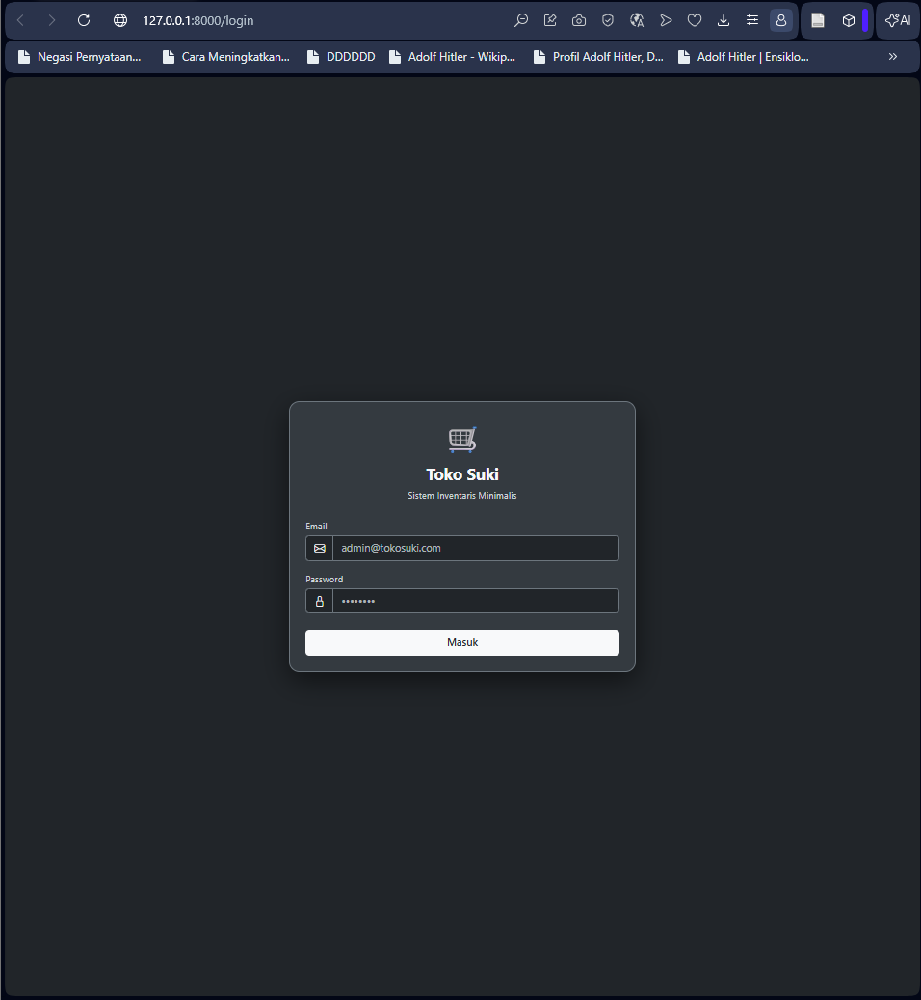
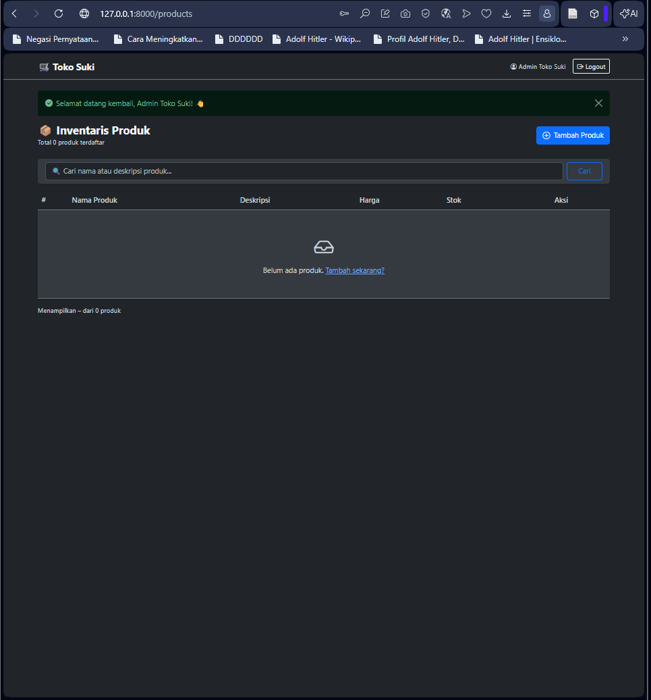
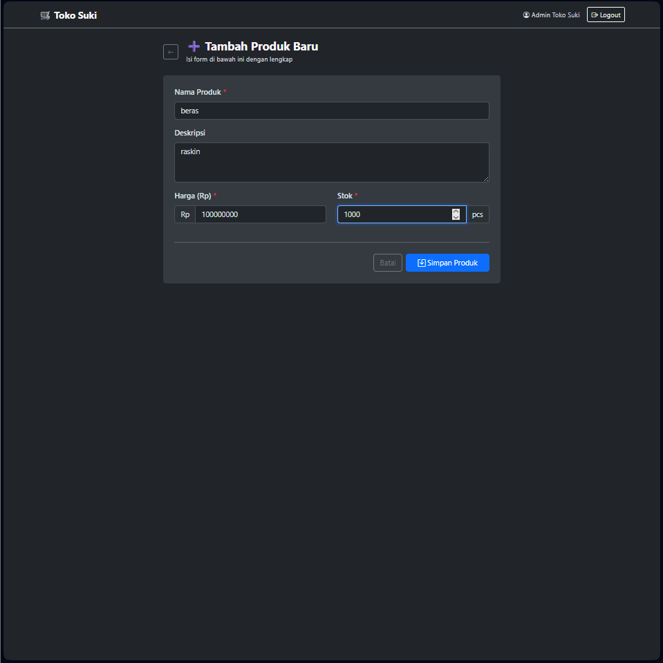
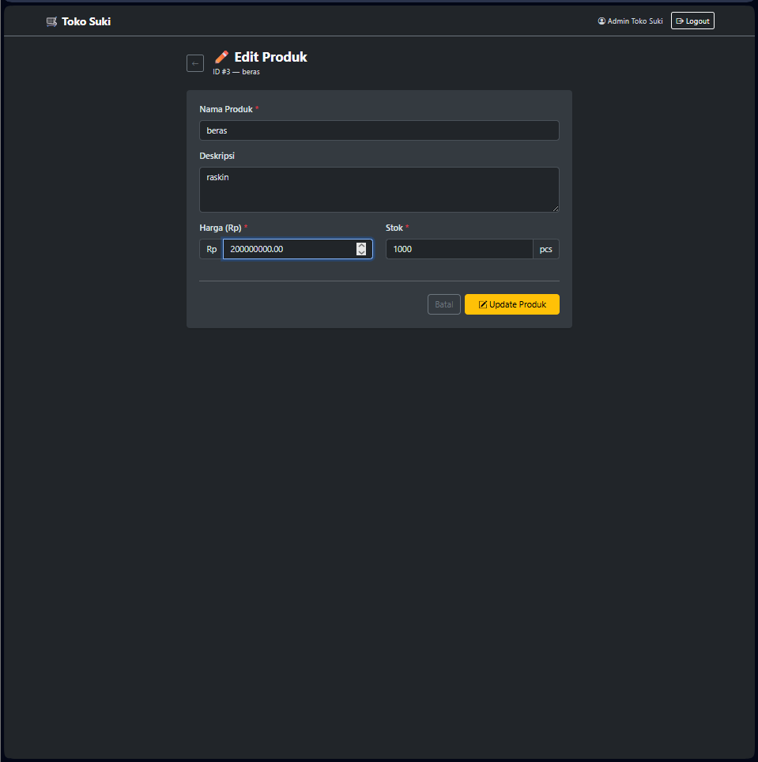

<div align="center">
  <br />
  <h1>LAPORAN PRAKTIKUM <br>APLIKASI BERBASIS PLATFORM</h1>
  <br />
  <h3>MODUL 11-12-13 <br> Laravel Aplikasi Inventori Produk</h3>
  <br />
  <br />
   
  <br />
  <br />
  <br />
  <h3>Disusun Oleh :</h3>
  <p>
    <strong>Yoga Hogantara</strong><br>
    <strong>2311102153</strong><br>
    <strong>S1 IF-11-01</strong>
  </p>
  <br />
  <h3>Dosen Pengampu :</h3>
  <p>
    <strong>Dimas Fanny Hebrasianto Permadi, S.ST., M.Kom</strong>
  </p>
  <br />
  <br />
    <h4>Asisten Praktikum :</h4>
    <strong> Apri Pandu Wicaksono </strong> <br>
    <strong>Rangga Pradarrell Fathi</strong>
  <br />
  <h3>LABORATORIUM HIGH PERFORMANCE
 <br>FAKULTAS INFORMATIKA <br>UNIVERSITAS TELKOM PURWOKERTO <br>2026</h3>
</div>

---

## 1. Implementasi Sistem (Kebutuhan Fungsional)
 
Sistem **Inventaris Produk** ini dibangun menggunakan framework Laravel dengan pola arsitektur **MVC (Model-View-Controller)**. Sistem mencakup fitur-fitur utama sebagai berikut:
 
- **Autentikasi Pengguna**: Login dan logout berbasis sesi (*session-based*) menggunakan sistem autentikasi bawaan Laravel, sehingga seluruh halaman produk hanya dapat diakses oleh pengguna yang telah terautentikasi.
- **CRUD Produk**: Pengelolaan data produk secara penuh, meliputi operasi *Create*, *Read*, *Update*, dan *Delete*, yang dilindungi oleh middleware `auth`.
- **Search & Pagination**: Daftar produk dapat dicari berdasarkan nama atau deskripsi, serta ditampilkan secara terpaginasi (10 data per halaman).
- **Flash Message**: Setiap operasi CRUD menampilkan pesan notifikasi keberhasilan secara otomatis.
- **Modal Konfirmasi Delete**: Penghapusan data produk dilakukan melalui modal konfirmasi interaktif berbasis Bootstrap 5 untuk mencegah penghapusan data yang tidak disengaja.
- **Tampilan UI Dark Theme**: Antarmuka pengguna menggunakan tema gelap (*dark mode*) berbasis **Bootstrap 5** dengan palet warna Carbon Black dan Gunmetal, memberikan pengalaman visual yang bersih dan modern.
---
 
## 2. Penjelasan Kode Sumber
 
### 2.1 Migration Struktur Tabel Database
 
Migration mendefinisikan skema tabel `products` di database. Setiap kolom beserta tipe datanya dideklarasikan secara eksplisit, kemudian dijalankan dengan perintah `php artisan migrate`. *File Referensi: `database/migrations/create_product_tables.php`*
 
```php
<?php
 
use Illuminate\Database\Migrations\Migration;
use Illuminate\Database\Schema\Blueprint;
use Illuminate\Support\Facades\Schema;
 
return new class extends Migration
{
    public function up(): void
    {
        Schema::create('products', function (Blueprint $table) {
            $table->id();
            $table->string('name');
            $table->text('description')->nullable();
            $table->decimal('price', 12, 2);
            $table->integer('stock')->default(0);
            $table->timestamps();
        });
    }
 
    public function down(): void
    {
        Schema::dropIfExists('products');
    }
};
```
 
---
 
### 2.2 Model `Product.php`
 
Model adalah representasi dari tabel database dalam bentuk objek PHP menggunakan **Eloquent ORM**. Properti `$fillable` mendaftarkan kolom mana saja yang boleh diisi secara massal (*mass assignment*). Terdapat juga sebuah **accessor** `getFormattedPriceAttribute` yang memformat harga secara otomatis ke format Rupiah. *File Referensi: `app/Models/Product.php`*
 
```php
<?php
 
namespace App\Models;
 
use Illuminate\Database\Eloquent\Factories\HasFactory;
use Illuminate\Database\Eloquent\Model;
 
class Product extends Model
{
    use HasFactory;
 
    protected $fillable = [
        'name',
        'description',
        'price',
        'stock',
    ];
 
    // Accessor: format harga otomatis ke Rupiah
    public function getFormattedPriceAttribute(): string
    {
        return 'Rp ' . number_format($this->price, 0, ',', '.');
    }
}
```
 
---
 
### 2.3 Database Seeder
 
Seeder digunakan untuk mengisi database dengan data awal secara otomatis menggunakan perintah `php artisan db:seed`. `DatabaseSeeder` memanggil dua seeder secara berurutan: `AdminSeeder` untuk membuat akun administrator, dan `ProductSeeder` untuk mengisi 15 data produk dummy via factory. *File Referensi: `database/seeders/DatabaseSeeder.php`*
 
```php
<?php
 
namespace Database\Seeders;
 
use Illuminate\Database\Seeder;
 
class DatabaseSeeder extends Seeder
{
    public function run(): void
    {
        $this->call([
            AdminSeeder::class,
            ProductSeeder::class,
        ]);
    }
}
```
 
**AdminSeeder** membuat atau memperbarui akun administrator default menggunakan `updateOrCreate` agar tidak terjadi duplikasi data saat seeder dijalankan ulang. *File Referensi: `database/seeders/AdminSeeder.php`*
 
```php
<?php
 
namespace Database\Seeders;
 
use App\Models\User;
use Illuminate\Database\Seeder;
use Illuminate\Support\Facades\Hash;
 
class AdminSeeder extends Seeder
{
    public function run(): void
    {
        User::updateOrCreate(
            ['email' => 'admin@tokosuki.com'],
            [
                'name'     => 'Admin Toko Suki',
                'email'    => 'admin@tokosuki.com',
                'password' => Hash::make('password123'),
            ]
        );
    }
}
```
 
**ProductSeeder** menghapus seluruh data produk yang ada terlebih dahulu sebelum mengisi ulang 15 data produk baru via factory. *File Referensi: `database/seeders/ProductSeeder.php`*
 
```php
<?php
 
namespace Database\Seeders;
 
use App\Models\Product;
use Illuminate\Database\Seeder;
 
class ProductSeeder extends Seeder
{
    public function run(): void
    {
        // Hapus data lama sebelum seed ulang
        Product::truncate();
 
        Product::factory()->count(15)->create();
    }
}
```
 
Akun default yang dapat digunakan untuk login:
- **Email**: `admin@tokosuki.com`
- **Password**: `password123`
---
 
### 2.4 Routes `web.php`
 
Routes mendefinisikan URL yang dapat diakses beserta controller yang menanganinya. Route `resource` secara otomatis membuat route CRUD (kecuali `show` yang dikecualikan). Semua route produk dibungkus dalam middleware `auth`. Route root `/` dialihkan langsung ke halaman login. *File Referensi: `routes/web.php`*
 
```php
<?php
 
use App\Http\Controllers\AuthController;
use App\Http\Controllers\ProductController;
use Illuminate\Support\Facades\Route;
 
// ─── AUTH ────────────────────────────────────────────
Route::get('/login', [AuthController::class, 'showLogin'])->name('login');
Route::post('/login', [AuthController::class, 'login'])->name('login.post');
Route::post('/logout', [AuthController::class, 'logout'])->name('logout');
 
// Redirect root ke login
Route::get('/', function () {
    return redirect()->route('login');
});
 
// ─── PROTECTED: hanya bisa akses jika sudah login ────
Route::middleware('auth')->group(function () {
    Route::resource('products', ProductController::class)
         ->except(['show']); // halaman detail tidak digunakan
});
```
 
---
 
### 2.5 Controller `ProductController.php`
 
Controller adalah inti logika aplikasi. Setiap method menangani satu jenis request HTTP dan menghubungkan Model dengan View. Method `index` mendukung fitur pencarian (*search*) berdasarkan nama atau deskripsi produk dan menggunakan pagination 10 data per halaman. Method `store` dan `update` dilengkapi validasi input beserta pesan error kustom dalam Bahasa Indonesia. *File Referensi: `app/Http/Controllers/ProductController.php`*
 
```php
<?php
 
namespace App\Http\Controllers;
 
use App\Models\Product;
use Illuminate\Http\Request;
 
class ProductController extends Controller
{
    /**
     * Daftar semua produk (dengan search & pagination)
     */
    public function index(Request $request)
    {
        $query = Product::query();
 
        if ($search = $request->input('search')) {
            $query->where('name', 'like', "%{$search}%")
                  ->orWhere('description', 'like', "%{$search}%");
        }
 
        $products = $query->latest()->paginate(10)->withQueryString();
 
        return view('products.index', compact('products', 'search'));
    }
 
    /**
     * Form tambah produk
     */
    public function create()
    {
        return view('products.create');
    }
 
    /**
     * Simpan produk baru
     */
    public function store(Request $request)
    {
        $validated = $request->validate([
            'name'        => 'required|string|max:255',
            'description' => 'nullable|string|max:1000',
            'price'       => 'required|numeric|min:0',
            'stock'       => 'required|integer|min:0',
        ], [
            'name.required'  => 'Nama produk wajib diisi.',
            'price.required' => 'Harga produk wajib diisi.',
            'price.numeric'  => 'Harga harus berupa angka.',
            'stock.required' => 'Stok wajib diisi.',
            'stock.integer'  => 'Stok harus berupa angka bulat.',
        ]);
 
        Product::create($validated);
 
        return redirect()->route('products.index')
                         ->with('success', 'Produk "' . $validated['name'] . '" berhasil ditambahkan! ✅');
    }
 
    /**
     * Form edit produk
     */
    public function edit(Product $product)
    {
        return view('products.edit', compact('product'));
    }
 
    /**
     * Update produk
     */
    public function update(Request $request, Product $product)
    {
        $validated = $request->validate([
            'name'        => 'required|string|max:255',
            'description' => 'nullable|string|max:1000',
            'price'       => 'required|numeric|min:0',
            'stock'       => 'required|integer|min:0',
        ]);
 
        $product->update($validated);
 
        return redirect()->route('products.index')
                         ->with('success', 'Produk "' . $product->name . '" berhasil diperbarui! ✏️');
    }
 
    /**
     * Hapus produk
     */
    public function destroy(Product $product)
    {
        $name = $product->name;
        $product->delete();
 
        return redirect()->route('products.index')
                         ->with('success', 'Produk "' . $name . '" berhasil dihapus! 🗑️');
    }
}
```
 
---
 
### 2.6 View Layout Utama (`layouts/app.blade.php`)
 
Layout utama mendefinisikan kerangka halaman yang digunakan oleh semua halaman dalam aplikasi melalui mekanisme `@extends` dan `@yield` Blade. Menggunakan tema **Bootstrap 5 dark mode** (`data-bs-theme="dark"`) dengan palet warna kustom berbasis CSS variables (Carbon Black, Gunmetal, Slate Grey). Navbar menampilkan nama pengguna yang sedang login serta tombol logout. Flash message keberhasilan ditampilkan secara otomatis di bagian atas konten. *File Referensi: `resources/views/layouts/app.blade.php`*
 
```html
<!DOCTYPE html>
<html lang="id" data-bs-theme="dark">
<head>
    <meta charset="UTF-8">
    <meta name="viewport" content="width=device-width, initial-scale=1.0">
    <title>@yield('title', 'Toko Suki') — Inventaris</title>
 
    <link href="https://cdn.jsdelivr.net/npm/bootstrap@5.3.3/dist/css/bootstrap.min.css" rel="stylesheet">
    <link href="https://cdn.jsdelivr.net/npm/bootstrap-icons@1.11.3/font/bootstrap-icons.css" rel="stylesheet">
 
    <style>
        :root {
            --bg-carbon: #212529;
            --bg-gunmetal: #343A40;
            --border-slate: #6C757D;
            --text-pale: #CED4DA;
            --text-snow: #F8F9FA;
        }
        body {
            background-color: var(--bg-carbon);
            color: var(--text-snow);
            font-family: 'Segoe UI', sans-serif;
        }
        .navbar {
            background-color: var(--bg-carbon) !important;
            border-bottom: 1px solid var(--border-slate);
        }
        .navbar-brand { font-weight: 700; color: var(--text-snow) !important; }
        .card {
            background-color: var(--bg-gunmetal);
            border: 1px solid var(--border-slate);
        }
        .table { --bs-table-bg: transparent; --bs-table-color: var(--text-snow); }
        .table thead th {
            background-color: var(--bg-carbon);
            border-bottom: 2px solid var(--border-slate);
            color: var(--text-pale);
            font-weight: 600;
        }
        .table td { border-bottom: 1px solid var(--border-slate); }
        .text-muted { color: var(--text-pale) !important; }
    </style>
</head>
<body>
 
<nav class="navbar navbar-expand-lg">
    <div class="container">
        <a class="navbar-brand" href="{{ route('products.index') }}">
            🛒 Toko Suki
        </a>
        <div class="ms-auto d-flex align-items-center gap-3">
            <span class="small" style="color: var(--text-pale);">
                <i class="bi bi-person-circle me-1"></i>{{ Auth::user()->name ?? 'Tamu' }}
            </span>
            <form action="{{ route('logout') }}" method="POST" class="m-0">
                @csrf
                <button type="submit" class="btn btn-sm btn-outline-light">
                    <i class="bi bi-box-arrow-right me-1"></i>Logout
                </button>
            </form>
        </div>
    </div>
</nav>
 
<div class="container mt-4 mb-5">
    @if(session('success'))
        <div class="alert alert-success alert-dismissible fade show border-0" role="alert">
            <i class="bi bi-check-circle-fill me-2"></i>{{ session('success') }}
            <button type="button" class="btn-close" data-bs-dismiss="alert"></button>
        </div>
    @endif
 
    @yield('content')
</div>
 
<script src="https://cdn.jsdelivr.net/npm/bootstrap@5.3.3/dist/js/bootstrap.bundle.min.js"></script>
@stack('scripts')
</body>
</html>
```
 
---
 
### 2.7 View Halaman Login (`auth/login.blade.php`)
 
Halaman login menggunakan standalone HTML (tidak meng-extend layout utama) dengan latar belakang Carbon Black dan sebuah *card* login terpusat. Validasi error dari server ditampilkan di dalam blok alert Bootstrap. Form mengirim data email dan password ke route `login.post` menggunakan metode POST yang dilindungi token CSRF. *File Referensi: `resources/views/auth/login.blade.php`*
 
```html
<!DOCTYPE html>
<html lang="id" data-bs-theme="dark">
<head>
    <meta charset="UTF-8">
    <meta name="viewport" content="width=device-width, initial-scale=1.0">
    <title>Login — Toko Suki</title>
    <link href="https://cdn.jsdelivr.net/npm/bootstrap@5.3.3/dist/css/bootstrap.min.css" rel="stylesheet">
    <link href="https://cdn.jsdelivr.net/npm/bootstrap-icons@1.11.3/font/bootstrap-icons.css" rel="stylesheet">
</head>
<body style="min-height:100vh; background-color:#212529;
             display:flex; align-items:center; justify-content:center;">
 
<div class="card p-4" style="max-width:400px; width:100%;
                              border-radius:12px; box-shadow:0 10px 30px rgba(0,0,0,0.5);">
    <div class="text-center mb-4">
        <div class="fs-1 mb-2">🛒</div>
        <h4 class="fw-bold mb-1">Toko Suki</h4>
        <small class="text-muted">Sistem Inventaris Minimalis</small>
    </div>
 
    @if ($errors->any())
        <div class="alert alert-danger border-0 small">
            <i class="bi bi-exclamation-triangle-fill me-2"></i>{{ $errors->first() }}
        </div>
    @endif
 
    <form action="{{ route('login.post') }}" method="POST">
        @csrf
        <div class="mb-3">
            <label class="form-label small mb-1">Email</label>
            <div class="input-group">
                <span class="input-group-text"><i class="bi bi-envelope"></i></span>
                <input type="email" name="email" class="form-control"
                       placeholder="admin@tokosuki.com" required autofocus>
            </div>
        </div>
        <div class="mb-4">
            <label class="form-label small mb-1">Password</label>
            <div class="input-group">
                <span class="input-group-text"><i class="bi bi-lock"></i></span>
                <input type="password" name="password" class="form-control"
                       placeholder="••••••••" required>
            </div>
        </div>
        <button type="submit" class="btn w-100 py-2 fw-semibold"
                style="background-color:#F8F9FA; color:#212529;">
            Masuk
        </button>
    </form>
</div>
 
<script src="https://cdn.jsdelivr.net/npm/bootstrap@5.3.3/dist/js/bootstrap.bundle.min.js"></script>
</body>
</html>
```
 
---
 
### 2.8 View Daftar Produk (`products/index.blade.php`)
 
Halaman index menampilkan seluruh data produk dalam tabel berpaginasi (10 data per halaman). Terdapat search bar untuk mencari produk berdasarkan nama atau deskripsi. Setiap baris memiliki tombol **Edit** (menuju halaman edit) dan **Hapus** (membuka modal konfirmasi Bootstrap). Badge stok ditampilkan secara dinamis: merah jika stok ≤ 10, kuning jika ≤ 30, dan hijau jika lebih dari 30. Modal hapus dikendalikan oleh event listener `show.bs.modal` yang mengisi form action dan nama produk secara dinamis. *File Referensi: `resources/views/products/index.blade.php`*
 
```html
@extends('layouts.app')
@section('title', 'Yhota`s')
 
@section('content')
<div class="d-flex justify-content-between align-items-center mb-4">
    <div>
        <h4 class="fw-bold mb-0">📦 Inventaris Produk</h4>
        <small class="text-muted">Total {{ $products->total() }} produk terdaftar</small>
    </div>
    <a href="{{ route('products.create') }}" class="btn btn-primary">
        <i class="bi bi-plus-circle me-1"></i> Tambah Produk
    </a>
</div>
 
<!-- Search Bar -->
<div class="card mb-3 border-0 shadow-sm">
    <div class="card-body py-2">
        <form action="{{ route('products.index') }}" method="GET" class="d-flex gap-2">
            <input type="text" name="search" class="form-control"
                   placeholder="🔍 Cari nama atau deskripsi produk..."
                   value="{{ $search ?? '' }}">
            <button type="submit" class="btn btn-outline-primary px-4">Cari</button>
            @if($search)
                <a href="{{ route('products.index') }}" class="btn btn-outline-secondary">Reset</a>
            @endif
        </form>
    </div>
</div>
 
<!-- Tabel Produk -->
<div class="card border-0 shadow-sm">
    <div class="card-body p-0">
        <div class="table-responsive">
            <table class="table table-hover align-middle mb-0">
                <thead>
                    <tr>
                        <th width="50">#</th>
                        <th>Nama Produk</th>
                        <th>Deskripsi</th>
                        <th>Harga</th>
                        <th>Stok</th>
                        <th width="160" class="text-center">Aksi</th>
                    </tr>
                </thead>
                <tbody>
                    @forelse($products as $product)
                    <tr>
                        <td class="text-muted small">
                            {{ $loop->iteration + ($products->currentPage() - 1) * $products->perPage() }}
                        </td>
                        <td class="fw-semibold">{{ $product->name }}</td>
                        <td class="text-muted small">
                            {{ Str::limit($product->description, 60) ?? '-' }}
                        </td>
                        <td class="text-success fw-semibold">{{ $product->formatted_price }}</td>
                        <td>
                            <span class="badge rounded-pill
                                {{ $product->stock <= 10 ? 'bg-danger' :
                                   ($product->stock <= 30 ? 'bg-warning text-dark' : 'bg-success') }}">
                                {{ $product->stock }} pcs
                            </span>
                        </td>
                        <td class="text-center">
                            <a href="{{ route('products.edit', $product) }}"
                               class="btn btn-sm btn-outline-warning me-1">
                                <i class="bi bi-pencil-square"></i> Edit
                            </a>
                            <button type="button" class="btn btn-sm btn-outline-danger"
                                    data-bs-toggle="modal"
                                    data-bs-target="#deleteModal"
                                    data-id="{{ $product->id }}"
                                    data-name="{{ $product->name }}">
                                <i class="bi bi-trash3"></i> Hapus
                            </button>
                        </td>
                    </tr>
                    @empty
                    <tr>
                        <td colspan="6" class="text-center py-5 text-muted">
                            <i class="bi bi-inbox fs-1 d-block mb-2"></i>
                            @if($search)
                                Tidak ada produk yang cocok dengan "<strong>{{ $search }}</strong>"
                            @else
                                Belum ada produk.
                                <a href="{{ route('products.create') }}">Tambah sekarang?</a>
                            @endif
                        </td>
                    </tr>
                    @endforelse
                </tbody>
            </table>
        </div>
    </div>
</div>
 
<!-- Pagination -->
<div class="mt-3 d-flex justify-content-between align-items-center">
    <small class="text-muted">
        Menampilkan {{ $products->firstItem() }}–{{ $products->lastItem() }}
        dari {{ $products->total() }} produk
    </small>
    {{ $products->links() }}
</div>
 
<!-- Modal Konfirmasi Hapus -->
<div class="modal fade" id="deleteModal" tabindex="-1" aria-hidden="true">
    <div class="modal-dialog modal-dialog-centered">
        <div class="modal-content border-0 shadow">
            <div class="modal-header border-0 pb-0">
                <h5 class="modal-title text-danger fw-bold">
                    <i class="bi bi-exclamation-triangle-fill me-2"></i>Konfirmasi Hapus
                </h5>
                <button type="button" class="btn-close" data-bs-dismiss="modal"></button>
            </div>
            <div class="modal-body">
                <p class="mb-1">Apakah kamu yakin ingin menghapus produk:</p>
                <p class="fw-bold fs-5 text-dark" id="modalProductName">—</p>
                <div class="alert alert-warning py-2 small">
                    <i class="bi bi-info-circle me-1"></i>
                    Tindakan ini tidak dapat dibatalkan!
                </div>
            </div>
            <div class="modal-footer border-0">
                <button type="button" class="btn btn-secondary" data-bs-dismiss="modal">
                    <i class="bi bi-x-circle me-1"></i>Batal
                </button>
                <form id="deleteForm" method="POST">
                    @csrf
                    @method('DELETE')
                    <button type="submit" class="btn btn-danger">
                        <i class="bi bi-trash3 me-1"></i>Ya, Hapus!
                    </button>
                </form>
            </div>
        </div>
    </div>
</div>
@endsection
 
@push('scripts')
<script>
    // Isi data modal hapus secara dinamis
    const deleteModal = document.getElementById('deleteModal');
    deleteModal.addEventListener('show.bs.modal', function (event) {
        const button = event.relatedTarget;
        const productId   = button.getAttribute('data-id');
        const productName = button.getAttribute('data-name');
 
        document.getElementById('modalProductName').textContent = productName;
        document.getElementById('deleteForm').action = `/products/${productId}`;
    });
</script>
@endpush
```
 
---
 
### 2.9 View Form Tambah Produk (`products/create.blade.php`)
 
Form tambah produk menggunakan metode POST ke route `products.store`. Terdapat empat field input: nama produk, deskripsi (opsional), harga (dengan prefix `Rp`), dan stok (dengan suffix `pcs`). Harga dan stok ditampilkan dalam layout dua kolom berdampingan. Validasi error ditampilkan secara *inline* di bawah masing-masing field apabila input tidak valid. *File Referensi: `resources/views/products/create.blade.php`*
 
```html
@extends('layouts.app')
@section('title', 'Tambah Produk')
 
@section('content')
<div class="row justify-content-center">
    <div class="col-lg-7">
        <div class="d-flex align-items-center mb-4">
            <a href="{{ route('products.index') }}" class="btn btn-sm btn-outline-secondary me-3">
                <i class="bi bi-arrow-left"></i>
            </a>
            <div>
                <h4 class="fw-bold mb-0">➕ Tambah Produk Baru</h4>
                <small class="text-muted">Isi form di bawah ini dengan lengkap</small>
            </div>
        </div>
 
        <div class="card border-0 shadow-sm">
            <div class="card-body p-4">
                <form action="{{ route('products.store') }}" method="POST">
                    @csrf
 
                    <!-- Nama Produk -->
                    <div class="mb-3">
                        <label class="form-label fw-semibold">
                            Nama Produk <span class="text-danger">*</span>
                        </label>
                        <input type="text" name="name"
                               class="form-control @error('name') is-invalid @enderror"
                               placeholder="Contoh: Beras Premium 5kg"
                               value="{{ old('name') }}" required>
                        @error('name')
                            <div class="invalid-feedback">{{ $message }}</div>
                        @enderror
                    </div>
 
                    <!-- Deskripsi -->
                    <div class="mb-3">
                        <label class="form-label fw-semibold">Deskripsi</label>
                        <textarea name="description" rows="3"
                                  class="form-control @error('description') is-invalid @enderror"
                                  placeholder="Deskripsi singkat produk (opsional)...">{{ old('description') }}</textarea>
                        @error('description')
                            <div class="invalid-feedback">{{ $message }}</div>
                        @enderror
                    </div>
 
                    <!-- Harga & Stok (2 kolom) -->
                    <div class="row">
                        <div class="col-md-6 mb-3">
                            <label class="form-label fw-semibold">
                                Harga (Rp) <span class="text-danger">*</span>
                            </label>
                            <div class="input-group">
                                <span class="input-group-text">Rp</span>
                                <input type="number" name="price" min="0" step="100"
                                       class="form-control @error('price') is-invalid @enderror"
                                       placeholder="0" value="{{ old('price') }}" required>
                                @error('price')
                                    <div class="invalid-feedback">{{ $message }}</div>
                                @enderror
                            </div>
                        </div>
                        <div class="col-md-6 mb-3">
                            <label class="form-label fw-semibold">
                                Stok <span class="text-danger">*</span>
                            </label>
                            <div class="input-group">
                                <input type="number" name="stock" min="0"
                                       class="form-control @error('stock') is-invalid @enderror"
                                       placeholder="0" value="{{ old('stock') }}" required>
                                <span class="input-group-text">pcs</span>
                                @error('stock')
                                    <div class="invalid-feedback">{{ $message }}</div>
                                @enderror
                            </div>
                        </div>
                    </div>
 
                    <hr class="my-4">
                    <div class="d-flex gap-2 justify-content-end">
                        <a href="{{ route('products.index') }}" class="btn btn-outline-secondary">
                            Batal
                        </a>
                        <button type="submit" class="btn btn-primary px-4">
                            <i class="bi bi-save me-1"></i>Simpan Produk
                        </button>
                    </div>
                </form>
            </div>
        </div>
    </div>
</div>
@endsection
```
 
---
 
### 2.10 View Form Edit Produk (`products/edit.blade.php`)
 
Form edit menggunakan metode PUT (di-*spoof* melalui `@method('PUT')`) ke route `products.update`. Seluruh field diisi secara otomatis dengan data produk yang sedang diedit menggunakan helper `old()` dengan fallback ke nilai dari database (`$product->field`). Struktur field identik dengan form create. Informasi ID dan nama produk yang sedang diedit ditampilkan di bagian header halaman sebagai konteks bagi pengguna. *File Referensi: `resources/views/products/edit.blade.php`*
 
```html
@extends('layouts.app')
@section('title', 'Edit Produk')
 
@section('content')
<div class="row justify-content-center">
    <div class="col-lg-7">
        <div class="d-flex align-items-center mb-4">
            <a href="{{ route('products.index') }}" class="btn btn-sm btn-outline-secondary me-3">
                <i class="bi bi-arrow-left"></i>
            </a>
            <div>
                <h4 class="fw-bold mb-0">✏️ Edit Produk</h4>
                <small class="text-muted">ID #{{ $product->id }} — {{ $product->name }}</small>
            </div>
        </div>
 
        <div class="card border-0 shadow-sm">
            <div class="card-body p-4">
                <form action="{{ route('products.update', $product) }}" method="POST">
                    @csrf
                    @method('PUT')
 
                    <!-- Nama Produk -->
                    <div class="mb-3">
                        <label class="form-label fw-semibold">
                            Nama Produk <span class="text-danger">*</span>
                        </label>
                        <input type="text" name="name"
                               class="form-control @error('name') is-invalid @enderror"
                               value="{{ old('name', $product->name) }}" required>
                        @error('name')
                            <div class="invalid-feedback">{{ $message }}</div>
                        @enderror
                    </div>
 
                    <!-- Deskripsi -->
                    <div class="mb-3">
                        <label class="form-label fw-semibold">Deskripsi</label>
                        <textarea name="description" rows="3"
                                  class="form-control @error('description') is-invalid @enderror">{{ old('description', $product->description) }}</textarea>
                        @error('description')
                            <div class="invalid-feedback">{{ $message }}</div>
                        @enderror
                    </div>
 
                    <!-- Harga & Stok (2 kolom) -->
                    <div class="row">
                        <div class="col-md-6 mb-3">
                            <label class="form-label fw-semibold">
                                Harga (Rp) <span class="text-danger">*</span>
                            </label>
                            <div class="input-group">
                                <span class="input-group-text">Rp</span>
                                <input type="number" name="price" min="0" step="100"
                                       class="form-control @error('price') is-invalid @enderror"
                                       value="{{ old('price', $product->price) }}" required>
                                @error('price')
                                    <div class="invalid-feedback">{{ $message }}</div>
                                @enderror
                            </div>
                        </div>
                        <div class="col-md-6 mb-3">
                            <label class="form-label fw-semibold">
                                Stok <span class="text-danger">*</span>
                            </label>
                            <div class="input-group">
                                <input type="number" name="stock" min="0"
                                       class="form-control @error('stock') is-invalid @enderror"
                                       value="{{ old('stock', $product->stock) }}" required>
                                <span class="input-group-text">pcs</span>
                                @error('stock')
                                    <div class="invalid-feedback">{{ $message }}</div>
                                @enderror
                            </div>
                        </div>
                    </div>
 
                    <hr class="my-4">
                    <div class="d-flex gap-2 justify-content-end">
                        <a href="{{ route('products.index') }}" class="btn btn-outline-secondary">
                            Batal
                        </a>
                        <button type="submit" class="btn btn-warning px-4">
                            <i class="bi bi-pencil-square me-1"></i>Update Produk
                        </button>
                    </div>
                </form>
            </div>
        </div>
    </div>
</div>
@endsection
```
 
---
 
## 3. Hasil Tampilan (Screenshots) Aplikasi
 
### 3.1 Halaman Login
 
Halaman autentikasi pengguna dengan desain *card* terpusat di atas latar belakang Carbon Black. Form terdiri dari field email dan password dengan ikon Bootstrap Icons pada setiap input group. Pesan error validasi dari server ditampilkan dalam blok alert di atas form. Pengguna harus memasukkan kredensial yang valid untuk dapat mengakses halaman inventaris produk.
 

 
---
 
### 3.2 Halaman Daftar Produk
 
Halaman utama sistem yang menampilkan seluruh data produk dalam tabel interaktif. Terdapat search bar di bagian atas untuk menyaring data berdasarkan nama atau deskripsi produk. Setiap baris menampilkan nama produk, cuplikan deskripsi, harga (diformat via accessor `formatted_price`), dan badge stok berwarna dinamis (merah/kuning/hijau). Tombol **Edit** mengarahkan ke halaman edit, sementara tombol **Hapus** membuka modal konfirmasi Bootstrap sebelum data dihapus.
 

 
---
 
### 3.3 Halaman Tambah Produk
 
Halaman formulir untuk menambahkan data produk baru. Form terdiri dari field nama produk, deskripsi, serta harga dan stok yang ditampilkan dalam layout dua kolom berdampingan dengan prefix/suffix `Rp` dan `pcs`. Validasi sisi server menampilkan pesan error secara *inline* di bawah field yang bermasalah. Tombol **Batal** mengarahkan kembali ke halaman daftar produk tanpa menyimpan perubahan.
 

 
---
 
### 3.4 Halaman Edit Produk
 
Halaman formulir untuk memperbarui data produk yang sudah ada. Seluruh field terisi secara otomatis dengan data produk yang dipilih menggunakan `old()` dengan fallback ke nilai database. Header halaman menampilkan ID dan nama produk yang sedang diedit sebagai konteks. Perubahan dikirimkan menggunakan metode HTTP `PUT` melalui mekanisme *method spoofing* Laravel (`@method('PUT')`).
 

 
---
 
## 4. Referensi
 
- **Laravel Blade Templates**: [https://laravel.com/docs/blade](https://laravel.com/docs/blade)
- **Laravel Documentation**: [https://laravel.com/docs](https://laravel.com/docs)
- **Eloquent ORM**: [https://laravel.com/docs/eloquent](https://laravel.com/docs/eloquent)
