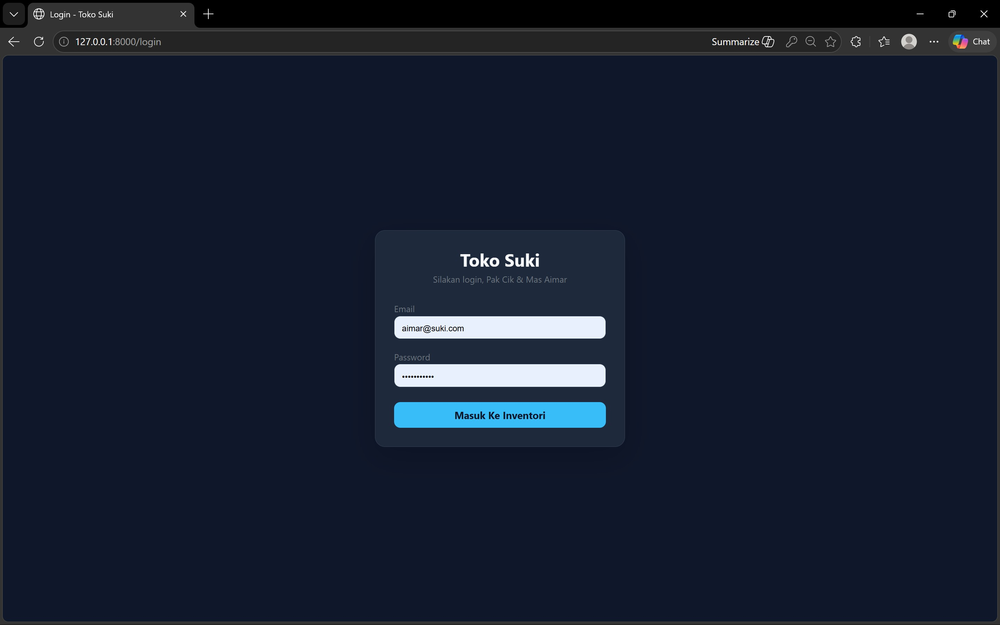
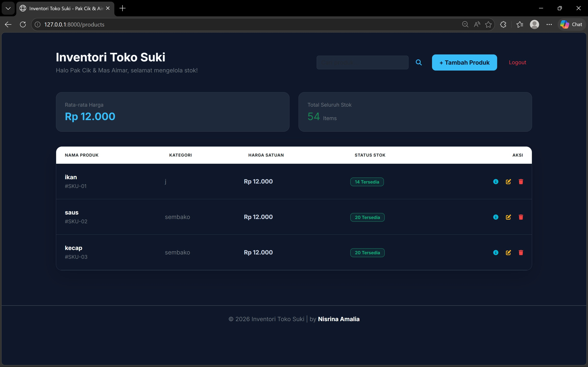
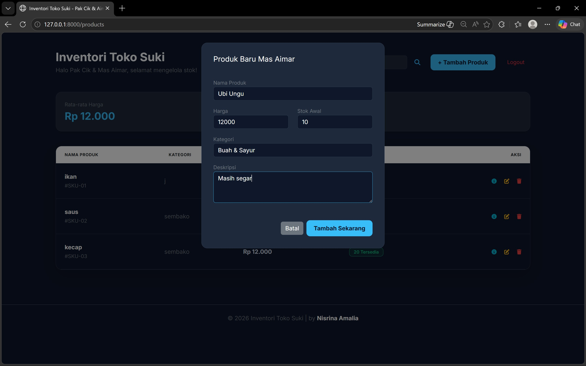
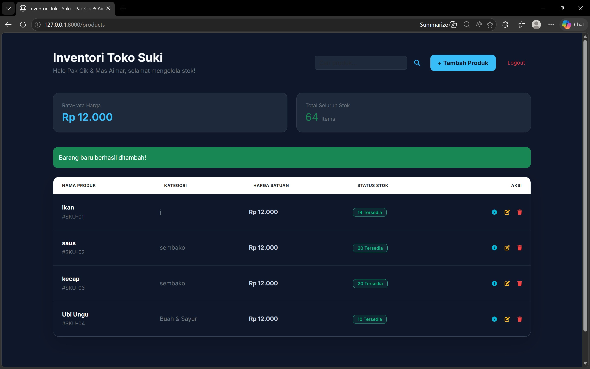
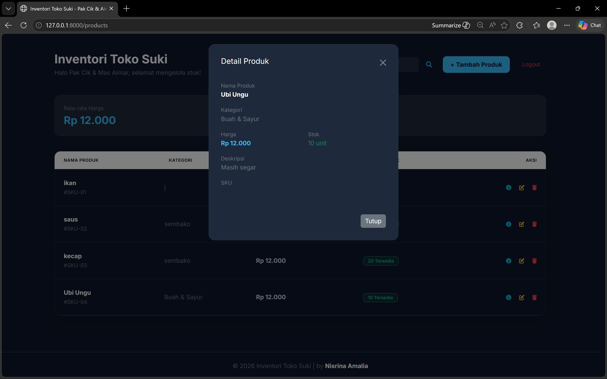
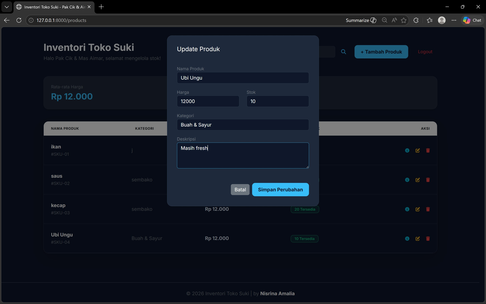
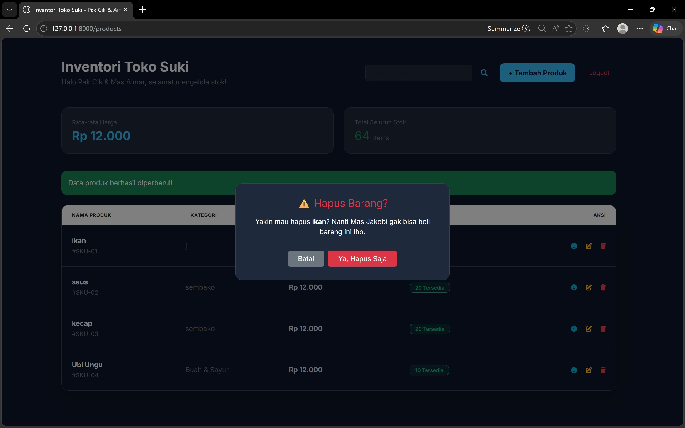
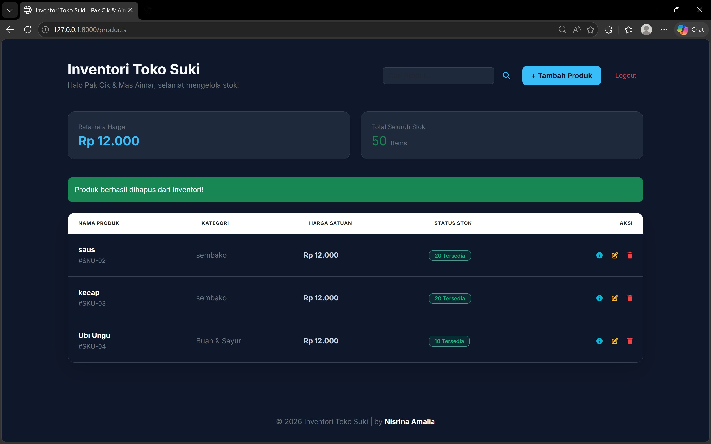
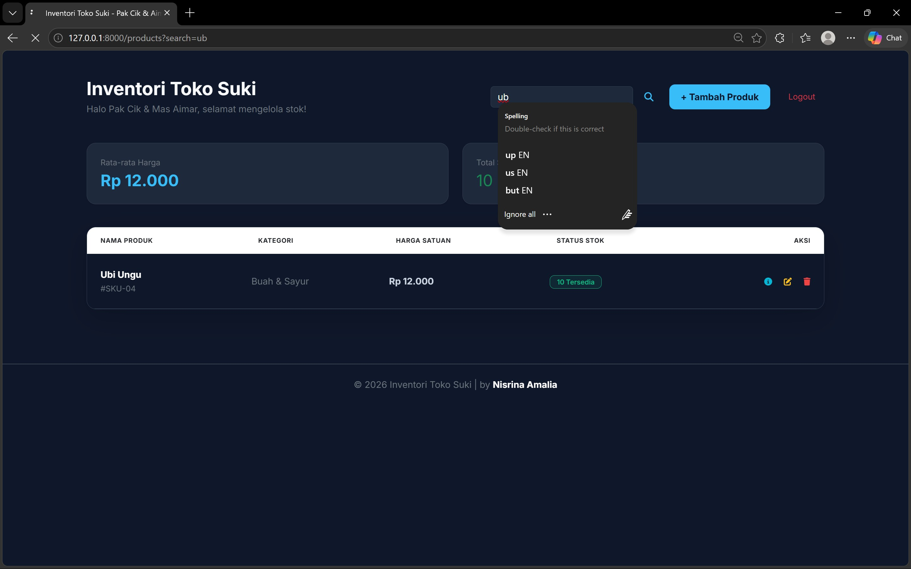

<div align="center">
  <br />
  <h1>LAPORAN PRAKTIKUM <br>APLIKASI BERBASIS PLATFORM</h1>
  <br />
  <h3> MODUL 11, 12, DAN 13 <br> MANAJEMEN TOKO SUKI </h3>
  <br />
   
  <br />
  <br />
  <br />
  <h3>Disusun Oleh :</h3>
  <p>
    <strong>Nisrina Amalia Iffatunnisa</strong><br>
    <strong>2311102156</strong><br>
    <strong>S1 IF-11-01</strong>
  </p>
  <br />
  <h3>Dosen Pengampu :</h3>
  <p>
    <strong>Dimas Fanny Hebrasianto Permadi, S.ST., M.Kom</strong>
  </p>
  <br />
  <br />
    <h4>Asisten Praktikum :</h4>
    <strong> Apri Pandu Wicaksono </strong> <br>
    <strong>Rangga Pradarrell Fathi</strong>
  <br />
  <h3>LABORATORIUM HIGH PERFORMANCE
 <br>FAKULTAS INFORMATIKA <br>UNIVERSITAS TELKOM PURWOKERTO <br>2026</h3>
</div>

---

## 1. Dasar Teori

### CRUD
CRUD merupakan konsep dasar dalam pengelolaan data pada sistem informasi. CRUD terdiri dari empat operasi utama, yaitu Create (menambah data), Read (menampilkan data), Update (memperbarui data), dan Delete (menghapus data). Konsep ini digunakan dalam hampir semua aplikasi berbasis database maupun aplikasi web. Dalam pengembangan aplikasi web, CRUD biasanya diimplementasikan melalui HTTP method seperti GET, POST, PUT, dan DELETE. Laravel mempermudah proses ini melalui metode-metode pada Controller yang dihubungkan dengan model Eloquent. Selain itu, Laravel menyediakan fitur Validation untuk memastikan bahwa data yang dikirimkan oleh pengguna (seperti harga atau stok produk) memenuhi kriteria tertentu sebelum disimpan ke database, guna menjaga integritas dan validitas data sistem.

### Framework Laravel dan Arsitektur MVC
Laravel adalah framework pengembangan aplikasi web berbasis PHP yang dirancang untuk meningkatkan produktivitas pengembang melalui sintaks yang ekspresif dan elegan. Framework ini menerapkan pola desain Model-View-Controller (MVC) yang memisahkan logika bisnis (Model), antarmuka pengguna (View), dan logika aplikasi atau pengatur alur data (Controller). Dengan pemisahan ini, pengembangan aplikasi menjadi lebih terstruktur, mudah dikelola, dan memungkinkan kolaborasi tim yang lebih efisien karena setiap komponen memiliki tanggung jawab yang spesifik.

### Composer
Composer merupakan dependency manager untuk bahasa pemrograman PHP. Dalam ekosistem Laravel, Composer berfungsi untuk menginstal, memperbarui, dan mengelola pustaka (library) atau paket tambahan yang diperlukan oleh aplikasi. Melalui file composer.json, pengembang dapat memastikan bahwa semua dependensi proyek berada pada versi yang kompatibel, sehingga mempermudah proses instalasi aplikasi di berbagai lingkungan pengembangan yang berbeda.

### Migrations
Migrations adalah sistem kontrol versi untuk database yang memungkinkan pengembang mendefinisikan dan memodifikasi struktur tabel secara terprogram melalui kode PHP. Dengan menggunakan migrations, setiap perubahan skema database, seperti penambahan kolom kategori pada tabel produk dapat tercatat dan dibagikan ke anggota tim lain dengan mudah. Hal ini menjaga konsistensi struktur database di seluruh lingkungan pengembangan tanpa perlu melakukan ekspor-impor file SQL secara manual.

### Session dan Autentikasi
Session digunakan untuk menyimpan informasi pengguna di seluruh permintaan HTTP yang bersifat stateless, seperti status login pengguna. Laravel menyediakan sistem autentikasi bawaan yang lengkap, mencakup proses verifikasi identitas pengguna, pengelolaan kata sandi yang terenkripsi, hingga perlindungan terhadap serangan keamanan umum. Sistem ini memastikan bahwa data inventori sensitif hanya dapat dikelola oleh personil yang memiliki hak akses resmi.

### Blade Templating Engine
Blade adalah engine template yang disediakan oleh Laravel untuk mempermudah pembuatan antarmuka pengguna yang dinamis. Berbeda dengan PHP murni, Blade menawarkan sintaks yang lebih ringkas (seperti @if, @foreach, dan @csrf) serta fitur template inheritance yang memungkinkan pengembang membuat tata letak (layout) utama yang dapat digunakan kembali oleh halaman lain. Fitur ini sangat efektif untuk membangun dashboard yang memiliki komponen berulang seperti sidebar atau navbar.

## 2. Sourcecode 

### Sourcecode ProductController.php
``` PHP
<?php

namespace App\Http\Controllers;
use App\Models\Product;
use Illuminate\Http\Request;

class ProductController extends Controller
{
    /**
     * Display a listing of the resource.
     */
    
    public function index()
    {
        $query = Product::query();
        
        // Handle search filter
        if (request('search')) {
            $search = request('search');
            $query->where('name', 'like', '%' . $search . '%')
                  ->orWhere('category', 'like', '%' . $search . '%')
                  ->orWhere('description', 'like', '%' . $search . '%');
        }
        
        $products = $query->get();
        
        // Data untuk statistik di bagian atas UI
        $avgPrice = $query->avg('price') ?? 0;
        $totalStock = $query->sum('stock') ?? 0;

        return view('products.index', compact('products', 'avgPrice', 'totalStock'));
    }

    /**
     * Show the form for creating a new resource.
     */
    public function create()
    {
        //
    }

    /**
     * Store a newly created resource in storage.
     */
    
    public function store(Request $request)
    {
        $request->validate([
            'name' => 'required',
            'price' => 'required|numeric',
            'stock' => 'required|numeric',
            'category' => 'nullable|string|max:255',
            'description' => 'nullable|string',
        ]);

        Product::create($request->all());

        return redirect()->route('products.index')->with('success', 'Barang baru berhasil ditambah!');
    }

    /**
     * Display the specified resource.
     */
    public function show(string $id)
    {
        $product = Product::findOrFail($id);
        return view('products.show', compact('product'));
    }

    /**
     * Show the form for editing the specified resource.
     */
    public function edit(string $id)
    {
        //
    }

    /**
     * Update the specified resource in storage.
     */

    public function update(Request $request, Product $product)
    {
        $request->validate([
            'name' => 'required',
            'price' => 'required|numeric',
            'stock' => 'required|numeric',
            'category' => 'nullable|string|max:255',
            'description' => 'nullable|string',
        ]);

        $product->update($request->all());

        return redirect()->route('products.index')->with('success', 'Data produk berhasil diperbarui!');
    }

    /**
     * Remove the specified resource from storage.
     */
    public function destroy(Product $product)
    {
        $product->delete();

        return redirect()->route('products.index')->with('success', 'Produk berhasil dihapus dari inventori!');
    }
}
```

### Sourcecode web.php
``` PHP
<?php

use Illuminate\Support\Facades\Route;
use App\Http\Controllers\ProductController;
use App\Http\Controllers\AuthController;

// Route Auth
Route::get('/login', [AuthController::class, 'showLogin'])->name('login');
Route::post('/login', [AuthController::class, 'login']);
Route::post('/logout', [AuthController::class, 'logout'])->name('logout');

// Proteksi Route Produk (Hanya bisa diakses jika sudah login)
Route::middleware(['auth'])->group(function () {
    Route::resource('products', ProductController::class);
    Route::get('/', [ProductController::class, 'index']); // Jadikan dashboard utama
});
```

### Sourcecode Model Product.php
``` PHP
<?php

namespace App\Models;

use Illuminate\Database\Eloquent\Model;
use Illuminate\Database\Eloquent\Factories\HasFactory;
class Product extends Model
{
    use HasFactory;

    // Tambahkan baris ini:
    protected $fillable = ['name', 'price', 'stock', 'description', 'category'];
}
```


## 3. Penjelasan Implementasi Sistem Toko Pak Cik Aimar
Pada praktikum ini dibuat sebuah aplikasi web lokal sederhana untuk manajemen inventori "Toko Pakcik Aimar" (Toko Suki) menggunakan konsep CRUD (Create, Read, Update, Delete). Aplikasi ini dikembangkan menggunakan framework Laravel dengan bahasa pemrograman PHP pada sisi backend. Untuk penyimpanan data, aplikasi ini memanfaatkan database MySQL yang dikelola melalui Eloquent ORM, sedangkan untuk antarmuka pengguna, aplikasi menggunakan Blade Templating Engine yang dipadukan dengan Bootstrap 5 guna menghasilkan tampilan dashboard yang modern, responsif, dan dinamis.


### 1.) Langkah-Langkah Pengembangan Sistem Manajemen Inventori
a. Inisialisasi Proyek Laravel
Perintah: `composer create-project laravel/laravel toko-pakcik-aimar`

Penjelasan: Langkah pertama adalah men-generate kerangka kerja (boilerplate) Laravel. Perintah ini menyiapkan struktur folder standar MVC (Model-View-Controller) serta dependensi yang dibutuhkan agar aplikasi PHP dapat berjalan di lingkungan modern.

b. Konfigurasi Lingkungan dan Database
File yang Dimodifikasi: .env

Penjelasan: Pada file .env, dilakukan sinkronisasi antara aplikasi dan MySQL. Nama database diberi nama bebas sesuai preferensi masing-masing. Setelah konfigurasi disimpan, database dibuat secara manual melalui MySQL (misal: phpMyAdmin) sebelum melangkah ke proses migrasi.

c. Pembuatan Model dan Migrasi Utama
Perintah: php artisan make:model Product -m

File yang Dimodifikasi: `* database/migrations/[timestamp]_create_products_table.php`

app/Models/Product.php

Penjelasan: Parameter -m secara otomatis membuat file migrasi bersamaan dengan model. Di dalam file migrasi, kita mendefinisikan kolom: name (string), price (integer), stock (integer), dan description (text). Pada model Product.php, ditambahkan properti $fillable agar kolom tersebut diizinkan untuk pengisian data secara massal.

d. Migrasi Tambahan (Skema Dinamis)
Perintah: `php artisan make:migration add_category_to_products_table --table=products`

Penjelasan: Untuk menunjukkan fleksibilitas skema database, dilakukan penambahan kolom category tanpa menghapus data lama. Setelah file migrasi baru diedit, jalankan php artisan migrate untuk memperbarui struktur tabel di MySQL.

e. Pengembangan Controller (Logika Bisnis)
Perintah: `php artisan make:controller ProductController --resource`

File yang Dimodifikasi: `app/Http/Controllers/ProductController.php`

Penjelasan: Controller ini adalah "otak" dari sistem. Di sini kita memodifikasi metode:
- index(): Untuk mengambil data dengan filter pencarian dan menghitung statistik (rata-rata harga).
- store() & update(): Menambahkan validasi data (misal: harga tidak boleh negatif).
- destroy(): Menangani penghapusan data berdasarkan ID produk.

f. Pengaturan Routing (Navigasi)
File yang Dimodifikasi: routes/web.php

Penjelasan: Semua rute aplikasi didefinisikan di sini. Rute produk dibungkus dengan middleware auth untuk memastikan hanya pengguna terverifikasi yang bisa mengelola inventori. Rute utama / diarahkan langsung ke halaman dashboard produk.

g. Implementasi Autentikasi
File yang Dimodifikasi: `app/Http/Controllers/AuthController.php`

Penjelasan: Dibuat Controller khusus untuk menangani proses login dan logout. Sistem ini menggunakan session Laravel untuk melacak identitas pengguna, yang kemudian dihubungkan dengan tampilan login yang responsif.

h. Perancangan User Interface (Blade Templates)
File yang Dimodifikasi: `resources/views/products/index.blade.php`

Penjelasan: Menggunakan Blade Engine untuk menggabungkan logika PHP dan HTML. Di sini kita mengintegrasikan Bootstrap 5 dan Font Awesome. Tampilan dibagi menjadi beberapa komponen:
- Statistik: Menggunakan Cards untuk ringkasan data.
- Tabel: Menampilkan list produk dengan aksi (ikon edit/hapus).
- Modal: Digunakan untuk form Tambah, Ubah, Detail, dan Hapus (seperti yang terlihat pada lampiran gambar) agar interaksi pengguna lebih lancar tanpa reload halaman.

i. Seeding Database (Data Uji)
Perintah: `php artisan make:factory ProductFactory dan php artisan db:seed`

Penjelasan: Untuk keperluan pengujian, dibuat data dummy menggunakan Factory dan Faker. Ini memastikan saat aplikasi pertama kali dijalankan, sudah tersedia data produk untuk menguji fitur pencarian dan statistik harga.

j. Running the App
Setelah seluruh struktur kode dan database siap, langkah terakhir adalah menjalankan aplikasi ke server lokal agar bisa diakses melalui peramban (browser).

- Menjalankan Server Lokal:
Gunakan perintah php artisan serve pada terminal. Laravel akan menjalankan server melalui alamat http://127.0.0.1:8000.
- Halaman Autentikasi (Login):

Saat pertama kali diakses, sistem akan mengarahkan pengguna ke halaman Login. Keamanan pada form ini dijamin oleh middleware Laravel yang memastikan data terenkripsi aman.
- Dashboard Inventori (Tampilan Utama):

Setelah berhasil masuk, pengguna akan disuguhkan dengan Dashboard Toko Suki. Di bagian atas, terdapat kartu statistik yang menunjukkan rata-rata harga produk dan total stok secara real-time hasil dari logika perhitungan di ProductController.
- Interaksi CRUD melalui Modal:
a.) Tambah Data


Pengguna tidak perlu berpindah halaman, cukup klik tombol tambah, maka Modal Bootstrap akan muncul untuk pengisian data produk baru.

b.) Update & Detail: Setiap baris tabel dilengkapi dengan ikon aksi. Ikon mata untuk melihat detail lengkap, dan ikon pensil untuk mengubah data produk yang sudah ada.





c.) Hapus Data: Untuk mencegah penghapusan yang tidak sengaja, sistem akan menampilkan modal konfirmasi "Hapus Produk?" sebelum data benar-benar dihilangkan dari database MySQL.



- Fitur Pencarian Dinamis:
Terdapat kolom pencarian di pojok kanan atas. Saat pengguna mengetikkan nama produk atau kategori (seperti "ubi" atau "ungu"), sistem akan melakukan filter secara otomatis menggunakan query LIKE di backend, sehingga data yang tampil pada tabel menjadi lebih spesifik sesuai kebutuhan pengguna.



## Kesimpulan
Praktikum ini berhasil memenuhi seluruh ketentuan praktikum melalui pengembangan aplikasi manajemen inventori "Toko Pakcik Aimar" yang fungsional dan terintegrasi. Implementasi framework Laravel memungkinkan pembangunan arsitektur MVC yang rapi, seluruh operasi CRUD pada data produk dapat berjalan dengan aman. Penggunaan Eloquent ORM dan sistem migrations mempermudah pengelolaan basis data, termasuk penambahan kategori produk secara dinamis untuk pengelompokan informasi yang lebih baik. Selain itu, penerapan middleware autentikasi dan validasi input  menjamin keamanan data dari akses yang tidak sah maupun kesalahan entri. Secara keseluruhan, proyek ini sudah terintegrasi antara backend PHP dan antarmuka responsif Bootstrap dapat menghasilkan sistem informasi yang efektif.


## Referensi
[1] Informatics Lab, “Modul 11: Laravel : Introduction,” in Modul Praktikum Pemrograman Web S1 Teknologi Informasi, Bandung, Indonesia: Fakultas Informatika, Telkom University, 2024, pp. 71–79. </br>
[2] Informatics Lab, “Modul 12: Laravel : Database 1,” in Modul Praktikum Pemrograman Web S1 Teknologi Informasi, Bandung, Indonesia: Fakultas Informatika, Telkom University, 2024, pp. 80–89. </br>
[3] Informatics Lab, “Modul 13: Laravel : Database 2,” in Modul Praktikum Pemrograman Web S1 Teknologi Informasi, Bandung, Indonesia: Fakultas Informatika, Telkom University, 2024, pp. 90–92. <br>
