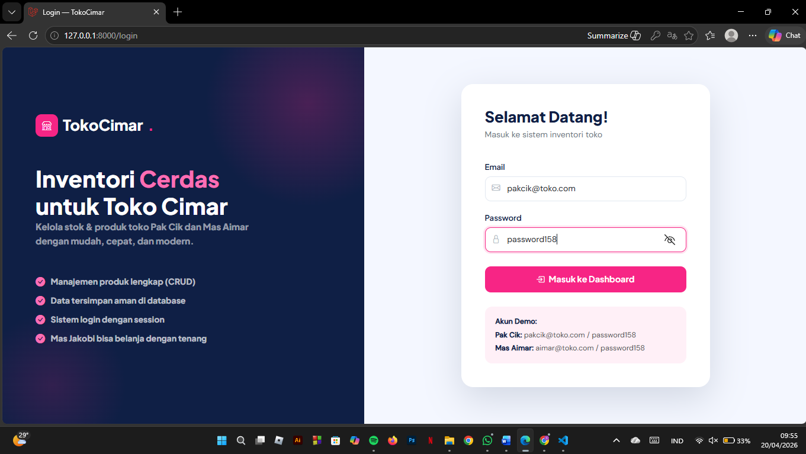
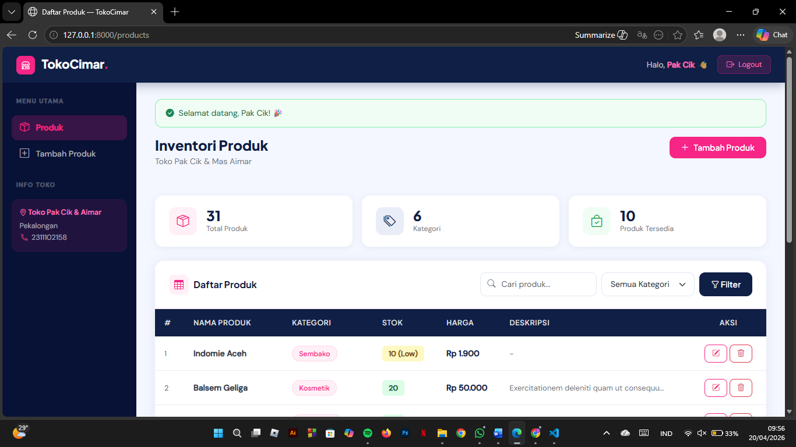
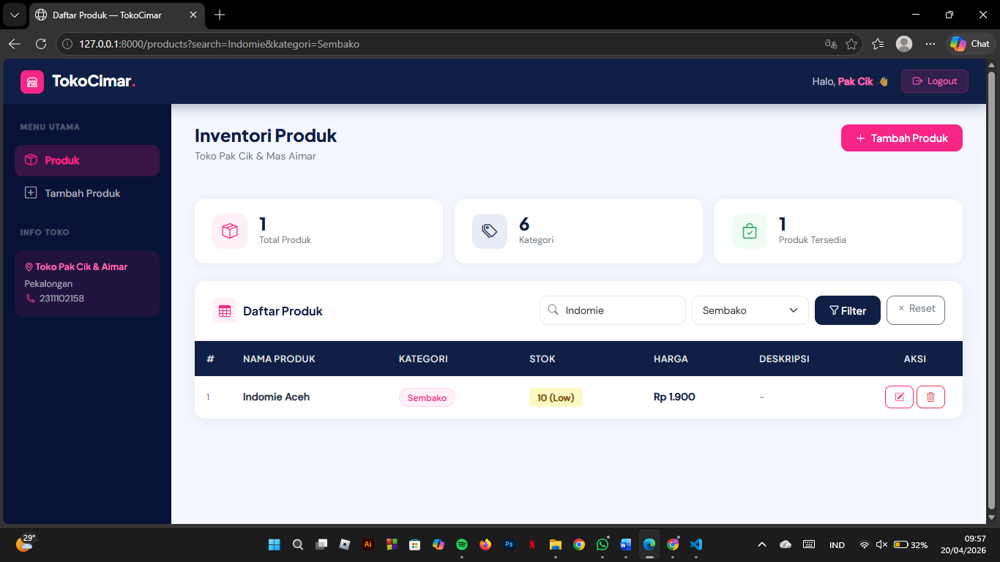
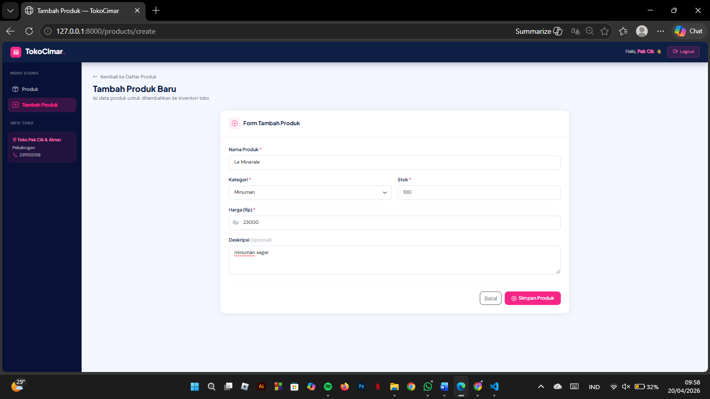
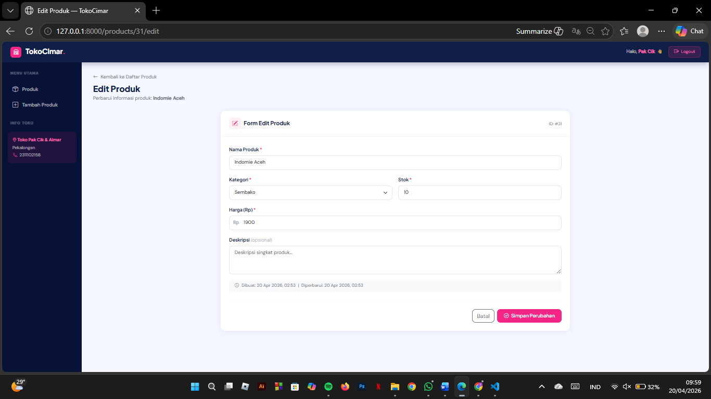
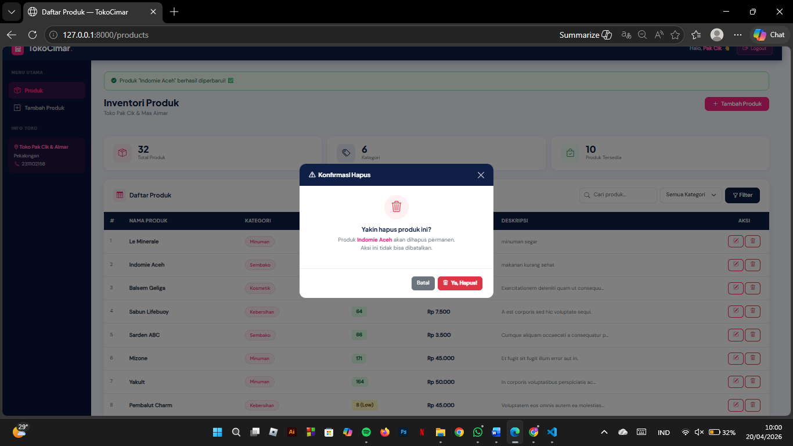
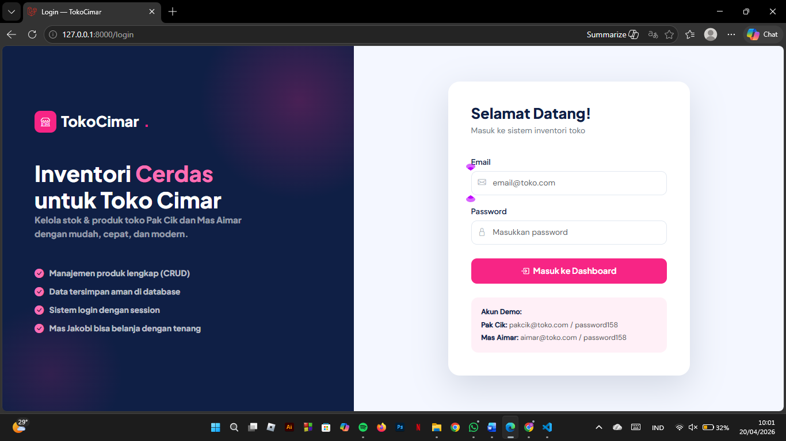

<div align="center">

# LAPORAN PRAKTIKUM  
# APLIKASI BERBASIS PLATFORM

## MODUL 11, 12, 13
## MANAJEMEN TOKO SUKI


### Disusun Oleh
**Shafa Adila Santoso**  
2311102158  
S1 IF-11-REG01

### Dosen Pengampu
**Dimas Fanny Hebrasianto Permadi, S.ST., M.Kom**

### Asisten Praktikum
Apri Pandu Wicaksono  
Rangga Pradarrell Fathi  

### LABORATORIUM HIGH PERFORMANCE  
FAKULTAS INFORMATIKA  
UNIVERSITAS TELKOM PURWOKERTO  
2026

</div>

---

<div align="justify">

# 1. Dasar Teori

## 1. CRUD
CRUD adalah konsep fundamental dalam pengelolaan data pada sistem informasi. Istilah ini mencakup empat aktivitas utama, yaitu Create (menambahkan data), Read (menampilkan atau mengambil data), Update (mengubah data), dan Delete (menghapus data). Hampir seluruh aplikasi berbasis database maupun web menerapkan konsep ini. Dalam konteks pengembangan web, CRUD biasanya direpresentasikan melalui metode HTTP seperti GET, POST, PUT, dan DELETE. Laravel mempermudah implementasi CRUD melalui fungsi-fungsi pada Controller yang terhubung dengan model Eloquent. Selain itu, Laravel juga menyediakan fitur validasi untuk memastikan data yang dikirim pengguna—misalnya harga atau stok—telah memenuhi aturan tertentu sebelum disimpan, sehingga kualitas dan konsistensi data tetap terjaga.

## 2. Framework Laravel dan Arsitektur MVC
Laravel merupakan framework berbasis PHP yang dirancang untuk membantu developer membangun aplikasi web dengan lebih efisien melalui sintaks yang sederhana dan elegan. Framework ini mengadopsi pola Model-View-Controller (MVC), yaitu pemisahan antara pengelolaan data (Model), tampilan antarmuka (View), dan pengatur alur aplikasi (Controller). Dengan konsep ini, struktur aplikasi menjadi lebih rapi, mudah dipelihara, serta mendukung kerja tim karena setiap bagian memiliki fungsi yang jelas.

## 3. Composer
Composer adalah alat untuk mengelola dependensi dalam bahasa PHP. Pada Laravel, Composer digunakan untuk mengunduh, memperbarui, dan mengatur berbagai library atau paket tambahan yang dibutuhkan aplikasi. Melalui file composer.json, developer dapat menentukan versi dependensi yang sesuai agar aplikasi dapat berjalan dengan baik di berbagai lingkungan pengembangan tanpa konflik versi.

## 4. Migrations
Migrations berfungsi sebagai sistem pengelolaan versi untuk struktur database. Dengan fitur ini, developer dapat membuat dan mengubah tabel database melalui kode program. Setiap perubahan, seperti penambahan kolom baru pada tabel, dapat terdokumentasi dengan rapi dan dibagikan ke tim tanpa perlu melakukan ekspor atau impor file SQL secara manual. Hal ini membantu menjaga keseragaman struktur database di semua lingkungan kerja.

## 5. Session dan Autentikasi
Session digunakan untuk menyimpan data pengguna sementara selama proses interaksi dengan aplikasi, seperti status login. Laravel menyediakan fitur autentikasi yang lengkap, mulai dari proses login, pengamanan password dengan enkripsi, hingga perlindungan terhadap berbagai ancaman keamanan. Dengan sistem ini, hanya pengguna yang memiliki hak akses yang dapat mengelola data penting seperti inventori.

## 6. Blade Templating Engine
Blade merupakan template engine bawaan Laravel yang memudahkan pembuatan tampilan web yang dinamis. Blade menawarkan sintaks yang lebih ringkas dibandingkan PHP biasa, seperti penggunaan @if, @foreach, dan @csrf. Selain itu, Blade mendukung konsep template inheritance, sehingga developer dapat membuat layout utama yang bisa digunakan kembali pada berbagai halaman. Hal ini sangat membantu dalam membangun antarmuka seperti dashboard yang memiliki elemen berulang, misalnya navbar dan sidebar.

---

## Sourcode
**create_products_table.php**

```php
<?php

use Illuminate\Database\Migrations\Migration;
use Illuminate\Database\Schema\Blueprint;
use Illuminate\Support\Facades\Schema;

return new class extends Migration
{
    public function up(): void
    {
        Schema::create('products', function (Blueprint $table) {
            $table->id();
            $table->string('nama_produk');
            $table->string('kategori');
            $table->integer('stok');
            $table->decimal('harga', 12, 2);
            $table->text('deskripsi')->nullable();
            $table->timestamps();
        });
    }

    public function down(): void
    {
        Schema::dropIfExists('products');
    }
};
```
Kode tersebut adalah file *migration* pada Laravel yang berfungsi untuk membuat tabel **products** dalam database. Pada fungsi `up()`, ditentukan struktur tabel yang terdiri dari beberapa kolom, yaitu `id` sebagai primary key yang dibuat secara otomatis, `nama_produk` dan `kategori` dengan tipe data string untuk menyimpan informasi nama dan jenis produk, `stok` bertipe integer untuk jumlah persediaan, serta `harga` bertipe decimal dengan total 12 digit dan 2 angka desimal untuk menyimpan nilai harga. Terdapat juga kolom `deskripsi` bertipe text yang bersifat opsional karena dapat bernilai kosong (nullable). Selain itu, digunakan `timestamps()` untuk menambahkan kolom `created_at` dan `updated_at` yang mencatat waktu pembuatan dan perubahan data. Sementara itu, fungsi `down()` digunakan untuk menghapus tabel **products** apabila migration dibatalkan, sehingga struktur database dapat dikembalikan ke kondisi sebelumnya.

---

**DatabaseSeeder.php**

```php
<?php

namespace Database\Seeders;

use Illuminate\Database\Seeder;
use Illuminate\Support\Facades\Hash;
use App\Models\User;
use App\Models\Product;

class DatabaseSeeder extends Seeder
{
    public function run(): void
    {
        // Buat user admin - Pak Cik & Mas Aimar
        User::create([
            'name'     => 'Pak Cik',
            'email'    => 'pakcik@toko.com',
            'password' => Hash::make('password158'),
        ]);

        User::create([
            'name'     => 'Mas Aimar',
            'email'    => 'aimar@toko.com',
            'password' => Hash::make('password158'),
        ]);

        // Generate 30 produk pakai factory
        Product::factory(30)->create();
    }
}
```
Kode tersebut merupakan file **DatabaseSeeder** pada Laravel yang berfungsi untuk mengisi data awal (seeding) ke dalam database. Pada method `run()`, dibuat dua data pengguna secara manual menggunakan model `User`, yaitu “Pak Cik” dan “Mas Aimar” dengan email masing-masing serta password yang telah dienkripsi menggunakan `Hash::make()` untuk menjaga keamanan. Setelah itu, sistem juga menghasilkan 30 data produk secara otomatis dengan memanfaatkan *factory* pada model `Product`, sehingga data produk dapat dibuat secara cepat tanpa perlu menuliskannya satu per satu. Dengan adanya seeder ini, database dapat langsung memiliki data awal yang siap digunakan untuk pengujian maupun pengembangan aplikasi.

---

**ProductFactory.php**

```php
<?php

namespace Database\Factories;

use Illuminate\Database\Eloquent\Factories\Factory;

class ProductFactory extends Factory
{
    public function definition(): array
    {
        $kategori = $this->faker->randomElement([
            'Minuman', 'Makanan Ringan', 'Sembako', 'Peralatan Rumah', 'Kebersihan', 'Kosmetik'
        ]);

        $produkByKategori = [
            'Minuman'          => ['Aqua 600ml', 'Teh Botol Sosro', 'Pocari Sweat', 'Mizone', 'Fanta Merah', 'Coca-Cola', 'Le Minerale', 'Sprite', 'Yakult', 'Kopiko 78°C'],
            'Makanan Ringan'   => ['Chitato Sapi Panggang', 'Oreo Original', 'Biskuat', 'Wafer Tango', 'Pringles Original', 'Roti Sobek Sari Roti', 'Malkist Crackers', 'Taro Net', 'Momogi', 'Superstar Snack'],
            'Sembako'          => ['Beras Premium 5kg', 'Minyak Goreng Bimoli 1L', 'Gula Pasir 1kg', 'Telur Ayam 1kg', 'Terigu Segitiga Biru', 'Kecap Manis ABC', 'Indomie Goreng', 'Santan Kara', 'Sarden ABC', 'Kornet Pronas'],
            'Peralatan Rumah'  => ['Sapu Lidi', 'Ember Plastik', 'Gayung', 'Lap Pel', 'Tali Rafia', 'Baskom Sedang', 'Hanger Baju', 'Sikat Gigi Oral-B', 'Korek Api', 'Lilin'],
            'Kebersihan'       => ['Sabun Lifebuoy', 'Shampoo Pantene', 'Deterjen Rinso', 'Softener Downy', 'Sabun Cuci Piring Sunlight', 'Odol Pepsodent', 'Pewangi Ruangan Glade', 'Pembalut Charm', 'Tisu Paseo', 'Hand Sanitizer'],
            'Kosmetik'         => ['Bedak Marcks', 'Lip Balm Vaseline', 'Pelembab Nivea', 'Deodorant Rexona', 'Body Lotion Citra', 'Minyak Kayu Putih Cap Lang', 'Balsem Geliga', 'Cologne Gatsby', 'Pomade Gatsby', 'Minyak Rambut Brisk'],
        ];

        return [
            'nama_produk' => $this->faker->randomElement($produkByKategori[$kategori]),
            'kategori'    => $kategori,
            'stok'        => $this->faker->numberBetween(5, 200),
            'harga'       => $this->faker->randomElement([1500, 2000, 2500, 3000, 3500, 4000, 5000, 6500, 7500, 8000, 10000, 12000, 15000, 18000, 20000, 25000, 30000, 35000, 45000, 50000]),
            'deskripsi'   => $this->faker->sentence(8),
        ];
    }
}
```
Kode tersebut merupakan **factory** pada Laravel yang digunakan untuk menghasilkan data dummy pada tabel produk secara otomatis. Di dalam method `definition()`, pertama-tama ditentukan kategori produk secara acak menggunakan Faker dari beberapa pilihan seperti Minuman, Makanan Ringan, hingga Kosmetik. Selanjutnya, setiap kategori memiliki daftar nama produk yang spesifik, sehingga nama produk yang dihasilkan akan menyesuaikan dengan kategori yang dipilih. Data lain seperti `stok` diisi dengan angka acak antara 5 hingga 200, sedangkan `harga` dipilih dari daftar nilai yang telah ditentukan agar lebih realistis. Untuk `deskripsi`, digunakan fungsi Faker untuk menghasilkan kalimat acak. Dengan adanya factory ini, proses pembuatan data produk menjadi lebih cepat, bervariasi, dan mendekati kondisi data nyata sehingga cocok digunakan untuk kebutuhan testing maupun pengembangan aplikasi.

---

**AuthSession.php**

```php
<?php

namespace App\Http\Middleware;

use Closure;
use Illuminate\Http\Request;
use Illuminate\Support\Facades\Session;
use Symfony\Component\HttpFoundation\Response;

class AuthSession
{
    public function handle(Request $request, Closure $next): Response
    {
        if (!Session::has('user')) {
            return redirect()->route('login')->with('error', 'Silakan login terlebih dahulu.');
        }

        return $next($request);
    }
}
```
Kode tersebut merupakan middleware pada Laravel yang digunakan untuk melakukan pengecekan autentikasi berbasis session. Pada fungsi `handle()`, aplikasi akan memverifikasi apakah terdapat data `user` di dalam session dengan menggunakan `Session::has('user')`. Jika session tersebut tidak ada, maka pengguna akan dialihkan ke halaman login melalui route `login` dan disertai pesan kesalahan berupa “Silakan login terlebih dahulu.”. Namun, apabila data `user` ditemukan di session, maka request akan diteruskan ke proses selanjutnya dengan `$next($request)`. Middleware ini berperan penting dalam membatasi akses halaman tertentu agar hanya dapat diakses oleh pengguna yang telah berhasil login.

---

**ProductController.php**

```php
<?php

namespace App\Http\Controllers;

use App\Models\Product;
use Illuminate\Http\Request;

class ProductController extends Controller
{
    public function index(Request $request)
    {
        $search = $request->get('search');
        $kategori = $request->get('kategori');

        $query = Product::query();

        if ($search) {
            $query->where('nama_produk', 'like', "%{$search}%");
        }

        if ($kategori) {
            $query->where('kategori', $kategori);
        }

        $products  = $query->orderBy('created_at', 'desc')->paginate(10)->withQueryString();
        $kategoris = Product::select('kategori')->distinct()->pluck('kategori');

        return view('products.index', compact('products', 'kategoris', 'search', 'kategori'));
    }

    public function create()
    {
        $kategoris = ['Minuman', 'Makanan Ringan', 'Sembako', 'Peralatan Rumah', 'Kebersihan', 'Kosmetik'];
        return view('products.create', compact('kategoris'));
    }

    public function store(Request $request)
    {
        $request->validate([
            'nama_produk' => 'required|string|max:100',
            'kategori'    => 'required|string|max:50',
            'stok'        => 'required|integer|min:0',
            'harga'       => 'required|numeric|min:0',
            'deskripsi'   => 'nullable|string|max:500',
        ], [
            'nama_produk.required' => 'Nama produk wajib diisi.',
            'kategori.required'    => 'Kategori wajib dipilih.',
            'stok.required'        => 'Stok wajib diisi.',
            'stok.integer'         => 'Stok harus berupa angka.',
            'stok.min'             => 'Stok tidak boleh negatif.',
            'harga.required'       => 'Harga wajib diisi.',
            'harga.numeric'        => 'Harga harus berupa angka.',
        ]);

        Product::create($request->only(['nama_produk', 'kategori', 'stok', 'harga', 'deskripsi']));

        return redirect()->route('products.index')->with('success', 'Produk "' . $request->nama_produk . '" berhasil ditambahkan! 🛒');
    }

    public function edit(Product $product)
    {
        $kategoris = ['Minuman', 'Makanan Ringan', 'Sembako', 'Peralatan Rumah', 'Kebersihan', 'Kosmetik'];
        return view('products.edit', compact('product', 'kategoris'));
    }

    public function update(Request $request, Product $product)
    {
        $request->validate([
            'nama_produk' => 'required|string|max:100',
            'kategori'    => 'required|string|max:50',
            'stok'        => 'required|integer|min:0',
            'harga'       => 'required|numeric|min:0',
            'deskripsi'   => 'nullable|string|max:500',
        ], [
            'nama_produk.required' => 'Nama produk wajib diisi.',
            'kategori.required'    => 'Kategori wajib dipilih.',
            'stok.required'        => 'Stok wajib diisi.',
            'stok.integer'         => 'Stok harus berupa angka.',
            'stok.min'             => 'Stok tidak boleh negatif.',
            'harga.required'       => 'Harga wajib diisi.',
            'harga.numeric'        => 'Harga harus berupa angka.',
        ]);

        $product->update($request->only(['nama_produk', 'kategori', 'stok', 'harga', 'deskripsi']));

        return redirect()->route('products.index')->with('success', 'Produk "' . $product->nama_produk . '" berhasil diperbarui! ✅');
    }

    public function destroy(Product $product)
    {
        $nama = $product->nama_produk;
        $product->delete();

        return redirect()->route('products.index')->with('success', 'Produk "' . $nama . '" berhasil dihapus! 🗑️');
    }
}
```
Kode tersebut merupakan **ProductController** pada Laravel yang digunakan untuk mengelola data produk dengan menerapkan operasi CRUD. Method `index()` berfungsi menampilkan daftar produk dengan fitur pencarian berdasarkan nama dan filter kategori, serta menggunakan pagination agar data ditampilkan per halaman. Method `create()` menampilkan form untuk menambahkan produk baru dengan pilihan kategori yang telah ditentukan. Selanjutnya, `store()` digunakan untuk menyimpan data produk ke database setelah melalui proses validasi input seperti nama, kategori, stok, harga, dan deskripsi. Method `edit()` menampilkan form untuk mengubah data produk yang dipilih, sedangkan `update()` bertugas memperbarui data produk setelah divalidasi kembali. Terakhir, method `destroy()` digunakan untuk menghapus data produk dari database. Setiap proses penyimpanan, pembaruan, maupun penghapusan data akan memberikan notifikasi berupa pesan sukses kepada pengguna.

---

**AuthController.php**

```php
<?php

namespace App\Http\Controllers;

use Illuminate\Http\Request;
use Illuminate\Support\Facades\Auth;
use Illuminate\Support\Facades\Session;

class AuthController extends Controller
{
    public function showLogin()
    {
        if (Session::has('user')) {
            return redirect()->route('products.index');
        }
        return view('auth.login');
    }

    public function login(Request $request)
    {
        $request->validate([
            'email'    => 'required|email',
            'password' => 'required|min:6',
        ], [
            'email.required'    => 'Email wajib diisi.',
            'email.email'       => 'Format email tidak valid.',
            'password.required' => 'Password wajib diisi.',
            'password.min'      => 'Password minimal 6 karakter.',
        ]);

        $user = \App\Models\User::where('email', $request->email)->first();

        if ($user && \Illuminate\Support\Facades\Hash::check($request->password, $user->password)) {
            Session::put('user', [
                'id'   => $user->id,
                'name' => $user->name,
                'email'=> $user->email,
            ]);
            return redirect()->route('products.index')->with('success', 'Selamat datang, ' . $user->name . '! 🎉');
        }

        return back()->withErrors(['email' => 'Email atau password salah.'])->withInput($request->only('email'));
    }

    public function logout(Request $request)
    {
        Session::forget('user');
        return redirect()->route('login')->with('success', 'Berhasil logout. Sampai jumpa!');
    }
}
```
Kode tersebut merupakan **AuthController** pada Laravel yang bertugas menangani proses autentikasi pengguna, meliputi login dan logout. Method `showLogin()` digunakan untuk menampilkan halaman login, namun jika pengguna sudah memiliki session `user`, maka akan langsung diarahkan ke halaman utama produk. Method `login()` berfungsi untuk memproses data login dengan melakukan validasi terhadap email dan password, kemudian mencocokkan data pengguna di database. Jika data sesuai, informasi pengguna akan disimpan ke dalam session dan pengguna diarahkan ke halaman produk dengan pesan sukses. Sebaliknya, jika login gagal, sistem akan mengembalikan pengguna ke halaman sebelumnya dengan pesan error. Terakhir, method `logout()` digunakan untuk menghapus session pengguna sehingga status login berakhir, lalu pengguna diarahkan kembali ke halaman login dengan notifikasi berhasil logout.

---

**web.php**

```php
<?php

use Illuminate\Support\Facades\Route;
use App\Http\Controllers\AuthController;
use App\Http\Controllers\ProductController;

// Redirect root ke login
Route::get('/', function () {
    return redirect()->route('login');
});

// Auth routes (guest)
Route::middleware('guest.session')->group(function () {
    Route::get('/login', [AuthController::class, 'showLogin'])->name('login');
    Route::post('/login', [AuthController::class, 'login'])->name('login.post');
});

// Logout
Route::post('/logout', [AuthController::class, 'logout'])->name('logout');

// Protected routes (pakai session middleware)
Route::middleware('auth.session')->group(function () {
    Route::resource('products', ProductController::class)->except(['show']);
});
```
Kode tersebut merupakan konfigurasi **routing** pada Laravel yang mengatur alur akses halaman dalam aplikasi. Pada bagian awal, route `/` diarahkan langsung ke halaman login. Selanjutnya, terdapat grup route dengan middleware `guest.session` yang hanya dapat diakses oleh pengguna yang belum login, yaitu untuk menampilkan halaman login (`showLogin`) dan memproses login (`login`). Route untuk logout didefinisikan secara terpisah menggunakan method POST. Selain itu, terdapat grup route dengan middleware `auth.session` yang membatasi akses hanya untuk pengguna yang sudah login, di mana di dalamnya terdapat resource route `products` yang terhubung dengan `ProductController` untuk menangani operasi CRUD (kecuali `show`). Dengan pengaturan ini, sistem dapat mengontrol hak akses pengguna secara lebih terstruktur dan aman.

---

**Output:**

<p align="center">  </p> 
<p align="center"> </b> halaman login</p>
<p align="center">  </p> 
<p align="center"> </b> halaman dashboard</p>
<p align="center">  </p> 
<p align="center"> </b> halaman cari dan filter produk</p>
<p align="center">  </p> 
<p align="center"> </b> halaman tambah produk</p>
<p align="center">  </p> 
<p align="center"> </b> halaman edit produk</p>
<p align="center">  </p> 
<p align="center"> </b> halaman hapus produk</p>
<p align="center">  </p> 
<p align="center"> </b> halaman logout</p>
