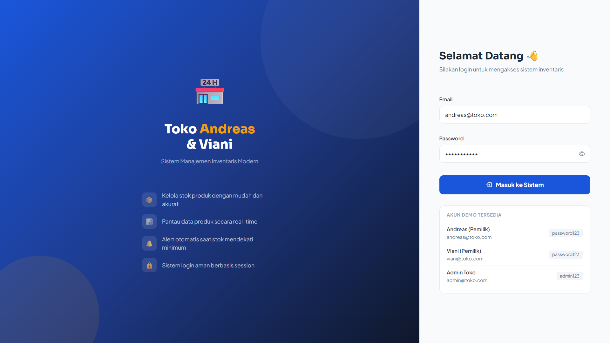
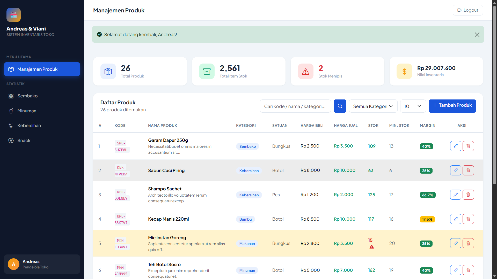
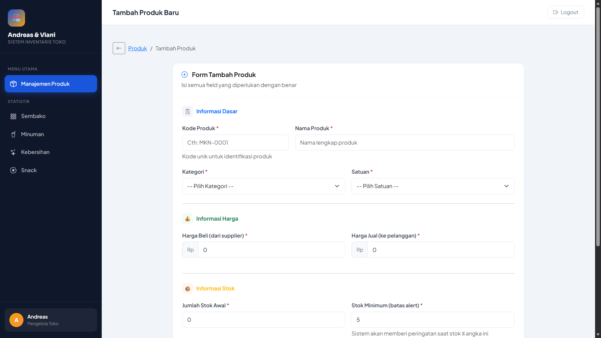
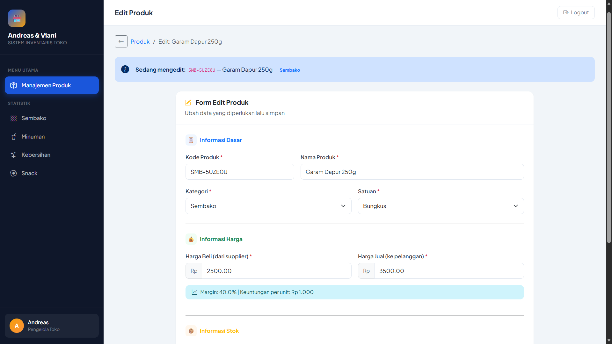
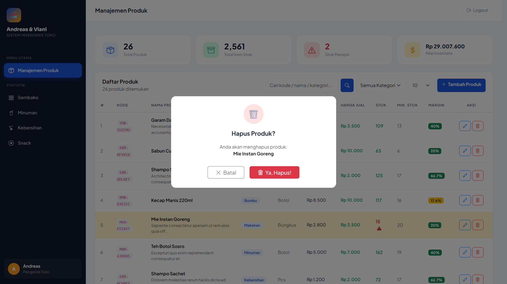

<div align="center">
  <br />

  <h1>LAPORAN PRAKTIKUM <br>
  APLIKASI BERBASIS PLATFORM
  </h1>

  <br />

  <h3>MODUL XI XII XIII <br>
 PHP
  </h3>

  <br />

  

  <br />
  <br />
  <br />

  <h3>Disusun Oleh :</h3>

  <p>
    <strong>Andreas Besar Wibowo</strong><br>
    <strong>2311102198</strong><br>
    <strong>S1 IF-11-REG01</strong>
  </p>

  <br />

  <h3>Dosen Pengampu :</h3>

  <p>
    <strong>Dimas Fanny Hebrasianto Permadi, S.ST., M.Kom</strong>
  </p>
  
  <br />
    <h4>Asisten Praktikum :</h4>
    <strong>Apri Pandu Wicaksono </strong> <br>
    <strong>Rangga Pradarrell Fathi</strong>
  <br />

  <h3>LABORATORIUM HIGH PERFORMANCE
 <br>FAKULTAS INFORMATIKA <br>UNIVERSITAS TELKOM PURWOKERTO <br>2026</h3>
</div>

<hr>

## Tugas | Buat Sistem Inventaris
### Deskripsi
Buat project bisa menggunakan Laravel dimana kalian diminta membuat web inventari toko punya pak cik sama mas aimar (yang ga paham suki) dimana terdapat sebuah crud untuk mengelola produk, dengan tampilan seperti datatable, form create, form edit, dan konfirmasi modal untuk delete. Dan untuk data disimpan dalam database, gunakan database factory dan seeder (biar datanya ga kosong banget). dan buat nilai plus tambahkan dokumentasi project nya (bawaan ai juga udah ada pasti), please wok bantuin biar mas jakobi bisa belanja di toko nya mas aimar, jangan lupa terapin sistem login yaa (pake sistem session), #KingNasirPembantaiNgawiTimur

## Jawaban
### Controllers
1. AuthController
```php
<?php

namespace App\Http\Controllers;

use Illuminate\Http\Request;
use Illuminate\Support\Facades\Hash;
use App\Models\User;

class AuthController extends Controller
{
    /**
     * Tampilkan halaman login
     */
    public function showLogin()
    {
        return view('auth.login');
    }

    /**
     * Proses login dengan session
     */
    public function login(Request $request)
    {
        $request->validate([
            'email' => 'required|email',
            'password' => 'required|min:6',
        ], [
            'email.required' => 'Email wajib diisi.',
            'email.email' => 'Format email tidak valid.',
            'password.required' => 'Password wajib diisi.',
            'password.min' => 'Password minimal 6 karakter.',
        ]);

        $user = User::where('email', $request->email)->first();

        if (!$user || !Hash::check($request->password, $user->password)) {
            return back()
                ->withInput($request->only('email'))
                ->withErrors(['email' => 'Email atau password salah.']);
        }

        // Simpan data user ke session
        $request->session()->put('auth_user', [
            'id' => $user->id,
            'name' => $user->name,
            'email' => $user->email,
        ]);

        $request->session()->regenerate();

        return redirect()->route('products.index')
            ->with('success', 'Selamat datang kembali, ' . $user->name . '!');
    }

    /**
     * Proses logout - hapus session
     */
    public function logout(Request $request)
    {
        $request->session()->forget('auth_user');
        $request->session()->invalidate();
        $request->session()->regenerateToken();

        return redirect()->route('login')
            ->with('success', 'Anda berhasil logout.');
    }
}
```

2. Product Controller
```php
<?php

namespace App\Http\Controllers;

use Illuminate\Http\Request;
use App\Models\Product;

class ProductController extends Controller
{
    /**
     * Tampilkan daftar produk (DataTable)
     */
    public function index(Request $request)
    {
        $search    = $request->get('search', '');
        $perPage   = $request->get('per_page', 10);
        $category  = $request->get('category', '');

        $query = Product::query();

        if ($search) {
            $query->where(function ($q) use ($search) {
                $q->where('name', 'like', "%{$search}%")
                  ->orWhere('code', 'like', "%{$search}%")
                  ->orWhere('category', 'like', "%{$search}%");
            });
        }

        if ($category) {
            $query->where('category', $category);
        }

        $products   = $query->latest()->paginate($perPage)->withQueryString();
        $categories = Product::distinct()->pluck('category')->sort()->values();

        return view('products.index', compact('products', 'search', 'category', 'categories', 'perPage'));
    }

    /**
     * Tampilkan form tambah produk
     */
    public function create()
    {
        $categories = Product::distinct()->pluck('category')->sort()->values();
        return view('products.create', compact('categories'));
    }

    /**
     * Simpan produk baru ke database
     */
    public function store(Request $request)
    {
        $validated = $request->validate([
            'code'        => 'required|string|max:50|unique:products,code',
            'name'        => 'required|string|max:150',
            'category'    => 'required|string|max:100',
            'unit'        => 'required|string|max:20',
            'buy_price'   => 'required|numeric|min:0',
            'sell_price'  => 'required|numeric|min:0',
            'stock'       => 'required|integer|min:0',
            'min_stock'   => 'required|integer|min:0',
            'description' => 'nullable|string|max:500',
        ], [
            'code.required'       => 'Kode produk wajib diisi.',
            'code.unique'         => 'Kode produk sudah digunakan.',
            'name.required'       => 'Nama produk wajib diisi.',
            'category.required'   => 'Kategori wajib dipilih.',
            'unit.required'       => 'Satuan wajib diisi.',
            'buy_price.required'  => 'Harga beli wajib diisi.',
            'sell_price.required' => 'Harga jual wajib diisi.',
            'stock.required'      => 'Stok wajib diisi.',
            'min_stock.required'  => 'Stok minimum wajib diisi.',
        ]);

        Product::create($validated);

        return redirect()->route('products.index')
            ->with('success', 'Produk "' . $validated['name'] . '" berhasil ditambahkan!');
    }

    /**
     * Tampilkan detail produk (opsional, redirect ke edit)
     */
    public function show(Product $product)
    {
        return redirect()->route('products.edit', $product);
    }

    /**
     * Tampilkan form edit produk
     */
    public function edit(Product $product)
    {
        $categories = Product::distinct()->pluck('category')->sort()->values();
        return view('products.edit', compact('product', 'categories'));
    }

    /**
     * Update produk di database
     */
    public function update(Request $request, Product $product)
    {
        $validated = $request->validate([
            'code'        => 'required|string|max:50|unique:products,code,' . $product->id,
            'name'        => 'required|string|max:150',
            'category'    => 'required|string|max:100',
            'unit'        => 'required|string|max:20',
            'buy_price'   => 'required|numeric|min:0',
            'sell_price'  => 'required|numeric|min:0',
            'stock'       => 'required|integer|min:0',
            'min_stock'   => 'required|integer|min:0',
            'description' => 'nullable|string|max:500',
        ], [
            'code.required'       => 'Kode produk wajib diisi.',
            'code.unique'         => 'Kode produk sudah digunakan.',
            'name.required'       => 'Nama produk wajib diisi.',
            'category.required'   => 'Kategori wajib dipilih.',
            'unit.required'       => 'Satuan wajib diisi.',
            'buy_price.required'  => 'Harga beli wajib diisi.',
            'sell_price.required' => 'Harga jual wajib diisi.',
            'stock.required'      => 'Stok wajib diisi.',
            'min_stock.required'  => 'Stok minimum wajib diisi.',
        ]);

        $product->update($validated);

        return redirect()->route('products.index')
            ->with('success', 'Produk "' . $product->name . '" berhasil diperbarui!');
    }

    /**
     * Hapus produk dari database
     */
    public function destroy(Product $product)
    {
        $name = $product->name;
        $product->delete();

        return redirect()->route('products.index')
            ->with('success', 'Produk "' . $name . '" berhasil dihapus.');
    }
}
```
### Middleware
1. AuthMiddleware
```php
<?php

namespace App\Http\Middleware;

use Closure;
use Illuminate\Http\Request;

class AuthMiddleware
{
    /**
     * Handle incoming request - cek apakah user sudah login via session
     */
    public function handle(Request $request, Closure $next)
    {
        if (!$request->session()->has('auth_user')) {
            return redirect()->route('login')
                ->with('error', 'Silakan login terlebih dahulu untuk mengakses halaman ini.');
        }

        return $next($request);
    }
}
```
2. GuestMiddleware
```php
<?php

namespace App\Http\Middleware;

use Closure;
use Illuminate\Http\Request;

class GuestMiddleware
{
    /**
     * Redirect ke halaman produk jika user sudah login.
     * Mencegah user yang sudah login mengakses halaman login.
     */
    public function handle(Request $request, Closure $next)
    {
        if ($request->session()->has('auth_user')) {
            return redirect()->route('products.index');
        }

        return $next($request);
    }
}
```
### Models
1. Product.php
```php
<?php

namespace App\Models;

use Illuminate\Database\Eloquent\Factories\HasFactory;
use Illuminate\Database\Eloquent\Model;

class Product extends Model
{
    use HasFactory;

    protected $fillable = [
        'code',
        'name',
        'category',
        'unit',
        'buy_price',
        'sell_price',
        'stock',
        'min_stock',
        'description',
    ];

    protected $casts = [
        'buy_price' => 'float:2',
        'sell_price' => 'float:2',
        'stock' => 'integer',
        'min_stock' => 'integer',
    ];

    /**
     * Cek apakah stok di bawah minimum
     */
    public function isLowStock(): bool
    {
        return $this->stock <= $this->min_stock;
    }

    /**
     * Format harga beli ke Rupiah
     */
    public function getBuyPriceFormattedAttribute(): string
    {
        return 'Rp ' . number_format($this->buy_price, 0, ',', '.');
    }

    /**
     * Format harga jual ke Rupiah
     */
    public function getSellPriceFormattedAttribute(): string
    {
        return 'Rp ' . number_format($this->sell_price, 0, ',', '.');
    }

    /**
     * Hitung margin keuntungan
     */
    public function getMarginAttribute(): float
    {
        if ($this->buy_price == 0)
            return 0;
        return round((($this->sell_price - $this->buy_price) / $this->buy_price) * 100, 1);
    }
}
```
2. User.php
```php
<?php

namespace App\Models;

use Illuminate\Database\Eloquent\Factories\HasFactory;
use Illuminate\Foundation\Auth\User as Authenticatable;

class User extends Authenticatable
{
    use HasFactory;

    protected $fillable = [
        'name',
        'email',
        'password',
    ];

    protected $hidden = [
        'password',
        'remember_token',
    ];

    protected $casts = [
        'email_verified_at' => 'datetime',
        'password' => 'hashed',
    ];
}
```
### Database Factories
1. ProductFactory
```php
<?php

namespace Database\Factories;

use Illuminate\Database\Eloquent\Factories\Factory;
use Illuminate\Support\Str;

/**
 * @extends \Illuminate\Database\Eloquent\Factories\Factory<\App\Models\Product>
 */
class ProductFactory extends Factory
{
    /**
     * Data produk realistis untuk toko kelontong/sembako.
     * Diakses via sequence() di seeder agar tidak bergantung static counter.
     */
    public static array $productList = [
        // Sembako
        ['prefix' => 'SMB', 'name' => 'Beras Premium 5kg', 'category' => 'Sembako', 'unit' => 'Karung', 'buy' => 65000, 'sell' => 72000],
        ['prefix' => 'SMB', 'name' => 'Gula Pasir 1kg', 'category' => 'Sembako', 'unit' => 'Kg', 'buy' => 14000, 'sell' => 16000],
        ['prefix' => 'SMB', 'name' => 'Minyak Goreng 2L', 'category' => 'Sembako', 'unit' => 'Botol', 'buy' => 30000, 'sell' => 34000],
        ['prefix' => 'SMB', 'name' => 'Tepung Terigu 1kg', 'category' => 'Sembako', 'unit' => 'Kg', 'buy' => 10000, 'sell' => 12500],
        ['prefix' => 'SMB', 'name' => 'Garam Dapur 250g', 'category' => 'Sembako', 'unit' => 'Bungkus', 'buy' => 2500, 'sell' => 3500],
        // Makanan
        ['prefix' => 'MKN', 'name' => 'Mie Instan Ayam', 'category' => 'Makanan', 'unit' => 'Bungkus', 'buy' => 2800, 'sell' => 3500],
        ['prefix' => 'MKN', 'name' => 'Mie Instan Goreng', 'category' => 'Makanan', 'unit' => 'Bungkus', 'buy' => 2800, 'sell' => 3500],
        ['prefix' => 'MKN', 'name' => 'Sarden Kalengan 155g', 'category' => 'Makanan', 'unit' => 'Kaleng', 'buy' => 10000, 'sell' => 13000],
        // Bumbu
        ['prefix' => 'BMB', 'name' => 'Kecap Manis 220ml', 'category' => 'Bumbu', 'unit' => 'Botol', 'buy' => 8500, 'sell' => 10000],
        ['prefix' => 'BMB', 'name' => 'Sambal Botol 340g', 'category' => 'Bumbu', 'unit' => 'Botol', 'buy' => 12000, 'sell' => 15000],
        ['prefix' => 'BMB', 'name' => 'Saos Tomat 340g', 'category' => 'Bumbu', 'unit' => 'Botol', 'buy' => 11000, 'sell' => 13500],
        // Minuman
        ['prefix' => 'MNM', 'name' => 'Air Mineral 600ml', 'category' => 'Minuman', 'unit' => 'Botol', 'buy' => 2500, 'sell' => 4000],
        ['prefix' => 'MNM', 'name' => 'Air Mineral 1500ml', 'category' => 'Minuman', 'unit' => 'Botol', 'buy' => 4000, 'sell' => 6000],
        ['prefix' => 'MNM', 'name' => 'Teh Botol Sosro', 'category' => 'Minuman', 'unit' => 'Botol', 'buy' => 5000, 'sell' => 7000],
        ['prefix' => 'MNM', 'name' => 'Kopi Sachet 3in1', 'category' => 'Minuman', 'unit' => 'Box', 'buy' => 22000, 'sell' => 28000],
        ['prefix' => 'MNM', 'name' => 'Susu UHT 250ml', 'category' => 'Minuman', 'unit' => 'Kotak', 'buy' => 5500, 'sell' => 7500],
        // Kebersihan
        ['prefix' => 'KBR', 'name' => 'Sabun Mandi Batang', 'category' => 'Kebersihan', 'unit' => 'Buah', 'buy' => 4500, 'sell' => 6000],
        ['prefix' => 'KBR', 'name' => 'Shampo Sachet', 'category' => 'Kebersihan', 'unit' => 'Pcs', 'buy' => 1200, 'sell' => 2000],
        ['prefix' => 'KBR', 'name' => 'Detergen Bubuk 1kg', 'category' => 'Kebersihan', 'unit' => 'Bungkus', 'buy' => 18000, 'sell' => 22000],
        ['prefix' => 'KBR', 'name' => 'Sabun Cuci Piring', 'category' => 'Kebersihan', 'unit' => 'Botol', 'buy' => 8000, 'sell' => 10000],
        ['prefix' => 'KBR', 'name' => 'Odol Pasta Gigi', 'category' => 'Kebersihan', 'unit' => 'Tube', 'buy' => 12000, 'sell' => 15000],
        // Snack
        ['prefix' => 'SNK', 'name' => 'Keripik Singkong', 'category' => 'Snack', 'unit' => 'Bungkus', 'buy' => 5000, 'sell' => 7000],
        ['prefix' => 'SNK', 'name' => 'Permen Mint', 'category' => 'Snack', 'unit' => 'Bungkus', 'buy' => 2000, 'sell' => 3000],
        ['prefix' => 'SNK', 'name' => 'Wafer Coklat', 'category' => 'Snack', 'unit' => 'Pcs', 'buy' => 3000, 'sell' => 4500],
        ['prefix' => 'SNK', 'name' => 'Biskuit Kaleng', 'category' => 'Snack', 'unit' => 'Kaleng', 'buy' => 35000, 'sell' => 42000],
        // Rokok
        ['prefix' => 'RKK', 'name' => 'Rokok Kretek Filter', 'category' => 'Rokok', 'unit' => 'Bungkus', 'buy' => 23000, 'sell' => 26000],
    ];

    public function definition(): array
    {
        // Pilih produk secara acak dari daftar
        $product = $this->faker->randomElement(self::$productList);

        return [
            'code' => $product['prefix'] . '-' . strtoupper(Str::random(6)),
            'name' => $product['name'],
            'category' => $product['category'],
            'unit' => $product['unit'],
            'buy_price' => $product['buy'],
            'sell_price' => $product['sell'],
            'stock' => $this->faker->numberBetween(10, 200),
            'min_stock' => $this->faker->numberBetween(5, 20),
            'description' => $this->faker->optional(0.6)->sentence(8),
        ];
    }
}
```
2. UserFactory
```php
<?php

namespace Database\Factories;

use Illuminate\Database\Eloquent\Factories\Factory;
use Illuminate\Support\Facades\Hash;
use Illuminate\Support\Str;

/**
 * @extends \Illuminate\Database\Eloquent\Factories\Factory<\App\Models\User>
 */
class UserFactory extends Factory
{
    protected static ?string $password;

    public function definition(): array
    {
        return [
            'name' => fake()->name(),
            'email' => fake()->unique()->safeEmail(),
            'email_verified_at' => now(),
            'password' => static::$password ??= Hash::make('password'),
            'remember_token' => Str::random(10),
        ];
    }

    public function unverified(): static
    {
        return $this->state(fn(array $attributes) => [
            'email_verified_at' => null,
        ]);
    }
}
```
### Database Migrations
1. Create User Table
```php
<?php

use Illuminate\Database\Migrations\Migration;
use Illuminate\Database\Schema\Blueprint;
use Illuminate\Support\Facades\Schema;

return new class extends Migration {
    /**
     * Run the migrations.
     */
    public function up(): void
    {
        Schema::create('users', function (Blueprint $table) {
            $table->id();
            $table->string('name');
            $table->string('email')->unique();
            $table->timestamp('email_verified_at')->nullable();
            $table->string('password');
            $table->rememberToken();
            $table->timestamps();
        });

        Schema::create('password_reset_tokens', function (Blueprint $table) {
            $table->string('email')->primary();
            $table->string('token');
            $table->timestamp('created_at')->nullable();
        });

        Schema::create('sessions', function (Blueprint $table) {
            $table->string('id')->primary();
            $table->foreignId('user_id')->nullable()->index();
            $table->string('ip_address', 45)->nullable();
            $table->text('user_agent')->nullable();
            $table->longText('payload');
            $table->integer('last_activity')->index();
        });
    }

    /**
     * Reverse the migrations.
     */
    public function down(): void
    {
        Schema::dropIfExists('users');
        Schema::dropIfExists('password_reset_tokens');
        Schema::dropIfExists('sessions');
    }
};
```
2. Create Products Table
```php
<?php

use Illuminate\Database\Migrations\Migration;
use Illuminate\Database\Schema\Blueprint;
use Illuminate\Support\Facades\Schema;

return new class extends Migration {
    public function up(): void
    {
        Schema::create('products', function (Blueprint $table) {
            $table->id();
            $table->string('code', 50)->unique()->comment('Kode unik produk');
            $table->string('name', 150)->comment('Nama produk');
            $table->string('category', 100)->comment('Kategori produk');
            $table->string('unit', 20)->comment('Satuan: pcs, kg, liter, dll');
            $table->decimal('buy_price', 15, 2)->default(0)->comment('Harga beli dari supplier');
            $table->decimal('sell_price', 15, 2)->default(0)->comment('Harga jual ke pelanggan');
            $table->integer('stock')->default(0)->comment('Jumlah stok saat ini');
            $table->integer('min_stock')->default(0)->comment('Batas minimum stok (untuk alert)');
            $table->text('description')->nullable()->comment('Deskripsi produk');
            $table->timestamps();
        });
    }

    public function down(): void
    {
        Schema::dropIfExists('products');
    }
};
```
### Database Seeders
1. Database Seeder
```php
<?php

namespace Database\Seeders;

use Illuminate\Database\Seeder;

class DatabaseSeeder extends Seeder
{
    public function run(): void
    {
        $this->call([
            UserSeeder::class,
            ProductSeeder::class,
        ]);
    }
}
```
2. Product Seeder
```php
<?php

namespace Database\Seeders;

use Illuminate\Database\Seeder;
use App\Models\Product;

class ProductSeeder extends Seeder
{
    public function run(): void
    {
        // Buat 25 produk menggunakan factory (pilihan produk acak dari daftar)
        Product::factory(25)->create();

        // Tambah produk dengan stok rendah untuk demo alert stok menipis
        Product::create([
            'code' => 'BBR-LOW001',
            'name' => 'Bensin Premium',
            'category' => 'Bahan Bakar',
            'unit' => 'Liter',
            'buy_price' => 9500,
            'sell_price' => 10500,
            'stock' => 3,
            'min_stock' => 10,
            'description' => 'Stok sedang menipis, segera lakukan pemesanan.',
        ]);

        Product::create([
            'code' => 'SMB-LOW002',
            'name' => 'Gas LPG 3kg',
            'category' => 'Sembako',
            'unit' => 'Tabung',
            'buy_price' => 18000,
            'sell_price' => 20000,
            'stock' => 2,
            'min_stock' => 5,
            'description' => 'Tabung gas 3kg untuk rumah tangga.',
        ]);
    }
}
```
3. User Seeder
```php
<?php

namespace Database\Seeders;

use Illuminate\Database\Seeder;
use Illuminate\Support\Facades\Hash;
use App\Models\User;

class UserSeeder extends Seeder
{
    public function run(): void
    {
        // Akun pemilik toko - Andreas
        User::create([
            'name' => 'Andreas',
            'email' => 'andreas@toko.com',
            'password' => Hash::make('password123'),
        ]);

        // Akun pemilik toko - Viani
        User::create([
            'name' => 'Viani',
            'email' => 'viani@toko.com',
            'password' => Hash::make('password123'),
        ]);

        // Akun admin umum
        User::create([
            'name' => 'Admin Toko',
            'email' => 'admin@toko.com',
            'password' => Hash::make('admin123'),
        ]);
    }
}
```
### Login Blade
```html
<!DOCTYPE html>
<html lang="id">

<head>
    <meta charset="UTF-8">
    <meta name="viewport" content="width=device-width, initial-scale=1.0">
    <title>Login — Inventaris Toko Andreas & Viani</title>
    <link rel="preconnect" href="https://fonts.googleapis.com">
    <link
        href="https://fonts.googleapis.com/css2?family=Plus+Jakarta+Sans:wght@300;400;500;600;700;800&family=Sora:wght@400;600;700;800&display=swap"
        rel="stylesheet">
    <link href="https://cdn.jsdelivr.net/npm/bootstrap@5.3.2/dist/css/bootstrap.min.css" rel="stylesheet">
    <link href="https://cdn.jsdelivr.net/npm/bootstrap-icons@1.11.3/font/bootstrap-icons.css" rel="stylesheet">
    <style>
        :root {
            --primary: #1a56db;
            --primary-dark: #1239a5;
            --accent: #f59e0b;
        }

        * {
            box-sizing: border-box;
            margin: 0;
            padding: 0;
        }

        body {
            font-family: 'Plus Jakarta Sans', sans-serif;
            min-height: 100vh;
            display: flex;
            background: #0f172a;
            overflow: hidden;
        }

        /* Left Panel */
        .left-panel {
            flex: 1;
            background: linear-gradient(135deg, #1a56db 0%, #1e3a8a 50%, #0f172a 100%);
            display: flex;
            flex-direction: column;
            justify-content: center;
            align-items: center;
            padding: 60px 50px;
            position: relative;
            overflow: hidden;
        }

        .left-panel::before {
            content: '';
            position: absolute;
            width: 500px;
            height: 500px;
            border-radius: 50%;
            background: rgba(255, 255, 255, 0.04);
            top: -150px;
            right: -100px;
        }

        .left-panel::after {
            content: '';
            position: absolute;
            width: 300px;
            height: 300px;
            border-radius: 50%;
            background: rgba(245, 158, 11, 0.1);
            bottom: -80px;
            left: -50px;
        }

        .brand-logo {
            font-family: 'Sora', sans-serif;
            text-align: center;
            position: relative;
            z-index: 1;
        }

        .brand-logo .store-icon {
            font-size: 72px;
            display: block;
            margin-bottom: 20px;
        }

        .brand-logo h1 {
            font-size: 32px;
            font-weight: 800;
            color: #fff;
            line-height: 1.2;
        }

        .brand-logo h1 span {
            color: var(--accent);
        }

        .brand-logo p {
            margin-top: 12px;
            color: rgba(255, 255, 255, 0.55);
            font-size: 14px;
            font-family: 'Plus Jakarta Sans', sans-serif;
        }

        .features {
            margin-top: 50px;
            display: flex;
            flex-direction: column;
            gap: 16px;
            width: 100%;
            max-width: 340px;
            position: relative;
            z-index: 1;
        }

        .feature-item {
            display: flex;
            align-items: center;
            gap: 14px;
            color: rgba(255, 255, 255, 0.7);
            font-size: 14px;
        }

        .feature-item .fi-icon {
            width: 36px;
            height: 36px;
            background: rgba(255, 255, 255, 0.1);
            border-radius: 8px;
            display: flex;
            align-items: center;
            justify-content: center;
            font-size: 16px;
            flex-shrink: 0;
        }

        /* Right Panel - Login Form */
        .right-panel {
            width: 480px;
            background: #f8fafc;
            display: flex;
            flex-direction: column;
            justify-content: center;
            padding: 60px 50px;
        }

        .login-header {
            margin-bottom: 36px;
        }

        .login-header h2 {
            font-family: 'Sora', sans-serif;
            font-size: 26px;
            font-weight: 700;
            color: #1e293b;
        }

        .login-header p {
            margin-top: 6px;
            color: #64748b;
            font-size: 14px;
        }

        .form-label {
            font-weight: 600;
            font-size: 13px;
            color: #374151;
            margin-bottom: 6px;
        }

        .form-control {
            border: 1.5px solid #e2e8f0;
            border-radius: 10px;
            padding: 11px 14px;
            font-size: 14px;
            font-family: 'Plus Jakarta Sans', sans-serif;
            background: #fff;
            transition: all 0.2s;
        }

        .form-control:focus {
            border-color: var(--primary);
            box-shadow: 0 0 0 3px rgba(26, 86, 219, 0.12);
            outline: none;
        }

        .input-group .form-control {
            border-right: none;
            border-radius: 10px 0 0 10px;
        }

        .input-group .input-group-text {
            border: 1.5px solid #e2e8f0;
            border-left: none;
            background: #fff;
            border-radius: 0 10px 10px 0;
            cursor: pointer;
            color: #64748b;
            transition: color 0.2s;
        }

        .input-group:focus-within .input-group-text {
            border-color: var(--primary);
        }

        .btn-login {
            background: var(--primary);
            color: #fff;
            border: none;
            border-radius: 10px;
            padding: 13px;
            font-size: 15px;
            font-weight: 700;
            font-family: 'Plus Jakarta Sans', sans-serif;
            width: 100%;
            cursor: pointer;
            transition: all 0.2s;
            margin-top: 8px;
        }

        .btn-login:hover {
            background: var(--primary-dark);
            transform: translateY(-1px);
            box-shadow: 0 6px 20px rgba(26, 86, 219, 0.35);
        }

        .demo-accounts {
            margin-top: 28px;
            background: #fff;
            border: 1.5px solid #e2e8f0;
            border-radius: 12px;
            padding: 16px 18px;
        }

        .demo-accounts h6 {
            font-size: 11.5px;
            font-weight: 700;
            color: #94a3b8;
            text-transform: uppercase;
            letter-spacing: 0.6px;
            margin-bottom: 12px;
        }

        .demo-account {
            display: flex;
            justify-content: space-between;
            align-items: center;
            padding: 8px 0;
            border-bottom: 1px solid #f1f5f9;
            cursor: pointer;
        }

        .demo-account:last-child {
            border-bottom: none;
        }

        .demo-account:hover .demo-email {
            color: var(--primary);
        }

        .demo-name {
            font-weight: 600;
            font-size: 13px;
            color: #374151;
        }

        .demo-email {
            font-size: 12px;
            color: #64748b;
            transition: color 0.2s;
        }

        .demo-pass {
            font-size: 11px;
            background: #f1f5f9;
            color: #64748b;
            padding: 2px 8px;
            border-radius: 4px;
        }

        .alert {
            border: none;
            border-radius: 10px;
            font-size: 13.5px;
            padding: 12px 16px;
        }

        @media (max-width: 768px) {
            .left-panel {
                display: none;
            }

            .right-panel {
                width: 100%;
                padding: 40px 28px;
            }
        }
    </style>
</head>

<body>

    {{-- Left Panel --}}
    <div class="left-panel">
        <div class="brand-logo">
            <span class="store-icon">🏪</span>
            <h1>Toko <span>Andreas</span><br>& Viani</h1>
            <p>Sistem Manajemen Inventaris Modern</p>
        </div>

        <div class="features">
            <div class="feature-item">
                <div class="fi-icon">📦</div>
                <span>Kelola stok produk dengan mudah dan akurat</span>
            </div>
            <div class="feature-item">
                <div class="fi-icon">📊</div>
                <span>Pantau data produk secara real-time</span>
            </div>
            <div class="feature-item">
                <div class="fi-icon">🔔</div>
                <span>Alert otomatis saat stok mendekati minimum</span>
            </div>
            <div class="feature-item">
                <div class="fi-icon">🔒</div>
                <span>Sistem login aman berbasis session</span>
            </div>
        </div>
    </div>

    {{-- Right Panel --}}
    <div class="right-panel">
        <div class="login-header">
            <h2>Selamat Datang 👋</h2>
            <p>Silakan login untuk mengakses sistem inventaris</p>
        </div>

        {{-- Error --}}
        @if($errors->any())
            <div class="alert alert-danger d-flex align-items-center gap-2 mb-4">
                <i class="bi bi-exclamation-circle-fill"></i>
                <div>{{ $errors->first() }}</div>
            </div>
        @endif

        @if(session('error'))
            <div class="alert alert-danger d-flex align-items-center gap-2 mb-4">
                <i class="bi bi-exclamation-circle-fill"></i>
                <div>{{ session('error') }}</div>
            </div>
        @endif

        {{-- Login Form --}}
        <form action="{{ route('login.post') }}" method="POST" novalidate>
            @csrf

            <div class="mb-4">
                <label class="form-label">Email</label>
                <input type="email" name="email" class="form-control @error('email') is-invalid @enderror"
                    placeholder="email@toko.com" value="{{ old('email') }}" autofocus required>
                @error('email')
                    <div class="invalid-feedback">{{ $message }}</div>
                @enderror
            </div>

            <div class="mb-4">
                <label class="form-label">Password</label>
                <div class="input-group">
                    <input type="password" name="password" id="passwordInput"
                        class="form-control @error('password') is-invalid @enderror" placeholder="Masukkan password"
                        required>
                    <span class="input-group-text" onclick="togglePassword()">
                        <i class="bi bi-eye" id="eyeIcon"></i>
                    </span>
                    @error('password')
                        <div class="invalid-feedback d-block">{{ $message }}</div>
                    @enderror
                </div>
            </div>

            <button type="submit" class="btn-login">
                <i class="bi bi-box-arrow-in-right me-2"></i>
                Masuk ke Sistem
            </button>
        </form>

        {{-- Demo Accounts --}}
        <div class="demo-accounts">
            <h6>Akun Demo Tersedia</h6>
            <div class="demo-account" onclick="fillLogin('andreas@toko.com','password123')">
                <div>
                    <div class="demo-name">Andreas (Pemilik)</div>
                    <div class="demo-email">andreas@toko.com</div>
                </div>
                <span class="demo-pass">password123</span>
            </div>
            <div class="demo-account" onclick="fillLogin('viani@toko.com','password123')">
                <div>
                    <div class="demo-name">Viani (Pemilik)</div>
                    <div class="demo-email">viani@toko.com</div>
                </div>
                <span class="demo-pass">password123</span>
            </div>
            <div class="demo-account" onclick="fillLogin('admin@toko.com','admin123')">
                <div>
                    <div class="demo-name">Admin Toko</div>
                    <div class="demo-email">admin@toko.com</div>
                </div>
                <span class="demo-pass">admin123</span>
            </div>
        </div>
    </div>

    <script src="https://cdn.jsdelivr.net/npm/bootstrap@5.3.2/dist/js/bootstrap.bundle.min.js"></script>
    <script>
        function togglePassword() {
            const input = document.getElementById('passwordInput');
            const icon = document.getElementById('eyeIcon');
            if (input.type === 'password') {
                input.type = 'text';
                icon.className = 'bi bi-eye-slash';
            } else {
                input.type = 'password';
                icon.className = 'bi bi-eye';
            }
        }

        function fillLogin(email, pass) {
            document.querySelector('input[name="email"]').value = email;
            document.querySelector('input[name="password"]').value = pass;
        }
    </script>
</body>

</html>
```
### App Blade
```html
<!DOCTYPE html>
<html lang="id">

<head>
    <meta charset="UTF-8">
    <meta name="viewport" content="width=device-width, initial-scale=1.0">
    <meta name="csrf-token" content="{{ csrf_token() }}">
    <title>@yield('title', 'Inventaris') — Toko Andreas & Viani</title>

    {{-- Google Fonts --}}
    <link rel="preconnect" href="https://fonts.googleapis.com">
    <link
        href="https://fonts.googleapis.com/css2?family=Plus+Jakarta+Sans:wght@300;400;500;600;700;800&family=Sora:wght@400;600;700&display=swap"
        rel="stylesheet">

    {{-- Bootstrap 5 --}}
    <link href="https://cdn.jsdelivr.net/npm/bootstrap@5.3.2/dist/css/bootstrap.min.css" rel="stylesheet">

    {{-- Bootstrap Icons --}}
    <link href="https://cdn.jsdelivr.net/npm/bootstrap-icons@1.11.3/font/bootstrap-icons.css" rel="stylesheet">

    <style>
        :root {
            --primary: #1a56db;
            --primary-light: #e8f0fe;
            --primary-dark: #1239a5;
            --accent: #f59e0b;
            --accent-light: #fef3c7;
            --success: #059669;
            --danger: #dc2626;
            --sidebar-w: 260px;
            --sidebar-bg: #0f172a;
            --topbar-h: 64px;
            --body-bg: #f1f5f9;
            --card-radius: 14px;
            --font-main: 'Plus Jakarta Sans', sans-serif;
            --font-brand: 'Sora', sans-serif;
        }

        * {
            box-sizing: border-box;
        }

        body {
            font-family: var(--font-main);
            background: var(--body-bg);
            color: #1e293b;
            min-height: 100vh;
        }

        /* ── SIDEBAR ─────────────────────────────── */
        .sidebar {
            position: fixed;
            top: 0;
            left: 0;
            width: var(--sidebar-w);
            height: 100vh;
            background: var(--sidebar-bg);
            display: flex;
            flex-direction: column;
            z-index: 1000;
            overflow-y: auto;
        }

        .sidebar-brand {
            padding: 24px 20px 20px;
            border-bottom: 1px solid rgba(255, 255, 255, 0.07);
        }

        .sidebar-brand .brand-icon {
            width: 44px;
            height: 44px;
            background: linear-gradient(135deg, var(--primary), var(--accent));
            border-radius: 12px;
            display: flex;
            align-items: center;
            justify-content: center;
            font-size: 20px;
            margin-bottom: 12px;
        }

        .sidebar-brand .brand-title {
            font-family: var(--font-brand);
            font-size: 15px;
            font-weight: 700;
            color: #fff;
            line-height: 1.3;
        }

        .sidebar-brand .brand-sub {
            font-size: 11px;
            color: rgba(255, 255, 255, 0.4);
            font-weight: 500;
            letter-spacing: 0.5px;
            text-transform: uppercase;
        }

        .sidebar-nav {
            padding: 16px 12px;
            flex: 1;
        }

        .nav-label {
            font-size: 10px;
            font-weight: 700;
            color: rgba(255, 255, 255, 0.3);
            text-transform: uppercase;
            letter-spacing: 1px;
            padding: 0 8px;
            margin: 16px 0 8px;
        }

        .sidebar-nav .nav-link {
            display: flex;
            align-items: center;
            gap: 10px;
            padding: 10px 12px;
            border-radius: 10px;
            color: rgba(255, 255, 255, 0.65);
            font-size: 13.5px;
            font-weight: 500;
            text-decoration: none;
            transition: all 0.2s;
            margin-bottom: 2px;
        }

        .sidebar-nav .nav-link:hover,
        .sidebar-nav .nav-link.active {
            background: rgba(255, 255, 255, 0.08);
            color: #fff;
        }

        .sidebar-nav .nav-link.active {
            background: var(--primary);
            color: #fff;
            box-shadow: 0 4px 14px rgba(26, 86, 219, 0.4);
        }

        .sidebar-nav .nav-link i {
            font-size: 16px;
            width: 20px;
            text-align: center;
        }

        .sidebar-footer {
            padding: 16px 12px;
            border-top: 1px solid rgba(255, 255, 255, 0.07);
        }

        .user-card {
            background: rgba(255, 255, 255, 0.06);
            border-radius: 10px;
            padding: 12px;
            display: flex;
            align-items: center;
            gap: 10px;
        }

        .user-avatar {
            width: 36px;
            height: 36px;
            background: linear-gradient(135deg, var(--accent), #fb923c);
            border-radius: 50%;
            display: flex;
            align-items: center;
            justify-content: center;
            font-weight: 700;
            font-size: 14px;
            color: #fff;
            flex-shrink: 0;
        }

        .user-info .user-name {
            font-size: 13px;
            font-weight: 600;
            color: #fff;
        }

        .user-info .user-role {
            font-size: 11px;
            color: rgba(255, 255, 255, 0.4);
        }

        /* ── MAIN CONTENT ─────────────────────────── */
        .main-wrapper {
            margin-left: var(--sidebar-w);
            min-height: 100vh;
            display: flex;
            flex-direction: column;
        }

        /* ── TOPBAR ─────────────────────────────── */
        .topbar {
            height: var(--topbar-h);
            background: #fff;
            border-bottom: 1px solid #e2e8f0;
            display: flex;
            align-items: center;
            padding: 0 28px;
            gap: 16px;
            position: sticky;
            top: 0;
            z-index: 100;
        }

        .topbar .page-title {
            font-size: 17px;
            font-weight: 700;
            color: #1e293b;
            flex: 1;
        }

        .topbar .btn-logout {
            background: none;
            border: 1px solid #e2e8f0;
            border-radius: 8px;
            padding: 6px 14px;
            font-size: 13px;
            color: #64748b;
            cursor: pointer;
            display: flex;
            align-items: center;
            gap: 6px;
            font-family: var(--font-main);
            transition: all 0.2s;
        }

        .topbar .btn-logout:hover {
            border-color: var(--danger);
            color: var(--danger);
            background: #fef2f2;
        }

        /* ── PAGE CONTENT ─────────────────────────── */
        .page-content {
            padding: 28px;
            flex: 1;
        }

        /* ── CARDS ─────────────────────────────── */
        .card {
            border: none;
            border-radius: var(--card-radius);
            box-shadow: 0 1px 3px rgba(0, 0, 0, 0.06), 0 1px 2px rgba(0, 0, 0, 0.04);
        }

        .card-header {
            background: #fff;
            border-bottom: 1px solid #f1f5f9;
            padding: 18px 22px;
            border-radius: var(--card-radius) var(--card-radius) 0 0 !important;
        }

        /* ── STAT CARDS ─────────────────────────── */
        .stat-card {
            background: #fff;
            border-radius: var(--card-radius);
            padding: 20px 22px;
            box-shadow: 0 1px 3px rgba(0, 0, 0, 0.06);
            display: flex;
            align-items: center;
            gap: 16px;
        }

        .stat-icon {
            width: 48px;
            height: 48px;
            border-radius: 12px;
            display: flex;
            align-items: center;
            justify-content: center;
            font-size: 22px;
            flex-shrink: 0;
        }

        .stat-icon.blue {
            background: var(--primary-light);
            color: var(--primary);
        }

        .stat-icon.green {
            background: #d1fae5;
            color: var(--success);
        }

        .stat-icon.yellow {
            background: var(--accent-light);
            color: var(--accent);
        }

        .stat-icon.red {
            background: #fee2e2;
            color: var(--danger);
        }

        .stat-val {
            font-size: 24px;
            font-weight: 800;
            line-height: 1;
            color: #1e293b;
        }

        .stat-label {
            font-size: 12px;
            color: #94a3b8;
            font-weight: 500;
            margin-top: 4px;
        }

        /* ── TABLE ─────────────────────────────── */
        .table-hover tbody tr:hover {
            background: #f8fafc;
        }

        .table thead th {
            font-size: 11px;
            font-weight: 700;
            text-transform: uppercase;
            letter-spacing: 0.6px;
            color: #64748b;
            border-bottom: 2px solid #e2e8f0;
            padding: 12px 16px;
            white-space: nowrap;
        }

        .table tbody td {
            padding: 13px 16px;
            vertical-align: middle;
            border-color: #f1f5f9;
            font-size: 13.5px;
        }

        /* ── BADGES ─────────────────────────────── */
        .badge-category {
            background: var(--primary-light);
            color: var(--primary);
            font-weight: 600;
            font-size: 11px;
            padding: 4px 10px;
            border-radius: 20px;
        }

        .stock-low {
            color: var(--danger);
            font-weight: 700;
        }

        .stock-ok {
            color: var(--success);
            font-weight: 600;
        }

        /* ── BUTTONS ─────────────────────────────── */
        .btn-primary {
            background: var(--primary);
            border-color: var(--primary);
            font-weight: 600;
            font-size: 13.5px;
        }

        .btn-primary:hover {
            background: var(--primary-dark);
            border-color: var(--primary-dark);
        }

        .btn-action {
            padding: 5px 10px;
            font-size: 13px;
            border-radius: 7px;
        }

        /* ── ALERTS ─────────────────────────────── */
        .alert {
            border: none;
            border-radius: 10px;
            font-size: 14px;
        }

        /* ── FORMS ─────────────────────────────── */
        .form-label {
            font-weight: 600;
            font-size: 13.5px;
            color: #374151;
            margin-bottom: 6px;
        }

        .form-control,
        .form-select {
            border-color: #e2e8f0;
            border-radius: 8px;
            font-size: 14px;
            padding: 9px 12px;
        }

        .form-control:focus,
        .form-select:focus {
            border-color: var(--primary);
            box-shadow: 0 0 0 3px rgba(26, 86, 219, 0.1);
        }

        /* ── RESPONSIVE ─────────────────────────── */
        @media (max-width: 768px) {
            .sidebar {
                transform: translateX(-100%);
                transition: transform 0.3s;
            }

            .sidebar.show {
                transform: translateX(0);
            }

            .main-wrapper {
                margin-left: 0;
            }

            .page-content {
                padding: 16px;
            }
        }
    </style>

    @stack('styles')
</head>

<body>

    {{-- ════ SIDEBAR ════ --}}
    <aside class="sidebar" id="sidebar">
        {{-- Brand --}}
        <div class="sidebar-brand">
            <div class="brand-icon">🏪</div>
            <div class="brand-title">Andreas & Viani</div>
            <div class="brand-sub">Sistem Inventaris Toko</div>
        </div>

        {{-- Navigation --}}
        <nav class="sidebar-nav">
            <div class="nav-label">Menu Utama</div>
            <a href="{{ route('products.index') }}"
                class="nav-link {{ request()->routeIs('products.*') ? 'active' : '' }}">
                <i class="bi bi-box-seam"></i>
                Manajemen Produk
            </a>

            <div class="nav-label">Statistik</div>
            <a href="{{ route('products.index') }}?category=Sembako" class="nav-link">
                <i class="bi bi-grid-3x3-gap"></i>
                Sembako
            </a>
            <a href="{{ route('products.index') }}?category=Minuman" class="nav-link">
                <i class="bi bi-cup-straw"></i>
                Minuman
            </a>
            <a href="{{ route('products.index') }}?category=Kebersihan" class="nav-link">
                <i class="bi bi-stars"></i>
                Kebersihan
            </a>
            <a href="{{ route('products.index') }}?category=Snack" class="nav-link">
                <i class="bi bi-egg-fried"></i>
                Snack
            </a>
        </nav>

        {{-- User Card --}}
        <div class="sidebar-footer">
            <div class="user-card">
                <div class="user-avatar">
                    {{ strtoupper(substr(session('auth_user.name', 'A'), 0, 1)) }}
                </div>
                <div class="user-info">
                    <div class="user-name">{{ session('auth_user.name', 'User') }}</div>
                    <div class="user-role">Pengelola Toko</div>
                </div>
            </div>
        </div>
    </aside>

    {{-- ════ MAIN WRAPPER ════ --}}
    <div class="main-wrapper">

        {{-- Topbar --}}
        <header class="topbar">
            <button class="btn btn-sm btn-outline-secondary d-md-none me-2" id="toggleSidebar">
                <i class="bi bi-list"></i>
            </button>
            <div class="page-title">@yield('page-title', 'Dashboard')</div>

            {{-- Logout --}}
            <form action="{{ route('logout') }}" method="POST" id="logoutForm">
                @csrf
                <button type="submit" class="btn-logout" onclick="return confirm('Yakin ingin logout?')">
                    <i class="bi bi-box-arrow-right"></i>
                    Logout
                </button>
            </form>
        </header>

        {{-- Flash Messages --}}
        <div class="px-4 pt-3">
            @if(session('success'))
                <div class="alert alert-success alert-dismissible fade show d-flex align-items-center gap-2" role="alert">
                    <i class="bi bi-check-circle-fill"></i>
                    {{ session('success') }}
                    <button type="button" class="btn-close ms-auto" data-bs-dismiss="alert"></button>
                </div>
            @endif

            @if(session('error'))
                <div class="alert alert-danger alert-dismissible fade show d-flex align-items-center gap-2" role="alert">
                    <i class="bi bi-exclamation-circle-fill"></i>
                    {{ session('error') }}
                    <button type="button" class="btn-close ms-auto" data-bs-dismiss="alert"></button>
                </div>
            @endif
        </div>

        {{-- Page Content --}}
        <main class="page-content">
            @yield('content')
        </main>
    </div>

    {{-- Bootstrap 5 JS --}}
    <script src="https://cdn.jsdelivr.net/npm/bootstrap@5.3.2/dist/js/bootstrap.bundle.min.js"></script>

    <script>
        // Toggle sidebar mobile
        document.getElementById('toggleSidebar')?.addEventListener('click', () => {
            document.getElementById('sidebar').classList.toggle('show');
        });

        // Auto hide alert after 4s
        setTimeout(() => {
            document.querySelectorAll('.alert').forEach(el => {
                const bsAlert = bootstrap.Alert.getOrCreateInstance(el);
                bsAlert.close();
            });
        }, 4000);
    </script>

    @stack('scripts')
</body>

</html>
```
### Create Blade.php
```html
@extends('layouts.app')

@section('title', 'Tambah Produk')
@section('page-title', 'Tambah Produk Baru')

@section('content')

    <div class="d-flex align-items-center gap-2 mb-4">
        <a href="{{ route('products.index') }}" class="btn btn-outline-secondary btn-sm">
            <i class="bi bi-arrow-left"></i>
        </a>
        <nav aria-label="breadcrumb">
            <ol class="breadcrumb mb-0" style="font-size:14px;">
                <li class="breadcrumb-item"><a href="{{ route('products.index') }}">Produk</a></li>
                <li class="breadcrumb-item active">Tambah Produk</li>
            </ol>
        </nav>
    </div>

    <div class="row justify-content-center">
        <div class="col-lg-9">
            <div class="card">
                <div class="card-header">
                    <h5 class="mb-1 fw-bold" style="font-size:16px;">
                        <i class="bi bi-plus-circle text-primary me-2"></i>
                        Form Tambah Produk
                    </h5>
                    <small class="text-muted">Isi semua field yang diperlukan dengan benar</small>
                </div>

                <div class="card-body p-4">
                    <form action="{{ route('products.store') }}" method="POST" novalidate>
                        @csrf

                        {{-- Section: Informasi Dasar --}}
                        <div class="mb-4">
                            <div class="d-flex align-items-center gap-2 mb-3">
                                <div
                                    style="width:28px; height:28px; background:#eff6ff; border-radius:7px; display:flex; align-items:center; justify-content:center; font-size:14px;">
                                    📋</div>
                                <h6 class="mb-0 fw-bold text-primary" style="font-size:14px;">Informasi Dasar</h6>
                            </div>

                            <div class="row g-3">
                                <div class="col-md-4">
                                    <label class="form-label">
                                        Kode Produk <span class="text-danger">*</span>
                                    </label>
                                    <input type="text" name="code" class="form-control @error('code') is-invalid @enderror"
                                        value="{{ old('code') }}" placeholder="Cth: MKN-0001" maxlength="50" required>
                                    @error('code')
                                        <div class="invalid-feedback">{{ $message }}</div>
                                    @enderror
                                    <div class="form-text">Kode unik untuk identifikasi produk</div>
                                </div>

                                <div class="col-md-8">
                                    <label class="form-label">
                                        Nama Produk <span class="text-danger">*</span>
                                    </label>
                                    <input type="text" name="name" class="form-control @error('name') is-invalid @enderror"
                                        value="{{ old('name') }}" placeholder="Nama lengkap produk" maxlength="150"
                                        required>
                                    @error('name')
                                        <div class="invalid-feedback">{{ $message }}</div>
                                    @enderror
                                </div>

                                <div class="col-md-6">
                                    <label class="form-label">
                                        Kategori <span class="text-danger">*</span>
                                    </label>
                                    {{-- select TANPA name, hanya sebagai UI picker --}}
                                    <select id="categorySelect" class="form-select @error('category') is-invalid @enderror">
                                        <option value="">-- Pilih Kategori --</option>
                                        @foreach($categories as $cat)
                                            <option value="{{ $cat }}" {{ old('category') === $cat ? 'selected' : '' }}>
                                                {{ $cat }}
                                            </option>
                                        @endforeach
                                        <option value="__new__">+ Tambah Kategori Baru...</option>
                                    </select>
                                    @error('category')
                                        <div class="invalid-feedback d-block">{{ $message }}</div>
                                    @enderror
                                    {{-- Input teks untuk kategori baru --}}
                                    <input type="text" id="newCategoryInput" class="form-control mt-2 d-none"
                                        placeholder="Ketik nama kategori baru..." maxlength="100">
                                    {{-- Hidden input inilah yang benar-benar dikirim ke server --}}
                                    <input type="hidden" name="category" id="categoryHidden" value="{{ old('category') }}">
                                </div>

                                <div class="col-md-6">
                                    <label class="form-label">
                                        Satuan <span class="text-danger">*</span>
                                    </label>
                                    <select name="unit" class="form-select @error('unit') is-invalid @enderror" required>
                                        <option value="">-- Pilih Satuan --</option>
                                        @foreach(['Pcs', 'Buah', 'Box', 'Karung', 'Bungkus', 'Botol', 'Kaleng', 'Kotak', 'Kg', 'Gram', 'Liter', 'Ml', 'Tube', 'Lusin', 'Tabung'] as $unit)
                                            <option value="{{ $unit }}" {{ old('unit') === $unit ? 'selected' : '' }}>
                                                {{ $unit }}
                                            </option>
                                        @endforeach
                                    </select>
                                    @error('unit')
                                        <div class="invalid-feedback">{{ $message }}</div>
                                    @enderror
                                </div>
                            </div>
                        </div>

                        <hr class="my-4">

                        {{-- Section: Harga --}}
                        <div class="mb-4">
                            <div class="d-flex align-items-center gap-2 mb-3">
                                <div
                                    style="width:28px; height:28px; background:#f0fdf4; border-radius:7px; display:flex; align-items:center; justify-content:center; font-size:14px;">
                                    💰</div>
                                <h6 class="mb-0 fw-bold text-success" style="font-size:14px;">Informasi Harga</h6>
                            </div>

                            <div class="row g-3">
                                <div class="col-md-6">
                                    <label class="form-label">
                                        Harga Beli (dari supplier) <span class="text-danger">*</span>
                                    </label>
                                    <div class="input-group">
                                        <span class="input-group-text bg-light border-end-0"
                                            style="border-radius:8px 0 0 8px; font-size:13px; color:#64748b;">Rp</span>
                                        <input type="number" name="buy_price"
                                            class="form-control @error('buy_price') is-invalid @enderror"
                                            value="{{ old('buy_price', 0) }}" min="0" step="100" required
                                            oninput="hitungMargin()">
                                        @error('buy_price')
                                            <div class="invalid-feedback">{{ $message }}</div>
                                        @enderror
                                    </div>
                                </div>

                                <div class="col-md-6">
                                    <label class="form-label">
                                        Harga Jual (ke pelanggan) <span class="text-danger">*</span>
                                    </label>
                                    <div class="input-group">
                                        <span class="input-group-text bg-light border-end-0"
                                            style="border-radius:8px 0 0 8px; font-size:13px; color:#64748b;">Rp</span>
                                        <input type="number" name="sell_price"
                                            class="form-control @error('sell_price') is-invalid @enderror"
                                            value="{{ old('sell_price', 0) }}" min="0" step="100" required
                                            oninput="hitungMargin()">
                                        @error('sell_price')
                                            <div class="invalid-feedback">{{ $message }}</div>
                                        @enderror
                                    </div>
                                </div>

                                {{-- Margin Preview --}}
                                <div class="col-12">
                                    <div id="marginPreview"
                                        class="alert alert-info py-2 px-3 d-flex align-items-center gap-2"
                                        style="font-size:13px; display:none!important;">
                                        <i class="bi bi-graph-up"></i>
                                        <span id="marginText">Margin: –</span>
                                    </div>
                                </div>
                            </div>
                        </div>

                        <hr class="my-4">

                        {{-- Section: Stok --}}
                        <div class="mb-4">
                            <div class="d-flex align-items-center gap-2 mb-3">
                                <div
                                    style="width:28px; height:28px; background:#fff7ed; border-radius:7px; display:flex; align-items:center; justify-content:center; font-size:14px;">
                                    📦</div>
                                <h6 class="mb-0 fw-bold text-warning" style="font-size:14px;">Informasi Stok</h6>
                            </div>

                            <div class="row g-3">
                                <div class="col-md-6">
                                    <label class="form-label">
                                        Jumlah Stok Awal <span class="text-danger">*</span>
                                    </label>
                                    <input type="number" name="stock"
                                        class="form-control @error('stock') is-invalid @enderror"
                                        value="{{ old('stock', 0) }}" min="0" required>
                                    @error('stock')
                                        <div class="invalid-feedback">{{ $message }}</div>
                                    @enderror
                                </div>

                                <div class="col-md-6">
                                    <label class="form-label">
                                        Stok Minimum (batas alert) <span class="text-danger">*</span>
                                    </label>
                                    <input type="number" name="min_stock"
                                        class="form-control @error('min_stock') is-invalid @enderror"
                                        value="{{ old('min_stock', 5) }}" min="0" required>
                                    @error('min_stock')
                                        <div class="invalid-feedback">{{ $message }}</div>
                                    @enderror
                                    <div class="form-text">Sistem akan memberi peringatan saat stok ≤ angka ini</div>
                                </div>
                            </div>
                        </div>

                        <hr class="my-4">

                        {{-- Deskripsi --}}
                        <div class="mb-4">
                            <label class="form-label">Deskripsi Produk</label>
                            <textarea name="description" class="form-control @error('description') is-invalid @enderror"
                                rows="3" maxlength="500"
                                placeholder="Keterangan tambahan tentang produk (opsional)...">{{ old('description') }}</textarea>
                            @error('description')
                                <div class="invalid-feedback">{{ $message }}</div>
                            @enderror
                            <div class="form-text">Maksimal 500 karakter</div>
                        </div>

                        {{-- Actions --}}
                        <div class="d-flex gap-2 justify-content-end pt-2">
                            <a href="{{ route('products.index') }}" class="btn btn-outline-secondary px-4">
                                <i class="bi bi-x-lg me-1"></i> Batal
                            </a>
                            <button type="submit" class="btn btn-primary px-4">
                                <i class="bi bi-check-lg me-1"></i> Simpan Produk
                            </button>
                        </div>
                    </form>
                </div>
            </div>
        </div>
    </div>

@endsection

@push('scripts')
    <script>
        // Margin calculator
        function hitungMargin() {
            const beli = parseFloat(document.querySelector('[name="buy_price"]').value) || 0;
            const jual = parseFloat(document.querySelector('[name="sell_price"]').value) || 0;
            const preview = document.getElementById('marginPreview');
            const marginText = document.getElementById('marginText');

            if (beli > 0 && jual > 0) {
                const margin = ((jual - beli) / beli * 100).toFixed(1);
                const profit = (jual - beli).toLocaleString('id-ID');
                preview.style.display = 'flex';
                marginText.textContent = `Margin: ${margin}% | Keuntungan per unit: Rp ${profit}`;
                preview.className = `alert py-2 px-3 d-flex align-items-center gap-2 ${margin >= 0 ? 'alert-info' : 'alert-danger'}`;
            } else {
                preview.style.display = 'none';
            }
        }

        // Kategori baru
        const categorySelect = document.getElementById('categorySelect');
        const newCategoryInput = document.getElementById('newCategoryInput');
        const categoryHidden = document.getElementById('categoryHidden');

        // Set nilai awal hidden dari select (old value)
        if (categorySelect.value && categorySelect.value !== '__new__') {
            categoryHidden.value = categorySelect.value;
        }

        categorySelect.addEventListener('change', function () {
            if (this.value === '__new__') {
                newCategoryInput.classList.remove('d-none');
                newCategoryInput.focus();
                categoryHidden.value = '';
            } else {
                newCategoryInput.classList.add('d-none');
                categoryHidden.value = this.value;
            }
        });

        newCategoryInput.addEventListener('input', function () {
            categoryHidden.value = this.value.trim();
        });
    </script>
@endpush
```
### Edit Blade
```html
@extends('layouts.app')

@section('title', 'Edit Produk')
@section('page-title', 'Edit Produk')

@section('content')

    <div class="d-flex align-items-center gap-2 mb-4">
        <a href="{{ route('products.index') }}" class="btn btn-outline-secondary btn-sm">
            <i class="bi bi-arrow-left"></i>
        </a>
        <nav aria-label="breadcrumb">
            <ol class="breadcrumb mb-0" style="font-size:14px;">
                <li class="breadcrumb-item"><a href="{{ route('products.index') }}">Produk</a></li>
                <li class="breadcrumb-item active">Edit: {{ $product->name }}</li>
            </ol>
        </nav>
    </div>

    {{-- Info produk yang diedit --}}
    <div class="alert alert-primary d-flex align-items-center gap-3 mb-4" style="border-radius:10px;">
        <i class="bi bi-info-circle-fill fs-5"></i>
        <div>
            <strong>Sedang mengedit:</strong>
            <code class="ms-1">{{ $product->code }}</code> — {{ $product->name }}
            <span class="ms-2 badge bg-primary-subtle text-primary" style="font-size:11px;">{{ $product->category }}</span>
        </div>
    </div>

    <div class="row justify-content-center">
        <div class="col-lg-9">
            <div class="card">
                <div class="card-header">
                    <h5 class="mb-1 fw-bold" style="font-size:16px;">
                        <i class="bi bi-pencil-square text-warning me-2"></i>
                        Form Edit Produk
                    </h5>
                    <small class="text-muted">Ubah data yang diperlukan lalu simpan</small>
                </div>

                <div class="card-body p-4">
                    <form action="{{ route('products.update', $product) }}" method="POST" novalidate>
                        @csrf
                        @method('PUT')

                        {{-- Section: Informasi Dasar --}}
                        <div class="mb-4">
                            <div class="d-flex align-items-center gap-2 mb-3">
                                <div
                                    style="width:28px; height:28px; background:#eff6ff; border-radius:7px; display:flex; align-items:center; justify-content:center; font-size:14px;">
                                    📋</div>
                                <h6 class="mb-0 fw-bold text-primary" style="font-size:14px;">Informasi Dasar</h6>
                            </div>

                            <div class="row g-3">
                                <div class="col-md-4">
                                    <label class="form-label">
                                        Kode Produk <span class="text-danger">*</span>
                                    </label>
                                    <input type="text" name="code" class="form-control @error('code') is-invalid @enderror"
                                        value="{{ old('code', $product->code) }}" placeholder="Cth: MKN-0001" maxlength="50"
                                        required>
                                    @error('code')
                                        <div class="invalid-feedback">{{ $message }}</div>
                                    @enderror
                                </div>

                                <div class="col-md-8">
                                    <label class="form-label">
                                        Nama Produk <span class="text-danger">*</span>
                                    </label>
                                    <input type="text" name="name" class="form-control @error('name') is-invalid @enderror"
                                        value="{{ old('name', $product->name) }}" placeholder="Nama lengkap produk"
                                        maxlength="150" required>
                                    @error('name')
                                        <div class="invalid-feedback">{{ $message }}</div>
                                    @enderror
                                </div>

                                <div class="col-md-6">
                                    <label class="form-label">
                                        Kategori <span class="text-danger">*</span>
                                    </label>
                                    <select name="category" class="form-select @error('category') is-invalid @enderror"
                                        required>
                                        <option value="">-- Pilih Kategori --</option>
                                        @php
                                            $currentCategory = old('category', $product->category);
                                            $allCategories = $categories->contains($currentCategory)
                                                ? $categories
                                                : $categories->push($currentCategory)->sort()->values();
                                        @endphp
                                        @foreach($allCategories as $cat)
                                            <option value="{{ $cat }}" {{ $currentCategory === $cat ? 'selected' : '' }}>
                                                {{ $cat }}
                                            </option>
                                        @endforeach
                                    </select>
                                    @error('category')
                                        <div class="invalid-feedback">{{ $message }}</div>
                                    @enderror
                                </div>

                                <div class="col-md-6">
                                    <label class="form-label">
                                        Satuan <span class="text-danger">*</span>
                                    </label>
                                    <select name="unit" class="form-select @error('unit') is-invalid @enderror" required>
                                        @php $currentUnit = old('unit', $product->unit); @endphp
                                        @foreach(['Pcs', 'Buah', 'Box', 'Karung', 'Bungkus', 'Botol', 'Kaleng', 'Kotak', 'Kg', 'Gram', 'Liter', 'Ml', 'Tube', 'Lusin', 'Tabung'] as $unit)
                                            <option value="{{ $unit }}" {{ $currentUnit === $unit ? 'selected' : '' }}>
                                                {{ $unit }}
                                            </option>
                                        @endforeach
                                    </select>
                                    @error('unit')
                                        <div class="invalid-feedback">{{ $message }}</div>
                                    @enderror
                                </div>
                            </div>
                        </div>

                        <hr class="my-4">

                        {{-- Section: Harga --}}
                        <div class="mb-4">
                            <div class="d-flex align-items-center gap-2 mb-3">
                                <div
                                    style="width:28px; height:28px; background:#f0fdf4; border-radius:7px; display:flex; align-items:center; justify-content:center; font-size:14px;">
                                    💰</div>
                                <h6 class="mb-0 fw-bold text-success" style="font-size:14px;">Informasi Harga</h6>
                            </div>

                            <div class="row g-3">
                                <div class="col-md-6">
                                    <label class="form-label">
                                        Harga Beli (dari supplier) <span class="text-danger">*</span>
                                    </label>
                                    <div class="input-group">
                                        <span class="input-group-text bg-light border-end-0"
                                            style="border-radius:8px 0 0 8px; font-size:13px; color:#64748b;">Rp</span>
                                        <input type="number" name="buy_price"
                                            class="form-control @error('buy_price') is-invalid @enderror"
                                            value="{{ old('buy_price', $product->buy_price) }}" min="0" step="100" required
                                            oninput="hitungMargin()">
                                        @error('buy_price')
                                            <div class="invalid-feedback">{{ $message }}</div>
                                        @enderror
                                    </div>
                                </div>

                                <div class="col-md-6">
                                    <label class="form-label">
                                        Harga Jual (ke pelanggan) <span class="text-danger">*</span>
                                    </label>
                                    <div class="input-group">
                                        <span class="input-group-text bg-light border-end-0"
                                            style="border-radius:8px 0 0 8px; font-size:13px; color:#64748b;">Rp</span>
                                        <input type="number" name="sell_price"
                                            class="form-control @error('sell_price') is-invalid @enderror"
                                            value="{{ old('sell_price', $product->sell_price) }}" min="0" step="100"
                                            required oninput="hitungMargin()">
                                        @error('sell_price')
                                            <div class="invalid-feedback">{{ $message }}</div>
                                        @enderror
                                    </div>
                                </div>

                                <div class="col-12">
                                    <div id="marginPreview"
                                        class="alert alert-info py-2 px-3 d-flex align-items-center gap-2"
                                        style="font-size:13px;">
                                        <i class="bi bi-graph-up"></i>
                                        <span id="marginText">Menghitung margin...</span>
                                    </div>
                                </div>
                            </div>
                        </div>

                        <hr class="my-4">

                        {{-- Section: Stok --}}
                        <div class="mb-4">
                            <div class="d-flex align-items-center gap-2 mb-3">
                                <div
                                    style="width:28px; height:28px; background:#fff7ed; border-radius:7px; display:flex; align-items:center; justify-content:center; font-size:14px;">
                                    📦</div>
                                <h6 class="mb-0 fw-bold text-warning" style="font-size:14px;">Informasi Stok</h6>
                            </div>

                            <div class="row g-3">
                                <div class="col-md-6">
                                    <label class="form-label">
                                        Jumlah Stok <span class="text-danger">*</span>
                                    </label>
                                    <input type="number" name="stock"
                                        class="form-control @error('stock') is-invalid @enderror"
                                        value="{{ old('stock', $product->stock) }}" min="0" required>
                                    @error('stock')
                                        <div class="invalid-feedback">{{ $message }}</div>
                                    @enderror
                                    @if($product->isLowStock())
                                        <div class="form-text text-danger">
                                            <i class="bi bi-exclamation-triangle-fill me-1"></i>
                                            Stok saat ini menipis ({{ $product->stock }} ≤ {{ $product->min_stock }})
                                        </div>
                                    @endif
                                </div>

                                <div class="col-md-6">
                                    <label class="form-label">
                                        Stok Minimum (batas alert) <span class="text-danger">*</span>
                                    </label>
                                    <input type="number" name="min_stock"
                                        class="form-control @error('min_stock') is-invalid @enderror"
                                        value="{{ old('min_stock', $product->min_stock) }}" min="0" required>
                                    @error('min_stock')
                                        <div class="invalid-feedback">{{ $message }}</div>
                                    @enderror
                                </div>
                            </div>
                        </div>

                        <hr class="my-4">

                        {{-- Deskripsi --}}
                        <div class="mb-4">
                            <label class="form-label">Deskripsi Produk</label>
                            <textarea name="description" class="form-control @error('description') is-invalid @enderror"
                                rows="3" maxlength="500"
                                placeholder="Keterangan tambahan (opsional)...">{{ old('description', $product->description) }}</textarea>
                            @error('description')
                                <div class="invalid-feedback">{{ $message }}</div>
                            @enderror
                        </div>

                        {{-- Actions --}}
                        <div class="d-flex gap-2 justify-content-between pt-2">
                            {{-- Delete Button --}}
                            <button type="button" class="btn btn-outline-danger"
                                onclick="confirmDelete({{ $product->id }}, '{{ addslashes($product->name) }}')">
                                <i class="bi bi-trash3 me-1"></i> Hapus Produk
                            </button>

                            <div class="d-flex gap-2">
                                <a href="{{ route('products.index') }}" class="btn btn-outline-secondary px-4">
                                    <i class="bi bi-x-lg me-1"></i> Batal
                                </a>
                                <button type="submit" class="btn btn-warning px-4">
                                    <i class="bi bi-check-lg me-1"></i> Simpan Perubahan
                                </button>
                            </div>
                        </div>
                    </form>

                    {{-- Hidden delete form --}}
                    <form id="deleteForm-{{ $product->id }}" action="{{ route('products.destroy', $product) }}"
                        method="POST" class="d-none">
                        @csrf
                        @method('DELETE')
                    </form>
                </div>
            </div>
        </div>
    </div>

    {{-- DELETE MODAL --}}
    <div class="modal fade" id="deleteModal" tabindex="-1">
        <div class="modal-dialog modal-dialog-centered">
            <div class="modal-content" style="border-radius:14px; border:none;">
                <div class="modal-header border-0 pb-0 pt-4 px-4">
                    <div class="text-center w-100">
                        <div
                            style="width:60px; height:60px; background:#fee2e2; border-radius:50%; display:flex; align-items:center; justify-content:center; margin:0 auto 16px; font-size:26px;">
                            🗑️</div>
                        <h5 class="modal-title fw-bold">Hapus Produk?</h5>
                    </div>
                </div>
                <div class="modal-body text-center px-4 pb-0">
                    <p class="text-muted" style="font-size:14px;">
                        Anda akan menghapus produk:<br>
                        <strong id="deleteProductName" class="text-dark"></strong>
                    </p>
                    <div class="alert alert-danger py-2 px-3 mt-2 d-flex align-items-center gap-2" style="font-size:13px;">
                        <i class="bi bi-exclamation-triangle-fill"></i>
                        Tindakan ini tidak dapat dibatalkan!
                    </div>
                </div>
                <div class="modal-footer border-0 pt-2 pb-4 px-4 justify-content-center gap-2">
                    <button type="button" class="btn btn-outline-secondary px-4" data-bs-dismiss="modal">
                        <i class="bi bi-x-lg me-1"></i> Batal
                    </button>
                    <button type="button" class="btn btn-danger px-4" id="confirmDeleteBtn">
                        <i class="bi bi-trash3 me-1"></i> Ya, Hapus!
                    </button>
                </div>
            </div>
        </div>
    </div>

@endsection

@push('scripts')
    <script>
        // Auto hitung margin saat load
        window.addEventListener('load', hitungMargin);

        function hitungMargin() {
            const beli = parseFloat(document.querySelector('[name="buy_price"]').value) || 0;
            const jual = parseFloat(document.querySelector('[name="sell_price"]').value) || 0;
            const preview = document.getElementById('marginPreview');
            const marginText = document.getElementById('marginText');

            if (beli > 0 && jual > 0) {
                const margin = ((jual - beli) / beli * 100).toFixed(1);
                const profit = (jual - beli).toLocaleString('id-ID');
                marginText.textContent = `Margin: ${margin}% | Keuntungan per unit: Rp ${profit}`;
                preview.className = `alert py-2 px-3 d-flex align-items-center gap-2 ${parseFloat(margin) >= 0 ? 'alert-info' : 'alert-danger'}`;
            }
        }

        // Delete modal
        let deleteFormId = null;
        const deleteModal = new bootstrap.Modal(document.getElementById('deleteModal'));

        function confirmDelete(productId, productName) {
            deleteFormId = productId;
            document.getElementById('deleteProductName').textContent = productName;
            deleteModal.show();
        }

        document.getElementById('confirmDeleteBtn').addEventListener('click', function () {
            if (deleteFormId) {
                document.getElementById('deleteForm-' + deleteFormId).submit();
            }
        });
    </script>
@endpush
```
### Index Blade
```html
@extends('layouts.app')

@section('title', 'Manajemen Produk')
@section('page-title', 'Manajemen Produk')

@section('content')

    {{-- ── STAT CARDS ─────────────────────────── --}}
    <div class="row g-3 mb-4">
        @php
            $totalProduk = \App\Models\Product::count();
            $totalStok = \App\Models\Product::sum('stock');
            $stokMenipis = \App\Models\Product::whereColumn('stock', '<=', 'min_stock')->count();
            $nilaiInventar = \App\Models\Product::selectRaw('SUM(stock * buy_price) as total')->value('total');
        @endphp

        <div class="col-6 col-md-3">
            <div class="stat-card">
                <div class="stat-icon blue"><i class="bi bi-box-seam"></i></div>
                <div>
                    <div class="stat-val">{{ number_format($totalProduk) }}</div>
                    <div class="stat-label">Total Produk</div>
                </div>
            </div>
        </div>
        <div class="col-6 col-md-3">
            <div class="stat-card">
                <div class="stat-icon green"><i class="bi bi-archive"></i></div>
                <div>
                    <div class="stat-val">{{ number_format($totalStok) }}</div>
                    <div class="stat-label">Total Item Stok</div>
                </div>
            </div>
        </div>
        <div class="col-6 col-md-3">
            <div class="stat-card">
                <div class="stat-icon red"><i class="bi bi-exclamation-triangle"></i></div>
                <div>
                    <div class="stat-val {{ $stokMenipis > 0 ? 'text-danger' : '' }}">{{ $stokMenipis }}</div>
                    <div class="stat-label">Stok Menipis</div>
                </div>
            </div>
        </div>
        <div class="col-6 col-md-3">
            <div class="stat-card">
                <div class="stat-icon yellow"><i class="bi bi-currency-dollar"></i></div>
                <div>
                    <div class="stat-val" style="font-size:16px;">Rp {{ number_format($nilaiInventar, 0, ',', '.') }}</div>
                    <div class="stat-label">Nilai Inventaris</div>
                </div>
            </div>
        </div>
    </div>

    {{-- ── PRODUCT TABLE CARD ─────────────────── --}}
    <div class="card">
        <div class="card-header d-flex flex-wrap align-items-center gap-3">
            <div>
                <h5 class="mb-0 fw-bold" style="font-size:16px;">Daftar Produk</h5>
                <small class="text-muted">{{ $products->total() }} produk ditemukan</small>
            </div>

            <div class="ms-auto d-flex gap-2 flex-wrap">
                {{-- Search --}}
                <form action="{{ route('products.index') }}" method="GET" class="d-flex gap-2">
                    @if($category)
                        <input type="hidden" name="category" value="{{ $category }}">
                    @endif
                    <input type="text" name="search" class="form-control" placeholder="Cari kode / nama / kategori..."
                        value="{{ $search }}" style="min-width:220px;">
                    <button type="submit" class="btn btn-primary">
                        <i class="bi bi-search"></i>
                    </button>
                    @if($search || $category)
                        <a href="{{ route('products.index') }}" class="btn btn-outline-secondary">
                            <i class="bi bi-x-lg"></i>
                        </a>
                    @endif
                </form>

                {{-- Filter Kategori --}}
                <form action="{{ route('products.index') }}" method="GET">
                    @if($search)
                        <input type="hidden" name="search" value="{{ $search }}">
                    @endif
                    <select name="category" class="form-select" style="min-width:150px;" onchange="this.form.submit()">
                        <option value="">Semua Kategori</option>
                        @foreach($categories as $cat)
                            <option value="{{ $cat }}" {{ $category === $cat ? 'selected' : '' }}>{{ $cat }}</option>
                        @endforeach
                    </select>
                </form>

                {{-- Per Page --}}
                <form action="{{ route('products.index') }}" method="GET">
                    @if($search) <input type="hidden" name="search" value="{{ $search }}"> @endif
                    @if($category) <input type="hidden" name="category" value="{{ $category }}"> @endif
                    <select name="per_page" class="form-select" style="width:80px;" onchange="this.form.submit()">
                        @foreach([10, 25, 50] as $n)
                            <option value="{{ $n }}" {{ $perPage == $n ? 'selected' : '' }}>{{ $n }}</option>
                        @endforeach
                    </select>
                </form>

                {{-- Tambah Produk --}}
                <a href="{{ route('products.create') }}" class="btn btn-primary">
                    <i class="bi bi-plus-lg me-1"></i> Tambah Produk
                </a>
            </div>
        </div>

        {{-- Table --}}
        <div class="table-responsive">
            <table class="table table-hover mb-0">
                <thead>
                    <tr>
                        <th style="width:50px;">#</th>
                        <th>Kode</th>
                        <th>Nama Produk</th>
                        <th>Kategori</th>
                        <th>Satuan</th>
                        <th>Harga Beli</th>
                        <th>Harga Jual</th>
                        <th>Stok</th>
                        <th>Min. Stok</th>
                        <th>Margin</th>
                        <th style="width:130px; text-align:center;">Aksi</th>
                    </tr>
                </thead>
                <tbody>
                    @forelse($products as $index => $product)
                        <tr class="{{ $product->isLowStock() ? 'table-warning' : '' }}">
                            <td class="text-muted">{{ $products->firstItem() + $index }}</td>
                            <td>
                                <code style="font-size:12px; background:#f1f5f9; padding:2px 8px; border-radius:4px;">
                                        {{ $product->code }}
                                    </code>
                            </td>
                            <td>
                                <div class="fw-semibold" style="font-size:13.5px;">{{ $product->name }}</div>
                                @if($product->description)
                                    <div class="text-muted" style="font-size:12px;">
                                        {{ Str::limit($product->description, 50) }}
                                    </div>
                                @endif
                            </td>
                            <td><span class="badge-category">{{ $product->category }}</span></td>
                            <td class="text-muted">{{ $product->unit }}</td>
                            <td style="font-size:13px;">{{ $product->buy_price_formatted }}</td>
                            <td style="font-size:13px; font-weight:600; color:#059669;">{{ $product->sell_price_formatted }}
                            </td>
                            <td>
                                <span class="{{ $product->isLowStock() ? 'stock-low' : 'stock-ok' }}">
                                    {{ number_format($product->stock) }}
                                    @if($product->isLowStock())
                                        <i class="bi bi-exclamation-triangle-fill ms-1" title="Stok menipis!"></i>
                                    @endif
                                </span>
                            </td>
                            <td class="text-muted">{{ number_format($product->min_stock) }}</td>
                            <td>
                                <span
                                    class="badge {{ $product->margin >= 20 ? 'bg-success' : ($product->margin >= 10 ? 'bg-warning text-dark' : 'bg-secondary') }}"
                                    style="font-size:11px;">
                                    {{ $product->margin }}%
                                </span>
                            </td>
                            <td class="text-center">
                                <div class="d-flex gap-1 justify-content-center">
                                    {{-- Edit --}}
                                    <a href="{{ route('products.edit', $product) }}"
                                        class="btn btn-sm btn-outline-primary btn-action" title="Edit">
                                        <i class="bi bi-pencil"></i>
                                    </a>

                                    {{-- Delete --}}
                                    <button class="btn btn-sm btn-outline-danger btn-action" title="Hapus"
                                        onclick="confirmDelete({{ $product->id }}, '{{ addslashes($product->name) }}')">
                                        <i class="bi bi-trash3"></i>
                                    </button>

                                    {{-- Hidden delete form --}}
                                    <form id="deleteForm-{{ $product->id }}" action="{{ route('products.destroy', $product) }}"
                                        method="POST" class="d-none">
                                        @csrf
                                        @method('DELETE')
                                    </form>
                                </div>
                            </td>
                        </tr>
                    @empty
                        <tr>
                            <td colspan="11" class="text-center py-5">
                                <div class="text-muted">
                                    <i class="bi bi-inbox"
                                        style="font-size:40px; display:block; margin-bottom:12px; opacity:0.4;"></i>
                                    <div style="font-size:15px; font-weight:600;">Tidak ada produk ditemukan</div>
                                    <div style="font-size:13px; margin-top:6px;">
                                        @if($search || $category)
                                            Coba ubah kata kunci pencarian atau filter kategori.
                                        @else
                                            Belum ada produk. <a href="{{ route('products.create') }}">Tambah sekarang</a>
                                        @endif
                                    </div>
                                </div>
                            </td>
                        </tr>
                    @endforelse
                </tbody>
            </table>
        </div>

        {{-- Pagination --}}
        @if($products->hasPages())
            <div
                class="card-footer bg-white border-top d-flex align-items-center justify-content-between flex-wrap gap-2 py-3 px-4">
                <div class="text-muted" style="font-size:13px;">
                    Menampilkan {{ $products->firstItem() }}–{{ $products->lastItem() }} dari {{ $products->total() }} produk
                </div>
                {{ $products->links('pagination::bootstrap-5') }}
            </div>
        @endif
    </div>

    {{-- ══ DELETE CONFIRMATION MODAL ══ --}}
    <div class="modal fade" id="deleteModal" tabindex="-1">
        <div class="modal-dialog modal-dialog-centered">
            <div class="modal-content" style="border-radius:14px; border:none; overflow:hidden;">
                <div class="modal-header border-0 pb-0 pt-4 px-4">
                    <div class="text-center w-100">
                        <div
                            style="width:60px; height:60px; background:#fee2e2; border-radius:50%; display:flex; align-items:center; justify-content:center; margin:0 auto 16px; font-size:26px;">
                            🗑️
                        </div>
                        <h5 class="modal-title fw-bold" style="font-size:18px;">Hapus Produk?</h5>
                    </div>
                </div>
                <div class="modal-body text-center px-4 pb-0">
                    <p class="text-muted" style="font-size:14px;">
                        Anda akan menghapus produk:<br>
                        <strong id="deleteProductName" class="text-dark"></strong>
                    </p>
                    <div class="alert alert-danger py-2 px-3 mt-2 d-flex align-items-center gap-2" style="font-size:13px;">
                        <i class="bi bi-exclamation-triangle-fill"></i>
                        Tindakan ini tidak dapat dibatalkan!
                    </div>
                </div>
                <div class="modal-footer border-0 pt-2 pb-4 px-4 justify-content-center gap-2">
                    <button type="button" class="btn btn-outline-secondary px-4" data-bs-dismiss="modal">
                        <i class="bi bi-x-lg me-1"></i> Batal
                    </button>
                    <button type="button" class="btn btn-danger px-4" id="confirmDeleteBtn">
                        <i class="bi bi-trash3 me-1"></i> Ya, Hapus!
                    </button>
                </div>
            </div>
        </div>
    </div>

@endsection

@push('scripts')
    <script>
        let deleteFormId = null;
        const deleteModal = new bootstrap.Modal(document.getElementById('deleteModal'));

        function confirmDelete(productId, productName) {
            deleteFormId = productId;
            document.getElementById('deleteProductName').textContent = productName;
            deleteModal.show();
        }

        document.getElementById('confirmDeleteBtn').addEventListener('click', function () {
            if (deleteFormId) {
                document.getElementById('deleteForm-' + deleteFormId).submit();
            }
        });
    </script>
@endpush
```
### Routes
1. Web.php
```php
<?php

use Illuminate\Support\Facades\Route;
use App\Http\Controllers\AuthController;
use App\Http\Controllers\ProductController;

/*
|--------------------------------------------------------------------------
| Web Routes - Inventaris Toko Andreas & Viani
|--------------------------------------------------------------------------
*/

// Redirect root ke login
Route::get('/', function () {
    return redirect()->route('login');
});

// Auth Routes (guest only)
Route::middleware('guest')->group(function () {
    Route::get('/login', [AuthController::class, 'showLogin'])->name('login');
    Route::post('/login', [AuthController::class, 'login'])->name('login.post');
});

// Protected Routes (harus login)
Route::middleware('auth.session')->group(function () {
    Route::post('/logout', [AuthController::class, 'logout'])->name('logout');

    // Product CRUD
    Route::resource('products', ProductController::class);
});
```
#### Penjelasan
**1. Contoh Kode Proses Login (AuthController)**
Kode berikut digunakan untuk memverifikasi email dan password, lalu menyimpan data user ke dalam session:
```php
public function login(Request $request)
{
    $request->validate([
        'email' => 'required|email',
        'password' => 'required|min:6',
    ]);

    $user = User::where('email', $request->email)->first();

    if (!$user || !Hash::check($request->password, $user->password)) {
        return back()->withErrors(['email' => 'Email atau password salah.']);
    }

    // Simpan session
    $request->session()->put('auth_user', [
        'id' => $user->id,
        'name' => $user->name,
        'email' => $user->email,
    ]);

    return redirect()->route('products.index');
}
```
Kode ini melakukan validasi input, pengecekan data user di database, dan menyimpan informasi user ke dalam session jika login berhasil.
**2. Contoh Kode Menampilkan Data Produk (Read)**
```php
public function index(Request $request)
{
    $search = $request->get('search', '');

    $products = Product::where('name', 'like', "%{$search}%")
        ->orWhere('code', 'like', "%{$search}%")
        ->paginate(10);

    return view('products.index', compact('products'));
}
```
Kode ini digunakan untuk menampilkan data produk dengan fitur pencarian dan pagination.
**3. Contoh Kode Menambahkan Produk (Create)**
```php
public function store(Request $request)
{
    $validated = $request->validate([
        'code' => 'required|unique:products',
        'name' => 'required',
        'buy_price' => 'required|numeric',
        'sell_price' => 'required|numeric',
        'stock' => 'required|integer',
    ]);

    Product::create($validated);

    return redirect()->route('products.index')
        ->with('success', 'Produk berhasil ditambahkan');
}
```
Kode ini berfungsi untuk menyimpan data produk baru ke dalam database setelah melalui proses validasi.
**4. Contoh Kode Update Produk**
```php
public function update(Request $request, Product $product)
{
    $validated = $request->validate([
        'name' => 'required',
        'sell_price' => 'required|numeric',
        'stock' => 'required|integer',
    ]);

    $product->update($validated);

    return redirect()->route('products.index')
        ->with('success', 'Produk berhasil diperbarui');
}
```
Digunakan untuk memperbarui data produk yang sudah ada di database.
**5. Contoh Kode Hapus Produk**
```php
public function destroy(Product $product)
{
    $product->delete();

    return redirect()->route('products.index')
        ->with('success', 'Produk berhasil dihapus');
}
```
Kode ini digunakan untuk menghapus data produk dari database.
**6. Contoh Middleware (Cek Login)**
```php
public function handle(Request $request, Closure $next)
{
    if (!$request->session()->has('auth_user')) {
        return redirect()->route('login');
    }

    return $next($request);
}
```
Middleware ini memastikan bahwa hanya user yang sudah login yang dapat mengakses halaman tertentu.
**7. Contoh Model Product**
```php
class Product extends Model
{
    protected $fillable = [
        'code', 'name', 'category', 'buy_price', 'sell_price', 'stock'
    ];
}
```
Model ini digunakan untuk merepresentasikan tabel products serta menentukan field yang boleh diisi.

### Output
1. Login Page

2. Dashboard

3. Create

4. Update

5. Delete
