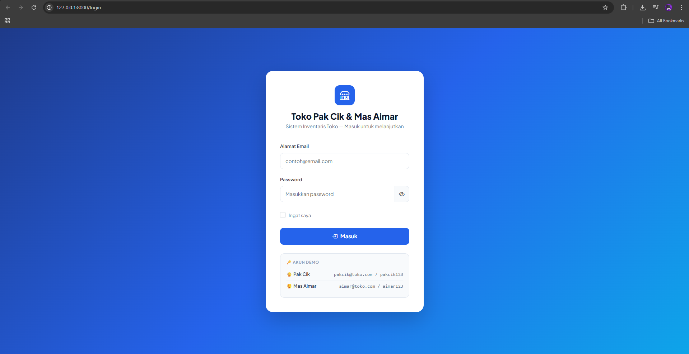
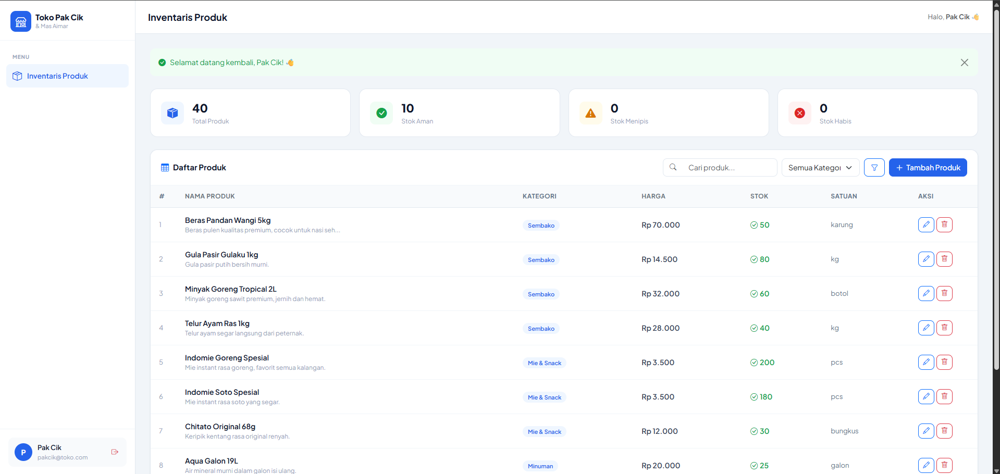
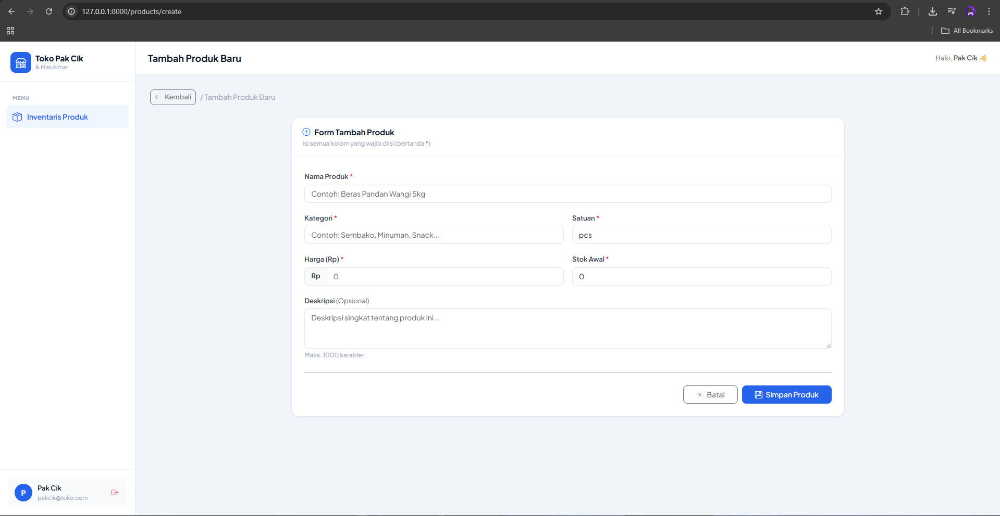
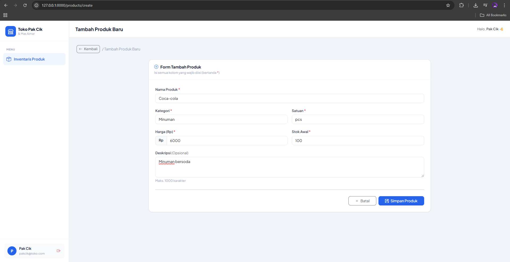
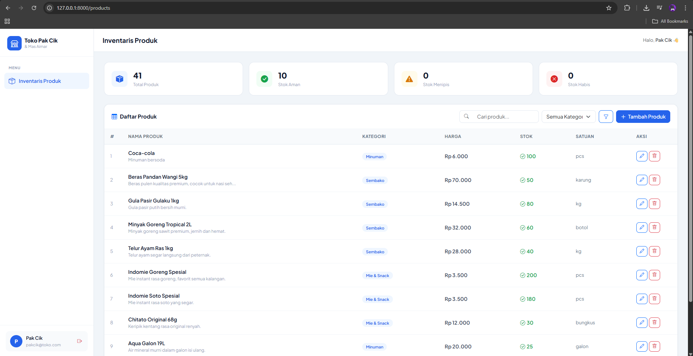
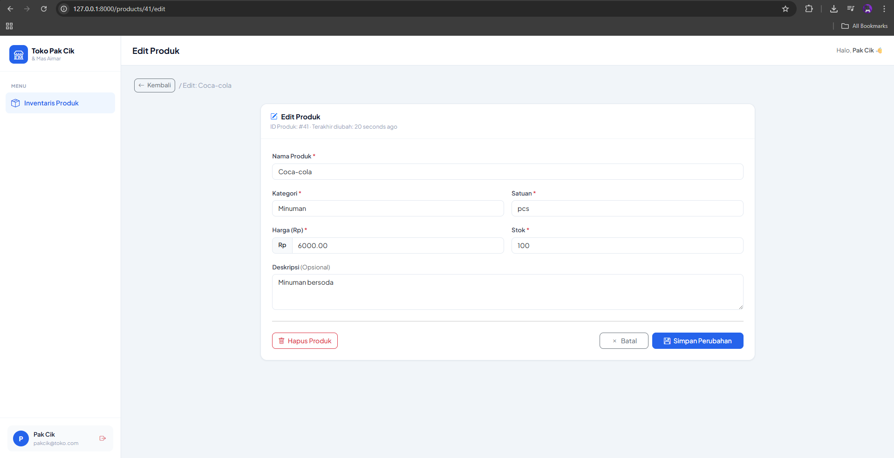
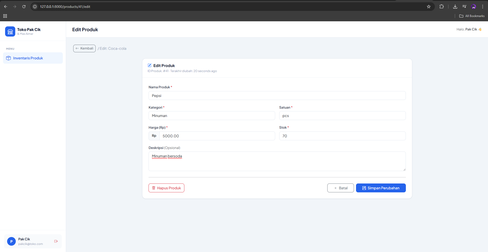
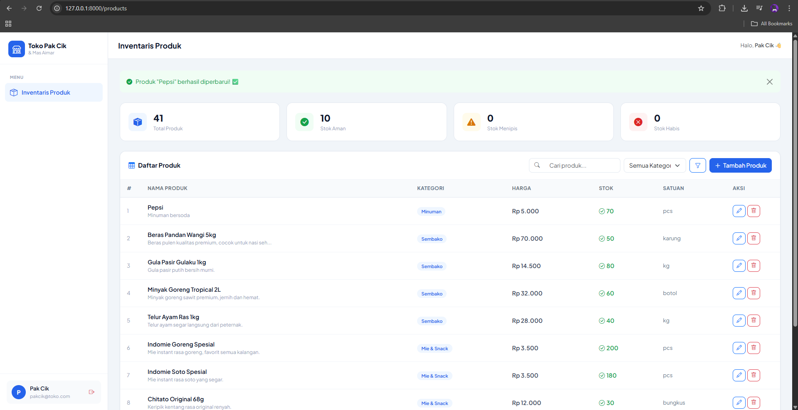
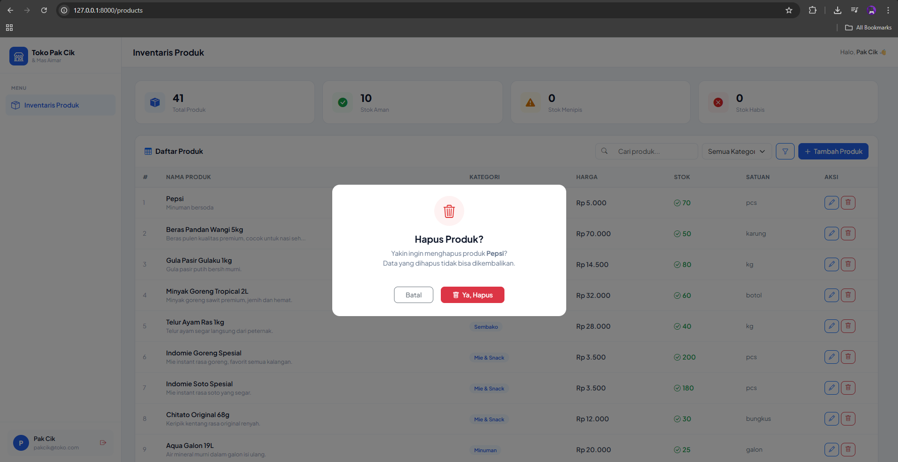
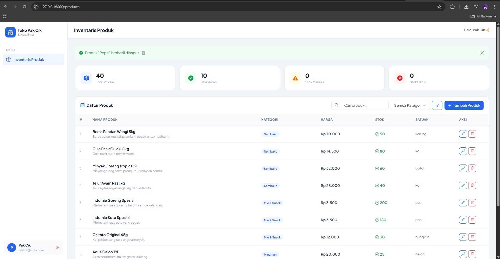

<div align="center">
  <br>

  <h1>LAPORAN PRAKTIKUM <br>
  APLIKASI BERBASIS PLATFORM
  </h1>

  <br>

  <h3>Modul-11-12-13</h3>

  <br>

  


  <br>
  <br>
  <br>

  <h3>Disusun Oleh :</h3>

  <p>
    <strong>Irshad Benaya Fardeca</strong><br>
    <strong>2311102199</strong><br>
    <strong>S1 IF-11-REG01</strong>
  </p>

  <br>

  <h3>Dosen Pengampu :</h3>

  <p>
    <strong>Dimas Fanny Hebrasianto Permadi, S.ST., M.Kom</strong>
  </p>
  
  <br>
  <br>
    <h4>Asisten Praktikum :</h4>
    <strong>Apri Pandu Wicaksono </strong> <br>
    <strong>Rangga Pradarrell Fathi</strong>
  <br>

  <h3>LABORATORIUM HIGH PERFORMANCE
 <br>FAKULTAS INFORMATIKA <br>UNIVERSITAS TELKOM PURWOKERTO <br>2026</h3>
</div>
<hr>

# Tugas
Buat project bisa menggunakan Laravel dimana kalian diminta membuat web inventari toko punya pak cik sama mas aimar (yang ga paham suki) dimana terdapat sebuah crud untuk mengelola produk, dengan tampilan seperti datatable, form create, form edit, dan konfirmasi modal untuk delete. Dan untuk data disimpan dalam database, gunakan database factory dan seeder (biar datanya ga kosong banget). dan buat nilai plus tambahkan dokumentasi project nya (bawaan ai juga udah ada pasti), please wok bantuin biar mas jakobi bisa belanja di toko nya mas aimar, jangan lupa terapin sistem login yaa (pake sistem session), #KingNasirPembantaiNgawiTimur

<br>

# Inventaris Toko
## Kode
### 1. `routes/web.php`

```php
Route::get('/', function () {
    return redirect()->route('login');
});
```

Saat user membuka `/` (root), langsung diarahkan ke halaman login. Tidak ada halaman "home" terpisah.

```php
Route::middleware('guest')->group(function () {
    Route::get('/login', [AuthController::class, 'showLogin'])->name('login');
    Route::post('/login', [AuthController::class, 'login'])->name('login.post');
});
```

Route login dibungkus middleware `guest`. Artinya jika user **sudah login** lalu mencoba membuka `/login`, Laravel akan otomatis redirect ke halaman utama — mencegah akses halaman login yang tidak perlu.

```php
Route::middleware('auth')->group(function () {
    Route::resource('products', ProductController::class);
});
```

Semua route CRUD produk dibungkus middleware `auth`. Jika user **belum login** dan mencoba akses `/products`, Laravel otomatis redirect ke halaman login. `Route::resource` secara otomatis membuat 7 route CRUD sekaligus (index, create, store, show, edit, update, destroy) — tidak perlu mendefinisikan satu per satu.

---

### 2. `app/Http/Controllers/AuthController.php`

#### Method `showLogin()`

```php
public function showLogin()
{
    if (Auth::check()) {
        return redirect()->route('products.index');
    }
    return view('auth.login');
}
```

Sebelum menampilkan form login, controller memeriksa apakah user sudah login via `Auth::check()`. Jika sudah, langsung redirect ke daftar produk agar user tidak bisa membuka halaman login yang tidak diperlukan.

#### Method `login()`

```php
$credentials = $request->validate([
    'email'    => ['required', 'email'],
    'password' => ['required'],
], [ /* pesan error custom dalam Bahasa Indonesia */ ]);
```

Validasi dilakukan **sebelum** menyentuh database. Kalau ada field yang tidak sesuai, Laravel otomatis kembali ke form dengan pesan error — tanpa perlu kode redirect manual.

```php
if (Auth::attempt($credentials, $request->boolean('remember'))) {
    $request->session()->regenerate();
    return redirect()->intended(route('products.index'))
        ->with('success', 'Selamat datang kembali, ' . Auth::user()->name . '! 👋');
}
```

`Auth::attempt()` melakukan dua hal sekaligus: mengecek email dan password di database, lalu membuat session login jika cocok. Parameter kedua `$request->boolean('remember')` mengaktifkan fitur "ingat saya" yang memperpanjang masa berlaku cookie login.

Setelah berhasil, `session()->regenerate()` dipanggil untuk mencegah **session fixation attack**, serangan di mana penyerang bisa membajak session user dengan cara menanamkan session ID tertentu sebelum user login.

`redirect()->intended()` mengarahkan user ke halaman yang sebelumnya ingin mereka akses sebelum diminta login. Misalnya user sempat mencoba buka `/products/create` tapi belum login — setelah login sukses, mereka langsung diarahkan ke halaman itu. Jika tidak ada halaman yang "dituju", fallback ke `products.index`.

```php
return back()
    ->withErrors(['email' => 'Email atau password salah.'])
    ->withInput($request->except('password'));
```

Kalau login gagal, user dikembalikan ke form. `withErrors()` menyimpan pesan error ke session agar bisa ditampilkan di view. `withInput()` mengisi ulang kolom email agar user tidak perlu mengetik ulang, tapi **password sengaja dikecualikan** demi keamanan.

#### Method `logout()`

```php
Auth::logout();
$request->session()->invalidate();
$request->session()->regenerateToken();
```

Tiga baris ini adalah prosedur logout yang aman sesuai rekomendasi dokumentasi resmi Laravel:
- `logout()` — menghapus data autentikasi dari session
- `invalidate()` — menghapus seluruh data session dan membuat session ID baru
- `regenerateToken()` — memperbarui token CSRF agar token lama tidak bisa dipakai lagi setelah logout

---

### 3. `app/Models/Product.php`
#### `$fillable` — Perlindungan Mass Assignment

```php
protected $fillable = [
    'name', 'category', 'price', 'stock', 'unit', 'description',
];
```

Hanya kolom yang terdaftar di sini yang bisa diisi via `Product::create($data)` atau `$product->update($data)`. Ini melindungi dari **mass assignment vulnerability** — celah keamanan di mana penyerang bisa mengirim field berbahaya (misal `is_admin = true`) lewat form HTML yang dimanipulasi.

#### `casts()` — Konversi Tipe Data Otomatis

```php
protected function casts(): array
{
    return [
        'price' => 'decimal:2',
        'stock' => 'integer',
    ];
}
```

Laravel secara otomatis mengkonversi data dari database ke tipe PHP yang tepat saat diambil. Kolom `price` selalu menjadi angka desimal dengan 2 digit, dan `stock` selalu menjadi `int`. Ini mencegah bug karena tipe data tidak konsisten — misalnya database kadang mengembalikan string `"100"` untuk kolom angka.

#### Accessor — Format Harga Rupiah

```php
public function getFormattedPriceAttribute(): string
{
    return 'Rp ' . number_format($this->price, 0, ',', '.');
}
```

Accessor adalah method di model yang memformat data saat dibaca. Method ini dipanggil di view dengan `$product->formatted_price` (tanpa awalan `get` dan akhiran `Attribute`). `number_format($price, 0, ',', '.')` mengubah angka `32000` menjadi string `"32.000"` dengan format pemisah ribuan khas Indonesia.

#### Helper Method — Status Stok

```php
public function isLowStock(): bool
{
    return $this->stock < 10;  // menipis jika stok kurang dari 10
}

public function isOutOfStock(): bool
{
    return $this->stock === 0; // habis jika stok 0
}
```

Method sederhana ini dipakai di view untuk menentukan warna dan ikon status stok. Dengan mendefinisikan ambang batas "menipis" (< 10) di dalam model, jika suatu saat nilainya ingin diubah cukup edit di satu tempat saja — tidak perlu mencari ke seluruh view.

---

### 4. `app/Http/Controllers/ProductController.php`

#### Method `index()` — Daftar Produk dengan Search, Filter, Sorting

```php
public function index(Request $request)
{
    $query = Product::query();

    if ($request->filled('search')) {
        $query->search($request->search);
    }

    if ($request->filled('category')) {
        $query->byCategory($request->category);
    }

    $sortBy       = $request->get('sort', 'created_at');
    $sortDir      = $request->get('direction', 'desc');
    $allowedSorts = ['name', 'category', 'price', 'stock', 'created_at'];

    if (in_array($sortBy, $allowedSorts)) {
        $query->orderBy($sortBy, $sortDir === 'asc' ? 'asc' : 'desc');
    }

    $products   = $query->paginate(10)->withQueryString();
    $categories = Product::select('category')->distinct()->pluck('category');

    return view('products.index', compact('products', 'categories'));
}
```

Controller ini membangun query secara bertahap, dimulai dari `Product::query()` yang mengembalikan query kosong, lalu ditambahkan kondisi satu per satu hanya jika parameter benar-benar ada dan tidak kosong (`$request->filled()` berbeda dari `$request->has()` — `filled()` juga memeriksa apakah nilainya bukan string kosong).

`paginate(10)` membagi hasil query menjadi halaman berisi 10 item sekaligus menghitung total data dan halaman. `withQueryString()` memastikan parameter search/filter/sort ikut terbawa di link pagination — berpindah halaman tidak menghilangkan filter yang sedang aktif.

#### Method `store()` & `update()` — Validasi dan Simpan

```php
$validated = $request->validate([
    'name'        => ['required', 'string', 'max:255'],
    'price'       => ['required', 'numeric', 'min:0'],
    'stock'       => ['required', 'integer', 'min:0'],
    // ...
]);

Product::create($validated);
```

`$request->validate()` melakukan dua hal sekaligus: memvalidasi input dan mengembalikan **hanya data yang lolos validasi** sebagai array bersih. Array `$validated` ini aman langsung dipakai di `Product::create()` karena tidak akan mengandung field yang tidak diizinkan. Jika validasi gagal, Laravel otomatis redirect balik ke form dengan pesan error dan nilai input sebelumnya — tanpa kode tambahan.

#### Method `destroy()` — Route Model Binding

```php
public function destroy(Product $product)
{
    $name = $product->name;
    $product->delete();
    return redirect()->route('products.index')
        ->with('success', 'Produk "' . $name . '" berhasil dihapus! 🗑️');
}
```

Parameter `Product $product` menggunakan fitur **Route Model Binding** milik Laravel. Laravel secara otomatis mencari record di database berdasarkan `{product}` dari URL (misal `/products/5`), lalu menyuntikkan objek `Product`-nya langsung ke method. Jika produk tidak ditemukan, Laravel otomatis mengembalikan response 404 tanpa perlu kode `findOrFail()` manual.

Nama produk disimpan ke `$name` **sebelum** `delete()` dipanggil, karena setelah dihapus properti objek sudah tidak bisa diakses untuk ditampilkan di flash message.

---

### 5. `database/migrations/` — Skema Database

#### Migration `create_products_table`

```php
Schema::create('products', function (Blueprint $table) {
    $table->id();                           // bigint UNSIGNED AUTO_INCREMENT PRIMARY KEY
    $table->string('name');                 // varchar(255) NOT NULL
    $table->string('category');             // varchar(255) NOT NULL
    $table->decimal('price', 15, 2);        // maks 999 triliun, 2 digit desimal
    $table->integer('stock')->default(0);   // int, default 0 jika tidak diisi
    $table->string('unit')->default('pcs'); // satuan default "pcs"
    $table->text('description')->nullable();// text, boleh kosong (NULL)
    $table->timestamps();                   // created_at + updated_at otomatis
});
```

`decimal(15, 2)` dipilih untuk harga karena lebih akurat dibanding `float` dalam menyimpan nilai uang. Tipe `float` bisa menghasilkan angka tak terduga seperti `999.9999999` karena cara penyimpanan biner. Angka `15` adalah total digit keseluruhan, `2` adalah digit di belakang koma — bisa menyimpan harga hingga Rp 999.999.999.999,99.

#### Migration `create_users_table` — Termasuk Tabel Sessions

```php
Schema::create('sessions', function (Blueprint $table) {
    $table->string('id')->primary();
    $table->foreignId('user_id')->nullable()->index();
    $table->string('ip_address', 45)->nullable();
    $table->text('user_agent')->nullable();
    $table->longText('payload');
    $table->integer('last_activity')->index();
});
```

Tabel `sessions` dibuat bersamaan dengan tabel `users`. Laravel menggunakan tabel ini untuk menyimpan semua data session di database — bukan di file sistem. Kolom `payload` menyimpan seluruh data session dalam bentuk terenkripsi. Kolom `user_id` menghubungkan session ke user yang sedang login. Kolom `last_activity` digunakan oleh Laravel untuk membersihkan session yang sudah kadaluarsa secara otomatis.

---

### 6. `database/factories/ProductFactory.php` — Factory Data Realistis

```php
private array $productData = [
    'Sembako' => [
        ['name' => 'Beras Pandan Wangi 5kg', 'unit' => 'karung', 'min' => 65000, 'max' => 75000],
        // ...
    ],
    // ...
];
```

Daripada menggunakan `$this->faker->word()` yang menghasilkan kata Inggris acak tidak bermakna, factory ini mendefinisikan data produk nyata per kategori beserta range harga yang realistis. Setiap produk punya nilai `min` dan `max` sehingga harga yang dihasilkan masuk akal sesuai produknya.

```php
public function definition(): array
{
    $category = $this->faker->randomKey($this->productData);
    $product  = $this->faker->randomElement($this->productData[$category]);

    return [
        'name'        => $product['name'],
        'category'    => $category,
        'price'       => $this->faker->numberBetween($product['min'], $product['max']),
        'stock'       => $this->faker->numberBetween(0, 200),
        'unit'        => $product['unit'],
        'description' => $this->faker->optional(0.6)->sentence(8),
    ];
}
```

`faker->randomKey()` memilih satu kunci array secara acak (nama kategori), lalu `faker->randomElement()` memilih satu produk dari kategori tersebut. `faker->optional(0.6)` berarti ada 60% kemungkinan field diisi dan 40% sisanya bernilai `null` — menghasilkan variasi data yang lebih natural, karena tidak semua produk di toko nyata punya deskripsi.

```php
public function lowStock(): static
{
    return $this->state(['stock' => $this->faker->numberBetween(1, 9)]);
}

public function outOfStock(): static
{
    return $this->state(['stock' => 0]);
}
```

**Factory States** memungkinkan pembuatan variasi data dengan mudah. Method `state()` menerima array yang akan meng-override nilai tertentu dari `definition()`. Digunakan di seeder seperti ini:

```php
Product::factory()->count(5)->lowStock()->create();   // 5 produk stok 1–9
Product::factory()->count(5)->outOfStock()->create(); // 5 produk stok 0
```

---

### 7. `resources/views/` — Tampilan (Blade Templates)

#### `layouts/app.blade.php` — Layout Utama

Layout ini adalah kerangka HTML yang digunakan semua halaman setelah login. Menggunakan direktif `@yield` sebagai slot yang akan diisi oleh halaman turunan:

```blade
{{-- Di layout --}}
<title>@yield('title', 'Dashboard') — Toko Pak Cik</title>
...
@yield('content')

{{-- Di halaman turunan --}}
@extends('layouts.app')
@section('title', 'Inventaris Produk')
@section('content')
    {{-- isi halaman --}}
@endsection
```

Flash message ditangani di layout agar tidak perlu ditulis ulang di setiap halaman:

```blade
@if(session('success'))
    <div class="alert alert-success">{{ session('success') }}</div>
@endif
```

Setelah controller melakukan `redirect()->with('success', '...')`, pesan tersebut disimpan di session selama satu request berikutnya. Layout membacanya dan menampilkannya secara otomatis, lalu pesan hilang di request setelahnya.

#### `products/index.blade.php` — DataTable dengan Search, Filter, Sort

Pencarian menggunakan form `GET` (bukan `POST`) agar parameter bisa terlihat di URL dan halaman bisa di-bookmark atau dibagikan:

```blade
<form method="GET" action="{{ route('products.index') }}">
    <input type="text" name="search" value="{{ request('search') }}">
    <select name="category" onchange="this.form.submit()">...</select>
    <button type="submit">Filter</button>
</form>
```

`request('search')` dan `request('category')` mengisi ulang nilai input setelah form disubmit, sehingga filter yang aktif tetap terlihat. Dropdown kategori menggunakan `onchange="this.form.submit()"` sehingga form langsung terkirim saat kategori dipilih tanpa harus klik tombol filter lagi.

Sorting dilakukan via link yang memanipulasi parameter URL:

```blade
<a href="{{ request()->fullUrlWithQuery(['sort' => 'name', 'direction' => '...']) }}">
    Nama Produk
</a>
```

`request()->fullUrlWithQuery()` mengambil URL saat ini beserta semua query string yang ada, lalu menambahkan atau mengganti parameter yang diberikan. Ini memastikan parameter search dan filter tidak hilang ketika user mengklik kolom untuk sort.

Modal konfirmasi hapus menggunakan JavaScript untuk mengisi nama produk dan action form secara dinamis — satu modal dipakai untuk semua produk:

```blade
<button onclick="confirmDelete({{ $product->id }}, '{{ addslashes($product->name) }}')">
    Hapus
</button>
```

```javascript
function confirmDelete(id, name) {
    document.getElementById('deleteProductName').textContent = name;
    document.getElementById('deleteForm').action = '/products/' + id;
    new bootstrap.Modal(document.getElementById('deleteModal')).show();
}
```

`addslashes()` digunakan di Blade untuk mengescaping nama produk yang mungkin mengandung tanda kutip tunggal — agar tidak merusak sintaks JavaScript saat nama produk disisipkan sebagai argumen fungsi.

#### Form `create.blade.php` & `edit.blade.php`

Kedua form menggunakan `<datalist>` untuk memberi saran input tanpa membatasi user hanya pada pilihan yang ada:

```blade
<input type="text" name="category" list="categoryList">
<datalist id="categoryList">
    @foreach($categories as $cat)
        <option value="{{ $cat }}">
    @endforeach
</datalist>
```

Berbeda dengan `<select>`, `<datalist>` memungkinkan user mengetik kategori baru yang belum ada di database — cocok untuk toko yang sewaktu-waktu bisa menambah jenis produk baru.

Form edit menggunakan `@method('PUT')` karena browser dan HTML form biasa hanya mendukung method `GET` dan `POST`:

```blade
<form method="POST" action="{{ route('products.update', $product) }}">
    @csrf
    @method('PUT')
    ...
</form>
```

`@method('PUT')` menyisipkan hidden input `<input type="hidden" name="_method" value="PUT">`. Laravel membaca field `_method` ini dan meneruskan request ke method `update()` di controller seolah-olah request-nya benar-benar bertipe `PUT`. Teknik ini disebut **method spoofing**.

---

## Output
### Tampilan Awal



### Tambah Data
Proses menambahkan data





### Edit Data
Proses mengedit data




### Hapus Data
Proses mengahapus data


