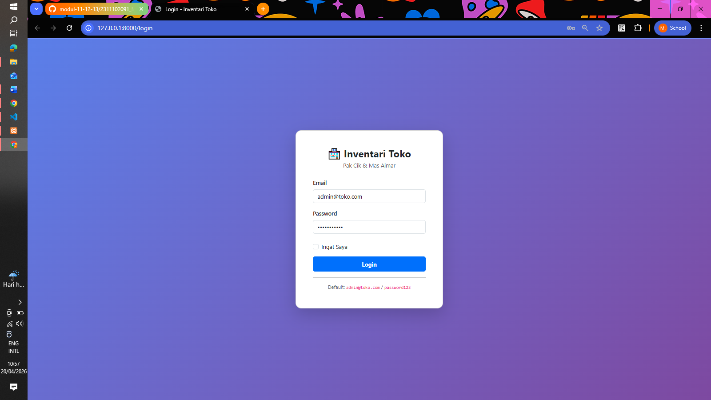
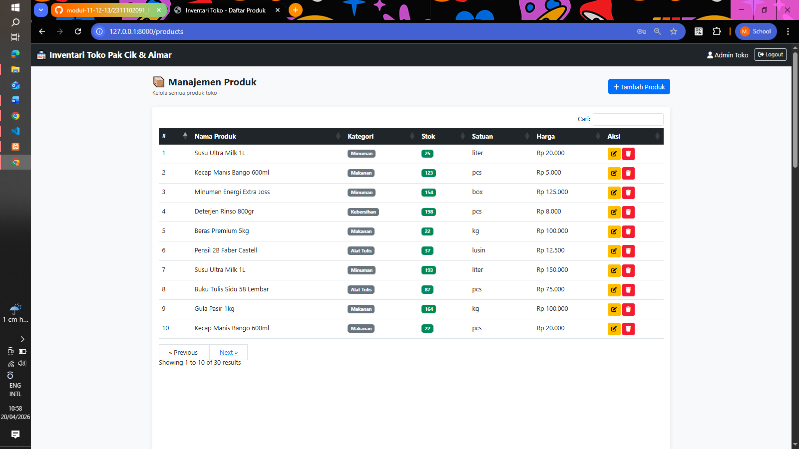
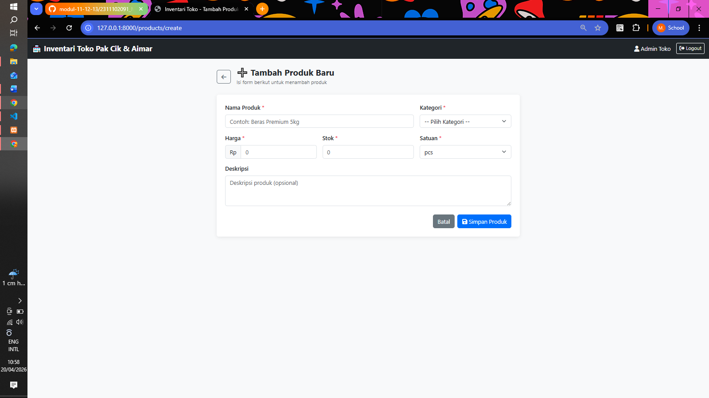
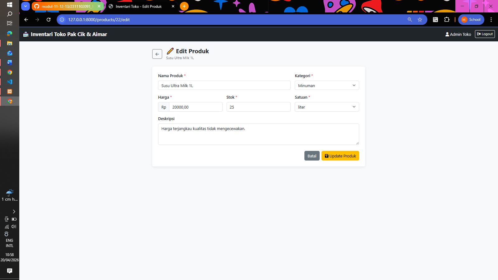

<div align="center">
  <br />
  <h1>LAPORAN PRAKTIKUM <br>APLIKASI BERBASIS PLATFORM</h1>
  <br />
  <h3>MODUL 11, 12 & 13 <br> Laravel Aplikasi Inventaris Pak Cik & Mas Aimar</h3>
  <br />
  <br />
  
  <br />
  <br />
  <br />
  <h3>Disusun Oleh :</h3>
  <p>
    <strong>M. Faleno Albar Firjatulloh</strong><br>
    <strong>2311102297</strong><br>
    <strong>S1 IF-11-REG01</strong>
  </p>
  <br />
  <h3>Dosen Pengampu :</h3>
  <p>
    <strong>Dimas Fanny Hebrasianto Permadi, S.ST., M.Kom</strong>
  </p>
  <br />
  <h4>Asisten Praktikum :</h4>
  <strong>Apri Pandu Wicaksono</strong> <br>
  <strong>Rangga Pradarrell Fathi</strong>
  <br /><br />
  <h3>LABORATORIUM HIGH PERFORMANCE <br>FAKULTAS INFORMATIKA <br>UNIVERSITAS TELKOM PURWOKERTO <br>2026</h3>
</div>

---

# DASAR TEORI

## 1. Laravel
Laravel merupakan framework PHP berbasis MVC (Model View Controller) yang menyediakan fitur routing, migration, middleware, autentikasi, ORM Eloquent, dan Blade Template Engine. Laravel membantu pengembangan aplikasi web menjadi lebih cepat, terstruktur, dan aman.

## 2. MVC (Model View Controller)
MVC membagi aplikasi menjadi tiga komponen utama:
- **Model** : Mengelola data dan interaksi dengan database.
- **View** : Menangani tampilan antarmuka pengguna.
- **Controller** : Mengatur logika aplikasi dan menjadi penghubung antara Model dengan View.

## 3. CRUD
CRUD adalah operasi dasar dalam pengelolaan data yang meliputi:
- **Create** : Menambahkan data baru.
- **Read** : Menampilkan data yang tersimpan.
- **Update** : Memperbarui data yang sudah ada.
- **Delete** : Menghapus data dari sistem.

## 4. Sistem Inventaris
Sistem inventaris digunakan untuk mengelola data barang, stok, kategori, dan harga agar proses pencatatan lebih efektif dan akurat. Dengan sistem ini, pengelola toko dapat memantau kondisi stok secara real-time.

## 5. Bootstrap 5
Bootstrap 5 adalah framework CSS yang memudahkan pembuatan antarmuka web yang modern, responsif, dan konsisten di berbagai perangkat. Bootstrap menyediakan komponen siap pakai seperti navbar, card, table, modal, dan form.

## 6. DataTables
DataTables adalah plugin jQuery yang menambahkan fitur pencarian, pengurutan, dan pagination secara otomatis pada tabel HTML biasa, sehingga tampilan data menjadi lebih interaktif dan mudah digunakan.

## 7. Session Authentication
Sistem autentikasi berbasis session pada Laravel bekerja dengan menyimpan informasi pengguna yang telah login ke dalam session server. Middleware `auth` digunakan untuk melindungi route agar hanya dapat diakses oleh pengguna yang sudah terautentikasi.

---

# PENJELASAN KODE

## 1. Migration Database

```php
Schema::create('products', function (Blueprint $table) {
    $table->id();
    $table->string('name');
    $table->string('category');
    $table->decimal('price', 12, 2);
    $table->integer('stock');
    $table->string('unit')->default('pcs');
    $table->text('description')->nullable();
    $table->timestamps();
});
```

Kode di atas digunakan untuk membuat tabel `products` pada database. Kolom `id()` berfungsi sebagai primary key otomatis. Kolom `name` menyimpan nama produk, `category` menyimpan jenis kategori produk, `price` menyimpan harga dengan presisi desimal, `stock` menyimpan jumlah stok tersedia, `unit` menyimpan satuan produk seperti pcs, kg, atau liter, dan `description` menyimpan keterangan tambahan yang bersifat opsional. Fungsi `timestamps()` secara otomatis menambahkan kolom `created_at` dan `updated_at`.

## 2. Model Product

```php
class Product extends Model
{
    use HasFactory;

    protected $fillable = [
        'name',
        'category',
        'description',
        'stock',
        'price',
        'unit',
    ];
}
```

Model `Product` merupakan representasi tabel `products` pada Laravel Eloquent ORM. Properti `$fillable` menentukan field yang diizinkan untuk diisi secara mass assignment ketika melakukan operasi create maupun update data. Trait `HasFactory` digunakan untuk mendukung pembuatan data dummy melalui Factory.

## 3. Factory & Seeder

```php
// ProductFactory.php
public function definition(): array
{
    return [
        'name'        => $this->faker->randomElement($products)['name'],
        'category'    => $this->faker->randomElement($categories),
        'description' => $this->faker->sentence(10),
        'stock'       => $this->faker->numberBetween(5, 200),
        'price'       => $this->faker->numberBetween(1000, 500000),
        'unit'        => $this->faker->randomElement($units),
    ];
}

// ProductSeeder.php
public function run(): void
{
    Product::factory(30)->create();
}
```

Factory digunakan untuk mendefinisikan struktur data dummy menggunakan library Faker. Seeder kemudian memanggil Factory untuk menghasilkan 30 data produk secara otomatis sehingga database tidak kosong saat pertama kali dijalankan.

## 4. Routing

```php
// Auth Routes
Route::get('/login', [AuthController::class, 'showLogin'])->name('login')->middleware('guest');
Route::post('/login', [AuthController::class, 'login'])->name('login.post');
Route::post('/logout', [AuthController::class, 'logout'])->name('logout');

// Protected Routes
Route::middleware('auth')->group(function () {
    Route::resource('products', ProductController::class)->except(['show']);
});
```

Route login menggunakan middleware `guest` agar halaman login hanya dapat diakses oleh pengguna yang belum login. Route CRUD produk dikelompokkan dalam middleware `auth` sehingga hanya dapat diakses setelah pengguna berhasil login. Perintah `Route::resource()` secara otomatis membuat route index, create, store, edit, update, dan destroy.

## 5. AuthController

```php
public function login(Request $request)
{
    $request->validate([
        'email'    => 'required|email',
        'password' => 'required',
    ]);

    if (Auth::attempt($request->only('email', 'password'), $request->boolean('remember'))) {
        $request->session()->regenerate();
        return redirect()->route('products.index');
    }

    return back()->withErrors(['email' => 'Email atau password salah.'])->withInput();
}
```

Method `login()` melakukan validasi input terlebih dahulu, kemudian menggunakan `Auth::attempt()` untuk memverifikasi kredensial pengguna. Jika berhasil, session di-regenerate untuk keamanan dan pengguna diarahkan ke halaman produk. Jika gagal, pesan error dikembalikan ke halaman login.

## 6. ProductController

```php
public function index(Request $request)
{
    $query = Product::query();
    if ($request->filled('search')) {
        $query->where('name', 'like', '%' . $request->search . '%')
              ->orWhere('category', 'like', '%' . $request->search . '%');
    }
    $products = $query->latest()->paginate(10)->withQueryString();
    return view('products.index', compact('products'));
}
```

Method `index()` mendukung fitur pencarian berdasarkan nama dan kategori produk menggunakan query `LIKE`. Data ditampilkan dengan pagination 10 item per halaman, dan parameter pencarian dipertahankan saat berpindah halaman menggunakan `withQueryString()`.

```php
public function store(Request $request)
{
    $request->validate([
        'name'     => 'required|string|max:255',
        'category' => 'required|string|max:100',
        'stock'    => 'required|integer|min:0',
        'price'    => 'required|numeric|min:0',
        'unit'     => 'required|string|max:50',
    ]);
    Product::create($request->all());
    return redirect()->route('products.index')->with('success', 'Produk berhasil ditambahkan!');
}
```

Method `store()` melakukan validasi data sebelum menyimpan ke database. Pesan sukses dikirimkan ke halaman index menggunakan session flash setelah produk berhasil disimpan.

```php
public function update(Request $request, Product $product)
{
    $product->update($request->all());
    return redirect()->route('products.index')->with('success', 'Produk berhasil diperbarui!');
}

public function destroy(Product $product)
{
    $product->delete();
    return redirect()->route('products.index')->with('success', 'Produk berhasil dihapus!');
}
```

Method `update()` memperbarui data produk yang dipilih berdasarkan route model binding. Method `destroy()` menghapus produk dari database dan mengembalikan pengguna ke halaman index dengan pesan konfirmasi.

## 7. Blade Template

```html
<!-- layouts/app.blade.php -->
<nav class="navbar navbar-expand-lg navbar-dark bg-dark">
    <div class="container-fluid">
        <a class="navbar-brand">🏪 Inventari Toko Pak Cik & Aimar</a>
        <form method="POST" action="{{ route('logout') }}">
            @csrf
            <button class="btn btn-sm btn-outline-light">Logout</button>
        </form>
    </div>
</nav>
@yield('content')
```

Layout utama `app.blade.php` menyediakan struktur navbar dan area konten yang dapat diisi oleh masing-masing halaman menggunakan direktif `@yield`. Setiap halaman menggunakan `@extends('layouts.app')` dan mendefinisikan kontennya dalam `@section('content')`.

## 8. Modal Konfirmasi Delete

```javascript
$('.btn-delete').on('click', function() {
    deleteId = $(this).data('id');
    $('#productName').text($(this).data('name'));
    new bootstrap.Modal(document.getElementById('deleteModal')).show();
});

$('#confirmDelete').on('click', function() {
    if (deleteId) $('#delete-' + deleteId).submit();
});
```

Modal konfirmasi delete menggunakan JavaScript jQuery dan Bootstrap Modal. Ketika tombol hapus diklik, ID dan nama produk disimpan sementara, kemudian modal ditampilkan untuk meminta konfirmasi pengguna sebelum form delete di-submit.

## 9. DataTables

```javascript
$('#productTable').DataTable({
    paging: false,
    info: false,
    language: {
        search: "Cari:",
        zeroRecords: "Produk tidak ditemukan"
    }
});
```

DataTables diinisialisasi pada tabel produk untuk menambahkan fitur pencarian dan pengurutan kolom secara otomatis. Fitur pagination DataTables dinonaktifkan karena sudah menggunakan pagination bawaan Laravel.

# CARA INSTALASI & MENJALANKAN PROJECT

## Prasyarat
Pastikan perangkat sudah terinstall:
- PHP >= 8.2
- Composer
- MySQL (XAMPP/Laragon)
- VS Code

## Langkah Instalasi

**1. Clone atau download project**
```bash
cd D:\SMT6\ABP\ABP-Praktikum
```

**2. Install dependencies**
```bash
composer install
```

**3. Copy file environment**
```bash
cp .env.example .env
php artisan key:generate
```

**4. Konfigurasi database di `.env`**
```env
DB_CONNECTION=mysql
DB_HOST=127.0.0.1
DB_PORT=3306
DB_DATABASE=inventari_toko
DB_USERNAME=root
DB_PASSWORD=
```

**5. Buat database `inventari_toko` di phpMyAdmin**

**6. Jalankan migration dan seeder**
```bash
php artisan migrate:fresh --seed
```

**7. Jalankan server**
```bash
php artisan serve
```

**8. Akses aplikasi di browser**
```
http://127.0.0.1:8000
```

## Akun Default Login
| Field    | Value             |
|----------|-------------------|
| Email    | admin@toko.com    |
| Password | password123       |


# HASIL PRAKTIKUM

## 1. Halaman Login


Halaman login menampilkan form autentikasi dengan field email dan password. Terdapat fitur "Ingat Saya" untuk menyimpan sesi login. Sistem akan menampilkan pesan error jika kredensial yang dimasukkan salah.

## 2. Halaman Daftar Produk


Halaman utama menampilkan seluruh data produk dalam bentuk tabel dengan fitur pencarian dan pengurutan kolom menggunakan DataTables. Terdapat indikator warna pada stok — merah jika stok ≤ 5 dan hijau jika stok mencukupi. Tersedia tombol edit dan hapus pada setiap baris data.

## 3. Halaman Tambah Produk


Halaman form untuk menambahkan produk baru. Terdapat validasi input di sisi server sehingga data yang tidak sesuai akan menampilkan pesan error langsung di bawah field yang bermasalah.

## 4. Halaman Edit Produk


Halaman form untuk memperbarui data produk yang sudah ada. Form sudah terisi otomatis dengan data produk yang dipilih sehingga pengguna hanya perlu mengubah field yang diperlukan.

## 5. Modal Konfirmasi Hapus
Sebelum data produk dihapus, sistem menampilkan modal konfirmasi yang menampilkan nama produk yang akan dihapus. Pengguna harus menekan tombol "Ya, Hapus!" untuk melanjutkan penghapusan, sehingga mencegah penghapusan data yang tidak disengaja.

---

# KESIMPULAN

Pada praktikum Modul 11, 12, dan 13 telah berhasil dibuat aplikasi Inventaris Toko Pak Cik & Mas Aimar berbasis Laravel yang memiliki fitur autentikasi pengguna berbasis session serta pengelolaan data produk secara lengkap melalui konsep CRUD. Sistem mampu melakukan proses penambahan, penampilan, perubahan, dan penghapusan data produk dengan baik. Fitur tambahan seperti pencarian, pagination, indikator stok, dan konfirmasi modal delete turut meningkatkan pengalaman pengguna dalam mengoperasikan sistem.

Database Factory dan Seeder berhasil diimplementasikan untuk menghasilkan data dummy produk berbahasa Indonesia secara otomatis sehingga aplikasi tidak tampil kosong saat pertama kali dijalankan. Melalui praktikum ini diperoleh pemahaman mendalam mengenai penggunaan framework Laravel, konsep MVC, migration database, routing, controller, Blade Template, autentikasi session, serta pengembangan antarmuka web modern menggunakan Bootstrap 5 dan DataTables.

---

# REFERENSI

1. Rahman, M.A., Islam, S. *Web Application Development Using Laravel PHP Framework*. Journal of Software Engineering Applications, 2021. DOI: https://doi.org/10.4236/jsea.2021.141001
2. Prasetyo, N. et al. *Inventory Information System for Retail Store Management*. Procedia Computer Science, 2023. DOI: https://doi.org/10.1016/j.procs.2023.04.102
3. Kumar, A. et al. *Design of CRUD Based Inventory Management System*. IJACSA, 2022. DOI: https://doi.org/10.14569/IJACSA.2022.0130576
4. Bootstrap Documentation. https://getbootstrap.com/docs
5. DataTables Documentation. https://datatables.net
6. Laravel Documentation. https://laravel.com/docs