<div align="center">
  <br />
  <h1>LAPORAN PRAKTIKUM <br>
  APLIKASI BERBASIS PLATFORM
  </h1>
  <br />
  <h3>MODUL 11, 12 & 13 <br>
  LARAVEL
  </h3>
  <br />
  
  <br />
  <br />
  <br />
  <h3>Disusun Oleh :</h3>
  <p>
    <strong>Boutefhika Nuha Ziyadatul Khair</strong><br>
    <strong>2311102316</strong><br>
    <strong>S1 IF-11-01</strong>
  </p>
  <br />
  <h3>Dosen Pengampu :</h3>
  <p>
    <strong>Dimas Fanny Hebrasianto Permadi, S.ST., M.Kom</strong>
  </p>
  <br />
  <br />
  <h4>Asisten Praktikum :</h4>
  <strong>Apri Pandu Wicaksono</strong> <br>
  <strong>Rangga Pradarrell Fathi</strong>
  <br />
  <br />
  <h3>LABORATORIUM HIGH PERFORMANCE
  <br>FAKULTAS INFORMATIKA <br>UNIVERSITAS TELKOM PURWOKERTO <br>2026</h3>
</div>

<hr>

# 🏪 Toko Aimar — Web Inventari

> **Tugas Modul 11, 12 & 13** — Membangun web inventari toko menggunakan Laravel, mencakup CRUD produk dengan DataTable, sistem login berbasis session dengan role admin & customer, database factory & seeder, serta fitur belanja untuk customer.

> Dibangun dengan **Laravel 11**, **Bootstrap 5**, dan **DataTables**.

---

## 📋 Fitur Utama

### 👨‍💼 Panel Admin (Pak Cik & Mas Aimar)
| Fitur | Keterangan |
|---|---|
| **Login/Logout** | Autentikasi berbasis session |
| **Dashboard** | Ringkasan statistik, estimasi nilai stok, produk stok menipis, produk terbaru, dan distribusi per kategori |
| **Manajemen Produk** | DataTable interaktif dengan pencarian, sorting, dan filter kategori |
| **Tambah Produk** | Form lengkap dengan validasi |
| **Edit Produk** | Update data produk yang ada |
| **Hapus Produk** | Soft delete dengan konfirmasi modal |

### 🛍️ Panel Belanja (Mas Jakobi & Customer)
| Fitur | Keterangan |
|---|---|
| **Katalog Produk** | Grid produk dengan filter & pencarian |
| **Keranjang Belanja** | Session-based cart, update quantity |
| **Checkout** | Simpan order ke database & potong stok |
| **Registrasi** | Daftar akun baru sebagai customer |

---

## 🔑 Akun Default

| Nama | Email | Password | Role |
|---|---|---|---|
| **Pak Cik** | pakcik@tokoaimar.com | pakcik123 | Admin |
| **Mas Aimar** | aimar@tokoaimar.com | aimar123 | Admin |
| **Boutefhika Nuha Z K** | bnzk@gmail.com | nuha123 | Customer |

> Seeder juga menghasilkan **50 produk acak** dan **7 customer tambahan**.

---

## 🗂️ Struktur Project

```
toko-aimar/
├── app/
│   ├── Http/
│   │   ├── Controllers/
│   │   │   ├── AuthController.php       # Login, Register, Logout
│   │   │   ├── DashboardController.php  # Ringkasan & statistik dashboard (Admin)
│   │   │   ├── ProductController.php    # CRUD Produk (Admin)
│   │   │   ├── ShopController.php       # Katalog belanja (Customer)
│   │   │   └── CartController.php       # Keranjang & Checkout
│   │   └── Middleware/
│   │       └── RoleMiddleware.php       # Guard role admin/customer
│   └── Models/
│       ├── User.php
│       ├── Product.php                  # Dengan SoftDeletes
│       ├── Order.php
│       └── OrderItem.php
│
├── database/
│   ├── factories/
│   │   ├── UserFactory.php
│   │   └── ProductFactory.php           # 8 kategori, produk realistis
│   ├── migrations/
│   │   ├── ..._create_users_table.php
│   │   ├── ..._create_products_table.php
│   │   └── ..._create_orders_table.php
│   └── seeders/
│       └── DatabaseSeeder.php           # Seed user & 50 produk
│
├── resources/views/
│   ├── layouts/
│   │   ├── app.blade.php               # Layout utama + sidebar
│   │   └── auth.blade.php              # Layout halaman login/register
│   ├── auth/
│   │   ├── login.blade.php
│   │   └── register.blade.php
│   ├── products/
│   │   ├── index.blade.php             # DataTable + modal delete
│   │   ├── create.blade.php            # Form tambah produk
│   │   └── edit.blade.php              # Form edit produk
│   ├── shop/
│   │   ├── index.blade.php             # Katalog produk (grid)
│   │   └── cart.blade.php              # Keranjang belanja
│   └── dashboard.blade.php             # Halaman dashboard admin
│
└── routes/
    └── web.php                         # Semua routing
```

---

## 🛡️ Sistem Role & Akses

```
/login, /register          → Guest only
/admin/*                   → Admin only  (role: admin)
/shop, /cart/*             → Customer only (role: customer)
```

Middleware `role:admin` dan `role:customer` menjaga setiap route grup.
Admin yang coba akses `/shop` akan di-redirect ke dashboard, dan sebaliknya.

---

## 🖥️ Halaman Dashboard Admin

Dashboard (`/admin/dashboard`) ditangani oleh `DashboardController` dan menampilkan informasi ringkasan toko secara sekilas, berbeda dari halaman Manajemen Produk yang fokus ke tabel CRUD.

| Widget | Keterangan |
|---|---|
| **Kartu Statistik** | Total produk, tersedia, stok menipis, dan habis |
| **Estimasi Nilai Stok** | Kalkulasi `SUM(harga × stok)` seluruh produk |
| **Stok Hampir Habis** | 5 produk dengan stok terkecil (stok > 0), diurutkan naik |
| **Produk Terbaru** | 5 produk paling baru ditambahkan beserta SKU & waktu relatif |
| **Distribusi Kategori** | Progress bar jumlah produk & total stok per kategori |

---

## 🗄️ Skema Database

### Tabel `users`
| Kolom | Tipe | Keterangan |
|---|---|---|
| id | bigint | Primary key |
| name | varchar | Nama user |
| email | varchar | Email unik |
| password | varchar | Hashed |
| role | enum | `admin` / `customer` |

### Tabel `products`
| Kolom | Tipe | Keterangan |
|---|---|---|
| id | bigint | Primary key |
| name | varchar | Nama produk |
| description | text | Deskripsi (nullable) |
| price | decimal(12,2) | Harga |
| stock | int | Jumlah stok |
| category | varchar | Kategori |
| sku | varchar | Kode unik produk |
| deleted_at | timestamp | Soft delete |

### Tabel `orders`
| Kolom | Tipe | Keterangan |
|---|---|---|
| id | bigint | Primary key |
| user_id | FK → users | Pembeli |
| total_price | decimal | Total harga |
| status | enum | pending/processing/completed/cancelled |
| note | text | Catatan pembeli |

### Tabel `order_items`
| Kolom | Tipe | Keterangan |
|---|---|---|
| order_id | FK → orders | |
| product_id | FK → products | |
| quantity | int | Jumlah |
| price | decimal | Harga saat beli |

---

## 🛠️ Tech Stack

| Teknologi | Versi | Fungsi |
|---|---|---|
| Laravel | 11.x | PHP Framework |
| PHP | 8.2+ | Backend |
| SQLite / MySQL | - | Database |
| Bootstrap | 5.3 | UI Framework |
| Bootstrap Icons | 1.11 | Ikon |
| DataTables | 1.13 | Tabel interaktif |
| jQuery | 3.7 | JS helper |

---

## 🔧 Troubleshooting

| Masalah | Solusi |
|---------|--------|
| Storage permission error | `chmod -R 775 storage bootstrap/cache` |
| Key not set | `php artisan key:generate` |
| Class not found | `composer dump-autoload` |
| View not found | `php artisan view:clear` |

---

## 📝 Catatan Pengembangan

- **Soft Delete**: Produk yang dihapus tidak benar-benar hilang dari database (bisa dipulihkan).
- **Session Cart**: Keranjang belanja disimpan di session, bukan database — cocok untuk toko skala kecil.
- **SoftDeletes** on Product: data historis order tetap aman meski produk "dihapus".
- **Role Middleware**: Pisah akses admin & customer secara bersih di level middleware.
- **Seeder Realistis**: `ProductFactory` menghasilkan produk dengan nama & kategori yang masuk akal (bukan lorem ipsum).
- **Dashboard Terpisah**: Dashboard dan halaman Manajemen Produk menggunakan controller & view yang berbeda agar masing-masing fokus pada fungsinya — dashboard untuk ringkasan, produk untuk operasional CRUD.

---

## SourceCode
AuthController.php
```
<?php

namespace App\Http\Controllers;

use App\Models\User;
use Illuminate\Http\Request;
use Illuminate\Support\Facades\Auth;
use Illuminate\Support\Facades\Hash;

class AuthController extends Controller
{
    public function showLogin()
    {
        return view('auth.login');
    }

    public function login(Request $request)
    {
        $credentials = $request->validate([
            'email'    => ['required', 'email'],
            'password' => ['required'],
        ]);

        if (Auth::attempt($credentials, $request->boolean('remember'))) {
            $request->session()->regenerate();

            $user = Auth::user();

            if ($user->isAdmin()) {
                return redirect()->route('admin.dashboard')
                    ->with('success', 'Selamat datang kembali, ' . $user->name . '!');
            }

            return redirect()->route('shop.index')
                ->with('success', 'Selamat datang, ' . $user->name . '! Selamat belanja!');
        }

        return back()->withErrors([
            'email' => 'Email atau password salah. Silakan coba lagi.',
        ])->onlyInput('email');
    }

    public function showRegister()
    {
        return view('auth.register');
    }

    public function register(Request $request)
    {
        $validated = $request->validate([
            'name'     => ['required', 'string', 'max:255'],
            'email'    => ['required', 'string', 'email', 'max:255', 'unique:users'],
            'password' => ['required', 'string', 'min:8', 'confirmed'],
        ]);

        $user = User::create([
            'name'     => $validated['name'],
            'email'    => $validated['email'],
            'password' => Hash::make($validated['password']),
            'role'     => 'customer', // semua registrasi publik jadi customer
        ]);

        Auth::login($user);

        return redirect()->route('shop.index')
            ->with('success', 'Akun berhasil dibuat! Selamat belanja di Toko InventoryAimar, ' . $user->name . '!');
    }

    public function logout(Request $request)
    {
        Auth::logout();
        $request->session()->invalidate();
        $request->session()->regenerateToken();

        return redirect()->route('login')
            ->with('success', 'Anda berhasil logout. Sampai jumpa!');
    }
}
```

CartController.php
```
<?php

namespace App\Http\Controllers;

use App\Models\Order;
use App\Models\OrderItem;
use App\Models\Product;
use Illuminate\Http\Request;
use Illuminate\Support\Facades\DB;

class CartController extends Controller
{
    /** Tambah produk ke keranjang (session-based cart) */
    public function add(Request $request, Product $product)
    {
        $request->validate(['quantity' => ['required', 'integer', 'min:1']]);

        $qty  = (int) $request->quantity;
        $cart = session()->get('cart', []);

        if (isset($cart[$product->id])) {
            $cart[$product->id]['quantity'] += $qty;
        } else {
            $cart[$product->id] = [
                'product_id' => $product->id,
                'name'       => $product->name,
                'price'      => $product->price,
                'quantity'   => $qty,
            ];
        }

        // Jangan melebihi stok
        if ($cart[$product->id]['quantity'] > $product->stock) {
            $cart[$product->id]['quantity'] = $product->stock;
        }

        session()->put('cart', $cart);

        return redirect()->route('shop.cart.index')
            ->with('success', '"' . $product->name . '" berhasil ditambahkan ke keranjang!');
    }

    /** Tampilkan isi keranjang */
    public function index()
    {
        $cart  = session()->get('cart', []);
        $total = collect($cart)->sum(fn ($item) => $item['price'] * $item['quantity']);

        return view('shop.cart', compact('cart', 'total'));
    }

    /** Update quantity item di keranjang */
    public function update(Request $request, int $id)
    {
        $request->validate(['quantity' => ['required', 'integer', 'min:1']]);

        $cart = session()->get('cart', []);

        if (isset($cart[$id])) {
            $product = Product::find($id);
            $qty     = min((int) $request->quantity, $product ? $product->stock : 999);
            $cart[$id]['quantity'] = $qty;
            session()->put('cart', $cart);
        }

        return redirect()->route('shop.cart.index')
            ->with('success', 'Jumlah produk diperbarui.');
    }

    /** Hapus item dari keranjang */
    public function remove(int $id)
    {
        $cart = session()->get('cart', []);
        unset($cart[$id]);
        session()->put('cart', $cart);

        return redirect()->route('shop.cart.index')
            ->with('success', 'Produk berhasil dihapus dari keranjang.');
    }

    /** Checkout – simpan order ke database */
    public function checkout(Request $request)
    {
        $cart = session()->get('cart', []);

        if (empty($cart)) {
            return redirect()->route('shop.cart.index')
                ->with('error', 'Keranjang masih kosong!');
        }

        DB::transaction(function () use ($cart, $request) {
            $total = collect($cart)->sum(fn ($item) => $item['price'] * $item['quantity']);

            $order = Order::create([
                'user_id'     => auth()->id(),
                'total_price' => $total,
                'status'      => 'pending',
                'note'        => $request->note,
            ]);

            foreach ($cart as $item) {
                OrderItem::create([
                    'order_id'   => $order->id,
                    'product_id' => $item['product_id'],
                    'quantity'   => $item['quantity'],
                    'price'      => $item['price'],
                ]);

                // Kurangi stok
                Product::where('id', $item['product_id'])
                    ->decrement('stock', $item['quantity']);
            }
        });

        session()->forget('cart');

        return redirect()->route('shop.index')
            ->with('success', 'Pesanan berhasil dibuat! Terima kasih sudah belanja di Toko Inventory Aimar 🎉');
    }
}
```

Controller.php
```
<?php

namespace App\Http\Controllers;

abstract class Controller
{
    //
}
```

DashboardController.php
```
<?php

namespace App\Http\Controllers;

use App\Models\Product;

class DashboardController extends Controller
{
    public function index()
    {
        $total      = Product::count();
        $inStock    = Product::inStock()->count();
        $lowStock   = Product::where('stock', '>', 0)->where('stock', '<=', 10)->count();
        $outStock   = Product::where('stock', 0)->count();

        $totalValue = Product::selectRaw('SUM(price * stock) as total')->value('total') ?? 0;

        // 5 produk dengan stok paling sedikit (tapi belum habis)
        $lowStockProducts = Product::where('stock', '>', 0)
            ->orderBy('stock', 'asc')
            ->limit(5)
            ->get();

        // 5 produk terbaru ditambahkan
        $latestProducts = Product::latest()->limit(5)->get();

        // Distribusi per kategori
        $categoryStats = Product::selectRaw('category, COUNT(*) as total, SUM(stock) as total_stock')
            ->groupBy('category')
            ->orderByDesc('total')
            ->get();

        return view('dashboard', compact(
            'total', 'inStock', 'lowStock', 'outStock',
            'totalValue', 'lowStockProducts', 'latestProducts', 'categoryStats'
        ));
    }
}
```

ProductController.php
```
<?php

namespace App\Http\Controllers;

use App\Models\Product;
use Illuminate\Http\Request;

class ProductController extends Controller
{
    public function index(Request $request)
    {
        $query = Product::query();

        // Search
        if ($search = $request->get('search')) {
            $query->where(function ($q) use ($search) {
                $q->where('name', 'like', "%{$search}%")
                  ->orWhere('sku', 'like', "%{$search}%")
                  ->orWhere('category', 'like', "%{$search}%");
            });
        }

        // Filter by category
        if ($category = $request->get('category')) {
            $query->where('category', $category);
        }

        // Sort
        $sortBy  = $request->get('sort', 'created_at');
        $sortDir = $request->get('direction', 'desc');
        $allowedSorts = ['name', 'price', 'stock', 'category', 'created_at'];
        if (in_array($sortBy, $allowedSorts)) {
            $query->orderBy($sortBy, $sortDir === 'asc' ? 'asc' : 'desc');
        }

        $products   = $query->paginate(10)->withQueryString();
        $categories = Product::select('category')->distinct()->pluck('category');

        return view('products.index', compact('products', 'categories'));
    }

    public function create()
    {
        $categories = Product::select('category')->distinct()->pluck('category');
        return view('products.create', compact('categories'));
    }

    public function store(Request $request)
    {
        $validated = $request->validate([
            'name'        => ['required', 'string', 'max:255'],
            'description' => ['nullable', 'string'],
            'price'       => ['required', 'numeric', 'min:0'],
            'stock'       => ['required', 'integer', 'min:0'],
            'category'    => ['required', 'string', 'max:100'],
            'sku'         => ['required', 'string', 'max:100', 'unique:products'],
        ]);

        Product::create($validated);

        return redirect()->route('admin.products.index')
            ->with('success', 'Produk "' . $validated['name'] . '" berhasil ditambahkan!');
    }

    public function edit(Product $product)
    {
        $categories = Product::select('category')->distinct()->pluck('category');
        return view('products.edit', compact('product', 'categories'));
    }

    public function update(Request $request, Product $product)
    {
        $validated = $request->validate([
            'name'        => ['required', 'string', 'max:255'],
            'description' => ['nullable', 'string'],
            'price'       => ['required', 'numeric', 'min:0'],
            'stock'       => ['required', 'integer', 'min:0'],
            'category'    => ['required', 'string', 'max:100'],
            'sku'         => ['required', 'string', 'max:100', 'unique:products,sku,' . $product->id],
        ]);

        $product->update($validated);

        return redirect()->route('admin.products.index')
            ->with('success', 'Produk "' . $product->name . '" berhasil diperbarui!');
    }

    public function destroy(Product $product)
    {
        $name = $product->name;
        $product->delete(); // soft delete

        return redirect()->route('admin.products.index')
            ->with('success', 'Produk "' . $name . '" berhasil dihapus!');
    }
}
```

ShopController.php
```
<?php

namespace App\Http\Controllers;

use App\Models\Product;
use Illuminate\Http\Request;

class ShopController extends Controller
{
    public function index(Request $request)
    {
        $query = Product::inStock();

        if ($search = $request->get('search')) {
            $query->where(function ($q) use ($search) {
                $q->where('name', 'like', "%{$search}%")
                  ->orWhere('description', 'like', "%{$search}%");
            });
        }

        if ($category = $request->get('category')) {
            $query->where('category', $category);
        }

        $sortBy = $request->get('sort', 'name');
        $query->orderBy(in_array($sortBy, ['name', 'price']) ? $sortBy : 'name', 'asc');

        $products   = $query->paginate(12)->withQueryString();
        $categories = Product::inStock()->select('category')->distinct()->pluck('category');

        return view('shop.index', compact('products', 'categories'));
    }

    public function show(Product $product)
    {
        abort_if(!$product->isInStock(), 404);
        return view('shop.show', compact('product'));
    }
}
```

RoleMiddleware.php
```
<?php

namespace App\Http\Middleware;

use Closure;
use Illuminate\Http\Request;
use Symfony\Component\HttpFoundation\Response;

class RoleMiddleware
{
    public function handle(Request $request, Closure $next, string $role): Response
    {
        if (!auth()->check()) {
            return redirect()->route('login');
        }

        if (auth()->user()->role !== $role) {
            // Admin yang coba akses shop → redirect ke dashboard
            if (auth()->user()->isAdmin()) {
                return redirect()->route('admin.dashboard')
                    ->with('error', 'Akses ditolak. Anda adalah Admin.');
            }

            // Customer yang coba akses admin → redirect ke shop
            return redirect()->route('shop.index')
                ->with('error', 'Akses ditolak. Halaman ini hanya untuk Admin.');
        }

        return $next($request);
    }
}
```

Order.php
```
<?php

namespace App\Models;

use Illuminate\Database\Eloquent\Factories\HasFactory;
use Illuminate\Database\Eloquent\Model;

class Order extends Model
{
    use HasFactory;

    protected $fillable = [
        'user_id',
        'total_price',
        'status',
        'note',
    ];

    public function user()
    {
        return $this->belongsTo(User::class);
    }

    public function items()
    {
        return $this->hasMany(OrderItem::class);
    }
}
```

OrderItem.php
```
<?php

namespace App\Models;

use Illuminate\Database\Eloquent\Model;

class OrderItem extends Model
{
    protected $fillable = [
        'order_id',
        'product_id',
        'quantity',
        'price',
    ];

    public function order()
    {
        return $this->belongsTo(Order::class);
    }

    public function product()
    {
        return $this->belongsTo(Product::class);
    }

    public function getSubtotalAttribute(): float
    {
        return $this->quantity * $this->price;
    }
}
```

Product.php
```
<?php

namespace App\Models;

use Illuminate\Database\Eloquent\Factories\HasFactory;
use Illuminate\Database\Eloquent\Model;
use Illuminate\Database\Eloquent\SoftDeletes;

class Product extends Model
{
    use HasFactory, SoftDeletes;

    protected $fillable = [
        'name',
        'description',
        'price',
        'stock',
        'category',
        'sku',
        'image',
    ];

    protected function casts(): array
    {
        return [
            'price' => 'decimal:2',
            'stock' => 'integer',
        ];
    }

    public function getFormattedPriceAttribute(): string
    {
        return 'Rp ' . number_format($this->price, 0, ',', '.');
    }

    public function isInStock(): bool
    {
        return $this->stock > 0;
    }

    public function scopeInStock($query)
    {
        return $query->where('stock', '>', 0);
    }

    public function scopeByCategory($query, string $category)
    {
        return $query->where('category', $category);
    }

    public function orderItems()
    {
        return $this->hasMany(OrderItem::class);
    }
}
```

User.php
```
<?php

namespace App\Models;

use Illuminate\Database\Eloquent\Factories\HasFactory;
use Illuminate\Foundation\Auth\User as Authenticatable;
use Illuminate\Notifications\Notifiable;

class User extends Authenticatable
{
    use HasFactory, Notifiable;

    protected $fillable = [
        'name',
        'email',
        'password',
        'role', // 'admin' or 'customer'
    ];

    protected $hidden = [
        'password',
        'remember_token',
    ];

    protected function casts(): array
    {
        return [
            'email_verified_at' => 'datetime',
            'password'          => 'hashed',
        ];
    }

    public function isAdmin(): bool
    {
        return $this->role === 'admin';
    }

    public function isCustomer(): bool
    {
        return $this->role === 'customer';
    }

    public function orders()
    {
        return $this->hasMany(Order::class);
    }
}
```

AppServiceProvider.php
```
<?php

namespace App\Providers;

use Illuminate\Support\ServiceProvider;

class AppServiceProvider extends ServiceProvider
{
    public function register(): void
    {
        //
    }

    public function boot(): void
    {
        //
    }
}
```

app.php
```
<?php

return [
    'name'             => env('APP_NAME', 'Toko Inventory Aimar'),
    'env'              => env('APP_ENV', 'production'),
    'debug'            => (bool) env('APP_DEBUG', false),
    'url'              => env('APP_URL', 'http://localhost'),
    'timezone'         => 'Asia/Jakarta',
    'locale'           => 'id',
    'fallback_locale'  => 'en',
    'faker_locale'     => 'id_ID',
    'cipher'           => 'AES-256-CBC',
    'key'              => env('APP_KEY'),
    'previous_keys'    => [],
    'maintenance'      => ['driver' => 'file'],
    'providers'        => Illuminate\Support\ServiceProvider::defaultProviders()->merge([
        App\Providers\AppServiceProvider::class,
    ])->toArray(),
    'aliases'          => Illuminate\Foundation\AliasLoader::getInstance()->getAliases(),
];
```

auth.php
```
<?php

return [
    'defaults' => [
        'guard'     => 'web',
        'passwords' => 'users',
    ],

    'guards' => [
        'web' => [
            'driver'   => 'session',
            'provider' => 'users',
        ],
    ],

    'providers' => [
        'users' => [
            'driver' => 'eloquent',
            'model'  => App\Models\User::class,
        ],
    ],

    'passwords' => [
        'users' => [
            'provider' => 'users',
            'table'    => 'password_reset_tokens',
            'expire'   => 60,
            'throttle' => 3,
        ],
    ],

    'password_timeout' => 10800,
];
```

cache.php
```
<?php

use Illuminate\Support\Str;

return [
    'default' => env('CACHE_STORE', 'database'),
    'stores'  => [
        'array'     => ['driver' => 'array', 'serialize' => false],
        'database'  => ['driver' => 'database', 'connection' => env('DB_CACHE_CONNECTION'), 'table' => env('DB_CACHE_TABLE', 'cache'), 'lock_connection' => env('DB_CACHE_LOCK_CONNECTION'), 'lock_table' => env('DB_CACHE_LOCK_TABLE')],
        'file'      => ['driver' => 'file', 'path' => storage_path('framework/cache/data'), 'lock_path' => storage_path('framework/cache/data')],
        'memcached' => ['driver' => 'memcached', 'persistent_id' => env('MEMCACHED_PERSISTENT_ID'), 'sasl' => [env('MEMCACHED_USERNAME'), env('MEMCACHED_PASSWORD')], 'options' => [], 'servers' => [['host' => env('MEMCACHED_HOST', '127.0.0.1'), 'port' => env('MEMCACHED_PORT', 11211), 'weight' => 100]]],
        'redis'     => ['driver' => 'redis', 'connection' => env('REDIS_CACHE_CONNECTION', 'cache'), 'lock_connection' => env('REDIS_CACHE_LOCK_CONNECTION', 'default')],
        'dynamodb'  => ['driver' => 'dynamodb', 'key' => env('AWS_ACCESS_KEY_ID'), 'secret' => env('AWS_SECRET_ACCESS_KEY'), 'region' => env('AWS_DEFAULT_REGION', 'us-east-1'), 'table' => env('DYNAMODB_CACHE_TABLE', 'cache'), 'endpoint' => env('DYNAMODB_ENDPOINT')],
        'octane'    => ['driver' => 'octane'],
    ],
    'prefix'  => env('CACHE_PREFIX', Str::slug(env('APP_NAME', 'laravel'), '_') . '_cache_'),
];
```

database.php
```
<?php

use Illuminate\Support\Str;

return [
    'default' => env('DB_CONNECTION', 'sqlite'),

    'connections' => [
        'sqlite' => [
            'driver'                  => 'sqlite',
            'url'                     => env('DB_URL'),
            'database'                => env('DB_DATABASE', database_path('database.sqlite')),
            'prefix'                  => '',
            'foreign_key_constraints' => env('DB_FOREIGN_KEYS', true),
            'busy_timeout'            => null,
            'journal_mode'            => null,
            'synchronous'             => null,
        ],

        'mysql' => [
            'driver'         => 'mysql',
            'url'            => env('DB_URL'),
            'host'           => env('DB_HOST', '127.0.0.1'),
            'port'           => env('DB_PORT', '3306'),
            'database'       => env('DB_DATABASE', 'inventory_toko'),
            'username'       => env('DB_USERNAME', 'root'),
            'password'       => env('DB_PASSWORD', ''),
            'unix_socket'    => env('DB_SOCKET', ''),
            'charset'        => env('DB_CHARSET', 'utf8mb4'),
            'collation'      => env('DB_COLLATION', 'utf8mb4_unicode_ci'),
            'prefix'         => '',
            'prefix_indexes' => true,
            'strict'         => true,
            'engine'         => null,
            'options'        => extension_loaded('pdo_mysql') ? array_filter([
                PDO::MYSQL_ATTR_SSL_CA => env('MYSQL_ATTR_SSL_CA'),
            ]) : [],
        ],
    ],

    'migrations' => [
        'table'                  => 'migrations',
        'update_date_on_publish' => true,
    ],

    'redis' => [
        'client'  => env('REDIS_CLIENT', 'phpredis'),
        'options' => [
            'cluster'    => env('REDIS_CLUSTER', 'redis'),
            'prefix'     => env('REDIS_PREFIX', Str::slug(env('APP_NAME', 'laravel'), '_') . '_database_'),
        ],
        'default' => [
            'url'      => env('REDIS_URL'),
            'host'     => env('REDIS_HOST', '127.0.0.1'),
            'username' => env('REDIS_USERNAME'),
            'password' => env('REDIS_PASSWORD'),
            'port'     => env('REDIS_PORT', '6379'),
            'database' => env('REDIS_DB', '0'),
        ],
        'cache' => [
            'url'      => env('REDIS_URL'),
            'host'     => env('REDIS_HOST', '127.0.0.1'),
            'username' => env('REDIS_USERNAME'),
            'password' => env('REDIS_PASSWORD'),
            'port'     => env('REDIS_PORT', '6379'),
            'database' => env('REDIS_CACHE_DB', '1'),
        ],
    ],
];
```

session.php
```
<?php

use Illuminate\Support\Str;

return [
    'driver'          => env('SESSION_DRIVER', 'file'),
    'lifetime'        => env('SESSION_LIFETIME', 120),
    'expire_on_close' => env('SESSION_EXPIRE_ON_CLOSE', false),
    'encrypt'         => env('SESSION_ENCRYPT', false),
    'files'           => storage_path('framework/sessions'),
    'connection'      => env('SESSION_CONNECTION'),
    'table'           => env('SESSION_TABLE', 'sessions'),
    'store'           => env('SESSION_STORE'),
    'lottery'         => [2, 100],
    'cookie'          => env('SESSION_COOKIE', Str::slug(env('APP_NAME', 'laravel'), '_') . '_session'),
    'path'            => env('SESSION_PATH', '/'),
    'domain'          => env('SESSION_DOMAIN'),
    'secure'          => env('SESSION_SECURE_COOKIE'),
    'http_only'       => env('SESSION_HTTP_ONLY', true),
    'same_site'       => env('SESSION_SAME_SITE', 'lax'),
    'partitioned'     => env('SESSION_PARTITIONED_COOKIE', false),
];
```

ProductFactory.php
```
<?php

namespace Database\Factories;

use Illuminate\Database\Eloquent\Factories\Factory;

class ProductFactory extends Factory
{
    private static int $skuCounter = 1;

    public function definition(): array
    {
        $catalog = [
            'Sembako' => [
                ['Beras Pandan Wangi 5kg', 'Beras premium pulen wangi khas Cianjur'],
                ['Beras IR64 10kg', 'Beras putih ekonomis cocok untuk keluarga besar'],
                ['Gula Pasir Curah 1kg', 'Gula putih halus untuk masak dan minuman'],
                ['Gula Merah Jawa 500g', 'Gula aren asli dari Jawa Tengah'],
                ['Minyak Goreng Tropical 2L', 'Minyak goreng kelapa sawit jernih'],
                ['Minyak Goreng Bimoli 1L', 'Minyak goreng satu liter fortifikasi vitamin'],
                ['Tepung Terigu Segitiga Biru 1kg', 'Tepung protein sedang serbaguna'],
                ['Tepung Beras Rose Brand 500g', 'Tepung beras halus untuk kue tradisional'],
                ['Garam Dapur Refina 250g', 'Garam beryodium untuk masak sehari-hari'],
                ['Kecap Manis ABC 135ml', 'Kecap manis kental untuk masakan nusantara'],
                ['Kecap Asin Bangau 135ml', 'Kecap asin untuk tumisan dan saus'],
                ['Saos Tomat Del Monte 340g', 'Saos tomat botol untuk pizza dan pasta'],
                ['Sarden ABC Kaleng 155g', 'Ikan sarden saus tomat siap makan'],
                ['Corned Beef Pronas 198g', 'Daging sapi kalengan olahan bergizi'],
                ['Santan Kara 65ml', 'Santan instan kemasan sachet untuk masak'],
            ],

            'Minuman & Jajanan' => [
                ['Teh Celup Sariwangi 25s', 'Teh hitam celup aroma segar khas'],
                ['Kopi Kapal Api Spesial 165g', 'Kopi bubuk robusta pilihan tanpa ampas'],
                ['Kopi Nescafe Classic 100g', 'Kopi instan murni tanpa gula'],
                ['Susu Kental Manis Indomilk 380g', 'Susu kental manis serbaguna'],
                ['Susu Bear Brand 189ml', 'Susu steril kaleng tanpa lemak tambahan'],
                ['Milo Sachet 30g', 'Minuman coklat malt berenergi'],
                ['Ovomaltine Sachet 30g', 'Minuman malt coklat kaya vitamin'],
                ['Pop Ice Coklat 25g', 'Minuman serbuk rasa coklat es blender'],
                ['Nutrisari Jeruk Sachet 14g', 'Minuman serbuk vitamin C rasa jeruk'],
                ['Aqua Galon 19L', 'Air mineral galon isi ulang pabrik'],
                ['Teh Botol Sosro 230ml', 'Teh manis botol kaca siap minum'],
                ['Pocari Sweat 500ml', 'Minuman isotonik pengganti ion tubuh'],
                ['Bir Bintang 330ml', 'Minuman malt non-alkohol menyegarkan'],
                ['Good Day Cappuccino 250ml', 'Kopi susu botol siap minum'],
                ['Wafer Tango Coklat 176g', 'Wafer berlapis coklat renyah'],
                ['Biskuit Roma Kelapa 115g', 'Biskuit gurih rasa kelapa'],
                ['Permen Kopiko Kopi 150g', 'Permen keras rasa kopi klasik'],
                ['Chiki Cheese 68g', 'Snack jagung rasa keju anak-anak'],
                ['Cheetos Jagung Bakar 68g', 'Snack ringan rasa jagung bakar'],
            ],

            'Bumbu & Rempah' => [
                ['Royco Ayam Sachet 8g', 'Penyedap rasa kaldu ayam instan'],
                ['Masako Sapi 8g', 'Bumbu penyedap kaldu sapi pilihan'],
                ['Knorr Sayur Sachet 8g', 'Penyedap rasa sayuran alami'],
                ['Sasa Vetsin 50g', 'MSG penyedap masakan serbaguna'],
                ['Terasi Udang Indofood 50g', 'Terasi udang asli fermentasi khas'],
                ['Kemiri Bubuk 50g', 'Kemiri halus untuk bumbu rendang dan gulai'],
                ['Ketumbar Bubuk Ladaku 30g', 'Ketumbar giling halus kaya aroma'],
                ['Kunyit Bubuk Bamboe 25g', 'Kunyit kering giling untuk kari'],
                ['Bumbu Rendang Bamboe 75g', 'Bumbu rendang lengkap siap pakai'],
                ['Bumbu Soto Bambu 65g', 'Bumbu soto ayam jawa autentik'],
                ['Bumbu Nasi Goreng Indofood 45g', 'Bumbu nasi goreng spesial siap saji'],
                ['Cabe Bubuk Ekstra Pedas 50g', 'Cabai merah kering giling super pedas'],
                ['Lada Hitam Bubuk 30g', 'Lada hitam halus untuk steak dan sup'],
            ],

            'Kebersihan Rumah' => [
                ['Rinso Bubuk Anti Noda 1kg', 'Deterjen bubuk ampuh untuk noda membandel'],
                ['Soklin Softener Violet 900ml', 'Pelembut pakaian aroma violet tahan lama'],
                ['Sunlight Jeruk 800ml', 'Sabun cuci piring jeruk pembersih lemak'],
                ['Wipol Karbol Cemara 780ml', 'Karbol desinfektan lantai wangi cemara'],
                ['Baygon Semprot 600ml', 'Obat nyamuk semprot cepat ampuh'],
                ['Hit Obat Nyamuk Bakar 10pcs', 'Obat nyamuk bakar spiral 8 jam aktif'],
                ['Kapur Barus Kamper 100g', 'Pewangi pakaian dan penolak ngengat'],
                ['Sitrun Penghilang Kerak 500ml', 'Pembersih kerak kamar mandi dan bak'],
                ['Super Pell Lantai 800ml', 'Pembersih lantai wangi kilap'],
                ['Tisu Toilet Passeo 4 Roll', 'Tisu toilet lembut 2 lapis 4 roll'],
                ['Sabun Colek Ekonomi 250g', 'Sabun cuci colek serbaguna ekonomis'],
            ],

            'Perawatan Diri' => [
                ['Sabun Lifebuoy Merah 110g', 'Sabun antibakteri perlindungan 100%'],
                ['Sabun Lux Soft Rose 110g', 'Sabun mandi lembut aroma bunga mawar'],
                ['Shampo Pantene 170ml', 'Sampo perawatan rambut rontok'],
                ['Shampo Clear Anti Ketombe 170ml', 'Sampo anti ketombe ampuh'],
                ['Pasta Gigi Pepsodent 190g', 'Pasta gigi fluor perlindungan gigi'],
                ['Pasta Gigi Sensodyne 100g', 'Pasta gigi khusus gigi sensitif'],
                ['Sikat Gigi Oral-B Soft', 'Sikat gigi bulu lembut perlindungan gusi'],
                ['Deodorant Rexona Roll-on 50ml', 'Deodorant anti keringat 48 jam'],
                ['Bedak Viva Putih 60g', 'Bedak padat untuk kulit wajah cerah'],
                ['Minyak Kayu Putih Cap Lang 60ml', 'Minyak kayu putih pereda masuk angin'],
                ['Krim Tangan Citra Sakura 80ml', 'Pelembap tangan aroma sakura Jepang'],
                ['Pembalut Charm Regular 8pcs', 'Pembalut tipis penyerap cepat'],
                ['Kapas Paseo 50g', 'Kapas bulat bersih untuk kecantikan'],
            ],

            'Warung & Dapur' => [
                ['Kantong Plastik Kresek Putih 50pcs', 'Kantong belanja serbaguna ukuran sedang'],
                ['Kantong Plastik Hitam 30pcs', 'Kantong sampah tebal hitam'],
                ['Korek Api Gas Bic', 'Korek api gas isi ulang tahan lama'],
                ['Korek Api Kayu 1 Pak', 'Korek kayu satu kotak isi 40 batang'],
                ['Lilin Lebah 2 Batang', 'Lilin putih darurat tahan 6 jam'],
                ['Plastik Wrap Cling 30m', 'Plastik pembungkus makanan transparan'],
                ['Kertas Minyak 50 Lembar', 'Kertas minyak untuk gorengan dan kue'],
                ['Sumpit Kayu 10 Pasang', 'Sumpit kayu sekali pakai higenis'],
                ['Sedotan Kertas 20pcs', 'Sedotan ramah lingkungan berbahan kertas'],
                ['Tusuk Sate 100pcs', 'Tusukan bambu untuk sate dan kue'],
                ['Tali Rafia Warna Warni', 'Tali plastik gulung serbaguna'],
                ['Bungkus Nasi Daun Pisang Tiruan', 'Pembungkus nasi motif daun pisang'],
            ],

            'Obat & Suplemen' => [
                ['Paramex Sakit Kepala 4 Tab', 'Obat sakit kepala dan demam ringan'],
                ['Panadol Biru 500mg 10 Tab', 'Tablet pereda nyeri dan penurun demam'],
                ['Bodrex Flu Batuk 4 Tab', 'Obat flu batuk pilek kombinasi'],
                ['OBH Combi Batuk 100ml', 'Sirup obat batuk berdahak'],
                ['Antasida Doen Maag 10 Tab', 'Obat maag pereda nyeri lambung'],
                ['Promag Cair Sachet 15ml', 'Obat maag cair kerja cepat'],
                ['Tolak Angin Sido Muncul 15ml', 'Jamu herbal pereda masuk angin'],
                ['Tolak Angin Anak 5ml', 'Tolak angin herbal khusus anak-anak'],
                ['Betadine Antiseptik 30ml', 'Antiseptik luka merah yodium'],
                ['Counterpain Cool 30g', 'Balsem krim pereda nyeri otot'],
                ['Minyak Angin Cap Kapak 10ml', 'Minyak angin aromaterapi pereda mual'],
                ['Vitamin C Redoxon 10 Tab', 'Suplemen vitamin C 1000mg efervesen'],
                ['Multivitamin Fatigon 10 Kapsul', 'Suplemen energi multivitamin lengkap'],
                ['Oralit 200ml Sachet', 'Larutan oralit pengganti cairan diare'],
                ['Plester Tensoplast Kotak', 'Plester luka penutup beragam ukuran'],
            ],
        ];

        $category = $this->faker->randomElement(array_keys($catalog));
        [$name, $description] = $this->faker->randomElement($catalog[$category]);

        // Sedikit variasi nama agar tidak monoton
        $suffix = $this->faker->optional(0.25)->randomElement(['(Promo)', '- Hemat', '(Stok Lama)', 'Spesial', '2 Pcs']);
        $name   = $suffix ? "$name $suffix" : $name;

        // Harga realistis per kategori
        $priceRange = match ($category) {
            'Sembako'           => [3000,  95000],
            'Minuman & Jajanan' => [1500,  45000],
            'Bumbu & Rempah'    => [2000,  35000],
            'Kebersihan Rumah'  => [4000,  75000],
            'Perawatan Diri'    => [3000,  80000],
            'Warung & Dapur'    => [1000,  25000],
            'Obat & Suplemen'   => [5000, 120000],
            default             => [1000,  50000],
        };

        // Harga dibulatkan ke kelipatan 500
        $price = round($this->faker->numberBetween($priceRange[0], $priceRange[1]) / 500) * 500;

        return [
            'name'        => $name,
            'description' => $description,
            'price'       => $price,
            'stock'       => $this->faker->numberBetween(0, 150),
            'category'    => $category,
            'sku'         => 'SKU-' . str_pad(self::$skuCounter++, 5, '0', STR_PAD_LEFT),
        ];
    }
}
```

UserFactory.php
```
<?php

namespace Database\Factories;

use Illuminate\Database\Eloquent\Factories\Factory;
use Illuminate\Support\Facades\Hash;
use Illuminate\Support\Str;

class UserFactory extends Factory
{
    protected static ?string $password;

    public function definition(): array
    {
        return [
            'name'              => fake()->name(),
            'email'             => fake()->unique()->safeEmail(),
            'email_verified_at' => now(),
            'password'          => static::$password ??= Hash::make('password'),
            'role'              => 'customer',
            'remember_token'    => Str::random(10),
        ];
    }

    public function admin(): static
    {
        return $this->state(fn (array $attributes) => [
            'role' => 'admin',
        ]);
    }

    public function customer(): static
    {
        return $this->state(fn (array $attributes) => [
            'role' => 'customer',
        ]);
    }

    public function unverified(): static
    {
        return $this->state(fn (array $attributes) => [
            'email_verified_at' => null,
        ]);
    }
}
```

2024_01_01_000001_create_users_table.php
```
<?php

use Illuminate\Database\Migrations\Migration;
use Illuminate\Database\Schema\Blueprint;
use Illuminate\Support\Facades\Schema;

return new class extends Migration
{
    public function up(): void
    {
        Schema::create('users', function (Blueprint $table) {
            $table->id();
            $table->string('name');
            $table->string('email')->unique();
            $table->timestamp('email_verified_at')->nullable();
            $table->string('password');
            $table->enum('role', ['admin', 'customer'])->default('customer');
            $table->rememberToken();
            $table->timestamps();
        });

        Schema::create('password_reset_tokens', function (Blueprint $table) {
            $table->string('email')->primary();
            $table->string('token');
            $table->timestamp('created_at')->nullable();
        });

        Schema::create('sessions', function (Blueprint $table) {
            $table->string('id')->primary();
            $table->foreignId('user_id')->nullable()->index();
            $table->string('ip_address', 45)->nullable();
            $table->text('user_agent')->nullable();
            $table->longText('payload');
            $table->integer('last_activity')->index();
        });
    }

    public function down(): void
    {
        Schema::dropIfExists('users');
        Schema::dropIfExists('password_reset_tokens');
        Schema::dropIfExists('sessions');
    }
};
```

2024_01_01_000002_create_products_table.php
```
<?php

use Illuminate\Database\Migrations\Migration;
use Illuminate\Database\Schema\Blueprint;
use Illuminate\Support\Facades\Schema;

return new class extends Migration
{
    public function up(): void
    {
        Schema::create('products', function (Blueprint $table) {
            $table->id();
            $table->string('name');
            $table->text('description')->nullable();
            $table->decimal('price', 12, 2);
            $table->unsignedInteger('stock')->default(0);
            $table->string('category');
            $table->string('sku')->unique();
            $table->string('image')->nullable();
            $table->softDeletes();
            $table->timestamps();
        });
    }

    public function down(): void
    {
        Schema::dropIfExists('products');
    }
};
```

2024_01_01_000003_create_orders_table.php
```
<?php

use Illuminate\Database\Migrations\Migration;
use Illuminate\Database\Schema\Blueprint;
use Illuminate\Support\Facades\Schema;

return new class extends Migration
{
    public function up(): void
    {
        Schema::create('products', function (Blueprint $table) {
            $table->id();
            $table->string('name');
            $table->text('description')->nullable();
            $table->decimal('price', 12, 2);
            $table->unsignedInteger('stock')->default(0);
            $table->string('category');
            $table->string('sku')->unique();
            $table->string('image')->nullable();
            $table->softDeletes();
            $table->timestamps();
        });
    }

    public function down(): void
    {
        Schema::dropIfExists('products');
    }
};
```

2026_04_12_081918_create_cache_table.php
```
<?php

use Illuminate\Database\Migrations\Migration;
use Illuminate\Database\Schema\Blueprint;
use Illuminate\Support\Facades\Schema;

return new class extends Migration
{
    /**
     * Run the migrations.
     */
    public function up(): void
    {
        Schema::create('cache', function (Blueprint $table) {
            $table->string('key')->primary();
            $table->mediumText('value');
            $table->bigInteger('expiration')->index();
        });

        Schema::create('cache_locks', function (Blueprint $table) {
            $table->string('key')->primary();
            $table->string('owner');
            $table->bigInteger('expiration')->index();
        });
    }

    /**
     * Reverse the migrations.
     */
    public function down(): void
    {
        Schema::dropIfExists('cache');
        Schema::dropIfExists('cache_locks');
    }
};
```

DatabaseSeeder.php
```
<?php

namespace Database\Seeders;

use App\Models\User;
use App\Models\Product;
use Illuminate\Database\Seeder;
use Illuminate\Support\Facades\Hash;

class DatabaseSeeder extends Seeder
{
    public function run(): void
    {
        // ── Akun tetap Pak Cik (admin/owner) ──────────────────────────────────
        User::factory()->admin()->create([
            'name'     => 'Pak Cik',
            'email'    => 'pakcik@gmail.com',
            'password' => Hash::make('pakcik123'),
        ]);

        // ── Akun tetap Mas Aimar (admin/pemilik toko) ─────────────────────────
        User::factory()->admin()->create([
            'name'     => 'Mas Aimar',
            'email'    => 'aimar@gmail.com',
            'password' => Hash::make('aimar123'),
        ]);

        // ── Akun tetap Nuha (customer / pembeli) ────────────────────────
        User::factory()->customer()->create([
            'name'     => 'Boutefhika Nuha Z K',
            'email'    => 'bnzk@gmail.com',
            'password' => Hash::make('nuha123'),
        ]);

        // ── Customer acak tambahan ─────────────────────────────────────────────
        User::factory()->customer()->count(7)->create();

        // ── Produk acak (50 produk) ────────────────────────────────────────────
        Product::factory()->count(50)->create();

        $this->command->info('✅  Seeder selesai!');
        $this->command->table(
            ['Akun', 'Email', 'Password', 'Role'],
            [
                ['Pak Cik',    'pakcik@gmail.com', 'pakcik123',  'admin'],
                ['Mas Aimar',  'aimar@gmail.com',  'aimar123',   'admin'],
                ['Boutefhika Nuha Z K', 'bnzk@gmail.com', 'nuha123',  'customer'],
            ]
        );
    }
}
```

dashboard.blade.php
```
@extends('layouts.app')
@section('title', 'Dashboard')
@section('page-title', 'Dashboard')

@section('content')

{{-- Greeting --}}
<div class="mb-4">
    <h5 style="font-family:'Playfair Display',serif;color:var(--brown-text);font-size:1.15rem;margin:0;">
        Selamat datang kembali, <strong>{{ auth()->user()->name }}</strong> 👋
    </h5>
    <div style="font-size:.8rem;color:var(--muted-text);">{{ now()->translatedFormat('l, d F Y') }}</div>
</div>

{{-- Stats Row --}}
<div class="row g-3 mb-4">
    <div class="col-6 col-md-3">
        <div class="card h-100">
            <div class="card-body d-flex align-items-center gap-3 py-3">
                <div class="stat-icon" style="background:var(--cream-100);color:var(--cream-600);">
                    <i class="bi bi-box-seam"></i>
                </div>
                <div>
                    <div style="font-size:1.5rem;font-weight:600;color:var(--brown-text);line-height:1.1;">{{ $total }}</div>
                    <div style="font-size:.73rem;color:var(--muted-text);">Total Produk</div>
                </div>
            </div>
        </div>
    </div>
    <div class="col-6 col-md-3">
        <div class="card h-100">
            <div class="card-body d-flex align-items-center gap-3 py-3">
                <div class="stat-icon" style="background:#eef7e8;color:#3a7d2a;">
                    <i class="bi bi-check-circle"></i>
                </div>
                <div>
                    <div style="font-size:1.5rem;font-weight:600;color:var(--brown-text);line-height:1.1;">{{ $inStock }}</div>
                    <div style="font-size:.73rem;color:var(--muted-text);">Tersedia</div>
                </div>
            </div>
        </div>
    </div>
    <div class="col-6 col-md-3">
        <div class="card h-100">
            <div class="card-body d-flex align-items-center gap-3 py-3">
                <div class="stat-icon" style="background:#fdf6e3;color:#8a5a00;">
                    <i class="bi bi-exclamation-triangle"></i>
                </div>
                <div>
                    <div style="font-size:1.5rem;font-weight:600;color:var(--brown-text);line-height:1.1;">{{ $lowStock }}</div>
                    <div style="font-size:.73rem;color:var(--muted-text);">Stok Menipis</div>
                </div>
            </div>
        </div>
    </div>
    <div class="col-6 col-md-3">
        <div class="card h-100">
            <div class="card-body d-flex align-items-center gap-3 py-3">
                <div class="stat-icon" style="background:#fdf0f0;color:#b03030;">
                    <i class="bi bi-x-circle"></i>
                </div>
                <div>
                    <div style="font-size:1.5rem;font-weight:600;color:var(--brown-text);line-height:1.1;">{{ $outStock }}</div>
                    <div style="font-size:.73rem;color:var(--muted-text);">Habis</div>
                </div>
            </div>
        </div>
    </div>
</div>

{{-- Total Nilai Stok --}}
<div class="card mb-4" style="border-left:4px solid var(--cream-500);">
    <div class="card-body d-flex align-items-center gap-3 py-3">
        <div class="stat-icon" style="background:var(--cream-100);color:var(--cream-600);">
            <i class="bi bi-cash-stack"></i>
        </div>
        <div>
            <div style="font-size:.73rem;color:var(--muted-text);">Estimasi Total Nilai Stok</div>
            <div style="font-size:1.35rem;font-weight:600;color:var(--brown-text);">
                Rp {{ number_format($totalValue, 0, ',', '.') }}
            </div>
        </div>
    </div>
</div>

{{-- Row: Stok Menipis + Produk Terbaru --}}
<div class="row g-3 mb-4">

    {{-- Stok Menipis --}}
    <div class="col-md-6">
        <div class="card h-100">
            <div class="card-header d-flex align-items-center gap-2 py-3">
                <i class="bi bi-exclamation-triangle" style="color:#8a5a00;"></i>
                <span style="font-size:.9rem;">Stok Hampir Habis</span>
            </div>
            <div class="card-body p-0">
                @forelse($lowStockProducts as $p)
                <div class="d-flex align-items-center justify-content-between px-3 py-2"
                     style="border-bottom:1px solid var(--cream-100);">
                    <div>
                        <div style="font-size:.85rem;font-weight:500;color:var(--brown-text);">{{ $p->name }}</div>
                        <div style="font-size:.72rem;color:var(--muted-text);">{{ $p->category }}</div>
                    </div>
                    <span class="badge rounded-pill px-2"
                          style="background:#fdf6e3;color:#8a5a00;font-size:.72rem;font-weight:600;">
                        Sisa {{ $p->stock }}
                    </span>
                </div>
                @empty
                <div class="text-center py-4" style="color:var(--muted-text);font-size:.82rem;">
                    <i class="bi bi-check2-circle d-block mb-1" style="font-size:1.5rem;color:#3a7d2a;"></i>
                    Semua stok aman!
                </div>
                @endforelse
            </div>
            @if($lowStock > 5)
            <div class="card-footer text-center py-2" style="background:transparent;">
                <a href="{{ route('admin.products.index') }}" style="font-size:.78rem;color:var(--cream-600);">
                    Lihat semua produk menipis →
                </a>
            </div>
            @endif
        </div>
    </div>

    {{-- Produk Terbaru --}}
    <div class="col-md-6">
        <div class="card h-100">
            <div class="card-header d-flex align-items-center gap-2 py-3">
                <i class="bi bi-clock-history" style="color:var(--cream-500);"></i>
                <span style="font-size:.9rem;">Produk Terbaru Ditambahkan</span>
            </div>
            <div class="card-body p-0">
                @foreach($latestProducts as $p)
                <div class="d-flex align-items-center justify-content-between px-3 py-2"
                     style="border-bottom:1px solid var(--cream-100);">
                    <div>
                        <div style="font-size:.85rem;font-weight:500;color:var(--brown-text);">{{ $p->name }}</div>
                        <div style="font-size:.72rem;color:var(--muted-text);">
                            <code style="background:var(--cream-100);color:var(--cream-700);border-radius:3px;padding:1px 5px;">{{ $p->sku }}</code>
                            &nbsp;·&nbsp; {{ $p->created_at->diffForHumans() }}
                        </div>
                    </div>
                    <span style="font-size:.82rem;font-weight:500;color:var(--brown-text);">
                        {{ $p->formatted_price }}
                    </span>
                </div>
                @endforeach
            </div>
            <div class="card-footer text-center py-2" style="background:transparent;">
                <a href="{{ route('admin.products.index') }}" style="font-size:.78rem;color:var(--cream-600);">
                    Lihat semua produk →
                </a>
            </div>
        </div>
    </div>
</div>

{{-- Distribusi Kategori --}}
<div class="card">
    <div class="card-header d-flex align-items-center gap-2 py-3">
        <i class="bi bi-bar-chart" style="color:var(--cream-500);"></i>
        <span style="font-size:.9rem;">Distribusi Produk per Kategori</span>
    </div>
    <div class="card-body">
        @foreach($categoryStats as $cat)
        @php $pct = $total > 0 ? round(($cat->total / $total) * 100) : 0; @endphp
        <div class="mb-3">
            <div class="d-flex justify-content-between mb-1">
                <span style="font-size:.82rem;font-weight:500;color:var(--brown-text);">{{ $cat->category }}</span>
                <span style="font-size:.78rem;color:var(--muted-text);">
                    {{ $cat->total }} produk &nbsp;·&nbsp; {{ number_format($cat->total_stock) }} stok
                </span>
            </div>
            <div class="progress" style="height:8px;border-radius:99px;background:var(--cream-100);">
                <div class="progress-bar" role="progressbar"
                     style="width:{{ $pct }}%;background:var(--cream-500);border-radius:99px;"
                     aria-valuenow="{{ $pct }}" aria-valuemin="0" aria-valuemax="100">
                </div>
            </div>
        </div>
        @endforeach
    </div>
</div>

@endsection
```

login.blade.php
```
@extends('layouts.auth')
@section('title', 'Masuk — Toko Inventory Aimar')

@section('content')
<h6>Masuk ke Akun Anda</h6>

<form method="POST" action="{{ route('login.post') }}">
    @csrf

    <div class="mb-3">
        <label class="form-label">Email</label>
        <div class="input-group">
            <span class="input-group-text"><i class="bi bi-envelope"></i></span>
            <input type="email" name="email" value="{{ old('email') }}"
                   class="form-control @error('email') is-invalid @enderror"
                   placeholder="email@contoh.com" required autofocus>
        </div>
        @error('email')
            <div class="text-danger mt-1" style="font-size:.78rem;"><i class="bi bi-exclamation-circle"></i> {{ $message }}</div>
        @enderror
    </div>

    <div class="mb-3">
        <label class="form-label">Password</label>
        <div class="input-group">
            <span class="input-group-text"><i class="bi bi-lock"></i></span>
            <input type="password" name="password" id="password"
                   class="form-control @error('password') is-invalid @enderror"
                   placeholder="••••••••" required>
            <button class="btn btn-outline-secondary" type="button" onclick="togglePwd()" style="border-left:none;">
                <i class="bi bi-eye" id="pwd-icon"></i>
            </button>
        </div>
        @error('password')
            <div class="text-danger mt-1" style="font-size:.78rem;"><i class="bi bi-exclamation-circle"></i> {{ $message }}</div>
        @enderror
    </div>

    <div class="mb-4">
        <div class="form-check">
            <input class="form-check-input" type="checkbox" name="remember" id="remember">
            <label class="form-check-label" for="remember" style="font-size:.82rem;color:var(--muted-text);">Ingat saya</label>
        </div>
    </div>

    <button type="submit" class="btn btn-primary w-100">
        <i class="bi bi-box-arrow-in-right me-1"></i> Masuk
    </button>
</form>

<div class="demo-box">
    <div class="demo-title"><i class="bi bi-info-circle me-1"></i>Akun Demo</div>
    <div style="color:var(--brown-text);line-height:1.8;">
        <span class="badge" style="background:var(--cream-600);color:var(--cream-50);font-size:.6rem;">Admin</span>
        pakcik@gmail.com / pakcik123<br>
        <span class="badge" style="background:var(--cream-600);color:var(--cream-50);font-size:.6rem;">Admin</span>
        aimar@gmail.com / aimar123<br>
        <span class="badge" style="background:var(--cream-300);color:var(--cream-800);font-size:.6rem;">Belanja</span>
        bnzk@gmail.com / nuha123
    </div>
</div>
@endsection

@section('footer')
    Belum punya akun? <a href="{{ route('register') }}">Daftar di sini</a>
@endsection

@push('scripts')
<script>
function togglePwd() {
    const input = document.getElementById('password');
    const icon  = document.getElementById('pwd-icon');
    if (input.type === 'password') { input.type = 'text'; icon.className = 'bi bi-eye-slash'; }
    else { input.type = 'password'; icon.className = 'bi bi-eye'; }
}
</script>
@endpush
```

register.blade.php
```
@extends('layouts.auth')
@section('title', 'Daftar — Toko Inventory Aimar')

@section('content')
<h6>Buat Akun Baru</h6>

<form method="POST" action="{{ route('register.post') }}">
    @csrf

    <div class="mb-3">
        <label class="form-label">Nama Lengkap</label>
        <div class="input-group">
            <span class="input-group-text"><i class="bi bi-person"></i></span>
            <input type="text" name="name" value="{{ old('name') }}"
                   class="form-control @error('name') is-invalid @enderror"
                   placeholder="Nama lengkap" required autofocus>
        </div>
        @error('name') <div class="text-danger mt-1" style="font-size:.78rem;">{{ $message }}</div> @enderror
    </div>

    <div class="mb-3">
        <label class="form-label">Email</label>
        <div class="input-group">
            <span class="input-group-text"><i class="bi bi-envelope"></i></span>
            <input type="email" name="email" value="{{ old('email') }}"
                   class="form-control @error('email') is-invalid @enderror"
                   placeholder="email@contoh.com" required>
        </div>
        @error('email') <div class="text-danger mt-1" style="font-size:.78rem;">{{ $message }}</div> @enderror
    </div>

    <div class="mb-3">
        <label class="form-label">Password</label>
        <div class="input-group">
            <span class="input-group-text"><i class="bi bi-lock"></i></span>
            <input type="password" name="password"
                   class="form-control @error('password') is-invalid @enderror"
                   placeholder="Min. 8 karakter" required>
        </div>
        @error('password') <div class="text-danger mt-1" style="font-size:.78rem;">{{ $message }}</div> @enderror
    </div>

    <div class="mb-4">
        <label class="form-label">Konfirmasi Password</label>
        <div class="input-group">
            <span class="input-group-text"><i class="bi bi-shield-lock"></i></span>
            <input type="password" name="password_confirmation"
                   class="form-control" placeholder="Ulangi password" required>
        </div>
    </div>

    <button type="submit" class="btn btn-primary w-100">
        <i class="bi bi-person-plus me-1"></i> Daftar Sekarang
    </button>
</form>
@endsection

@section('footer')
    Sudah punya akun? <a href="{{ route('login') }}">Masuk di sini</a>
@endsection
```

app.blade.php
```
<!DOCTYPE html>
<html lang="id">
<head>
    <meta charset="UTF-8">
    <meta name="viewport" content="width=device-width, initial-scale=1.0">
    <meta name="csrf-token" content="{{ csrf_token() }}">
    <title>@yield('title', 'Toko Inventory Aimar') — Inventory Toko</title>

    {{-- Bootstrap 5 --}}
    <link href="https://cdn.jsdelivr.net/npm/bootstrap@5.3.3/dist/css/bootstrap.min.css" rel="stylesheet">
    {{-- Bootstrap Icons --}}
    <link href="https://cdn.jsdelivr.net/npm/bootstrap-icons@1.11.3/font/bootstrap-icons.min.css" rel="stylesheet">
    {{-- DataTables --}}
    <link href="https://cdn.datatables.net/1.13.8/css/dataTables.bootstrap5.min.css" rel="stylesheet">
    {{-- Google Fonts --}}
    <link href="https://fonts.googleapis.com/css2?family=Playfair+Display:wght@400;600;700&family=Inter:wght@300;400;500;600&display=swap" rel="stylesheet">

    <style>
        :root {
            --cream-50:  #fdfbf7;
            --cream-100: #f8f3e8;
            --cream-200: #f0e6d0;
            --cream-300: #e4d0b0;
            --cream-400: #c9a97a;
            --cream-500: #b08850;
            --cream-600: #8c6a38;
            --cream-700: #6b4f28;
            --cream-800: #4a3518;
            --brown-text: #3d2c14;
            --muted-text: #7a6148;
            --border:    #e0d0b8;
            --white:     #ffffff;
        }
        * { box-sizing: border-box; }
        body {
            background: var(--cream-100);
            font-family: 'Inter', 'Segoe UI', sans-serif;
            color: var(--brown-text);
            font-size: 0.9rem;
        }

        /* Sidebar */
        .sidebar {
            width: 248px; min-height: 100vh;
            background: var(--cream-800);
            position: fixed; top: 0; left: 0; z-index: 100;
            display: flex; flex-direction: column;
        }
        .sidebar .brand {
            padding: 1.5rem 1.25rem 1.25rem;
            border-bottom: 1px solid rgba(255,255,255,.07);
        }
        .sidebar .brand-icon {
            width: 38px; height: 38px; background: var(--cream-400);
            border-radius: 10px; display: flex; align-items: center; justify-content: center;
        }
        .sidebar .brand h5 {
            color: var(--cream-100); font-family: 'Playfair Display', serif;
            font-size: 1rem; font-weight: 700; margin: 0;
        }
        .sidebar .brand small { color: var(--cream-500); font-size: .7rem; }
        .sidebar-nav { padding: 1rem 0.75rem; flex: 1; }
        .sidebar-section-label {
            color: var(--cream-500); font-size: .62rem; font-weight: 600;
            text-transform: uppercase; letter-spacing: .1em;
            padding: .5rem .5rem .25rem;
        }
        .sidebar .nav-link {
            color: var(--cream-300); padding: .52rem .75rem;
            border-radius: 8px; margin: 1px 0; font-size: .84rem;
            display: flex; align-items: center; gap: 9px;
            transition: background .15s, color .15s;
        }
        .sidebar .nav-link i { font-size: .9rem; opacity: .8; }
        .sidebar .nav-link:hover { background: rgba(255,255,255,.06); color: var(--cream-100); }
        .sidebar .nav-link.active { background: var(--cream-600); color: var(--cream-50); }
        .sidebar .nav-link.active i { opacity: 1; }
        .sidebar-footer {
            padding: 1rem 1.25rem;
            border-top: 1px solid rgba(255,255,255,.07);
        }
        .sidebar-footer .user-name { color: var(--cream-200); font-size: .82rem; font-weight: 500; }
        .sidebar-footer .user-role { color: var(--cream-500); font-size: .7rem; }
        .btn-logout {
            background: rgba(255,255,255,.05); border: 1px solid rgba(255,255,255,.09);
            color: var(--cream-400); font-size: .78rem; border-radius: 7px;
            padding: .35rem .75rem; width: 100%; text-align: left; cursor: pointer;
            transition: background .15s;
        }
        .btn-logout:hover { background: rgba(255,255,255,.1); color: var(--cream-200); }

        /* Main */
        .main-content { margin-left: 248px; min-height: 100vh; }
        .topbar {
            background: var(--white); border-bottom: 1px solid var(--border);
            padding: .7rem 1.5rem; display: flex; align-items: center;
            justify-content: space-between; position: sticky; top: 0; z-index: 99;
        }
        .topbar .page-title {
            font-family: 'Playfair Display', serif; font-size: 1.05rem;
            font-weight: 600; color: var(--brown-text); margin: 0;
        }
        .page-wrapper { padding: 1.5rem; }

        /* Cards */
        .card { border: 1px solid var(--border) !important; border-radius: 12px !important; background: var(--white); box-shadow: 0 1px 3px rgba(61,44,20,.05); }
        .card-header { background: var(--cream-50) !important; border-bottom: 1px solid var(--border) !important; border-radius: 12px 12px 0 0 !important; font-weight: 500; color: var(--brown-text); font-size: .88rem; }

        /* Stat cards */
        .stat-icon { width: 48px; height: 48px; border-radius: 10px; display: flex; align-items: center; justify-content: center; font-size: 1.2rem; }

        /* Badges */
        .badge-stock-ok  { background: #eef7e8; color: #3a7d2a; }
        .badge-stock-low { background: #fdf6e3; color: #8a5a00; }
        .badge-stock-out { background: #fdf0f0; color: #b03030; }

        /* Buttons */
        .btn-primary { background: var(--cream-600) !important; border-color: var(--cream-600) !important; color: var(--cream-50) !important; font-weight: 500; }
        .btn-primary:hover { background: var(--cream-700) !important; border-color: var(--cream-700) !important; }
        .btn-outline-primary { color: var(--cream-600) !important; border-color: var(--cream-400) !important; }
        .btn-outline-primary:hover { background: var(--cream-600) !important; border-color: var(--cream-600) !important; color: #fff !important; }
        .btn-secondary { background: var(--cream-200) !important; border-color: var(--border) !important; color: var(--brown-text) !important; }
        .btn-secondary:hover { background: var(--cream-300) !important; }

        /* Table */
        .table { color: var(--brown-text); }
        .table thead th { background: var(--cream-50); color: var(--muted-text); font-weight: 500; font-size: .75rem; text-transform: uppercase; letter-spacing: .05em; border-bottom: 1px solid var(--border); }
        .table-hover tbody tr:hover { background: var(--cream-50); }

        /* Form */
        .form-control, .form-select { border-color: var(--border); color: var(--brown-text); background: var(--white); }
        .form-control:focus, .form-select:focus { border-color: var(--cream-400); box-shadow: 0 0 0 3px rgba(176,136,80,.12); }
        .form-label { color: var(--brown-text); font-weight: 500; font-size: .83rem; }
        .input-group-text { background: var(--cream-50); border-color: var(--border); color: var(--muted-text); }

        /* Alert */
        .alert-success { background: #f0f7ec; border-color: #c6e0b8; color: #2e6b1e; }
        .alert-danger  { background: #fdf0f0; border-color: #f0c0c0; color: #b03030; }

        /* Cart badge */
        .cart-badge { background: var(--cream-400); color: var(--cream-800); font-size: .65rem; }

        hr { border-color: var(--border); }
        ::-webkit-scrollbar { width: 5px; }
        ::-webkit-scrollbar-thumb { background: var(--cream-300); border-radius: 3px; }

        @media (max-width: 768px) {
            .sidebar { transform: translateX(-100%); transition: transform .3s; }
            .sidebar.show { transform: translateX(0); }
            .main-content { margin-left: 0; }
        }
    </style>
    @yield('styles')
</head>
<body>

<nav class="sidebar">
    <div class="brand">
        <div class="d-flex align-items-center gap-2">
            <div class="brand-icon">
                <i class="bi bi-shop-window" style="color:var(--cream-800);font-size:1.1rem;"></i>
            </div>
            <div>
                <h5>Toko Inventory Aimar</h5>
                <small>Simple Inventory Management</small>
            </div>
        </div>
    </div>

    <div class="sidebar-nav">
        @auth
            @if(auth()->user()->isAdmin())
                <div class="sidebar-section-label">Admin</div>
                <a href="{{ route('admin.dashboard') }}" class="nav-link {{ request()->routeIs('admin.dashboard') ? 'active' : '' }}">
                    <i class="bi bi-speedometer2"></i> Dashboard
                </a>
                <a href="{{ route('admin.products.index') }}" class="nav-link {{ request()->routeIs('admin.products.*') ? 'active' : '' }}">
                    <i class="bi bi-box-seam"></i> Produk
                </a>
                <a href="{{ route('admin.products.create') }}" class="nav-link {{ request()->routeIs('admin.products.create') ? 'active' : '' }}">
                    <i class="bi bi-plus-circle"></i> Tambah Produk
                </a>
            @else
                <div class="sidebar-section-label">Belanja</div>
                <a href="{{ route('shop.index') }}" class="nav-link {{ request()->routeIs('shop.index') ? 'active' : '' }}">
                    <i class="bi bi-shop"></i> Toko
                </a>
                <a href="{{ route('shop.cart.index') }}" class="nav-link {{ request()->routeIs('shop.cart.index') ? 'active' : '' }}">
                    <i class="bi bi-cart3"></i> Keranjang
                    @php $cartCount = count(session()->get('cart', [])); @endphp
                    @if($cartCount > 0)
                        <span class="badge cart-badge rounded-pill ms-auto">{{ $cartCount }}</span>
                    @endif
                </a>
            @endif
        @endauth
    </div>

    <div class="sidebar-footer">
        @auth
        <div class="d-flex align-items-center gap-2 mb-2">
            <div style="width:30px;height:30px;background:var(--cream-600);border-radius:50%;display:flex;align-items:center;justify-content:center;flex-shrink:0;">
                <i class="bi bi-person-fill" style="color:var(--cream-100);font-size:.8rem;"></i>
            </div>
            <div style="overflow:hidden;">
                <div class="user-name text-truncate">{{ auth()->user()->name }}</div>
                <div class="user-role">{{ ucfirst(auth()->user()->role) }}</div>
            </div>
        </div>
        <form method="POST" action="{{ route('logout') }}">
            @csrf
            <button class="btn-logout"><i class="bi bi-box-arrow-right me-2"></i>Keluar</button>
        </form>
        @endauth
    </div>
</nav>

<div class="main-content">
    <div class="topbar">
        <div class="d-flex align-items-center gap-2">
            <button class="btn btn-sm d-md-none border-0" onclick="document.querySelector('.sidebar').classList.toggle('show')" style="color:var(--muted-text);">
                <i class="bi bi-list fs-5"></i>
            </button>
            <h6 class="page-title">@yield('page-title', 'Dashboard')</h6>
        </div>
        @auth
        <div class="d-flex align-items-center gap-2">
            @if(auth()->user()->isCustomer())
                <a href="{{ route('shop.cart.index') }}" class="btn btn-sm btn-outline-primary position-relative" style="border-radius:8px;">
                    <i class="bi bi-cart3"></i>
                    @if($cartCount > 0)
                        <span class="position-absolute top-0 start-100 translate-middle badge rounded-pill cart-badge">{{ $cartCount }}</span>
                    @endif
                </a>
            @endif
            <span style="color:var(--muted-text);font-size:.8rem;" class="d-none d-sm-inline">
                Halo, <strong style="color:var(--brown-text);">{{ auth()->user()->name }}</strong>
            </span>
        </div>
        @endauth
    </div>

    <div class="page-wrapper pb-0 pt-3">
        @if(session('success'))
            <div class="alert alert-success alert-dismissible fade show d-flex align-items-center gap-2 mb-3" role="alert" style="border-radius:10px;font-size:.85rem;">
                <i class="bi bi-check-circle-fill"></i>
                {{ session('success') }}
                <button type="button" class="btn-close ms-auto" data-bs-dismiss="alert"></button>
            </div>
        @endif
        @if(session('error'))
            <div class="alert alert-danger alert-dismissible fade show d-flex align-items-center gap-2 mb-3" role="alert" style="border-radius:10px;font-size:.85rem;">
                <i class="bi bi-exclamation-circle-fill"></i>
                {{ session('error') }}
                <button type="button" class="btn-close ms-auto" data-bs-dismiss="alert"></button>
            </div>
        @endif
    </div>

    <div class="page-wrapper pt-2">
        @yield('content')
    </div>
</div>

<script src="https://cdn.jsdelivr.net/npm/bootstrap@5.3.3/dist/js/bootstrap.bundle.min.js"></script>
<script src="https://code.jquery.com/jquery-3.7.1.min.js"></script>
<script src="https://cdn.datatables.net/1.13.8/js/jquery.dataTables.min.js"></script>
<script src="https://cdn.datatables.net/1.13.8/js/dataTables.bootstrap5.min.js"></script>
@yield('scripts')
</body>
</html>
```

auth.blade.php
```
<!DOCTYPE html>
<html lang="id">
<head>
    <meta charset="UTF-8">
    <meta name="viewport" content="width=device-width, initial-scale=1.0">
    <title>@yield('title', 'Toko Inventory Aimar')</title>
    <link href="https://cdn.jsdelivr.net/npm/bootstrap@5.3.3/dist/css/bootstrap.min.css" rel="stylesheet">
    <link href="https://cdn.jsdelivr.net/npm/bootstrap-icons@1.11.3/font/bootstrap-icons.min.css" rel="stylesheet">
    <link href="https://fonts.googleapis.com/css2?family=Playfair+Display:wght@400;600;700&family=Inter:wght@300;400;500;600&display=swap" rel="stylesheet">
    <style>
        :root {
            --cream-50:#fdfbf7;--cream-100:#f8f3e8;--cream-200:#f0e6d0;
            --cream-300:#e4d0b0;--cream-400:#c9a97a;--cream-500:#b08850;
            --cream-600:#8c6a38;--cream-700:#6b4f28;--cream-800:#4a3518;
            --brown-text:#3d2c14;--muted-text:#7a6148;--border:#e0d0b8;
        }
        body {
            min-height:100vh; font-family:'Inter','Segoe UI',sans-serif;
            background:var(--cream-100);
            background-image:radial-gradient(ellipse at 15% 15%,rgba(201,169,122,.18) 0%,transparent 55%),
                             radial-gradient(ellipse at 85% 85%,rgba(176,136,80,.12) 0%,transparent 55%);
            display:flex; align-items:center; justify-content:center;
        }
        .auth-wrap { width:100%; max-width:430px; padding:1rem; }
        .auth-card {
            background:#fff; border:1px solid var(--border);
            border-radius:20px; overflow:hidden;
            box-shadow:0 8px 40px rgba(61,44,20,.1);
        }
        .auth-header { background:var(--cream-800); padding:2rem; text-align:center; }
        .auth-logo {
            width:62px; height:62px; background:var(--cream-400);
            border-radius:14px; display:inline-flex; align-items:center;
            justify-content:center; font-size:1.7rem; margin-bottom:.9rem;
        }
        .auth-header h4 {
            font-family:'Playfair Display',serif; color:var(--cream-100);
            font-weight:700; margin-bottom:.25rem; font-size:1.3rem;
        }
        .auth-header p { color:var(--cream-500); font-size:.8rem; margin:0; }
        .auth-body { padding:2rem; }
        .auth-body h6 {
            font-family:'Playfair Display',serif; color:var(--brown-text);
            font-size:.95rem; font-weight:600; margin-bottom:1.5rem; text-align:center;
        }
        .form-label { font-size:.8rem; font-weight:500; color:var(--brown-text); }
        .form-control {
            border-color:var(--border); color:var(--brown-text);
            border-left:none; font-size:.88rem;
        }
        .form-control:focus { border-color:var(--cream-400); box-shadow:0 0 0 3px rgba(176,136,80,.12); }
        .input-group-text { background:var(--cream-50); border-color:var(--border); color:var(--muted-text); border-right:none; }
        .btn-primary {
            background:var(--cream-600); border-color:var(--cream-600);
            color:var(--cream-50); font-weight:500; padding:.65rem;
            border-radius:9px; font-size:.9rem;
        }
        .btn-primary:hover { background:var(--cream-700); border-color:var(--cream-700); color:var(--cream-50); }
        .btn-outline-secondary { border-color:var(--border); color:var(--muted-text); }
        .auth-footer { text-align:center; padding:0 2rem 1.75rem; font-size:.83rem; color:var(--muted-text); }
        .auth-footer a { color:var(--cream-600); font-weight:600; text-decoration:none; }
        .auth-footer a:hover { color:var(--cream-700); text-decoration:underline; }
        .demo-box { background:var(--cream-50); border:1px solid var(--cream-200); border-radius:10px; padding:.85rem 1rem; margin-top:1.25rem; font-size:.78rem; }
        .demo-box .demo-title { color:var(--muted-text); font-weight:600; margin-bottom:.4rem; font-size:.75rem; }
        .alert-success { background:#f0f7ec; border-color:#c6e0b8; color:#2e6b1e; border-radius:8px; font-size:.83rem; }
        .form-check-input:checked { background-color:var(--cream-600); border-color:var(--cream-600); }
        .text-danger { color:#b03030 !important; }
    </style>
</head>
<body>
    <div class="auth-wrap">
        <div class="auth-card">
            <div class="auth-header">
                <div class="auth-logo">
                    <i class="bi bi-shop-window" style="color:var(--cream-800);"></i>
                </div>
                <h4>Toko Inventory Aimar</h4>
                <p>Simple Inventory Management</p>
            </div>
            <div class="auth-body">
                @if(session('success'))
                    <div class="alert alert-success alert-dismissible fade show mb-3" role="alert">
                        {{ session('success') }}
                        <button type="button" class="btn-close" data-bs-dismiss="alert"></button>
                    </div>
                @endif
                @yield('content')
            </div>
            <div class="auth-footer">@yield('footer')</div>
        </div>
    </div>
    <script src="https://cdn.jsdelivr.net/npm/bootstrap@5.3.3/dist/js/bootstrap.bundle.min.js"></script>
    @stack('scripts')
</body>
</html>
```

create.blade.php
```
@extends('layouts.app')
@section('title', 'Tambah Produk')
@section('page-title', 'Tambah Produk Baru')

@section('content')
<div class="row justify-content-center">
    <div class="col-lg-8">
        <div class="card">
            <div class="card-header d-flex align-items-center gap-2 py-3">
                <i class="bi bi-plus-circle" style="color:var(--cream-500);"></i>
                <span>Form Tambah Produk</span>
            </div>
            <div class="card-body p-4">
                <form method="POST" action="{{ route('admin.products.store') }}" novalidate>
                    @csrf

                    <div class="row g-3">
                        <div class="col-12">
                            <label class="form-label">Nama Produk <span class="text-danger">*</span></label>
                            <input type="text" name="name" value="{{ old('name') }}"
                                   class="form-control @error('name') is-invalid @enderror"
                                   placeholder="Contoh: Mie Instan Goreng" required>
                            @error('name') <div class="invalid-feedback">{{ $message }}</div> @enderror
                        </div>

                        <div class="col-md-6">
                            <label class="form-label">SKU <span class="text-danger">*</span></label>
                            <input type="text" name="sku" value="{{ old('sku') }}"
                                   class="form-control @error('sku') is-invalid @enderror"
                                   placeholder="Contoh: SKU-00001" required>
                            @error('sku') <div class="invalid-feedback">{{ $message }}</div> @enderror
                            <div class="form-text" style="font-size:.75rem;color:var(--muted-text);">Kode unik produk, tidak boleh sama.</div>
                        </div>

                        <div class="col-md-6">
                            <label class="form-label">Kategori <span class="text-danger">*</span></label>
                            <input type="text" name="category" value="{{ old('category') }}"
                                   class="form-control @error('category') is-invalid @enderror"
                                   list="category-list" placeholder="Pilih atau ketik kategori" required>
                            <datalist id="category-list">
                                @foreach($categories as $cat)
                                    <option value="{{ $cat }}">
                                @endforeach
                                <option value="Makanan & Minuman">
                                <option value="Elektronik">
                                <option value="Pakaian">
                                <option value="Alat Rumah Tangga">
                                <option value="Kesehatan & Kecantikan">
                                <option value="Olahraga">
                                <option value="Buku & Alat Tulis">
                            </datalist>
                            @error('category') <div class="invalid-feedback">{{ $message }}</div> @enderror
                        </div>

                        <div class="col-md-6">
                            <label class="form-label">Harga (Rp) <span class="text-danger">*</span></label>
                            <div class="input-group">
                                <span class="input-group-text">Rp</span>
                                <input type="number" name="price" value="{{ old('price') }}"
                                       class="form-control @error('price') is-invalid @enderror"
                                       placeholder="0" min="0" step="500" required>
                            </div>
                            @error('price') <div class="invalid-feedback">{{ $message }}</div> @enderror
                        </div>

                        <div class="col-md-6">
                            <label class="form-label">Stok <span class="text-danger">*</span></label>
                            <div class="input-group">
                                <input type="number" name="stock" value="{{ old('stock', 0) }}"
                                       class="form-control @error('stock') is-invalid @enderror"
                                       placeholder="0" min="0" required>
                                <span class="input-group-text">pcs</span>
                            </div>
                            @error('stock') <div class="invalid-feedback">{{ $message }}</div> @enderror
                        </div>

                        <div class="col-12">
                            <label class="form-label">Deskripsi</label>
                            <textarea name="description" rows="3"
                                      class="form-control @error('description') is-invalid @enderror"
                                      placeholder="Deskripsi produk (opsional)...">{{ old('description') }}</textarea>
                            @error('description') <div class="invalid-feedback">{{ $message }}</div> @enderror
                        </div>
                    </div>

                    <div class="d-flex gap-2 mt-4 pt-3 border-top">
                        <button type="submit" class="btn btn-primary px-4">
                            <i class="bi bi-check-lg me-1"></i> Simpan Produk
                        </button>
                        <a href="{{ route('admin.products.index') }}" class="btn btn-secondary px-4">
                            <i class="bi bi-x-lg me-1"></i> Batal
                        </a>
                    </div>
                </form>
            </div>
        </div>
    </div>
</div>
@endsection
```

edit.blade.php
```
@extends('layouts.app')
@section('title', 'Edit Produk — ' . $product->name)
@section('page-title', 'Edit Produk')

@section('content')
<div class="row justify-content-center">
    <div class="col-lg-8">
        <div class="card">
            <div class="card-header d-flex align-items-center justify-content-between py-3">
                <div class="d-flex align-items-center gap-2">
                    <i class="bi bi-pencil-square" style="color:var(--cream-500);"></i>
                    <span>Edit: <strong>{{ $product->name }}</strong></span>
                </div>
                <span class="badge" style="background:var(--cream-200);color:var(--cream-700);font-size:.75rem;font-weight:500;">{{ $product->sku }}</span>
            </div>
            <div class="card-body p-4">
                <form method="POST" action="{{ route('admin.products.update', $product) }}" novalidate>
                    @csrf
                    @method('PUT')

                    <div class="row g-3">
                        <div class="col-12">
                            <label class="form-label">Nama Produk <span class="text-danger">*</span></label>
                            <input type="text" name="name" value="{{ old('name', $product->name) }}"
                                   class="form-control @error('name') is-invalid @enderror"
                                   placeholder="Nama produk" required>
                            @error('name') <div class="invalid-feedback">{{ $message }}</div> @enderror
                        </div>

                        <div class="col-md-6">
                            <label class="form-label">SKU <span class="text-danger">*</span></label>
                            <input type="text" name="sku" value="{{ old('sku', $product->sku) }}"
                                   class="form-control @error('sku') is-invalid @enderror" required>
                            @error('sku') <div class="invalid-feedback">{{ $message }}</div> @enderror
                        </div>

                        <div class="col-md-6">
                            <label class="form-label">Kategori <span class="text-danger">*</span></label>
                            <input type="text" name="category" value="{{ old('category', $product->category) }}"
                                   class="form-control @error('category') is-invalid @enderror"
                                   list="category-list" required>
                            <datalist id="category-list">
                                @foreach($categories as $cat)
                                    <option value="{{ $cat }}">
                                @endforeach
                            </datalist>
                            @error('category') <div class="invalid-feedback">{{ $message }}</div> @enderror
                        </div>

                        <div class="col-md-6">
                            <label class="form-label">Harga (Rp) <span class="text-danger">*</span></label>
                            <div class="input-group">
                                <span class="input-group-text">Rp</span>
                                <input type="number" name="price" value="{{ old('price', $product->price) }}"
                                       class="form-control @error('price') is-invalid @enderror"
                                       min="0" step="500" required>
                            </div>
                            @error('price') <div class="invalid-feedback">{{ $message }}</div> @enderror
                        </div>

                        <div class="col-md-6">
                            <label class="form-label">Stok <span class="text-danger">*</span></label>
                            <div class="input-group">
                                <input type="number" name="stock" value="{{ old('stock', $product->stock) }}"
                                       class="form-control @error('stock') is-invalid @enderror"
                                       min="0" required>
                                <span class="input-group-text">pcs</span>
                            </div>
                            @error('stock') <div class="invalid-feedback">{{ $message }}</div> @enderror
                        </div>

                        <div class="col-12">
                            <label class="form-label">Deskripsi</label>
                            <textarea name="description" rows="3"
                                      class="form-control @error('description') is-invalid @enderror">{{ old('description', $product->description) }}</textarea>
                            @error('description') <div class="invalid-feedback">{{ $message }}</div> @enderror
                        </div>
                    </div>

                    <div class="d-flex gap-2 mt-4 pt-3 border-top">
                        <button type="submit" class="btn btn-primary px-4">
                            <i class="bi bi-check-lg me-1"></i> Update Produk
                        </button>
                        <a href="{{ route('admin.products.index') }}" class="btn btn-secondary px-4">
                            <i class="bi bi-x-lg me-1"></i> Batal
                        </a>
                        <button type="button" class="btn ms-auto"
                                style="border:1px solid #e8c0c0;color:#b03030;background:transparent;"
                                onclick="confirmDelete({{ $product->id }}, '{{ addslashes($product->name) }}')">
                            <i class="bi bi-trash me-1"></i> Hapus
                        </button>
                    </div>
                </form>

                <form id="delete-form-{{ $product->id }}"
                      action="{{ route('admin.products.destroy', $product) }}"
                      method="POST" class="d-none">
                    @csrf @method('DELETE')
                </form>
            </div>
        </div>
    </div>
</div>

{{-- Delete Modal --}}
<div class="modal fade" id="deleteModal" tabindex="-1">
    <div class="modal-dialog modal-dialog-centered">
        <div class="modal-content border-0" style="border-radius:14px;box-shadow:0 8px 40px rgba(61,44,20,.15);">
            <div class="modal-header border-0 pb-0">
                <h5 class="modal-title" style="font-family:'Playfair Display',serif;font-size:1rem;">
                    <i class="bi bi-trash me-2" style="color:#b03030;"></i>Konfirmasi Hapus
                </h5>
                <button type="button" class="btn-close" data-bs-dismiss="modal"></button>
            </div>
            <div class="modal-body">
                <div style="background:#fdf0f0;border:1px solid #f0c0c0;border-radius:9px;padding:.75rem 1rem;margin-bottom:.9rem;">
                    <p class="mb-0" style="color:#b03030;font-size:.82rem;"><i class="bi bi-exclamation-triangle-fill me-1"></i>Tindakan ini tidak dapat dibatalkan!</p>
                </div>
                <p style="font-size:.88rem;">Yakin ingin menghapus produk <strong id="deleteProductName" style="color:#b03030;"></strong>?</p>
            </div>
            <div class="modal-footer border-0 pt-0">
                <button type="button" class="btn btn-secondary btn-sm" data-bs-dismiss="modal">Batal</button>
                <button type="button" class="btn btn-sm" id="confirmDeleteBtn"
                        style="background:#b03030;border-color:#b03030;color:#fff;">Ya, Hapus</button>
            </div>
        </div>
    </div>
</div>
@endsection

@section('scripts')
<script>
let deleteId = null;
function confirmDelete(id, name) {
    deleteId = id;
    document.getElementById('deleteProductName').textContent = name;
    new bootstrap.Modal(document.getElementById('deleteModal')).show();
}
document.getElementById('confirmDeleteBtn').addEventListener('click', function () {
    if (deleteId) document.getElementById('delete-form-' + deleteId).submit();
});
</script>
@endsection
```

index.blade.php
```@extends('layouts.app')
@section('title', 'Manajemen Produk')
@section('page-title', 'Manajemen Produk')

@section('content')

{{-- Stats Row --}}
<div class="row g-3 mb-4">
    @php
        $total    = \App\Models\Product::count();
        $inStock  = \App\Models\Product::inStock()->count();
        $lowStock = \App\Models\Product::where('stock', '>', 0)->where('stock', '<=', 10)->count();
        $outStock = \App\Models\Product::where('stock', 0)->count();
    @endphp
    <div class="col-6 col-md-3">
        <div class="card">
            <div class="card-body d-flex align-items-center gap-3 py-3">
                <div class="stat-icon" style="background:var(--cream-100);color:var(--cream-600);">
                    <i class="bi bi-box-seam"></i>
                </div>
                <div>
                    <div style="font-size:1.5rem;font-weight:600;color:var(--brown-text);line-height:1.1;">{{ $total }}</div>
                    <div style="font-size:.73rem;color:var(--muted-text);">Total Produk</div>
                </div>
            </div>
        </div>
    </div>
    <div class="col-6 col-md-3">
        <div class="card">
            <div class="card-body d-flex align-items-center gap-3 py-3">
                <div class="stat-icon" style="background:#eef7e8;color:#3a7d2a;">
                    <i class="bi bi-check-circle"></i>
                </div>
                <div>
                    <div style="font-size:1.5rem;font-weight:600;color:var(--brown-text);line-height:1.1;">{{ $inStock }}</div>
                    <div style="font-size:.73rem;color:var(--muted-text);">Tersedia</div>
                </div>
            </div>
        </div>
    </div>
    <div class="col-6 col-md-3">
        <div class="card">
            <div class="card-body d-flex align-items-center gap-3 py-3">
                <div class="stat-icon" style="background:#fdf6e3;color:#8a5a00;">
                    <i class="bi bi-exclamation-triangle"></i>
                </div>
                <div>
                    <div style="font-size:1.5rem;font-weight:600;color:var(--brown-text);line-height:1.1;">{{ $lowStock }}</div>
                    <div style="font-size:.73rem;color:var(--muted-text);">Stok Menipis</div>
                </div>
            </div>
        </div>
    </div>
    <div class="col-6 col-md-3">
        <div class="card">
            <div class="card-body d-flex align-items-center gap-3 py-3">
                <div class="stat-icon" style="background:#fdf0f0;color:#b03030;">
                    <i class="bi bi-x-circle"></i>
                </div>
                <div>
                    <div style="font-size:1.5rem;font-weight:600;color:var(--brown-text);line-height:1.1;">{{ $outStock }}</div>
                    <div style="font-size:.73rem;color:var(--muted-text);">Habis</div>
                </div>
            </div>
        </div>
    </div>
</div>

{{-- Table Card --}}
<div class="card">
    <div class="card-header d-flex align-items-center justify-content-between py-3">
        <div class="d-flex align-items-center gap-2">
            <i class="bi bi-table" style="color:var(--cream-500);"></i>
            <span>Daftar Produk</span>
        </div>
        <a href="{{ route('admin.products.create') }}" class="btn btn-primary btn-sm" style="border-radius:8px;">
            <i class="bi bi-plus-lg me-1"></i> Tambah
        </a>
    </div>
    <div class="card-body">
        <div class="table-responsive">
            <table id="productsTable" class="table table-hover align-middle w-100">
                <thead>
                    <tr>
                        <th>#</th>
                        <th>Nama Produk</th>
                        <th>SKU</th>
                        <th>Kategori</th>
                        <th>Harga</th>
                        <th>Stok</th>
                        <th>Status</th>
                        <th class="text-center">Aksi</th>
                    </tr>
                </thead>
                <tbody>
                    @forelse($products as $product)
                    <tr>
                        <td style="color:var(--muted-text);font-size:.8rem;">{{ $loop->iteration }}</td>
                        <td>
                            <div style="font-weight:500;font-size:.88rem;">{{ $product->name }}</div>
                            @if($product->description)
                                <div style="color:var(--muted-text);font-size:.75rem;" class="text-truncate" style="max-width:180px;">{{ $product->description }}</div>
                            @endif
                        </td>
                        <td><code style="background:var(--cream-100);color:var(--cream-700);border-radius:4px;padding:2px 6px;font-size:.78rem;">{{ $product->sku }}</code></td>
                        <td>
                            <span class="badge rounded-pill" style="background:var(--cream-100);color:var(--cream-700);font-weight:500;font-size:.72rem;">
                                {{ $product->category }}
                            </span>
                        </td>
                        <td style="font-weight:500;font-size:.88rem;">{{ $product->formatted_price }}</td>
                        <td style="font-weight:500;font-size:.88rem;color:{{ $product->stock === 0 ? '#b03030' : ($product->stock <= 10 ? '#8a5a00' : '#3a7d2a') }};">
                            {{ number_format($product->stock) }}
                        </td>
                        <td>
                            @if($product->stock === 0)
                                <span class="badge badge-stock-out rounded-pill px-2"><i class="bi bi-x-circle me-1"></i>Habis</span>
                            @elseif($product->stock <= 10)
                                <span class="badge badge-stock-low rounded-pill px-2"><i class="bi bi-exclamation-triangle me-1"></i>Menipis</span>
                            @else
                                <span class="badge badge-stock-ok rounded-pill px-2"><i class="bi bi-check-circle me-1"></i>Tersedia</span>
                            @endif
                        </td>
                        <td class="text-center">
                            <div class="d-flex gap-1 justify-content-center">
                                <a href="{{ route('admin.products.edit', $product) }}"
                                   class="btn btn-sm btn-outline-primary" title="Edit" style="border-radius:7px;">
                                    <i class="bi bi-pencil"></i>
                                </a>
                                <button type="button" class="btn btn-sm" title="Hapus"
                                        style="border:1px solid #e8c0c0;color:#b03030;border-radius:7px;"
                                        onclick="confirmDelete({{ $product->id }}, '{{ addslashes($product->name) }}')">
                                    <i class="bi bi-trash"></i>
                                </button>
                            </div>
                            <form id="delete-form-{{ $product->id }}"
                                  action="{{ route('admin.products.destroy', $product) }}"
                                  method="POST" class="d-none">
                                @csrf @method('DELETE')
                            </form>
                        </td>
                    </tr>
                    @empty
                    <tr>
                        <td colspan="8" class="text-center py-5" style="color:var(--muted-text);">
                            <i class="bi bi-inbox fs-1 d-block mb-2" style="opacity:.4;"></i>
                            Belum ada produk. <a href="{{ route('admin.products.create') }}" style="color:var(--cream-600);">Tambah sekarang!</a>
                        </td>
                    </tr>
                    @endforelse
                </tbody>
            </table>
        </div>

        <div class="d-flex justify-content-between align-items-center mt-3">
            <div style="font-size:.78rem;color:var(--muted-text);">
                Menampilkan {{ $products->firstItem() }}–{{ $products->lastItem() }} dari {{ $products->total() }} produk
            </div>
            {{ $products->links('pagination::bootstrap-5') }}
        </div>
    </div>
</div>

{{-- Delete Modal --}}
<div class="modal fade" id="deleteModal" tabindex="-1">
    <div class="modal-dialog modal-dialog-centered">
        <div class="modal-content border-0" style="border-radius:14px;box-shadow:0 8px 40px rgba(61,44,20,.15);">
            <div class="modal-header border-0 pb-0">
                <h5 class="modal-title" style="font-family:'Playfair Display',serif;font-size:1rem;">
                    <i class="bi bi-trash me-2" style="color:#b03030;"></i>Konfirmasi Hapus
                </h5>
                <button type="button" class="btn-close" data-bs-dismiss="modal"></button>
            </div>
            <div class="modal-body">
                <div style="background:#fdf0f0;border:1px solid #f0c0c0;border-radius:9px;padding:.75rem 1rem;margin-bottom:.9rem;">
                    <p class="mb-0" style="color:#b03030;font-size:.82rem;"><i class="bi bi-exclamation-triangle-fill me-1"></i>Tindakan ini tidak dapat dibatalkan!</p>
                </div>
                <p style="font-size:.88rem;margin:0;">Yakin ingin menghapus produk <strong id="deleteProductName" style="color:#b03030;"></strong>?</p>
            </div>
            <div class="modal-footer border-0 pt-0">
                <button type="button" class="btn btn-secondary btn-sm" data-bs-dismiss="modal">Batal</button>
                <button type="button" class="btn btn-sm" id="confirmDeleteBtn"
                        style="background:#b03030;border-color:#b03030;color:#fff;">Ya, Hapus</button>
            </div>
        </div>
    </div>
</div>
@endsection

@section('scripts')
<script>
$(document).ready(function () {
    $('#productsTable').DataTable({
        pageLength: 10,
        language: {
            url: '//cdn.datatables.net/plug-ins/1.13.8/i18n/id.json',
            emptyTable: "Tidak ada data produk",
            search: "Cari:",
            lengthMenu: "Tampilkan _MENU_ data",
        },
        columnDefs: [{ orderable: false, targets: [7] }],
        order: [[0, 'asc']],
        dom: '<"row mb-3"<"col-sm-6"l><"col-sm-6"f>>t<"row mt-3"<"col-sm-6"i><"col-sm-6"p>>',
    });
});
let deleteId = null;
function confirmDelete(id, name) {
    deleteId = id;
    document.getElementById('deleteProductName').textContent = name;
    new bootstrap.Modal(document.getElementById('deleteModal')).show();
}
document.getElementById('confirmDeleteBtn').addEventListener('click', function () {
    if (deleteId) document.getElementById('delete-form-' + deleteId).submit();
});
</script>
@endsection
```

cart.blade.php
```
@extends('layouts.app')
@section('title', 'Keranjang Belanja')
@section('page-title', 'Keranjang Belanja')

@section('content')
<div class="row g-4">
    {{-- Cart Items --}}
    <div class="col-lg-8">
        <div class="card">
            <div class="card-header py-3 d-flex align-items-center justify-content-between">
                <div class="d-flex align-items-center gap-2">
                    <i class="bi bi-cart3" style="color:var(--cream-500);"></i>
                    <span>Item di Keranjang ({{ count($cart) }})</span>
                </div>
                @if(count($cart) > 0)
                <a href="{{ route('shop.index') }}" class="btn btn-sm btn-outline-primary" style="border-radius:8px;font-size:.8rem;">
                    <i class="bi bi-plus-lg me-1"></i> Lanjut Belanja
                </a>
                @endif
            </div>
            <div class="card-body p-0">
                @forelse($cart as $id => $item)
                <div class="p-3 {{ !$loop->last ? 'border-bottom' : '' }}" style="border-color:var(--border) !important;">
                    <div class="d-flex align-items-center gap-3">
                        <div style="width:50px;height:50px;background:var(--cream-100);border-radius:10px;display:flex;align-items:center;justify-content:center;font-size:1.4rem;flex-shrink:0;border:1px solid var(--border);">
                            📦
                        </div>
                        <div class="flex-fill">
                            <div style="font-weight:500;font-size:.88rem;color:var(--brown-text);">{{ $item['name'] }}</div>
                            <div style="color:var(--cream-600);font-weight:600;font-size:.82rem;">Rp {{ number_format($item['price'], 0, ',', '.') }}</div>
                        </div>
                        {{-- Update Quantity --}}
                        <form method="POST" action="{{ route('shop.cart.update', $id) }}" class="d-flex align-items-center gap-2">
                            @csrf @method('PATCH')
                            <input type="number" name="quantity" value="{{ $item['quantity'] }}" min="1"
                                   class="form-control form-control-sm text-center" style="width:68px;border-radius:8px;">
                            <button type="submit" class="btn btn-sm btn-secondary" title="Update" style="border-radius:8px;">
                                <i class="bi bi-arrow-clockwise"></i>
                            </button>
                        </form>
                        {{-- Subtotal --}}
                        <div class="text-end" style="min-width:100px;">
                            <div style="font-weight:600;color:var(--brown-text);font-size:.9rem;">
                                Rp {{ number_format($item['price'] * $item['quantity'], 0, ',', '.') }}
                            </div>
                        </div>
                        {{-- Remove --}}
                        <form method="POST" action="{{ route('shop.cart.remove', $id) }}">
                            @csrf @method('DELETE')
                            <button type="submit" class="btn btn-sm" title="Hapus"
                                    style="border:1px solid #e8c0c0;color:#b03030;border-radius:8px;">
                                <i class="bi bi-trash"></i>
                            </button>
                        </form>
                    </div>
                </div>
                @empty
                <div class="text-center py-5" style="color:var(--muted-text);">
                    <i class="bi bi-cart-x d-block mb-3" style="font-size:2.5rem;opacity:.4;"></i>
                    <h5 style="color:var(--brown-text);font-family:'Playfair Display',serif;font-size:1.1rem;">Keranjang masih kosong</h5>
                    <p class="mb-3" style="font-size:.85rem;">Yuk belanja dulu, banyak produk seru menunggumu!</p>
                    <a href="{{ route('shop.index') }}" class="btn btn-primary btn-sm px-4">
                        <i class="bi bi-shop me-1"></i> Ke Toko
                    </a>
                </div>
                @endforelse
            </div>
        </div>
    </div>

    {{-- Order Summary --}}
    @if(count($cart) > 0)
    <div class="col-lg-4">
        <div class="card">
            <div class="card-header py-3" style="font-family:'Playfair Display',serif;font-size:.95rem;">
                <i class="bi bi-receipt me-2" style="color:var(--cream-500);"></i>Ringkasan Pesanan
            </div>
            <div class="card-body">
                @foreach($cart as $id => $item)
                <div class="d-flex justify-content-between mb-2" style="font-size:.8rem;">
                    <span style="color:var(--muted-text);">{{ str($item['name'])->limit(22) }} x{{ $item['quantity'] }}</span>
                    <span style="color:var(--brown-text);">Rp {{ number_format($item['price'] * $item['quantity'], 0, ',', '.') }}</span>
                </div>
                @endforeach

                <hr style="border-color:var(--border);">

                <div class="d-flex justify-content-between mb-3">
                    <span style="font-weight:600;color:var(--brown-text);">Total</span>
                    <span style="font-weight:700;color:var(--cream-600);font-size:1.1rem;">Rp {{ number_format($total, 0, ',', '.') }}</span>
                </div>

                <form method="POST" action="{{ route('shop.cart.checkout') }}">
                    @csrf
                    <div class="mb-3">
                        <label class="form-label">Catatan (opsional)</label>
                        <textarea name="note" class="form-control form-control-sm" rows="2"
                                  placeholder="Contoh: Tolong dibungkus rapi..."></textarea>
                    </div>
                    <button type="submit" class="btn btn-primary w-100">
                        <i class="bi bi-bag-check me-1"></i> Checkout Sekarang
                    </button>
                </form>

                <a href="{{ route('shop.index') }}" class="btn btn-secondary w-100 mt-2 btn-sm">
                    <i class="bi bi-arrow-left me-1"></i> Lanjut Belanja
                </a>
            </div>
        </div>
    </div>
    @endif
</div>
@endsection
```

index.blade.php
```
@extends('layouts.app')
@section('title', 'Toko Inventory Aimar — Belanja')
@section('page-title', 'Toko Inventory Aimar')

@section('content')

{{-- Welcome Banner --}}
<div class="card mb-4" style="background:var(--cream-800);border:none !important;">
    <div class="card-body py-4 px-4">
        <div class="row align-items-center">
            <div class="col">
                <h4 style="font-family:'Playfair Display',serif;color:var(--cream-100);font-weight:700;margin-bottom:.3rem;">
                    Selamat datang, {{ auth()->user()->name }}!
                </h4>
                <p style="color:var(--cream-400);margin:0;font-size:.85rem;">Temukan produk terbaik dari Toko Pak Cik &amp; Mas Aimar</p>
            </div>
            <div class="col-auto d-none d-md-block">
                <i class="bi bi-shop-window" style="font-size:3.5rem;color:var(--cream-600);"></i>
            </div>
        </div>
    </div>
</div>

{{-- Filter & Search --}}
<div class="card mb-4">
    <div class="card-body py-3">
        <form method="GET" action="{{ route('shop.index') }}" class="row g-2 align-items-end">
            <div class="col-md-5">
                <label class="form-label">Cari Produk</label>
                <div class="input-group">
                    <span class="input-group-text"><i class="bi bi-search"></i></span>
                    <input type="text" name="search" value="{{ request('search') }}"
                           class="form-control" placeholder="Nama produk...">
                </div>
            </div>
            <div class="col-md-3">
                <label class="form-label">Kategori</label>
                <select name="category" class="form-select">
                    <option value="">Semua Kategori</option>
                    @foreach($categories as $cat)
                        <option value="{{ $cat }}" {{ request('category') === $cat ? 'selected' : '' }}>{{ $cat }}</option>
                    @endforeach
                </select>
            </div>
            <div class="col-md-2">
                <label class="form-label">Urut</label>
                <select name="sort" class="form-select">
                    <option value="name"  {{ request('sort') === 'name'  ? 'selected' : '' }}>Nama A-Z</option>
                    <option value="price" {{ request('sort') === 'price' ? 'selected' : '' }}>Harga</option>
                </select>
            </div>
            <div class="col-md-2 d-flex gap-2">
                <button class="btn btn-primary w-100"><i class="bi bi-filter"></i> Filter</button>
                <a href="{{ route('shop.index') }}" class="btn btn-secondary"><i class="bi bi-x"></i></a>
            </div>
        </form>
    </div>
</div>

{{-- Product Grid --}}
@if($products->count())
<div class="row g-3 mb-4">
    @foreach($products as $product)
    <div class="col-6 col-md-4 col-lg-3">
        <div class="card h-100" style="border-radius:12px;transition:transform .2s,box-shadow .2s;"
             onmouseover="this.style.transform='translateY(-3px)';this.style.boxShadow='0 8px 24px rgba(61,44,20,.12)'"
             onmouseout="this.style.transform='';this.style.boxShadow=''">
            <div class="text-center pt-3 pb-1">
                <div style="width:72px;height:72px;background:var(--cream-100);border-radius:50%;display:inline-flex;align-items:center;justify-content:center;font-size:1.8rem;border:1px solid var(--cream-200);">
                    @php
                        $icons = ['Makanan & Minuman'=>'🍜','Elektronik'=>'📱','Pakaian'=>'👕','Alat Rumah Tangga'=>'🏠','Kesehatan & Kecantikan'=>'💊','Perlengkapan Bayi'=>'🍼','Olahraga'=>'⚽','Buku & Alat Tulis'=>'📚'];
                    @endphp
                    {{ $icons[$product->category] ?? '📦' }}
                </div>
            </div>
            <div class="card-body pt-2 pb-2 d-flex flex-column">
                <span class="badge rounded-pill mb-1" style="background:var(--cream-100);color:var(--cream-700);font-size:.62rem;font-weight:500;width:fit-content;">
                    {{ $product->category }}
                </span>
                <h6 style="font-weight:500;margin-bottom:.3rem;font-size:.83rem;line-height:1.3;color:var(--brown-text);">
                    {{ $product->name }}
                </h6>
                @if($product->description)
                    <p style="color:var(--muted-text);margin-bottom:.5rem;font-size:.72rem;line-height:1.4;display:-webkit-box;-webkit-line-clamp:2;-webkit-box-orient:vertical;overflow:hidden;">
                        {{ $product->description }}
                    </p>
                @endif
                <div class="mt-auto">
                    <div style="font-weight:700;color:var(--cream-600);margin-bottom:.2rem;font-size:.9rem;">{{ $product->formatted_price }}</div>
                    <div style="font-size:.7rem;color:var(--muted-text);">Stok: {{ $product->stock }} pcs</div>
                </div>
            </div>
            <div class="card-footer" style="background:transparent;border-top:1px solid var(--cream-200);padding:.6rem .75rem;">
                <form method="POST" action="{{ route('shop.cart.add', $product) }}" class="d-flex gap-1">
                    @csrf
                    <input type="number" name="quantity" value="1" min="1" max="{{ $product->stock }}"
                           class="form-control form-control-sm text-center" style="width:58px;border-radius:8px;">
                    <button type="submit" class="btn btn-primary btn-sm flex-fill" style="font-size:.8rem;border-radius:8px;">
                        <i class="bi bi-cart-plus"></i> Beli
                    </button>
                </form>
            </div>
        </div>
    </div>
    @endforeach
</div>
{{ $products->links('pagination::bootstrap-5') }}
@else
<div class="card">
    <div class="card-body text-center py-5" style="color:var(--muted-text);">
        <i class="bi bi-search d-block mb-3" style="font-size:2.5rem;opacity:.4;"></i>
        <h5 style="font-family:'Playfair Display',serif;color:var(--brown-text);">Produk tidak ditemukan</h5>
        <p class="mb-3" style="font-size:.85rem;">Coba ubah filter atau kata kunci pencarian.</p>
        <a href="{{ route('shop.index') }}" class="btn btn-primary btn-sm px-4">Lihat Semua Produk</a>
    </div>
</div>
@endif
@endsection
```

web.php
```
<?php

use App\Http\Controllers\AuthController;
use App\Http\Controllers\DashboardController;
use App\Http\Controllers\ProductController;
use App\Http\Controllers\ShopController;
use App\Http\Controllers\CartController;
use Illuminate\Support\Facades\Route;

// ─── Public Routes ────────────────────────────────────────────────────────────
Route::get('/', function () {
    return redirect()->route('login');
});

// ─── Auth Routes ──────────────────────────────────────────────────────────────
Route::middleware('guest')->group(function () {
    Route::get('/login',    [AuthController::class, 'showLogin'])->name('login');
    Route::post('/login',   [AuthController::class, 'login'])->name('login.post');
    Route::get('/register', [AuthController::class, 'showRegister'])->name('register');
    Route::post('/register',[AuthController::class, 'register'])->name('register.post');
});

Route::post('/logout', [AuthController::class, 'logout'])->name('logout')->middleware('auth');

// ─── Admin / Owner Routes (role: admin) ──────────────────────────────────────
Route::middleware(['auth', 'role:admin'])->prefix('admin')->name('admin.')->group(function () {
    Route::get('/dashboard', [DashboardController::class, 'index'])->name('dashboard'); // <-- DIUBAH
    Route::resource('products', ProductController::class)->except(['show']);
});

// ─── Customer / Shopper Routes (role: customer) ───────────────────────────────
Route::middleware(['auth', 'role:customer'])->name('shop.')->group(function () {
    Route::get('/shop',              [ShopController::class, 'index'])->name('index');
    Route::get('/shop/{product}',    [ShopController::class, 'show'])->name('show');
    Route::post('/cart/add/{product}',[CartController::class, 'add'])->name('cart.add');
    Route::get('/cart',              [CartController::class, 'index'])->name('cart.index');
    Route::patch('/cart/{id}',       [CartController::class, 'update'])->name('cart.update');
    Route::delete('/cart/{id}',      [CartController::class, 'remove'])->name('cart.remove');
    Route::post('/cart/checkout',    [CartController::class, 'checkout'])->name('cart.checkout');
});
```

.env
```
APP_NAME="Toko Inventory Aimar"
APP_ENV=local
APP_KEY=base64:VumzfEEpUmjGVUKZuDmliXQfY/iRwYsNvzty2JTFAsI=
APP_DEBUG=true
APP_URL=http://localhost

APP_LOCALE=en
APP_FALLBACK_LOCALE=en
APP_FAKER_LOCALE=en_US

APP_MAINTENANCE_DRIVER=file

BCRYPT_ROUNDS=12

LOG_CHANNEL=stack
LOG_STACK=single
LOG_DEPRECATIONS_CHANNEL=null
LOG_LEVEL=debug

DB_CONNECTION=sqlite
DB_HOST=127.0.0.1
DB_PORT=3306
DB_DATABASE=Inventori_Toko
DB_USERNAME=root
DB_PASSWORD=

SESSION_DRIVER=file
SESSION_LIFETIME=120
SESSION_ENCRYPT=false
SESSION_PATH=/
SESSION_DOMAIN=null

BROADCAST_CONNECTION=log
FILESYSTEM_DISK=local
QUEUE_CONNECTION=database

CACHE_STORE=file

MEMCACHED_HOST=127.0.0.1

REDIS_CLIENT=phpredis
REDIS_HOST=127.0.0.1
REDIS_PASSWORD=null
REDIS_PORT=6379

MAIL_MAILER=log
MAIL_SCHEME=null
MAIL_HOST=127.0.0.1
MAIL_PORT=2525
MAIL_USERNAME=null
MAIL_PASSWORD=null
MAIL_FROM_ADDRESS="hello@example.com"
MAIL_FROM_NAME="${APP_NAME}"

AWS_ACCESS_KEY_ID=
AWS_SECRET_ACCESS_KEY=
AWS_DEFAULT_REGION=us-east-1
AWS_BUCKET=
AWS_USE_PATH_STYLE_ENDPOINT=false

VITE_APP_NAME="${APP_NAME}"
```

Output:
Page Admin
Login
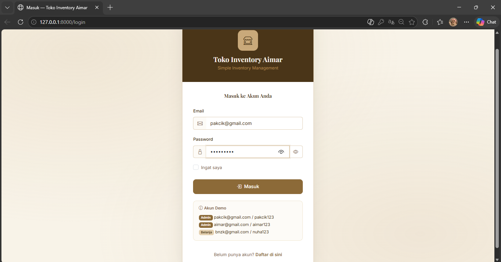

Sistem Login Session
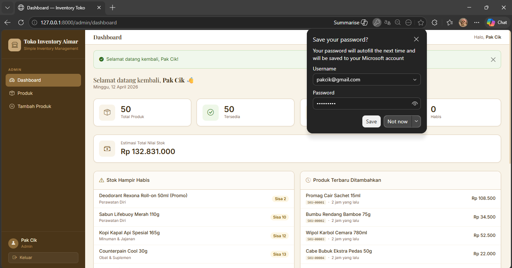

Dashboard
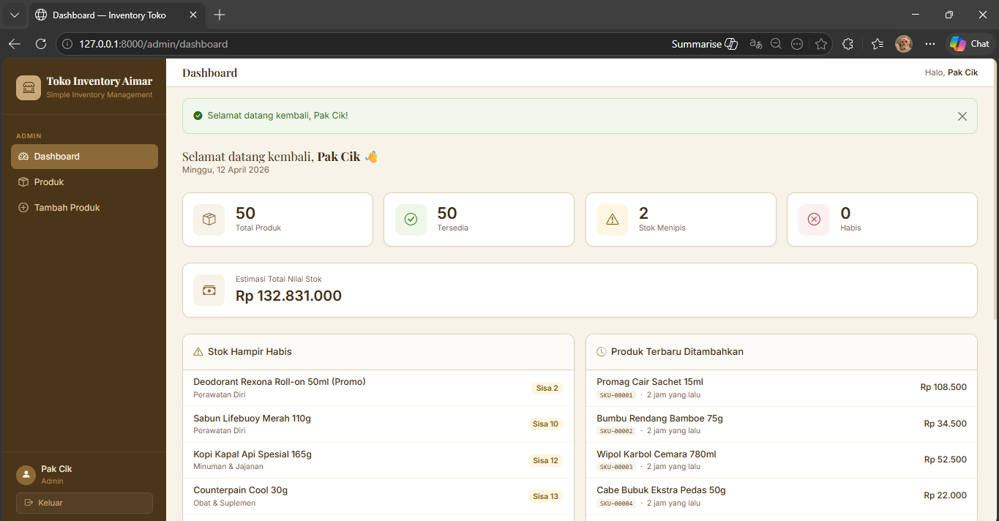

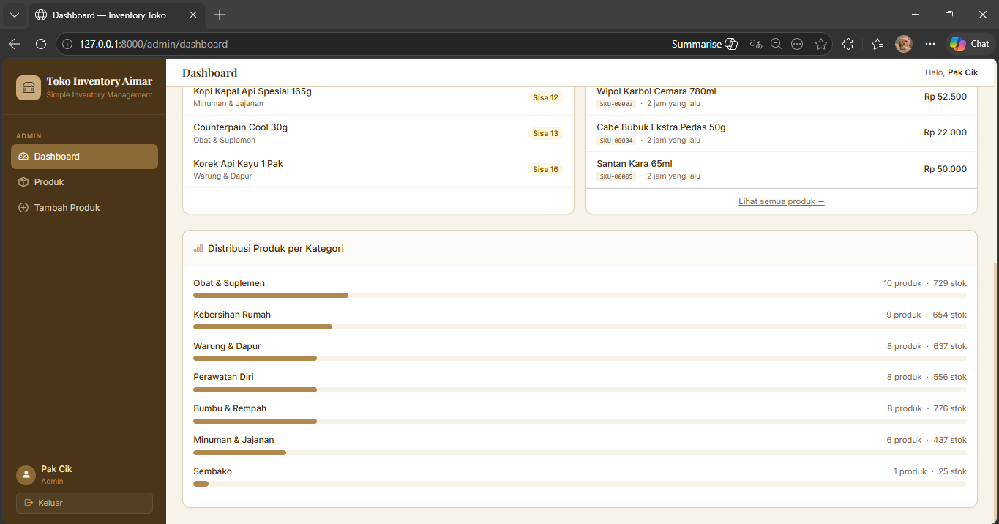

Produk
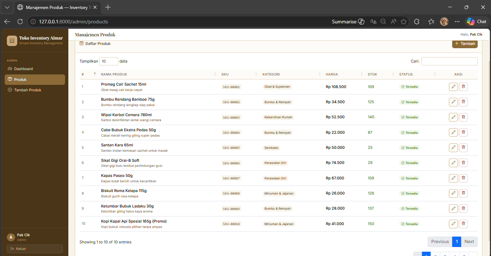

Edit Produk
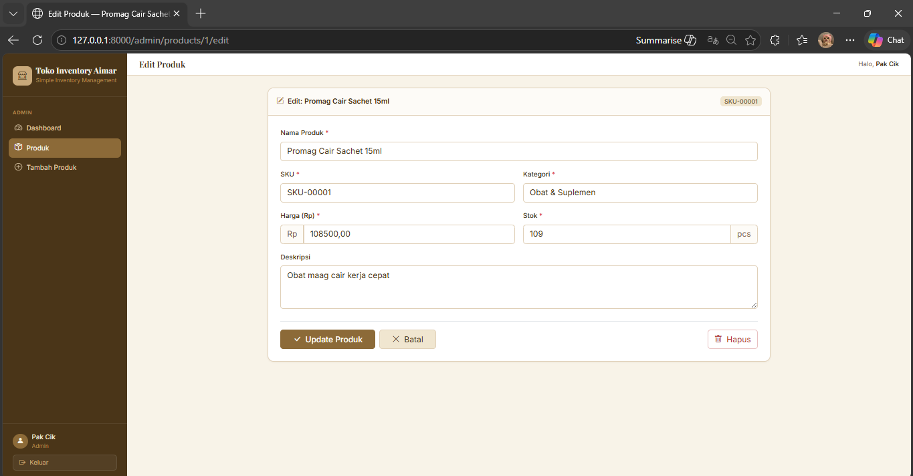

Hapus Produk
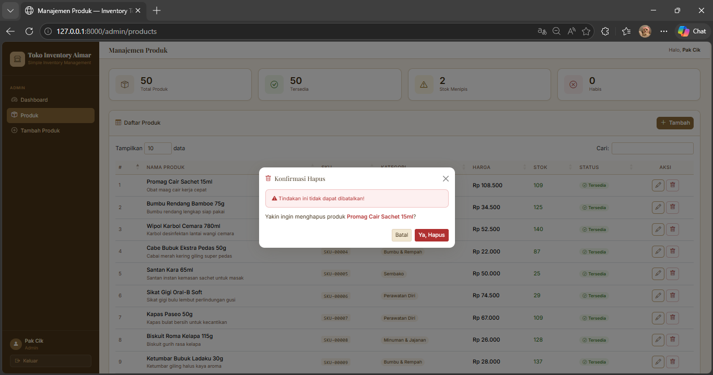

Tambah Produk


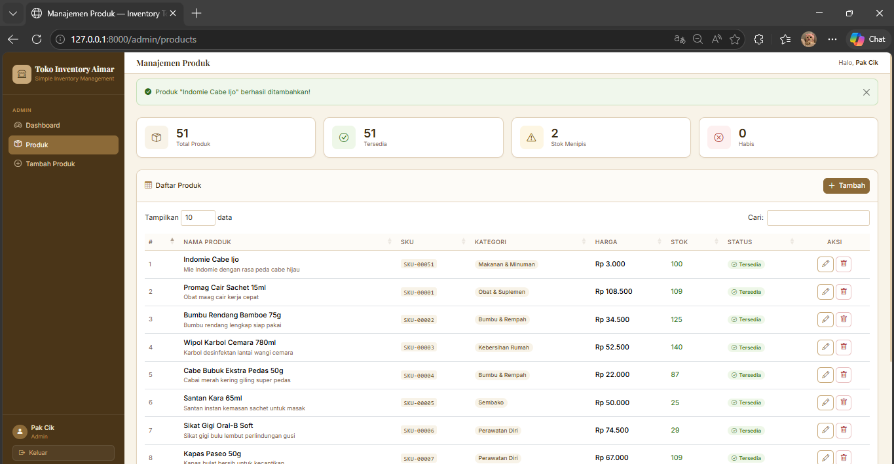

Logout


Page Registrasi Admin & Customer


Page Customer
Login
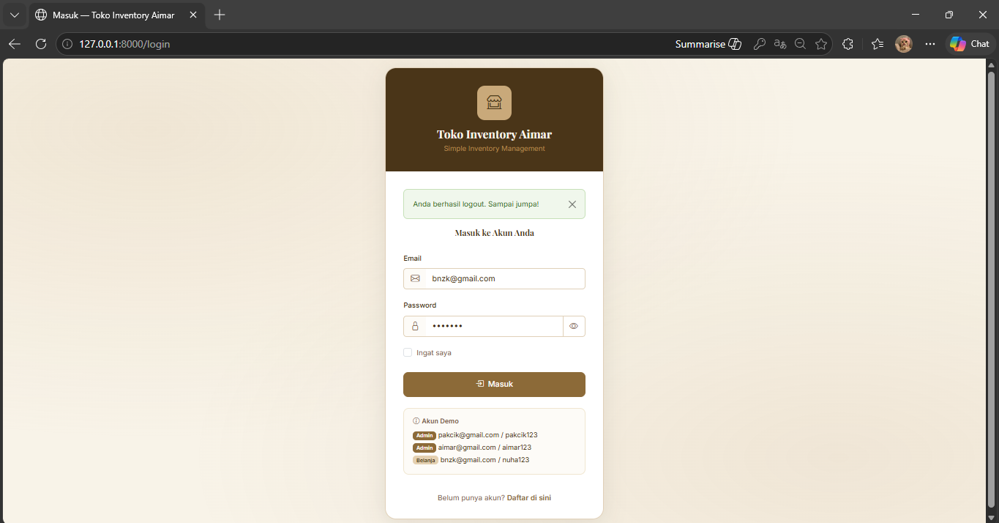

Sistem Login Session
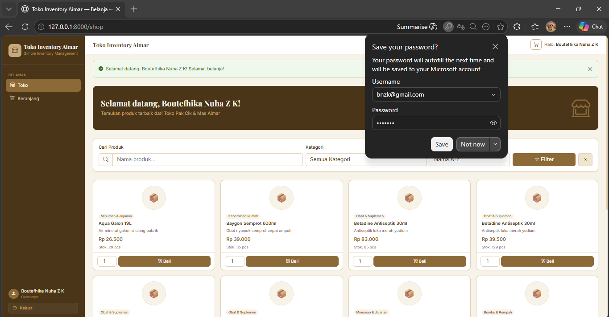

Toko
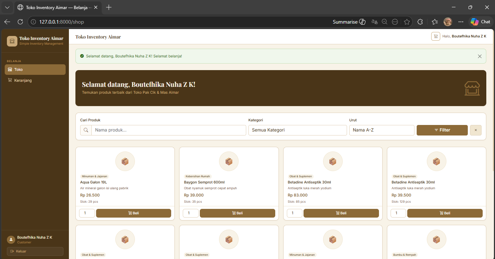

Tambah Keranjang & Checkout
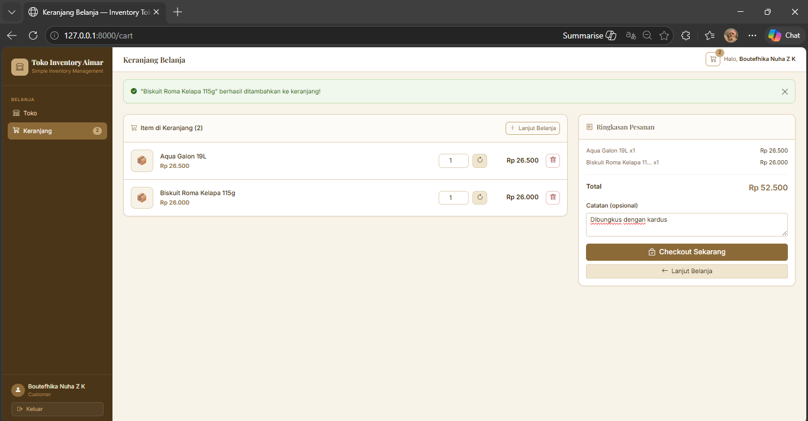

Notif berhasil membuat pesanan
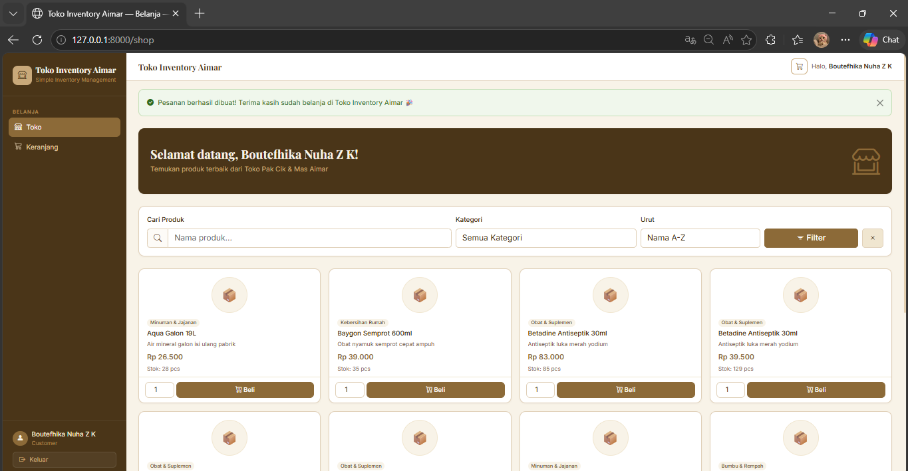

Fitur Cari Produk 
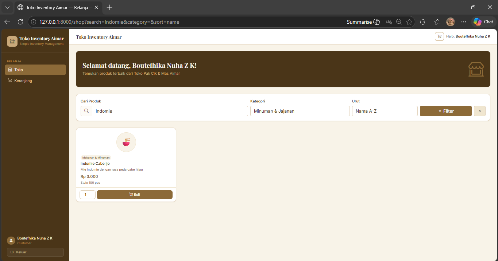

Logout
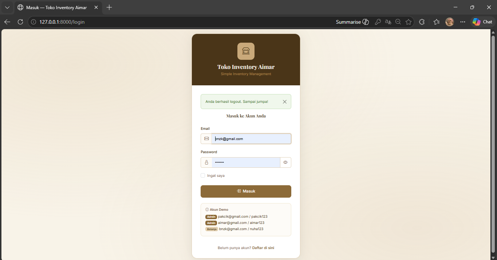
