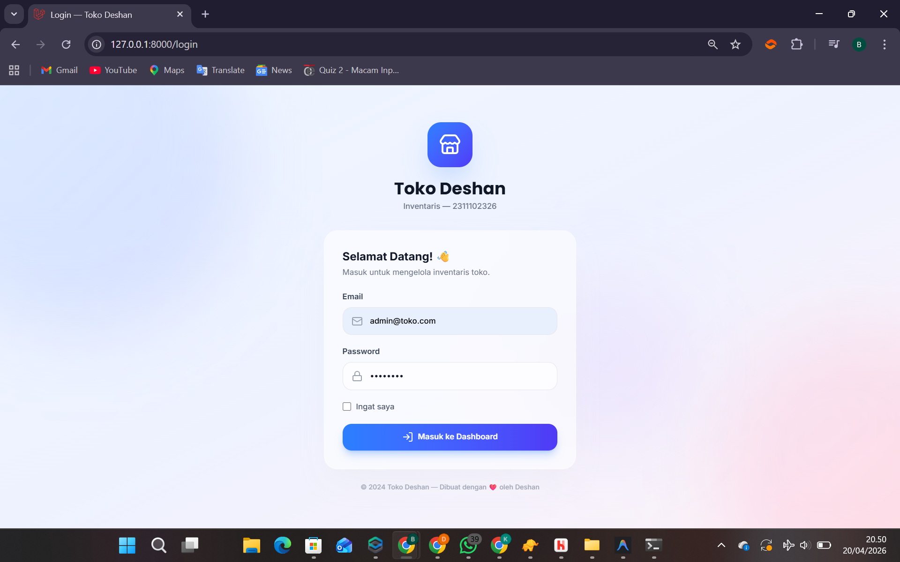
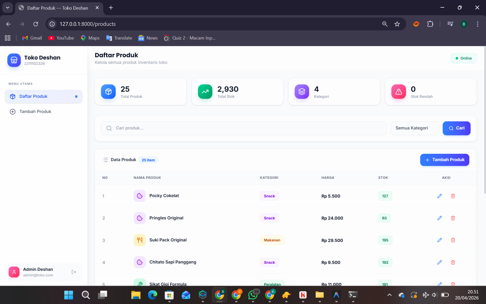
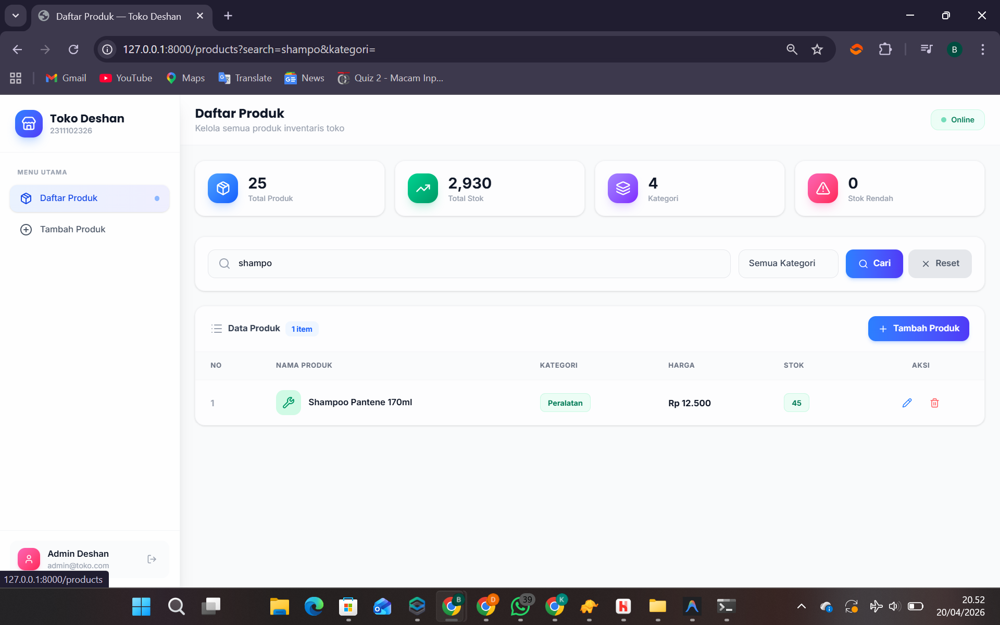
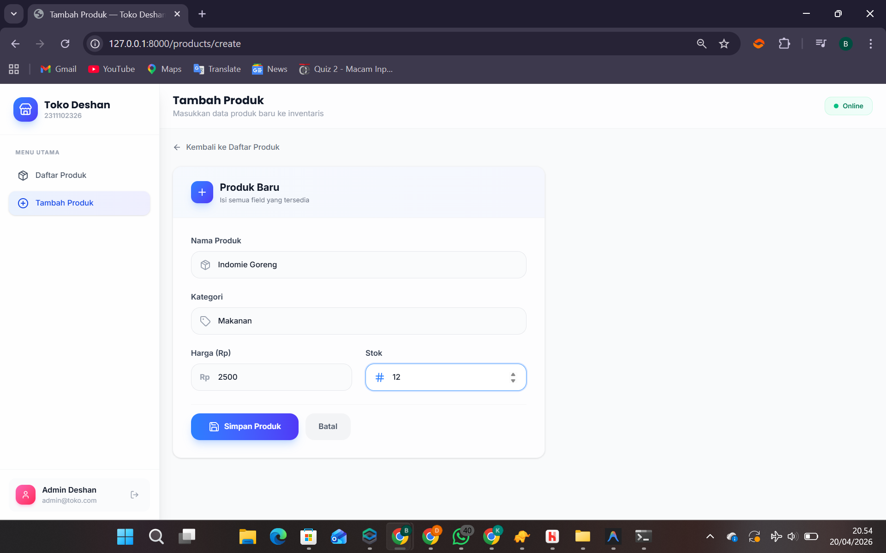
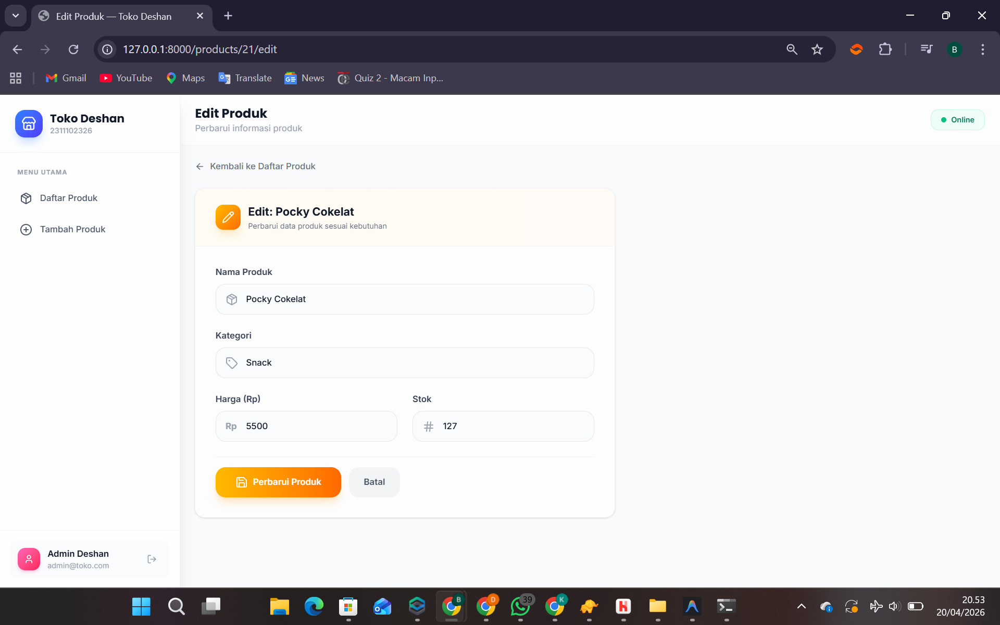
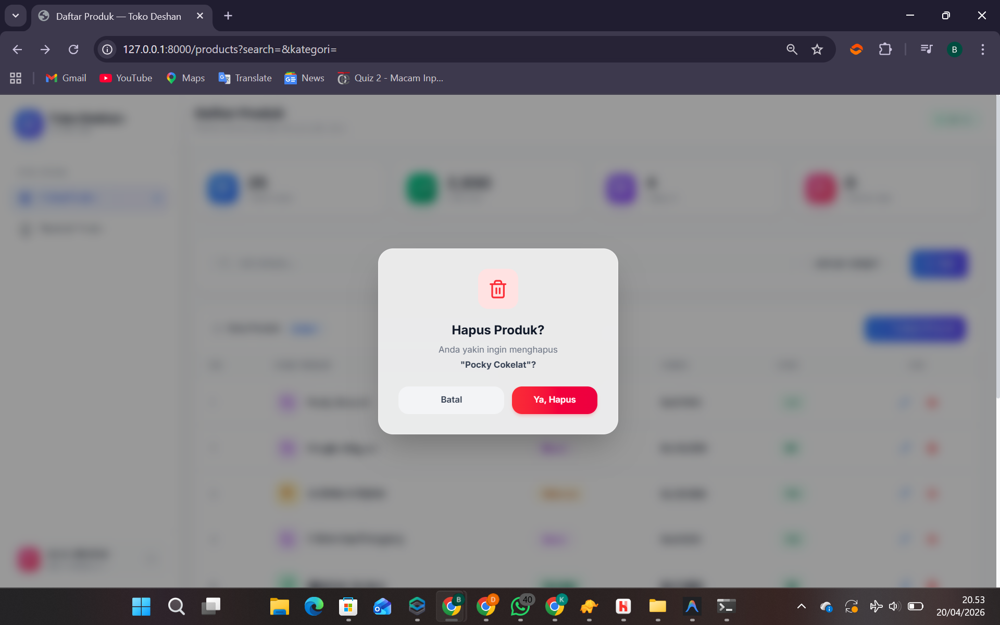

<div align="center">
  <br />
  <h1>LAPORAN PRAKTIKUM <br>APLIKASI BERBASIS PLATFORM</h1>
  <br />
  <h3>MODUL 11, 12 & 13 <br> Laravel — Aplikasi Inventaris Toko</h3>
  <br />
  <br />
  
  <br />
  <br />
  <br />
  <h3>Disusun Oleh :</h3>
  <p>
    <strong>Deshan Rafif Alfarisi</strong><br>
    <strong>2311102326</strong><br>
    <strong>S1 IF-11-01</strong>
  </p>
  <br />
  <h3>Dosen Pengampu :</h3>
  <p>
    <strong>Dimas Fanny Hebrasianto Permadi, S.ST., M.Kom</strong>
  </p>
  <br />
  <h4>Asisten Praktikum :</h4>
  <strong>Apri Pandu Wicaksono</strong> <br>
  <strong>Rangga Pradarrell Fathi</strong>
  <br />
  <h3>LABORATORIUM HIGH PERFORMANCE <br>FAKULTAS INFORMATIKA <br>UNIVERSITAS TELKOM PURWOKERTO <br>2026</h3>
</div>

---

## 1. Dasar Teori

### 1.1 Laravel Framework

Laravel adalah framework aplikasi web berbasis PHP yang mengikuti pola arsitektur **MVC (Model-View-Controller)**. Framework ini dirancang untuk mempermudah proses pengembangan aplikasi web modern dengan menyediakan berbagai fitur bawaan seperti sistem routing, templating engine Blade, autentikasi, ORM (Eloquent), migrasi database, seeder, dan lain sebagainya. Laravel pertama kali dikembangkan oleh Taylor Otwell pada tahun 2011 dan hingga kini menjadi salah satu framework PHP yang paling banyak digunakan di dunia.

Keunggulan utama Laravel dibanding framework PHP lainnya antara lain adalah sintaksnya yang ekspresif dan mudah dibaca, dukungan ekosistem yang luas (Composer, npm, Vite), serta dokumentasi yang sangat lengkap. Pada praktikum ini digunakan Laravel versi 11 yang merupakan versi LTS terbaru.

### 1.2 Pola Arsitektur MVC (Model-View-Controller)

MVC adalah pola arsitektur perangkat lunak yang memisahkan aplikasi menjadi tiga komponen utama:

- **Model**: Lapisan yang bertanggung jawab atas pengelolaan data. Dalam Laravel, model merepresentasikan sebuah tabel database dan berinteraksi dengan database menggunakan Eloquent ORM. Model juga mendefinisikan aturan *mass assignment* melalui properti `$fillable` dan `$guarded`.

- **View**: Lapisan presentasi yang menampilkan data kepada pengguna. Laravel menggunakan **Blade Templating Engine** sebagai view engine-nya. Blade memungkinkan penulisan kode PHP di dalam template HTML dengan sintaks yang bersih menggunakan direktif seperti `@if`, `@foreach`, `@extends`, `@section`, dan lain-lain.

- **Controller**: Lapisan yang menghubungkan Model dengan View. Controller menerima request HTTP dari pengguna, memproses logika bisnis, berinteraksi dengan Model untuk mengambil atau menyimpan data, lalu mengembalikan View yang sesuai sebagai respons.

Pemisahan tanggung jawab ini membuat kode menjadi lebih terorganisir, mudah di-*maintain*, dan mudah diuji (*testable*).

### 1.3 Eloquent ORM

Eloquent adalah implementasi ORM (*Object-Relational Mapper*) bawaan Laravel. ORM memungkinkan developer berinteraksi dengan database menggunakan objek PHP, tanpa perlu menulis query SQL secara langsung. Setiap model Eloquent merepresentasikan satu tabel database, dan setiap instance model merepresentasikan satu baris data dalam tabel tersebut.

Beberapa fitur penting Eloquent yang digunakan dalam praktikum ini:
- **`$fillable`**: Mendefinisikan kolom mana yang boleh diisi secara massal (*mass assignment*) untuk mencegah celah keamanan *mass assignment vulnerability*.
- **`casts`**: Mendefinisikan tipe data otomatis saat data dibaca dari atau ditulis ke database.
- **`paginate(n)`**: Menampilkan data secara terpaginasi sebanyak `n` baris per halaman.
- **`query()`**: Membangun query secara dinamis dengan berbagai kondisi `where`, `orderBy`, dan lainnya.

### 1.4 Blade Templating Engine

Blade adalah templating engine bawaan Laravel yang memungkinkan penggunaan sintaks PHP di dalam file HTML dengan cara yang lebih bersih dan ekspresif. Blade juga mendukung mekanisme pewarisan layout (*template inheritance*) melalui direktif `@extends` dan `@section`, serta komponen yang dapat digunakan ulang.

Direktif Blade yang digunakan dalam proyek ini antara lain:
- `@extends('layouts.app')` — Mewarisi layout utama
- `@section('content') ... @endsection` — Mendefinisikan konten halaman
- `@yield('content')` — Tempat konten disisipkan di layout
- `@foreach ... @endforeach` — Perulangan data
- `@if ... @elseif ... @endif` — Percabangan kondisi
- `@error('field') ... @enderror` — Menampilkan pesan error validasi
- `@csrf` — Token CSRF untuk keamanan form
- `@method('PUT')` / `@method('DELETE')` — HTTP method spoofing
- `@push('scripts') ... @endpush` — Menyisipkan JavaScript per halaman

### 1.5 Laravel Resource Controller

Resource Controller adalah fitur Laravel yang secara otomatis membuat method-method standar CRUD dalam satu controller. Dengan perintah `php artisan make:controller NamaController --resource`, Laravel akan membuat controller dengan tujuh method bawaan, yaitu `index`, `create`, `store`, `show`, `edit`, `update`, dan `destroy`.

Route `resource` pada file `web.php` secara otomatis memetakan ketujuh method tersebut ke URL dan HTTP method yang sesuai. Sebagai contoh, `Route::resource('products', ProductController::class)` akan membuat mapping antara lain:

| Method | URL | Controller Method | Nama Route |
|--------|-----|-------------------|------------|
| GET | `/products` | `index` | `products.index` |
| GET | `/products/create` | `create` | `products.create` |
| POST | `/products` | `store` | `products.store` |
| GET | `/products/{id}/edit` | `edit` | `products.edit` |
| PUT | `/products/{id}` | `update` | `products.update` |
| DELETE | `/products/{id}` | `destroy` | `products.destroy` |

### 1.6 Autentikasi Berbasis Sesi (Session-Based Authentication)

Autentikasi berbasis sesi adalah mekanisme keamanan di mana server menyimpan informasi sesi pengguna yang telah login di sisi server, dan browser menyimpan ID sesi tersebut dalam cookie. Setiap kali pengguna mengirimkan request, browser secara otomatis menyertakan cookie ID sesi sehingga server dapat mengidentifikasi siapa yang melakukan request.

Dalam Laravel, autentikasi sesi diimplementasikan menggunakan facade `Auth` yang menyediakan method-method seperti:
- `Auth::attempt($credentials)` — Verifikasi kredensial dan buat sesi login
- `Auth::check()` — Memeriksa apakah pengguna sedang login
- `Auth::logout()` — Menghapus sesi pengguna
- `Auth::user()` — Mengambil data pengguna yang sedang login

Seluruh route yang memerlukan autentikasi dilindungi dengan middleware `auth`, sehingga pengguna yang belum login akan secara otomatis diarahkan ke halaman login.

### 1.7 CSRF Protection

CSRF (*Cross-Site Request Forgery*) adalah jenis serangan keamanan web di mana penyerang memaksa pengguna yang telah terautentikasi untuk mengirimkan request yang tidak dikehendaki ke aplikasi. Laravel menyediakan perlindungan CSRF secara bawaan dengan membuat *token* unik untuk setiap sesi pengguna.

Token ini harus disertakan dalam setiap form HTML menggunakan direktif `@csrf`. Laravel akan secara otomatis memvalidasi token ini setiap kali menerima request POST, PUT, PATCH, atau DELETE. Jika token tidak valid atau tidak ada, Laravel akan menolak request tersebut dengan respons 419.

### 1.8 Database Migration dan Seeder

**Migration** adalah mekanisme version control untuk skema database. Dengan migration, developer dapat mendefinisikan struktur tabel (kolom, tipe data, relasi, indeks) menggunakan PHP, lalu menjalankan atau membatalkannya dengan perintah Artisan. Ini memastikan bahwa struktur database konsisten di semua lingkungan pengembangan dan produksi.

**Seeder** digunakan untuk mengisi database dengan data awal secara otomatis, baik untuk keperluan pengujian maupun data default aplikasi. Seeder bekerja bersama dengan **Factory** yang menggunakan library Faker untuk menghasilkan data dummy yang realistis secara acak.

### 1.9 Tailwind CSS dan Lucide Icons

**Tailwind CSS** adalah framework CSS *utility-first* yang menyediakan ribuan kelas utilitas kecil (seperti `flex`, `rounded-xl`, `text-sm`, `bg-blue-500`) yang dapat dikombinasikan langsung di dalam HTML untuk membangun tampilan yang kustom tanpa perlu menulis CSS dari awal. Berbeda dengan Bootstrap yang menyediakan komponen siap pakai, Tailwind memberikan kontrol penuh atas desain dengan tetap menjaga konsistensi.

**Lucide Icons** adalah library ikon berbasis SVG yang menyediakan ratusan ikon dengan tampilan yang bersih dan konsisten. Pada proyek ini digunakan melalui CDN (`unpkg.com/lucide@latest`) dan diinisialisasi dengan pemanggilan `lucide.createIcons()` di sisi JavaScript.

---

## 2. Implementasi Sistem (Kebutuhan Fungsional)

Sistem **Inventaris Toko** ini dibangun menggunakan framework Laravel dengan pola arsitektur **MVC (Model-View-Controller)**, memanfaatkan **MySQL/SQLite** sebagai basis data, serta **Tailwind CSS** dan **Lucide Icons** sebagai fondasi antarmuka pengguna. Sistem mencakup fitur-fitur utama sebagai berikut:

- **Autentikasi Pengguna**: Login dan logout berbasis sesi (*session-based*) menggunakan `AuthController` kustom dan facade `Auth` bawaan Laravel, sehingga seluruh halaman inventaris hanya dapat diakses oleh pengguna yang telah terautentikasi.
- **CRUD Produk**: Pengelolaan data produk secara penuh, meliputi operasi *Create*, *Read*, *Update*, dan *Delete*, yang dilindungi oleh middleware `auth`.
- **Pencarian & Filter**: Fitur pencarian produk berdasarkan nama atau kategori, serta filter dropdown berdasarkan kategori, yang diimplementasikan secara dinamis menggunakan query builder Eloquent.
- **Dashboard Statistik**: Kartu statistik di halaman utama menampilkan jumlah total produk, total stok keseluruhan, jumlah kategori unik, dan jumlah produk dengan stok rendah (< 10).
- **Pagination**: Daftar produk ditampilkan secara terpaginasi (10 data per halaman) dengan dukungan parameter query untuk mempertahankan filter saat berpindah halaman.
- **Indikator Stok**: Badge stok berwarna dinamis — merah (stok kritis < 10), kuning (stok rendah < 30), dan hijau (stok aman ≥ 30).
- **Modal Konfirmasi Delete**: Penghapusan data produk dilakukan melalui modal konfirmasi interaktif berbasis JavaScript murni untuk mencegah penghapusan tidak disengaja.
- **Tampilan UI Modern**: Antarmuka pengguna menggunakan **Tailwind CSS** dengan efek *glassmorphism* (backdrop-blur, transparan), sidebar responsif, dan animasi yang halus.

---

## 3. Penjelasan Kode Sumber

### 3.1 Migration Struktur Tabel Database

Migration mendefinisikan skema tabel `products` di database. Tabel ini menyimpan empat kolom utama: nama produk, kategori, harga, dan stok. Migration dijalankan dengan perintah `php artisan migrate`. *File Referensi: `database/migrations/2024_01_01_000003_create_products_table.php`*

```php
<?php

use Illuminate\Database\Migrations\Migration;
use Illuminate\Database\Schema\Blueprint;
use Illuminate\Support\Facades\Schema;

return new class extends Migration
{
    public function up(): void
    {
        Schema::create('products', function (Blueprint $table) {
            $table->id();                      // ID auto-increment (Primary Key)
            $table->string('nama_produk');     // Nama produk
            $table->string('kategori');        // Kategori produk
            $table->integer('harga');          // Harga produk (dalam Rupiah)
            $table->integer('stok');           // Jumlah stok tersedia
            $table->timestamps();              // created_at & updated_at
        });
    }

    public function down(): void
    {
        Schema::dropIfExists('products');
    }
};
```

---

### 3.2 Model `Product.php`

Model merepresentasikan tabel `products` sebagai objek PHP menggunakan **Eloquent ORM**. Properti `$fillable` mendaftarkan kolom yang boleh diisi secara massal. Method `casts()` mendefinisikan tipe data otomatis untuk kolom `harga` dan `stok` agar selalu dikembalikan sebagai integer. *File Referensi: `app/Models/Product.php`*

```php
<?php

namespace App\Models;

use Database\Factories\ProductFactory;
use Illuminate\Database\Eloquent\Factories\HasFactory;
use Illuminate\Database\Eloquent\Model;

class Product extends Model
{
    /** @use HasFactory<ProductFactory> */
    use HasFactory;

    // Kolom yang diizinkan diisi secara massal (mass assignment)
    protected $fillable = [
        'nama_produk',
        'kategori',
        'harga',
        'stok',
    ];

    // Cast tipe data otomatis dari database
    protected function casts(): array
    {
        return [
            'harga' => 'integer',
            'stok'  => 'integer',
        ];
    }
}
```

---

### 3.3 Database Seeder dan Factory

Seeder mengisi database dengan data awal secara otomatis menggunakan perintah `php artisan db:seed`. Data mencakup akun administrator default dan 25 data produk yang dihasilkan melalui `ProductFactory`. *File Referensi: `database/seeders/DatabaseSeeder.php`*

```php
<?php

namespace Database\Seeders;

use App\Models\Product;
use App\Models\User;
use Illuminate\Database\Seeder;

class DatabaseSeeder extends Seeder
{
    public function run(): void
    {
        // Buat akun pengguna administrator default
        User::factory()->create([
            'name'     => 'Admin Deshan',
            'email'    => 'admin@toko.com',
            'password' => bcrypt('password'),
        ]);

        // Generate 25 data produk dummy menggunakan factory
        Product::factory()->count(25)->create();
    }
}
```

`ProductFactory` mendefinisikan data produk yang realistis dari berbagai kategori (Makanan, Minuman, Snack, Peralatan) beserta harga dan stok yang dihasilkan secara acak. *File Referensi: `database/factories/ProductFactory.php`*

```php
<?php

namespace Database\Factories;

use App\Models\Product;
use Illuminate\Database\Eloquent\Factories\Factory;

/** @extends Factory<Product> */
class ProductFactory extends Factory
{
    protected $model = Product::class;

    public function definition(): array
    {
        $products = [
            ['nama' => 'Indomie Goreng',       'kategori' => 'Makanan'],
            ['nama' => 'Suki Pack Original',   'kategori' => 'Makanan'],
            ['nama' => 'Pop Mie Ayam',         'kategori' => 'Makanan'],
            ['nama' => 'Chitato Sapi Panggang','kategori' => 'Snack'],
            ['nama' => 'Oreo Vanila',          'kategori' => 'Snack'],
            ['nama' => 'Pringles Original',    'kategori' => 'Snack'],
            ['nama' => 'Aqua 600ml',           'kategori' => 'Minuman'],
            ['nama' => 'Teh Botol Sosro',      'kategori' => 'Minuman'],
            ['nama' => 'Coca Cola 390ml',      'kategori' => 'Minuman'],
            ['nama' => 'Ultra Milk Cokelat',   'kategori' => 'Minuman'],
            ['nama' => 'Sabun Lifebuoy',       'kategori' => 'Peralatan'],
            ['nama' => 'Pasta Gigi Pepsodent', 'kategori' => 'Peralatan'],
            ['nama' => 'Deterjen Rinso 800g',  'kategori' => 'Peralatan'],
            // ... dan lainnya
        ];

        $product = $this->faker->unique()->randomElement($products);

        return [
            'nama_produk' => $product['nama'],
            'kategori'    => $product['kategori'],
            'harga'       => $this->faker->numberBetween(2, 75) * 500, // Rp 1.000 – Rp 37.500
            'stok'        => $this->faker->numberBetween(5, 200),
        ];
    }
}
```

Kredensial akun default yang dapat langsung digunakan untuk login:
- **Email**: `admin@toko.com`
- **Password**: `password`

---

### 3.4 Routes `web.php`

Routes mendefinisikan URL yang dapat diakses beserta controller yang menanganinya. Route root `/` mengalihkan langsung ke halaman login. Route autentikasi (login/logout) dikelola oleh `AuthController`, sementara route produk dibungkus dalam middleware `auth` dan menggunakan `Route::resource` yang secara otomatis membuat 6 route CRUD (dikecualikan `show`). *File Referensi: `routes/web.php`*

```php
<?php

use App\Http\Controllers\AuthController;
use App\Http\Controllers\ProductController;
use Illuminate\Support\Facades\Route;

// Redirect root "/" langsung ke halaman login
Route::get('/', function () {
    return redirect()->route('login');
});

// Route autentikasi (tidak memerlukan login)
Route::get('/login',  [AuthController::class, 'showLogin'])->name('login');
Route::post('/login', [AuthController::class, 'login']);
Route::post('/logout',[AuthController::class, 'logout'])->name('logout');

// Grup route yang dilindungi middleware autentikasi
Route::middleware('auth')->group(function () {

    // Resource route: otomatis membuat index, create, store,
    // edit, update, destroy untuk produk (show dikecualikan)
    Route::resource('products', ProductController::class)->except(['show']);
});
```

---

### 3.5 Controller `AuthController.php`

`AuthController` menangani seluruh alur autentikasi: menampilkan halaman login, memproses login, dan logout. Method `showLogin` memeriksa apakah pengguna sudah login terlebih dahulu; jika iya, langsung diarahkan ke halaman produk. Method `login` memvalidasi input, lalu mencoba autentikasi menggunakan `Auth::attempt()`. *File Referensi: `app/Http/Controllers/AuthController.php`*

```php
<?php

namespace App\Http\Controllers;

use Illuminate\Http\Request;
use Illuminate\Support\Facades\Auth;

class AuthController extends Controller
{
    // GET /login — Tampilkan halaman login
    // Jika sudah login, redirect ke halaman produk
    public function showLogin()
    {
        if (Auth::check()) {
            return redirect()->route('products.index');
        }
        return view('auth.login');
    }

    // POST /login — Validasi kredensial dan buat sesi
    public function login(Request $request)
    {
        $credentials = $request->validate([
            'email'    => ['required', 'email'],
            'password' => ['required'],
        ]);

        // Auth::attempt() memverifikasi email & password,
        // sekaligus membuat sesi jika berhasil
        if (Auth::attempt($credentials, $request->boolean('remember'))) {
            $request->session()->regenerate(); // Cegah session fixation attack

            return redirect()->intended(route('products.index'));
        }

        // Kembalikan pesan error jika gagal login
        return back()->withErrors([
            'email' => 'Email atau password salah.',
        ])->onlyInput('email');
    }

    // POST /logout — Hapus sesi dan redirect ke login
    public function logout(Request $request)
    {
        Auth::logout();

        $request->session()->invalidate();
        $request->session()->regenerateToken();

        return redirect()->route('login');
    }
}
```

---

### 3.6 Controller `ProductController.php`

`ProductController` adalah inti logika bisnis aplikasi inventaris. Method `index` mendukung fitur pencarian dan filter kategori secara dinamis menggunakan query builder Eloquent, serta mengirimkan data daftar kategori unik ke view untuk mengisi dropdown filter. *File Referensi: `app/Http/Controllers/ProductController.php`*

```php
<?php

namespace App\Http\Controllers;

use App\Models\Product;
use Illuminate\Http\Request;

class ProductController extends Controller
{
    // GET /products — Tampilkan daftar produk dengan search & filter
    public function index(Request $request)
    {
        $query = Product::query();

        // Fitur Pencarian: cari berdasarkan nama_produk atau kategori
        if ($request->filled('search')) {
            $search = $request->search;
            $query->where(function ($q) use ($search) {
                $q->where('nama_produk', 'like', "%{$search}%")
                  ->orWhere('kategori', 'like', "%{$search}%");
            });
        }

        // Fitur Filter: filter berdasarkan kategori tertentu
        if ($request->filled('kategori')) {
            $query->where('kategori', $request->kategori);
        }

        $products = $query->orderBy('created_at', 'desc')->paginate(10);

        // Ambil semua kategori unik untuk dropdown filter
        $kategoris = Product::select('kategori')
                            ->distinct()
                            ->orderBy('kategori')
                            ->pluck('kategori');

        return view('products.index', compact('products', 'kategoris'));
    }

    // GET /products/create — Tampilkan form tambah produk
    public function create()
    {
        $kategoris = ['Makanan', 'Minuman', 'Snack', 'Peralatan'];
        return view('products.create', compact('kategoris'));
    }

    // POST /products — Validasi dan simpan produk baru
    public function store(Request $request)
    {
        $validated = $request->validate([
            'nama_produk' => ['required', 'string', 'max:255'],
            'kategori'    => ['required', 'string', 'max:100'],
            'harga'       => ['required', 'integer', 'min:0'],
            'stok'        => ['required', 'integer', 'min:0'],
        ]);

        Product::create($validated);

        return redirect()->route('products.index')
            ->with('success', 'Produk berhasil ditambahkan! 🎉');
    }

    // GET /products/{id}/edit — Tampilkan form edit produk
    public function edit(Product $product)
    {
        $kategoris = ['Makanan', 'Minuman', 'Snack', 'Peralatan'];
        return view('products.edit', compact('product', 'kategoris'));
    }

    // PUT /products/{id} — Validasi dan perbarui data produk
    public function update(Request $request, Product $product)
    {
        $validated = $request->validate([
            'nama_produk' => ['required', 'string', 'max:255'],
            'kategori'    => ['required', 'string', 'max:100'],
            'harga'       => ['required', 'integer', 'min:0'],
            'stok'        => ['required', 'integer', 'min:0'],
        ]);

        $product->update($validated);

        return redirect()->route('products.index')
            ->with('success', 'Produk berhasil diperbarui! ✏️');
    }

    // DELETE /products/{id} — Hapus produk dari database
    public function destroy(Product $product)
    {
        $product->delete();

        return redirect()->route('products.index')
            ->with('success', 'Produk berhasil dihapus! 🗑️');
    }
}
```

---

### 3.7 View Layout Utama (`layouts/app.blade.php`)

Layout utama mendefinisikan kerangka halaman yang digunakan oleh seluruh halaman dalam aplikasi menggunakan direktif `@extends`. Menggunakan **Tailwind CSS** dan ikon **Lucide**. Terdiri dari sidebar kiri yang responsif (tersembunyi di mobile, muncul di layar besar), topbar dengan judul halaman dan indikator status online, serta area konten utama. Flash message sukses ditampilkan secara otomatis dan menghilang setelah 4 detik. *File Referensi: `resources/views/layouts/app.blade.php`*

```html
<!-- Sidebar Kiri — Navigasi Utama -->
<aside id="sidebar" class="fixed inset-y-0 left-0 z-40 w-72 transform
     -translate-x-full lg:translate-x-0 transition-transform duration-300">
    <div class="flex flex-col h-full bg-white/80 backdrop-blur-xl
                border-r border-gray-200/50 shadow-xl">

        <!-- Logo & Nama Aplikasi -->
        <div class="flex items-center gap-3 px-6 py-6 border-b border-gray-100">
            <div class="flex items-center justify-center w-11 h-11 rounded-2xl
                        bg-gradient-to-br from-blue-500 to-indigo-600 shadow-lg">
                <i data-lucide="store" class="w-6 h-6 text-white"></i>
            </div>
            <div>
                <h1 class="text-lg font-bold text-gray-900">Toko Deshan</h1>
                <p class="text-xs text-gray-400">2311102326</p>
            </div>
        </div>

        <!-- Menu Navigasi -->
        <nav class="flex-1 px-4 py-6 space-y-1.5">
            <a href="{{ route('products.index') }}"
               class="{{ request()->routeIs('products.index')
                    ? 'bg-gradient-to-r from-blue-500/10 to-indigo-500/10 text-blue-700'
                    : 'text-gray-600 hover:bg-gray-100' }}
                    flex items-center gap-3 px-4 py-3 rounded-xl text-sm font-medium">
                <i data-lucide="package" class="w-5 h-5"></i>
                <span>Daftar Produk</span>
            </a>
            <a href="{{ route('products.create') }}"
               class="{{ request()->routeIs('products.create')
                    ? 'bg-gradient-to-r from-blue-500/10 to-indigo-500/10 text-blue-700'
                    : 'text-gray-600 hover:bg-gray-100' }}
                    flex items-center gap-3 px-4 py-3 rounded-xl text-sm font-medium">
                <i data-lucide="plus-circle" class="w-5 h-5"></i>
                <span>Tambah Produk</span>
            </a>
        </nav>

        <!-- Info User & Tombol Logout -->
        <div class="px-4 py-4 border-t border-gray-100">
            <div class="flex items-center gap-3 px-3 py-3 rounded-xl bg-gray-50/80">
                <p class="text-sm font-semibold text-gray-900">{{ Auth::user()->name }}</p>
                <p class="text-xs text-gray-400">{{ Auth::user()->email }}</p>
                <form method="POST" action="{{ route('logout') }}">
                    @csrf
                    <button type="submit" class="p-2 rounded-lg text-gray-400
                            hover:text-red-500 hover:bg-red-50 transition-all">
                        <i data-lucide="log-out" class="w-4 h-4"></i>
                    </button>
                </form>
            </div>
        </div>
    </div>
</aside>

<!-- Area Konten Utama -->
<main class="flex-1 lg:ml-72 min-h-screen">
    <!-- Topbar Sticky -->
    <header class="sticky top-0 z-20 bg-white/70 backdrop-blur-xl border-b border-gray-200/50">
        <h2>@yield('page-title', 'Dashboard')</h2>
    </header>

    <!-- Flash Message Sukses -->
    @if(session('success'))
        <div id="flash-message">{{ session('success') }}</div>
    @endif

    <!-- Konten Halaman -->
    <div class="p-6">@yield('content')</div>
</main>
```

---

### 3.8 View Halaman Login (`auth/login.blade.php`)

Halaman login memiliki desain *full-page* dengan latar belakang gradien animatif dan kartu login berbasis *glassmorphism* (efek blur + transparan). Form mengirim data ke route `login` menggunakan POST dengan perlindungan CSRF. Jika login gagal, pesan error ditampilkan dalam banner merah di atas form. *File Referensi: `resources/views/auth/login.blade.php`*

```html
<!DOCTYPE html>
<html lang="id">
<head>
    <title>Login — Toko Deshan</title>
    <!-- Inter & Poppins Fonts, Lucide Icons, Tailwind via Vite -->
</head>
<body class="min-h-screen font-sans antialiased relative overflow-hidden">

    <!-- Animated Background Gradients -->
    <div class="absolute inset-0 bg-gradient-to-br from-blue-50 via-indigo-50 to-pink-50">
        <div class="absolute top-[-20%] left-[-10%] w-[600px] h-[600px] rounded-full
                    bg-gradient-to-br from-blue-200/40 to-indigo-300/30 blur-3xl animate-float-slow">
        </div>
    </div>

    <!-- Login Card (Glassmorphism) -->
    <div class="relative z-10 flex items-center justify-center min-h-screen px-4">
        <div class="bg-white/60 backdrop-blur-2xl rounded-3xl border border-white/50
                    shadow-2xl p-8 w-full max-w-md">

            <!-- Error Banner -->
            @if($errors->any())
                <div class="mb-5 flex items-center gap-3 px-4 py-3 rounded-2xl
                            bg-red-50/80 border border-red-200/60">
                    <p class="text-sm font-medium text-red-700">{{ $errors->first() }}</p>
                </div>
            @endif

            <form method="POST" action="{{ route('login') }}">
                @csrf

                <!-- Input Email dengan Icon -->
                <input type="email" name="email" value="{{ old('email') }}"
                       placeholder="admin@toko.com" required autofocus>

                <!-- Input Password dengan Icon -->
                <input type="password" name="password" required>

                <!-- Remember Me -->
                <input type="checkbox" name="remember">

                <!-- Tombol Submit -->
                <button type="submit"
                    class="w-full py-3.5 rounded-2xl bg-gradient-to-r from-blue-500
                           to-indigo-600 text-white font-semibold">
                    <i data-lucide="log-in"></i> Masuk ke Dashboard
                </button>
            </form>
        </div>
    </div>
</body>
</html>
```

---

### 3.9 View Daftar Produk (`products/index.blade.php`)

Halaman index adalah halaman utama aplikasi yang menampilkan empat kartu statistik, form pencarian dan filter, serta tabel data produk yang berpaginasi. Setiap baris tabel menampilkan ikon kategori yang berbeda-beda, harga dalam format Rupiah, badge stok berwarna dinamis, serta tombol Edit dan Hapus. Modal konfirmasi hapus dikendalikan oleh JavaScript murni. *File Referensi: `resources/views/products/index.blade.php`*

```html
@extends('layouts.app')
@section('content')

    <!-- Kartu Statistik (4 kolom) -->
    <div class="grid grid-cols-1 sm:grid-cols-2 lg:grid-cols-4 gap-4 mb-8">
        <!-- Total Produk -->
        <div class="bg-white/70 backdrop-blur-xl rounded-2xl border border-gray-200/50 p-5">
            <p class="text-2xl font-bold">{{ \App\Models\Product::count() }}</p>
            <p class="text-xs text-gray-400">Total Produk</p>
        </div>
        <!-- Total Stok -->
        <div>{{ number_format(\App\Models\Product::sum('stok')) }} — Total Stok</div>
        <!-- Kategori -->
        <div>{{ \App\Models\Product::distinct('kategori')->count('kategori') }} — Kategori</div>
        <!-- Stok Rendah -->
        <div>{{ \App\Models\Product::where('stok', '<', 10)->count() }} — Stok Rendah</div>
    </div>

    <!-- Form Pencarian & Filter -->
    <form method="GET" action="{{ route('products.index') }}">
        <input type="text" name="search" value="{{ request('search') }}"
               placeholder="Cari produk...">
        <select name="kategori">
            <option value="">Semua Kategori</option>
            @foreach($kategoris as $kat)
                <option value="{{ $kat }}" {{ request('kategori') == $kat ? 'selected' : '' }}>
                    {{ $kat }}
                </option>
            @endforeach
        </select>
        <button type="submit">Cari</button>
        @if(request('search') || request('kategori'))
            <a href="{{ route('products.index') }}">Reset</a>
        @endif
    </form>

    <!-- Tabel Produk -->
    <table>
        <thead><tr>
            <th>No</th><th>Nama Produk</th><th>Kategori</th>
            <th>Harga</th><th>Stok</th><th>Aksi</th>
        </tr></thead>
        <tbody>
            @foreach($products as $index => $product)
            <tr>
                <td>{{ $products->firstItem() + $index }}</td>
                <td>{{ $product->nama_produk }}</td>
                <td>{{ $product->kategori }}</td>
                <td>Rp {{ number_format($product->harga, 0, ',', '.') }}</td>
                <td>
                    <!-- Badge stok berwarna dinamis -->
                    @if($product->stok < 10)
                        <span class="badge-red">{{ $product->stok }}</span>
                    @elseif($product->stok < 30)
                        <span class="badge-yellow">{{ $product->stok }}</span>
                    @else
                        <span class="badge-green">{{ $product->stok }}</span>
                    @endif
                </td>
                <td>
                    <a href="{{ route('products.edit', $product) }}">Edit</a>
                    <button onclick="openDeleteModal({{ $product->id }}, '{{ $product->nama_produk }}')">
                        Hapus
                    </button>
                </td>
            </tr>
            @endforeach
        </tbody>
    </table>

    <!-- Pagination (mempertahankan parameter query) -->
    {{ $products->appends(request()->query())->links() }}

    <!-- Modal Konfirmasi Hapus -->
    <div id="delete-modal" class="fixed inset-0 z-50 hidden">
        <div class="bg-white/80 backdrop-blur-2xl rounded-3xl p-8 text-center">
            <h3>Hapus Produk?</h3>
            <p id="delete-product-name"></p>
            <form id="delete-form" method="POST">
                @csrf
                @method('DELETE')
                <button type="button" onclick="closeDeleteModal()">Batal</button>
                <button type="submit">Ya, Hapus</button>
            </form>
        </div>
    </div>
@endsection

@push('scripts')
<script>
    function openDeleteModal(id, name) {
        document.getElementById('delete-form').action = `/products/${id}`;
        document.getElementById('delete-product-name').textContent = `"${name}"?`;
        document.getElementById('delete-modal').classList.remove('hidden');
    }
    function closeDeleteModal() {
        document.getElementById('delete-modal').classList.add('hidden');
    }
    document.addEventListener('keydown', (e) => {
        if (e.key === 'Escape') closeDeleteModal();
    });
</script>
@endpush
```

---

### 3.10 View Form Tambah Produk (`products/create.blade.php`)

Form tambah produk menggunakan metode POST ke route `products.store`. Terdapat empat field input wajib: nama produk (text), kategori (dropdown select), harga (number), dan stok (number). Validasi error ditampilkan secara *inline* di bawah masing-masing field. *File Referensi: `resources/views/products/create.blade.php`*

```html
@extends('layouts.app')
@section('content')
    <form method="POST" action="{{ route('products.store') }}" class="space-y-6">
        @csrf

        <!-- Input Nama Produk -->
        <div>
            <label for="nama_produk">Nama Produk</label>
            <input type="text" id="nama_produk" name="nama_produk"
                   value="{{ old('nama_produk') }}"
                   placeholder="Contoh: Indomie Goreng" required>
            @error('nama_produk')
                <p class="text-red-500 text-xs">{{ $message }}</p>
            @enderror
        </div>

        <!-- Dropdown Kategori -->
        <div>
            <label for="kategori">Kategori</label>
            <select id="kategori" name="kategori" required>
                <option value="">Pilih Kategori</option>
                @foreach($kategoris as $kat)
                    <option value="{{ $kat }}"
                        {{ old('kategori') == $kat ? 'selected' : '' }}>
                        {{ $kat }}
                    </option>
                @endforeach
            </select>
            @error('kategori')
                <p class="text-red-500 text-xs">{{ $message }}</p>
            @enderror
        </div>

        <!-- Grid 2 Kolom: Harga & Stok -->
        <div class="grid grid-cols-2 gap-6">
            <div>
                <label for="harga">Harga (Rp)</label>
                <input type="number" id="harga" name="harga"
                       value="{{ old('harga') }}" min="0" required>
                @error('harga')
                    <p class="text-red-500 text-xs">{{ $message }}</p>
                @enderror
            </div>
            <div>
                <label for="stok">Stok</label>
                <input type="number" id="stok" name="stok"
                       value="{{ old('stok') }}" min="0" required>
                @error('stok')
                    <p class="text-red-500 text-xs">{{ $message }}</p>
                @enderror
            </div>
        </div>

        <!-- Tombol Aksi -->
        <button type="submit"
            class="bg-gradient-to-r from-blue-500 to-indigo-600 text-white rounded-2xl px-8 py-3.5">
            <i data-lucide="save"></i> Simpan Produk
        </button>
        <a href="{{ route('products.index') }}" class="bg-gray-100 rounded-2xl px-6 py-3.5">
            Batal
        </a>
    </form>
@endsection
```

---

### 3.11 View Form Edit Produk (`products/edit.blade.php`)

Form edit menggunakan metode PUT (di-*spoof* dengan `@method('PUT')`) ke route `products.update`. Seluruh field terisi otomatis dengan data produk yang dipilih menggunakan helper `old()` dengan fallback ke nilai dari database (`$product->field`). Header form menggunakan warna amber/orange untuk membedakan secara visual dari form tambah. *File Referensi: `resources/views/products/edit.blade.php`*

```html
@extends('layouts.app')
@section('content')
    <form method="POST" action="{{ route('products.update', $product) }}" class="space-y-6">
        @csrf
        @method('PUT')  <!-- HTTP method spoofing untuk PUT request -->

        <!-- Header form edit berwarna amber -->
        <div class="bg-gradient-to-r from-amber-50/50 to-orange-50/50">
            <h3>Edit: {{ $product->nama_produk }}</h3>
        </div>

        <!-- Nama Produk — diisi otomatis dari data yang ada -->
        <input type="text" name="nama_produk"
               value="{{ old('nama_produk', $product->nama_produk) }}" required>

        <!-- Kategori — dropdown dengan nilai terpilih otomatis -->
        <select name="kategori" required>
            @foreach($kategoris as $kat)
                <option value="{{ $kat }}"
                    {{ old('kategori', $product->kategori) == $kat ? 'selected' : '' }}>
                    {{ $kat }}
                </option>
            @endforeach
        </select>

        <!-- Harga & Stok — diisi otomatis -->
        <input type="number" name="harga"
               value="{{ old('harga', $product->harga) }}" min="0" required>
        <input type="number" name="stok"
               value="{{ old('stok', $product->stok) }}" min="0" required>

        <!-- Tombol Aksi — warna amber untuk edit -->
        <button type="submit"
            class="bg-gradient-to-r from-amber-400 to-orange-500 text-white rounded-2xl px-8 py-3.5">
            <i data-lucide="save"></i> Perbarui Produk
        </button>
        <a href="{{ route('products.index') }}">Batal</a>
    </form>
@endsection
```

---

## 4. Hasil Tampilan (Screenshots) Aplikasi

### 4.1 Halaman Login

Halaman autentikasi pengguna dengan desain *glassmorphism* — kartu login semi-transparan di atas latar belakang gradien animatif berwarna biru-indigo-pink. Terdapat input email dan password dengan ikon Lucide, checkbox "Ingat saya", serta tombol submit bergradien. Jika pengguna sudah login, akan langsung diarahkan ke halaman produk tanpa menampilkan halaman ini kembali.



---

### 4.2 Halaman Login Gagal

Ketika pengguna memasukkan email atau password yang salah, banner pesan error merah muncul di bagian atas kartu login. Laravel mengembalikan pesan `"Email atau password salah."` melalui mekanisme `withErrors()` tanpa mengungkapkan apakah email atau password yang salah, demi alasan keamanan.


---

### 4.3 Halaman Dashboard / Daftar Produk

Halaman utama aplikasi dengan sidebar kiri, empat kartu statistik (Total Produk, Total Stok, Kategori, Stok Rendah), form pencarian dan filter kategori, serta tabel data produk lengkap. Setiap baris menampilkan ikon kategori berwarna berbeda (kuning untuk Makanan, biru untuk Minuman, ungu untuk Snack, hijau untuk Peralatan), harga dalam format Rupiah, dan badge stok dinamis.



---

### 4.4 Fitur Sorting / Filter Kategori

Fitur filter memungkinkan pengguna menyaring produk berdasarkan kategori tertentu melalui dropdown, atau mencari berdasarkan nama produk menggunakan input teks. Saat filter aktif, tombol "Reset" muncul untuk menghapus semua parameter pencarian. Hasil pencarian tetap terpaginasi dan parameter filter dipertahankan saat berpindah halaman.



---

### 4.5 Halaman Tambah Produk

Halaman formulir untuk menambahkan produk baru. Form terdiri dari input nama produk, dropdown kategori (Makanan, Minuman, Snack, Peralatan), serta input harga dan stok dalam layout dua kolom berdampingan. Header kartu berwarna biru dengan ikon plus. Validasi sisi server memastikan semua field terisi dengan benar.



---

### 4.6 Halaman Edit Produk

Halaman formulir untuk memperbarui data produk yang sudah ada. Identik strukturnya dengan form tambah, namun semua field telah terisi otomatis dengan data produk yang dipilih. Header kartu menggunakan warna amber/orange sebagai pembeda visual, dilengkapi nama produk yang sedang diedit. Tombol submit juga berwarna amber.



---

### 4.7 Modal Konfirmasi Hapus

Modal konfirmasi muncul saat tombol hapus (ikon tempat sampah) ditekan pada salah satu baris produk. Modal menampilkan nama produk yang akan dihapus dan meminta konfirmasi sebelum data benar-benar dihapus dari database secara permanen. Terdapat dua tombol: "Batal" untuk menutup modal, dan "Ya, Hapus" berwarna merah untuk melanjutkan penghapusan.



---

## 5. Daftar Pustaka

Otwell, T. (2024). *Laravel 11.x Documentation*. Laravel LLC. Diakses dari https://laravel.com/docs/11.x

Otwell, T. (2024). *Eloquent ORM — Laravel 11.x*. Laravel LLC. Diakses dari https://laravel.com/docs/11.x/eloquent

Otwell, T. (2024). *Blade Templates — Laravel 11.x*. Laravel LLC. Diakses dari https://laravel.com/docs/11.x/blade

Otwell, T. (2024). *Authentication — Laravel 11.x*. Laravel LLC. Diakses dari https://laravel.com/docs/11.x/authentication

Otwell, T. (2024). *Resource Controllers — Laravel 11.x*. Laravel LLC. Diakses dari https://laravel.com/docs/11.x/controllers#resource-controllers

Otwell, T. (2024). *Database Migrations — Laravel 11.x*. Laravel LLC. Diakses dari https://laravel.com/docs/11.x/migrations

Otwell, T. (2024). *Database Seeding — Laravel 11.x*. Laravel LLC. Diakses dari https://laravel.com/docs/11.x/seeding

Otwell, T. (2024). *CSRF Protection — Laravel 11.x*. Laravel LLC. Diakses dari https://laravel.com/docs/11.x/csrf

Tailwind Labs. (2024). *Tailwind CSS Documentation*. Tailwind Labs Inc. Diakses dari https://tailwindcss.com/docs

Lucide Contributors. (2024). *Lucide Icons*. Diakses dari https://lucide.dev

Welling, L., & Thomson, L. (2016). *PHP and MySQL Web Development* (5th ed.). Addison-Wesley Professional.

Freeman, A. (2022). *Pro PHP 8 MVC: Building Your Own PHP MVC Framework*. Apress.
