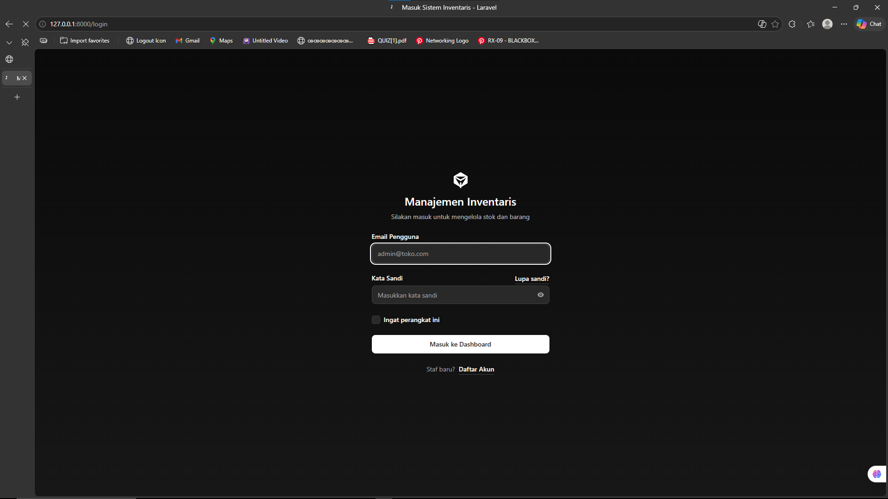
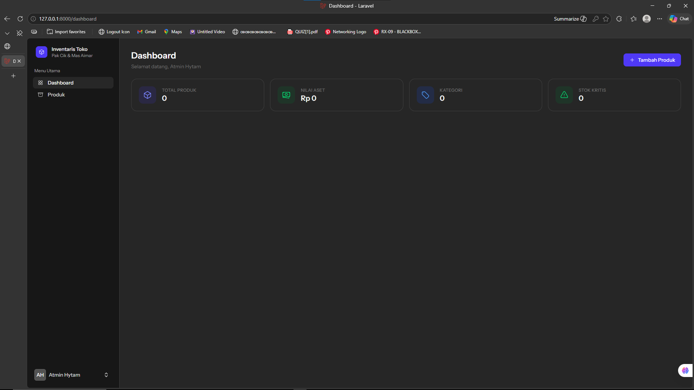
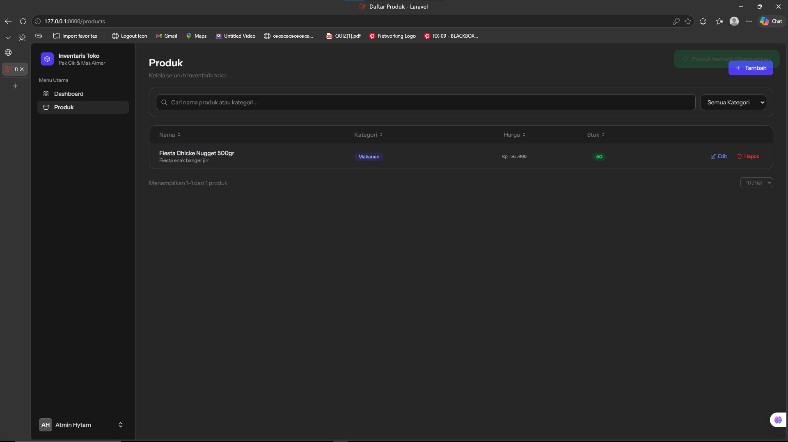
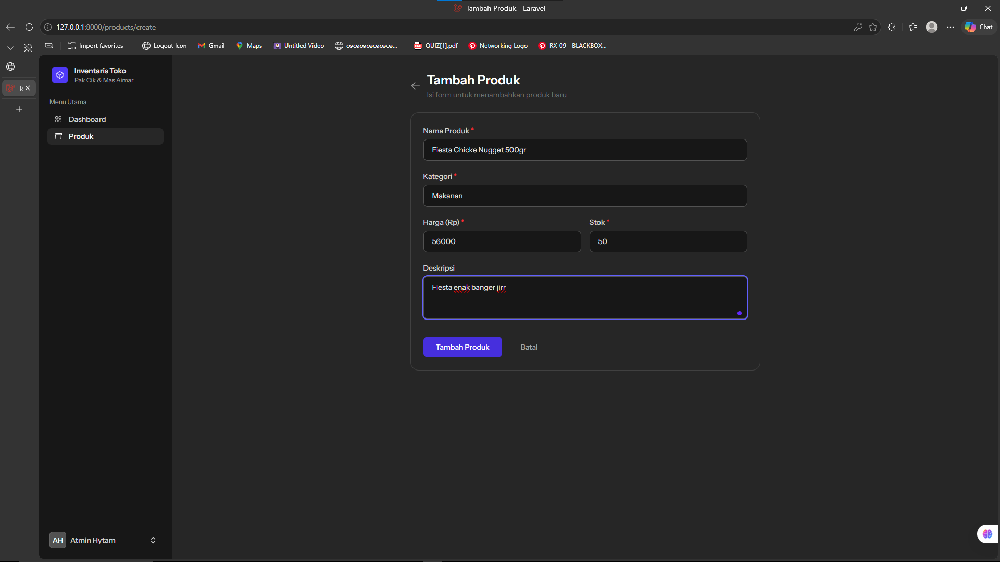
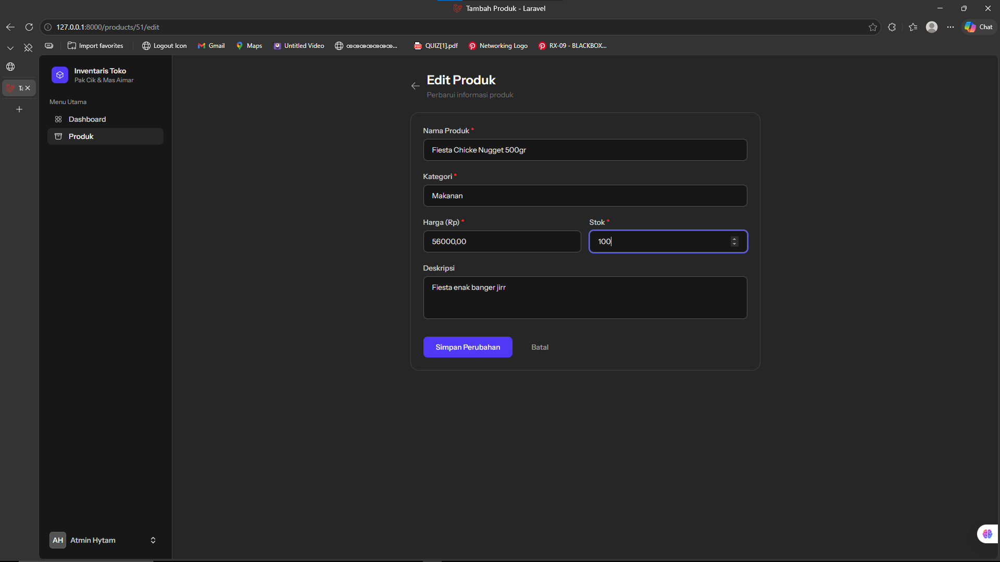
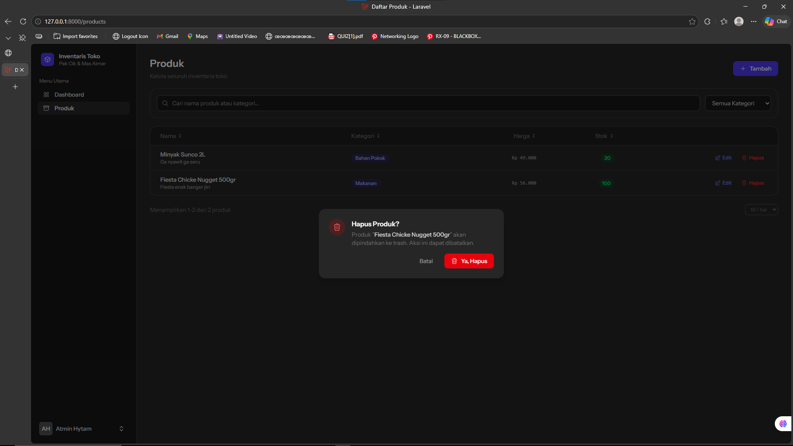
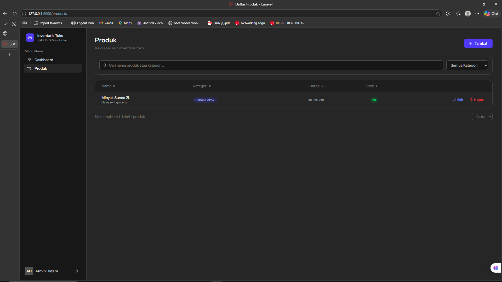

<div align="center">
  <br />
  <h1>LAPORAN PRAKTIKUM <br>APLIKASI BERBASIS PLATFORM</h1>
  <br />
  <h2> MODUL 11,12,13 <br> LARAVEL - INVENTARIS TOKO </h2>
  <br />
  <br />
   
  <br />
  <br />
  <br />
  <h3>Disusun Oleh :</h3>
  <p>
    <strong>Satrio Wibowo</strong><br>
    <strong>2311102149</strong><br>
    <strong>S1 IF-11-REG 01</strong>
  </p>
  <br />
  <h3>Dosen Pengampu :</h3>
  <p>
    <strong>Dimas Fanny Hebrasianto Permadi, S.ST., M.Kom</strong>
  </p>
  <br />
  <br />
    <h4>Asisten Praktikum :</h4>
    <strong> Apri Pandu Wicaksono </strong> <br>
    <strong>Rangga Pradarrell Fathi</strong>
  <br />
  <h2>LABORATORIUM HIGH PERFORMANCE
 <br>FAKULTAS INFORMATIKA <br>UNIVERSITAS TELKOM PURWOKERTO <br>2026</h2>
</div>

---
## 1. DASAR TEORI
 
### Laravel Framework
Framework Laravel merupakan kerangka kerja PHP terbuka (*open-source*) berdesain MVC (*Model-View-Controller*) yang digunakan untuk mendukung pengembangan aplikasi web secara cepat (Rapid Application Development). Framework ini menawarkan berbagai fitur built-in serta pustaka yang mempermudah pengembangan fungsionalitas seperti Routing terdedikasi dan ORM (Object-Relational Mapping) dengan sistem bernama Eloquent untuk manipulasi data SQL yang intuitif.
 
### MVC (Model-View-Controller)
MVC merupakan pola arsitektur perangkat lunak yang membagi aplikasi menjadi tiga komponen utama:
 
- **Model**: bertugas mengelola data dan berinteraksi dengan database
- **View**: bertanggung jawab menampilkan data kepada pengguna
- **Controller**: menghubungkan Model dan View serta mengatur alur aplikasi
Dalam Laravel, konsep MVC diterapkan secara penuh. Model menggunakan Eloquent ORM, View menggunakan Blade Template Engine, dan pada project ini logika aplikasi ditangani langsung oleh **Livewire Component** sebagai pengganti Controller konvensional.
 
### Livewire
Livewire adalah full-stack framework untuk Laravel yang memungkinkan pembuatan antarmuka dinamis tanpa menulis JavaScript secara eksplisit. Setiap komponen Livewire terdiri dari sebuah PHP class dan Blade view yang terhubung secara reaktif. Perubahan pada properti komponen akan secara otomatis memperbarui tampilan tanpa reload halaman penuh (SPA-like experience).
 
### Database Factory dan Seeder
Database Factory dan Seeder merupakan fitur Laravel yang digunakan untuk menghasilkan data secara otomatis ke dalam database.
 
- **Factory**: digunakan untuk membuat data dummy atau data uji secara otomatis menggunakan library Faker
- **Seeder**: digunakan untuk memasukkan data ke dalam database, baik untuk kebutuhan testing maupun inisialisasi data awal
Kombinasi keduanya digunakan pada project ini untuk mengisi 50 data produk dummy dan 1 akun admin secara otomatis saat perintah `migrate --seed` dijalankan.
 
### Sistem Autentikasi dengan Livewire Starter Kit
Project ini menggunakan **Livewire Starter Kit** bawaan Laravel yang terintegrasi dengan **Laravel Fortify** sebagai authentication backend. Fortify menyediakan implementasi lengkap untuk login, logout, registrasi, dan two-factor authentication. Akses ke seluruh halaman inventaris dilindungi oleh middleware `auth` sehingga hanya pengguna yang sudah login yang dapat mengakses data produk.
 
### Blade Template Engine & Flux UI
Blade merupakan template engine bawaan Laravel. Pada project ini Blade dikombinasikan dengan **Flux UI** — library komponen UI berbasis Livewire — dan **Tailwind CSS** untuk menghasilkan tampilan yang modern dan responsif. **Alpine.js** digunakan untuk interaktivitas ringan seperti modal konfirmasi delete dan notifikasi toast.
 
### Soft Deletes
Soft Deletes adalah fitur Eloquent yang memungkinkan data "dihapus" tanpa benar-benar dihapus dari database. Record yang dihapus akan memiliki nilai pada kolom `deleted_at`, sehingga data masih dapat dipulihkan jika diperlukan. Fitur ini diterapkan pada model `Product` menggunakan trait `SoftDeletes`.
 
---
 
## 2. SOURCE CODE
 
Source code lengkap project **Laravel - Inventaris Toko** berada di dalam folder `inventaris-toko/`.
 
### routes/web.php
```php
<?php
 
use Illuminate\Support\Facades\Route;
 
Route::get('/', fn () => redirect()->route('dashboard'))->name('home');
 
Route::middleware(['auth'])->group(function () {
    Route::get('/dashboard', App\Livewire\Dashboard::class)->name('dashboard');
    Route::get('/products', App\Livewire\ProductList::class)->name('products.index');
    Route::get('/products/create', App\Livewire\ProductForm::class)->name('products.create');
    Route::get('/products/{product}/edit', App\Livewire\ProductForm::class)->name('products.edit');
});
 
require __DIR__.'/auth.php';
require __DIR__.'/settings.php';
```
 
### app/Livewire/Dashboard.php
```php
<?php
 
namespace App\Livewire;
 
use App\Models\Product;
use Illuminate\Support\Facades\DB;
use Livewire\Attributes\Layout;
use Livewire\Attributes\Title;
use Livewire\Component;
 
#[Layout('layouts.app')]
#[Title('Dashboard')]
class Dashboard extends Component
{
    public function render()
    {
        return view('livewire.dashboard', [
            'totalProducts'    => Product::count(),
            'totalAssetValue'  => Product::sum(DB::raw('price * stock')),
            'lowStockProducts' => Product::lowStock()->orderBy('stock')->limit(10)->get(),
            'totalCategories'  => Product::distinct('category')->count('category'),
        ]);
    }
}
```
 
### app/Livewire/ProductList.php
```php
<?php
 
namespace App\Livewire;
 
use App\Models\Product;
use Livewire\Attributes\Layout;
use Livewire\Attributes\Title;
use Livewire\Attributes\Url;
use Livewire\Component;
use Livewire\WithPagination;
 
#[Layout('layouts.app')]
#[Title('Daftar Produk')]
class ProductList extends Component
{
    use WithPagination;
 
    #[Url(history: true)]
    public string $search = '';
 
    #[Url]
    public string $sortField = 'created_at';
 
    #[Url]
    public string $sortDirection = 'desc';
 
    #[Url]
    public string $categoryFilter = '';
 
    public int $perPage = 10;
 
    public function updatedSearch(): void { $this->resetPage(); }
    public function updatedCategoryFilter(): void { $this->resetPage(); }
 
    public function sortBy(string $field): void
    {
        if ($this->sortField === $field) {
            $this->sortDirection = $this->sortDirection === 'asc' ? 'desc' : 'asc';
        } else {
            $this->sortField     = $field;
            $this->sortDirection = 'asc';
        }
    }
 
    public function deleteProduct(int $id): void
    {
        $product = Product::findOrFail($id);
        $product->delete(); // Soft delete
        session()->flash('success', "Produk \"{$product->name}\" berhasil dihapus.");
    }
 
    public function render()
    {
        $products = Product::query()
            ->when($this->search, fn ($q) =>
                $q->where('name', 'like', "%{$this->search}%")
                  ->orWhere('category', 'like', "%{$this->search}%")
            )
            ->when($this->categoryFilter, fn ($q) =>
                $q->where('category', $this->categoryFilter)
            )
            ->orderBy($this->sortField, $this->sortDirection)
            ->paginate($this->perPage);
 
        $categories = Product::distinct()->pluck('category')->sort()->values();
 
        return view('livewire.product-list', compact('products', 'categories'));
    }
}
```
 
### app/Livewire/ProductForm.php
```php
<?php
 
namespace App\Livewire;
 
use App\Models\Product;
use Livewire\Attributes\Layout;
use Livewire\Attributes\Title;
use Livewire\Attributes\Rule;
use Livewire\Component;
 
#[Layout('layouts.app')]
#[Title('Tambah Produk')]
class ProductForm extends Component
{
    public ?Product $product = null;
 
    #[Rule('required|string|min:3|max:255')]
    public string $name = '';
 
    #[Rule('required|string|max:100')]
    public string $category = '';
 
    #[Rule('required|numeric|min:0')]
    public string $price = '';
 
    #[Rule('required|integer|min:0')]
    public string $stock = '';
 
    #[Rule('nullable|string|max:1000')]
    public string $description = '';
 
    public function mount(?Product $product = null): void
    {
        if ($product && $product->exists) {
            $this->product     = $product;
            $this->name        = $product->name;
            $this->category    = $product->category;
            $this->price       = (string) $product->price;
            $this->stock       = (string) $product->stock;
            $this->description = $product->description ?? '';
        }
    }
 
    public function save(): void
    {
        $uniqueRule = 'unique:products,name' . ($this->product?->id ? ",{$this->product->id}" : '');
        $this->validateOnly('name', ['name' => ['required', 'string', 'min:3', 'max:255', $uniqueRule]]);
        $this->validate();
 
        $data = [
            'name'        => $this->name,
            'category'    => $this->category,
            'price'       => $this->price,
            'stock'       => $this->stock,
            'description' => $this->description ?: null,
        ];
 
        if ($this->product?->exists) {
            $this->product->update($data);
            session()->flash('success', 'Produk berhasil diperbarui.');
        } else {
            Product::create($data);
            session()->flash('success', 'Produk berhasil ditambahkan.');
        }
 
        $this->redirect(route('products.index'), navigate: true);
    }
 
    public function render()
    {
        $isEditing = $this->product?->exists;
        return view('livewire.product-form', compact('isEditing'));
    }
}
```
 
### app/Models/Product.php
```php
<?php
 
namespace App\Models;
 
use Illuminate\Database\Eloquent\Factories\HasFactory;
use Illuminate\Database\Eloquent\Model;
use Illuminate\Database\Eloquent\SoftDeletes;
 
class Product extends Model
{
    use HasFactory, SoftDeletes;
 
    protected $fillable = [
        'name', 'category', 'price', 'stock', 'description',
    ];
 
    protected $casts = [
        'price' => 'decimal:2',
        'stock' => 'integer',
    ];
 
    // Scope: produk dengan stok kritis (< 10)
    public function scopeLowStock($query, int $threshold = 10)
    {
        return $query->where('stock', '<', $threshold);
    }
 
    // Accessor: format harga ke Rupiah
    public function getFormattedPriceAttribute(): string
    {
        return 'Rp ' . number_format($this->price, 0, ',', '.');
    }
 
    // Computed: total nilai stok
    public function getStockValueAttribute(): float
    {
        return $this->price * $this->stock;
    }
}
```
 
### database/migrations/2026_04_19_184134_create_products_table.php
```php
<?php
 
use Illuminate\Database\Migrations\Migration;
use Illuminate\Database\Schema\Blueprint;
use Illuminate\Support\Facades\Schema;
 
return new class extends Migration
{
    public function up(): void
    {
        Schema::create('products', function (Blueprint $table) {
            $table->id();
            $table->string('name')->unique();
            $table->string('category');
            $table->decimal('price', 15, 2);
            $table->unsignedInteger('stock')->default(0);
            $table->text('description')->nullable();
            $table->softDeletes();
            $table->timestamps();
        });
    }
 
    public function down(): void
    {
        Schema::dropIfExists('products');
    }
};
```
 
### database/factories/ProductFactory.php
```php
<?php
 
namespace Database\Factories;
 
use Illuminate\Database\Eloquent\Factories\Factory;
 
class ProductFactory extends Factory
{
    private static array $categories = [
        'Elektronik', 'Makanan & Minuman', 'Pakaian',
        'Peralatan Rumah', 'Kosmetik', 'Olahraga', 'Otomotif',
    ];
 
    public function definition(): array
    {
        return [
            'name'        => $this->faker->unique()->words(3, true),
            'category'    => $this->faker->randomElement(self::$categories),
            'price'       => $this->faker->randomFloat(2, 5000, 5000000),
            'stock'       => $this->faker->numberBetween(0, 200),
            'description' => $this->faker->sentence(12),
        ];
    }
 
    public function lowStock(): static
    {
        return $this->state(fn () => ['stock' => $this->faker->numberBetween(0, 9)]);
    }
}
```
 
### database/seeders/DatabaseSeeder.php
```php
<?php
 
namespace Database\Seeders;
 
use App\Models\Product;
use App\Models\User;
use Illuminate\Database\Seeder;
use Illuminate\Support\Facades\Hash;
 
class DatabaseSeeder extends Seeder
{
    public function run(): void
    {
        // User admin default
        User::firstOrCreate(
            ['email' => 'admin@example.com'],
            [
                'name'     => 'Admin Toko',
                'password' => Hash::make('password'),
            ]
        );
 
        // 10 produk stok kritis + 40 produk normal
        Product::factory()->count(10)->lowStock()->create();
        Product::factory()->count(40)->create();
    }
}
```
 
---
 
## 3. CARA INSTALASI
 
### Persyaratan Sistem
- PHP >= 8.2 (dengan ekstensi `pdo_mysql` dan `pdo_sqlite`)
- Composer
- Node.js >= 20 & npm
- MySQL / MariaDB (XAMPP) **atau** SQLite
### Langkah Instalasi
 
**1. Masuk ke folder project**
```bash
cd "D:\S6\Aplikasi Berbasis Platform\Praktikum\mdoul 11,12,13\2311120149_Satrio-Wibowo\inventaris-toko"
```
 
**2. Install dependensi PHP**
```bash
composer install
```
 
**3. Install dependensi Node.js**
```bash
npm install
```
 
**4. Salin file environment**
```bash
cp .env.example .env
php artisan key:generate
```
 
**5. Konfigurasi database di `.env`**
 
Untuk **MySQL**:
```env
DB_CONNECTION=mysql
DB_HOST=127.0.0.1
DB_PORT=3306
DB_DATABASE=inventaris_toko
DB_USERNAME=root
DB_PASSWORD=
```
 
Untuk **SQLite** (default):
```env
DB_CONNECTION=sqlite
```
 
**6. Buat database (khusus MySQL)**
 
Buka phpMyAdmin lalu buat database baru dengan nama `inventaris_toko`, collation `utf8mb4_unicode_ci`. Atau via terminal:
```bash
mysql -u root -e "CREATE DATABASE inventaris_toko CHARACTER SET utf8mb4 COLLATE utf8mb4_unicode_ci;"
```
 
**7. Jalankan migrasi dan seeder**
```bash
php artisan migrate --seed
```
 
**8. Build asset frontend**
```bash
npm run build
```
 
**9. Jalankan server**
```bash
composer run dev
```
 
Buka browser: **http://127.0.0.1:8000**
 
### Akun Login Default
 
| Field    | Value              |
|----------|--------------------|
| Email    | admin@example.com  |
| Password | password           |
 
### Penanganan Error Driver SQLite (PDO)
 
Jika muncul error `could not find driver` saat menjalankan migrasi:
 
1. Cari lokasi `php.ini` dengan perintah:
   ```bash
   php --ini
   ```
2. Buka file `php.ini`, cari dan hapus tanda `;` di depan baris berikut:
   ```ini
   extension=pdo_sqlite
   extension=sqlite3
   extension=pdo_mysql
   extension=mysqli
   ```
3. Simpan file, restart terminal, lalu jalankan ulang perintah migrasi.
Verifikasi ekstensi aktif:
```bash
php -m | findstr sqlite
php -m | findstr mysql
```
 
---
 
## 4. OUTPUT
 
### A. Tampilan Login
Halaman login menggunakan Livewire Starter Kit dengan autentikasi Laravel Fortify.
 
Akun demo:
- **Email**: admin@example.com
- **Password**: admin123
<p>

</p>

### B. Dashboard
Halaman dashboard menampilkan empat widget ringkasan: Total Produk, Nilai Aset keseluruhan, jumlah Kategori, dan jumlah Produk Stok Kritis. Di bawahnya terdapat tabel daftar produk dengan stok di bawah 10 unit beserta badge indikator warna.
 
<p>

</p>

### C. Daftar Produk
Halaman daftar produk menampilkan datatable dengan fitur pencarian real-time, filter kategori, sorting kolom (Nama, Kategori, Harga, Stok), pagination tanpa reload halaman, serta tombol Edit dan Hapus pada setiap baris.
 
<p>

</p>

### D. Tambah Produk
Form tambah produk dilengkapi validasi ketat: nama produk harus unik, harga dan stok harus berupa angka non-negatif, serta autocomplete untuk field kategori berdasarkan data yang sudah ada.
 
<p>

</p>

### E. Edit Produk
Form edit produk identik dengan form tambah, namun field sudah terisi dengan data produk yang dipilih. Validasi unique pada nama produk dikecualikan untuk record yang sedang diedit.
 
<p>

</p>

### F. Hapus Produk (Soft Delete)
Penghapusan produk menampilkan modal konfirmasi Alpine.js sebelum eksekusi. Data yang dihapus tidak langsung hilang dari database (Soft Delete) — kolom `deleted_at` diisi dengan timestamp penghapusan.
 
<p>

</p>

<p>

</p>
---
 
## 5. PEMBAHASAN SOURCE CODE
 
### A. Routing (`routes/web.php`)
Routing mengatur alur navigasi aplikasi. Terdapat dua bagian utama:
- **Route `home`**: Route `/` diberikan nama `home` karena dibutuhkan oleh layout autentikasi bawaan Livewire Starter Kit untuk link logo di halaman login.
- **Protected Routes**: Seluruh route inventaris (`/dashboard`, `/products`, `/products/create`, `/products/{product}/edit`) dibungkus dalam grup middleware `auth`. Ini memastikan hanya pengguna yang sudah terautentikasi yang dapat mengakses halaman tersebut.
- **`require settings.php`**: File route tambahan bawaan starter kit yang mendefinisikan route-route pengaturan profil pengguna (`profile.edit`, dll.) yang dibutuhkan oleh komponen sidebar.
### B. Livewire Components
 
**`Dashboard`** bertugas mengambil empat data agregat dari model `Product` secara sekaligus: jumlah total produk, total nilai aset (hasil perkalian `price * stock` menggunakan `DB::raw`), daftar produk dengan stok kritis menggunakan query scope `lowStock()`, dan jumlah kategori unik. Semua data diteruskan ke view sebagai variabel.
 
**`ProductList`** mengimplementasikan fitur datatable secara reaktif menggunakan trait `WithPagination`. Properti `$search`, `$sortField`, `$sortDirection`, dan `$categoryFilter` diberi atribut `#[Url]` sehingga nilainya tersimpan di URL — memungkinkan pengguna menyalin dan berbagi URL dengan filter yang sudah diaplikasikan. Method `updatedSearch()` dan `updatedCategoryFilter()` secara otomatis mereset pagination ke halaman pertama saat filter berubah. Method `deleteProduct()` mengeksekusi soft delete dan menampilkan flash message.
 
**`ProductForm`** menangani dua mode sekaligus: tambah produk baru dan edit produk yang sudah ada. Mode ditentukan dari parameter route `{product}` yang di-inject ke method `mount()`. Validasi `unique` pada nama produk dikecualikan secara dinamis untuk record yang sedang diedit menggunakan `validateOnly()` dengan rule yang dibangun secara programatik.
 
### C. Model (`app/Models/Product.php`)
Model `Product` menggunakan dua trait utama:
- **`HasFactory`**: menghubungkan model dengan `ProductFactory` untuk pembuatan data dummy.
- **`SoftDeletes`**: menambahkan kolom `deleted_at` dan memastikan query default secara otomatis mengecualikan record yang sudah "dihapus".
Terdapat query scope `scopeLowStock()` yang dapat dipanggil dengan `Product::lowStock()` untuk memfilter produk dengan stok di bawah threshold tertentu (default 10). Accessor `getFormattedPriceAttribute()` memformat harga ke format Rupiah dan dapat dipanggil langsung dari view dengan `$product->formatted_price`.
 
### D. Database Migration & Factory
Migration `create_products_table` mendefinisikan struktur tabel dengan tipe data yang tepat: `decimal(15,2)` untuk harga agar perhitungan keuangan akurat, `unsignedInteger` untuk stok agar tidak bisa bernilai negatif, dan `softDeletes()` yang menambahkan kolom `deleted_at` secara otomatis.
 
`ProductFactory` menggunakan library Faker untuk menghasilkan data realistis. Method `lowStock()` adalah factory state yang meng-override nilai stok menjadi antara 0–9, digunakan di `DatabaseSeeder` untuk memastikan ada data stok kritis yang bisa ditampilkan di dashboard sejak pertama kali aplikasi dijalankan.
 
### E. Struktur Folder
```text
inventaris-toko/
├── app/
│   ├── Livewire/
│   │   ├── Dashboard.php           (widget ringkasan & stok kritis)
│   │   ├── ProductList.php         (datatable: search, sort, filter, delete)
│   │   └── ProductForm.php         (form tambah & edit produk)
│   └── Models/
│       ├── Product.php             (model produk + SoftDeletes + scope)
│       └── User.php                (model user bawaan starter kit)
├── database/
│   ├── factories/
│   │   └── ProductFactory.php      (generator 50 data dummy produk)
│   ├── migrations/
│   │   ├── ..._create_users_table.php
│   │   ├── ..._create_products_table.php
│   │   └── ..._add_two_factor_columns_to_users_table.php
│   └── seeders/
│       └── DatabaseSeeder.php      (1 admin + 50 produk dummy)
├── resources/
│   └── views/
│       ├── components/
│       │   └── stat-card.blade.php (widget kartu statistik)
│       ├── layouts/
│       │   ├── app.blade.php       (layout utama dengan sidebar Flux UI)
│       │   ├── app/
│       │   │   ├── sidebar.blade.php
│       │   │   └── header.blade.php
│       │   └── auth/
│       │       └── simple.blade.php
│       └── livewire/
│           ├── dashboard.blade.php
│           ├── product-list.blade.php
│           └── product-form.blade.php
├── routes/
│   ├── web.php                     (route utama inventaris)
│   ├── auth.php                    (route autentikasi Fortify)
│   └── settings.php                (route pengaturan profil)
└── .env                            (konfigurasi database & aplikasi)
```
 
---
 
## 6. KESIMPULAN
 
Pada pengimplementasian modul ini, praktikan berhasil membangun aplikasi inventaris toko berbasis web menggunakan **TALL Stack** (Tailwind CSS, Alpine.js, Livewire, Laravel). Berbeda dengan pendekatan MVC konvensional yang menggunakan Controller terpisah, project ini memanfaatkan **Livewire Component** sebagai pengganti controller yang sekaligus menangani logika dan tampilan secara reaktif tanpa memerlukan penulisan JavaScript secara eksplisit.
 
Fitur CRUD beroperasi optimal dengan validasi ketat menggunakan atribut `#[Rule]` Livewire, proteksi akses melalui middleware `auth`, implementasi **Soft Deletes** untuk keamanan data, serta **Factory dan Seeder** untuk inisialisasi data awal secara otomatis. Antarmuka pengguna dibangun dengan **Flux UI** dan **Tailwind CSS** yang menghasilkan tampilan modern dan responsif, dilengkapi modal konfirmasi dan notifikasi toast berbasis **Alpine.js**. Kesimpulannya, kombinasi teknologi TALL Stack terbukti mempercepat pengembangan aplikasi web yang interaktif, bersih secara arsitektur, dan siap produksi.
 
---
 
## 7. REFERENSI
 
1. Laravel Framework Documentation, Release 13.x. Retrieved from https://laravel.com/docs/13.x
2. Livewire Documentation v4. Retrieved from https://livewire.laravel.com/docs
3. Flux UI Component Library. Retrieved from https://fluxui.dev/docs
4. Tailwind CSS Documentation v4. Retrieved from https://tailwindcss.com/docs
5. Laravel Fortify Documentation. Retrieved from https://laravel.com/docs/13.x/fortify
6. Blade UI Kit — Heroicons. Retrieved from https://github.com/blade-ui-kit/blade-heroicons
7. Laravel Eloquent: Factories & Seeders. Retrieved from https://laravel.com/docs/13.x/eloquent-factories
 